author: Kelsey Hammock
id: secure_your_organization_with_security_analytics_using_snowflake_and_Sigma
summary: Learn how to monitor your Snowflake security posture using Sigma
categories: cybersecurity, data-warehousing
environments: web
status: Published
feedback link: https://github.com/Snowflake-Labs/sfguides/issues
tags: Getting Started, Cybersecurity, 

# Secure Your Organization with Security Analytics Using Snowflake and Sigma
<!-- ------------------------ -->
## Overview 

By centralizing your security data across point products in the Snowflake security data lake, security leaders can have a holistic view of their organization’s security posture through customizable dashboards on Sigma. 

While there are a variety of security metrics that Snowflake and Sigma supports, in this hands-on lab, we will cover how you can leverage Snowflake and Sigma to monitor the security posture of your Snowflake data environment. 


### Prerequisites
- For this lab you will need a Sigma free trial, which you can access here: sigmacomputing.com/free-trial-hol. The password is sigma. For detailed instructions on getting set up, see section 1, Connecting to Sigma. 
  
- It is recommended you have access to a Snowflake environment with ACCOUNTADMIN permissions, but is not required to complete this lab


### What you’ll learn 
- How to connect Sigma to Snowflake 
- How to visualize Snowflake security logs with Sigma’s pre-built dashboards 
- How to leverage your Snowflake logs to explore for common security threats 
- How to customize the workbook for your specific needs 
- How to set up alerting for continuous monitoring of your Snowflake instance


### What you’ll build 
This lab will walk you through the process of connecting to a Sigma template, exploring security data, customizing the template for more interactivity, and connecting the template to your Snowflake environment's data (optional).


<!-- ------------------------ -->
## Getting started
Duration: 10

### Connecting to Sigma 

1.1 Navigate to sigmacomputing.com/free-trial-hol

1.2 Enter "sigma" for the password

1.3 Fill out the form to access a free trial, including your name, email, company, title, and phone number. Then click "Start Trial" 


1.4 You will get an email from Sigma asking you to verify your email to get started. Click "Verify Email Address".

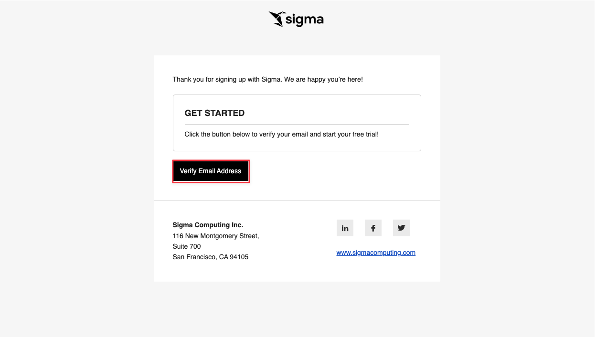 

1.5 You will be prompted to create a URL for your Sigma instance. We recommend you name it something you will remember easily. Then click "Continue".

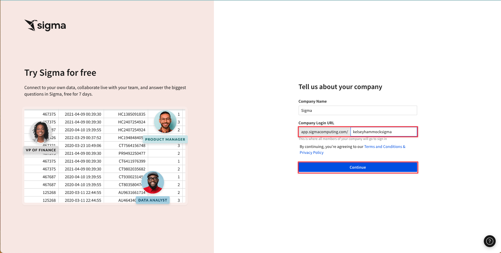 

1.6 Finally, create a password. Then click "Create". 

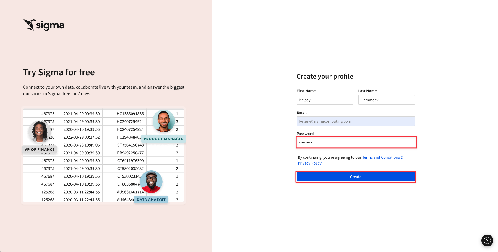

1.7 Close the pop up by clicking "Go to Home Page"

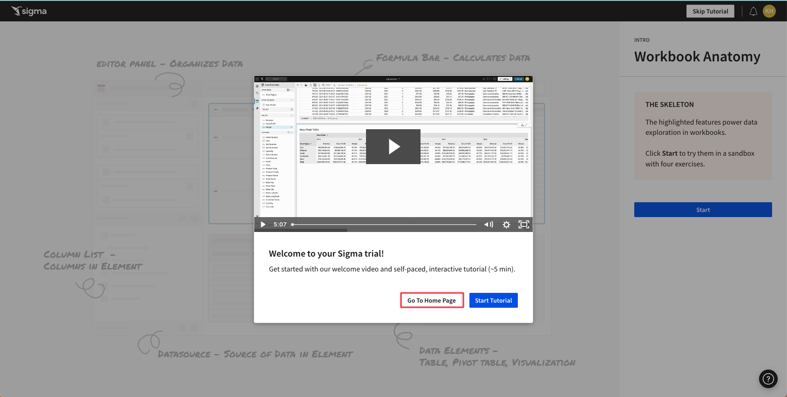

1.8 Click "Hide" to hide the trial guide on the left hand side. 

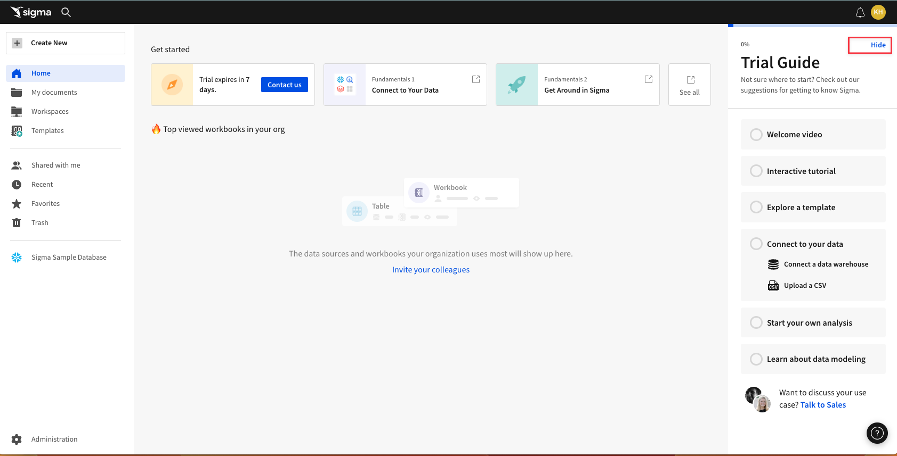


## Exploring the Template

2.1 From the Sigma home page click "Templates" on the lefthand side.

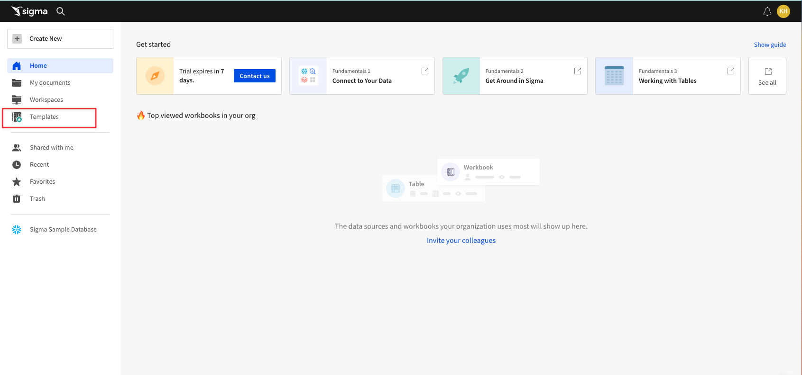

Here you will see the pre-built templates that live in every Sigma instance. Many of these templates can be connected to your Snowflake instance in a couple of clicks, and give insights into things like billing and performance monitoring. 

2.2 Click on "External" at the top then select the "Snowflake Security Monitoring" Template.

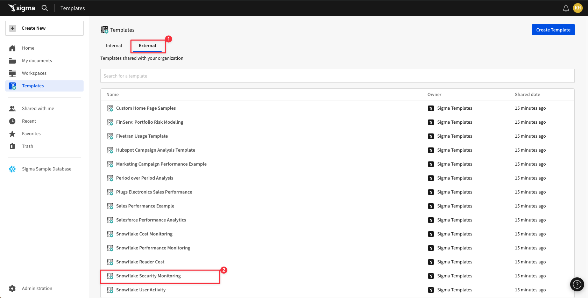

2.3 Click "Dismiss" on the "Use your data" pop up. To begin this lab, we will work with the sample data pre-loaded in the template.

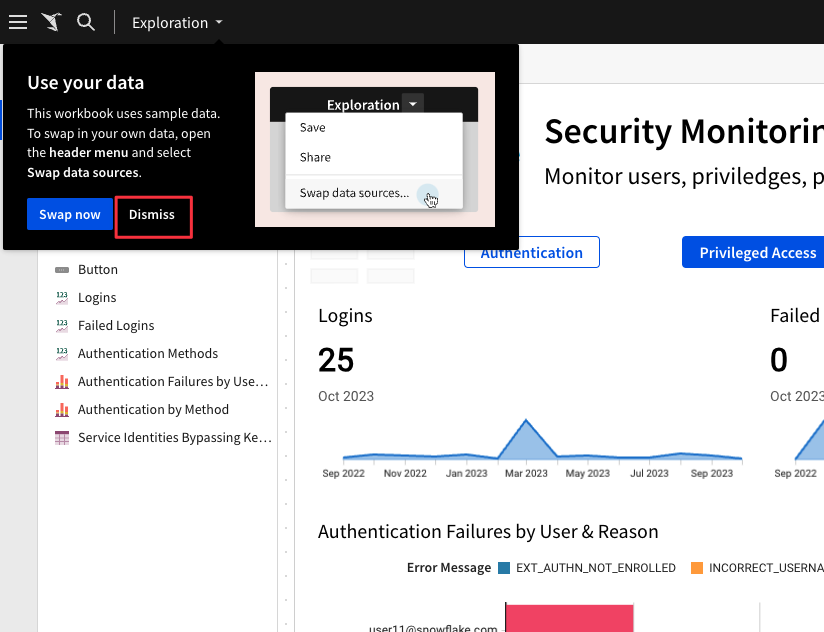

2.4 Click "Save As" in the top right corner.

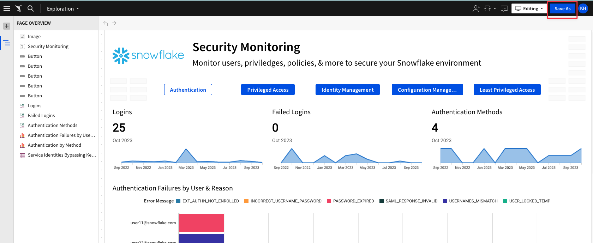

2.5 Give your new workbook a name like "Snowflake Security Exploration" then click "Save" on the bottom right. 

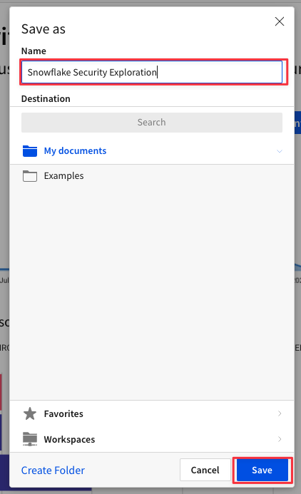

2.6 Once again, click "Dismiss" on the "Use your data" pop up

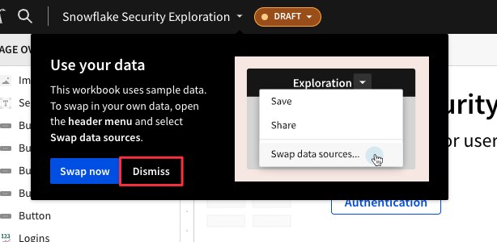

2.7 Let’s take a minute to review the metrics available in the security template right out of the box. The first page you will see covers Authentication, and displays information around how your users are logging into Snowflake, as well as reasons they may be failing to log in to Snowflake. 

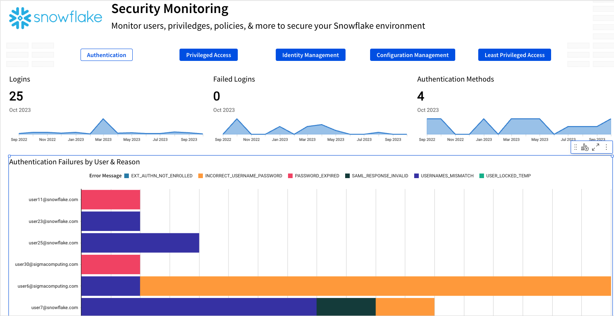

The second page of this template covers Privileged Access. This page is designed to help you monitor the Account Admin role in Snowflake. In Snowflake, Account Admin is the highest level of permissions so maintaining awareness of who has access to this role is key to maintaining your Snowflake security posture. On this page you will see grants of the AccountAdmin role, as well as who performed the grant in case there is need to follow up. You can additionally see if your Account Admins are using MFA to help secure access to your Snowflake instance. 

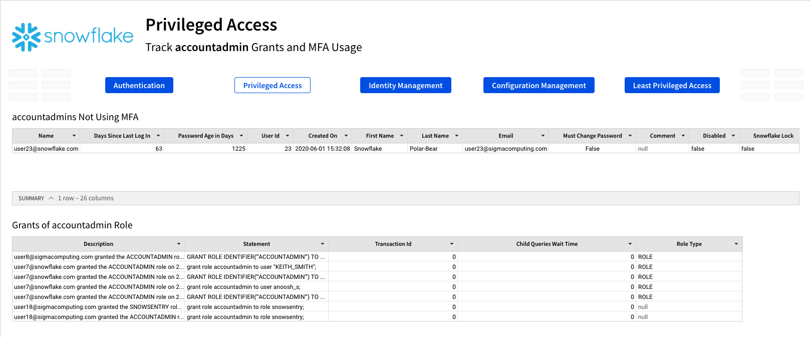

The next page of the template is called Identity Management. This page is designed to help you understand the status of your Snowflake users’ accounts. On this page you will find information like stale users who haven’t logged into Snowflake in quite some time, as well as a list of users who have not changed their passwords, and the amount of time it has been. 

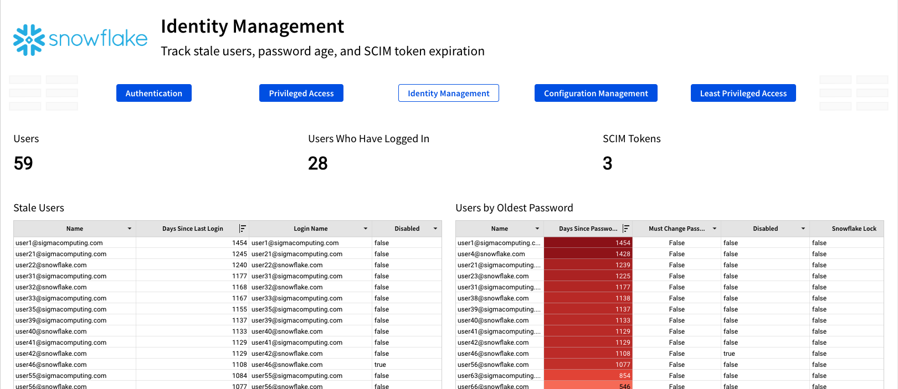

The fourth page is title Configuration Management, and shows you changes made to privileged objects, as well as any network policy changes that have been made, the policy that was changed, and who made the policy change. 

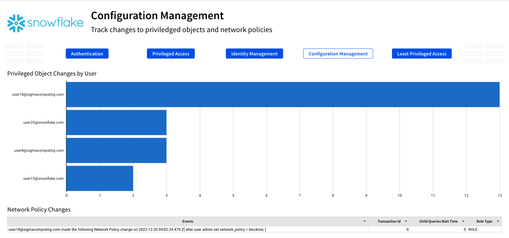

The final page, titled Least Privileged Access, shows you the number of roles users have assigned to them, as well as the roles they are granted and which role they were granted by. We will add additional metrics to this page during this lab. 

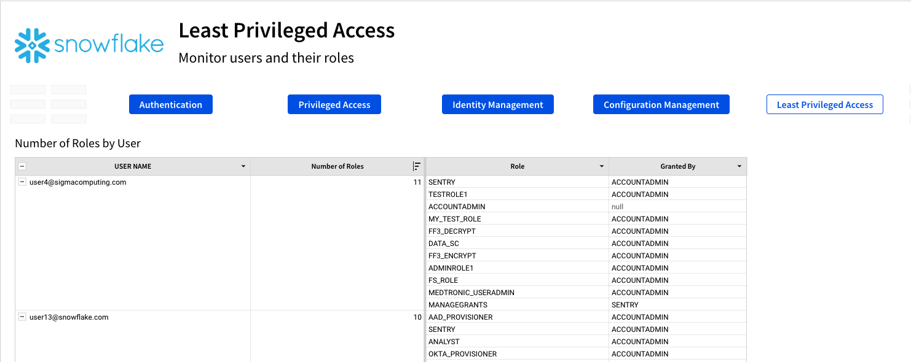

## Customizing the Template

3.1 Using the buttons at the top of the workbook, navigate to the page title "Least Priviledged Access".

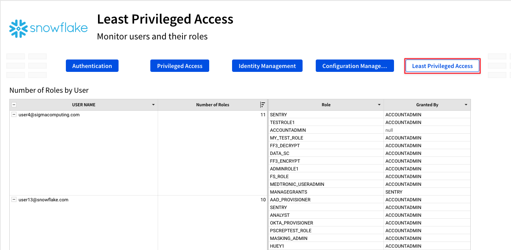

3.2 Click the "+" in the top left corner to add a new element to the workbook. 

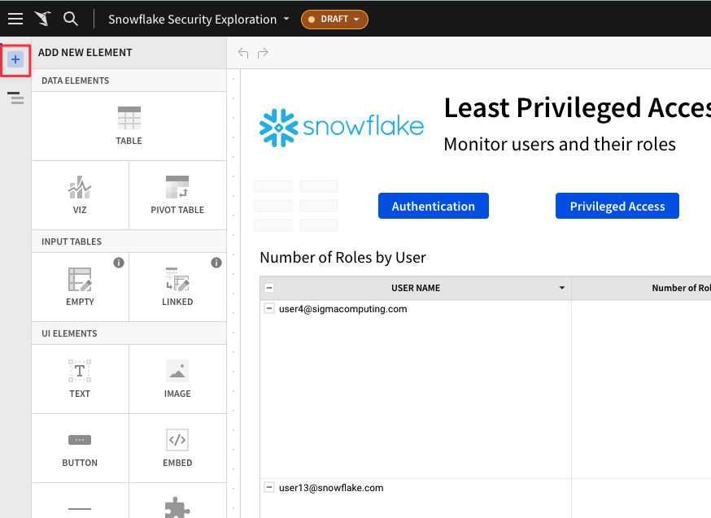

3.3 Select "Table" as the new element to add

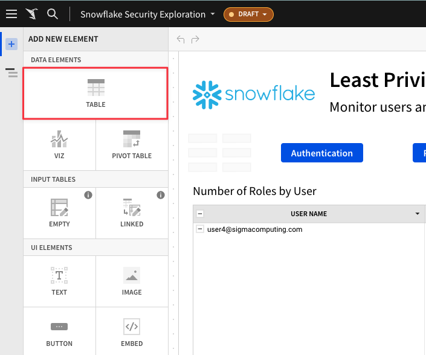

3.4 In Sigma, new elements can be added via direct warehouse connection, data uploads, joins, and more. For this element, click "New" then select "Write SQL" to input the exact sql query for the data we want returned. 

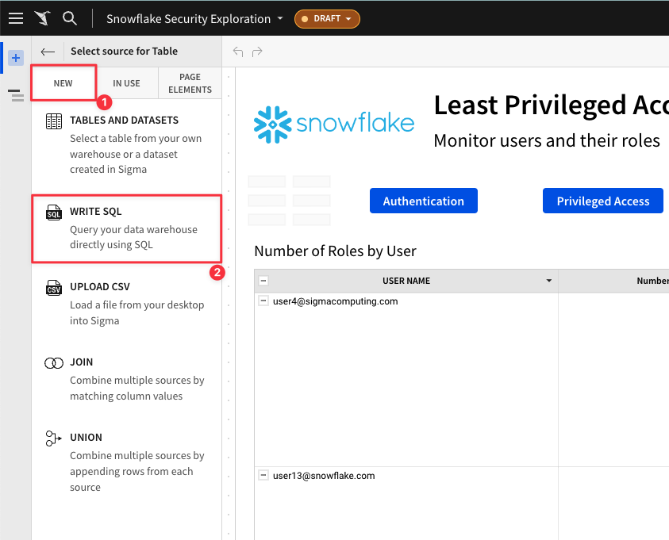 

3.5 Copy and paste the following code into the SQL editor. Then Click "Run". Once your results are returned click "Save". 

```
with role_hier as (
    --Extract all Roles
    select
        grantee_name,
        name
    from
        applications.snowflake_account_usage.grants_to_roles
    where
        granted_on = 'ROLE'
        and privilege = 'USAGE'
        and deleted_on is null
    union all
        --Adding in dummy records for "root" roles
    select
        'root',
        r.name
    from
        applications.snowflake_account_usage.roles r
    where
        deleted_on is null
        and not exists (
            select
                1
            from
                applications.snowflake_account_usage.grants_to_roles gtr
            where
                gtr.granted_on = 'ROLE'
                and gtr.privilege = 'USAGE'
                and gtr.name = r.name
                and deleted_on is null
        )
) --CONNECT BY to create the polyarchy and SYS_CONNECT_BY_PATH to flatten it
,
role_path_pre as(
    select
        name,
        level,
        sys_connect_by_path(name, ' -> ') as path
    from
        role_hier connect by grantee_name = prior name start with grantee_name = 'root'
    order by
        path
) --Removing leading delimiter separately since there is some issue with how it interacted with sys_connect_by_path
,
role_path as (
    select
        name,
        level,
        substr(path, len(' -> ')) as path
    from
        role_path_pre
) --Joining in privileges from GRANT_TO_ROLES
,
role_path_privs as (
    select
        path,
        rp.name as role_name,
        privs.privilege,
        granted_on,
        privs.name as priv_name,
        'Role ' || path || ' has ' || privilege || ' on ' || granted_on || ' ' || privs.name as Description
    from
        role_path rp
        left join applications.snowflake_account_usage.grants_to_roles privs on rp.name = privs.grantee_name
        and privs.granted_on != 'ROLE'
        and deleted_on is null
    order by
        path
) --Aggregate total number of priv's per role, including hierarchy
,
role_path_privs_agg as (
    select
        trim(split(path, ' -> ') [0]) role,
        count(*) num_of_privs
    from
        role_path_privs
    group by
        trim(split(path, ' -> ') [0])
    order by
        count(*) desc
) --Most Dangerous Man - final query
select
    grantee_name as user,
    count(a.role) num_of_roles,
    sum(num_of_privs) num_of_privs
from
    applications.snowflake_account_usage.grants_to_users u
    join role_path_privs_agg a on a.role = u.role
where
    u.deleted_on is null
group by
    user
order by
    num_of_privs desc;
```

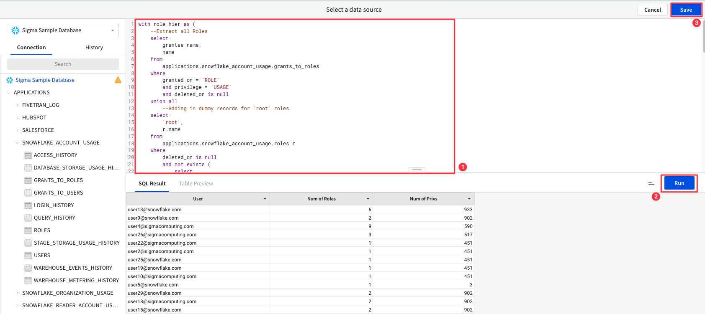

3.6 The SQL we ran took a look at our users, their associated roles, and the priviledges granted to these roles. It then aggregated this data at the User level so that we can see who has the most access to objects across our Snowflake instance. Click on the header for your new workbook element titled "Custom SQL". Rename this object "Most Dangerous Person". 

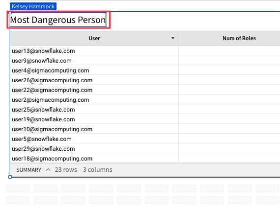

3.7 Now that we have a sense of who has the most privileges on our Snowflake instance, let's take a look at which roles have the most privileges granted to them. 

Following the same process, click the "+" in the top left to add a new element, then select "Table".

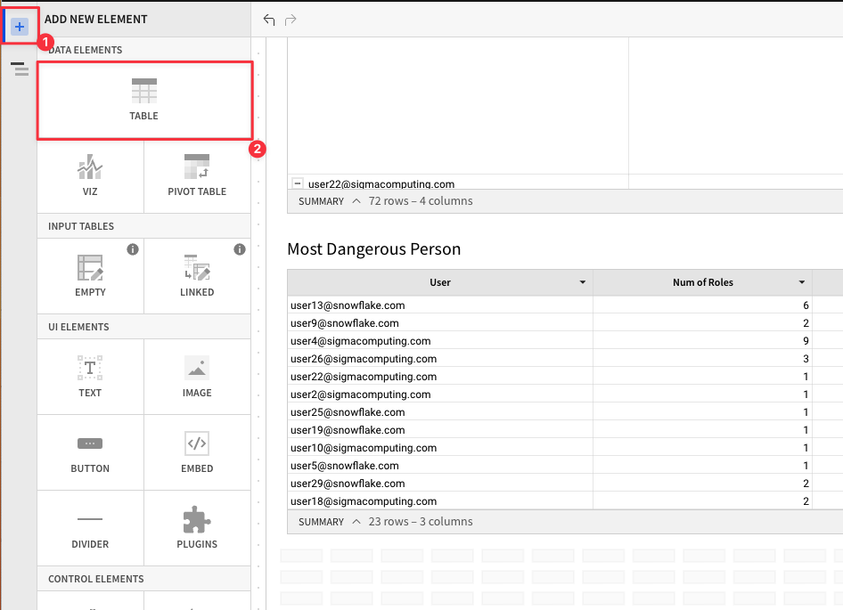 

3.8 Select the "New" tab, then select "Write SQL"

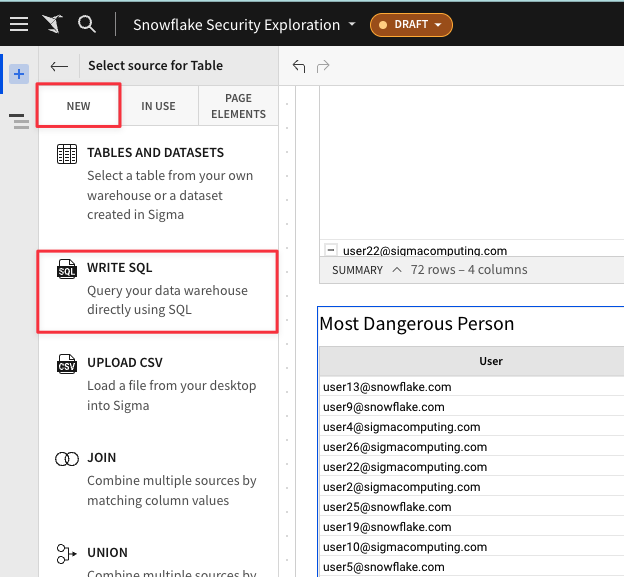

3.9 Input the following code into the SQL editor, then press "run". Once your results populate, click "Save". 

```
--Role Hierarchy
with role_hier as (
    --Extract all Roles
    select
        grantee_name,
        name
    from
        applications.snowflake_account_usage.grants_to_roles
    where
        granted_on = 'ROLE'
        and privilege = 'USAGE'
        and deleted_on is null
    union all
        --Adding in dummy records for "root" roles
    select
        'root',
        r.name
    from
        applications.snowflake_account_usage.roles r
    where
        deleted_on is null
        and not exists (
            select
                1
            from
                applications.snowflake_account_usage.grants_to_roles gtr
            where
                gtr.granted_on = 'ROLE'
                and gtr.privilege = 'USAGE'
                and gtr.name = r.name
                and deleted_on is null
        )
) --CONNECT BY to create the polyarchy and SYS_CONNECT_BY_PATH to flatten it
,
role_path_pre as(
    select
        name,
        level,
        sys_connect_by_path(name, ' -> ') as path
    from
        role_hier connect by grantee_name = prior name start with grantee_name = 'root'
    order by
        path
) --Removing leading delimiter separately since there is some issue with how it interacted with sys_connect_by_path
,
role_path as (
    select
        name,
        level,
        substr(path, len(' -> ')) as path
    from
        role_path_pre
) --Joining in privileges from GRANT_TO_ROLES
,
role_path_privs as (
    select
        path,
        rp.name as role_name,
        privs.privilege,
        granted_on,
        privs.name as priv_name,
        'Role ' || path || ' has ' || privilege || ' on ' || granted_on || ' ' || privs.name as Description
    from
        role_path rp
        left join APPLICATIONS.SNOWFLAKE_ACCOUNT_USAGE.GRANTS_TO_ROLES privs on rp.name = privs.grantee_name
        and privs.granted_on != 'ROLE'
        and deleted_on is null
    order by
        path
) --Aggregate total number of priv's per role, including hierarchy
,
role_path_privs_agg as (
    select
        trim(split(path, ' -> ') [0]) role,
        count(*) num_of_privs
    from
        role_path_privs
    group by
        trim(split(path, ' -> ') [0])
    order by
        count(*) desc
) 
select * from role_path_privs_agg order by num_of_privs desc;
```
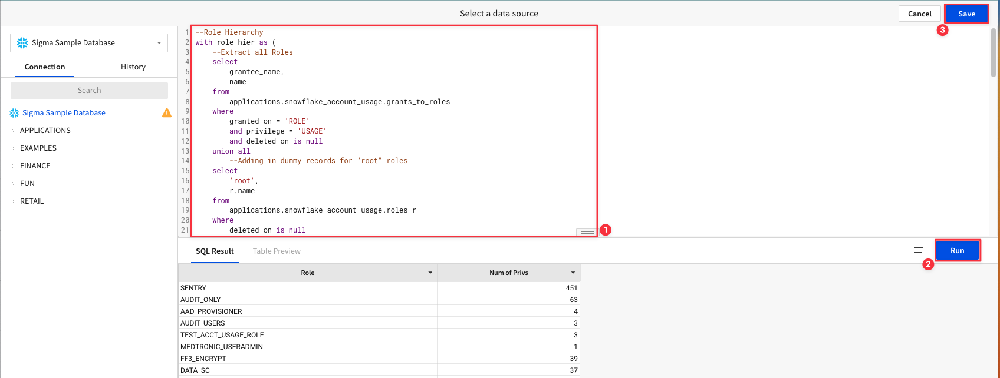

3.10 The SQL we entered to create the new element audited the roles in our Snowflake environment, privileges granted to those roles, and roles granted to each role. It then calculated which role has the most privileges in the account. 
Double click the title of your new element and name it "Most Bloated Role". 

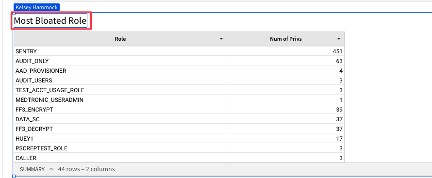

3.11 Drag this new element up so that it sits next to your Most Dangerous Person element. 

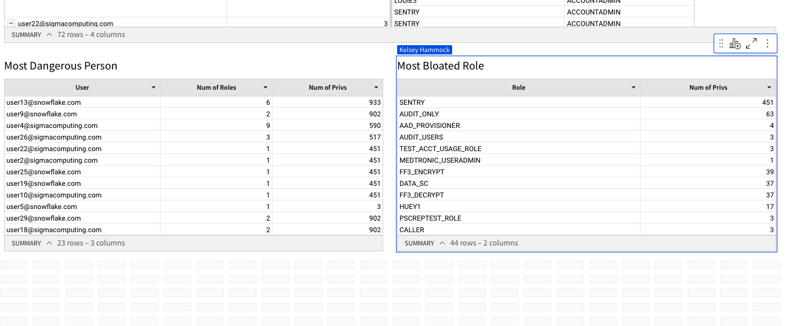 

3.12 Now that we have added new metrics into our workbook, let's take a look at another way this template can be leveraged to keep us up to date on our security posture. Using the buttons at the top of the workbook, navigate to "Identity Management".

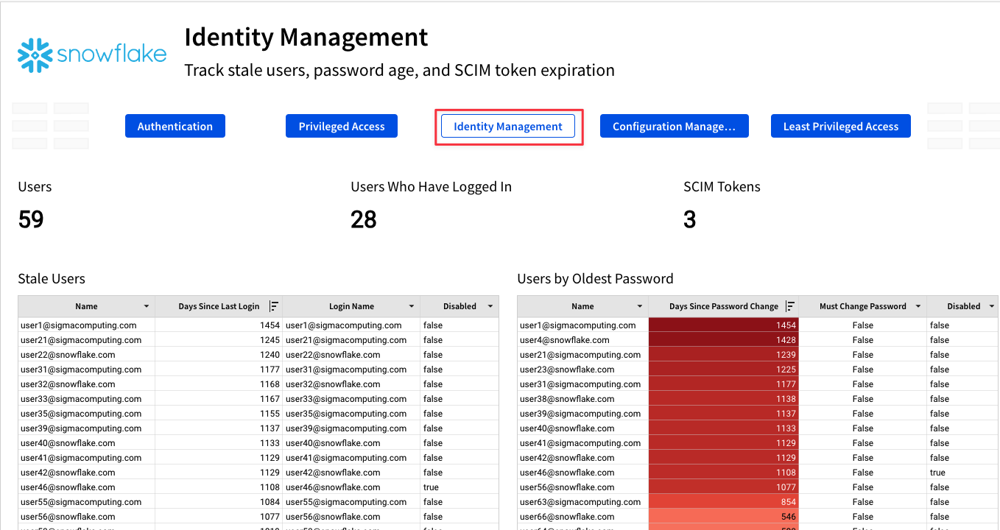

3.13 On the Identity Management page you will notice a tile titled "Users by Oldest Password". This tile shows us each user in our Snowflake instance and how long it has been since they changed their Snowflake password in days. Snowflake admins can set Snowflake password policies on their Snowflake account to require users to change their passwords at a set frequency, however Snowflake's default behavior does not require users to change their passwords. 

For the purpose of this lab, assume we want our users to change their Snowflake password every 180 days. We are going to create an alert that will send us a report of all users with passwords older than 180 days. 

3.14. Select the arrow next to your workbook title in the top of the screen, then select "Schedule Exports" from the dropdown menu. 

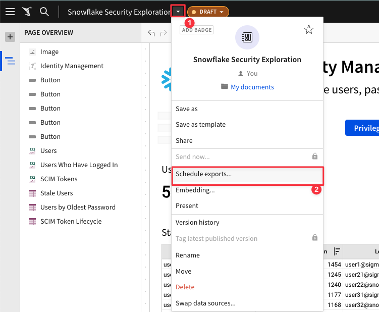

3.15 Click "Add Schedule" 

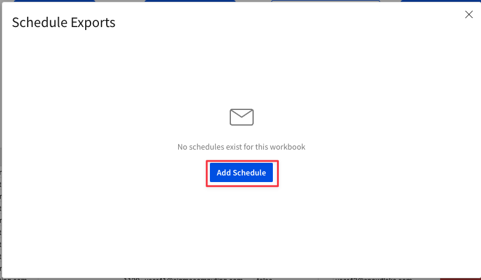

3.16 Give your schedule a name. In the "To" field input YOUR EMAIL ADDRESS. You may then give the email a subject and body if you so choose. 

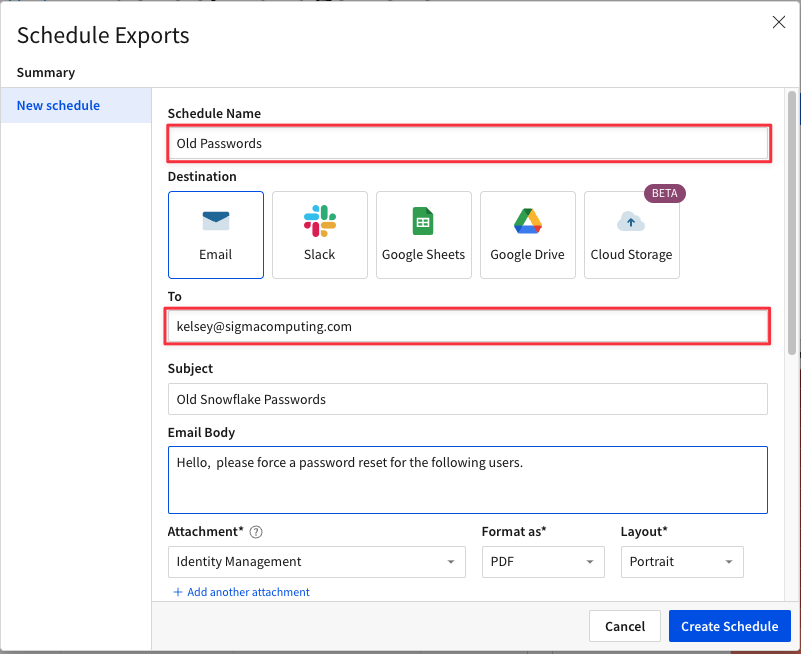

3.17 Using the drop down next to attachment, find the "Identity Management" page and the "Users by Oldest Password" element. 

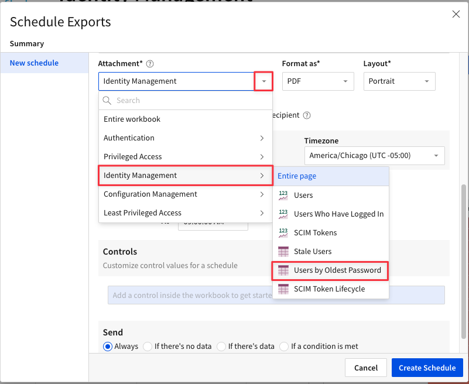

3.18 Using the dropdown next to Timezone, select YOUR time zone. For Occurance, set a time in the next 10mins so that you will see the alert in your inbox before the lab is complete. 

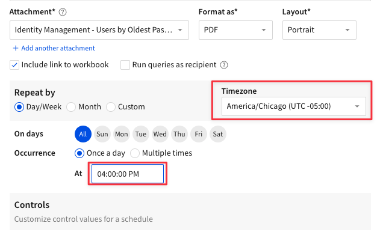

3.19 Next to "Send" select "If a condition is met". For "in data element" use the drop down to find the Users by Oldest Passwords element on the Identity Management page. Then under check if, set it so that "any value" in column "Days Since Password Changed" is "Greater than or equal to" value "180".

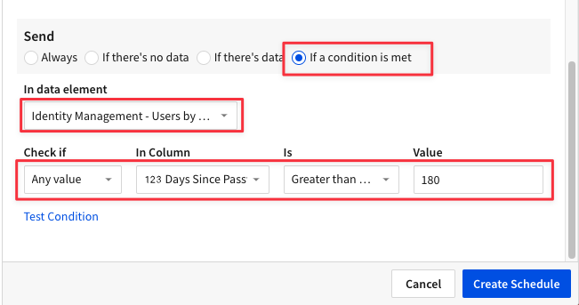 

3.20 Click "Test Condition". Once your data validation check returns "Data that meets condition exists" click "Create Schedule".

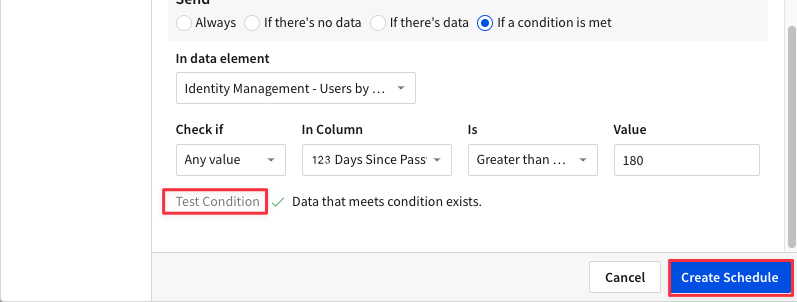 

3.21 You should now see the export you created with an "Active" status. Click the "X" in the top right corner to exit this window. 

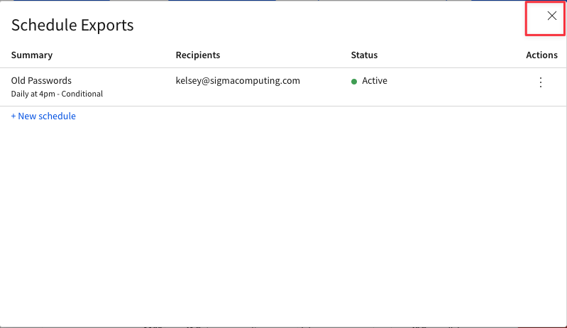 

3.22 Now that we have alerts set up to let us know about old passwords, lets take a look at our "Stale Users" element. This element shows us all users in our Snowflake environment, and how many days it has been since they last logged in. Users who have not logged in are referred to as "stale users", and may reflect users who are no longer with the company or no longer need access to Snowflake. We want to follow best practices by removing these users from our instance, so lets set up a way to triage these users in Sigma.

3.23 Click on the Stale Users element, then hover over the top right corner. Click the center icon for "Add a child element" then select "Linked input table" from the dropdown. 

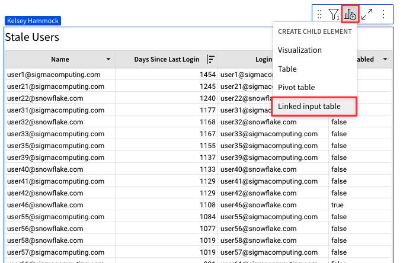 

3.24 Using the drop down next to number 1, select "Name". Under number 2, check the box next to "Days Since Last Login". Then click "Create Input Table".

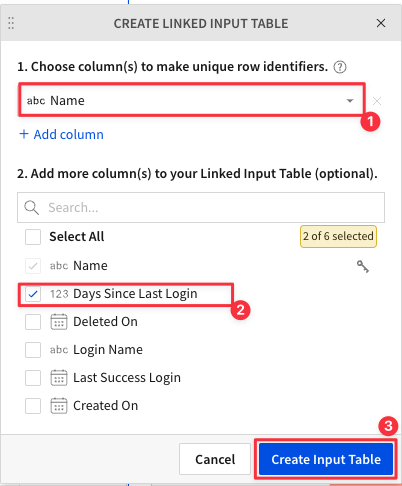 

3.25 Rename your new element "Stale User Triage" by double clicking the header.

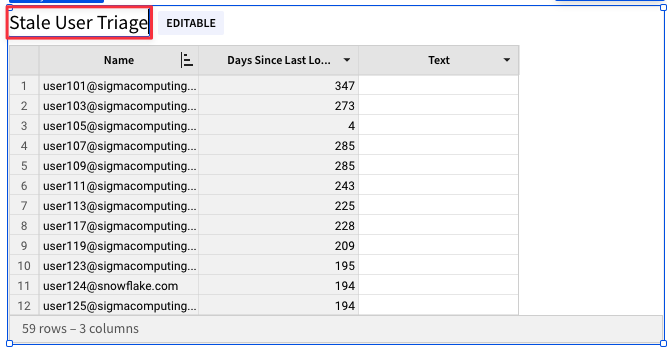

3.26 Click the drop down next to the "Text" column and select "Data Validation".

c

3.27 In the new pop up, enter the values "Investigating", "No Status", Stale User - Please Delete", and "Confirmed Snowflake Access Still Needed" by typing the value then hitting enter. Then click "Save". 

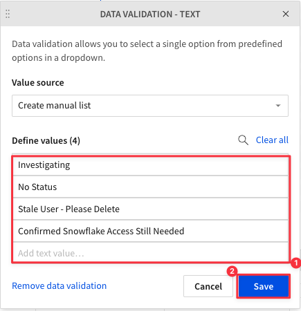

3.28 Double click the column title "Text" and rename it "Triage Status". 

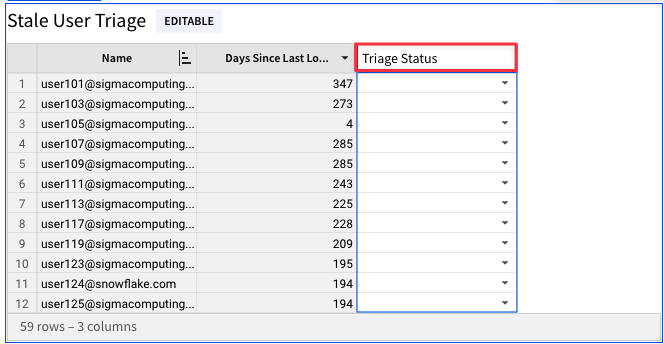

3.29 Click the arrow next to the "Triage Status" column. From the drop down, select "Add New Column - Last Updated By".

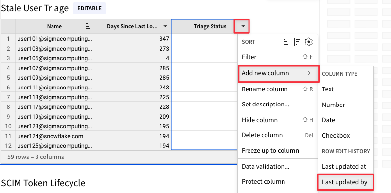


3.30 Click the drop down next to the new "Last Updated By" column and select "Add New Column - Last Updated At".

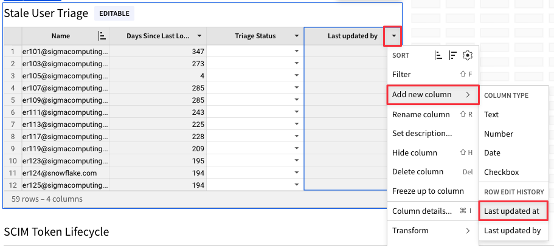

3.31 Click the right side of the element and drag to expand it so that the full table is visible in the element. 

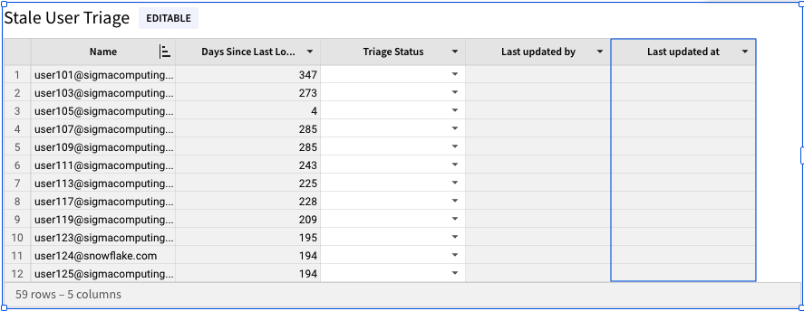 

3.32 Now that we have our triage table created, we can use the drop down to select an investigation status for each user. Once we have done so, we will see the Last Updated By and Last Updated At columns populate. This will enable other members of our team to see the progress of investigating these stale users, when they were last updated, and who made the updates. 

Use the dropdown to update a couple of rows to see this change. 

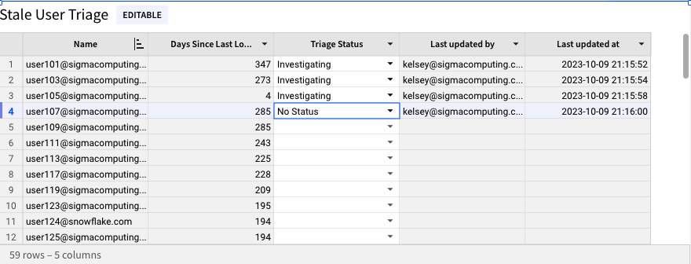 

3.34 Now that we have set an alert and created a triage system, navigate back to the "Least Privileged Access" page by clicking the "Least Priviledged Access" button at the top of the page. 

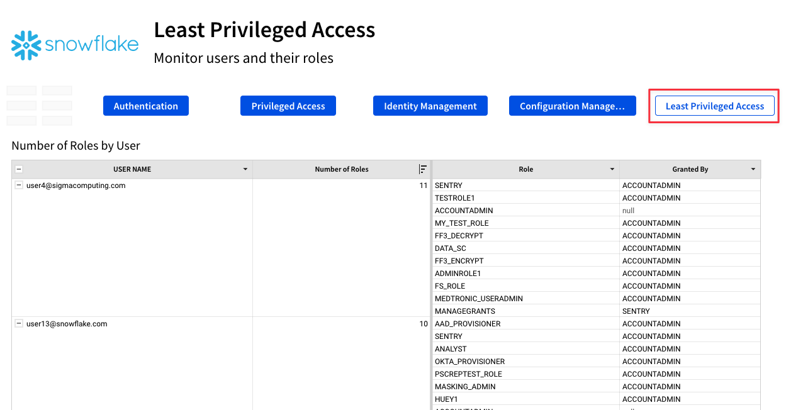

3.35 The top element shows us roles granted to each user in our snowflake instance, as well as who granted each role. Please note, this element only captures roles explicitly granted, and not those inhereted through the granting of another role. 

Next to the "Role" column, click the drop down arrow and then select "Filter".

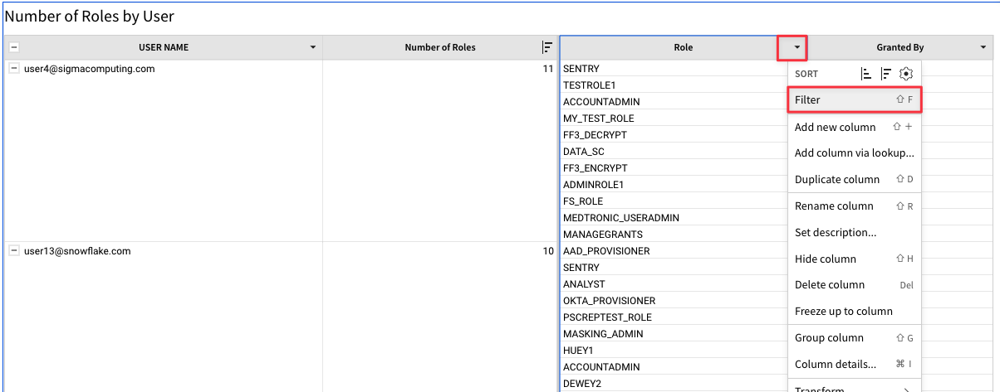 

3.36 Select "ACCOUNTADMIN" from the drop down list. You will see the table filter to only show those users with the ACCOUNTADMIN role granted to them. 

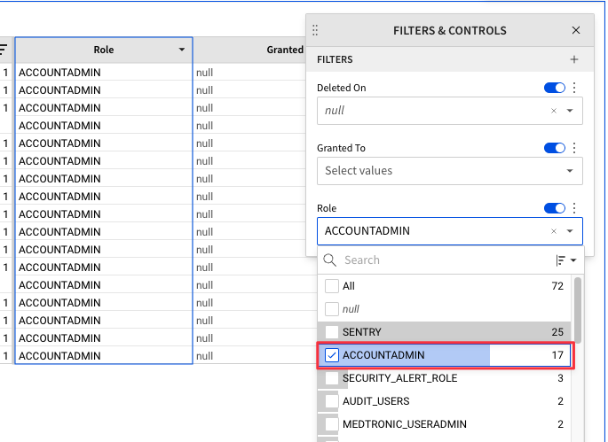 

3.37 Click the "X" on the Filters & Controls box to close the window. 

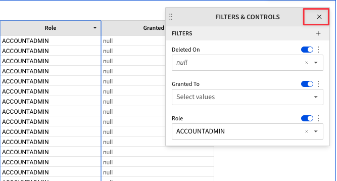 

3.38 For the purposes of this lab, let's assume our organization has decided that only individuals within the IT group should have ACCOUNTADMIN access to the Snowflake environment. We now have a list of users with ACCOUNTADMIN access, but will need to know the department they belong to in the company in order to explore if the users with this priviledge now should maintain it. 

The data for our users departments doesn't live in our Snowflake environmennt, but we can use a blank input table to bring it in. In the top left corner click the "+" icon, then select "Empty" under Input Tables.

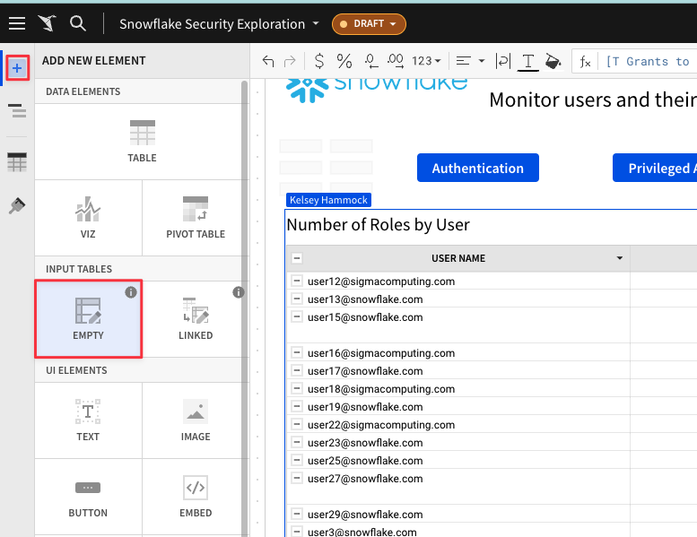 

3.39 Sigma will now prompt you to select a Snowflake connection for the empty input table to leverage. This is because data created or edited in Input tables will be written back to the Snowflake environment. Make sure your connection says "Sigma Sample Database", then click "Create". 

 

3.40 Double click the title for the New Input Table and rename it "User Department Mappings". 

 


3.41 Click here to open a spreadsheet that contains our department mapping data. You should see a spreadsheet with two columns, one for user name and one for department. 


3.42 Select all values in the spreadsheet with the exception of the header rows, and copy them. 


3.43 Returning to our Sigma window, right-click in cell 1 of our User Department Mappings empty input table, and select "Paste".


3.44 You should now see the spreadsheet values in your Sigma input table. Click the "Text" title on the far left column and rename it "Username". Click the "Text(1)" title on the second column and rename it "Department". 


3.45 Scroll back up to our Number of Roles by User element that we filtered to only show our Account Admins. Click the dropdown next to the "Role" column and select "Add a New Column Via Lookup".

 

3.46 Under column to add - "Select Element", use the drop down to select the User Department Mappings table from the Least Privileged Access page.

 

3.47 Select "Department" from the Column to Add drop down. Set the two elements to map on USER NAME = Username. When you see "Keys with Matches 100%" click "Done". 

 

3.48 You can now see each users department in the top table, helping us easily identify users outside of IT who have ACCOUNTADMIN permissions on our Snowflake environment in violation of organization policy. You could easily replicate the steps we used to create a triage for Stale Users to triage these users with Accountadmin.

 

3.49 Click "Publish" in the top right corner to save the work we have done in this lab. 

 

## Connecting the Template to Your Data 

4.1 Click the papercrane in the top left of your workbook to return to the Sigma home page.

 

4.2 Click on your initals in the top right corner. Then select "Administration" from the drop down. 

 

4.3 Select "Connections" from the left-hand menu.


4.4 Click "Create Connection"


4.5 Give your connection a name that will help you identify the Snowflake instance. Then click on the Snowflake icon next to type.

 

4.6 Under Connection Credentials, enter the information for YOUR Snowflake instance. 

Account will be your Snowflake Account Locator. 

For Warehouse enter the name of a Snowflake Warehouse in YOUR environment that YOU have access to. 

For User enter YOUR Snowflake Username. 

For Password enter your SNOWFLAKE password.

And for Role, enter a role that you are granted within your Snowflake environment. 

 

4.7 Once you have entered your connection credentials, click "Create" in the top right corner. 

 

4.8 You will now see the details of the connection you made from Sigma to your Snowflake environment. 

4.9 Click the papercrane icon in the top left corner to return to the Sigma homepage. 

 

4.10 Select "Templates" once again from the far left menu. 


4.11 Click the "External" tab at the top, then select "Snowflake Security Monitoring". 

 

4.12 This time, select "Swap Now" on the Use Your Data popup. 

 

4.13 Sigma will intuitively try to map the data from the template to data in your own Snowflake environment, in this case, the log data in the Account_Usage schema in the Snowflake database within every Snowflake instance. 

Ensure the "Matching Connection" field displays the connection you created to your own Snowflake account. Click "Swap Now".


4.14 You will now see the workbook elements reload, and the data update to reflect the activity in YOUR snowflake instance rather than the sample data we explored earlier in the lab. 

 

4.15 Click "Save As" in the top right, and give this workbook a name. Then click "Save".


4.16 You may click "Dismiss" on the Use Your Data popup after you have saved the version.

 You now have a version of the workbook reading from your own data that you can use to explore the existing security metrics, add new metrics as we did throughout the lab, create a triage scenario, and more. 

 

4.17 Prior to closing down, check your email inbox to see the alert set up in section 3 for Users with Old Passwords. 

 

## Conclusion 

We hope this lab has helped you understand how data within your Snowflake environment can be leveraged in Sigma for security insights. By working with Sigma templates, you are able to instantly gain insights into your Snowflake security posture. You can additionally customize these insights, add new metrics, and more to make the workbook shine for your use case. 
