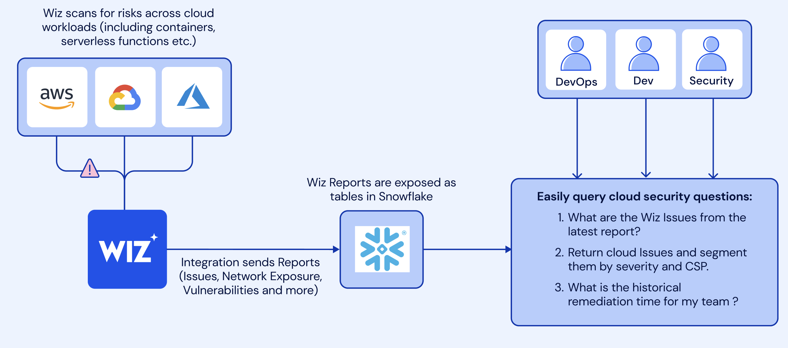
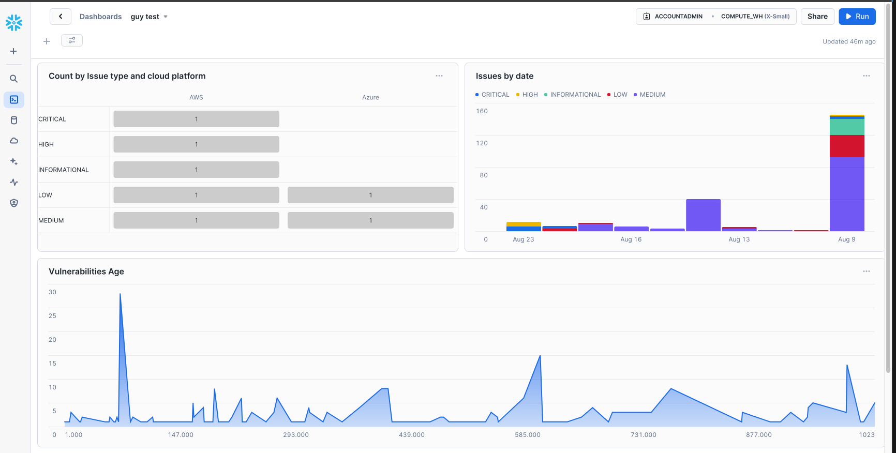

author: Guy Mast 
id: security_analytics_with_wiz_and_snowflake
summary: learn about the Wiz and Snowflake integration for analyzing Wiz data in Snowflake
categories: cybersecurity,solution-examples,partner-integrations
environments: web
status: Hidden 
feedback link: https://github.com/Snowflake-Labs/sfguides/issues
tags: Getting Started, Security, Wiz, Security Data Lake

# Security Analytics with Wiz and Snowflake
<!-- ------------------------ -->
## Overview 
Duration: 1

In this guide, you’ll learn how to upload Wiz data into Snowflake tables using the Snowflake and Wiz integration. This integration enables teams using Wiz to store Wiz Issues, vulnerability data host configuration findings and other findings data in Snowflake for historical analysis and other security analytics use cases such as:
1. Incident response
2. Custom security reports
3. Analysis for business-critical security SLAs

### Prerequisites
1. Basic knowledge of SQL, and database concepts and objects
2. Familiarity with Snowsight UI so that you can execute the SQL queries and build visualizations

### What You’ll Learn 
- Load Wiz data into your Snowflake security data lake 
- Query Wiz data in Snowflake 
- Build visualizations on top of it in Snowflake 

### What You’ll Need 
- Snowflake account

### Architecture

Wiz scans cloud workloads and generate Issues and security findings which then are being sent into Snowflake tables via the Wiz and Snowflake native integrtaion.

### What You’ll Build 
- A worksheet with useful queries on Wiz Issues and security findings data in Snowflake
- a Snowsight dashbaord that will be powered by these queries
<!-- ------------------------ -->
## Setting up Snowflake
Duration: 3

The first thing you will need to do is to download the following .sql [file](<insert URL here>)
that contains a series of SQL commands we will execute throughout this lab.

At this point, log into your Snowflake account and have a clear screen to start working with. If you have just created a free trial account, feel free to minimize or close and hint boxes that are looking to help guide you. These will not be needed for this lab and most of the hints will be covered throughout the remainder of this exercise.

To ingest our script in the Snowflake UI, navigate to the plus button on the top right hand side of a "SQL Worksheet” and load our script.
The SQL script file should show up as text in a new worksheet.

Let's go ahead and set the role we want to act as, which will be `SECURITYADMIN` to begin with. We can either set this either manually by hovering over the people icon and choosing SECURITYADMIN from the “Role” dropdown, or we can run the first line of code in our worksheet. In addition to traditional SQL statements, Snowflake Data Definition ([DDL](https://docs.snowflake.com/en/sql-reference/sql-ddl-summary.html)) commands, such as setting the worksheet context, can also be written and executed within the worksheet. 

For convenience all the SQL commands needed are already in the SQL script. Let's execute the first SQL command in the SQL script.

```sql
USE ROLE SECURITYADMIN;
```

To execute this code, all we need to do is place our cursor on the line we wish to run and then either hit the "run" button at the top left of the worksheet or press `Cmd/Ctrl + Enter/Return`. 
Each step throughout the guide has an associated SQL command to perform the work we are looking to execute, and so feel free to step through each action running the code line by line as we walk through the lab. For the purposes of this demo, we will not be running multiple statements in a row.

<!-- ------------------------ -->
## Creating Snowflake Role, User, Database & Warehouse
Duration: 5

To get started, we are going to create the Snowflake objects for this lab. You can create objects using the UI, but for the purposes of this lab we will use Snowflake DDL commands in the SQL script file that we downloaded in the previous step. 

We already switched our "role" to `SECURITYADMIN`, a role typically used to create users and roles in the Snowflake account. We will now create our primary ROLE and USER that will be used by the Cloud Security Analyst persona. We will also grant the CLOUD_SECURITY_ANALYST role to the SYSADMIN role to make administration easier. Highlight and execute both commands.

```sql
CREATE OR REPLACE ROLE CLOUD_SECURITY_ANALYST_ROLE COMMENT='CLOUD SECURITY ANALYST ROLE';
GRANT ROLE CLOUD_SECURITY_ANALYST_ROLE TO ROLE SYSADMIN;
```

Next we will create the `CLOUD_SECURITY_ANALYST` user, and grant the `CLOUD_SECURITY_ANALYST_ROLE` role to this user. Please note the password that is set for the user, feel free to change the password to your preference, but **do note this password** as it will be used in future steps to configure the connections with Tableau CRM.

```sql
CREATE OR REPLACE USER CLOUD_SECURITY_ANALYST PASSWORD='SNOW1234' 
    DEFAULT_ROLE=CLOUD_SECURITY_ANALYST_ROLE 
    DEFAULT_WAREHOUSE=WIZ_LAB_WH
    DEFAULT_NAMESPACE=WIZDB.PUBLIC
    MUST_CHANGE_PASSWORD = FALSE
    COMMENT='CLOUD SECURITY ANALYST USER';
GRANT ROLE CLOUD_SECURITY_ANALYST_ROLE TO USER CLOUD_SECURITY_ANALYST;
```

We will now switch to the `SYSADMIN` role to create the database and schema needed. Databases and Schemas are storage structures used in Snowflake to store and manage objects such as Tables, Views, Stages, Sequences, etc. We will also grant the `CLOUD_SECURITY_ANALYST` the necessary privileges on these structures.

```sql
USE ROLE SYSADMIN;
CREATE OR REPLACE DATABASE WIZDB;
CREATE OR REPLACE SCHEMA WIZDB.WIZSCHEMA;

GRANT USAGE ON DATABASE WIZDB TO ROLE CLOUD_SECURITY_ANALYST_ROLE;
GRANT ALL ON SCHEMA WIZDB.WIZSCHEMA TO ROLE CLOUD_SECURITY_ANALYST_ROLE;
```

Next we will create a Snowflake WAREHOUSE that will be used. In Snowflake a WAREHOUSE is a compute cluster that can be instantaneously start/stopped or scaled up/down as needed. WAREHOUSES only perform compute work, while all data is managed and stored in DATABASES, as Snowflake has complete separation between storage and compute to allow for fast and flexible independent scaling. We will also grant the CLOUD_SECURITY_ANALYST_ROLE usage privileges on the WAREHOUSE.

**TIP:** It is typically a good idea to create all warehouses with the `AUTO_SUSPEND` and `AUTO_RESUME` properties set to avoid using compute resources when not needed.

```sql
CREATE OR REPLACE WAREHOUSE WIZ_LAB_WH
      WITH WAREHOUSE_SIZE = 'XSMALL'
      AUTO_SUSPEND = 300
      AUTO_RESUME = TRUE;

GRANT USAGE ON WAREHOUSE WIZ_LAB_WH TO ROLE CLOUD_SECURITY_ANALYST_ROLE;
```

The warehouse is now ready to use.

<!-- ------------------------ -->
## Load Wiz data into Snowflake
Duration: 5

Mutual Snowflake and Wiz customers usually use Wiz's native Snowflake integration in order to automatically ingest Wiz reports data into Snowflake. In this lab we'll skip the part of creating the Snowflake integration in Wiz and start from creating the tables in Snowflake with a syntethic Wiz data we generated for this lab.

First we will set our context to the `CLOUD_SECURITY_ANALYST_ROLE`, and the `WIZ_LAB_WH` database and `WIZSCHEMA` schema.

```sql
USE ROLE CLOUD_SECURITY_ANALYST_ROLE;
USE WAREHOUSE WIZ_LAB_WH;
USE WIZDB.WIZSCHEMA;
```
Next we will create the `WIZISSUES`, `WIZVULNERABILITIES`, `WIZ` tables to load the data into the tables into Snowflake using the `COPY` command. We will use one of the predefined Snowflake file formats for CSV files to do this.

```sql
CREATE OR REPLACE TABLE WIZDB.WIZSCHEMA.WIZISSUES (
	CREATED_AT VARCHAR(16777216),
	TITLE VARCHAR(16777216),
	SEVERITY VARCHAR(16777216),
	STATUS VARCHAR(16777216),
	RESOURCE_TYPE VARCHAR(16777216),
	RESOURCE_EXTERNAL_ID VARCHAR(16777216),
	SUBSCRIPTION_ID VARCHAR(16777216),
	PROJECT_IDS VARCHAR(16777216),
	PROJECT_NAMES VARCHAR(16777216),
	RESOLVED_TIME VARCHAR(16777216),
	RESOLUTION VARCHAR(16777216),
	RESOURCE_NAME VARCHAR(16777216),
	RESOURCE_REGION VARCHAR(16777216),
	RESOURCE_STATUS VARCHAR(16777216),
	RESOURCE_PLATFORM VARCHAR(16777216),
	RESOURCE_OS VARCHAR(16777216),
	ISSUE_ID VARCHAR(16777216),
	RESOURCE_VERTEX_ID VARCHAR(16777216),
	TICKET_URLS VARCHAR(16777216),
	NOTE VARCHAR(16777216),
	DUE_AT VARCHAR(16777216),
	SUBSCRIPTION_NAME VARCHAR(16777216),
	WIZ_URL VARCHAR(16777216),
	CLOUD_PROVIDER_URL VARCHAR(16777216),
	RESOURCE_TAGS VARCHAR(16777216),
	KUBERNETES_CLUSTER VARCHAR(16777216),
	KUBERNETES_NAMESPACE VARCHAR(16777216),
	CONTAINER_SERVICE VARCHAR(16777216),
	REPORT_RUN_ID VARCHAR(16777216)
);
COPY INTO WIZDB.WIZSCHEMA.WIZISSUES
FROM s3://sfquickstarts/<new_location>/wizissues.csv
FILE_FORMAT = (TYPE = 'CSV', SKIP_HEADER = 1);
```
```sql
CREATE OR REPLACE TABLE WIZDB.WIZSCHEMA.WIZVULNERABILITIES (
	ID VARCHAR(16777216),
	WIZURL VARCHAR(16777216),
	NAME VARCHAR(16777216),
	CVSSSEVERITY VARCHAR(16777216),
	HASEXPLOIT VARCHAR(16777216),
	HASCISAKEVEXPLOIT VARCHAR(16777216),
	FINDINGSTATUS VARCHAR(16777216),
	VENDORSEVERITY VARCHAR(16777216),
	FIRSTDETECTED VARCHAR(16777216),
	LASTDETECTED VARCHAR(16777216),
	RESOLVEDAT VARCHAR(16777216),
	RESOLUTIONREASON VARCHAR(16777216),
	REMEDIATION VARCHAR(16777216),
	LOCATIONPATH VARCHAR(16777216),
	DETAILEDNAME VARCHAR(16777216),
	VERSION VARCHAR(16777216),
	FIXEDVERSION VARCHAR(16777216),
	DETECTIONMETHOD VARCHAR(16777216),
	LINK VARCHAR(16777216),
	PROJECTS VARCHAR(16777216),
	ASSETID VARCHAR(16777216),
	ASSETNAME VARCHAR(16777216),
	ASSETREGION VARCHAR(16777216),
	PROVIDERUNIQUEID VARCHAR(16777216),
	CLOUDPROVIDERURL VARCHAR(16777216),
	CLOUDPLATFORM VARCHAR(16777216),
	STATUS VARCHAR(16777216),
	SUBSCRIPTIONEXTERNALID VARCHAR(16777216),
	SUBSCRIPTIONID VARCHAR(16777216),
	SUBSCRIPTIONNAME VARCHAR(16777216),
	TAGS VARCHAR(16777216),
	EXECUTIONCONTROLLERS VARCHAR(16777216),
	EXECUTIONCONTROLLERSSUBSCRIPTIONEXTERNALIDS VARCHAR(16777216),
	EXECUTIONCONTROLLERSSUBSCRIPTIONNAMES VARCHAR(16777216),
	OPERATINGSYSTEM VARCHAR(16777216),
	IPADDRESSES VARCHAR(16777216),
	REPORT_RUN_ID VARCHAR(16777216)
);
COPY INTO WIZDB.WIZSCHEMA.WIZVULNERABILITIES
FROM s3://sfquickstarts/<new_location>/wizvulnerabilties.csv
FILE_FORMAT = (TYPE = 'CSV', SKIP_HEADER = 1);
```
```sql
CREATE OR REPLACE TABLE WIZDB.WIZSCHEMA.WIZ_HOST_CONFIGURATION_FINDINGS (
	ID VARCHAR(16777216),
	ANALYZEDAT VARCHAR(16777216),
	RESOURCENAME VARCHAR(16777216),
	RESOURCECLOUDPROVIDERID VARCHAR(16777216),
	RESOURCETYPE VARCHAR(16777216),
	RESOURCENATIVETYPE VARCHAR(16777216),
	RESOURCEREGION VARCHAR(16777216),
	RESULT VARCHAR(16777216),
	RULENAME VARCHAR(16777216),
	SEVERITY VARCHAR(16777216),
	RULEID VARCHAR(16777216),
	RULEEXTERNALID VARCHAR(16777216),
	REMEDIATION VARCHAR(16777216),
	FRAMEWORKS VARCHAR(16777216),
	PROJECTNAMES VARCHAR(16777216),
	CLOUDPROVIDER VARCHAR(16777216),
	SCOPEOBJECTTYPE VARCHAR(16777216),
	SCOPEOBJECTID VARCHAR(16777216),
	SCOPEOBJECTPROVIDERID VARCHAR(16777216),
	FIRSTSEEN VARCHAR(16777216),
	UPDATEDAT VARCHAR(16777216),
	WORKLOADSCANNERSTATUS VARCHAR(16777216),
	WORKLOADSCANNERDESCRIPTION VARCHAR(16777216),
	DYNAMICSCANNERSTATUS VARCHAR(16777216),
	DYNAMICSCANNERDESCRIPTION VARCHAR(16777216),
	REPORT_RUN_ID VARCHAR(16777216)
);
COPY INTO WIZDB.WIZSCHEMA.WIZVULNERABILITIES
FROM s3://sfquickstarts/<new_location>/wizhostconfigurations.csv
FILE_FORMAT = (TYPE = 'CSV', SKIP_HEADER = 1);
```

Lastly, lets create the WIZ_REPORTS_RUNS table and then load the data.

```sql
CREATE OR REPLACE TABLE WIZDB.WIZSCHEMA.WIZ_REPORT_RUNS (
	REPORT_RUN_ID VARCHAR(16777216) NOT NULL,
	REPORT_ID VARCHAR(16777216),
	START_TIME TIMESTAMP_NTZ(9),
	END_TIME TIMESTAMP_NTZ(9),
	STATUS VARCHAR(16777216),
	MESSAGE VARCHAR(16777216),
	primary key (REPORT_RUN_ID)
);
COPY INTO WIZDB.WIZSCHEMA.WIZ_REPORT_RUNS
FROM s3://sfquickstarts/<new_location>/wizreportruns.csv
FILE_FORMAT = (TYPE = 'CSV', SKIP_HEADER = 1);
```


<!-- ------------------------ -->
## Querying Wiz data in Snowflake
In the upcoming steps we'll query different Wiz data sources, but first let's understand the Wiz data we we'll be working with:
- Wiz issues - a real risk in the cloud environment made of toxic combinations of diffrenet risks misconfigurations, vulnerabilities, network, identities and access, secrets, and more across accounts, users, workloads, APIs and critical data. This data is the data you would like most like to start with as it highlights to most significant risks to your environment.
- Vulnerabilties - information on resloved and unresolved vulnerabilties found in scanned environements. 
- Host configuration findings -  information about OS and app-level configuration risks. 

<!-- ------------------------ -->
## Monitor reports runs
Wiz reports are automatically pushed into Snowflake tables. We can use the wiz_report_runs table to monitor report execution and Wiz data ingestion into Snowflake. Let's first get a feel for how the data looks:
```sql
select * from WIZDB.WIZSCHEMA.WIZ_REPORTS_RUN limit 10;
```
Each row contains information about the report run start and end time, the report execution status, the report ID, and the specific run ID.

Now, let's see the existing status and message combinations:
```sql
select status,message 
from WIZDB.WIZSCHEMA.wiz_report_runs 
group by 1,2;
```

<!-- ------------------------ -->
## Querying the Issues table
Duration: 1
Wiz issues represent real risks in the cloud environment, combining various risk factors such as misconfigurations, vulnerabilities, and more across accounts, users, workloads, APIs, and critical data. These are the risks you should prioritize for fixing.

### Identifying Critical Issues
Let's start by looking at specific issue with the ID 12341234. Let's see how often this issue appears across different report runs:


```sql
select report_run_id, count(*)
from WIZDB.WIZSCHEMA.WIZISSUES
where issue_id = '12341234'
group by 1;
```
For seeing only the record from the last report we can can this ISSUES_LATEST view:

```sql
CREATE OR REPLACE view WIZDB.WIZSCHEMA.ISSUES_LATEST as 
with latest_issue_report as (
    select wrr.report_run_id as run_id 
    from WIZDB.WIZSCHEMA.issues 
        join wiz_report_runs wrr on issues.report_run_id = wrr.report_run_id 
    order by wrr.start_time desc limit 1
)
```
Now if we'll look for `issueID ='12341234'` in the `WIZDB.WIZSCHEMA.ISSUES_LATEST` table we can see the latest information we got on this Issue.

```sql
select *
from WIZDB.WIZSCHEMA.ISSUES_LATEST
where issue_id = '12341234'
```
### Historical Analysis of Issues


In this example we used the WIZDB.WIZSCHEMA.ISSUES_LATEST view for seeing only the issues that appeaed in the last Issues report, but what if we would like to get an historical view for Issues?
For that can create a new `ISSUES_HISTORICAL` view that will hold for each Issues the information from the last report where it appeared even if it didn't appear in recent reports.

```sql
-- the most recent version of all issues including those no longer being reported on post 30 days
CREATE OR REPLACE view WIZDB.WIZSCHEMA.ISSUES_HISTORICAL as
select * from
(
select issues.*, 
    row_number() over (partition by issues.issue_id order by wrr.start_time desc) as row_number
from
    WIZDB.WIZSCHEMA.WIZISSUES
    join wiz_report_runs wrr on issues.report_run_id = wrr.report_run_id
) where row_number = 1;
```

With this view, we can start answering questions about issue trends over time. For example, let's see the number of issues per day, broken down by severity:

```sql
--issues identified by day
select count(*),severity,created_at::date as day 
from WIZDB.WIZSCHEMA.ISSUES_HISTORICAL 
group by day,severity;
```

We can visualize the data to see trends more clearly - click on the `Chart` option in the results panel and create a line chart to better understand the issues trend.

### Identifying High-Risk Platforms

Another interesting analysis is to understand which cloud platform and subscriptions historcally hold most of critical cloud security risk.
For doing that, we can count the number of critical issues by the cloud platform using the following query:

```sql
--Issues found on the cloud platforms along with their severity
select 
        resource_platform, 
        severity,
       count(issue_id) 
from WIZDB.WIZSCHEMA.ISSUES_HISTORICAL
WHERE resource_platform IS NOT NULL AND resource_platform != '' and severity = 'CRITICAL'
GROUP BY 1,2;
```
Visualizing this data helps identify platforms with the highest risk - click on the `Chart` option in the results panel and create a bar chart to see cloud platform with most of Issues.
We can see that AWS currently holds most the critial risks - let's add the subsrciption column to the query to identifiy the AWS subscription with most of critial issues.

```sql
select 
        resource_platform, 
        subscription_name,
        severity,
       count(issue_id) 
from WIZDB.WIZSCHEMA.ISSUES_HISTORICAL 
WHERE resource_platform IS NOT NULL AND resource_platform != '' and severity = 'CRITICAL' and resource_platform = 'AWS'
GROUP BY 1,2,3;
```
We can see that the avc subscription has most of the critical issues.

### Most Common Issue Types
Knowing the most frequent issue types helps focus remediation efforts. Let's see the most common issue types across all data:

```sql
SELECT
    TITLE,
    SEVERITY,
    COUNT(*) AS ISSUE_COUNT
FROM WIZDB.WIZSCHEMA.ISSUES_HISTORICAL
GROUP BY TITLE, SEVERITY
ORDER BY ISSUE_COUNT DESC;
```

We can see that the most comon issue type is "Exposed Vm's with Critical vulnerability".
<!-- ------------------------ -->
## Querying the vulnerabilities table
In the last section we saw that the most comon issue type is "Exposed Vm's with Critical vulnerability". Let's use the vulnerabilities table go get a better understadning the vulnerability related information that Wiz ingested into Snowflake. The Vulnerabilities data provide insights into both resolved and unresolved vulnerabilities in your cloud environment. 
First, let's have a look at the data:

```sql
select * 
from WIZDB.WIZSCHEMA.WIZVULNERABILTIIES 
limit 100; 
```
we can see in the table the information about resouce where the cve was found, the cve severity, status and when the vulnerability was first and last detected on the resouce and remediation steps as well. 
Similar the what we did with the Issues tables, let's also create an historical view for the vulnerabilities data.

```sql
CREATE OR REPLACE view WIZDB.WIZSCHEMA.VULNERABILITIES_HISTORICAL as
select * from
(
select vulns.*, 
    row_number() over (partition by vulns.id order by wrr.start_time desc) as row_number
from
   WIZDB.WIZSCHEMA.WIZVULNERABILITIES vulns
    join  WIZDB.WIZSCHEMA.wiz_report_runs wrr on vulns.report_run_id = wrr.report_run_id
) where row_number = 1;
```
Now, let's slice and dice the data to get some insights on our vulnerabilities data. When dealing with vulnerabilities, it's crucial to understand their SLA and the time it took to resolve them. This can help prioritize and track the effectiveness of remediation efforts.

```sql
select
    oldest_vuln_age,
    count(*)
from (
    select
        assetname,
        max(datediff('day', firstdetected, lastdetected)) as oldest_vuln_age
    from WIZDB.WIZSCHEMA.VULNERABILITIES_HISTORICAL
    group by assetname
    order by oldest_vuln_age desc
) group by oldest_vuln_age
order by 1 desc;
```

As you can see, this query first identifies the oldest unresolved vulnerability for each asset by calculating the difference in days between when the vulnerability was first and last detected. It then counts how many assets have vulnerabilities of each age.
Let's create a bar chart out of it which will better help understand the data distribution. click on the `Chart` option in the results panel and create a bar chart and change the orientation to vertical.

To better understand which assets are most affected, we can look at the detailed breakdown of the oldest unresolved vulnerabilities for each asset.
The following query provides shows the assests with the oldest vulnerabilties age:

```sql
SELECT
    assetname, 
    MAX(DATEDIFF('day', firstdetected, lastdetected)) AS oldest_vuln_age
FROM WIZDB.WIZSCHEMA.VULNERABILITIES_HISTORICAL
GROUP BY assetname
ORDER BY oldest_vuln_age DESC;
```

## Building some dashboards

Let's use the some on the queries we created in the last sections in order to create a dashbaord where we can track Wiz Issues, vulnerabilities and host configuraiton findings.
First let's go to the Dashboards page on Snowflake and create a new dashboard. Then let's hit the "+" button and create a "New Tile" and select "From SQL Worksheet".
Let's place this query we used before for identifying the cloud platform with most Issues:
```sql
select 
        resource_platform, 
        severity,
       count(issue_id) 
from WIZDB.WIZSCHEMA.issues 
--WIZDB.WIZSCHEMA.issues_historical
WHERE resource_platform IS NOT NULL AND resource_platform != '' and severity = 'CRITICAL'
GROUP BY 1,2;
```
Now, let's select the Heatgrid as the Chart type.
We can repeart the same process for other queries we executed against the Issues, vulnerabilties and host configuraiton findings tables and create a dashbaord such as the following:


<!-- ------------------------ -->
## Teardown of the Lab
Duration: 2

Once you have completed the lab, it is important to clean up the resources you have created to avoid incurring unnecessary costs and to keep your environment tidy. Follow these steps to teardown the lab:

### Switch to SYSADMIN Role
```sql
USE ROLE SYSADMIN;
```
This command sets your current role to SYSADMIN, which has the necessary permissions to manage databases, schemas, and warehouses.

### Drop Tables

```sql
DROP TABLE IF EXISTS WIZDB.WIZSCHEMA.WIZISSUES;
DROP TABLE IF EXISTS WIZDB.WIZSCHEMA.WIZVULNERABILITIES;
DROP TABLE IF EXISTS WIZDB.WIZSCHEMA.hostconfiguration;
```
These commands delete the tables WIZISSUES, WIZVULNERABILITIES, and hostconfiguration from the WIZSCHEMA schema in the WIZDB database.

### Drop Warehouse
```sql
DROP WAREHOUSE IF EXISTS WIZ_LAB_WH;
```
This command deletes the WIZ_LAB_WH warehouse

### Drop Schema
```sql
DROP SCHEMA IF EXISTS WIZDB.WIZSCHEMA;
```
This command deletes the WIZSCHEMA schema from the WIZDB database

### Drop Database
```sql
DROP DATABASE IF EXISTS WIZDB;
```
This command deletes the WIZDB database.

### Switch to SECURITYADMIN Role

```sql
USE ROLE SECURITYADMIN;
```
This command deletes the WIZDB database.

### Drop User
```sql
DROP USER IF EXISTS CLOUD_SECURITY_ANALYST;
```
This command deletes the CLOUD_SECURITY_ANALYST user account.

### Drop Role
```sql
DROP ROLE IF EXISTS CLOUD_SECURITY_ANALYST_ROLE;
```
This command deletes the CLOUD_SECURITY_ANALYST_ROLE role.


## Conclusion & Next Steps
Duration: 1

In this lab, we explored how to integrate and analyze Wiz data in Snowflake. We set up the environment, imported Wiz data, executed queries and build a dashboard to gain insights on Wiz data.
