author: 
id: security_dashboards_for_snowflake
summary: This is a sample Snowflake Guide
categories: Getting-Started
environments: web
status: Published 
feedback link: https://github.com/Snowflake-Labs/sfguides/issues
tags: Security, SnowSight, Dashboards

# Snowflake Security Dashboards
<!-- ------------------------ -->
## Why Make Security Dashboards?
Duration: 2

The Security Field CTO team at Snowflake has talked with thousands of Snowflake customers over the years. Most of them have a simple request: "Tell us how to do security well for Snowflake, please." It's a reasonable thing to ask. We've tried many ways to deliver the answer to this question, from checklists and tutorials to documents and slides. In 2021, we started a project (code named "Snow Sentry") that aimed to take much of that advice and put it into code. We created a set of sample tiles contained in a single dashboard to act as an MVP for monitoring security items in Snowflake. You will build a replica of that MVP during this Quickstart lab. 

### Who Should Use These Dashboards?

These dashboards are for any Snowflake customer who wants to gain a deeper understanding of their Snowflake account. The dashboards cover:

- Configuration drift: Deviations from baseline normal to network policies, security integrations, replication, and failback-enabled Snowflake Accounts
- Authentication patterns: Failed login attempts organized by user and reason, and account-wide visibility of the authentication types in use
- Roles: RBAC maturity ratings, AccountAdmin usage monitoring, least-used roles for users
- Users: Most dangerous user, disabled users not yet dropped, and users with stale passwords

### Prerequisites
- Familiarity with Snowflake's Snowsight tile creation and management
- Basic SQL skills
- Accountadmin role for the Snowflake account where you will work

### What You’ll Learn 
- How to use SQL to explore Snowflake's security auditing and configuration metadata
- The items the Security Field CTO team thinks are the right starting point for understanding the security posture of your Snowflake Account(s)

### What You’ll Need 
- A Snowflake Account

### What You’ll Build 
- A set of Security dashboards for Snowflake

<!-- ------------------------ -->
## Getting Started with Snowflake's SnowSight Tiles
Duration: 1

Throughout this lab we will be creating dashboard tiles (_i.e._ charts, graphs) to display information. _How_ to create these tiles is not the point of this lab, but if you don't know the basics, you will likely get lost. So, we will step through creating the first tile in detail, and assume you will know what to do for the rest.  

The majority of what you should need to know is in the documentation here:
- [Visualizing Data With Dashboards](https://docs.snowflake.com/en/user-guide/ui-snowsight-dashboards)


<!-- ------------------------ -->
## Create the Dashboard and the First Tile
Duration: 10

First, prepare by setting up some background items. We will create a special role, grant it rights, and then grant that role to the user that you are using for this lab. You can do this in whatever UI or tool you want. 

```
use role accountadmin; 
create role SENTRY;
grant imported privileges on database snowflake to role SENTRY;
create or replace warehouse SENTRY with warehouse_size='SMALL';
grant usage on warehouse SENTRY to role SENTRY;
grant role SENTRY to user <YOURUSER>;
```

Now we have a role named `SENTRY` that has access to the proper resources. Each time you want to use these dashboards, set your context, like so: 

```
use role SENTRY;
use warehouse SENTRY;
use database snowflake;
use schema account_usage;
```

This ensures you have the proper resources to run the SQL that you will be writing. It also means you can give people access to this information by granting them access to the SENTRY role or an equivalent role with access to the equivalent resources. 

Next, log in to the Snowflake UI, [Snowsight](https://docs.snowflake.com/en/user-guide/ui-snowsight), and navigate to the "Dashboards" section on the left menu:

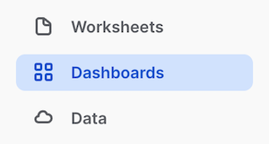

Set your role context to the role you created earlier:

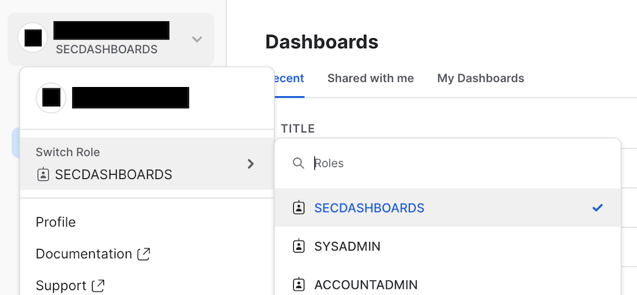
  
<br/>   
Start a new dashboard by clicking the blue **+ Dashboard** button at the top-right of the screen, and name it "Security Dashboard Quickstart." You may see that there is no warehouse selected for the dashboard (depending on how you arrived here). If that's the case, set the warehouse to the one that you granted to the role earlier.

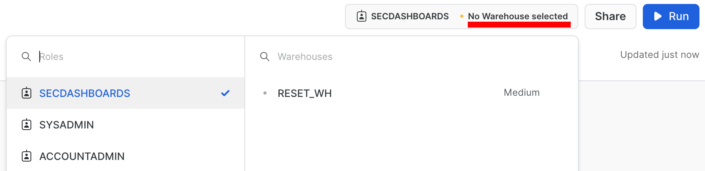

<br/>   
To complete this step, we will create a single tile step-by-step. First, let's preview the completed tile:

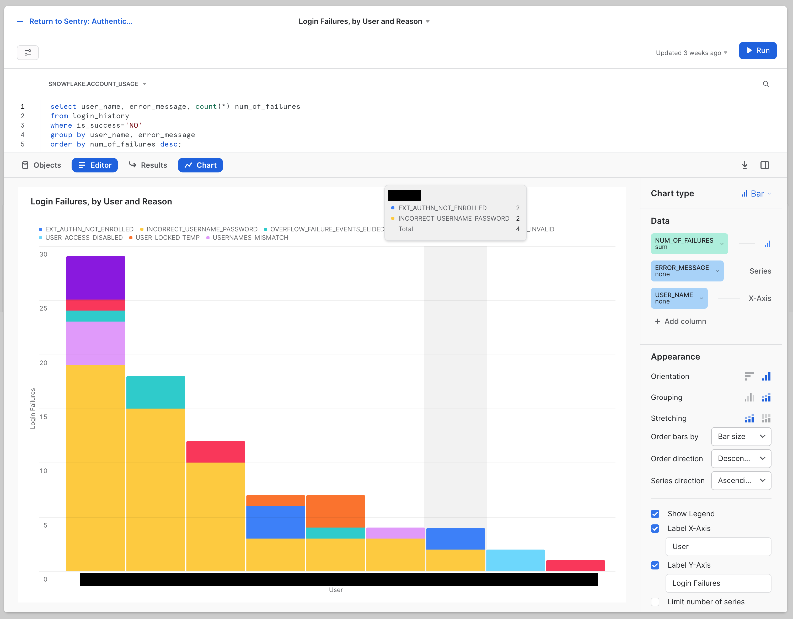

Now let's get started:
1. Click the blue **+ Dashboard** button at the center of your blank dashboard.  
   In the upper right-hand corner of the editing area, your context should be set to `SNOWFLAKE.ACCOUNT_USAGE`. If not, use the drop-down to set it to that.  
   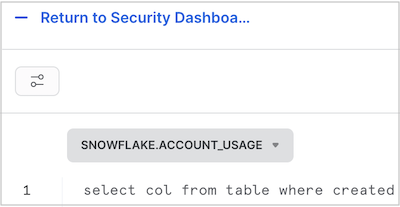
2. This is the SQL for our first tile:  
```
select
    user_name,
    error_message,
    count(*) num_of_failures
from
    login_history
where
    is_success = 'NO'
group by
    user_name,
    error_message
order by
    num_of_failures desc;
```
  
3. Copy and paste the code into the editing area. Run it, and click **Chart** at the divider between the editing area and the results area.  
You should see something that looks like this:  
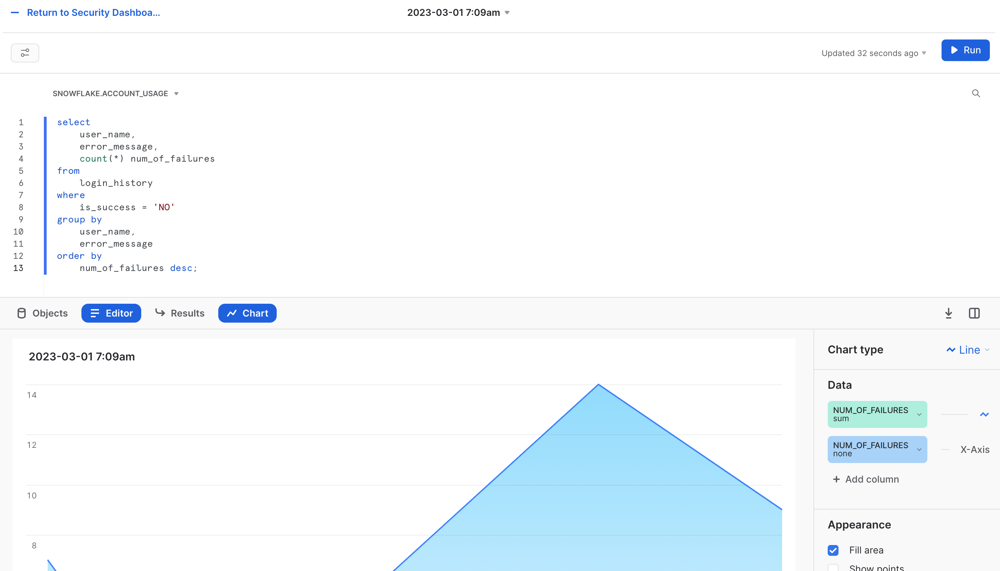
   
4. In the Chart area, click the date in the upper, left-hand corner. Edit this and rename it to: `Authentication: Failures, by User and Reason`    
5. On the right-hand side, change **Chart Type** to **Bar**.  
6. Continuing on the right-hand side, select the drop-down menu to the left of **X-Axis**, and change **Column** to **USER_NAME**.  
7. Under that **USER_NAME**, click **+ Add column**, and select the **ERROR_MESSAGE** column. It should appear above the **USER_NAME** as a "Series," like so:  
  
8. Continuing on the right-hand side, under the **Appearance** heading, click the icon to the right of **Grouping**, which will change the chart. You will know you have the right one if the "Stretching" label appears beneath it (though you do not need to adjust that new setting).  
9. Continuing on the right-hand side, click the check box next to **Label X-Axis** and make the input box read "User". Then click the checkbox next to **Label Y-Axis** and update the input box to read "Login Failures".  
At this point, your chart should look very close to the final result shared above. The size of the bars, names, and errors you  see will be different because of the actual data, of course. The labels, title text, type of bars, and other details should be the same.   
10. Now click the blue **- Return to Security Dashboa...** link in the upper left-hand corner of the tile editing widget.  
You should end up with a dashboard that has a single tile, like so:


> aside positive
> 
> As an FYI, the black bars appearing in these screen shots are there to block out information specific to the testing area where these screens came from. 

From this point on, tiles will be presented in their final form and instructions will focus on the SQL and other details you will use. Hopefully, this walkthrough has provided enough instruction on how to manipulate the Tile editor to make the remaining tiles.

<!-- ------------------------ -->
## Authentication Tiles
Duration: 5

Our Security Dashboard will have three tiles focusing on authentication data. The first is the `Authentication: Failures, by User and Reason` tile that we made in the previous step. This shows that the Snowflake audit trail is capturing all the information you need to track the health of authentication events.

The second will be named `Authentication: Breakdown by Method`, and it looks like this:  
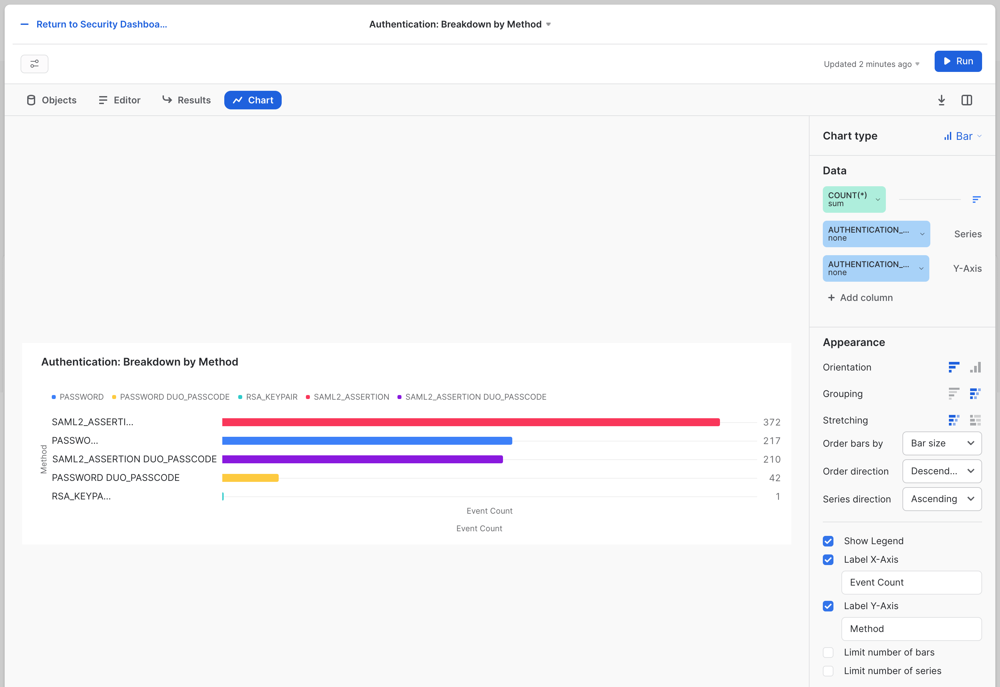

The SQL for this tile is:
```sql
select
   first_authentication_factor || ' ' ||nvl(second_authentication_factor, '') as authentication_method
   , count(*)
    from login_history
    where is_success = 'YES'
    and user_name != 'WORKSHEETS_APP_USER'
    group by authentication_method
    order by count(*) desc;
```
Similar to failure tracking, it's crucial to ensure that people are using the right authentication methods. This tile shows how to break down what methods are being used and by whom.

> By default, these tiles will be side by side, but you can drag them to be one under the other if you prefer. We find that a side-by-side presentation makes this information-dense visual easier to read, but arrange it however you see fit. 

The third tile for authentication will be named `Authentication: Service identities bypassing keypair authentication with a password`. This tile assumes you have "service account" style users which are configured with key pair authenitcation which you expect will ONLY use that key pair as an authenticaiton method. The tile will look like this:
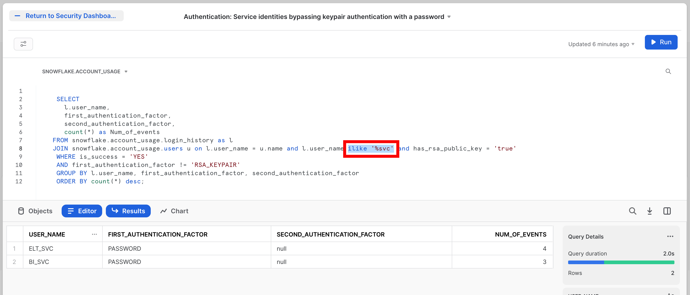

The SQL for this tile is:
```sql
SELECT
 l.user_name,
 first_authentication_factor,
 second_authentication_factor,
 count(*) as Num_of_events
FROM snowflake.account_usage.login_history as l
JOIN snowflake.account_usage.users u on l.user_name = u.name and l.user_name ilike '%svc' and has_rsa_public_key = 'true'
WHERE is_success = 'YES'
AND first_authentication_factor != 'RSA_KEYPAIR'
GROUP BY l.user_name, first_authentication_factor, second_authentication_factor
ORDER BY count(*) desc;
```

Note that in this SQL there is a specific part which looks for users with a naming convention containing `_SVC`. That is the `and l.user_name ilike '%svc'` bit of the SQL (which is also highlighted in the screen shot by the red box). This is assuming that any "service account" would use such a convnetion. So this will need adjusting in yoiur world to reflect the conventions you may use for these user types.

As you build this out ask yourself: What other information does your organization need to know about authentication? You now know where to find it. We will return to this theme again and again.


<!-- ------------------------ -->
## Privileged Access Tiles
Duration: 6

Good security practices require keeping an eye on privileged access users on any system. These tiles show you how to do that using the audit trail Snowflake provides you. There are two tiles in this category. 

First is the `Privileged Access: ACCOUNTADMIN Grants` tile. This is a simple table that looks like this:  

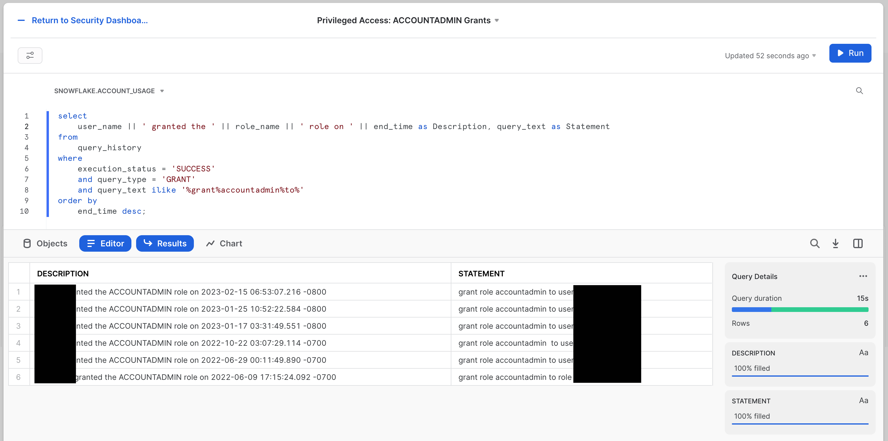

The SQL for this tile is:  
```sql
select
    user_name || ' granted the ' || role_name || ' role on ' || end_time as Description, query_text as Statement
from
    query_history
where
    execution_status = 'SUCCESS'
    and query_type = 'GRANT'
    and query_text ilike '%grant%accountadmin%to%'
order by
    end_time desc;
```

The second tile is the `Privileged Access: ACCOUNTADMIN's that do not use MFA` tile. The name says it all. Here we're looking for people that have elevated access, but who are not using the powerful protection that MFA (multi-factor authentication) provides.  
  
The tile looks like this:
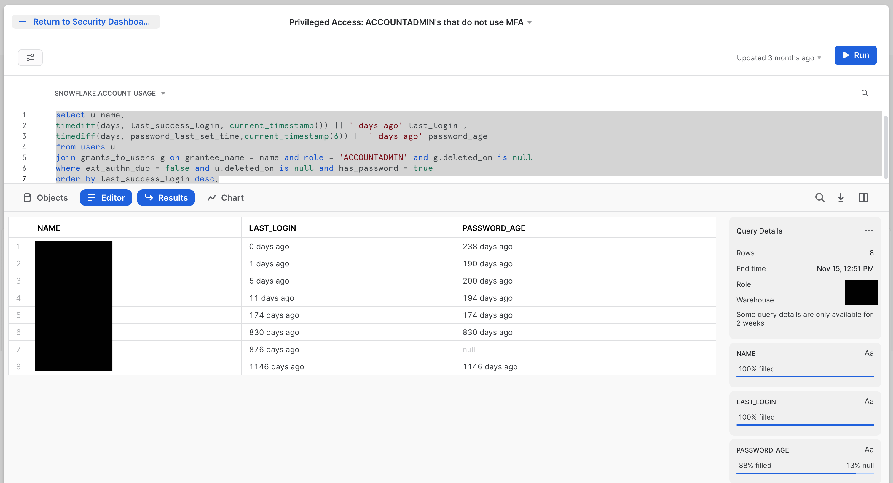

The SQL for this tile is:
```sql
select u.name, 
timediff(days, last_success_login, current_timestamp()) || ' days ago' last_login ,
timediff(days, password_last_set_time,current_timestamp(6)) || ' days ago' password_age
from users u
join grants_to_users g on grantee_name = name and role = 'ACCOUNTADMIN' and g.deleted_on is null
where ext_authn_duo = false and u.deleted_on is null and has_password = true
order by last_success_login desc;
```
An obvious extension to these tiles would be to include other built-in roles, like `SYSADMIN` and `SECURITYADMIN`, in addition to the `ACCOUNTADMIN` role. Less obvious—but similarly powerful—would be to include roles that have these roles granted to them. Perhaps you can even include roles that you have created that you know to have a great deal of power at your organization. 

<!-- ------------------------ -->
## Identity Management Tiles
Duration: 6

Governing users well is arguably the most important thing you can do to have healthy security outcomes. These three tiles cover a few basics. Everyone should be checking these in every system. 

First is the `Identity Management: Users by oldest Passwords` tile. It's worth pointing out that you can use [Password Policies](https://docs.snowflake.com/en/sql-reference/sql/create-password-policy) in Snowflake to proactively control the age of passwords for users. Many organizations, however, have not yet applied these policies, or they have exceptions for service accounts or other types of users. This will keep an eye on compliance to your policies, even when password policy age can't be limited proactively.  

The tile looks like this:  

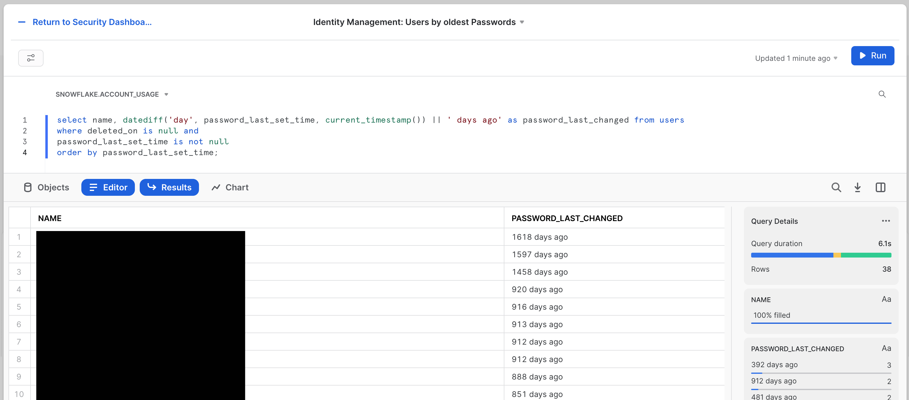

The SQL for this tile is:  
```sql
select name, datediff('day', password_last_set_time, current_timestamp()) || ' days ago' as password_last_changed from users 
where deleted_on is null and 
password_last_set_time is not null
order by password_last_set_time;
```

Next is the "`Identity Management: Stale Users`" tile. Here we're looking to see the last login for each user principal. The tile will look like this:

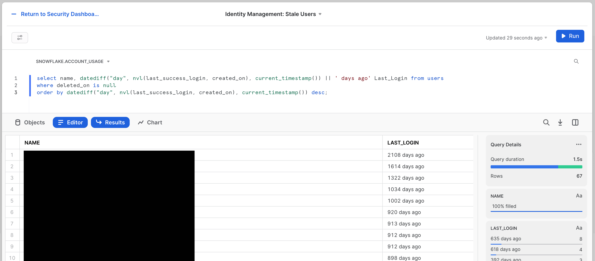

The SQL for this tile is:  
```sql
select name, datediff("day", nvl(last_success_login, created_on), current_timestamp()) || ' days ago' Last_Login from users 
where deleted_on is null
order by datediff("day", nvl(last_success_login, created_on), current_timestamp()) desc;
```

The third and final is the `Identity Management: SCIM Token Lifecycle` tile. [SCIM (System for Cross-domain Identity Management)](https://docs.snowflake.com/en/user-guide/scim) is an open specification to help facilitate the automated management of user identities and groups (_i.e._ roles) in cloud applications using RESTful APIs. Since it's doing such sensitive work, the token used by the SCIM provider system making these changes is very powerful, and making sure it's healthy and well managed is imperative.  

The tile looks like this:
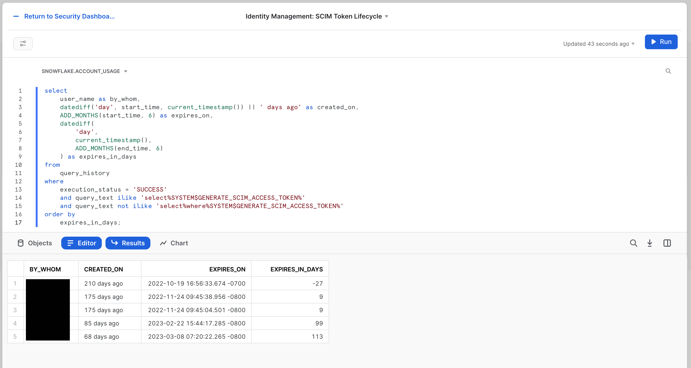
The SQL for this tile is:
```sql
select
    user_name as by_whom,
    datediff('day', start_time, current_timestamp()) || ' days ago' as created_on,
    ADD_MONTHS(start_time, 6) as expires_on,
    datediff(
        'day',
        current_timestamp(),
        ADD_MONTHS(end_time, 6)
    ) as expires_in_days
from
    query_history
where
    execution_status = 'SUCCESS'
    and query_text ilike 'select%SYSTEM$GENERATE_SCIM_ACCESS_TOKEN%'
    and query_text not ilike 'select%where%SYSTEM$GENERATE_SCIM_ACCESS_TOKEN%'
order by
    expires_in_days;
```

Again, there are many aspects to Identity Management that deserve to be delved into. The goal here is to get you started, and to leave you with the tools to take the plunge now that you know where the pool is, and which side is the deep end so you don't hurt yourself diving into the wrong places. 

<!-- ------------------------ -->
## Least Privileged Access Tiles
Duration: 5

A close second to Identity Management is Entitlement Management. The ideal for this is achieving Least Privileged Access, the state where user and roles have only exactly the entitlements required to accomplish their authorized business goals. There are two tiles we have created to help with that. 

First there is the `Least Privileged Access: Most Dangerous Person` tile. The cheeky title does relate to a real idea of technical risk. To rise to the top of this, someone must have the most entitlements granted in the system overall.  

The tile will look like this:  
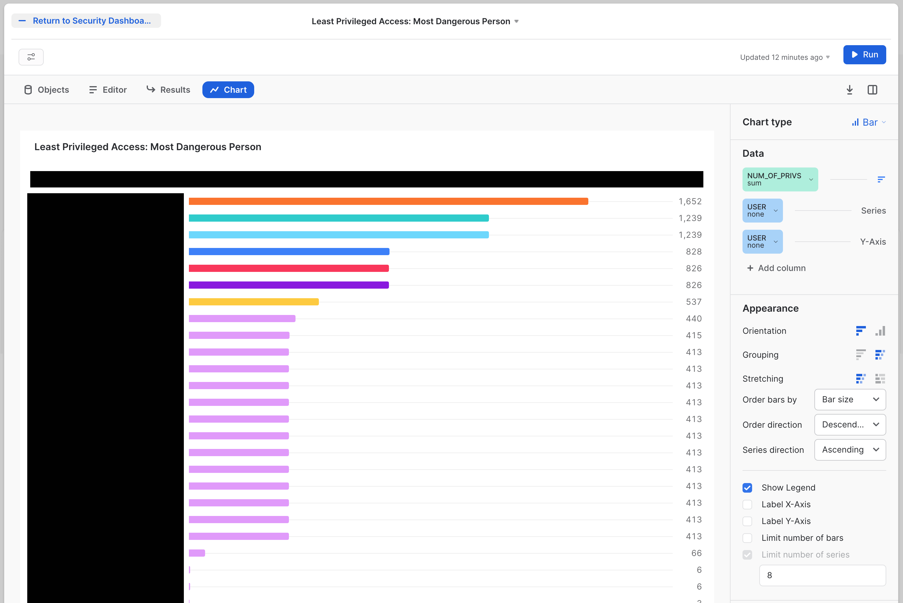
   
The SQL for this tile is:
```sql
with role_hier as (
    --Extract all Roles
    select
        grantee_name,
        name
    from
        grants_to_roles
    where
        granted_on = 'ROLE'
        and privilege = 'USAGE'
        and deleted_on is null
    union all
        --Adding in dummy records for "root" roles
    select
        'root',
        r.name
    from
        roles r
    where
        deleted_on is null
        and not exists (
            select
                1
            from
                grants_to_roles gtr
            where
                gtr.granted_on = 'ROLE'
                and gtr.privilege = 'USAGE'
                and gtr.name = r.name
                and deleted_on is null
        )
) --CONNECT BY to create the polyarchy and SYS_CONNECT_BY_PATH to flatten it
,
role_path_pre as(
    select
        name,
        level,
        sys_connect_by_path(name, ' -> ') as path
    from
        role_hier connect by grantee_name = prior name start with grantee_name = 'root'
    order by
        path
) --Removing leading delimiter separately since there is some issue with how it interacted with sys_connect_by_path
,
role_path as (
    select
        name,
        level,
        substr(path, len(' -> ')) as path
    from
        role_path_pre
) --Joining in privileges from GRANT_TO_ROLES
,
role_path_privs as (
    select
        path,
        rp.name as role_name,
        privs.privilege,
        granted_on,
        privs.name as priv_name,
        'Role ' || path || ' has ' || privilege || ' on ' || granted_on || ' ' || privs.name as Description
    from
        role_path rp
        left join grants_to_roles privs on rp.name = privs.grantee_name
        and privs.granted_on != 'ROLE'
        and deleted_on is null
    order by
        path
) --Aggregate total number of priv's per role, including hierarchy
,
role_path_privs_agg as (
    select
        trim(split(path, ' -> ') [0]) role,
        count(*) num_of_privs
    from
        role_path_privs
    group by
        trim(split(path, ' -> ') [0])
    order by
        count(*) desc
) --Most Dangerous Man - final query
select
    grantee_name as user,
    count(a.role) num_of_roles,
    sum(num_of_privs) num_of_privs
from
    grants_to_users u
    join role_path_privs_agg a on a.role = u.role
where
    u.deleted_on is null
group by
    user
order by
    num_of_privs desc;
```

Second is the `Least Privileged Access: Most Bloated Roles` tile. This is the sister to the most dangerous person. The most bloated role is the role that has the most entitlements. A user with several of these would easily start rising to the top of the last tile. The tile will look like this:  

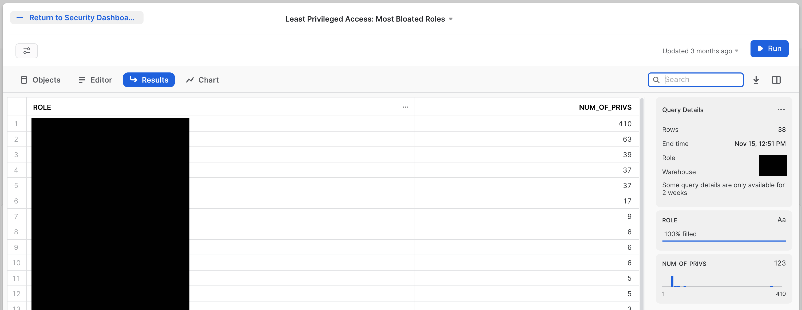
  
The SQL for this tile is:  
```sql
--Role Hierarchy
with role_hier as (
    --Extract all Roles
    select
        grantee_name,
        name
    from
        grants_to_roles
    where
        granted_on = 'ROLE'
        and privilege = 'USAGE'
        and deleted_on is null
    union all
        --Adding in dummy records for "root" roles
    select
        'root',
        r.name
    from
        roles r
    where
        deleted_on is null
        and not exists (
            select
                1
            from
                grants_to_roles gtr
            where
                gtr.granted_on = 'ROLE'
                and gtr.privilege = 'USAGE'
                and gtr.name = r.name
                and deleted_on is null
        )
) --CONNECT BY to create the polyarchy and SYS_CONNECT_BY_PATH to flatten it
,
role_path_pre as(
    select
        name,
        level,
        sys_connect_by_path(name, ' -> ') as path
    from
        role_hier connect by grantee_name = prior name start with grantee_name = 'root'
    order by
        path
) --Removing leading delimiter separately since there is some issue with how it interacted with sys_connect_by_path
,
role_path as (
    select
        name,
        level,
        substr(path, len(' -> ')) as path
    from
        role_path_pre
) --Joining in privileges from GRANT_TO_ROLES
,
role_path_privs as (
    select
        path,
        rp.name as role_name,
        privs.privilege,
        granted_on,
        privs.name as priv_name,
        'Role ' || path || ' has ' || privilege || ' on ' || granted_on || ' ' || privs.name as Description
    from
        role_path rp
        left join grants_to_roles privs on rp.name = privs.grantee_name
        and privs.granted_on != 'ROLE'
        and deleted_on is null
    order by
        path
) --Aggregate total number of priv's per role, including hierarchy
,
role_path_privs_agg as (
    select
        trim(split(path, ' -> ') [0]) role,
        count(*) num_of_privs
    from
        role_path_privs
    group by
        trim(split(path, ' -> ') [0])
    order by
        count(*) desc
) 
select * from role_path_privs_agg order by num_of_privs desc
```

Since these tiles are doing a deeper level of analysis, the SQL is much more complex. Even with that complexity, there are likely opportunities to pull in more information, or to aim similar analysis at other aspects of the system, such as detecting users that have the most code deployed in the form of SnowPark or stored procedures. 

<!-- ------------------------ -->
## Configuration Management Tiles
Duration: 2

There are many types of policy that control the security properties of your Snowflake Accounts. These two tiles explore how those properties are managed. The first looks broadly at all thes changes that may be taking place to your Snowflake configuration. The second looks at one of the most crucial configurations: Network Policy, which decides what network origination points will be allowed to connect to your Snowflake Accounts. This will help you track when any changes are made to these policies.  

The first tile is called `Configuration Management: Privileged object changes by User`. The tile will look like this:


The tile will look like this:  

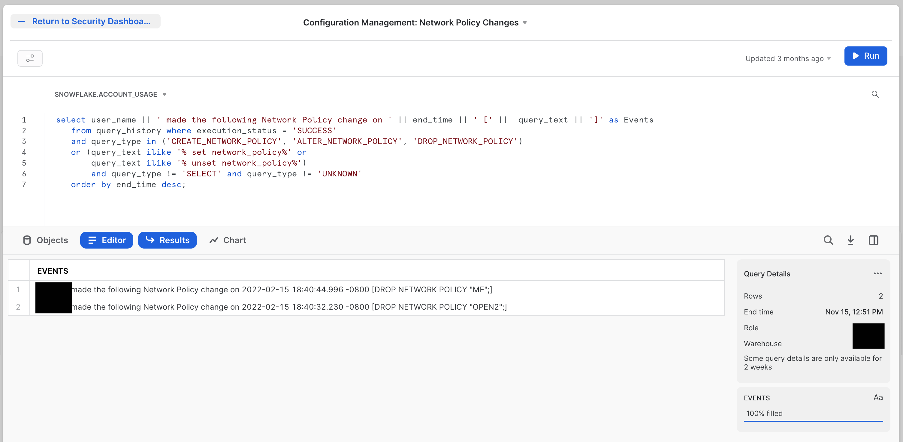
  
The SQL for this tile is:  

```sql
select user_name || ' made the following Network Policy change on ' || end_time || ' [' ||  query_text || ']' as Events
   from query_history where execution_status = 'SUCCESS'
   and query_type in ('CREATE_NETWORK_POLICY', 'ALTER_NETWORK_POLICY', 'DROP_NETWORK_POLICY')
   or (query_text ilike '% set network_policy%' or
       query_text ilike '% unset network_policy%')
       and query_type != 'SELECT' and query_type != 'UNKNOWN'
   order by end_time desc;
```

You can easily modify this to watch for modifications to any of the policies controlling access to your Snowflake Accounts.

<!-- ------------------------ -->
## Conclusion
Duration: 2

The Security Dashboard you've built here is a starting point. The hope is you've seen that all the information you would likely want to use is available, and we make it relatively easy to get that information displayed in a useful way. 

If you want to learn more about Snowflake security, check out the official documentation here: [Summary of Security Features (Docs)](https://docs.snowflake.com/user-guide/admin-security). There is also a lot more information about Security at Snowflake here: [Snowflake Security & Trust Center](https://www.snowflake.com/product/security-and-trust-center/). 

### What we've covered
- How to use Snowsight to create dashboard tiles
- Using the Snowflake audit trail to find security data
- Building tiles to explore your Snowflake security data
