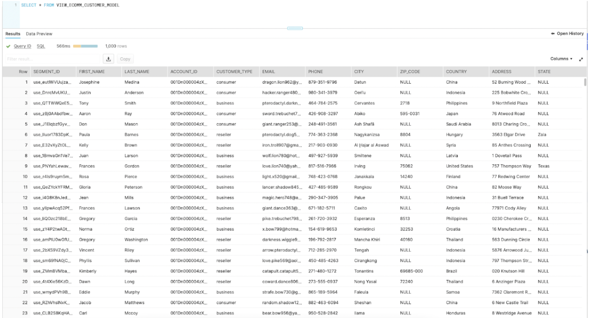
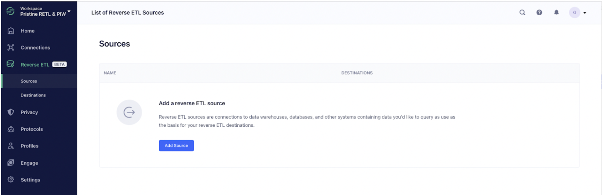
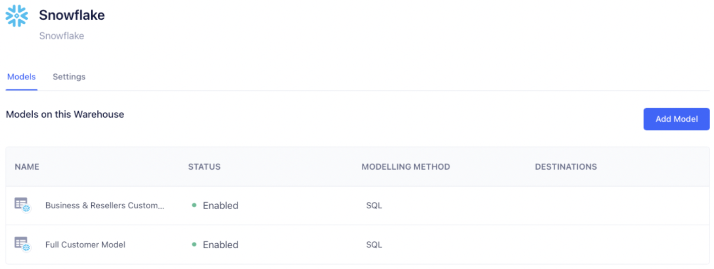
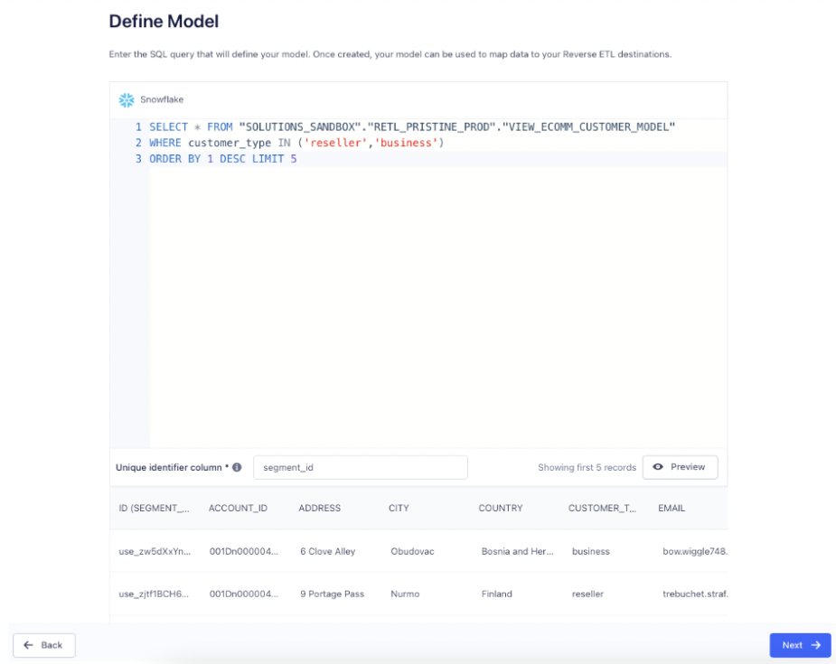
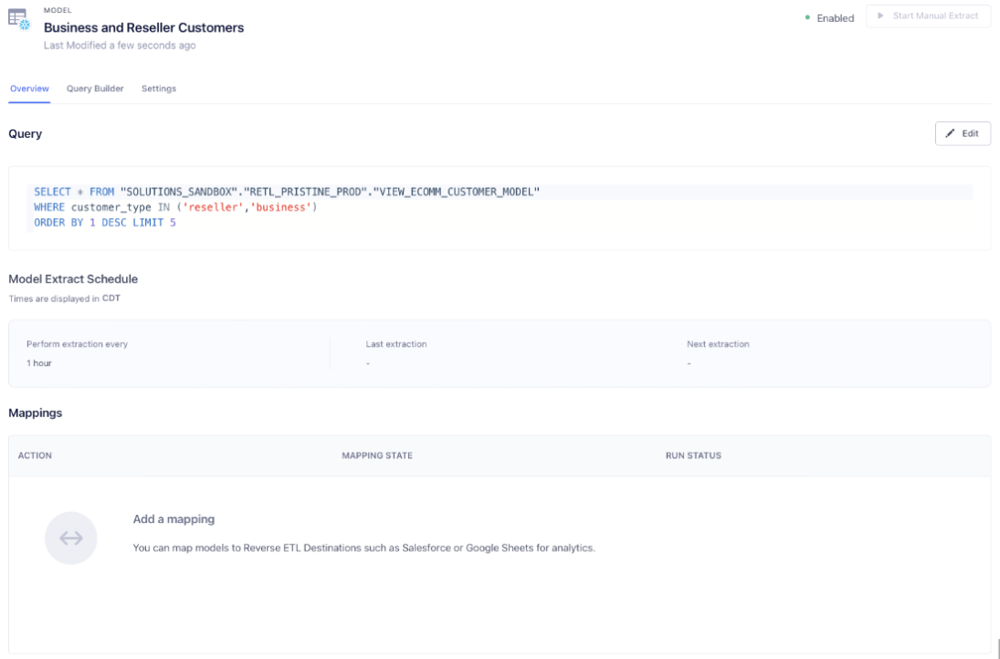
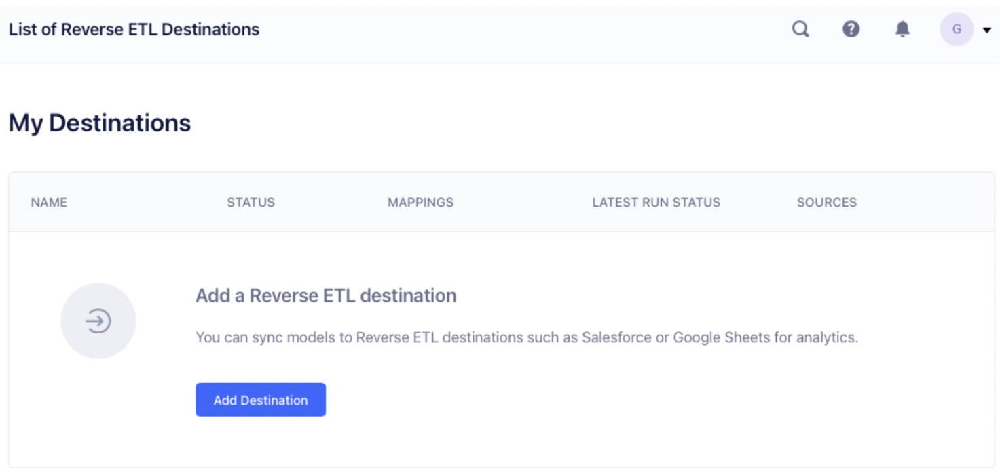
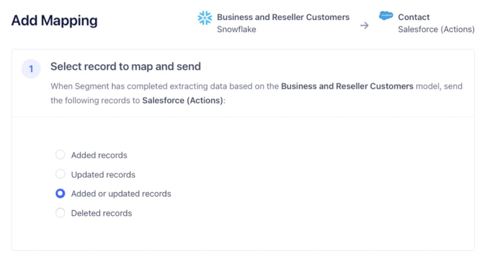
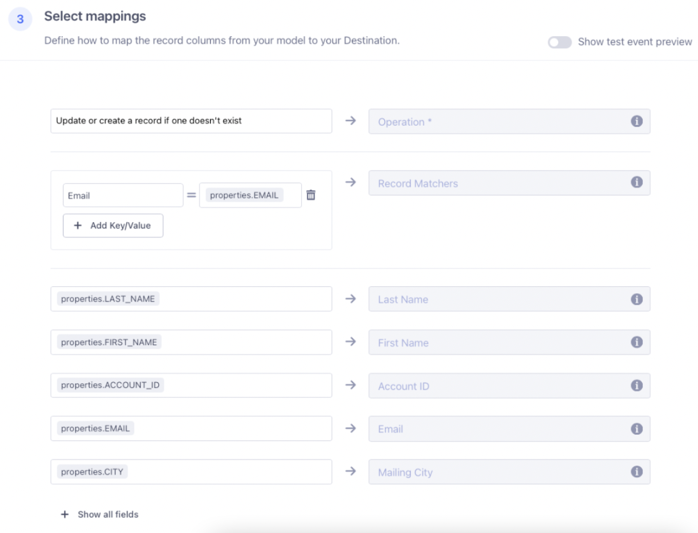
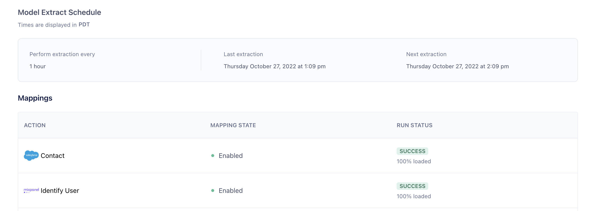
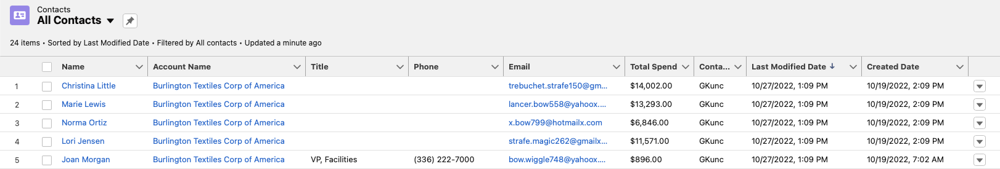

author: Ginu Kuncheria, Segment Solutions Engineer
id: segment-retl-salesforce
summary: Use Segment Reverse ETL to sync your Snowflake customer table to Salesforce
categories: Getting-Started
environments: web
status: Published 
feedback link: https://github.com/Snowflake-Labs/sfguides/issues
tags: Getting Started, Segment, Salesforce, Reverse ETL

# Use Segment Reverse ETL to sync your Snowflake customer table to Salesforce
<!-- ------------------------ -->
## Overview 
Duration: 1

The nature of iterative development cycles is that you find yourself at some point with multiple systems that need to be integrated. Maybe you built your customer database in Snowflake and your frontend applications are integrated with it, but now that your organization has grown, you’re investing in a CRM like Salesforce. You could eliminate the database and try to sync everything directly to Salesforce, but that’s probably a huge lift. You can’t just leave the systems separate, because having two sources of truth is not a good idea; you’ll introduce endless bugs and mismatches that affect your organization’s reputation and effectiveness. If your data warehouse could sync with your Salesforce, though… you’d be able to run both without the worry about divergent databases! In this recipe we’ll explore how to set up this synchronization so that your systems don’t diverge, and you don’t have extra work to keep them that way.

### Prerequisites
- A "Customers" table in your Snowflake DB.  Here's our example:

### What You’ll Learn 
- how to configure Reverse ETL to keep disparate systems (in this case, Salesforce) in sync with your Snowflake DB

### What You’ll Need 
- A [Segment](https://www.segment.com) Workspace with Reverse ETL enabled 
- A [Salesforce](https://www.salesforce.com) instance

### What You’ll Build 
- For our scenario, our sales team has recently adopted Salesforce and would like to easily import Business and Reseller customers into their new CRM. We are going to use Segment’s Reverse ETL to accomplish this.

## Set up the Reverse ETL model

Duration: 10

First we add our Snowflake instance as a Source in Segment (Click the Add Source button and follow the instructions with your Connection information):

After adding our Snowflake instance as a source, the next step is to add our Model:

Click the Add Model to bring up the SQL Editor. We are going to write our SQL Query to get all customers who are “customer_type” of “reseller” or “business.” (For the sake of this example, we will also only limit to 5 customers.)

After we are satisfied with the SQL query, hit “Next” and give the model a name and set the schedule for how often you want this model to run.

After saving the model, we will see a summary on the Model Overview screen:

## Add a Destination for our Model

Duration: 10

On the left side panel, click on Destinations.  You’ll get the following:

Click on the “Add Destination” button to view the Destinations Catalog:

Click on Salesforce (Actions), and you’ll be presented several dialogs in order to add and configure Salesforce. After successfully adding Salesforce as a destination, we are going to add a Mapping from our Model to our Destination. Click the “Add Mapping” button to start.

Our sales team has requested that these customers from our model be added as contacts so that they can record when our team interacts with each of them. First, we will use the dropdown to select our “Business and Reseller Customers” model and then select the Contact object to map to. Click Next and we will be taken to the Add Mapping page:

The first thing we will do is select what operation we want to perform for each row.  Since our model can change based on what information our customers provide us, we will select the “Added or updated rows”, this will sync any new records or updated records.

Next we will scroll down to the mappings section and map columns from our model to fields in Salesforce:

* For “Operation”, select “Update or create a record if one doesn’t exist.”

* For “Record Matchers”, use “Email” and map it to our Email column from our model (properties.EMAIL).

* For the reminder of the fields, simply map the column from our model to the corresponding field in Salesforce’s Contact object. 

Once you are done, click the “Save Mapping” button, and you will be returned to the Destinations page, click the toggle button to enable your Mapping to sync.

Your Mapping is now saved, and will run automatically the next time your model is updated. You can manually start an extract of your model by selecting your model on the “Sources” page, and when you reach the Model Overview page, clicking “Start Manual Extract”.

Once the model is working and syncing, you can come back to the Model Overview page any time to see the status of your Model. In the screenshot below you might notice that our model is syncing to both Salesforce and Mixpanel; you can add as many additional destinations as you like by simply repeating Step 2 for each desired destination.

Here is the result in our Contacts in Salesforce with matching Extraction / Last Modified time:

## Wrapping up

Duration: 1

It’s easy to set up a sync of your customer data from Snowflake to Salesforce using Segment’s Reverse ETL.  And it’s even easier to use Segment to add additional tools to this sync process. How much maintenance time could you save?

### What we've covered
- setting up a Model with Segment Reverse ETL
- setting up Salesforce as a destination
- mapping the fields between our database and Salesforce
- telling Segment to sync the model to the destination