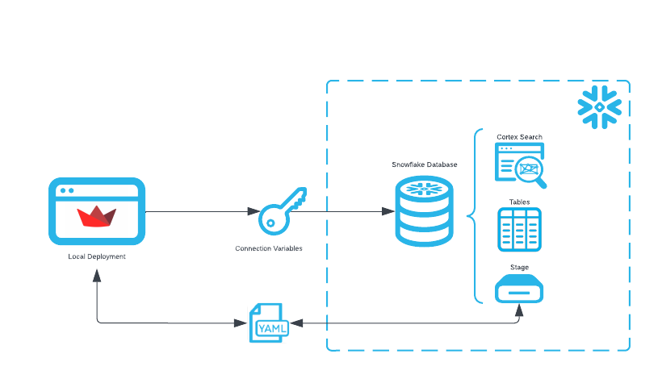
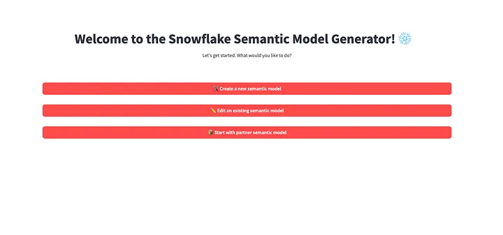
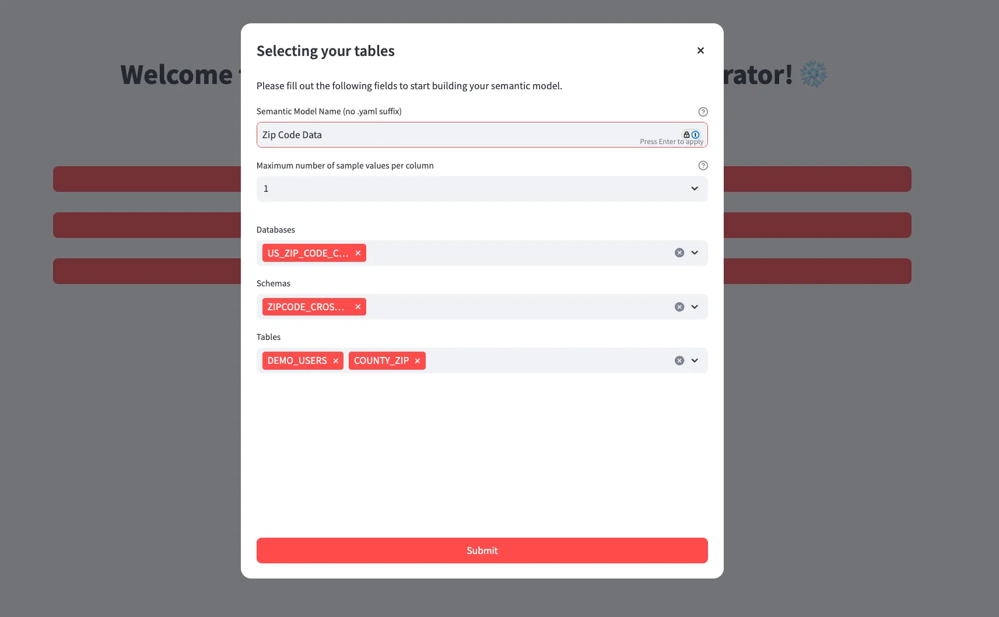
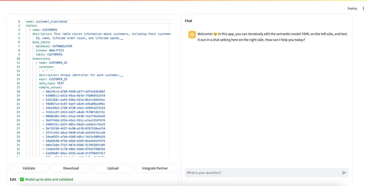
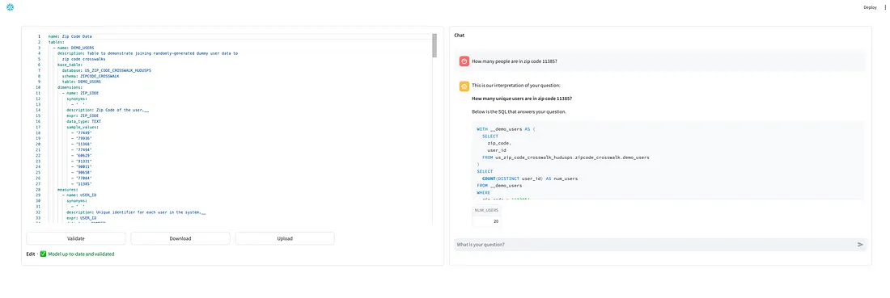
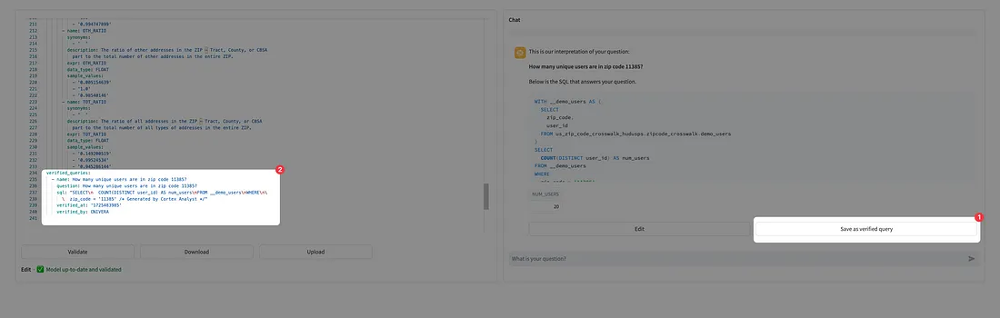

author: Rachel Blum, Chris Nivera
id: semantic_file_generation_for_cortex_analyst
summary: Step-by-step guide on how to use the Semantic Model Generator for Cortex Analyst
categories: featured,getting-started,gen-ai 
environments: web 
tags: Snowpark Python, Streamlit, Generative AI, Snowflake Cortex, Cortex Analyst, Semantic Data Model, Getting Started
status: Published
feedback link: https://github.com/Snowflake-Labs/sfguides/issues

# Creating Semantic Models for Cortex Analyst

<!-- ------------------------ -->
## Overview 
#### UPDATE: The Semantic Model Generator is now fully supported in Streamlit in Snowflake! We’ve added functionality and revamped the setup. You can now deploy the entire application to Streamlit in Snowflake with a single command. Take a [look](https://github.com/Snowflake-Labs/semantic-model-generator)!

Note: As of the date of this publication, Cortex Analyst is in Public Preview. Please see the [documentation](https://docs.snowflake.com/en/user-guide/snowflake-cortex/cortex-analyst#region-availability) for the list of available regions.

Ever wish you could talk directly to your data? Up until this point, gleaning insights from your data would require looking at complicated dashboards or back-and-forth communication with your company’s data analysts.

However, Snowflake has introduced [Cortex Analyst](https://www.snowflake.com/en/blog/cortex-analyst-ai-self-service-analytics/), a cutting-edge solution designed to revolutionize how business users interact with their data. Currently in Public Preview, Cortex Analyst is exposed as a REST API and offers a conversational interface that allows users to explore structured data with ease. Unlike traditional BI tools that often require complex queries or reliance on data teams, Cortex Analyst empowers users to ask questions in natural language and receive accurate, real-time insights.

To get started with Cortex Analyst, one only needs a semantic data model in the form of a YAML. Developers at Snowflake, in conjunction with the Snowflake Solution Innovation Team, have developed an open-source Semantic Model Generator using Streamlit to assist you in taking your semantic model from zero to one. The generator app is run locally from your own machine.

### What You Will Build
In this article, we’ll walk through how to set up the generator app and get started with generating your own semantic model from your Snowflake data.



### What You Will Learn 
- How to automatically generate semantic yaml files for use by Cortex Analyst from your Snowflake tables and views.

### Prerequisites
- Snowflake account in a cloud region where Snowflake Cortex Analyst is supported.  Check [Cortex Analyst availability](https://docs.snowflake.com/en/user-guide/snowflake-cortex/cortex-analyst#region-availability) to help you decide where you want to create your snowflake account


<!-- ------------------------ -->
## Setup and Launch the Semantic File Generator

### Clone the Repository
You can find the latest version of the app at the [Snowflake-Labs/semantic-model-generator](https://github.com/Snowflake-Labs/semantic-model-generator) repository. To start, please clone the code into a directory of your choice. We would recommend going through the [README](https://github.com/Snowflake-Labs/semantic-model-generator/blob/main/README.md) for a more in-depth walkthrough of the capabilities of the app.

Once you have a local version of the repository, let’s go ahead and install the dependencies necessary for the app to run. If you’re curious, a full list can be found in requirements.txt. Feel free to install the dependencies however you wish; for convenience’s sake, we have provided some Make commands to get started, so you may run to install all required dependencies:

```SQL
make setup_admin_app
```

### Authenticate 
The Streamlit app uses credentials populated in environment variables to authenticate with Snowflake.

First, create a .env file in the semantic-model-generator directory that you cloned. See the examples in .env.example for reference and proper syntax for .env files.

Depending on how your Snowflake account authenticates, copy-paste the relevant template below into your .env file. Ensure that you fill out each variable with your actual username, password, etc.

At the time this article is published, we currently support the following authentication methods:

#### Username + Password
```SQL
SNOWFLAKE_ROLE="<my_role>"
SNOWFLAKE_WAREHOUSE="<my_warehouse>"
SNOWFLAKE_USER="<my_user>"
SNOWFLAKE_PASSWORD="<my_pw>"
SNOWFLAKE_ACCOUNT_LOCATOR="<my_snowflake_account>"
SNOWFLAKE_HOST="<my_snowflake_host>"
```
#### Username + Password with Duo MFA
```SQL
SNOWFLAKE_ROLE="<my_role>"
SNOWFLAKE_WAREHOUSE="<my_warehouse>"
SNOWFLAKE_USER="<my_user>"
SNOWFLAKE_PASSWORD="<my_pw>"
SNOWFLAKE_ACCOUNT_LOCATOR="<my_snowflake_account>"
SNOWFLAKE_HOST="<my_snowflake_host>"
SNOWFLAKE_AUTHENTICATOR="username_password_mfa"
SNOWFLAKE_MFA_PASSCODE="<my_mfa_passcode>"
```
NOTE: To prevent MFA prompts from triggering every single time the app runs, we strongly recommend setting up MFA token caching for your account. [Follow the instructions](https://docs.snowflake.com/en/sql-reference/parameters#label-allow-client-mfa-caching) per the Snowflake documentation to do so.


#### SSO via Okta
```SQL 
SNOWFLAKE_ROLE="<my_role>"
SNOWFLAKE_WAREHOUSE="<my_warehouse>"
SNOWFLAKE_USER="<my_user>"
SNOWFLAKE_PASSWORD="<my_pw>"
SNOWFLAKE_ACCOUNT_LOCATOR="<my_snowflake_account>"
SNOWFLAKE_HOST="<my_snowflake_host>"
SNOWFLAKE_AUTHENTICATOR="externalbrowser"
```
To find your SNOWFLAKE_ACCOUNT_LOCATOR, please execute the following SQL command in your account.

```SQL
SELECT CURRENT_ACCOUNT_LOCATOR();
```

To find the SNOWFLAKE_HOST for your account, [follow these instructions](https://docs.snowflake.com/en/user-guide/organizations-connect#connecting-with-a-url). It typically follows the format of: <accountlocator>.<region>.<cloud>.snowflakecomputing.com. Ensure that you omit the https:// prefix.

### Run the App

Once you’ve installed the dependencies and set up the required environment variables, you’re good to go! You can run the app using one of the following commands:

```SQL
# Make target
make run_admin_app

# Directly using Python (change the Python version if necessary)
python3.11 -m streamlit run admin_apps/app.py
```

When the app first loads, you may see a loading screen for a few seconds as the app authenticates. If you have MFA set up, please check your two-factor app (e.g. Duo) for a push notification if necessary. After successfully logging in, you should see the following screen:



The generator app provides the following functionality:

- Creating a semantic model from scratch, given a set of Snowflake tables
- Editing an existing semantic model that lives in one of your Snowflake stages
- Incorporating data from a partner semantic model

This blog post will cover the first two; for partner integrations, please see [Part II](link here)!

<!-- ------------------------ -->
## Generate Your Semantic File
After clicking the Create a new semantic model button, you’ll be greeted by a dialog asking you for the following information to build your model:

- Semantic model name — this is not the filename, but instead the title for the model (e.g. Zip Code Data )
- Maximum number of sample values for columns that are incorporated into the semantic model. Please note that for dimensions, time measures, and measures, we enforce minimums of 25, 3, and 3 sample values, respectively.
- A list of tables that you’d like to include in your semantic model



Upon submitting the form, the app now begins generating your semantic model. Using the provided Snowflake credentials, it fetches metadata for the specified tables, enriches metadata from the Snowflake database, generates descriptions using Snowflake’s CORTEX.COMPLETE(), and constructs a semantic model.

After a short wait, you should now be brought to a screen where you can view the semantic model that’s been built!



Please take note of the comments that have been left by the generator. You can think of these as “homework” for you to fill out before your semantic model is fully fleshed out. Although the semantic model is syntactically valid after generation, we strongly encourage looking over the marked fields and filling out placeholders/verifying autogenerated descriptions.

<!-- ------------------------ -->
## Iterate on Your Semantic File
The right hand side of the UI hosts a chat window where you can directly talk with Cortex Analyst using the semantic model shown on the left hand side. Before chatting, first “validate” your model by clicking the button on the bottom left. Once validated, ask away!



Whenever Cortex Analyst responds with SQL, you are given the opportunity to add the SQL as a “verified query”. The “verified query repository” is a section of your semantic model that should contain high quality (question, SQL answer) pairs that are intended to help Cortex Analyst improve its accuracy when included. For more information about verified queries, see this [guide](https://docs.snowflake.com/user-guide/snowflake-cortex/cortex-analyst/verified-query-repository).

If you’d like to add a response as a verified query, simply click the Save as verified query below the generated SQL. This will append it to your semantic model as shown below:



On the other hand, should the generated query be almost correct but slightly off, you may click the Edit button to make changes and rerun the query. Once you’re satisfied with it, you may then add the modified SQL as a verified query.

Finally, after you’ve finished refining your semantic model, you can either download the model to your local machine or upload it to a Snowflake stage using the Download and Upload buttons in the bottom of the editor, respectively.

<!-- ------------------------ -->
## Conclusion & Resources
You’re now well equipped to start building semantic models using our open source Streamlit tool.

For more information on the Snowflake Cortex Analyst .yaml file specification, see our specification [documentation](https://docs.snowflake.com/user-guide/snowflake-cortex/cortex-analyst/semantic-model-spec) as well as additional documentation about [Cortex Analyst](https://docs.snowflake.com/en/user-guide/snowflake-cortex/cortex-analyst).

### What You Learned
How to create a Snowflake Semantic Model file for Cortex Analyst using the OSS Partner Semantic Translator.

### Related Resources
- [Docs: Snowflake Cortex Analyst](https://docs.snowflake.com/en/user-guide/snowflake-cortex/cortex-analyst)
- [Docs: Cortex Analyst Semantic Model Specification](https://docs.snowflake.com/en/user-guide/snowflake-cortex/cortex-analyst/semantic-model-spec)
- [Blogs: Cortex Analyst: Paving the Way to Self-Service Analytics with AI](https://www.snowflake.com/en/blog/cortex-analyst-ai-self-service-analytics/)
- [Tutorials: Answer questions about time-series revenue data with Cortex Analyst](https://docs.snowflake.com/en/user-guide/snowflake-cortex/cortex-analyst/tutorials/tutorial-1)
---

