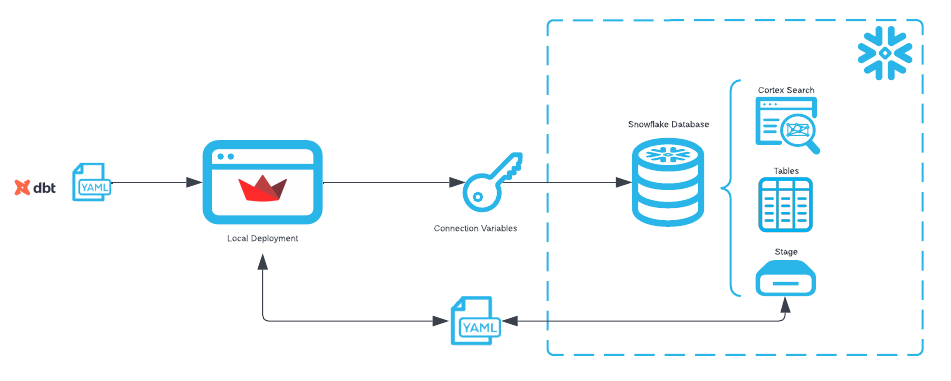
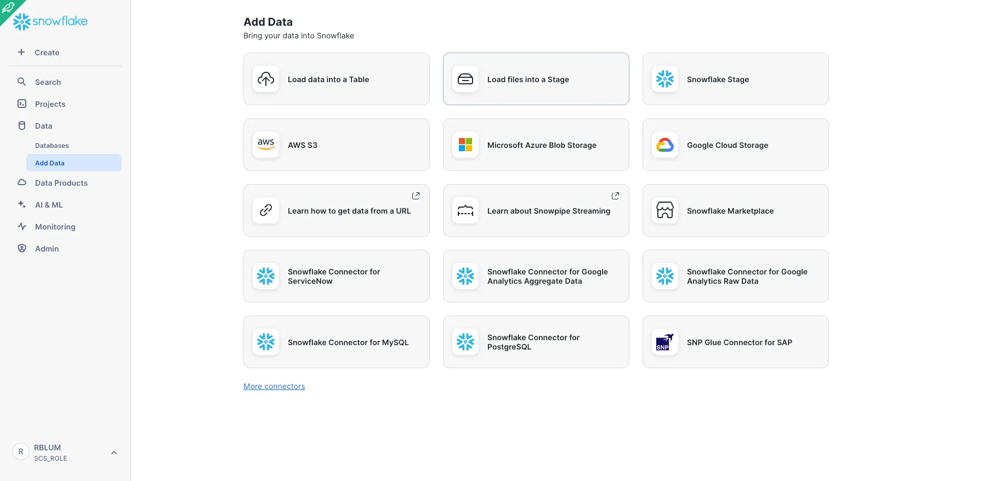
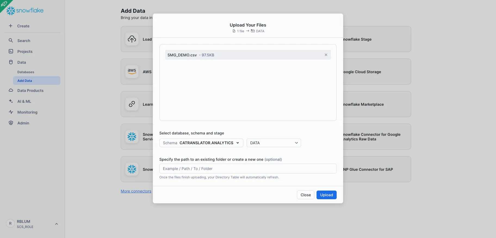
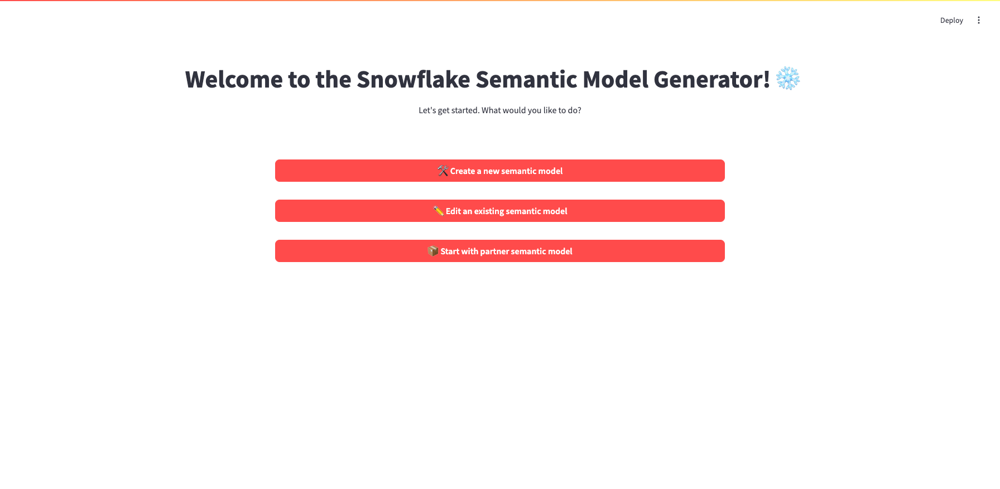
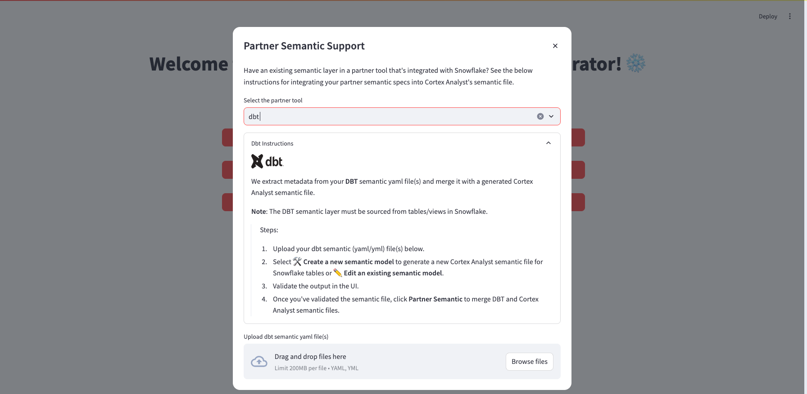
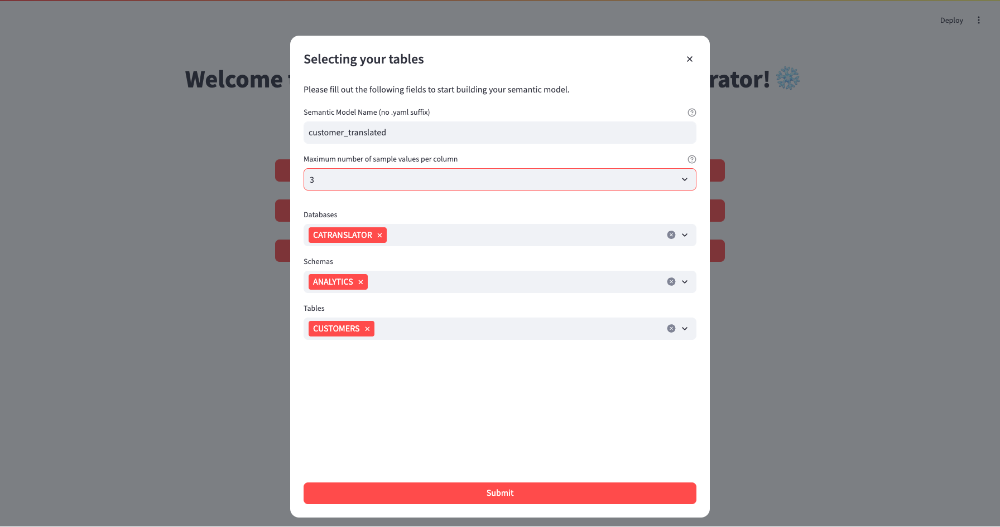
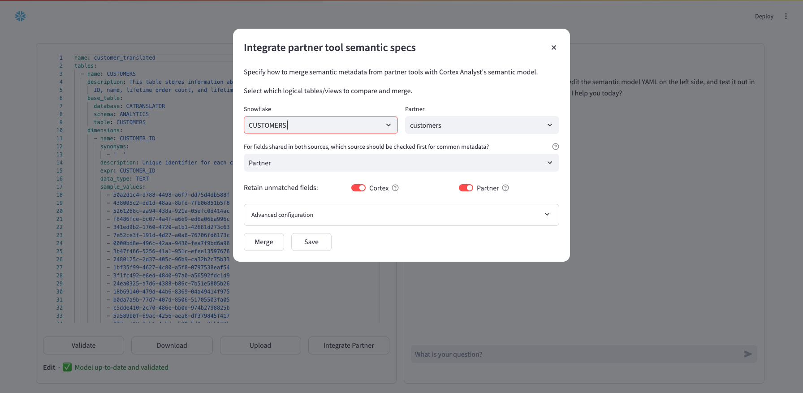
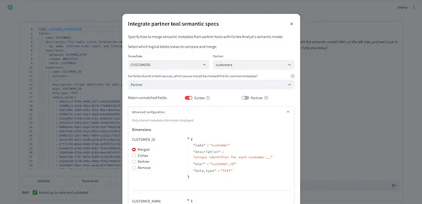
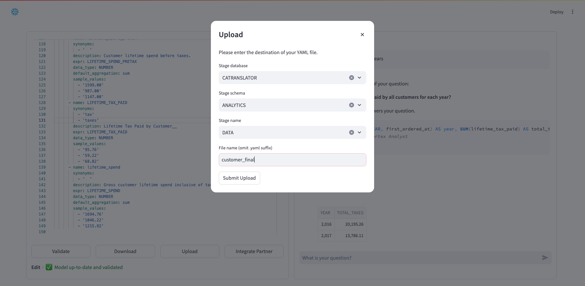

author: Rachel Blum, Jason Summer
id: semantic_file_translation_from_dbt_to_cortex_analyst
summary: Step-by-step guide on how to use the Partner Semantic Generator to translate your dbt semantic file to Snowflake's Semantic Data Model for Cortex Analyst.
categories: featured,getting-started,gen-ai 
environments: web 
tags: Snowpark Python, Streamlit, Generative AI, Snowflake Cortex, Cortex Analyst, Semantic Data Model, Getting Started
<!-- status: Published -->
feedback link: https://github.com/Snowflake-Labs/sfguides/issues

# Translate Existing Semantic Layers for Use by Cortex Analyst

<!-- ------------------------ -->
## Overview 

### Overview
[Cortex Analyst](https://docs.snowflake.com/en/user-guide/snowflake-cortex/cortex-analyst) is Snowflake’s premier text-to-sql solution for natural language processing on structured data. As noted in Part I of this series, Cortex Analyst requires semantic files with table and column metadata to more accurately respond to user requests. However, many Snowflake customers have already made significant investments in building semantic layers with a number of our semantic layer, data catalog, and business intelligence partners.

To assist customers in leveraging their existing semantic layers for use by Cortex Analyst, the Snowflake Solution Innovation Team has developed a Partner Semantic Translator tool. The brand new tool is tightly integrated as a new module within the [OSS Semantic Model Generator](https://github.com/Snowflake-Labs/semantic-model-generator) introduced in Part I of this series.

As Part II, this article will introduce and guide you through usage of the Partner Semantic Translator module. As of today, the module supports translation from [dbt semantic models](https://docs.getdbt.com/docs/build/semantic-models) and [Looker Explores](https://cloud.google.com/looker/docs/reference/param-explore-explore) that reference Snowflake views and tables. This brief article will focus on dbt translation with subsequent articles for other partner tools.

### What You Will Build
Specifically we will:
- Upload the dbt semantic models yaml file
- Create a new Cortex Analyst semantic yaml file for the Snowflake table referenced in dbt using the OSS Semantic Model Generator
- Compare and merge metadata between the two files
- Refine the output of the merge to our desired outcome



### What You Will Learn 
- How to leverage your existing dbt semantic yaml files for use with [Cortex Analyst](https://docs.snowflake.com/en/user-guide/snowflake-cortex/cortex-analyst)

### Prerequisites
- Snowflake account in a cloud region where Snowflake Cortex Analyst is supported.  Check [Cortex Analyst availability](https://docs.snowflake.com/en/user-guide/snowflake-cortex/cortex-analyst#region-availability) to help you decide where you want to create your snowflake account
- Completion of the Semantic File Generation For Cortex Analyst Quick Start


<!-- ------------------------ -->
## Setup Data in Snowflake
We will first create the source data in Snowflake. It is assumed that the dbt semantic model(s) leverage Snowflake data as a source. For this demonstration, we will create a semantic file for a dataset describing customers and orders. For simplicity, SQL DDL for the customer table is below and sample data for Snowflake and a sample dbt yaml file can be downloaded from [here](https://github.com/Snowflake-Labs/semantic-model-generator/tree/main/admin_apps/artifacts).

Using a role with permissions to create a database and database object, execute the following setup code in a Snowsight Worksheet.

```SQL
--create database objects
create database CATRANSLATOR;
create schema CATRANSLATOR.ANALYTICS;
create stage CATRANSLATOR.ANALYTICS.DATA;
create or replace table CATRANSLATOR.ANALYTICS.CUSTOMERS
(
 CUSTOMER_ID VARCHAR(16777216),
 CUSTOMER_NAME VARCHAR(16777216),
 COUNT_LIFETIME_ORDERS NUMBER(18,0),
 FIRST_ORDERED_AT DATE,
 LAST_ORDERED_AT DATE,
 LIFETIME_SPEND_PRETAX NUMBER(22,2),
 LIFETIME_TAX_PAID NUMBER(22,2),
 LIFETIME_SPEND NUMBER(22,2),
 CUSTOMER_TYPE VARCHAR(9)
);

```
Next, upload the csv file to stage CATRANSLATOR.ANALYTICS.DATA, which will be subsequently loaded into table CATRANSLATOR.ANALYTICS.CUSTOMERS.

Go to “Data” > “Add Data” in the sidebar menu and select “Load files into a Stage”.



Drag and drop file SMG_DEMO.csv and select database CATRANSLATOR, schema ANALYTICS and stage DATA. Click Upload.



Go back to your Snowsight Worksheet and run the following code to load the data from stage to your CATRANSLATOR.ANALYTICS.DATA table.

```SQL
copy into CATRANSLATOR.ANALYTICS.CUSTOMERS (customer_id, customer_name, count_lifetime_orders, first_ordered_at, last_ordered_at, lifetime_spend_pretax, lifetime_tax_paid, lifetime_spend, customer_type)
from @data/SMG_DEMO.csv
file_format = (
    type = 'CSV'
    field_delimiter = ','
    skip_header = 1
    ); 

```

<!-- ------------------------ -->
## Upload DBT Semantic File(s)
Now we introduce dbt semantic models. Dbt semantic models must be created using the [semantic_models](https://docs.getdbt.com/docs/build/semantic-models) keyword. Launch the Snowflake Semantic Model Generator by following the [setup instructions](https://github.com/Snowflake-Labs/semantic-model-generator?tab=readme-ov-file#setup) in the repository. Once the [Streamlit app](https://github.com/Snowflake-Labs/semantic-model-generator?tab=readme-ov-file#streamlit-app) is running locally, you will see the below landing page.



To begin, select “📦 Start with partner semantic model” and follow the below instructions.



1. In the partner tool dropdown, select “dbt”
2. Upload the dbt semantic yaml file (customers.yml)
3. Click “Continue”

You will be brought back to the landing page from which we will generate a starting Cortex Analyst semantic file.

<!-- ------------------------ -->
## Generate an Initial Cortex Analyst Semantic File
We will now create an initial Cortex Analyst Semantic File from the Snowflake source data. This will be used as a template to merge in dbt metadata. Select “🛠 Create a new semantic model” from the landing page and follow the below instructions:



1. Name your new semantic file customer_translated.
2. Select the maximum number of sample values to be passed to the semantic model generator. Please note that for dimensions, time measures, and measures, we enforce minimums of 25, 3, and 3 sample values, respectively.
3. Select database CATRANSLATOR, schema ANALYTICS, and table CUSTOMERS.
4. Select “Submit”.

You will be brought to the Iteration page of the Semantic Model Generator.

<!-- ------------------------ -->
## Compare and Merge DBT Metadata
Next, select the “Integrate Partner” button which will open the following dialog box. The modal shown provides an interface to compare metadata field-by-field for a selected dbt semantic model and Snowflake table/view. You can manually conduct these comparisons, fine-tune specific merge options, and merge the results to the current semantic file.



Since we are comparing one Snowflake table (Customers) with one dbt semantic model (customers), they are both already selected for comparison. In the next select box (“For fields shared in both sources…”) you can choose the default source for fields where there is common metadata — that is which semantic file should be checked first for common metadata. Where metadata is missing, the other semantic file will be checked. This selection defaults to Partner.

Next, for “Retain unmatched fields” toggles, you can choose whether or not to retain fields that are found in the Cortex Analyst semantic model but not in the Partner semantic model and vice versa.

If you are satisfied with your selections, click “Merge” and “Save” to integrate the selections into the working file in the main Iteration page. Alternatively, you can adjust configurations on individual fields by expanding “Advanced configuration”:



In “Advanced configuration”, fields from both semantic models are shown and combined if the field is common to both models. You can toggle between merge options to view the different results. Once you are satisfied with your selections, select “Merge” and then “Save”.

You will be returned to the Iteration page of the app where you can continue to test and edit your Cortex Analyst yaml file . At this point, we recommend reviewing generated descriptions (that contain suffix __) and adding synonyms according to expected end user nomenclature.

Don’t forget to click “Upload” to save your new yaml file to stage. Select your database, schema, stage and then name your new yaml file (e.g., customer_final). Click “Submit Upload”.



<!-- ------------------------ -->
## Conclusion & Resources

### Conclusion
For more information on the Snowflake Cortex Analyst yaml file specification, see our specification documentation as well as additional documentation about Cortex Analyst.

### What You Learned
How to leverage your existing dbt semantic model data with the OSS Partner Semantic Translator to acclerate text-to-sql querying in Snowflake with [Cortex Analyst](https://docs.snowflake.com/en/user-guide/snowflake-cortex/cortex-analyst).


### Related Resources

- [Docs: Snowflake Cortex Analyst](https://docs.snowflake.com/en/user-guide/snowflake-cortex/cortex-analyst)
- [Docs: Cortex Analyst Semantic Model Specification](https://docs.snowflake.com/en/user-guide/snowflake-cortex/cortex-analyst/semantic-model-spec)
- [Blogs: Cortex Analyst: Paving the Way to Self-Service Analytics with AI](https://www.snowflake.com/en/blog/cortex-analyst-ai-self-service-analytics/)
- [Tutorials: Answer questions about time-series revenue data with Cortex Analyst](https://docs.snowflake.com/en/user-guide/snowflake-cortex/cortex-analyst/tutorials/tutorial-1)
---

