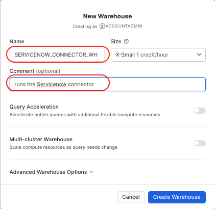
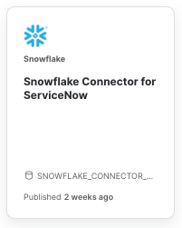
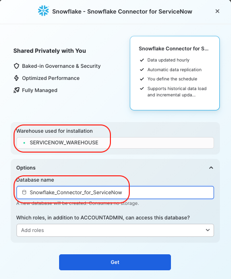

author: sfc-gh-drichert
id: servicenow_to_snowflake_connector
summary: Step-by-step to set up Servicenow connector
categories: Connectors
environments: web
status: Private 
feedback link: https://github.com/Snowflake-Labs/sfguides/issues
tags: Connectors, Data Engineering, Servicenow 

# Servicenow to Snowflake Connector Installation
<!-- ------------------------ -->
## Overview 
Duration: 1

Ingest data from ServiceNow into Snowflake automatically. The connector supports both the initial load of historical data as well as incremental updates. The latest data is regularly pulled from ServiceNow and you control how frequently it is refreshed.

Use this quickstart to configure and understand the Snowflake Connector
for Servicenow using the Snowsight wizard, select some tables, ingest data, and run some typical usage queries. When you are done stop the connector to avoid costs. You can also do all these steps programmatically; for that please refer to the documentation. 

Note: This quickstart assumes you do not have a Servicenow account, so
it guides you through the steps of creating a developer account. Of
course, if you do have a Servicenow account, please feel free to try it
out, with the caveat that, at the time of writing, the connector is in
public preview and should not be used for production.

### Prerequisites
- Servicenow account with administrator's rights.
- Snowflake account and user with accountadmin's role.
-   Accepting the Terms of Service in the Snowflake Marketplace. ORGADMIN rights are required to access this.

### What You’ll Learn 
- How to set up the Snowflake Connector for Servicenow.
- How to ingest Servicenow data into Snowflake
- How to stop the connector to avoid unnecessary costs in a development environment.

### What You’ll Need 
- A [Snowflake](https://snowflake.com/) Account 
- A [Servicenow](https://developer.servicenow.com/dev.do/) developer account

### What You’ll Build 
- A Servicenow to Snowflake ingestion data flow.

<!-- ------------------------ -->
## Servicenow Setup
Duration: 30

1. Go to the [Servicenow developer website](https://developer.servicenow.com), and create a developer user.

1. Log on to the developer website with your newly created user and select **Create an Instance**. 
1. Choose an instance type. You receive an email with your instance URL, and admin user and password. 

## Servicenow endpoint configuration
The Servicenow endpoint configuration window creates an OAuth client application record and generates a client ID and client secret that Snowflake needs to access the restricted resources on the instance.

1. Log on to your Servicenow developer instance.
1. From the main page, select **All** and  search **Application Registry**.

1. Select **New** in the upper right-hand side of the window.
1. Select **Create an OAuth API endpoint for external clients**. 
1. Give the endpoint a name, such as **Snowflake_connector**. Leave the client secret blank. This will autofill when you select **Submit** later in the procedure.
1. Fill in the redirect URL with this syntax (Alternatively, Snowflake will generate this in a later step and you can come back and modify the redirect URL). 

  ```javascript
   https://apps-api.c1.<cloud_region_id>.<cloud>.app.snowflake.com/oauth/complete-secret
   ```
   where 
   - **cloud_region_id** can be found in the URL of Snowsight, for example: 
 
 
  https://app.snowflake.com/**us-west-2**/MyAccountId/worksheets

  - and **cloud** is aws or azure or gcp.

   For example, for  AWS US WEST 2 would be:
  ```javascript
  https://apps-api.c1.us-west-2.aws.app.snowflake.com/oauth/complete-secret
  ```

Select **Submit**.


---


<!-- ------------------------ -->
## Snowflake Configuration
Duration: 10


### Accept Terms & Conditions
1. Log on to your Snowflake account through the Snowsight web interface and change to the **orgadmin** role. 
1. Select “Admin » Billing & Terms”.
4. In the “Snowflake Marketplace” section, review the Consumer Terms of Service.
5. If you agree to the terms, select “Accept Terms & Conditions”.


### Set Up Two Virtual Warehouses

Log on to your Snowflake account and change to the **accountadmin** role.

1. Navigate to Admin -> Warehouses and select **+ Warehouse**. 
2. Name the first vitural warehosue **SERVICENOW_CONNECTOR_WH** and, leaving the defaults, select **Create Warehouse**. 


1. Repeat the above two steps to create a second virtual warehouse **SERVICENOW_WAREHOUSE**.


## Get the Servicenow connector
The connector is delivered through the Snowflake native application framework into your account as a database with a couple of schemas, tables, views, and stored procedures. 

1. From the Snowflake Account Home page, select Marketplace.)

1. In the search window, enter **servicenow**. The tile appears:



1. Select the **Snowflake Connector for ServiceNow**.
1. Review the business needs and usage samples. Hint: If you want to
    > access the examples after configuring the connector, simply choose
    > a role different from accountadmin.
1. Select **Get**.

1. Select the warehouse you created above, **SERVICENOW_CONNECTOR_WH**.
1. For this quickstart, leave the default name for the installation database.
The screen should look like the following:


1. Select **Get**. You receive the following message, **Snowflake Connector for SeviceNow is now ready to use in your account.**

1. Select **Done**.

If you would like to verify the connector was installed, from Snowsight, you can go to **Data -> Databases**. You will see a new database with the name **Snowflake_Connector_for_ServiceNow**. Open the Public schema and views to see the Global_Config view. Some of the Procedures have
also been installed. Others will appear after the installation finishes. 


## Connect Snowflake to Servicenow

1. From the Snowflake Account Home page, select Marketplace and then
    > select the **Snowflake Connector for Servicenow** tile.
1. In the **Snowflake Connector for ServiceNow** window, select **Manage**.

1. Select **Connect**.

1. Fill in the Servicenow instance details. This is the first part of the Servicenow URL for your Servicenow account, **without** the trailing *service-now.com*.

1. Select **OAuth2** for the Authentication method.

1. Enter the **Client id** from Servicenow that was generated in the
    > Servicenow endpoint configuration.

1. Copy the Client secret from Servicenow and into the Snowflake configure pop-up.  *Hint: on Servicenow, unlock the field by clicking on the lock, and then copy the text to make sure you are actually copying the right text.* The screen should look something similar to this: 
1. Select **Connect**. Your Servicenow accounts pops up and requests to connect to Snowflake. 

1. Select **Allow**.
The connection is established between the two systems. 

To verify the connection, select the three dots [...] and **View Details**. At the top of the pop-up you will see the date **ServiceNow**
Authenticated.
## Select Servicenow Tables

1. In Snowsight, select the **Snowflake Connector for Servicenow** tile.

1. In the **Snowflake Connector for ServiceNow** window, select **Select Tables**.

1. From the search window enter **incident** and check the box next to it and choose a 30 minute sync time. **Do not start the ingestion yet!**

1. To choose other tables, clear the search, put the table name and select the checkbox. Do this for the following tables:
  
    SYS_CHOICE
    SYS_USER
    SYS_USER_GROUP
    TASK

    Hint: Select Field title "Status" to sort and show all the tables you selected.
1. Select **Configure** and review the default values for destinations and schemas, roles, a secondary warehouse and journal table.
1. Select **Start Ingestion**. The select windows closes and you get the message "Loading Data" from the main Connector window.


You receive a message indicating success:


To programmatically verify what tables you selected, from SQL run the following commands:
```SQL

USE DATABASE snowflake_connector_for_servicenow;
USE SCHEMA public;
SELECT * FROM enabled_tables WHERE ENABLED = true;
```
## Connector Monitoring (Query Sync History)
 
In the connector interface, choose **Query Sync History.** A worksheet
opens with several SQL queries you can execute to get monitoring
information.

## Setting Permissions to Read 
Once you have ingested some data, you probably want to access it. Use the following SQL to create the **servicenow_reader_role** and give it the right access.
```SQL
USE ROLE accountadmin;**\
CREATE ROLE servicenow_reader_role;
GRANT USAGE ON DATABASE SERVICENOW_DEST_DB TO ROLE servicenow_reader_role;
GRANT USAG ON DATABASE SERVICENOW_DEST_DB TO ROLE servicenow_reader_role;
GRANT USAGE ON SCHEMA DEST_SCHEMA TO ROLE servicenow_reader_role; 
GRANT USAGE ON WAREHOUSE SERVICENOW_WH TO ROLE servicenow_reader_role;
GRANT SELECT ON FUTURE TABLES IN SCHEMA DEST_SCHEMA TO ROLE servicenow_reader_role;
GRANT SELECT ON FUTURE VIEWS IN SCHEMA DEST_SCHEMA TO ROLE servicenow_reader_role;
GRANT SELECT ON ALL TABLES IN SCHEMA DEST_SCHEMA TO ROLE servicenow_reader_role;
GRANT SELECT ON ALL VIEWS IN SCHEMA DEST_SCHEMA TO ROLE servicenow_reader_role;
```

## Query the Data

### Identify number of incidents raised by month, application, priority
Optionally add parent assignment group, child assignment group, who the incident was raised for, who was assigned to the incident, etc. Classification of the incident can be done based on category and subcategory.

Run the following to enable and ingest the tables you need for the example:

```SQL
BEGIN CALL
 "SNOWFLAKE_CONNECTOR_FOR_SERVICENOW"."PUBLIC".CONFIGURE_CONNECTOR_TABLES('schedule_interval','30m','cmdb,cmdb_ci, incident, sc_req_item, sc_request,sys_audit,sys_audit_delete, sys_choice, sys_user, sys_user_group, task'); 
 
 CALL "SNOWFLAKE_CONNECTOR_FOR_SERVICENOW"."PUBLIC".ENABLE_TABLES('cmdb, cmdb_ci, incident, sc_req_item, sc_request,sys_audit,sys_audit_delete, sys_choice, sys_user, sys_user_group, task', 'true'); 
 END;
```


```SQL
WITH T1 AS (
    SELECT
    DISTINCT
        T.NUMBER AS TICKET_NUMBER
        ,G1.NAME AS PARENT_ASSIGNMENT_GROUP
        ,G.NAME AS CHILD_ASSIGNMENT_GROUP
        ,T.SHORT_DESCRIPTION
        ,T.DESCRIPTION
        ,CI.NAME AS CONFIGURATION_ITEM
        ,SC_CAT.LABEL AS CATEGORY
        ,SC_SUBCAT.LABEL AS SUBCATEGORY
        ,T.PRIORITY
        ,T.SYS_CREATED_ON AS CREATED_ON
        ,SU.NAME AS ASSIGNED_TO
        ,SU1.NAME AS OPENED_BY
        ,U2.NAME AS INCIDENT_REQUESTED_FOR
        ,T.SYS_UPDATED_ON AS UPDATED_ON
        ,T.CLOSED_AT

    FROM
      TASK T
      LEFT JOIN 
          INCIDENT I 
          ON I.SYS_ID = T.SYS_ID -- ADDITIONAL INCIDENT DETAIL
      LEFT JOIN 
          (
            SELECT 
              * 
            FROM 
                SYS_CHOICE SC_CAT 
            WHERE 
                ELEMENT = 'U_T_CATEGORY'
           ) SC_CAT
           ON T.U_T_CATEGORY = SC_CAT.VALUE -- MAPPING FOR CATEGORY VALUES FROM TASK TABLE
      LEFT JOIN 
          (
              SELECT 
              * 
              FROM 
                  SYS_CHOICE 
              WHERE 
                  ELEMENT = 'U_T_SUBCATEGORY' 
                  AND NAME ='SC_REQ_ITEM'
          )SC_SUBCAT 
          ON T.U_T_SUBCATEGORY = SC_SUBCAT.VALUE -- MAPPING FOR SUBCATEGORY VALUES FROM TASK TABLE
      LEFT JOIN 
          CMDB_CI CI 
          ON T.CMDB_CI_VALUE = CI.SYS_ID -- CONFIGURATION ITEM OR APPLICATION NAME
      LEFT JOIN 
          SC_REQ_ITEM R 
          ON T.SYS_ID = R.SYS_ID -- RITM OR SERVICE REQUEST INFORMATION
      LEFT JOIN 
          SC_REQUEST SR 
          ON R.REQUEST_VALUE = SR.SYS_ID -- RITM REQUESTED FOR INFORMATION
      LEFT JOIN 
          SYS_USER SU 
          ON T.ASSIGNED_TO_VALUE = SU.SYS_ID -- ASSIGNED TO USERS NAME
      LEFT JOIN 
          SYS_USER SU1 
          ON T.OPENED_BY_VALUE = SU1.SYS_ID -- OPENED BY USERS NAME
      LEFT JOIN 
          SYS_USER U2 
          ON I.CALLER_ID_VALUE = U2.SYS_ID -- INCIDENT REQUESTED FOR NAME
      LEFT JOIN 
          SYS_USER_GROUP G 
          ON NVL(T.ASSIGNMENT_GROUP_VALUE, T.ASSIGNMENT_GROUP) = G.SYS_ID -- CHILD GROUP NAME
      LEFT JOIN 
          SYS_USER_GROUP G1 
          ON NVL(G.PARENT_VALUE, G.PARENT) = G1.SYS_ID -- PARENT GROUPS
      LEFT JOIN 
          SYS_AUDIT_DELETE DEL 
          ON T.SYS_ID = DEL.DOCUMENTKEY -- THIS JOIN HELPS IDENTIFY DELETED TICKETS

    WHERE
        DEL.DOCUMENTKEY IS NULL --  THIS CONDITION HELPS KEEP ALL DELETED RECORDS OUT
    AND
        I.SYS_ID IS NOT NULL -- THIS CONDITION HELPS KEEP JUST THE INCIDENT TICKETS
)
SELECT
    YEAR(CREATED_ON) AS YEAR_CREATED
    ,MONTH(CREATED_ON) AS MONTH_CREATED
    ,CONFIGURATION_ITEM AS APPLICATION
    ,PRIORITY
    ,COUNT(DISTINCT TICKET_NUMBER)
FROM
    T1
GROUP BY
    YEAR_CREATED
    ,MONTH_CREATED
    ,APPLICATION
    ,PRIORITY
ORDER BY
    YEAR_CREATED
    ,MONTH_CREATED
    ,APPLICATION
    ,PRIORITY
;


## Stop the Ingestion
> aside positive
> If you do not stop the connector, it will wake up the virtual warehouse at the specified time interval and consume credits.


1. In Snowsight, select the **Snowflake Connector for Servicenow** tile.

1. In the **Snowflake Connector for ServiceNow** window, select **Stop Ingestion**.


Read the warning and select **Stop Ingestion**.


## Delete the Connector (but not the data)
To delete the connector you need to drop the connector database: 
```SQL
DROP DATABASE SNOWFLAKE_CONNECTOR_FOR_SERVICENOW;

```
<!-- ------------------------ -->
## Query Examples

### CMDB applications count
The CMDB (Configuration Management Database) is the ServiceNow database that stores information about all technical services. Within the CMDB, the support information for each service offering is stored in a Configuration Item (CI) specific to that service.
This query provides the CMDB applications count by department, assignment groups, application owner, vendor or their respective status.

Tables to replicate to run this example:
CMDB_CI_BUSINESS_APP
CMN_DEPARTMENT
CORE_COMPANY
SYS_USER_GROUP
SYS_USER
SYS_AUDIT_DELETE


```SQL
WITH T1 AS(
    SELECT
        DISTINCT 
        B.NAME AS DEPARTMENT
        ,D.NAME AS ASSIGNMENT_GROUP
        ,A.NAME AS BUSINESS_APP_NAME
        ,E.NAME AS APP_OWNER
        ,A.BUSINESS_CRITICALITY
        ,C.NAME AS VENDOR_NAME
        ,C.STATUS AS VENDOR_STATUS
    FROM
  CMDB_CI_BUSINESS_APP A --  THIS TABLE INCLUDES ALL THE BUSINESS APPS THAT ARE CONFIGURED
    LEFT JOIN
        CMN_DEPARTMENT B --  THIS TABLE INCLUDES THE MAPPING THAT PROVIDE LABEL NAMES
        ON NVL(A.DEPARTMENT_VALUE,A.DEPARTMENT) = B.SYS_ID
    LEFT JOIN 
        CORE_COMPANY C --  THIS TABLE INCLUDES VENDOR RELATED DETAILS WHO PROVIDE THE BUSINESS APPS
        ON NVL(A.VENDOR_VALUE, A.VENDOR) = C.SYS_ID
    LEFT JOIN 
        SYS_USER_GROUP D --  THIS TABLE HELPS MAP IDENTIFIER CODE TO USER ASSIGNMENT GROUPS
        ON NVL(A.ASSIGNMENT_GROUP_VALUE,A.ASSIGNMENT_GROUP) = D.SYS_ID
    LEFT JOIN 
        SYS_USER E --  THIS TABLE HELPS MAP IDENTIFIER TO USER NAMES
        ON NVL(A.OWNED_BY_VALUE, A.OWNED_BY) = E.SYS_ID
    LEFT JOIN
        SYS_AUDIT_DELETE DEL
        ON A.SYS_ID = DEL.DOCUMENTKEY
    WHERE 
        DEL.DOCUMENTKEY IS NULL

 )
 SELECT
     DEPARTMENT
     ,BUSINESS_CRITICALITY
     ,COUNT(DISTINCT BUSINESS_APP_NAME) AS APP_COUNT_BY_DEPT
FROM
    T1
GROUP BY
    DEPARTMENT
    ,BUSINESS_CRITICALITY
ORDER BY
    DEPARTMENT
    ,BUSINESS_CRITICALITY
;

```
### Identify number of problem tickets opened
Problem tickets created by each parent group and respective child group. Details about who is working on the problem ticket, which state the problem is at, and which category and sub category the issue belongs to.

Tables to replicate to run this example:
CMDB_CI
TASK
PROBLEM
SYS_AUDIT_DELETE
SYS_CHOICE
SYS_USER
SYS_USER_GROUP


```SQL
WITH T1 AS(
    SELECT
        T.NUMBER AS TICKET_NUMBER
        ,G1.NAME AS PARENT_ASSIGNMENT_GROUP
        ,G.NAME AS CHILD_ASSIGNMENT_GROUP
        ,T.SHORT_DESCRIPTION
        ,T.DESCRIPTION
        ,CI.NAME AS CONFIGURATION_ITEM
        ,CAT.LABEL AS CATEGORY
        ,SUBCAT.LABEL AS SUBCATEGORY
        ,ST.LABEL AS STATE
        ,SU.NAME AS ASSIGNED_TO
        ,SU1.NAME AS OPENED_BY
        ,SU2.NAME AS RESOLVED_BY
        ,P.RESOLVED_AT
        ,P.FIX_NOTES
        ,P.U_NUMBER_OF_USERS_IMPACTED AS USERS_IMPACTED
        ,COALESCE(P.WORKAROUND, P.U_WORKAROUND) AS WORKAROUND
        
    FROM
        TASK T
        LEFT JOIN PROBLEM P 
            ON P.SYS_ID=T.SYS_ID
        LEFT JOIN SYS_USER_GROUP G 
            ON NVL(T.ASSIGNMENT_GROUP_VALUE, T.ASSIGNMENT_GROUP) = G.SYS_ID -- CHILD GROUP NAME
        LEFT JOIN SYS_USER_GROUP G1 
            ON NVL(G.PARENT_VALUE, G.PARENT) = G1.SYS_ID --PARENT GROUPS
        LEFT JOIN SYS_USER SU 
            ON T.ASSIGNED_TO_VALUE = SU.SYS_ID -- ASSIGNED TO USER DETAILS
        LEFT JOIN SYS_USER SU1 
            ON T.OPENED_BY_VALUE = SU1.SYS_ID -- OPENED BY USER DETAILS
        LEFT JOIN SYS_USER SU2 
            ON P.RESOLVED_BY_VALUE = SU2.SYS_ID -- RESOLVED BY USER DETAILS
        LEFT JOIN 
            (
                SELECT 
                    * 
                FROM SYS_CHOICE 
                WHERE NAME = 'PROBLEM' 
                AND ELEMENT = 'CATEGORY'
            ) CAT  
            ON P.CATEGORY = CAT.VALUE -- CATEGORY MAPPING
        LEFT JOIN 
            (
                SELECT 
                    * 
                FROM SYS_CHOICE 
                WHERE NAME = 'PROBLEM' 
                AND ELEMENT = 'SUBCATEGORY'
            )SUBCAT 
            ON P.SUBCATEGORY = SUBCAT.VALUE -- SUBCATEGORY MAPPING
        LEFT JOIN 
            (
                SELECT 
                    *
                FROM SYS_CHOICE 
                WHERE NAME = 'PROBLEM' 
                AND ELEMENT = 'STATE'
            )ST 
            ON T.STATE = ST.VALUE -- STATE MAPPING
        LEFT JOIN CMDB_CI CI 
            ON T.CMDB_CI_VALUE = CI.SYS_ID -- CONFIGURATION ITEM
        LEFT JOIN SYS_AUDIT_DELETE DEL 
            ON T.SYS_ID = DEL.DOCUMENTKEY --DELETED TICKETS
        
        WHERE T.SYS_CLASS_NAME = 'PROBLEM' -- THIS FIELD BROADLY IDENTIFIES THE TICKET TYPE
        AND DEL.DOCUMENTKEY IS NULL
)

SELECT
    PARENT_ASSIGNMENT_GROUP
    ,CHILD_ASSIGNMENT_GROUP
    ,CONFIGURATION_ITEM
    ,CATEGORY
    ,COUNT(DISTINCT TICKET_NUMBER) AS TICKET_COUNT
FROM 
    T1
GROUP BY
    PARENT_ASSIGNMENT_GROUP
    ,CHILD_ASSIGNMENT_GROUP
    ,CONFIGURATION_ITEM
    ,CATEGORY
ORDER BY
    PARENT_ASSIGNMENT_GROUP
    ,CHILD_ASSIGNMENT_GROUP
    ,CONFIGURATION_ITEM
    ,CATEGORY
;
```
### First contact resolution percentage by Configuration Item (application)
How many tickets (Incidents + Service Requests) were resolved by Helpdesk right when they were created instead of hopping them onto another department or assignment group.

Tables to replicate to run this example:

CMDB_CI
CMN_DEPARTMENT
INCIDENT
SC_REQUEST
SC_REQ_ITEM
SYS_AUDIT_DELETE
SYS_CHOICE
SYS_USER
SYS_USER_GROUP
TASK


```SQL
WITH T1 AS (
    SELECT
    DISTINCT
        T.NUMBER AS TICKET_NUMBER
        ,G1.NAME AS PARENT_ASSIGNMENT_GROUP
        ,G.NAME AS CHILD_ASSIGNMENT_GROUP
        ,D1.NAME AS DEPARTMENT
        ,T.SHORT_DESCRIPTION
        ,T.DESCRIPTION
        ,CI.NAME AS CONFIGURATION_ITEM
        ,SC_CAT.LABEL AS CATEGORY
        ,SC_SUBCAT.LABEL AS SUBCATEGORY
        ,SU.NAME AS ASSIGNED_TO
        ,T.SYS_CREATED_ON AS CREATED_ON

    FROM
      TASK T
      LEFT JOIN INCIDENT I 
          ON I.SYS_ID = T.SYS_ID -- ADDITIONAL INCIDENT DETAIL
      LEFT JOIN 
          (
            SELECT 
              * 
            FROM SYS_CHOICE SC_CAT 
            WHERE ELEMENT = 'U_T_CATEGORY'
           ) SC_CAT
           ON T.U_T_CATEGORY = SC_CAT.VALUE -- MAPPING FOR CATEGORY VALUES FROM TASK TABLE
      LEFT JOIN 
          (
              SELECT 
              * 
              FROM SYS_CHOICE 
              WHERE ELEMENT = 'U_T_SUBCATEGORY' 
                  AND NAME ='SC_REQ_ITEM'
          )SC_SUBCAT 
          ON T.U_T_SUBCATEGORY = SC_SUBCAT.VALUE -- MAPPING FOR SUBCATEGORY VALUES FROM TASK TABLE
      LEFT JOIN CMDB_CI CI 
          ON T.CMDB_CI_VALUE = CI.SYS_ID --CONFIGURATION ITEM OR APPLICATION NAME
      LEFT JOIN SC_REQ_ITEM R 
          ON T.SYS_ID = R.SYS_ID --RITM OR SERVICE REQUEST INFORMATION
      LEFT JOIN SC_REQUEST SR 
          ON R.REQUEST_VALUE = SR.SYS_ID --RITM REQUESTED FOR INFORMATION
      LEFT JOIN SYS_USER SU 
          ON T.ASSIGNED_TO_VALUE = SU.SYS_ID -- ASSIGNED TO USERS NAME
      LEFT JOIN SYS_USER SU1 
          ON T.OPENED_BY_VALUE = SU1.SYS_ID ----OPENED BY USERS NAME
      LEFT JOIN SYS_USER U2 
          ON I.CALLER_ID_VALUE = U2.SYS_ID ---INCIDENT REQUESTED FOR NAME
      LEFT JOIN CMN_DEPARTMENT D1 -- DEPARTMENT MAPPING
          ON D1.SYS_ID=SU.DEPARTMENT_VALUE
      LEFT JOIN SYS_USER_GROUP G 
          ON NVL(T.ASSIGNMENT_GROUP_VALUE, T.ASSIGNMENT_GROUP) = G.SYS_ID ---CHILD GROUP NAME
      LEFT JOIN SYS_USER_GROUP G1 
          ON NVL(G.PARENT_VALUE, G.PARENT) = G1.SYS_ID --PARENT GROUPS
      LEFT JOIN SYS_AUDIT_DELETE DEL 
          ON T.SYS_ID = DEL.DOCUMENTKEY --DELETED TICKETS

    WHERE DEL.DOCUMENTKEY IS NULL
    AND
        (
            I.SYS_ID IS NOT NULL 
            OR 
            R.SYS_ID IS NOT NULL
        )
)

, T2 AS (
    SELECT
        CONFIGURATION_ITEM
        ,ASSIGNED_TO
        ,YEAR(CREATED_ON) YR
        ,MONTH(CREATED_ON) MO
        ,TICKET_NUMBER
        ,CASE 
                WHEN LOWER(CHILD_ASSIGNMENT_GROUP) = 'IT - SNOWDESK' 
                    AND LOWER(ASSIGNED_TO) != 'LIFT AUTOMATION' 
                    AND LOWER(ASSIGNED_TO) != 'SNOW BOT' 
                    THEN 1
                ELSE 0
            END CT
        ,1 AS TCKT_CT
        
    FROM T1
)

SELECT
    YR
    ,MO
    ,CONFIGURATION_ITEM
    ,(SUM(CT) / SUM(TCKT_CT))*100 AS FCR_PCT
FROM
    T2
GROUP BY
    YR
    ,MO
    ,CONFIGURATION_ITEM
ORDER BY
    YR
    ,MO
    ,CONFIGURATION_ITEM
;

```


## Conclusion
Duration: 1

Upon successful completion of this Quickstart you were able to setup the Servicenow connector!


