author: sfc-gh-drichert
id: servicenow_to_snowflake_connector
summary: Step-by-step to set up Servicenow connector
categories: Connectors
environments: web
status: Private 
feedback link: https://github.com/Snowflake-Labs/sfguides/issues
tags: Connectors, Data Engineering, Servicenow 

# Snowflake Connector for ServiceNow Installation
<!-- ------------------------ -->
## Overview 
Duration: 1

Use this quickstart lab to configure and understand the Snowflake Connector for ServiceNow using the Snowsight wizard, select some tables, ingest data, and run an example query. This quickstart is not meant to be exhaustive. Please check the [Snowflake Conector for ServiceNow documentation](https://https://other-docs.snowflake.com/en/connectors/servicenow/servicenow-index.html) for full functionality and limitations.

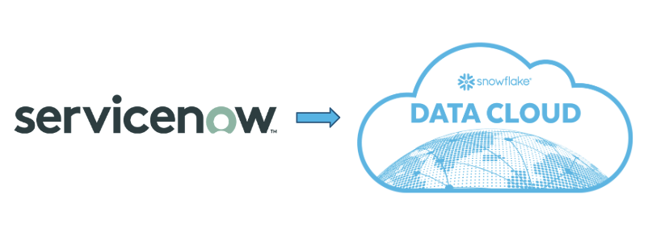

> aside positive
> Note: This quickstart assumes you do not have a ServiceNow account, so it guides you through the steps of creating a developer account. Of course, if you do have a Servicenow account, please feel free to try it out, with the caveat that, at the time of writing, the connector is in public preview and should not be used for production. 
### Prerequisites
- ServiceNow account with administrator's rights.
- ORGADMIN rights to Accept the Terms of Service in the Snowflake Marketplace.
- ACCOUNTADMIN rights on the Snowflake account where you will install the connector.

### What You’ll Learn 
- How to set up the Snowflake Connector for ServiceNow.
- How to ingest ServiceNow data into Snowflake
- How to stop the connector to avoid unnecessary costs in a development environment.
### What You’ll Need 
- A [Snowflake](https://snowflake.com/) Account 
- A [ServiceNow](https://developer.servicenow.com/dev.do/) developer account
### What You’ll Build 
A ServiceNow to Snowflake ingestion data flow.

<!-- ------------------------ -->
## Set up the ServiceNow Developer Instance
Duration: 5

If you do not want to test this connector on your ServiceNow account, no problem, this step explains how to set up a developer instance! 

1. Go to the [ServiceNow developer website](https://developer.servicenow.com), and create a developer user.

1. Log on to the developer website with your newly created user and select **Create an Instance**. 
1. Choose an instance type. You receive an email with your instance URL, and admin user and password. 

Deployment is usually pretty quick, around five minutes. But, while you wait let's go to the next step and configure Snowflake!
## Create and set up the Snowflake Account

### Create the Snowflake Account
If you do not have a Snowflake account, no problem, you can get a free trial  at [snowflake.com](https://www.snowflake.com/en/).Select **Start for Free** and follow the instructions. You will probably want to deploy in the same region as the ServiceNow deployment, but this is not a requirement for the lab. 
### Accept the Terms & Conditions
Duration: 1
1. Log on to your Snowflake account through the Snowsight web interface and change to the **orgadmin** role. 
1. Select “Admin -> Billing & Terms”.
4. In the “Snowflake Marketplace” section, review the Consumer Terms of Service.
5. If you agree to the terms, select “Accept Terms & Conditions”.

### Set up a Virtual Warehouse
Duration: 3

You'll need some compute for the connector, so let's set up a virtual warehouse to do that. A second virtual warehouse will be created automatically in the configure section.

Change to the **accountadmin** role.
1. Navigate to Admin -> Warehouses and select **+ Warehouse**. 
2. Name the  vitural warehouse **SERVICENOW_CONNECTOR_WH**, size XS, and, leaving the defaults, select **Create Warehouse**. 

### Install the ServiceNow connector
Duration: 3

The connector, the first of its kind to be deployed on Snowflake's native apps framework, is delivered through the Snowflake marketplace, available to all Snowflake customers instantly. Once chosen, it is installed into your account as a database with several schemas, tables, views, and protected stored procedures. 

1. From the Snowflake Account Home page, select **Marketplace**.
1. In the search window, enter **ServiceNow** and select the tile.
1. Review the business needs and usage samples. 
1. Select **Get**.
1. Select the warehouse you created above, **SERVICENOW_CONNECTOR_WH**.
1. Select **Options**.
1. For this lab, leave the default name for the installation database, **Snowflake_Connector_for_ServiceNow**. Do not select any additional roles.
1. Select **Get**. You receive the following message, **Snowflake Connector for SeviceNow is now ready to use in your account.**
1. Select **Done**. We will manage it in the next section. 

Let's check that the connector was installed. From Snowsight, go to **Data -> Databases**. You will see a new database with the name **Snowflake_Connector_for_ServiceNow**. Open the Public schema and views to see the Global_Config view. Some of the Procedures have
also been installed. Others will appear after the installation finishes. 

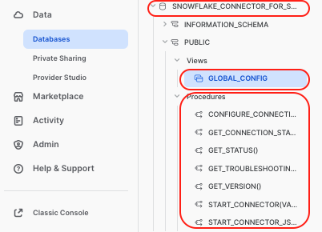

## Set up the Snowflake to ServiceNow Oauth hand-shake

This section shows how to set up the Oauth handshake using the Snowsight user interface, which is *massively* simpler than managing all the bits through code. 

Please have two tabs in your browser open for the next part, as you will have to copy some data from Snowflake to ServiceNow and vice-versa. 
* From the Snowflake side, we want the connector to generate the **re-direct URL** which we will paste into the Application Registry, and
* From the ServiceNow side we want the Application Registry to provide the **Client id** and **password**, which we then paste into Snowflake.

### On the Snowflake hand
Duration: 4

Launch the Snowflake Connector for ServiceNow from the **Marketplace** -> **Snowflake Connector for ServiceNow**.
1. Select **Manage**.
1. Select **Connect**. Select **Connect** again.
1. Fill in the ServicNow instance details. This is the first part of the ServiceNow URL for your ServiceNow account, **without** the trailing *service-now.com*.
1. Select **OAuth2** for the Authentication method.
1. Copy the redirect URL. You will need it in the next section.

Now, open a new tab in your browser (without closing the above), and follow the steps in the next section. 

### On the ServiceNow Other hand
Duration: 4

1. Log on to your ServiceNow developer instance.
1. From the main page, select **All** and search **Application Registry**.

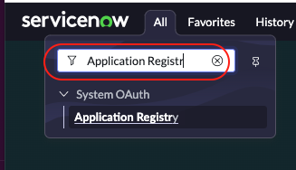
1. Select **New** in the upper right-hand side of the window.
1. Select **Create an OAuth API endpoint for external clients**. 
1. Give the endpoint a name, such as **Snowflake_connector**. Leave the client secret blank. This will autofill.
1. Paste in the redirect URL that was generated on the Snowflake hand. 

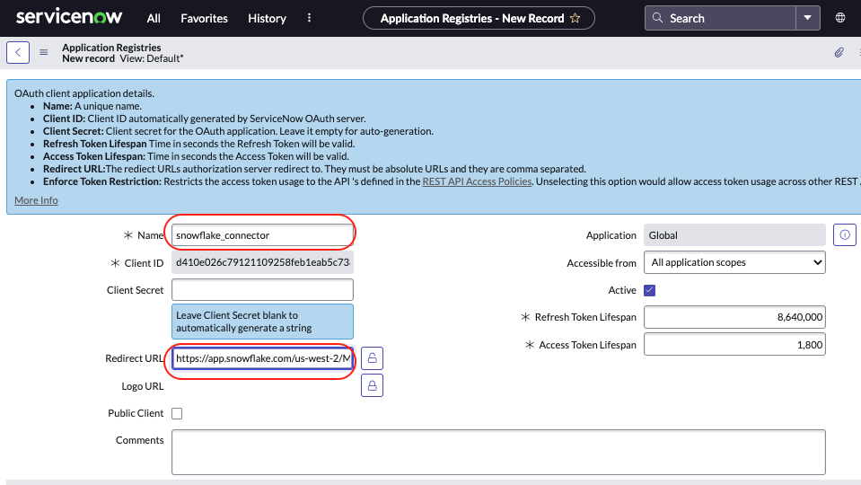
1. Select **Submit**. The window closes.
1. Select the registry you just created to re-open it. 
1. Note that the **Client id** and **Client secret** are auto-generated. 
1. Copy the **Client id**.

Now, time to jump back to the Snowflake configuration tab.

### Now Let's Shake
Duration: 1

1. Paste the  **Client id** from ServiceNow into the Snowflake configure pop-up.
1. Go back to the ServiceNow tab and copy the **Client secret** and paste it into the Snowflake configure pop-up. 
1. No need to change the Advanced Settings, but feel free to check them out.
 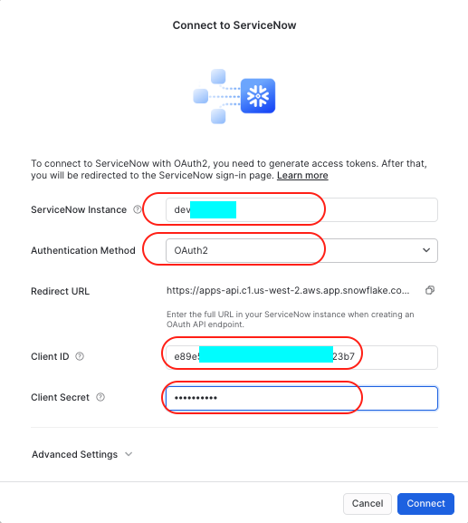
1. Select **Connect**. Your ServiceNow accounts pops up and requests to connect to Snowflake. 
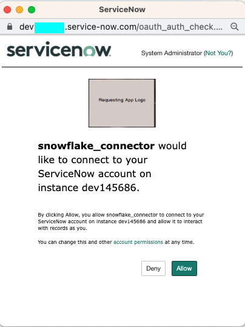
1. Select **Allow**.
The connection is established between the two systems. 

To verify the connection, select the three dots [...] and **View Details**. At the top of the pop-up you will see the date **ServiceNow** Authenticated.

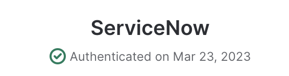

Select **Done**. 

> aside negative
> If you are having issues, perhaps the password wasn't copied. Unlock the password field and copy and paste the text.
## Configure the Connector
Duration: 5

Under the status for the connector, which displays "Choose Resources", select **Configure**.

This displays the Configure Connector dialog. By default, the fields are set to the names of objects that are created when you configure the connector.


Check out [Configuring the Snowflake Connector for ServiceNow](https://other-docs.snowflake.com/en/connectors/servicenow/servicenow-installing-ui.html#configuring-the-snowflake-connector-for-servicenow) for more information on these fields. 

Select **Configure**. The dialog box closes and the status of the connector changes to Provisioning. It can take a few minutes for the configuration process to complete.

> aside negative
> Watch out!!! The created warehouse is created as a **Large** and with a auto timeout of 10 minutes. So this means, if you set to refresh every hour, the Large warehouse (8 credits/hour) will wake up for a minimum of 10 minutes every hour.  For this lab, you don't need all the power! Go to Admin-> Warehouses -> SERVICENOW_WAREHOUSE -> ... > Edit, and change this to an XSMALL, and the auto timeout to one minute.

> aside positive
> Absolutely attach a resource monitor to the SERVICENOW_WAREHOUSE. Go to Admin->Resource Monitors->+ Resource Monitor, and create a warehouse resource monitor:
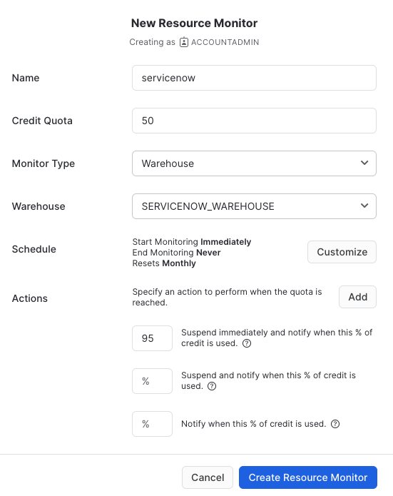

## Select ServiceNow Tables
Duration: 4

> aside negative
> A couple of things to be aware of:
> - The connector can only ingest tables with **sys_id** columns present.
> - ServiceNow views are not supported. Instead of ingesting these views, you should synchronize all tables for the underlying view and join the synchronized tables in Snowflake.
> - Incremental updates occur only for tables with **sys_updated_on** or **sys_created_on** columns.
> - For tables that do not have sys_updated_on or sys_created_on columns, the connector uses **truncate and load** mode.

1. In the **Snowflake Connector for ServiceNow** window, select **Select Tables**.

1. To be able to run our test query later, we need to ingest a couple of tables. From the search window enter **incident** and check the box next to it and choose a 24 hour sync time. 

1. To choose other tables, clear the search, put the table name and select the checkbox. Do this for the following tables:

   * sys_audit_delete
   * task

 > aside positive
 >   Hint: Clear the search fields, and then select the title **Status** to sort and show all the tables you selected.

 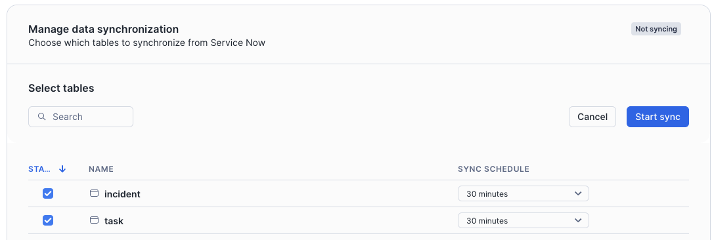


1. Select **Start Ingestion**. The select windows closes and you get the message "Loading Data" from the main Connector window. In addition to the tables you choose, three system tables will also be loaded. These are necessary to build the views on the raw data: sys_dictionary, sys_db_object, and sys_glide_object.

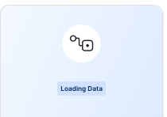

You receive a message indicating success:

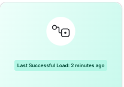

> aside negative
> Don't stop the ingest too quickly. Make sure the views are built in the destination database first.

## Connector Monitoring (Query Sync History)
 Duration: 5

In the connector interface, choose **Query Sync History.** A worksheet
opens with several SQL queries you can execute to get monitoring
information. Here are some examples:

```SQL
// Get general information about all ingestions
SELECT * FROM SNOWFLAKE_CONNECTOR_FOR_SERVICENOW.public.connector_stats;

// Search for information about particular table ingestions
SELECT * FROM SNOWFLAKE_CONNECTOR_FOR_SERVICENOW.public.connector_stats WHERE table_name = '<table_name>';

// Check connector configuration
SELECT * FROM SNOWFLAKE_CONNECTOR_FOR_SERVICENOW.public.global_config;

// Calculate ingested data volume
WITH d as (
    SELECT
        table_name,
        last_value(totalrows) OVER (PARTITION BY table_name ORDER BY run_end_time) AS row_count
    FROM SNOWFLAKE_CONNECTOR_FOR_SERVICENOW.public.connector_stats
)
SELECT table_name, max(row_count) as row_count FROM d GROUP BY table_name ORDER BY table_name;

// Connector runtime (minutes from start)
SELECT timediff('minute', min(run_start_time), max(run_end_time)) AS connector_runtime_in_minutes
FROM SNOWFLAKE_CONNECTOR_FOR_SERVICENOW.public.connector_stats;
```


## Setting reader role permissions
Duration: 3

Now that you have ingested some data, let's alter the **servicenow_reader_role** to give it access to the database, schema, future tables, future views, and virtual warehouse.
```SQL
USE ROLE accountadmin;
CREATE ROLE IF NOT EXISTS servicenow_reader_role IF NOT EXISTS;
GRANT USAGE ON DATABASE SERVICENOW_DEST_DB TO ROLE servicenow_reader_role;
GRANT USAGE ON SCHEMA DEST_SCHEMA TO ROLE servicenow_reader_role; 
GRANT SELECT ON FUTURE TABLES IN SCHEMA DEST_SCHEMA TO ROLE servicenow_reader_role;
GRANT SELECT ON FUTURE VIEWS IN SCHEMA DEST_SCHEMA TO ROLE servicenow_reader_role;
GRANT SELECT ON ALL TABLES IN SCHEMA DEST_SCHEMA TO ROLE servicenow_reader_role;
GRANT SELECT ON ALL VIEWS IN SCHEMA DEST_SCHEMA TO ROLE servicenow_reader_role;
GRANT USAGE ON WAREHOUSE SERVICENOW_WAREHOUSE TO ROLE servicenow_reader_role;
```
## Query the Data
Duration: 5

Check out the tables that the connector has created under the DEST_SCHEMA. For each table in ServiceNow that is configured for synchronization, the connector creates the following table and views:

- A table with the same name that contains the data in raw form, where each record is contained in a single VARIANT column.

- A view named table_name__view that contains the data in flattened form, where the view contains a column for each column in the original table and a row for each record that is present in the original table.

> aside negative
> Warning! After you start the connector, it takes for the views to be created. The creation of the views relies on data in the ServiceNow sys_db_object, sys_dictionary and sys_glide_object tables. The connector loads metadata from these ServiceNow tables after you enable any table for synchronization. It can take some time for the connector to load this metadata. Do not stop the warehouse during this time!

- A view named table_name__view_with_deleted that contains the same data as table_name__view as well as rows for records that have been deleted in ServiceNow.

- A table table_name__event_log that contains the history of changes made to records in ServiceNow.

 To query from the raw data, check out [Accessing the raw data](https://other-docs.snowflake.com/en/connectors/servicenow/servicenow-accessing-data.html#accessing-the-raw-data). To query the views (recommended), check out [Accessing the flattened data](https://other-docs.snowflake.com/en/connectors/servicenow/servicenow-accessing-data.html#accessing-the-flattened-data).

### Use this query to identify number of incidents raised by month and priority
Here's a little test query for you to identify the number of incidents raised by month and priority. Other example queries are provided on the Snowflake Connector for ServiceNow page in the Marketplace.

```SQL
USE ROLE ACCOUNTADMIN;
USE DATABASE SERVICENOW_DEST_DB;
USE SCHEMA DEST_SCHEMA;

WITH T1 AS (
    SELECT
    DISTINCT
        T.NUMBER AS TICKET_NUMBER
        ,T.SHORT_DESCRIPTION
        ,T.DESCRIPTION
        ,T.PRIORITY
        ,T.SYS_CREATED_ON AS CREATED_ON
        ,T.SYS_UPDATED_ON AS UPDATED_ON
        ,T.CLOSED_AT
    FROM
      TASK__VIEW T
     LEFT JOIN 
          INCIDENT__VIEW I 
          ON I.SYS_ID = T.SYS_ID -- ADDITIONAL INCIDENT DETAIL
      LEFT JOIN 
          SYS_AUDIT_DELETE__VIEW DEL 
          ON T.SYS_ID = DEL.DOCUMENTKEY -- THIS JOIN HELPS IDENTIFY DELETED TICKETS  
    WHERE
        DEL.DOCUMENTKEY IS NULL --  THIS CONDITION HELPS KEEP ALL DELETED RECORDS OUT
    AND
        I.SYS_ID IS NOT NULL -- THIS CONDITION HELPS KEEP JUST THE INCIDENT TICKETS
)
SELECT
    YEAR(CREATED_ON) AS YEAR_CREATED
    ,MONTH(CREATED_ON) AS MONTH_CREATED
    ,CONFIGURATION_ITEM AS APPLICATION
    ,PRIORITY
    ,COUNT(DISTINCT TICKET_NUMBER) AS NUM_INCIDENTS
FROM
    T1
GROUP BY
    YEAR_CREATED
    ,MONTH_CREATED
    ,PRIORITY
ORDER BY
    YEAR_CREATED
    ,MONTH_CREATED
    ,PRIORITY
;
```
## Setting the monitoring role permissions
If you would like to monitor errors, run stats, connector stats, enabled tables, you can set up a ServiceNow monitoring role that allows access to the views in the connector database.  For example, run the following in a worksheet (and then use the role):
```SQL
USE ROLE accountadmin;
CREATE ROLE IF NOT EXISTS servicenow_monitor_role ;
GRANT IMPORTED PRIVILEGES ON DATABASE SNOWFLAKE_CONNECTOR_FOR_SERVICENOW TO ROLE servicenow_monitor_role;
GRANT USAGE ON SCHEMA PUBLIC TO ROLE servicenow_monitor_role; 
GRANT SELECT ON FUTURE TABLES IN SCHEMA PUBLIC TO ROLE servicenow_monitor_role;
GRANT SELECT ON FUTURE VIEWS IN SCHEMA PUBLIC TO ROLE servicenow_monitor_role;
GRANT SELECT ON ALL TABLES IN SCHEMA PUBLIC TO ROLE servicenow_monitor_role;
GRANT SELECT ON ALL VIEWS IN SCHEMA PUBLIC TO ROLE servicenow_monitor_role;
GRANT USAGE ON WAREHOUSE SERVICENOW_WAREHOUSE TO ROLE servicenow_monitor_role;
GRANT ROLE servicenow_monitor_role to role accountadmin;

```

## In the Development Environment Stop the Ingestion
Duration: 1

During this lab, we're only ingesting the data, so it makes sense to stop the ingestion after that initial load. However, in an operational environment, you would keep it running.

> aside negative
> If you do not stop the connector, it will wake up the virtual warehouse at the specified time interval and consume credits.


1. In Snowsight, select the **Snowflake Connector for ServiceNow** tile.

1. In the **Snowflake Connector for ServiceNow** window, select **Stop Ingestion**.

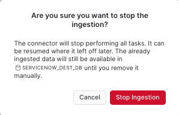

Read the warning and select **Stop Ingestion**.

## Uninstall the Connector (but not the data)
If you are using the public preview connector, make sure to check out the limitations, one of which is during the preview period, before the connector is generally available, Snowflake will release an update that requires you to **uninstall** and reinstall the connector from the Snowflake Marketplace.

To drop the connector you need to drop the connector database: 
```SQL
DROP DATABASE SNOWFLAKE_CONNECTOR_FOR_SERVICENOW;

```
## Conclusion
Duration: 1

Hey, congrats! You set up the Snowflake Connector for ServiceNow, ingested some data and ran a query!


