authors: Venkatesh Sekar, Jhonatan Garrido-Lecca
id: sf-esri-arcgis-locationservice
categories: snowflake-site:taxonomy/solution-center/certification/quickstart, snowflake-site:taxonomy/product/ai, snowflake-site:taxonomy/product/applications-and-collaboration, snowflake-site:taxonomy/snowflake-feature/build
language: en
summary: Calculate ISOChrone or ServiceArea using ArcGIS Location Services (API), natively in Snowflake. 
environments: web
status: Published 
feedback link: https://github.com/Snowflake-Labs/sfguides/issues

# Interfacing with ArcGIS Location Services (API) using Snowpark

<!-- ------------------------ -->
## Overview 

The [ArcGIS Location Services](https://developers.arcgis.com/documentation/mapping-and-location-services/) are services hosted by Esri that provide geospatial functionality and data for building mapping applications. You can use the service APIs to display maps, access basemaps styles, visualize data, find places, geocode addresses, find optimized routes, enrich data, and perform other mapping operations. The services also support advanced routing operations such as fleet routing, calculating service areas, and solving location-allocation problems. To build applications you can use ArcGIS Maps SDKs, open source libraries, and scripting APIs.

This process also can be replicated if users have [ArcGIS Enterprise] (https://enterprise.arcgis.com/en/)

A service area, also known as an isochrone, is a polygon that represents the distance that can be reached when driving or walking on a street network. This type of analysis is common in real estate search or determining the driving proximity to schools, businesses, or other facilities. For example, you can create a drive time polygon that represents how far you can drive in any direction from the center of a city in 20 minutes.

You can use service areas to build applications that:

- Visualize and measure the accessibility of locations that provide some kind of service. For example, a three-minute drive-time polygon around a grocery store can determine which residents are able to reach the store within three minutes and are thus more likely to shop there.

- By generating multiple service areas around one or more locations that can show how accessibility changes with an increase in travel time or travel distance. It can be used, for example, to determine how many hospitals are within 5, 10, and 15 minute drive times of schools.

- When creating service areas based on travel times, the service can make use of traffic data, which can influence the area that can be reached during different times of the day.

### What You Will Learn 

In this Quickstart you will be go over the steps of calculating servicearea/isochrones using the ArcGIS Location Services. You will also be visualizing them using ArcGIS Pro. 
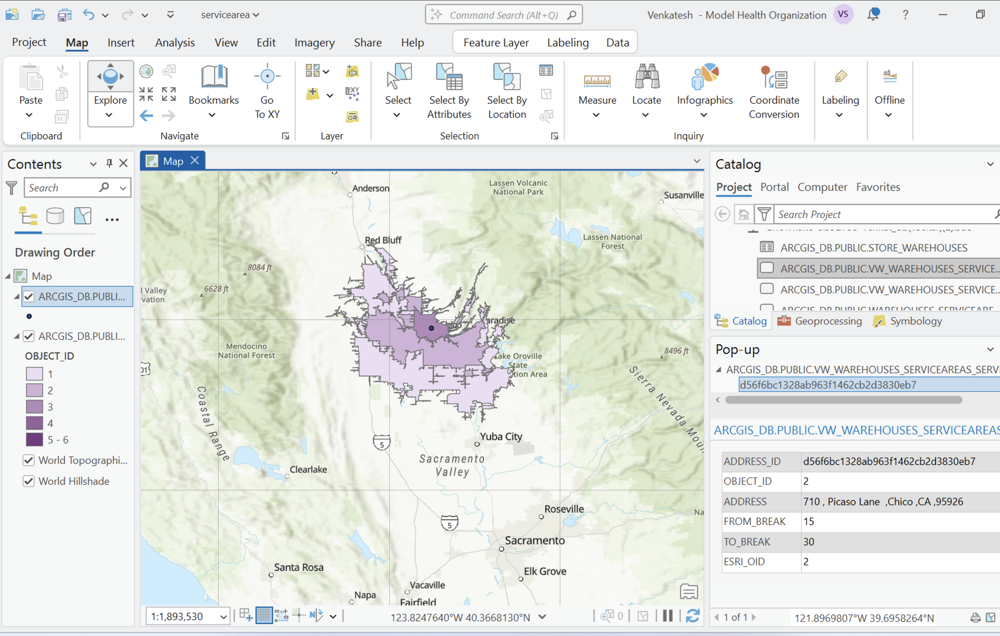

### What You Will Build
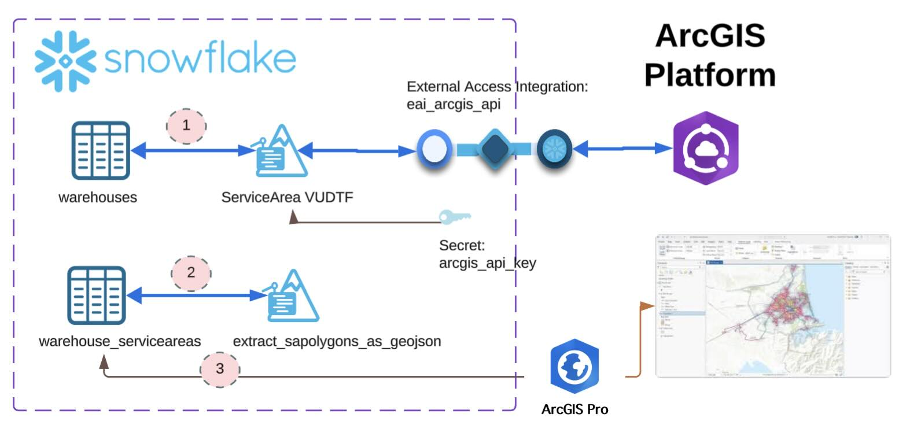

  1. Develop a Snowpark UDF which invokves the ArcGIS ServiceArea service function and stores the response back into the source table.
  2. Develop a Snowpark UDF which extracts and converts the geometry from ArcGIS reponse into Geojson co-ordinates.
  3. Connect and visualize the service areas / isochrones using ArcGIS Pro.

### What You will Need 

- A [Snowflake](https://signup.snowflake.com/?utm_source=snowflake-devrel&utm_medium=developer-guides&utm_cta=developer-guides) Account.
- A [ArcGIS](https://www.esri.com/en-us/arcgis/products/arcgis-online/trial) Account.
- A [ArcGIS Pro](https://www.esri.com/en-us/arcgis/products/arcgis-pro/trial) Installed.

### Prerequisites

- A Snowflake account with [Anaconda Packages enabled by ORGADMIN](https://docs.snowflake.com/en/developer-guide/udf/python/udf-python-packages.html#using-third-party-packages-from-anaconda). If you do not have a Snowflake account, you can register for a [free trial account](https://signup.snowflake.com/?utm_source=snowflake-devrel&utm_medium=developer-guides&utm_cta=developer-guides).
- A Snowflake account login with ACCOUNTADMIN role. If you have this role in your environment, you may choose to use it. If not, you will need to :
  1. Register for a free trial.
  2. Use a different role that has the ability to 
     - create database, schema, tables, stages ,UDFs.
     - create secrets, network rule, external access integrations.
     - create notebook, streamlit. 
  3. Use an existing database and schema in which you are able to create the mentioned objects.

### Skills
  It is assumed that you have the following skills:
  - Intermediate knowledge of Snowflake.
  - Intermediate knowledge of Snowpark (Python).
  - Knowledge of creating and using Snowflake notebook.
  - Knowledgeable on ArcGIS and ArcGIS Pro.
  - Basic understanding of Geospatial concepts.

> 
> **INFO:** If you want to understand Geospatial capabilities of Snowflake, please feel free to go over the [Quickstart: Getting Started with Geospatial - Geography](/en/developers/guides/getting-started-with-geospatial-geography/).

> 
> **IMPORTANT:** Before proceeding, make sure you have a Snowflake account with Anaconda packages enabled by ORGADMIN as described [here](https://docs.snowflake.com/en/developer-guide/udf/python/udf-python-packages#getting-started).

<!-- ------------------------ -->
## Setting Up An ArcGIS account

### (Optional) Create ArcGIS account
This tutorial requires ArcGIS account, preferrably with appropriate privileges to create API key and optionally to connect via ArcGIS pro.
If you do not have those privileges or wish to create one, you can sign up for an [ArcGIS Online Trial](https://www.esri.com/en-us/arcgis/products/arcgis-online/trial) account.

### Create an API Key
You will be invoking API services in ArcGIS, using Snowpark UDF. For this, you will need to create an API key with appropriate privileges as found in the [documentation: Create API key credentials](https://developers.arcgis.com/documentation/security-and-authentication/api-key-authentication/api-key-credentials/#create-api-key-credentials).  

Keep the API key saved in a secure location. You will need it in the folowing steps.

> 
> **IMPORTANT:** Ensure the privilege for the API key is enabled as below:

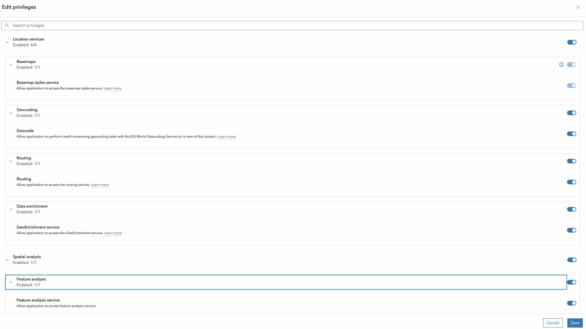

---

### Configure ArcGIS Pro and Snowflake connectivity

You will be visualizing the service area using ArcGIS Pro. To do that, you will need to connect to your Snowflake account from ArcGIS Pro.

Follow the instructions in the [documentation: Connect to Snowflake from ArcGIS](https://pro.arcgis.com/en/pro-app/latest/help/data/databases/connect-snowflake.htm).

<!-- ----------------------------------------- -->
## Setup An Snowflake Account

### Create Database and assets

In this step, you will create a new database, schema, and warehouse to store the data and run the queries.

**NOTE:** To keep it simple, we will using the accountadmin by default. But in real world, you should be using a custom role with the appropriate privileges.

Open up a new SQL worksheet and run the following commands. To open up a new SQL worksheet, select Projects » Worksheets, then click the blue plus button and select SQL worksheet.

~~~sql
use role accountadmin;

-- you can create the warehouse as below or use any
-- existing warehouse that you have access to.
create warehouse if not exists compute_wh
  warehouse_type = standard
  warehouse_size = xsmall
  auto_suspend = 600
  auto_resume = true
  initially_suspended = true
  ;

create database if not exists arcgis_db;

-- a default schema 'public' is created by default when a database is created.

~~~

> 
> **IMPORTANT:** If you want to explore and learn more about the Snowflake Notebook, please go over the [Quickstart: Getting Started with Snowflake Notebooks](/en/developers/guides/getting-started-with-snowflake-notebooks/).

<!-- ------------------------ -->
## Defining UDF ServiceArea Calculation

### Importing and running the notebook
The codebase needed for the quickstart is available in the notebook. You will need to import it into your Snowflake account as follows:

1. Download the notebook: [ARCGIS_SERVICEAREA.ipynb](https://github.com/Snowflake-Labs/snowflake-demo-notebooks/blob/main/ArcGIS_Snowflake/ARCGIS_SERVICEAREA.ipynb).Download the file by clicking on the `Download raw file` from the top right.
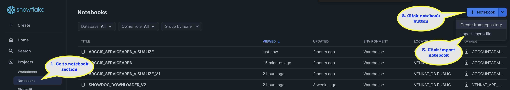
1. On your Snowflake web interface, [Snowsight](https://app.snowflake.com), Navigate to `Project` > `Notebooks` from the left menu bar. 
2. Click the notebook button on the top right and select `Import from .ipynb` from the dropdown.
3. Select the downloaded notebook file from your local directory and press `Open`.
4. A `Create Notebook` dialog will show up. Select database, schema, and warehouse for the Notebook and click `Create`.
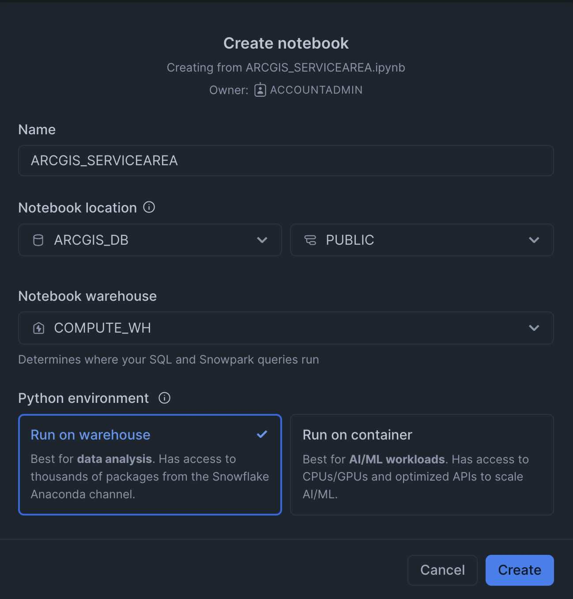
1. Add packages to the notebook. You need to add the following packages:
   1. pydeck
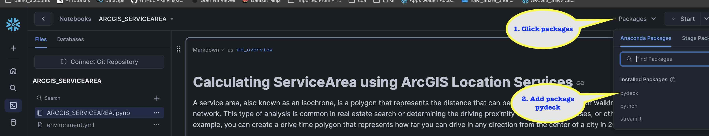
1. Update the variables in the cell 'initialization'. 
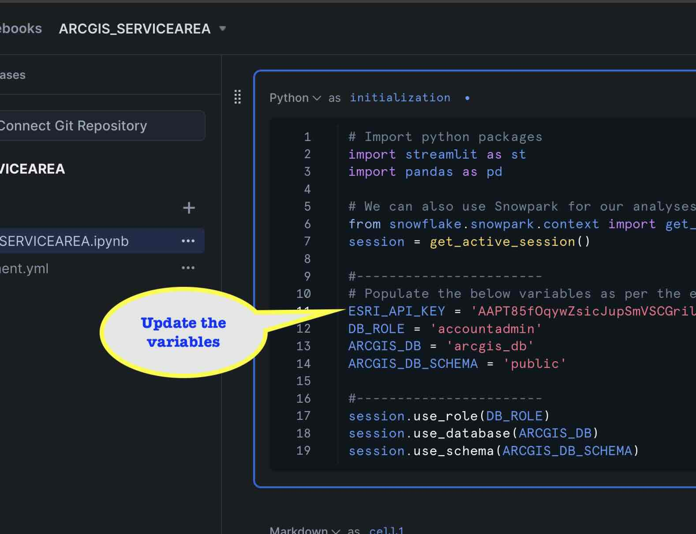
1.  Start the notebook session by clicking 'Start'. and wait for the status to change to 'Active'. 
2.  Run the notebook cells, by clicking 'Run all'.
    
### Solution execution
Once all the cell has been executed successfully, you will see the following objects in the database.

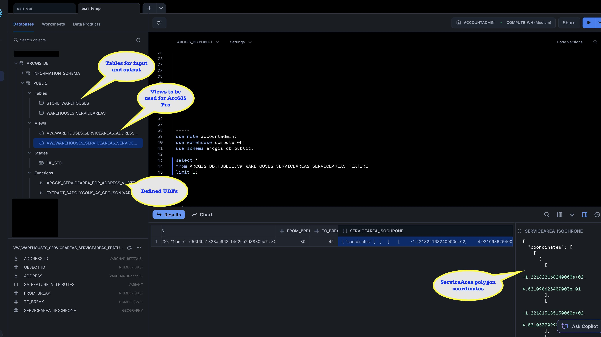

The notebook also creates an quick visualization of the service area also:

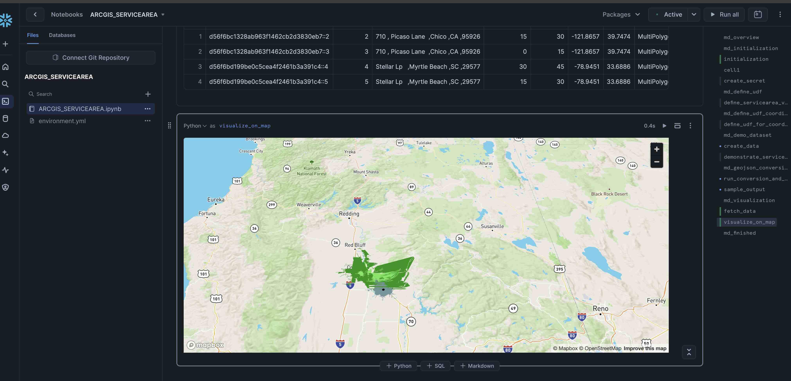

<!-- ------------------------ -->
## Visualizing Using ArcGIS Pro

In this step, you will be connecting to your Snowflake account from ArcGIS Pro and visualize the service areas.

> 
> **Warning:** It is assumed that you had already Snowflake setup connection in ArcGIS Pro.

1. Open ArcGIS Pro, on your laptop and Create a new project
2. Add a new map.
3. Create a Snowflake connection, ensure database and role are set correctly.
  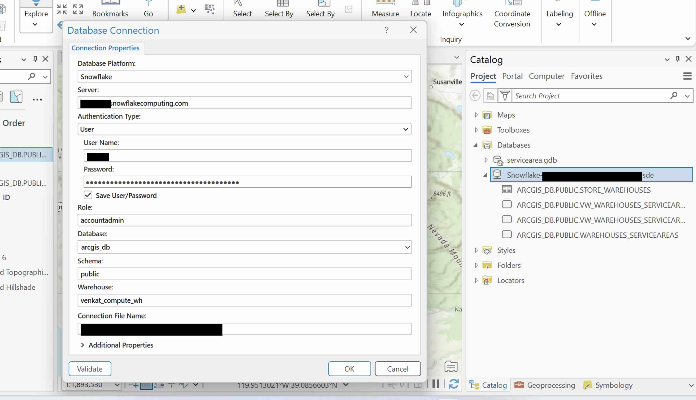
4. Add the view ' vw_warehouses_serviceareas_serviceareas_feature' to the map. 
  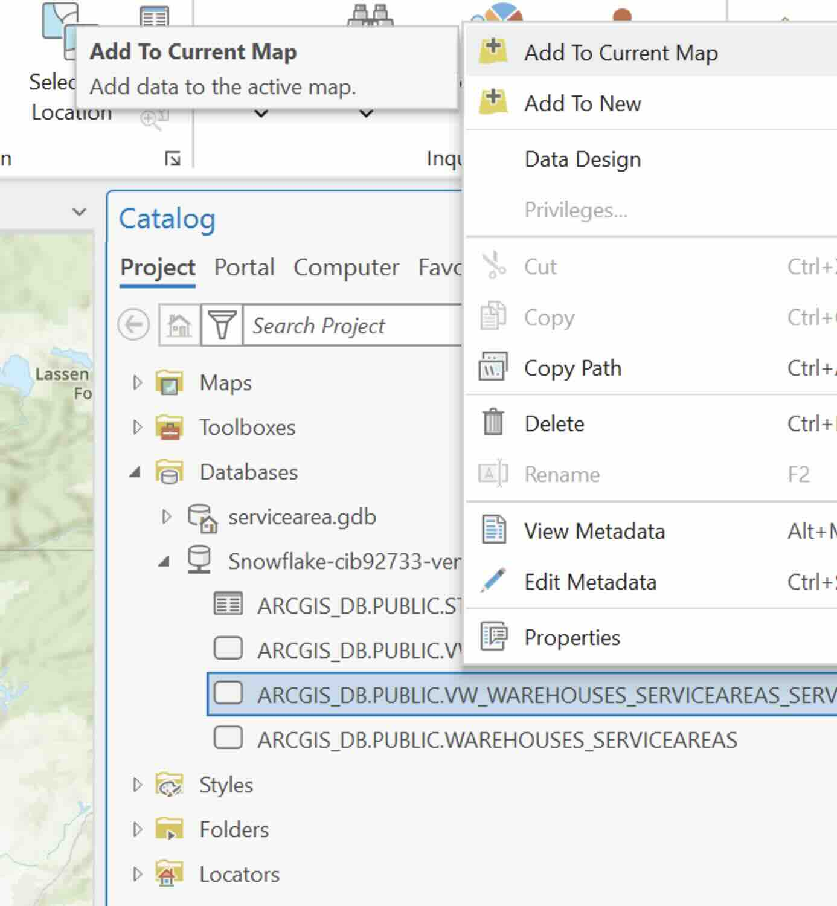
  - In the resulting dialog, select as follows:
  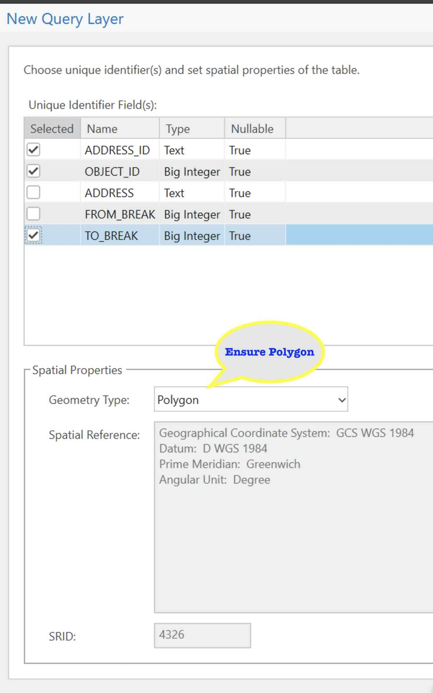 
  - Update the Symbology as in the diagram:
  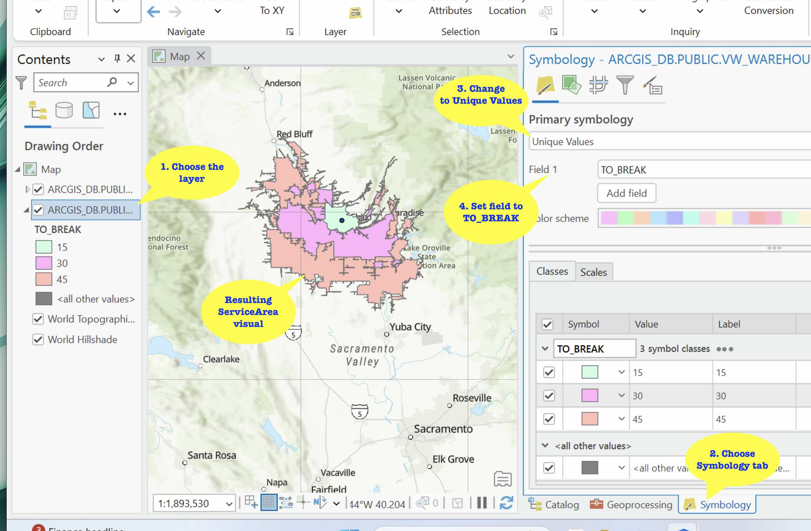 
5. Repeat the process to add the view 'vw_warehouses_serviceareas_address_feature' to the map. This feature is to display the warehouse address location hence the Geometry Type is 'Point'. The Symbology need not be updated.
  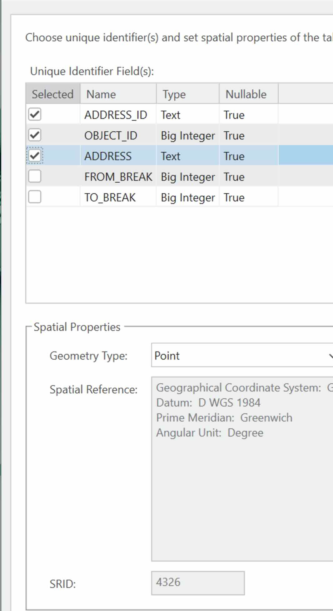

Once you have added the features to the map, you will see the service area and the warehouse location as shown below:

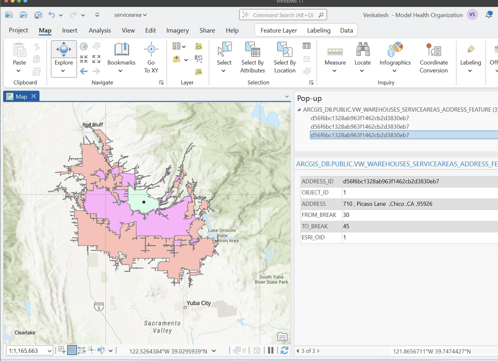

> 
> **Idea:** If you want to play with the layers you can take advantage of the [query layer feature in ArcGIS Pro](https://pro.arcgis.com/en/pro-app/latest/help/mapping/layer-properties/create-a-query-layer-cloud-data-warehouse.htm). This feature will allow you to create queries on the fly and customize your visualization of Snowflake data. 

<!-- ------------------------ -->
## Conclusion And Resources

Having gone over the tutorial, you now have seen how to communicate with ArcGIS Location services and enrich your data.

Snowflake provides powerful solutions when you bring Snowflake's advanced analytics, a rich set of geospatial functions, Cortex (Generative AI), Snowpark and Streamlit's visualization capabilities together. With a rich dataset of marketplace providers, and the ability to enrich and derive insights on your data and new use case is easier.

### What You Learned
  - How to define a Snowpark UDF which invokes the ArcGIS Location services.
  - Stores the response back into the a table and extract appropriate geometry.
  - Connect and visualize the service areas / isochrones using ArcGIS Pro.

### Related Resources
- [Snowflake Geospatial functions](https://docs.snowflake.com/en/sql-reference/functions-geospatial)
- [Geospatial Analytics, AI and ML using Snowflake](/en/developers/guides/geo-for-machine-learning/)
- [ArcGIS Location services](https://developers.arcgis.com/rest/location-based-services/)
