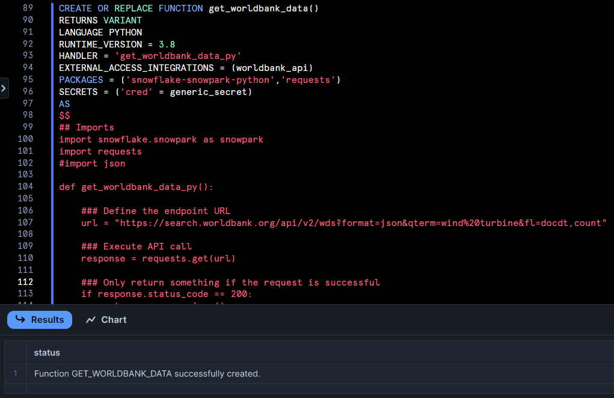
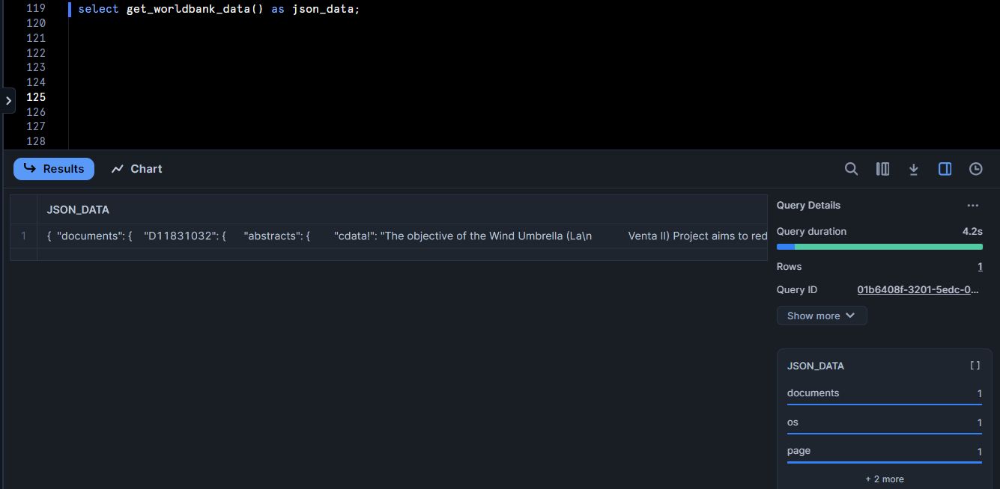

summary: Retrieve Data from an API in Snowflake
id: retrieve_data_from_an_API
categories: featured,getting-started
environments: test, web, hello
status: Published
feedback link: https://github.com/Snowflake-Labs/sfguides/issues
tags: Getting Started, SQL, Data Engineering

# Retrieve Data from an API in Snowflake
<!-- ------------------------ -->
## Overview 
Duration: 3

Snowflake External Network access feature allows us to reach network sites outside of Snowflake. This access can be used within stored procedures and user-defined functions for a variety of purposes, including using an API or an external service.

External network access Feature is Generally Available now.

More Reads :: [External network access overview](https://docs.snowflake.com/en/developer-guide/external-network-access/external-network-access-overview)

### Prerequisites
- A familiarity with [Snowflake](https://www.youtube.com/watch?v=fEtoYweBNQ4)
- A familiarity with SQL

### What You’ll Learn 
- Main components involved for external access in Snowflake
- Configure an Outbound Network Rule
- Set Up an External Access Integration
- Create and execute user defined function (UDF)
- Perform transformations on JSON data
- Use PIVOT to convert rows to columns

### What You’ll Need 
- A [Snowflake](https://signup.snowflake.com/?lab=getStartedWithTimeTravel&utm_cta=quickstart-getstartedwithtimetravel-en) Account

- [Support case request](https://docs.snowflake.com/user-guide/contacting-support) from your Snowflake environment to get external access enabled for your trial account.

### What You’ll Build 
- Create a UDF that calls external API

<!-- ------------------------ -->

## Introducing the API
Duration: 1

The World Bank offers an API that allows for the search and retrieval of the public, Bank documents available in the Documents & Reports site. Records can be retrieved in a format useful for research and for inclusion in web sites outside of Documents & Reports and the World Bank. 

We will use a World Bank API that does not require any API keys or other authentication method.

More Reads :: [The World Bank Documents & Report API](https://documents.worldbank.org/en/publication/documents-reports/api)

We will use the following API for our purposes: 
https://search.worldbank.org/api/v2/wds?format=json&qterm=wind%20turbine&fl=docdt,count

If you copy paste this URL in your browser, you will see JSON payload.


<!-- ------------------------ -->

## Architecture
Duration: 1

Let's look at the architecture used in Snowflake for external access before moving on to our particular example. There are four primary components:

1. A network rule governing the destinations to which traffic is permitted to flow.

2. The network rule can be utilized by Snowflake objects through an integration of external access.

3. An extra security feature that can be added to help with authentication. This typically uses a related Security Integration object that enables OAuth authentication with an API endpoint, or it makes use of a Snowflake Secret object that may securely store data, including a login and password.

4. A user defined function (UDF) or stored procedure that utilizes the external access integration is an example of a Snowflake object.


Let's start creating our database objects now.

<!-- ------------------------ -->

## Generate Database Objects
Duration: 5

Within the Snowflake web console, navigate to **Worksheets** and create a new SQL worksheet. Then enter and execute the following SQL commands.

### Create Database

```
create or replace database api_db;
```


Use the above command to make a database called ‘api_db’. The **Results** output will show a status message of `Database API_DB successfully created`.

### Create Table

```
create or replace table api_table(json_data variant);
```

This command creates a table named ‘api_table’ on the api_db database. The **Results** output should show a status message of `Table API_TABLE successfully created`.


We will store JSON payload returned from calling API into this table. Therefore, we create this table with only 1 column with data type VARIANT.  

<!-- ------------------------ -->
## Step 1 - Configure an Outbound Network Rule
Duration: 2

Network rules are database objects used by Snowflake to store data about a particular kind of network traffic. One of two categories could apply to this traffic:

1. Ingress – Traffic from outside of Snowflake that is coming in to Snowflake
2. Egress – Traffic that is leaving Snowflake and travelling outside

This rule encapsulates parameters such as MODE (e.g., EGRESS), TYPE (e.g., HOST_PORT), and VALUE_LIST (e.g., endpoint details).

More Reads :: [Creating a network rule to represent the external network location](https://docs.snowflake.com/en/developer-guide/external-network-access/creating-using-external-network-access#label-creating-using-external-access-integration-network-rule)

Our network rule is called "network_rule" and our API endpoint is search.worldbank.org.

### Create NETWORK RULE
```
Create or Replace NETWORK RULE network_rule
MODE = EGRESS
TYPE = HOST_PORT
VALUE_LIST = ('search.worldbank.org')
```


Use the above command to create network rule. The **Results** output will show a status message of `Netowrk rule NETWORK_RULE is created`.

<!-- ------------------------ -->
## Step 2 - Create a Secret
Duration: 4

Next, we create a secret containing the login credentials needed to authenticate with the external network location using the CREATE SECRET command. Passwords, usernames, and references to security integrations for OAuth flows are examples of secrets.

More Reads :: [Creating a secret to represent credentials](https://docs.snowflake.com/en/developer-guide/external-network-access/creating-using-external-network-access#label-creating-using-external-access-integration-secret)

However, in this particular instance, authentication is not required as we are using Public API. 

### Create a Secret

```
CREATE OR REPLACE SECRET generic_secret
type = generic_string
SECRET_STRING = 'replace_with_your_API_key'
```


Use the above command to create a secret. The **Results** output will show a status message of `Secret GENERIC_SECRET successfully created`.

<!-- ------------------------ -->
## Step 3 - Create an External Access Integration
Duration: 5

The CREATE EXTERNAL ACCESS INTEGRATION command is used to aggregate the permitted network rules and secrets. The locations and login credentials that User-Defined Functions (UDFs) and procedures are allowed to utilize are specified by this integration.

More Reads :: [Creating an external access integration](https://docs.snowflake.com/en/developer-guide/external-network-access/creating-using-external-network-access#label-creating-using-external-access-integration-access-integration)
 
Here, the name of our external access integration is worldbank_api and we are configuring it to use the network rule and authentication secret we create in earlier step.

### CREATE OR REPLACE EXTERNAL ACCESS INTEGRATION

```
CREATE OR REPLACE EXTERNAL ACCESS INTEGRATION worldbank_api
allowed_network_rules = (network_rule)
allowed_authentication_secrets = (generic_secret)
enabled = true;
```


Use the above command to create external access integration. The **Results** output will show a status message of `Integration WORLDBANK_API successfully created`.

<!-- ------------------------ -->
## Step 4 - Create UDF 
Duration: 10

We use the CREATE FUNCTION command and specify one or more integrations for the EXTERNAL_ACCESS_INTEGRATIONS parameter. 

More Reads :: [CREATE FUNCTION](https://docs.snowflake.com/en/sql-reference/sql/create-function)

We add the SECRETS parameter, which defines the secrets that can be retrieved from the handler code.

### CREATE OR REPLACE FUNCTION

```
CREATE OR REPLACE FUNCTION get_worldbank_data() 
RETURNS VARIANT 
LANGUAGE PYTHON 
RUNTIME_VERSION = 3.8 
HANDLER = 'get_worldbank_data_py' 
EXTERNAL_ACCESS_INTEGRATIONS = (worldbank_api) 
PACKAGES = ('snowflake-snowpark-python', 'requests') 
SECRETS = ('cred' = generic_secret) 
AS 
$$
## Imports
import snowflake.snowpark as snowpark
import requests

def get_worldbank_data_py():
    
    ### Define the endpoint URL
    url = "https://search.worldbank.org/api/v2/wds?format=json&qterm=wind%20turbine&fl=docdt,count"

    ### Execute API call
    response = requests.get(url)

    ### Only return something if the request is successful
    if response.status_code == 200:
        return response.json()
    else:
        raise Exception(f"Error. Response code: {str(response.status_code)}")
$$;
```


Use the above command to create a function. The **Results** output will show a status message of `Function GET_WORLDBANK_DATA successfully created`.

<!-- ------------------------ -->
## Step 5 - Execute Snowflake Function
Duration: 1

Let us execute the function that we create in earlier step.

### CALL FUNCTION

```
select get_worldbank_data() as json_data;
```


After executing the above command, you can see just 1 row returned by our function which represents the entire JSON payload.

<!-- ------------------------ -->

## Step 6 - View JSON Payload in editor
Duration: 1

Let us view this JSON payload in editor. You will see documents node containing 11 nested json objects, which in turn contain nested json objects like abstracts,entityids etc.


<!-- ------------------------ -->
## Step 7 - Insert JSON data into table
Duration: 1

Let us insert the JSON payload from the earlier step into our api_table.

### INSERT INTO TABLE

```
insert into
    api_table
SELECT
    *
FROM
    (
        SELECT
            get_worldbank_data()
    );

```


<!-- ------------------------ -->

## Step 7 - Flatten documents node
Duration: 3

LATERAL FLATTEN function in Snowflake is used to transform semi-structured data, such as JSON, into a relational format. Specifically, it "flattens" nested arrays and objects into a set of rows, allowing us to work with the data more easily using SQL queries.

More Reads :: [LATERAL](https://docs.snowflake.com/en/sql-reference/constructs/join-lateral)

Let us flatten the documents node.

### FLATTEN DOCUMENTS NODE

```
select
    key,
    value
from 
    api_table,
    LATERAL FLATTEN(input => json_data:documents) AS flattened
```


<!-- ------------------------ -->

## Step 8 - Flatten nested JSON Objects
Duration: 3

In order to get to individual properties for each document node, we need to flatten again. To do this, we will use the same query as above, but use it as a CTE for our own query that will flatten data.


### FLATTEN NESTED JSON OBJECTS

```
with cte as
(
select
    key,
    value
from 
    api_table,
    LATERAL FLATTEN(input => json_data:documents) AS flattened
)
select 
    cte.key,
    flattened2.key,
    flattened2.value::STRING
from 
    cte,
    LATERAL FLATTEN(input => value) AS flattened2;
```


Notice that we get 2 key columns, one from CTE and other from select query. The value column now shows individual properties for each key that is flattened in select query. 

We will now convert several rows for a document to just one, and display all properties for that document in different columns on same row. In other words, we will convert rows to column.

However, before we do that, please note that there are a few nested JSON objects like cdata and entityid in value column. We will not flatten these anymore, and just pick few values to show in our next query.

We will also do a transformation to remove any unnecessary spaces appearing in the data. 

<!-- ------------------------ -->

## Step 9 - Pivot
Duration: 3

In Snowflake, the PIVOT function is used to rotate rows into columns, effectively transforming the data to provide a different perspective, making it easier to analyze. 

More Reads :: [Pivot](https://docs.snowflake.com/en/sql-reference/constructs/pivot)

In our following query, we will pivot the following properties:
1. id
2. count
3. display_title
4. docdt
5. url

### PIVOT

```
with cte2 as (
    with cte as (
        select
            key,
            value
        from
            api_table,
            LATERAL FLATTEN(input => json_data:documents) AS flattened
    )
    select
        cte.key as name,
        flattened2.key,
        --flattened2.value::STRING as value,
        REPLACE(flattened2.value, '  ', '')::STRING as value,
    from
        cte,
        LATERAL FLATTEN(input => value) AS flattened2
)
select
    *
from
    cte2 PIVOT (
        MAX(value) FOR key IN ('id', 'count', 'display_title', 'docdt', 'url')
    ) AS p (name, id, count, title, document_date, url)
```


The **Results** output now shows one row for each document along with it's properties in columns. 
<!-- ------------------------ -->
