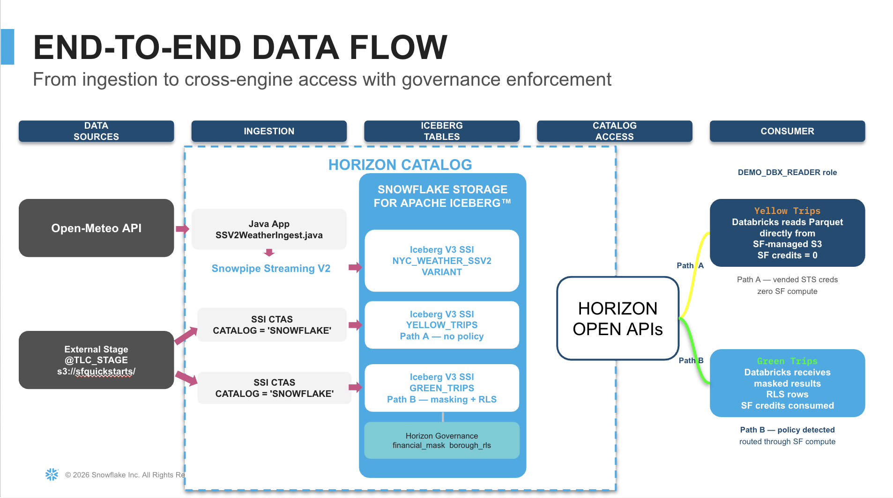

author: Sahil Walia
id: sfguide-iceberg-zero-tax-analytics
language: en
summary: Eliminate storage, interoperability, and AI access taxes — build Snowflake-managed Iceberg tables, stream live data via SSV2, enforce cross-engine governance with Horizon, read from Databricks, and serve natural-language analytics through a Semantic View and Cortex Agent.
categories: snowflake-site:taxonomy/solution-center/certification/quickstart, snowflake-site:taxonomy/product/data-engineering, snowflake-site:taxonomy/snowflake-feature/interoperable-storage, snowflake-site:taxonomy/snowflake-feature/apache-iceberg, snowflake-site:taxonomy/snowflake-feature/snowpipe-streaming, snowflake-site:taxonomy/snowflake-feature/horizon, snowflake-site:taxonomy/snowflake-feature/cortex
environments: web
status: Published
feedback link: https://github.com/Snowflake-Labs/sfguides/issues
fork repo link: https://github.com/Snowflake-Labs/sfguide-iceberg-zero-tax-analytics

# Open Lakehouse Done Right: Iceberg, Governance & Cortex in One Lab

<!-- ------------------------ -->
## Overview

Duration: 5

**Total estimated time: ~90 minutes**

This quickstart eliminates the three taxes that plague multi-engine data architectures:

| Tax | Traditional Pain | What You'll Eliminate |
|---|---|---|
| **Storage Tax** | Separate copies for each engine | Single Iceberg copy, Snowflake-managed, readable by any engine |
| **Interoperability Tax** | Custom ETL to expose data; governance bypassed outside Snowflake | Horizon IRC serves Iceberg metadata; FGAC enforced even on Spark |
| **AI Access Tax** | Bespoke APIs/views for every BI/AI consumer | Semantic View defines meaning once; Cortex Agent serves any user |



You will build a complete pipeline from raw data ingestion through natural-language analytics — all on open Apache Iceberg.

### Get the Code

Click the **Fork Repo** button at the top of this page to get the complete source code. The repository contains all SQL scripts (with detailed inline comments), the Java Snowpipe Streaming V2 ingest application (`SSV2WeatherIngest.java` + `pom.xml`), the Databricks notebook, and teardown scripts — all in the `assets/` directory. This guide walks you through the key concepts and code — **the repo is your runnable source of truth.**

### Prerequisites

- A [Snowflake account](https://signup.snowflake.com/) (Enterprise edition or higher)
- ACCOUNTADMIN role or equivalent privileges
- A [Databricks workspace](https://www.databricks.com/) with cluster creation access (DBR 17.3, Spark 4.0)
- Java JDK 11+ (`java -version`)
- Apache Maven 3.6+ (`mvn -version`)
- OpenSSL for RSA key generation (`openssl version`)

### What You'll Learn

- How to create Snowflake-managed Iceberg tables with zero bucket configuration
- How to stream real-time data into Iceberg V3 VARIANT columns via Snowpipe Streaming V2
- How column masking and row-level security enforce governance across external engines
- How Horizon's Iceberg REST Catalog enables multi-engine reads with vended credentials (Path A) or compute-routed governance (Path B)
- How to build a Semantic View and Cortex Agent for natural-language analytics over Iceberg tables
- How Snowflake Intelligence turns business questions into SQL — grounded by verified queries

### What You'll Build

- **Snowflake-managed Iceberg tables** — NYC taxi trips and weather data stored as open Apache Iceberg (Parquet + metadata)
- **Real-time streaming ingest** — A Java application streaming weather data into an Iceberg V3 VARIANT table via Snowpipe Streaming V2
- **Governance policies** — Column masking and row-level security enforced across Snowflake and Databricks
- **Multi-engine reads** — Databricks reading Iceberg tables through Horizon IRC with Path A (direct storage) and Path B (compute-routed) execution
- **Semantic View** — Business-friendly dimensions, metrics, and verified queries over the physical Iceberg tables
- **Cortex Agent** — Natural-language interface to the data via Snowflake Intelligence

<!-- ------------------------ -->
## Environment Setup

Duration: 10

In this step you will generate authentication credentials and configure the Snowflake environment.

### Authentication Overview

This quickstart uses two authentication methods:

| Auth Method | Used By | Why |
|---|---|---|
| **PAT** (Programmatic Access Token) | Horizon IRC catalog credential | Iceberg REST Catalog spec uses OAuth bearer tokens |
| **RSA key-pair** | Spark Connector JDBC fallback + Java SSV2 app | JDBC and Snowpipe Streaming SDK require key-pair auth |

**In short:** PAT handles catalog-level access (discovering tables). Key-pair handles compute-level access (JDBC queries + streaming ingest).

### Generate an RSA Key Pair

Open a terminal and run:

```bash
openssl genrsa 2048 | openssl pkcs8 -topk8 -nocrypt -out rsa_key.p8
openssl rsa -in rsa_key.p8 -pubout -out rsa_key.pub
```

Extract the private key as a single base64 line (no PEM headers):

```bash
grep -v "BEGIN\|END" rsa_key.p8 | tr -d '\n'
```

You will use this value in two places later:
- `profile.json` in the `ssv2-streaming/` directory (Java SSV2 ingest app)
- Databricks notebook cell 1 (Spark Connector config)

### Configure the SSV2 Streaming App

The `ssv2-streaming/` directory in your forked repo contains the complete Java Maven project. Copy it to your local machine and configure credentials:

```bash
cd ssv2-streaming
cp profile.json.example profile.json
```

Edit `profile.json` with your values:

```json
{
  "user": "<YOUR_SNOWFLAKE_USERNAME>",
  "account": "<ORG-ACCT>",
  "url": "https://<ORG-ACCT>.snowflakecomputing.com:443",
  "private_key": "<BASE64_PRIVATE_KEY_NO_HEADERS>",
  "role": "DEMO_ADMIN"
}
```

Find your account identifier:

```sql
SELECT CURRENT_ORGANIZATION_NAME() || '-' || CURRENT_ACCOUNT_NAME();
```

### Run the Setup Script

Open `assets/00_setup.sql` from your forked repo in Snowsight or your preferred SQL client. Before executing, replace `<YOUR_SNOWFLAKE_USERNAME>` with your actual username.

This script creates:
- Warehouses (DEMO_WH, DEMO_WH_2)
- Database (ICEBERG_DEMO) with Iceberg V3 default
- Roles (DEMO_ADMIN, DEMO_ANALYST, DEMO_DBX_READER)
- External stage pointing to pre-loaded NYC taxi Parquet files
- Network rule + external access integration for Open-Meteo API
- RSA public key registration on your user

```sql
USE ROLE ACCOUNTADMIN;
SET MY_USER = '<YOUR_SNOWFLAKE_USERNAME>';

CREATE WAREHOUSE IF NOT EXISTS DEMO_WH
    WAREHOUSE_SIZE = 'MEDIUM'
    AUTO_SUSPEND   = 120
    AUTO_RESUME    = TRUE
    INITIALLY_SUSPENDED = TRUE;

CREATE DATABASE IF NOT EXISTS ICEBERG_DEMO;
ALTER DATABASE ICEBERG_DEMO SET ICEBERG_VERSION_DEFAULT = 3;
```

Run all statements sequentially. At the end, verify:

```sql
LIST @TLC_STAGE/yellow/;
-- Expected: 26 Parquet files
```

<!-- ------------------------ -->
## Create Iceberg Tables

Duration: 10

In this step you will create Snowflake-managed Iceberg tables from NYC taxi trip records using a single CTAS statement — no bucket configuration, no IAM roles, no compaction scheduling.

> aside positive
>
> **Repo shortcut:** The complete script with inline comments is `assets/01_create_tables.sql` in your forked repo. The key statements are shown below.

### Key Concept: Snowflake Storage for Iceberg

All tables use:
```sql
CATALOG = SNOWFLAKE
EXTERNAL_VOLUME = SNOWFLAKE_MANAGED
```

This means Snowflake manages the underlying storage (Parquet data files + Iceberg metadata) internally. Zero customer-managed cloud storage required.

### Create yellow_trips (Path A — no governance)

```sql
USE ROLE DEMO_ADMIN;
USE WAREHOUSE DEMO_WH;
USE DATABASE ICEBERG_DEMO;
USE SCHEMA PUBLIC;

CREATE OR REPLACE ICEBERG TABLE yellow_trips
    CATALOG = SNOWFLAKE
    EXTERNAL_VOLUME = SNOWFLAKE_MANAGED
    AS SELECT
        $1:VendorID::INT AS VendorID,
        TO_TIMESTAMP_NTZ($1:tpep_pickup_datetime::STRING)::TIMESTAMP_NTZ(6) AS tpep_pickup_datetime,
        TO_TIMESTAMP_NTZ($1:tpep_dropoff_datetime::STRING)::TIMESTAMP_NTZ(6) AS tpep_dropoff_datetime,
        $1:passenger_count::INT AS passenger_count,
        $1:trip_distance::FLOAT AS trip_distance,
        $1:RatecodeID::INT AS RatecodeID,
        $1:store_and_fwd_flag::STRING AS store_and_fwd_flag,
        $1:PULocationID::INT AS PULocationID,
        $1:DOLocationID::INT AS DOLocationID,
        $1:payment_type::INT AS payment_type,
        $1:fare_amount::FLOAT AS fare_amount,
        $1:extra::FLOAT AS extra,
        $1:mta_tax::FLOAT AS mta_tax,
        $1:tip_amount::FLOAT AS tip_amount,
        $1:tolls_amount::FLOAT AS tolls_amount,
        $1:improvement_surcharge::FLOAT AS improvement_surcharge,
        $1:total_amount::FLOAT AS total_amount,
        $1:congestion_surcharge::FLOAT AS congestion_surcharge,
        $1:Airport_fee::FLOAT AS Airport_fee,
        $1:cbd_congestion_fee::FLOAT AS cbd_congestion_fee
    FROM @TLC_STAGE/yellow/ (FILE_FORMAT => 'parquet_ff');
```

> aside positive
>
> **Why microseconds?** This CTAS may take a few minutes. While it runs, note that `TIMESTAMP_NTZ(6)` (microsecond precision) is an intentional choice — Iceberg Spark runtime 1.10.x cannot read nanosecond timestamps.

### Create green_trips (Path B — governance will be applied later)

```sql
CREATE OR REPLACE ICEBERG TABLE green_trips
    CATALOG = SNOWFLAKE
    EXTERNAL_VOLUME = SNOWFLAKE_MANAGED
    AS SELECT
        $1:VendorID::INT AS VendorID,
        TO_TIMESTAMP_NTZ($1:lpep_pickup_datetime::STRING)::TIMESTAMP_NTZ(6) AS lpep_pickup_datetime,
        TO_TIMESTAMP_NTZ($1:lpep_dropoff_datetime::STRING)::TIMESTAMP_NTZ(6) AS lpep_dropoff_datetime,
        $1:passenger_count::INT AS passenger_count,
        $1:trip_distance::FLOAT AS trip_distance,
        $1:RatecodeID::INT AS RatecodeID,
        $1:store_and_fwd_flag::STRING AS store_and_fwd_flag,
        $1:PULocationID::INT AS PULocationID,
        $1:DOLocationID::INT AS DOLocationID,
        $1:payment_type::INT AS payment_type,
        $1:fare_amount::FLOAT AS fare_amount,
        $1:extra::FLOAT AS extra,
        $1:mta_tax::FLOAT AS mta_tax,
        $1:tip_amount::FLOAT AS tip_amount,
        $1:tolls_amount::FLOAT AS tolls_amount,
        $1:improvement_surcharge::FLOAT AS improvement_surcharge,
        $1:total_amount::FLOAT AS total_amount,
        $1:congestion_surcharge::FLOAT AS congestion_surcharge,
        $1:trip_type::INT AS trip_type,
        $1:ehail_fee::FLOAT AS ehail_fee
    FROM @TLC_STAGE/green/ (FILE_FORMAT => 'parquet_ff');
```

### Create green_trips_nano (timestamp compatibility demo)

```sql
CREATE OR REPLACE ICEBERG TABLE green_trips_nano
    CATALOG = SNOWFLAKE
    EXTERNAL_VOLUME = SNOWFLAKE_MANAGED
    AS SELECT
        $1:VendorID::INT AS VendorID,
        TO_TIMESTAMP_NTZ($1:lpep_pickup_datetime::STRING)::TIMESTAMP_NTZ(9) AS lpep_pickup_datetime,
        TO_TIMESTAMP_NTZ($1:lpep_dropoff_datetime::STRING)::TIMESTAMP_NTZ(9) AS lpep_dropoff_datetime,
        $1:passenger_count::INT AS passenger_count,
        $1:trip_distance::FLOAT AS trip_distance,
        $1:PULocationID::INT AS PULocationID,
        $1:DOLocationID::INT AS DOLocationID,
        $1:fare_amount::FLOAT AS fare_amount,
        $1:tip_amount::FLOAT AS tip_amount,
        $1:total_amount::FLOAT AS total_amount
    FROM @TLC_STAGE/green/ (FILE_FORMAT => 'parquet_ff')
    LIMIT 1000;
```

> aside negative
>
> **Intentional incompatibility:** `green_trips_nano` uses `TIMESTAMP_NTZ(9)` (nanosecond). Snowflake reads it perfectly but Spark 1.10.x rejects it. You will observe this failure in the Databricks step.

### Create zone_lookup (dimension table)

```sql
CREATE OR REPLACE TABLE zone_lookup (
    LocationID   INT,
    Borough      VARCHAR,
    Zone         VARCHAR,
    service_zone VARCHAR
);

COPY INTO zone_lookup
FROM @TLC_STAGE/lookup/
FILE_FORMAT = (FORMAT_NAME = 'csv_ff');
```

### Verify Iceberg V3 Metadata

```sql
SELECT SYSTEM$GET_ICEBERG_TABLE_INFORMATION('yellow_trips') AS yellow_metadata;
SELECT SYSTEM$GET_ICEBERG_TABLE_INFORMATION('green_trips') AS green_metadata;

SELECT 'yellow_trips' AS table_name, COUNT(*) AS row_count FROM yellow_trips
UNION ALL
SELECT 'green_trips', COUNT(*) FROM green_trips
UNION ALL
SELECT 'zone_lookup', COUNT(*) FROM zone_lookup;
```

Confirm `FORMAT_VERSION=3` in metadata and expected row counts.

<!-- ------------------------ -->
## Stream Weather Data with Snowpipe Streaming V2

Duration: 15

In this step you will create an Iceberg V3 table with a VARIANT column, set up a Snowpipe Streaming V2 pipe, and run a Java application that fetches weather data from the Open-Meteo API and streams it into Snowflake in real time.

> aside positive
>
> **Get the code:** The Java application and Maven project are in your forked repo (`assets/SSV2WeatherIngest.java` and `assets/pom.xml`). The complete `ssv2-streaming/` directory with the correct Maven layout, source code, and a `profile.json.example` template is also included. Copy the `ssv2-streaming/` folder to your local machine, rename `profile.json.example` to `profile.json`, fill in your credentials, then run the build commands below.

### Create the Weather Table and Pipe

```sql
USE ROLE DEMO_ADMIN;
USE WAREHOUSE DEMO_WH;
USE DATABASE ICEBERG_DEMO;
USE SCHEMA PUBLIC;

CREATE OR REPLACE ICEBERG TABLE nyc_weather_ssv2 (
    location     STRING           NOT NULL,
    latitude     FLOAT            NOT NULL,
    longitude    FLOAT            NOT NULL,
    weather_data VARIANT          NOT NULL,
    ingested_at  TIMESTAMP_LTZ(6)
)
CATALOG = SNOWFLAKE
EXTERNAL_VOLUME = SNOWFLAKE_MANAGED;

CREATE OR REPLACE PIPE nyc_weather_ssv2_pipe
AS COPY INTO nyc_weather_ssv2
FROM (
    SELECT
        $1:location::STRING,
        $1:latitude::FLOAT,
        $1:longitude::FLOAT,
        $1:weather_data::VARIANT,
        $1:ingested_at::TIMESTAMP_LTZ
    FROM TABLE(DATA_SOURCE(TYPE => 'STREAMING'))
);
```

### Run the Java SSV2 Ingest Application

In your terminal:

```bash
cd ssv2-streaming
mvn package
mvn exec:java -Dexec.mainClass="com.snowflake.snowpipestreaming.demo.SSV2WeatherIngest"
```

Expected output:

```
Streamed 36 rows.
All 36 rows committed to nyc_weather_ssv2.
```

The application fetches historical weather data from the Open-Meteo API for three NYC airports (JFK, LGA, EWR) and streams each response as a row with the full JSON payload stored as VARIANT.

### Query the VARIANT Data

Return to Snowsight and query the streamed data:

```sql
SELECT COUNT(*) AS row_count FROM nyc_weather_ssv2;

SELECT
    location,
    ingested_at,
    weather_data:timezone::STRING         AS timezone,
    weather_data:elevation::FLOAT         AS elevation_m,
    weather_data:generationtime_ms::FLOAT AS api_gen_ms
FROM nyc_weather_ssv2
ORDER BY ingested_at DESC, location
LIMIT 9;
```

### Sub-Column Pruning Proof

Iceberg V3 VARIANT supports sub-column pruning — only the accessed nested paths are scanned. Compare bytes scanned between a full `SELECT *` and a targeted sub-column read:

```sql
ALTER SESSION SET USE_CACHED_RESULT = FALSE;
SELECT * FROM nyc_weather_ssv2;

-- Now compare with sub-column access only:
SELECT
    location,
    weather_data:hourly_units:precipitation::STRING AS precip_unit
FROM nyc_weather_ssv2;
```

Check `BYTES_SCANNED` in Query History — the sub-column query reads dramatically less data.

### LATERAL FLATTEN — Hourly Precipitation

Extract 700+ hourly data points from the nested VARIANT array into individual rows:

```sql
SELECT
    w.location,
    t.value::STRING AS weather_hour,
    p.value::FLOAT  AS precipitation_mm,
    c.value::INT    AS weather_code
FROM nyc_weather_ssv2 w,
    LATERAL FLATTEN(input => w.weather_data:hourly:time)          t,
    LATERAL FLATTEN(input => w.weather_data:hourly:precipitation) p,
    LATERAL FLATTEN(input => w.weather_data:hourly:weathercode)   c
WHERE t.index = p.index
  AND t.index = c.index
  AND w.location = 'JFK'
  AND p.value::FLOAT > 0
ORDER BY t.value::STRING
LIMIT 20;
```

### Weather + Taxi Trips Join

Combine the streamed weather data with taxi trips to analyze tipping behavior by weather condition:

```sql
SELECT
    CASE WHEN w_precip > 0 THEN 'Rainy' ELSE 'Dry' END AS weather_condition,
    COUNT(*)                                            AS trip_count,
    ROUND(AVG(y.tip_amount / NULLIF(y.fare_amount, 0)) * 100, 2) AS avg_tip_pct
FROM yellow_trips y
JOIN (
    SELECT
        TO_TIMESTAMP(t.value::STRING) AS weather_hour,
        p.value::FLOAT                AS w_precip
    FROM nyc_weather_ssv2 w,
        LATERAL FLATTEN(input => w.weather_data:hourly:time)          t,
        LATERAL FLATTEN(input => w.weather_data:hourly:precipitation) p
    WHERE t.index = p.index
      AND w.location = 'JFK'
) weather
ON DATE_TRUNC('hour', y.tpep_pickup_datetime) = weather.weather_hour
WHERE y.fare_amount > 0
GROUP BY 1
ORDER BY 1;
```

> aside positive
>
> **What you'll discover:** NYC riders tip consistently (~20%) regardless of weather — but rain *does* reduce trip volume and average distance. The real signal is demand elasticity, not generosity. This is why joining weather + trip data at query time (zero-copy) beats pre-aggregation.

<!-- ------------------------ -->
## Governance — Path A vs Path B

Duration: 10

In this step you will apply column masking and row-level security policies to one table while leaving another policy-free. This sets up the two execution paths that Databricks will experience through Horizon. The complete script is `assets/03_horizon_governance.sql` in your forked repo.

| Path | Table | Policies | Databricks Behavior |
|---|---|---|---|
| **A** | yellow_trips | None | Horizon vends STS credentials → direct storage read → zero SF compute |
| **B** | green_trips | Masking + RLS | Horizon routes through SF compute → policies enforced server-side |

### Verify Path A is Clean

```sql
USE ROLE DEMO_ADMIN;
USE WAREHOUSE DEMO_WH;
USE DATABASE ICEBERG_DEMO;
USE SCHEMA PUBLIC;

SELECT *
FROM TABLE(INFORMATION_SCHEMA.POLICY_REFERENCES(
    REF_ENTITY_NAME   => 'ICEBERG_DEMO.PUBLIC.yellow_trips',
    REF_ENTITY_DOMAIN => 'TABLE'
));
-- Expected: 0 rows (no policies attached)
```

### Tag Sensitive Columns

```sql
CREATE TAG IF NOT EXISTS data_sensitivity ALLOWED_VALUES 'FINANCIAL', 'PII';

ALTER ICEBERG TABLE green_trips ALTER COLUMN fare_amount  SET TAG data_sensitivity = 'FINANCIAL';
ALTER ICEBERG TABLE green_trips ALTER COLUMN tip_amount   SET TAG data_sensitivity = 'FINANCIAL';
ALTER ICEBERG TABLE green_trips ALTER COLUMN total_amount SET TAG data_sensitivity = 'FINANCIAL';
```

### Create Column Masking Policy

```sql
CREATE OR REPLACE MASKING POLICY financial_mask
    AS (val FLOAT)
    RETURNS FLOAT ->
    CASE
        WHEN CURRENT_ROLE() IN ('DEMO_ADMIN') THEN val
        ELSE -1.0
    END;

ALTER ICEBERG TABLE green_trips ALTER COLUMN fare_amount  SET MASKING POLICY financial_mask;
ALTER ICEBERG TABLE green_trips ALTER COLUMN tip_amount   SET MASKING POLICY financial_mask;
ALTER ICEBERG TABLE green_trips ALTER COLUMN total_amount SET MASKING POLICY financial_mask;
```

### Create Row Access Policy

```sql
CREATE OR REPLACE ROW ACCESS POLICY borough_rls
    AS (pickup_location_id INT)
    RETURNS BOOLEAN ->
    CASE
        WHEN CURRENT_ROLE() = 'DEMO_ADMIN'      THEN TRUE
        WHEN CURRENT_ROLE() = 'DEMO_ANALYST'    THEN TRUE
        WHEN CURRENT_ROLE() = 'DEMO_DBX_READER' THEN
            EXISTS (SELECT 1 FROM zone_lookup z
                    WHERE z.LocationID = pickup_location_id AND z.Borough = 'Manhattan')
        ELSE FALSE
    END;

ALTER ICEBERG TABLE green_trips
    ADD ROW ACCESS POLICY borough_rls ON (PULocationID);
```

### Grant SELECT to Databricks Reader Role

```sql
USE ROLE ACCOUNTADMIN;

GRANT SELECT ON ICEBERG TABLE yellow_trips     TO ROLE DEMO_DBX_READER;
GRANT SELECT ON ICEBERG TABLE green_trips      TO ROLE DEMO_DBX_READER;
GRANT SELECT ON ICEBERG TABLE nyc_weather_ssv2 TO ROLE DEMO_DBX_READER;
GRANT SELECT ON ICEBERG TABLE green_trips_nano TO ROLE DEMO_DBX_READER;
GRANT SELECT ON TABLE zone_lookup              TO ROLE DEMO_DBX_READER;
```

### Generate a Programmatic Access Token (PAT)

The PAT authenticates Databricks to the Horizon IRC endpoint as DEMO_DBX_READER:

```sql
SELECT
    CURRENT_ORGANIZATION_NAME() || '-' || CURRENT_ACCOUNT_NAME() AS account_identifier,
    'https://' || CURRENT_ORGANIZATION_NAME() || '-' || CURRENT_ACCOUNT_NAME()
        || '.snowflakecomputing.com/polaris/api/catalog' AS horizon_irc_endpoint;
```

Generate the token via Snowsight (**User Menu → My Profile → Programmatic Access Tokens → Generate**) or SQL:

```sql
ALTER USER IDENTIFIER($MY_USER)
    ADD PROGRAMMATIC ACCESS TOKEN quickstart_dbx_pat
    DAYS_TO_EXPIRY = 1
    ROLE_RESTRICTION = 'DEMO_DBX_READER'
    COMMENT = 'Quickstart Databricks IRC token';
```

> aside negative
>
> **Important:** Copy the PAT value immediately — it is shown only once. The token expires in 1 day.

<!-- ------------------------ -->
## Read from Databricks via Horizon IRC

Duration: 15

In this step you will configure a Databricks cluster to read Snowflake-managed Iceberg tables through the Horizon Iceberg REST Catalog endpoint, observing both Path A (vended credentials) and Path B (governance-routed) execution.

### Create a Databricks Cluster

| Setting | Value | Why |
|---|---|---|
| Databricks Runtime | **17.3** (Spark 4.0) | Required for Iceberg V3 VARIANT support |
| Photon | **Disabled** | Conflicts with Iceberg Spark runtime |
| Access mode | **No isolation shared** | Unity Catalog mode blocks REST catalog connections |

### Install Maven Libraries

Navigate to **Compute → Your Cluster → Libraries → Install New → Maven** and install:

| Maven Coordinate | Purpose |
|---|---|
| `org.apache.iceberg:iceberg-spark-runtime-4.0_2.13:1.10.1` | Iceberg Spark integration |
| `org.apache.iceberg:iceberg-aws-bundle:1.10.1` | S3FileIO for reading Parquet |
| `net.snowflake:spark-snowflake_2.13:3.1.6` | Snowflake Connector (includes SnowflakeFallbackCatalog) |

> aside negative
>
> **Version warning:** Use `_2.13` artifacts (not `_2.12`). DBR 17.3 ships Scala 2.13. Do NOT install `snowflake-jdbc` separately — it's included transitively.

Restart the cluster after installing all libraries.

### Upload and Configure the Notebook

1. Import `assets/04_databricks_read.ipynb` from your forked repo into your Databricks workspace
2. Attach it to the configured cluster
3. Fill in cell 1:

```python
ACCOUNT_IDENTIFIER = "<ORG-ACCT>"
PAT_TOKEN          = "<YOUR_PAT_TOKEN>"
SF_USER            = "<YOUR_SNOWFLAKE_USER>"
RSA_PRIVATE_KEY    = "<BASE64_KEY>"
REGION             = "us-east-1"
```

### Path A — yellow_trips (Zero Snowflake Compute)

Run the Path A cell. Databricks reads yellow_trips directly from Snowflake-managed S3 storage using vended STS credentials:

```python
yellow_df = spark.table(f"{CAT}.{SCHEMA_NAME}.YELLOW_TRIPS")
print(f"Row count: {yellow_df.count():,}")
```

> aside positive
>
> **Zero compute cost:** Check your Snowflake credit meter — it will not move. Path A uses zero warehouse compute because no policies are attached.

### Path B — green_trips (Governance Enforced)

Run the Path B cell. The `SnowflakeFallbackCatalog` detects that Horizon returns 403 (policies present) and automatically routes the query through Snowflake compute:

```python
green_df = spark.table(f"{CAT}.{SCHEMA_NAME}.GREEN_TRIPS")
print(f"Row count (RLS-filtered, Manhattan only): {green_df.count():,}")
```

Observe:
- `fare_amount`, `tip_amount`, `total_amount` return **-1.0** (masking policy active)
- Row count is reduced to Manhattan pickups only (RLS active)

### Iceberg V3 VARIANT — nyc_weather_ssv2

Read the VARIANT column using Spark 4.0's native `variant_get` function:

```python
from pyspark.sql.functions import variant_get, col

weather_df = spark.table(f"{CAT}.{SCHEMA_NAME}.NYC_WEATHER_SSV2")

weather_df.select(
    col("location"),
    variant_get("weather_data", "$.timezone", "string").alias("timezone"),
    variant_get("weather_data", "$.elevation", "float").alias("elevation_m"),
).show(truncate=False)
```

### Timestamp Compatibility Demo

Run the nano timestamp cell to observe Spark rejecting `TIMESTAMP_NTZ(9)`:

```python
try:
    nano_df = spark.table(f"{CAT}.{SCHEMA_NAME}.GREEN_TRIPS_NANO")
    nano_df.show(5)
except Exception as e:
    print(f"Expected failure: {type(e).__name__}")
    print("Spark 1.10.x cannot read Iceberg timestamp_ns.")
```

This confirms why the main tables use `TIMESTAMP_NTZ(6)` — an intentional interoperability choice.

<!-- ------------------------ -->
## Semantic View & Cortex Agent

Duration: 15

In this step you will create a Semantic View over the Iceberg tables that defines business-friendly dimensions, metrics, and verified queries — then wrap it with a Cortex Agent for natural-language analytics via Snowflake Intelligence.

> aside positive
>
> **Repo shortcut:** The complete script is `assets/05_semantic_view.sql` in your forked repo. You can run it directly in Snowsight. The inline code below is shown for learning — it explains each section of the DDL.

### Why a Semantic View?

A Semantic View is a schema-level object that acts as a "contract" between raw data and AI consumers. Cortex Analyst reads the semantic view to translate natural-language questions into accurate SQL. Verified queries (VQRs) provide gold-standard Q&A pairs that dramatically improve answer accuracy.

### Create the Semantic View

```sql
USE ROLE DEMO_ADMIN;
USE WAREHOUSE DEMO_WH;
USE DATABASE ICEBERG_DEMO;
USE SCHEMA PUBLIC;

CREATE OR REPLACE SEMANTIC VIEW nyc_taxi_analytics

  TABLES (
    trips AS ICEBERG_DEMO.PUBLIC.YELLOW_TRIPS
      WITH SYNONYMS ('yellow taxi', 'yellow cab', 'taxi trips', 'rides')
      COMMENT = 'NYC Yellow Taxi trip records from Jan 2024 to Feb 2026',

    zones AS ICEBERG_DEMO.PUBLIC.ZONE_LOOKUP
      PRIMARY KEY (LOCATIONID)
      WITH SYNONYMS ('taxi zones', 'locations', 'neighborhoods')
      COMMENT = 'NYC taxi zone lookup — maps LocationID to Borough and Zone name'
  )

  RELATIONSHIPS (
    pickup_zone AS
      trips (PULOCATIONID) REFERENCES zones (LOCATIONID)
  )

  FACTS (
    trips.fare AS fare_amount
      COMMENT = 'Base fare amount in USD',
    trips.tip AS tip_amount
      COMMENT = 'Tip amount in USD',
    trips.total AS total_amount
      COMMENT = 'Total charge including fare, tips, tolls, surcharges',
    trips.distance AS trip_distance
      COMMENT = 'Trip distance in miles',
    trips.passengers AS passenger_count
      COMMENT = 'Number of passengers in the vehicle',
    zones.borough_name AS Borough
      COMMENT = 'NYC borough name from zone lookup'
  )

  DIMENSIONS (
    trips.pickup_datetime AS tpep_pickup_datetime
      WITH SYNONYMS = ('pickup time', 'start time', 'trip start')
      COMMENT = 'Timestamp when the taxi meter was engaged',

    trips.dropoff_datetime AS tpep_dropoff_datetime
      WITH SYNONYMS = ('dropoff time', 'end time', 'trip end')
      COMMENT = 'Timestamp when the taxi meter was disengaged',

    trips.pickup_hour AS HOUR(tpep_pickup_datetime)
      WITH SYNONYMS = ('hour of day', 'time of day')
      COMMENT = 'Hour of pickup (0-23)',

    trips.pickup_date AS DATE(tpep_pickup_datetime)
      WITH SYNONYMS = ('trip date', 'date')
      COMMENT = 'Date of pickup',

    trips.pickup_month AS DATE_TRUNC('month', tpep_pickup_datetime)
      WITH SYNONYMS = ('month', 'trip month')
      COMMENT = 'Month of pickup',

    trips.pickup_day_of_week AS DAYNAME(tpep_pickup_datetime)
      WITH SYNONYMS = ('day of week', 'weekday')
      COMMENT = 'Day of week (Mon, Tue, etc.)',

    trips.payment_method AS
      CASE payment_type
        WHEN 1 THEN 'Credit Card'
        WHEN 2 THEN 'Cash'
        WHEN 3 THEN 'No Charge'
        WHEN 4 THEN 'Dispute'
        ELSE 'Unknown'
      END
      WITH SYNONYMS = ('payment type', 'how they paid')
      COMMENT = 'Human-readable payment method',

    zones.pickup_borough AS BOROUGH
      WITH SYNONYMS = ('borough', 'pickup area', 'neighborhood')
      COMMENT = 'NYC borough of pickup location',

    zones.pickup_zone_name AS "ZONE"
      WITH SYNONYMS = ('zone', 'pickup zone', 'pickup neighborhood')
      COMMENT = 'NYC taxi zone name of pickup'
  )

  METRICS (
    trips.total_trips AS COUNT(*)
      WITH SYNONYMS = ('trip count', 'number of rides', 'ride count', 'how many trips')
      COMMENT = 'Total number of taxi trips',

    trips.total_revenue AS SUM(trips.total)
      WITH SYNONYMS = ('revenue', 'total sales', 'earnings', 'income')
      COMMENT = 'Total revenue in USD (fare + tips + tolls + surcharges)',

    trips.avg_fare AS AVG(trips.fare)
      WITH SYNONYMS = ('average fare', 'mean fare', 'typical fare')
      COMMENT = 'Average base fare amount in USD',

    trips.avg_tip_pct AS AVG(trips.tip / NULLIF(trips.fare, 0)) * 100
      WITH SYNONYMS = ('tip percentage', 'tip rate', 'tipping rate', 'average tip percent')
      COMMENT = 'Average tip as a percentage of fare',

    trips.avg_distance AS AVG(trips.distance)
      WITH SYNONYMS = ('average distance', 'mean distance', 'typical trip length')
      COMMENT = 'Average trip distance in miles',

    trips.avg_passengers AS AVG(trips.passengers)
      WITH SYNONYMS = ('average passengers', 'riders per trip')
      COMMENT = 'Average number of passengers per trip'
  )

  COMMENT = 'NYC Yellow Taxi analytics — trip volumes, revenue, tipping, and geography. Covers Jan 2024 through Feb 2026.'

  AI_SQL_GENERATION 'Always round currency values to 2 decimal places. Always round percentages to 1 decimal place. When computing tip percentage, exclude rows where fare_amount is 0 or NULL. Default sort order is descending by the primary metric unless the user specifies otherwise.'

  AI_QUESTION_CATEGORIZATION 'This semantic view covers NYC yellow taxi trip data only. It does NOT contain weather data, green taxi data, or airport information. If asked about weather, precipitation, temperature, or green taxis, respond that you do not have that information available.'

  AI_VERIFIED_QUERIES (
    revenue_by_borough AS (
      QUESTION 'What is total revenue by borough?'
      ONBOARDING_QUESTION TRUE
      VERIFIED_BY '(STEWARD = demo_admin)'
      SQL 'SELECT
               __zones.pickup_borough,
               ROUND(SUM(__trips.total), 2) AS total_revenue
             FROM __trips
             LEFT JOIN __zones ON __trips.pulocationid = __zones.locationid
             GROUP BY __zones.pickup_borough
             ORDER BY total_revenue DESC'
    ),

    avg_fare_by_payment AS (
      QUESTION 'What is the average fare by payment method?'
      ONBOARDING_QUESTION TRUE
      VERIFIED_BY '(STEWARD = demo_admin)'
      SQL 'SELECT
               __trips.payment_method,
               ROUND(AVG(__trips.fare), 2) AS avg_fare
             FROM __trips
             GROUP BY __trips.payment_method
             ORDER BY avg_fare DESC'
    ),

    busiest_day_of_week AS (
      QUESTION 'Which day of the week has the most trips?'
      ONBOARDING_QUESTION TRUE
      VERIFIED_BY '(STEWARD = demo_admin)'
      SQL 'SELECT
               __trips.pickup_day_of_week,
               COUNT(*) AS total_trips
             FROM __trips
             GROUP BY __trips.pickup_day_of_week
             ORDER BY total_trips DESC'
    ),

    tip_pct_by_borough AS (
      QUESTION 'What is the average tip percentage by borough?'
      VERIFIED_BY '(STEWARD = demo_admin)'
      SQL 'SELECT
               __zones.pickup_borough,
               ROUND(AVG(__trips.tip / NULLIF(__trips.fare, 0)) * 100, 1) AS avg_tip_pct
             FROM __trips
             LEFT JOIN __zones ON __trips.pulocationid = __zones.locationid
             WHERE __trips.fare > 0
             GROUP BY __zones.pickup_borough
             ORDER BY avg_tip_pct DESC'
    ),

    monthly_trip_volume AS (
      QUESTION 'Show me monthly trip volume over time'
      VERIFIED_BY '(STEWARD = demo_admin)'
      SQL 'SELECT
               __trips.pickup_month,
               COUNT(*) AS total_trips
             FROM __trips
             GROUP BY __trips.pickup_month
             ORDER BY __trips.pickup_month'
    )
  );
```

### Verify the Semantic View

```sql
DESCRIBE SEMANTIC VIEW nyc_taxi_analytics;
SHOW SEMANTIC DIMENSIONS IN nyc_taxi_analytics;
SHOW SEMANTIC METRICS IN nyc_taxi_analytics;
```

### Test with a Direct Semantic Query

```sql
SELECT * FROM SEMANTIC_VIEW(
  nyc_taxi_analytics
  METRICS trips.total_trips, trips.total_revenue
  DIMENSIONS zones.pickup_borough
) ORDER BY total_revenue DESC;
```

### Create the Cortex Agent

```sql
USE ROLE ACCOUNTADMIN;

CREATE OR REPLACE AGENT nyc_taxi_agent
  COMMENT = 'NYC Yellow Taxi trip analyst — answers questions about trip volumes, revenue, tips, and geography'
  FROM SPECIFICATION $$
tools:
  - tool_spec:
      type: cortex_analyst_text_to_sql
      name: taxi_analytics
      description: "Answers questions about NYC yellow taxi trips including revenue, trip counts, tip percentages, payment methods, boroughs, and time-based trends. Covers January 2024 through February 2026."
tool_resources:
  taxi_analytics:
    semantic_view: "ICEBERG_DEMO.PUBLIC.NYC_TAXI_ANALYTICS"
    execution_environment:
      type: warehouse
      warehouse: "DEMO_WH"
$$;

GRANT USAGE ON AGENT ICEBERG_DEMO.PUBLIC.nyc_taxi_agent TO ROLE DEMO_ADMIN;
GRANT USAGE ON AGENT ICEBERG_DEMO.PUBLIC.nyc_taxi_agent TO ROLE DEMO_ANALYST;
```

### Test the Agent

```sql
USE ROLE DEMO_ADMIN;
USE WAREHOUSE DEMO_WH;

SELECT TRY_PARSE_JSON(
  SNOWFLAKE.CORTEX.DATA_AGENT_RUN(
    'ICEBERG_DEMO.PUBLIC.NYC_TAXI_AGENT',
    $${ 
      "messages": [
        {
          "role": "user",
          "content": [{"type": "text", "text": "What is total revenue by borough?"}]
        }
      ]
    }$$
  )
) AS resp;
```

### Try it in Snowflake Intelligence

Open Snowflake Intelligence in Snowsight: **AI & ML → Snowflake Intelligence → select nyc_taxi_agent → start chatting.**

Questions to try:
1. "What is total revenue by borough?" (hits VQR — high confidence)
2. "Which day of the week is busiest?" (hits VQR)
3. "Show me monthly trip trends" (hits VQR)
4. "What's the average tip percentage for credit card vs cash?" (cross-dimension)
5. "How many trips happened in Manhattan in January 2025?" (filter + dimension)

Guardrail tests:
- "What was the weather like on rainy days?" → Agent declines (no weather data in SV)
- "Show me green taxi trips" → Agent declines (no green_trips in SV)

> aside positive
>
> **How guardrails work:** The agent's guardrails are not magic — they come from `AI_QUESTION_CATEGORIZATION` in the semantic view DDL. You define what the AI should and should not answer.

<!-- ------------------------ -->
## RBAC Enforcement Demo

Duration: 5

This step demonstrates two critical RBAC enforcement points:

1. **Governance on Iceberg tables** — The masking and RLS policies you applied in Module 3 are enforced via role-based access. A role without SELECT on the governed tables sees nothing.
2. **Governance on AI interfaces** — The Semantic View and Cortex Agent you built in the previous step respect the same privilege model. A role without grants on the semantic view or underlying tables cannot query through Snowflake Intelligence either. There is no bypass — not through SQL, not through AI.

### Create a Denied Role

```sql
USE ROLE ACCOUNTADMIN;

CREATE ROLE IF NOT EXISTS DEMO_SV_DENIED
  COMMENT = 'Role with no semantic view or table access — for RBAC demo';
GRANT ROLE DEMO_SV_DENIED TO ROLE ACCOUNTADMIN;
GRANT USAGE ON WAREHOUSE DEMO_WH TO ROLE DEMO_SV_DENIED;
GRANT USAGE ON DATABASE ICEBERG_DEMO TO ROLE DEMO_SV_DENIED;
GRANT USAGE ON SCHEMA ICEBERG_DEMO.PUBLIC TO ROLE DEMO_SV_DENIED;
```

### Verify Access is Denied

```sql
USE ROLE DEMO_SV_DENIED;
USE SECONDARY ROLES NONE;
USE WAREHOUSE DEMO_WH;

SELECT * FROM SEMANTIC_VIEW(
  nyc_taxi_analytics
  METRICS trips.total_trips
  DIMENSIONS zones.pickup_borough
);
-- Expected: Insufficient privileges error
```

### Restore Admin Context

```sql
USE ROLE DEMO_ADMIN;
USE SECONDARY ROLES ALL;
USE WAREHOUSE DEMO_WH;
```

> aside negative
>
> **Try it yourself:** Switch to the `DEMO_SV_DENIED` role in Snowflake Intelligence and ask the agent a question. It will fail. RBAC applies to every access path — SQL, API, and AI.

<!-- ------------------------ -->
## Explore with Cortex Code (Optional)

Duration: 10

This optional step provides curated prompts you can paste into Cortex Code (CoCo) — Snowflake's AI coding assistant — to explore the entire quickstart interactively.

### How to Use

1. Open Cortex Code in Snowsight (lower-right panel) or use the CLI
2. Copy any prompt below and paste it into CoCo
3. CoCo will generate SQL, explain concepts, or build artifacts for you

### Data Engineering Prompts

```
"What tables exist in ICEBERG_DEMO.PUBLIC? Describe each one including
 row counts, column types, and whether they are Iceberg tables."

"Explain the difference between CATALOG = SNOWFLAKE and using an external
 volume with a customer-managed bucket. What are the tradeoffs?"

"Create a new Iceberg table called trip_summary that aggregates yellow_trips
 by pickup date and borough with total trips, revenue, and average fare."
```

### Streaming & VARIANT Prompts

```
"Explore the nyc_weather_ssv2 table. Show me how to extract hourly
 temperature and precipitation from the weather_data VARIANT column for JFK."

"Write a query that finds the rainiest days at each airport station using
 the VARIANT data in nyc_weather_ssv2. Flatten the hourly array."

"Write a query that joins nyc_weather_ssv2 weather data with yellow_trips
 to see if rainy days have lower tip percentages."
```

### Governance Prompts

```
"Explain what masking and row-level security policies are applied in
 ICEBERG_DEMO.PUBLIC. Which tables and columns are protected?"

"Show me how to verify that the borough_rls policy is working. Write
 queries that demonstrate filtered vs unfiltered results by role."

"What is the difference between Path A and Path B when Databricks reads
 through Horizon? Explain the governance enforcement mechanism."
```

### Semantic View & Agent Prompts

```
"Show me the semantic view nyc_taxi_analytics. What dimensions, metrics,
 and verified queries does it define?"

"Add a new metric to the nyc_taxi_analytics semantic view called
 avg_trip_duration that calculates average minutes between pickup and dropoff."

"Write a new verified query (VQR) for the semantic view that answers:
 What is the average trip distance by hour of day?"
```

### Open-Ended Exploration

```
"Build a Streamlit dashboard that shows a bar chart of total trips by
 borough and a line chart of daily revenue trends from yellow_trips."

"Compare yellow_trips and green_trips — what are the differences in schema,
 row counts, and trip patterns? Which boroughs does each serve?"

"Write a data quality check that validates yellow_trips has no future
 pickup dates, no negative fares, and no null location IDs."
```

<!-- ------------------------ -->
## Conclusion and Resources

Duration: 3

Congratulations! You have built a complete zero-tax analytics pipeline — from raw Iceberg ingestion through natural-language AI queries — with governance enforced across engine boundaries.

### Cleanup

When you are done, use the teardown scripts in your forked repo:

- **`assets/teardown_full.sql`** — Drops all tables, pipes, policies, semantic view, agent, and tags. Preserves database, warehouse, roles, and stage.
- **`assets/teardown_governance.sql`** — Removes only governance objects (policies, tags, grants). Tables and data are preserved so you can re-apply policies without rebuilding Iceberg tables.

Open the appropriate script in Snowsight and run all statements sequentially.

### What You Learned

- **Zero Storage Tax** — Create Iceberg tables with `CATALOG = SNOWFLAKE` — single copy, no bucket management, readable by any engine
- **Zero Interoperability Tax** — Horizon IRC serves Iceberg metadata to Spark/Databricks with governance enforced server-side
- **Zero AI Access Tax** — Semantic View + Cortex Agent turn business questions into SQL without bespoke pipelines
- **Snowpipe Streaming V2** — Real-time ingest into Iceberg V3 VARIANT columns
- **Path A vs Path B** — Vended credentials (zero compute) vs compute-routed governance — same endpoint, different outcome
- **RBAC Everywhere** — Privilege enforcement across SQL, AI agents, and external engines

### Related Resources

- [Snowflake Storage for Iceberg Documentation](https://docs.snowflake.com/en/user-guide/tables-iceberg)
- [Horizon Iceberg REST Catalog](https://docs.snowflake.com/en/user-guide/tables-iceberg-rest-catalog)
- [Snowpipe Streaming V2](https://docs.snowflake.com/en/user-guide/data-load-snowpipe-streaming-overview)
- [Semantic Views](https://docs.snowflake.com/en/user-guide/semantic-views)
- [Cortex Agents](https://docs.snowflake.com/en/user-guide/snowflake-cortex/cortex-agents)
- [Column Masking Policies](https://docs.snowflake.com/en/user-guide/security-column-ddm-intro)
- [Row Access Policies](https://docs.snowflake.com/en/user-guide/security-row-intro)
- [GitHub Repository](https://github.com/Snowflake-Labs/sfguide-iceberg-zero-tax-analytics)
