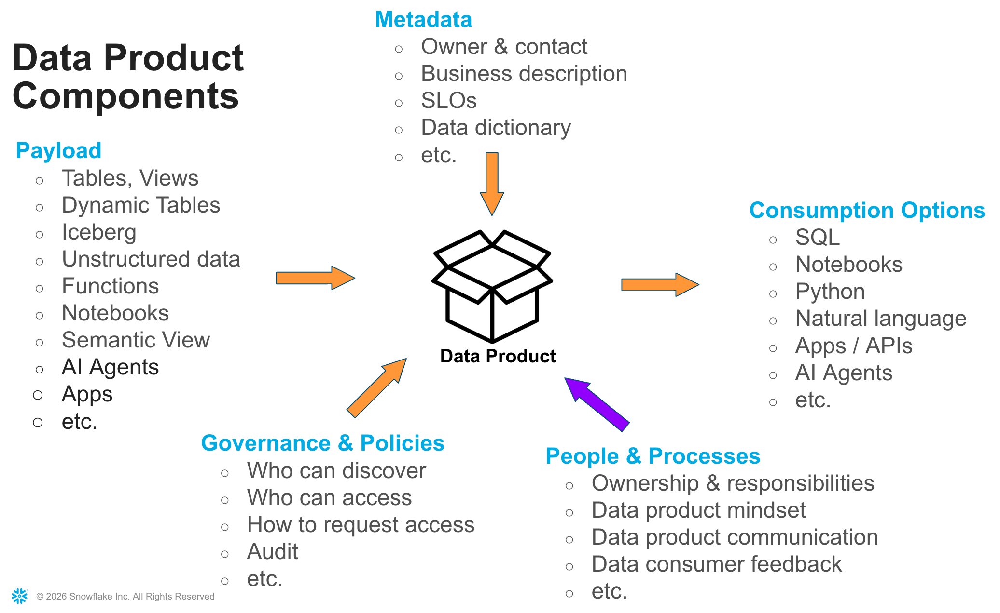
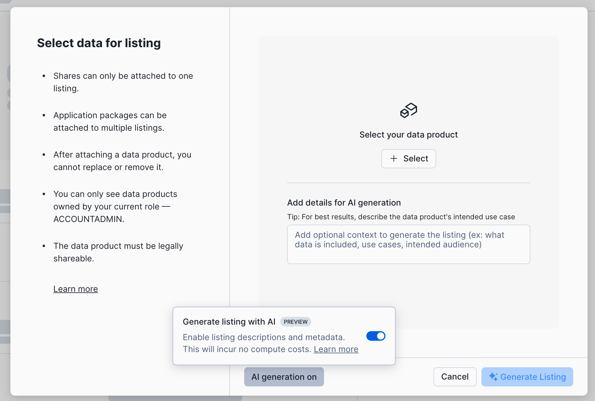
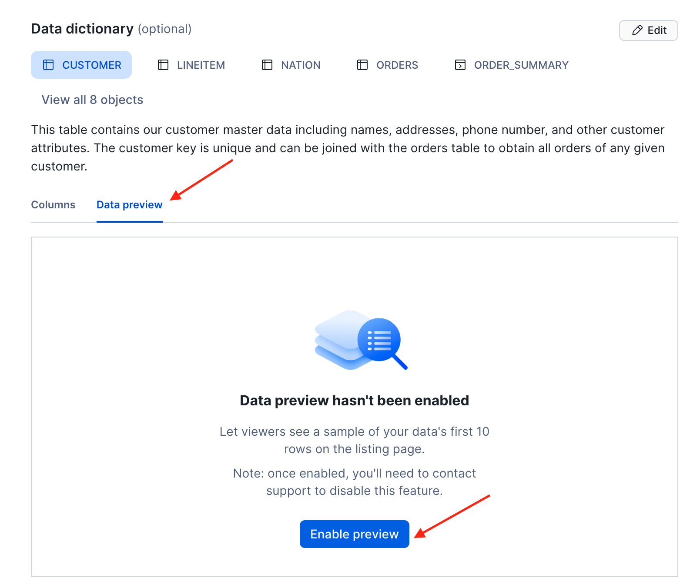
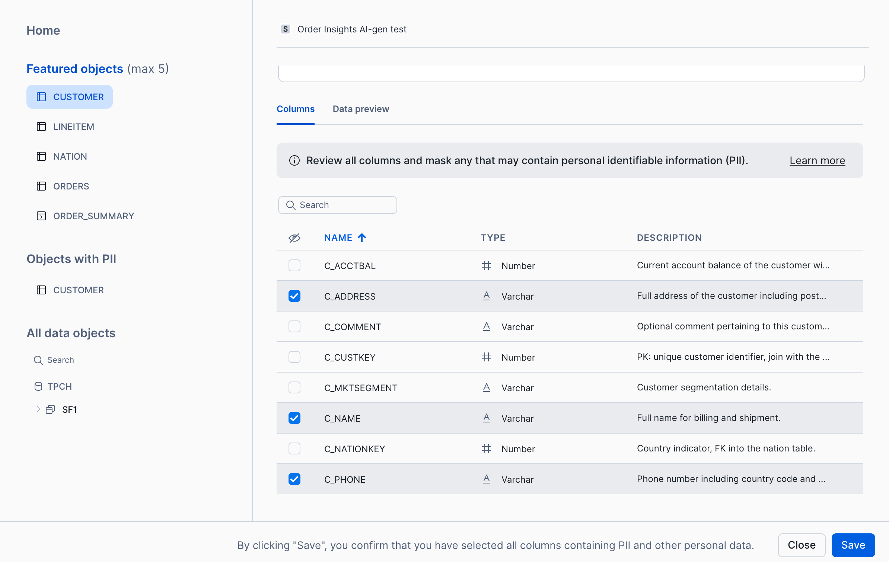
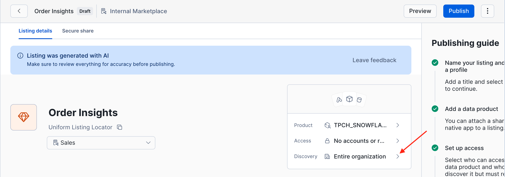
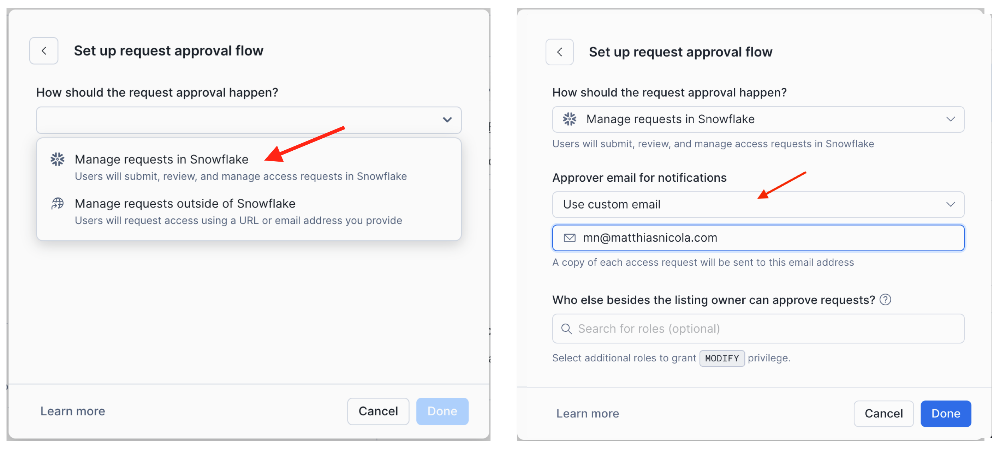

authors: Matthias Nicola, Henrik Nielsen
id: sharing-data-and-ai-on-snowflake-internal-marketplace
categories: snowflake-site:taxonomy/solution-center/certification/quickstart, snowflake-site:taxonomy/product/applications-and-collaboration, snowflake-site:taxonomy/snowflake-feature/internal-marketplace
language: en
summary: HANDS-ON LAB 2026 - SNOWFLAKE INTERNAL MARKETPLACE
environments: web
status: Published
feedback link: <https://github.com/Snowflake-Labs/sfguides/issues>


# Sharing Data and AI on the  Snowflake Internal Marketplace
<!-- ------------------------ -->
## Overview


Sharing information between departments or business units ("domains") of a company is critical for success. Sharing and consuming data and AI assets is more successful if they are shared as a product. A data product is a collection of related data objects plus metadata, such as a business description, ownership and contact information, service level objectives, data dictionary, and more. In a Data Mesh, data products are typically also subject to various data management and organizational principles.  

**Snowflake Internal Marketplace** enables companies to publish documented and governed data products, so they are discoverable and understandable for data consumers. [A previous hands-ob lab is available](https://www.snowflake.com/en/developers/guides/internal-marketplace-intra-org-sharing/) to exercise the internal marketplace and learn how governance policies can control access to data products. In this lab we briefly recap the basics and then focus on sharing AI assets such as agents, semantic vies, and other new features.


**Data Products** consist of:
- A payload of objects to share
- Metadata to describe the product and its characteristics
- Access control specification and policies
- One or more output ports through the product can be consumed
- Processes and guidelines that define data product operations and fresponsibilities





### What You'll Learn

- How to publish, discover, and consume data products with the Snowflake Internal Marketplace
- How to leverage AI to help you create data products
- How to customize your data products with [custom attributes](https://docs.snowflake.com/en/LIMITEDACCESS/collaboration/custom-attributes-internal-marketplace)
- How to manage access to data products, including request & approval workflows 
- How to share and consume [semantic views](https://docs.snowflake.com/en/user-guide/views-semantic/sharing-semantic-views) and [AI agents](https://docs.snowflake.com/en/LIMITEDACCESS/cortex-agent-sharing)
- How [generate semantic views and agents](https://docs.snowflake.com/en/LIMITEDACCESS/collaboration/auto-generated-data-agents-for-listings) for existing data products
- How to manage and consume data products with [Cortex Code ("Coco")](https://docs.snowflake.com/en/user-guide/cortex-code/cortex-code)


### What You'll Need

- Basic knowledge of SQL and database concepts
- A pre-configured Snowflake account (provided for this lab)
- Basic knowledge of the Snowflake UI

### What You'll Build

- Data products based on simple TPC-H data
- Semantic views and AI agents
- Organizational Listings to share these objects


----
## Review Your Lab Environment


Your Snowflake account has been pre-configured with a database,  users roles, and organizational profiles you need for this lab. In this section you will review the environment before creating your first data product in the next section.

The lab environment consists of:

- **One Snowflake account** with two users and their roles:
  - `data_owner` with the `data_owner_role`
  - `data_consumer` with the `data_consumer_role`
- **A TPC-H database** (`TPCH`) with sample data in the `SF1` schema, including tables (customer, orders, lineitem, nation, region, part, partsupp, supplier), an `ORDER_SUMMARY` view, and an `ORDERS_PER_CUSTOMER` function
- **Two organizational profiles**: **Sales** and **Marketing**, representing different business units when publishing a data product 
- **Several custom attributes** that we have pre-defined for all lab participants for richer data product metdata 

### Review via the Snowsight UI

Log in to your account as the `data_owner` user.

1. **Review the database**: In the left navigation, click on **Catalog** > **Database Explorer**. Open the `TPCH` database and navigate to the `SF1` schema. You should see the TPC-H tables, the `ORDER_SUMMARY` view, and the `ORDERS_PER_CUSTOMER` function.

2. **Review the Internal Marketplace**: In the left navigation, click on **Catalog** > **Internal Marketplace**. You will see 1 or more listings (data products) that we have pre-created. Open any one of them to examine their structure content.

3. **Review the organizational profiles**: While viewing the Internal Marketplace, use the **Profile** filter right under search bar to see and filter by the available domain profiles.

### Review via SQL (Optional)

Open a new file in a workspace (or a worksheet) and run the following commands to confirm the lab setup:

```sql
-- Review as data_owner with the data_owner_role
USE ROLE data_owner_role;
USE WAREHOUSE compute_wh;

-- Review the database and schema
SHOW DATABASES LIKE 'TPCH';
USE DATABASE tpch;
SHOW TABLES IN SCHEMA tpch.sf1;
SHOW VIEWS IN SCHEMA tpch.sf1;
SHOW USER FUNCTIONS IN SCHEMA tpch.sf1;

-- Review organization profiles and custom attributes
show available organization profiles;
show available internal marketplace configs;

-- Review users and roles in this account
USE ROLE accountadmin;
SHOW USERS;
SHOW ROLES;
```
<!--
- `SHOW DATABASES` should return the `TPCH` database.
- `SHOW TABLES` should return tables such as `CUSTOMER`, `ORDERS`, `LINEITEM`, `NATION`, `REGION`, `PART`, `PARTSUPP`, and `SUPPLIER`.
- `SHOW VIEWS` should return the `ORDER_SUMMARY` view.
- `SHOW USER FUNCTIONS` should return the `ORDERS_PER_CUSTOMER` function.
- `SHOW USERS` should return `data_owner` and `data_consumer`.
- `SHOW ROLES` should return `data_owner_role` and `data_consumer_role`.
-->

###
**You are now ready to begin the lab exercises!**

---

## Create / Publish Data Product


In this section you will create and publish your first organizational listing called **Order Insights**. This data product shares order and customer data from the TPC-H database with other business domains in your organization.

You will work as `data_owner` with the `data_owner_role`. The publishing flow in the Provider Studio consists of 5 steps.

### Step 1 of 5: Decide on AI Generation and Select Data Objects

1. Log in to your account as the `data_owner` user.
2. Navigate to **Catalog** > **Internal Marketplace**.
3. Click the blue **+ Create Listing** button in the top right.
4. Proceed with "AI generation on" or, optionally, turn it off. "AI generation on" will automatically populate some of the data product metadata for you.
5. Click **+Select** to select the data objects to share




### Step 2 of 5: Select Data Objects to Share

Now select the data objects for this data product.

1. Navigate to the `TPCH` database > `SF1` schema, and select:
   - All tables **except** *Region* and *Part*
   - The `ORDER_SUMMARY` view
   - The `ORDERS_PER_CUSTOMER` function
2. Click **Done** to proceed, then **Generate Listing** if you choose "AI generation on"


### Step 3 of 5: Edit and Complete the Listing Metadata

1. Review the AI-generated listing metadata
2. Change the listing title to "Order Insights"
3. Under title use the **Select profile** box to select the profile (domain) under which to publish this data product
4. If desired, make changes to the listing description or other metadata fields. 
   - For example, in the **Documentation** field you could add any URL to supplementary documentation, e.g. `http://www.snowflake.com`.
5. Enable **Data preview** in the **Data dictionary**.
    - Data preview is off by default for privacy reasons.
    - Let's enable data preview as shown below.



6. Sensitive **column masking** in the data preview.
    - Click the **Edit** button at the top right of the data dictionary.
    - Select the customer table.
    - Select the c_address, c_name, and c_phone columns for masking.
  - Note:
    - It may take up to 2 hours before data consumers see the properly generated data preview.
    - The selection of sensitive columns only affects the data preview in the internal marketplace. When data consumers are granted _access_ to the data product, row- and column-levelk access policies must be in place to govern their access.




7. Set custom attributes
    - Click in the field "**Attributes** (optional)" and select data product attributes.
    - Note that the attributes **Confidentiality** and **Source Systems** are examples of custom attributes that the internal marketplace admin can define for your company. Up to 40 custom attributes can be configured.
    - The attribute **Source Systems** is multi-valued, i.e. you can assign mutiple values from the drop-down list.
    - Custom attributes can also appear in the markeplace UI as filters.

<mark>
***********
add a screenshot here !!!
***********</mark>

### Step 4 of 5: Configure Access Control and Approval

Click the "**>**" button next to "Discovery" to configure who can discover and access this listing.



- **Discovery** determines who can see the listing and its metadata in the Internal Marketplace.
- **Access** determines who can discover the listing *and* query the shared data objects.

For this listing, change discovery to the `data_consumer_role` in your current account.
- Click on "Entire Organization"
- Choose "Selected accounts and roles"
- Search for and select your current account
- Click on "All roles" then "Selected roles"
- Select `data_consumer_role` from the list. Done.


Click **Set up request approval flow** to proceed.


- Select **Manage requests in Snowflake** (rather than an external workflow engine).
- Change the Approver email from **Use profile contact** to **Use custom email** and enter your own email, e.g. the one you used to sign up for this lab.
- Click **Done** and **Save**




### Step 5 of 5: Publish

Click the blue **Publish** button in the top right corner.

Your **Order Insights** data product is now live on the Internal Marketplace!

To verify, navigate to the **Internal Marketplace** (**Catalog** > **Internal Marketplace**). You should now see the **Order Insights** listing. Use the **Provider** filter to show listings from the **Sales** domain.


<mark>***********
update the screenshot above when attribute filters are available in the UI !!!
***********</mark>

---

## Request and Grant Access


In this section the **Consumer** user will request access to the **Order Insights** listing that you just published, and the **Data Owner**  will review and approve the request. Since both users are in the same account, you will switch between users (or use separate browser sessions) to play both roles.

### Request Access as the Consumer User

1. Log in to your account as the `data_consumer` user (or open a new browser tab / incognito window and log in as `data_consumer`).
2. Navigate to the **Internal Marketplace**: Click on **Catalog** > **Internal Marketplace**.
3. You should see the **Order Insights** listing. Click on it.
4. Review the listing from the data consumer's perspective
5. Click the blue **Request Access** button.
   - If prompted to verify your email address, follow the dialog to complete verification.
6. In the **Request access** dialog, enter a business justification such as:
   > "We need this data for our ncurrent project xyz."
7. Submit the request.
8. After submitting, click the gray **View request** button to review your pending request. You can also withdraw and resubmit the request from here if needed.

### Review and Grant Access as the Data Product Owner

1. Log in to your account as the `data_owner` user (switch browser tabs or log in again).
2. Navigate to the **Data Sharing** -> **Internal Sharing** .
3. Open the **Requests** tab at the top of the Internal Sharing page.
4. You should see the access request from `data_consumer`. Click on it to review the details:
   - The requesting user and role
   - The business justification
   - The listing being requested
5. Click the green **Grant** button to approve the request.
6. Switch from **Needs Review** to **Resolved Requests** to confirm the request is now listed as approved.

### Verify Access

Switch back to the `data_consumer` user and navigate to the **Order Insights** listing in the Internal Marketplace. The blue **Request Access** button should now have changed to **Query in Worksheet** (reload the browser tab if needed). This confirms that access has been granted successfully.

---


<mark>***********
Matthias to continue here !!!
***********</mark>

## Consume Org Listing


Now that access has been granted, let's consume the **Order Insights** data product as the `data_consumer` user with the `data_consumer_role`.

### Query via the Internal Marketplace

1. Log in to your account as the `data_consumer` user (or switch to your existing `data_consumer` browser tab).
2. Navigate to the **Internal Marketplace**: Click on **Catalog** > **Internal Marketplace**.
3. Open the **Order Insights** listing.
   - The blue button should now say **Query in Worksheet** (reload the tab if it still shows "Request Access").
4. Click **Query in Worksheet**. Snowflake opens a new worksheet pre-populated with the sample queries from the listing.
5. Review and run the sample queries.
   - Note the [Uniform Listing Locator (ULL)](https://docs.snowflake.com/en/user-guide/collaboration/listings/organizational/org-listing-query) used to reference objects: `ORGDATACLOUD$SALES$ORDER_INSIGHTS.SF1.<object>`
   - The ULL contains the domain profile name (`SALES`), the listing name (`ORDER_INSIGHTS`), the schema (`SF1`), and the object name.
6. In the left-hand panel of the worksheet, note the list of all available internal data products.

### Query via SQL in a Worksheet

You can also query data products directly from any worksheet using the ULL. Open a new worksheet as `data_consumer` and run the following queries:

```sql
USE ROLE data_consumer_role;
USE WAREHOUSE compute_wh;

-- Explore the Order Summary View
SELECT * 
FROM ORGDATACLOUD$SALES$ORDER_INSIGHTS.SF1.ORDER_SUMMARY 
LIMIT 100;

-- Use the UDF to obtain order details for one customer
SELECT customer_name, country, orderkey, orderdate, AMOUNT
FROM TABLE(ORGDATACLOUD$SALES$ORDER_INSIGHTS.SF1.ORDERS_PER_CUSTOMER(60001));
```

### Live Data Sharing

A key benefit of organizational listings is that data is shared live -- there is no copy. When the data owner updates the underlying data, consumers see the changes instantly. Let's demonstrate this.

1. Switch to the `data_owner` user and run the following in a worksheet:

   ```sql
   USE ROLE data_owner_role;
   USE WAREHOUSE compute_wh;
   USE SCHEMA tpch.sf1;

   -- Check current country for customer 60001
   SELECT customer_name, country, orderkey, orderdate, AMOUNT
   FROM TABLE(orders_per_customer(60001));
   ```

   Note the country for customer 60001 (Kenya).

2. Now update the customer's nation:

   ```sql
   -- Customer 60001 moves from Kenya to Mozambique
   UPDATE customer SET c_nationkey = 16 WHERE c_custkey = 60001;
   ```

3. Switch back to `data_consumer` and re-run the same query via the ULL:

   ```sql
   USE ROLE data_consumer_role;

   SELECT customer_name, country, orderkey, orderdate, AMOUNT
   FROM TABLE(ORGDATACLOUD$SALES$ORDER_INSIGHTS.SF1.ORDERS_PER_CUSTOMER(60001));
   ```

   The updated country (Mozambique) is **instantly** visible to the consumer -- no refresh, no sync, no delay.

> **Best practice:** Inform your data consumers ahead of time about structural changes to a data product (e.g. adding/removing columns). For breaking changes, consider creating a new listing version and giving consumers time to migrate.

---

## Share Semantic Views and Agents


<!-- TODO: Detailed instructions for sharing semantic views and Cortex agents via the internal marketplace -->

---

## Use Listing with Natural Language


<!-- TODO: Detailed instructions for querying data products using natural language -->

---

## Share Data Products across the Org


<!-- TODO: Detailed instructions for sharing data products across the organization -->

---

## Use Cortex Code to Alter a Listing


<!-- TODO: Detailed instructions for using Cortex Code in Snowsight to alter a listing -->

---

## Use Cortex Code to Consume Listings


<!-- TODO: Detailed instructions for using Cortex Code in Snowsight to discover and consume listings -->

---

## Conclusion And Resources


Congratulations, you completed this **Snowflake Internal Marketplace** hands-on lab! You have seen how data products can be authored, published, requested, consumed, and governed -- including sharing semantic views and AI agents, querying listings with natural language, and managing listings with Cortex Code.

### What you Learned

- How to create data products that consist of multiple data objects
- How to document a data product with metadata such as description, data dictionary, ownership, sample queries, and service-level objectives
- How to request and approve or deny access to data products
- How to consume data products using the Uniform Listing Locator (ULL)
- How to share semantic views and Cortex agents as part of a data product
- How to query data products using natural language
- How to share data products across your organization
- How to use Cortex Code in Snowsight to alter and consume listings programmatically


### Related Resources

- [About Organizational Listings](https://docs.snowflake.com/en/user-guide/collaboration/listings/organizational/org-listing-about)

- [Organization Accounts](https://docs.snowflake.com/en/user-guide/organization-accounts) 
  
- [Organization Profiles](https://docs.snowflake.com/en/user-guide/collaboration/organization-profiles/org-profile-manage)

- Organizational Listings
  - [Create an organizational listing](https://docs.snowflake.com/en/user-guide/collaboration/listings/organizational/org-listing-create)
  - [Manage organizational listings](https://docs.snowflake.com/en/user-guide/collaboration/listings/organizational/org-listing-manage)
  - [Query organizational listings](https://docs.snowflake.com/en/user-guide/collaboration/listings/organizational/org-listing-query)

- [Managing Listings via API](https://other-docs.snowflake.com/progaccess/listing-progaccess-about)

