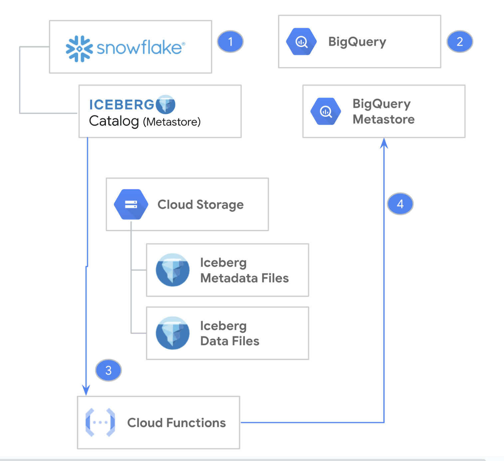

author: Matt Marzillo
id: sharing_data_between_bigquery_and_snowflake_using_apache_iceberg
summary: This is a quickstart showing users how use iceberg with Snowflake and Big Query
categories: Data-Sharing, GCP, Iceberg, Big Query, Google, Open, Open Table Format
environments: web
status: Published 
feedback link: https://github.com/Snowflake-Labs/sfguides/issues
tags: iceberg, google, gcp, bigquery, open

# Using Snowflake Cortex And Streamlit With Geospatial Data
<!-- ------------------------ -->
## Overview 
Duration: 10

Apache Iceberg has become a very popular open-source table format for data lakes as its flexibility enables freedom of choice for organizations. Whether an organization wants to use best of breed services or they’ve inherited multiple data platforms due to mergers or acquisitions, adopting an open table format could be key to eliminating data silos.

### Use Case
There is often no one-size-fits-all approach to tackling complex business challenges. Organizations often store their data in different places and use multiple tools and platforms to put that data to work. By uniting data across platforms and query engines using an open table format, organizations can serve a variety of business needs, including: 
- Modernizing their data lake
- Enabling data interoperability and a joint data mesh architecture
- Building batch or streaming data pipelines
- Building transformation and change data capture (CDC) pipelines
- Serving analytics-ready data to business teams


### Prerequisites
- Familiarity with [Snowflake](https://quickstarts.snowflake.com/guide/getting_started_with_snowflake/index.html#0) and a Snowflake account
- Familiarity with [Google Cloud](https://cloud.google.com/free) and a Google Cloud account.

### What You’ll Learn
- Creating a Snowflake Managed Iceberg table and then have BigQuery read the table
- Creating a BigLake Managed table and then have Snowflake read the table
- Keeping BigQuery in-sync with Iceberg tables hosted on Snowflake



### What You’ll Need
- [Snowflake account](https://signup.snowflake.com/) 
- [Google Cloud account](https://cloud.google.com/free)

### What You'll Build
- A Snowflake Managed Iceberg table
- A BigLake Managed Iceberg table


<!-- ------------------------ -->
## Snowflake Managed Iceberg to BigQuery
Duration: 10

In this section, you will create a table in Snowflake using the Iceberg format and also create a BigLake (external) table in BigQuery that points to the same Iceberg files.

### Login to Snowflake
- Click the Create button on the top left
- Select SQL Worksheet
- Run this command to switch to an account admin since we have to run some commands that requires this role:

```sql
USE ROLE accountadmin;
```

### Create a warehouse to hold the data

```sql
CREATE OR REPLACE WAREHOUSE ICEBERG_WAREHOUSE WITH WAREHOUSE_SIZE='XSMALL';
```
Reference: https://docs.snowflake.com/en/sql-reference/sql/create-warehouse

### Create a database (the database)
```sql
CREATE OR REPLACE DATABASE ICEBERG_DATABASE;
```


### Create a bucket to hold your BigLake Managed Table
Open: https://console.cloud.google.com/storage/browser
- Click the Create Bucket button
- Enter your bucket name: bigquery-snowflake-sharing (you can choose a different name)
- Click Next: Use Region: us-central1 <- must match your snowflake region
- Click Create at the bottom

### Create a link between Snowflake and GCS. 
- In Snowflake, create a GCS volume integration.  This will create a link between Snowflake and GCS. 
A service principal will be created and we will grant access to our GCS bucket.


```sql
CREATE STORAGE INTEGRATION bigquery_integration
  TYPE = EXTERNAL_STAGE
  STORAGE_PROVIDER = 'GCS'
  ENABLED = TRUE
  STORAGE_ALLOWED_LOCATIONS = ('gcs://bigquery-snowflake-sharing');
```
Reference: https://docs.snowflake.com/en/sql-reference/sql/create-storage-integration

### Get the service principal that we will grant Storage Object Admin in our GCS bucket
```sql
DESC STORAGE INTEGRATION bigquery_integration;
```
- Copy the STORAGE_GCP_SERVICE_ACCOUNT
- e.g. xxxxxxxxx@gcpuscentral1-1dfa.iam.gserviceaccount.com

### Create a custom IAM role that has the permissions required to access the bucket and get objects.
- Open: https://console.cloud.google.com/iam-admin/roles
- Select Create Role.
- Enter a Title and optional Description for the custom role. [e.g. Snowflake Storage Admin]
- Select Add Permissions.
- In Filter, select Service and then select storage.
- Filter the list of permissions, and add the following from the list:
- storage.buckets.get
- storage.objects.get
- storage.objects.create
- storage.objects.delete
- storage.objects.list
- Select Add.
- Select Create.
- Reference: https://docs.snowflake.com/en/user-guide/tables-iceberg-configure-external-volume-gcs?_fsi=YFzl41ld&_fsi=YFzl41ld&_fsi=YFzl41ld

### Open the storage account you created
- Open: https://console.cloud.google.com/storage/browser
- Click on: bigquery-snowflake-sharing (or whatever you named it)
- Click on Permissions
- Click Grant Access
- Paste in the service account name (from Snowflake)
- For the role select Custom | Snowflake Storage Admin
- Click Save

### In Snowflake, create an external volume on GCS
```sql
CREATE EXTERNAL VOLUME snowflake_ext_volume
  STORAGE_LOCATIONS =
    (
      (
        NAME = 'us-central1'
        STORAGE_PROVIDER = 'GCS'
        STORAGE_BASE_URL = 'gcs://bigquery-snowflake-sharing/snowflake-volume/'
      )
    ),
    ALLOW_WRITES = TRUE;
```
Reference: https://docs.snowflake.com/en/sql-reference/sql/create-external-volume

### Describe the volume
```sql
DESCRIBE EXTERNAL VOLUME snowflake_external_volume
```

### Set the current database
```sql
USE ICEBERG_DATABASE;
```

### Create a schema in Snowflake
```sql
CREATE SCHEMA iceberg_schema;
```

### Make the schema active
```sql
USE SCHEMA iceberg_schema;
Create Iceberg table using Snowflake Catalog
CREATE ICEBERG TABLE driver (driver_id int, driver_name string)
  CATALOG = 'SNOWFLAKE'
  EXTERNAL_VOLUME = 'snowflake_ext_volume'
  BASE_LOCATION = 'driver';
```
Reference: https://docs.snowflake.com/en/sql-reference/sql/create-iceberg-table-snowflake

### Show the table you just created
```sql
SHOW TABLES
```

### Insert new data
```sql
INSERT INTO driver (driver_id, driver_name) VALUES (1, 'Driver 001');
SELECT * FROM driver;
```

### Review the latest metadata json file that Snowflake is pointing to as we need to point BigQuery to the same place
```sql
SELECT REPLACE(JSON_EXTRACT_PATH_TEXT(
     SYSTEM$GET_ICEBERG_TABLE_INFORMATION('ICEBERG_DATABASE.iceberg_schema.driver'),
          'metadataLocation'), 'gcs://', 'gs://');
```

### Open the storage account you created
- Open: https://console.cloud.google.com/storage/browser
- Click on: bigquery-snowflake-sharing (or whatever you named it)
- You can now browse the Iceberg files

### Create a BigQuery Dataset
```sql
CREATE SCHEMA IF NOT EXISTS snowflake_dataset OPTIONS(location = 'us-central1');
```

### Navigate to BigQuery
- Open: https://console.cloud.google.com/bigquery
- Click the Add button
- Select "Connections to external data sources"
- Select "Vertex AI remote models, remote functions and BigLake (Cloud Resource)"
- Select region: us-central1
- Enter a name: snowflake-connection (use the for friendly name and description)

### Expand your project in the left hand panel
- Expand external connections
- Double click on us-central1.snowflake-connection
- Copy the service account id: e.g. bqcx-xxxxxxxxxxxx-s3rf@gcp-sa-bigquery-condel.iam.gserviceaccount.com

### Open the storage account you created
- Open: https://console.cloud.google.com/storage/browser
- Click on: blmt-snowflake-sharing (or whatever you named it)
- Click on Permissions
- Click Grant Access
- Paste in the service account name
- For the role select Cloud Storage | Storage Object Viewer [Since Snowflake is the write BigQuery just reads]
- Click Save

### The URIs needs to be from the following Snowflake command
```sql
CREATE OR REPLACE EXTERNAL TABLE `snowflake_dataset.driver`
WITH CONNECTION `us-central1.snowflake-connection`
OPTIONS (
  format = "ICEBERG",
  uris = ["gs://bigquery-snowflake-sharing/snowflake-volume/driver/metadata/00001-2d763c77-df0a-4230-bd52-033877d02c40.metadata.json"]
);
```

### View the data in BQ
```sql
SELECT * FROM `snowflake_dataset.driver`;
```

### Update table metadata in BQ

BigQuery will not see updated data in Snowflake since we are pointing to a specific snapshot or metadata json. We will have to update the table definition to the latest table metadata.
- You will need to run the "SYSTEM$GET_ICEBERG_TABLE_INFORMATION" command in Snowflake
```sql
SYSTEM$GET_ICEBERG_TABLE_INFORMATION('<iceberg_table_name>')
```
- You will then need to update the table metadata in BigQuery: https://cloud.google.com/bigquery/docs/iceberg-external-tables#update-table-metadata


<!-- ------------------------ -->
## Conclusion and Resources
Duration: 5
### Conclusion

S