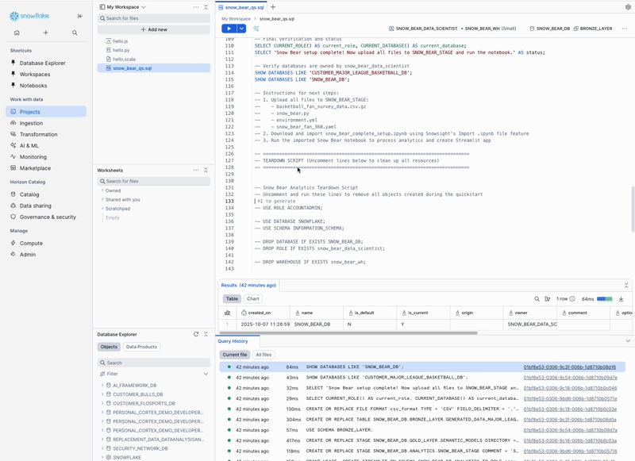

author: Joviane Bellegarde
id: snow-bear-leveraging-cortex-for-advanced-analytics
categories: snowflake-site:taxonomy/solution-center/certification/quickstart, snowflake-site:taxonomy/solution-center/certification/certified-solution, snowflake-site:taxonomy/solution-center/includes/architecture, snowflake-site:taxonomy/product/analytics
language: en
summary: Snow Bear Fan Experience Analytics - Leveraging Cortex for Advanced Analytics 
environments: web
status: Published
feedback link: https://github.com/Snowflake-Labs/sfguides/issues
fork repo link: https://github.com/Snowflake-Labs/sfguide-snow-bear-fan-experience-analytics-leveraging-cortex

# Snow Bear Fan Experience Analytics - Leveraging Cortex for Advanced Analytics
<!-- ------------------------ -->

## Overview

Customer experience analytics is crucial for businesses to understand their customers and improve their services. Through comprehensive data analysis and AI-powered insights, businesses can uncover patterns in customer feedback, identify pain points, and generate actionable recommendations.

In this Quickstart, we will build a comprehensive fan experience analytics platform for a basketball team called "Snow Bear". This demonstrates how to use Snowflake Cortex AI functions to analyze fan survey data, extract sentiment insights, generate business recommendations, and create advanced analytics dashboards.

This Quickstart showcases the complete Snow Bear analytics platform with:
- **7-module interactive analytics platform** with Executive Dashboard, Fan Journey Explorer, Sentiment Analysis, Theme Analysis, Recommendation Engine, Interactive Search, and AI Assistant
- **AI-powered sentiment analysis** across 8 feedback categories
- **Advanced theme extraction** and automated categorization
- **Cortex Search Service** for semantic search
- **Cortex Analyst integration** for natural language queries
- **500+ basketball fan survey responses**

### What You Will Build
- Complete 7-module interactive analytics platform
- AI-powered sentiment analysis system using real basketball fan data
- Advanced theme extraction and categorization engine
- Business recommendation system with simple and complex recommendations
- Interactive Cortex Search Service for semantic search
- Production-ready Streamlit application with advanced visualizations
- Stage-based data loading workflow for scalability

### What You Will Learn
- How to set up a production data pipeline with Snowflake stages
- How to use Snowflake Notebooks for complex AI processing workflows
- How to implement all Cortex AI functions (SENTIMENT, EXTRACT_ANSWER, COMPLETE)
- How to build scalable analytics platforms with real data
- How to create automated theme analysis and fan segmentation
- How to deploy interactive Streamlit applications in Snowflake

### Prerequisites
- Familiarity with Python and SQL
- Familiarity with Streamlit applications
- Go to the [Snowflake](https://signup.snowflake.com/?utm_source=snowflake-devrel&utm_medium=developer-guides&utm_cta=developer-guides) sign-up page and register for a free account

<!-- ------------------------ -->
## Setup Snowflake Environment  

In this step, you'll create the Snowflake database objects and upload all necessary files for the Snow Bear analytics platform.

### Step 1: Create Database Objects

> 
> 
> Starting in September 2025, Snowflake is gradually upgrading accounts from Worksheets to [Workspaces](https://docs.snowflake.com/en/user-guide/ui-snowsight/workspaces). Workspaces will become the default SQL editor. Follow the instructions below that match your interface.

**To use Workspaces:**
1. In Snowsight, click `Projects`, then <a href="https://app.snowflake.com/_deeplink/#/workspaces?utm_source=snowflake-devrel&utm_medium=developer-guides&utm_content=snow-bear-leveraging-cortex-for-advanced-analytics&utm_cta=developer-guides-deeplink" class="_deeplink">Workspaces</a> in the left navigation
2. Click `+ Add new` to create a new <a href="https://app.snowflake.com/_deeplink/#/workspaces?utm_source=snowflake-devrel&utm_medium=developer-guides&utm_content=snow-bear-leveraging-cortex-for-advanced-analytics&utm_cta=developer-guides-deeplink" class="_deeplink">Workspace</a>
3. Click `SQL File` to create a new SQL file
4. Copy the setup script from [setup.sql](https://github.com/Snowflake-Labs/sfguide-snow-bear-fan-experience-analytics-leveraging-cortex/blob/main/scripts/setup.sql) and paste it into your SQL file, then run it

**To use Worksheets:**
1. In Snowsight, click `Projects`, then `Worksheets` in the left navigation
2. Click `+` in the top-right corner to open a new Worksheet
3. Copy the setup script from [setup.sql](https://github.com/Snowflake-Labs/sfguide-snow-bear-fan-experience-analytics-leveraging-cortex/blob/main/scripts/setup.sql) and paste it into your worksheet, then run it

The setup script creates:
- **Database**: `SNOW_BEAR_DB` with `BRONZE_LAYER`, `GOLD_LAYER`, and `ANALYTICS` schemas
- **Role**: `SNOW_BEAR_DATA_SCIENTIST` with all necessary permissions  
- **Warehouse**: `SNOW_BEAR_WH` for compute resources
- **Stages**: `SNOW_BEAR_STAGE` (in ANALYTICS) for app/data files and `SEMANTIC_MODELS` (in GOLD_LAYER) for AI assistant
- **File Format**: `CSV_FORMAT` for data loading
- **AI Access**: `SNOWFLAKE.CORTEX_USER` role for Cortex functions

### Step 2: Download Required Files

Download these 5 files from the GitHub repository:

| File | Purpose | Download Link |
|------|---------|---------------|
| **Data File** | Basketball fan survey data | [basketball_fan_survey_data.csv.gz](https://github.com/Snowflake-Labs/sfguide-snow-bear-fan-experience-analytics-leveraging-cortex/blob/main/scripts/basketball_fan_survey_data.csv.gz) |
| **Streamlit App** | Interactive analytics dashboard | [snow_bear.py](https://github.com/Snowflake-Labs/sfguide-snow-bear-fan-experience-analytics-leveraging-cortex/blob/main/scripts/snow_bear.py) |
| **Environment File** | Streamlit dependencies | [environment.yml](https://github.com/Snowflake-Labs/sfguide-snow-bear-fan-experience-analytics-leveraging-cortex/blob/main/scripts/environment.yml) |
| **Semantic Model** | AI assistant semantic model | [snow_bear_fan_360.yaml](https://github.com/Snowflake-Labs/sfguide-snow-bear-fan-experience-analytics-leveraging-cortex/blob/main/scripts/snow_bear_fan_360.yaml) |
| **Notebook** | Setup and data processing notebook | [snow_bear_complete_setup.ipynb](https://github.com/Snowflake-Labs/sfguide-snow-bear-fan-experience-analytics-leveraging-cortex/blob/main/notebooks/snow_bear_complete_setup.ipynb) |

### Step 3: Upload Files to Stages

1. In Snowsight, change your role to `SNOW_BEAR_DATA_SCIENTIST`

2. Navigate to `Catalog` → `Database Explorer` → `SNOW_BEAR_DB`

**Upload files to two stages in different schemas:**

3. **Upload to `ANALYTICS` → `Stages` → `SNOW_BEAR_STAGE`:**
   - Navigate to `ANALYTICS` → `Stages`
   - Click on `SNOW_BEAR_STAGE`
   - Click `Enable Directory Table`
   - Upload these files:
     - `basketball_fan_survey_data.csv.gz`
     - `snow_bear.py`
     - `environment.yml`

4. **Upload to `GOLD_LAYER` → `Stages` → `SEMANTIC_MODELS`:**
   - Navigate to `GOLD_LAYER` → `Stages`
   - Click on `SEMANTIC_MODELS`
   - Click `Enable Directory Table`
   - Upload this file:
     - `snow_bear_fan_360.yaml`

### Step 4: Import the Analytics Notebook

1. **Import into Snowflake**:
   - Navigate to `Projects` → `Notebooks` in Snowsight
   - Click the down arrow next to `+ Notebook` and select `Import .ipynb file`
   - Choose `snow_bear_complete_setup.ipynb` from your downloads

2. **Configure the notebook settings**:
   - **Role**: Select `SNOW_BEAR_DATA_SCIENTIST`
   - **Database**: Select `SNOW_BEAR_DB`
   - **Schema**: Select `ANALYTICS`  
   - **Query Warehouse**: Select `SNOW_BEAR_WH`
   - **Notebook Warehouse**: Select `SNOW_BEAR_WH`

4. **Click `Create`** to import the notebook

The notebook contains all the SQL scripts and processing logic needed for the complete analytics platform.

<!-- ------------------------ -->
## Run Analytics Notebook

### Execute the Complete Analytics Workflow

1. Go to `Projects` → `Notebooks` in Snowsight
2. Click on `SNOW_BEAR_COMPLETE_SETUP` Notebook to open it
3. Click `Run all` to execute all cells in the notebook at once

<!-- ------------------------ -->
## Launch Analytics Dashboard

### Access Your Analytics Platform

1. Navigate to `Projects` → `Streamlit` in Snowsight
2. Find and click on `Snow Bear Fan Analytics`
3. Explore your 7-module analytics dashboard

Your platform includes executive dashboards, sentiment analysis, theme analysis, fan segmentation, AI recommendations, interactive search, and AI assistant capabilities.

<!-- ------------------------ -->
## Clean Up Resources

### Remove All Created Objects

When you're ready to remove all the resources created during this quickstart:

1. Open the [setup.sql](https://github.com/Snowflake-Labs/sfguide-snow-bear-fan-experience-analytics-leveraging-cortex/blob/main/scripts/setup.sql) script
2. Scroll to the bottom to find the "TEARDOWN SCRIPT" section
3. Uncomment the teardown statements
5. Run the freshly uncommented script to remove all databases, warehouses, roles, and objects

<!-- ------------------------ -->
## Conclusion and Resources

Congratulations! You've successfully built the complete Snow Bear Fan Experience Analytics platform using Snowflake Cortex AI!

### What You Learned
- **7-Module Analytics Platform**: How to build Executive Dashboard, Sentiment Analysis, Theme Analysis, Fan Segments, AI Recommendations, Interactive Search, and AI Assistant
- **Advanced AI Processing**: How to implement complete Cortex AI integration with SENTIMENT, EXTRACT_ANSWER, and COMPLETE functions
- **Cortex Search Service**: How to create semantic search across fan feedback with natural language queries
- **Production-Ready Streamlit App**: How to develop complete interactive dashboard with advanced visualizations
- **Real Data Processing**: How to work with 500+ realistic basketball fan survey responses

### Resources
- [Snowflake Cortex AI Functions](https://docs.snowflake.com/user-guide/snowflake-cortex/llm-functions)
- [Cortex Search](https://docs.snowflake.com/en/user-guide/snowflake-cortex/cortex-search/cortex-search-overview)
- [Streamlit in Snowflake](https://docs.snowflake.com/developer-guide/streamlit/about-streamlit)
- [Fork Notebook on GitHub](https://github.com/Snowflake-Labs/sfguide-snow-bear-fan-experience-analytics-leveraging-cortex/blob/main/notebooks/snow_bear_complete_setup.ipynb)
- [Download Reference Architecture](https://publish-p57963-e462109.adobeaemcloud.com/content/dam/snowflake-site/en/developers/solution-center/snow-bear-architecture-diagram.png)
- 
