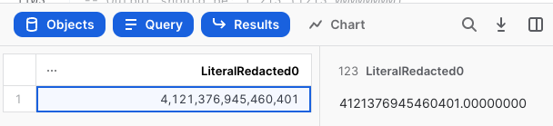

/*
author: Kevin Keller (https://github.com/kkellersnow)
id: snowblind
summary: Project Snow Blind aims to give a working MVP for tokenization in Snowflake using Python. The problem this aims to solve is allowing customers to obfuscate (or “mask”) PII while at the same time not losing the ability to use that data in joins and other operations where the consistency of the data through operations is required. Python offers libraries to achieve this using encryption, and through the use of Snowflake Python UDFs we can apply that to information in Snowflake natively. As an MVP, this is not meant to offer a complete solution to the problem. Rather, this is a framework that others can embrace and extend.
categories: data-governance
environments: web
status: Published
feedback link: https://github.com/Snowflake-Labs/sfguides/issues
tags: Getting Started, Data Science, Data Engineering, Tokenization, Encryption, Security, Python

# Tokenization in Snowflake Using Python UDFs (Snow Blind)
<!-- ------------------------ -->
## SnowBlind Overview
Duration: 1

Project SnowBlind provides a basic framework for tokenization in Snowflake that allows customers to obfuscate (or *mask*) personal identifiable information (PII), while also allowing the masked data to be used in joins and other operations that require data consistency. SnowBlind uses Snowflake Python UDFs (user defined functions) and Python encryption libraries to mask data natively in Snowflake. This version of SnowBlind is a working MVP (minimum viable product) that others may embrace and extend. It is not a full-featured solution for obfuscating PII. Rather, it is a demo that can serve as a starting point for customers who want to have the benefits of tokenization and are willing to roll up their sleeves a bit to get what they want, but do not want to turn to a commercial solution or use external functions. 

### Prerequisites
- A Snowflake Enterprise Edition account
- Ability to connect to Snowflake via a web browser and SnowSQL
- Access to the GitHub CLI, and basic knowledge of its use
- Beginner-level knowledge of Python
- Working knowledge of SQL in Snowflake
- Working knowledge of Snowflake's Web UI
- Working knowledge of Snowflake's SnowSQL CLI

### What You’ll Learn
- How to install and use the SnowBlind Python UDFs to run FF3 format-preserving encryption in a test setup in your Snowflake account

### What You’ll Need
- A [Snowflake Enterprise Edition (or better) account](https://signup.snowflake.com/)
- SnowSQL installed on your machine

### What You’ll Build
- A demo that shows you how to use Python UDFs to achieve FF3 tokenization

### Using This as a Snowflake Worksheet
Because this demo has quite a few code snippets, we recommend putting the whole thing in a Snowflake worksheet. To make that easier, we added `/* */` style comments throughout the demo. If you are using the Snowflake Quickstart site to view this, you can ignore these. If you want to move the whole thing to a worksheet, you will find these disable the extraneous, non-SQL text in the worksheet (including this text). That's why you will see these in what may seem like random spots. To  get the full Worksheet version, go to this Quickstart's GitHub repo, and grab the raw version of the `*.md` file you find there. [This link should take you directly to that spot](https://github.com/Snowflake-Labs/sfquickstarts/blob/master/site/sfguides/src/snowblind/snowblind.md).

<!-- ------------------------ -->
## Understanding Tokenization
Duration: 2

The key to understanding this project is understanding the difference between “masking” and “tokenization.” These terms (as well as “obfuscation,” and even sometimes “encryption”) are often used interchangeably. However, there is a formal distinction between them.

 Masking is something that is destructive. If I take the value “Wade Wilson” and I mask it, I could get completely different masked versions each time I run it through my masking algorithm. When I use tokenization, I expect the results to be the same every time I run “Wade Wilson” through my tokenization algorithm. The result is that, if I take the tokenized version of “Wade Wilson” and place it in several different tables, then I can still join on this value even though it’s not the “real” value of the data. Tokenization gives me consistent results across multiple iterations. Since many identifiers are PII, this has a lot of value in analytical data sets.

Another aspect of tokenization is that it will often give you tokens that appear to have the same qualities as the data that was tokenized. In other words, you can tokenize a number and get back a number of the same order of magnitude. You can tokenize an email and get back a string with the same format as the email (*i.e.* it will follow a valid email format with an @ in the middle, *etc.*). Confusingly, this is most commonly referred to as “format preserving encryption”—even though it is another form of what we are calling tokenization here with all the consistency benefits.

Tokenization, especially the format-preserving kind, is very complex. And when you need to scale it to hundreds of millions of records and beyond, it becomes even more difficult. This is why third-party, commercially available solutions are typically used. Of course, it is still only technology, so there are libraries in many languages that provide the basic building blocks of tokenization. Project SnowBlind takes advantage of the pre-existing Python libraries that provide FF3 tokenization. FF3 is based on AES encryption, and has been the standard upon which the entire industry providing tokenization solutions has based its work.

Let's get started!

<!-- ------------------------ -->
## Set up Roles, the Database, Schema, and Warehouse
Duration: 3

This QuickStart requires quite a few objects. Let's create those and grant the rights to them.

> **Note:** Replace values in brackets (*e.g.* `<REPLACEME>`) with values appropriate to your own lab environment. Include the brackets.

``` */
---  Create objects for use in the demo and grant the rights to them.

--- Create demo roles
create or replace role ff3_encrypt;
create or replace role ff3_decrypt;
create or replace role data_sc;
create or replace role masked;

--- Grant demo roles to your demo user
--- Replace <USER> with your demo user
grant role ff3_encrypt to user <USER>;
grant role ff3_decrypt to user <USER>;
grant role data_sc to user <USER>;
grant role masked to user <USER>;

--- Create warehouse for demo  
create or replace warehouse ff3_testing_wh warehouse_size=medium initially_suspended=true;

--- Grants on warehouse for demo
grant usage, operate on warehouse ff3_testing_wh to role ff3_encrypt;
grant usage, operate on warehouse ff3_testing_wh to role ff3_decrypt;
grant usage, operate on warehouse ff3_testing_wh to role data_sc;
grant usage, operate on warehouse ff3_testing_wh to role masked;

--- Create demo database and schema for demo
create or replace database ff3_testing_db;
create schema ff3_testing_db.ff3_testing_schema;

use database ff3_testing_db;
use schema ff3_testing_db.ff3_testing_schema;

--- Create internal stage for the FF3 Python library
create stage python_libs;
/*
```

<!-- ------------------------ -->
## Set Up a Stage and Upload FF3 Python Libraries
Duration: 5

The libraries we will use for FF3 tokenization are not included in Snowflake's default set, so we need to get those, package them for use in Snowflake, and upload them to a Snowflake Stage where they can be accessed by our user-defined functions (UDFs) that will do the heavy lifting later. Let's start by making sure our stage is ready by running a simple list command.

``` */
ls @python_libs; -- should be empty for now, gets "Query produced no results"
/*
```

> **Note:** If you stopped earlier and are returning, be sure you set the same environment (that is, using the same role, database, schema, and warehouse). Otherwise you may get different results.

With the stage ready, we can now upload the file. To do this, you will need to upload the FF3 Python library from the Mysto FPE Project (https://github.com/mysto/python-fpe). Clone the repository and zip up the contents of its `ff3` directory. Next, upload the zip file to the Snowflake Stage you created. See the outline of steps below, but note that they are best suited as an example for Linux or Mac systems. For Windows, adjust the settings as needed for correct results.


``` */
--- Upload the FF3 Python library from here https://github.com/mysto/python-fpe
--- Git clone this library locally, change (cd) into the python-fpe directory, then zip up the ff3 folder and
--- upload this zip file into the stage.

--- The whole procedure looks like this (substitute in your local values):
/*
% mkdir ff3-demo-code
% cd ff3-demo-code/
% git clone https://github.com/mysto/python-fpe
% cd python-fpe/
% zip -r ff3.zip ff3/
% pwd
<PATH>
% snowsql -a <ACCOUNT>.<REGION>.<CLOUD> -u <USER>
* SnowSQL * v1.2.23
Type SQL statements or !help
<USER>#ff3_testing_wh@ff3_testing_db.ff3_testing_schema> put file://<PATH>/ff3.zip @python_libs auto_compress=false;
*/

/*
```

Once you have the file uploaded, you can run the list command on your stage again, and you should not see that zip file listed in the results.
``` */
ls @python_libs; -- should now contain the ff3.zip file
/*
```

<!-- ------------------------ -->
## Tags, Source and Target Table Preparation, Granting Rights
Duration: 3

In addition to the database, schema, and stage objects, we will  use tags and some demo data in a couple tables. We will create those now. Let's start with the tags.


``` */
--- Create tags
create or replace tag ff3_data_sc;
create or replace tag ff3_encrypt;
create or replace tag sqljoin;
create or replace tag email;
create or replace tag uspostal;
create or replace tag usphone;
/*
```

Next we create two tables to be used for the demo portions of the lab. We will populate one of these with some rows of fake data that have properties that will allow us to exercise the FF3 tokenization well.

``` */
--- Create source table for encrypt, decrypt and data analyst demo
create or replace table ff3_pass3_source1 (
  name varchar(255) default NULL,
  phone varchar(100) default NULL,
  email varchar(255) default NULL,
  postalZip varchar(10) default NULL,
  integernumber integer NULL,
  floatnumber float NULL,
  decimalnumber number(38,8) NULL
);

--- Populate source table with demo data
insert into ff3_pass3_source1 (name,phone,email,postalZip,integernumber,floatnumber,decimalnumber)
values
  ('Keegan Melendez','(0088) 11345912','sapien@protonmail.edu','31242',1,2.754,6.54),
  ('Daniel Black','(0964) 05573972','ullamcorper.viverra@hotmail.org','98-353',4,343.4,45.8),
  ('Malachi Bass','(047) 36000411','dictum@protonmail.net','52545',5,1.7,698.543),
  ('Gabriel Mcknight','(1) 7865551120','duis.elementum@outlook.com','10912',7,884.53,86.987),
  ('Tate Hicks','(079) 44284558','ut.aliquam@outlook.net','26465',4,54545.01,19.2);

--- Create target table
create or replace table ff3_pass3_target1 (
  keyid varchar(255) default NULL,
  name varchar(255) default NULL,
  phone varchar(255) default NULL,
  email varchar(255) default NULL,
  postalZip varchar(255) default NULL,
  integernumber integer NULL,
  floatnumber float NULL,
  decimalnumber number(38,8) NULL
);
/*
```

Now we will grant rights to the roles we will use in the demo.

``` */
--- Grant access rights to demo database, schema and tables
grant usage on database ff3_testing_db to role ff3_encrypt;
grant usage on schema ff3_testing_db.ff3_testing_schema to role ff3_encrypt;

grant usage on database ff3_testing_db to role ff3_decrypt;
grant usage on schema ff3_testing_db.ff3_testing_schema to role ff3_decrypt;

grant usage on database ff3_testing_db to role data_sc;
grant usage on schema ff3_testing_db.ff3_testing_schema to role data_sc;

grant usage on database ff3_testing_db to role masked;
grant usage on schema ff3_testing_db.ff3_testing_schema to role masked;

grant select on all tables in schema ff3_testing_db.ff3_testing_schema to role ff3_encrypt;
grant select on all tables in schema ff3_testing_db.ff3_testing_schema to role ff3_decrypt;
grant select on all tables in schema ff3_testing_db.ff3_testing_schema to role data_sc;
grant select on all tables in schema ff3_testing_db.ff3_testing_schema to role masked;

grant insert on all tables in schema ff3_testing_db.ff3_testing_schema to role ff3_encrypt;

grant all privileges on schema ff3_testing_db.ff3_testing_schema to role ff3_encrypt;
grant all privileges on schema ff3_testing_db.ff3_testing_schema to role ff3_decrypt;
grant all privileges on schema ff3_testing_db.ff3_testing_schema to role data_sc;
grant all privileges on schema ff3_testing_db.ff3_testing_schema to role masked;
/*
```

<!-- ------------------------ -->
## Setting Up Encryption Keys – Caution!
Duration: 2

Under the covers, FF3 is using encryption to achieve results. As with all encryption, there are keys, which are secrets. For this demo, the keys will be set explicitly, and we will give example keys here as part of the demo. The actual requirement is that they be present as a session variable. These keys can then be populated any way that is appropriate. In a real world setting. they may be retrieved programmatically via an external function from an external KMS or another vault.  

> **CAUTION: DO NOT EVER USE THESE KEYS IN A REAL WORLD SYSTEM!** Because they have been used in this demo, regard them as dangerous and never use them apart from this demo.

> **Note:** Feel free to substitute in different keys at this time. If you do so,  understand that the results you get during  future steps will differ from the example output provided. This is because the different keys will cause the resulting, underlying encryption operations to turn out differently.

``` */
---  Set the userkeys.
-------------------------------------
---  For this demo, the keys will be set explicitly. The actual requirement is that they be present as a session variable.
---  These keys can be populated any way that is appropriate. In a real-world setting they can be retrieved programmatically
---  via an external function from an external KMS or another vault.

/*
!!!!!!!!!!!!!!! DO NOT EVER USE THESE KEYS IN THE REAL WORLD !!!!!!!!!!!!!!!!!!
!!!!!!!!!!!!!!! NOW THAT THEY ARE PART OF THIS DEMO, THEY ARE DANGEROUS !!!!!!!
*/

set userkeys='''{
    "678901": ["2DE79D232DF5585D68CE47882AE256D6", "CBD09280979564", "56854"],
    "678902": ["c2051e1a93c3fd7f0e4f20b4fb4f7889aeb8d6fd10f68551af659323f42961e9", "CBD09280979841", "85567"]
}'''; -- key can be either in HEX or raw string form

/*
!!!!!!!!!!!!!!! DO NOT EVER USE THESE KEYS IN THE REAL WORLD !!!!!!!!!!!!!!!!!!
!!!!!!!!!!!!!!! NOW THAT THEY ARE PART OF THIS DEMO, THEY ARE DANGEROUS !!!!!!!
*/

select $userkeys; -- check the results
/*
```

<!-- ------------------------ -->
## Installing and Testing String Tokenization UDFs
Duration: 7

All the real tokenization work is done in UDFs leveraging Python. We will work with these UDFs in a few stages. First, we will take an example using strings (specifically emails), and walk through it step-by-step. Then we will install the remaining UDFs for the data types that are currently supported in this demo code. Finally, we will use the tables and tags we created in the first steps to apply these UDFs to something more like a real-world demo.

There's a lot to copy and paste below. First you will create five Python-based UDFs leveraging the zip file you uploaded earlier, and then we will run some tests that use those files.

> **Note:** The `encrypt_ff3_string_pass3()` UDF contains a custom alphabet that determines what characters can be used in the FF3 tokenization. If your data contains characters not listed in that alphabet, then you would need to add it to that alphabet. If you intend to use this demo with any data aside from the demo data provided, then please take care to review that alphabet to ensure it meets your needs.


``` */
--- Install & Test the Python-based Tokenization UDFs for Email Strings
-------------------------------------
--- All the real work is done in UDFs leveraging Python. We will work with these UDFs in a
--- few stages. First, we will take an example using strings, specifically emails, and walk
--- through it step-by-step. Then we will install the remaining UDFs for the data types that
--- are currently supported in this demo code. Finally, we will use the tables and tags we
--- created in the first steps to apply these UDFs to something more like a real-world demo.

--- Install the string encrypting UDF
create or replace function encrypt_ff3_string_pass3(ff3key string, ff3input string, ff3_user_keys string)
returns string
language python
runtime_version = 3.8
packages = ('pycryptodome')
imports = ('@python_libs/ff3.zip')
handler = 'udf'
as $$

import json
from ff3 import FF3Cipher

def udf(ff3keyinput, ff3input, userkeys):

    if ff3input[0:3] == 'KEY':
        return ff3input

    userkeys=userkeys.replace("'","")
    ff3_userkey_dict=json.loads(userkeys)
    userkeys_list=[]
    userkeyslist=ff3_userkey_dict[ff3keyinput[3:]]

    ff3_key=userkeyslist[0]
    ff3_tweak=userkeyslist[1]
    padding=userkeyslist[2]

    length=len(ff3input)

    # THIS IS WHERE YOU NEED TO ADD CHARACTERS TO THE ALPHABET
    c = FF3Cipher.withCustomAlphabet(ff3_key, ff3_tweak, """0123456789abcdefghijklmnopqrstuvwxyzABCDEFGHIJKLMNOPQRSTUVWXYZ+-().@ '""")

    n =30

    chunks = [ff3input[i:i+n] for i in range(0, len(ff3input), n)]

    encrypted_value_list=[]
    result=''
    lengthpadding=[]
    for chunk in chunks:
        lengthchunk=len(chunk)

        if lengthchunk>=4:
                plaintext=chunk
                lengthpadding.append('0')
        if lengthchunk==3:
                plaintext=chunk+padding[0:1]
                lengthpadding.append('1')
        if lengthchunk==2:
                plaintext=chunk+padding[0:2]
                lengthpadding.append('2')
        if lengthchunk==1:
                plaintext=chunk+padding[0:3]
                lengthpadding.append('3')

        ciphertext = c.encrypt(plaintext)
        encrypted_value_list.append(ciphertext)

    i=0
    x=0
    for encrypted_value in encrypted_value_list:
        i=i+1
        result = result + '[C' + lengthpadding[x] +']' + encrypted_value
        x=x+1

    if length<10:
        result=result+"00"+str(length)
        return result

    if 10 <= length <= 99:
        result=result+'0'+str(length)
        return result

    if length>99 :
        result=result+str(length)
        return result
$$;

--- Install the string token formatting UDF
create or replace function format_ff3_string_pass3(ff3input string)
returns string
language python
runtime_version = 3.8
handler = 'udf'
as $$

def isDivisibleBy2(num):
    if (num % 2) == 0:
        return True
    else:
        return False

def udf(ff3input):
    result=''
    encrypted_value_list=ff3input.split('[C')
    decrypted_value_list=[]
    encryptedvalue=''
    i=0
    x=0

    for encrypted_value in encrypted_value_list[1:-1]:
        if i >= 1:
            x=1
            encrypted_value=encrypted_value[2:]
            encryptedvalue=encryptedvalue+encrypted_value

        else:
            encrypted_value=encrypted_value[2:]
            encryptedvalue=encryptedvalue+encrypted_value
        i=i+1

    ## Formatting Block
    lastvalue=encrypted_value_list[-1]
    lastvalue=lastvalue[2:]
    encryptedvalue=encryptedvalue+ lastvalue

    howmany = int(encryptedvalue[-3:])
    encryptedvalue=encryptedvalue[:-3]

    if x ==1:
        #formatted=encryptedvalue[2:]
        formatted=formatted[0:howmany-2]
        formatted=encryptedvalue[2:]
    else:
        formatted=encryptedvalue
        formatted=formatted[0:howmany]
        #formatted=encryptedvalue

    formatted=formatted.replace(' ','')

    return formatted
$$;

-- Install string token email formatting UDF
create or replace function format_email_ff3_string_pass3(ff3input string)
returns string
language python
runtime_version = 3.8
handler = 'udf'
as $$


def isDivisibleBy2(num):
    if (num % 2) == 0:
        return True
    else:
        return False


def udf(ff3input):
    result=''
    encrypted_value_list=ff3input.split('[C')
    decrypted_value_list=[]
    encryptedvalue=''
    i=0
    x=0

    for encrypted_value in encrypted_value_list[1:-1]:
        if i >= 1:
            x=1
            encrypted_value=encrypted_value[2:]
            encryptedvalue=encryptedvalue+encrypted_value

        else:
            encrypted_value=encrypted_value[2:]
            encryptedvalue=encryptedvalue+encrypted_value
        i=i+1

    ## Formatting Block
    lastvalue=encrypted_value_list[-1]
    lastvalue=lastvalue[2:]
    encryptedvalue=encryptedvalue+ lastvalue
    howmany = int(encryptedvalue[-3:])
    encryptedvalue=encryptedvalue[:-3]

    if x ==1:
        email=encryptedvalue[2:]
    else:
        email=encryptedvalue

    howlongemail=len(email)
    positionemail=howlongemail/2
    if isDivisibleBy2(positionemail)==True:
       positionemail=int(positionemail)
    else:
       positionemail=int(positionemail+1)
    email=email.replace('@','')
    email = email[:positionemail] + "@" + email[positionemail:]
    email=email[0:howmany]
    email=email+".com"
    email=email.replace(' ','')

    email=email.replace('@@','@')

    return email
$$;

--- Install string token SQL join formatting UDF
create or replace function sqljoin_ff3_string_pass3(ff3input string)
returns string
language python
runtime_version = 3.8
handler = 'udf'
as $$

def udf(ff3input):
    result=''
    encrypted_value_list=ff3input.split('[C')

    encryptedvalue=''

    for encrypted_value in encrypted_value_list[1:-1]:
        encryptedvalue=encryptedvalue+encrypted_value[2:]

    ## Formatting Block
    lastvalue=encrypted_value_list[-1]
    encryptedvalue=encryptedvalue+lastvalue[2:]
    encryptedvalue=encryptedvalue[:-3]

    return encryptedvalue
$$;

--- Install the string decrypting UDF
create or replace function decrypt_ff3_string_pass3(ff3key string, ff3input string, ff3_user_keys string)
returns string
language python
runtime_version = 3.8
packages = ('pycryptodome')
imports = ('@python_libs/ff3.zip')
handler = 'udf'
as $$

import json
from ff3 import FF3Cipher

def isDivisibleBy2(num):
    if (num % 2) == 0:
        return True
    else:
        return False

def udf(ff3keyinput, ff3input, userkeys):
    userkeys=userkeys.replace("'","")
    ff3_userkey_dict=json.loads(userkeys)
    userkeys_list=[]
    userkeyslist=ff3_userkey_dict[ff3keyinput[3:]]

    key=userkeyslist[0]
    tweak=userkeyslist[1]
    padding=userkeyslist[2]

    result=''
    length=len(ff3input)

    c = FF3Cipher.withCustomAlphabet(key, tweak, """0123456789abcdefghijklmnopqrstuvwxyzABCDEFGHIJKLMNOPQRSTUVWXYZ+-().@ '""")

    encrypted_value_list=ff3input.split('[C')
    decrypted_value_list=[]
    encryptedvalue=''

    for encrypted_value in encrypted_value_list[1:-1]:
         paddinglength=int(encrypted_value[0])
         encrypted_value=encrypted_value[2:]
         decrypted = c.decrypt(encrypted_value)
         if paddinglength != 0:
            decrypted=decrypted[:-paddinglength]
         decrypted_value_list.append(decrypted)
         encryptedvalue=encryptedvalue+encrypted_value

    for decrypted_value in decrypted_value_list:
             result=result+decrypted_value

    lastvalue=encrypted_value_list[-1]
    lastvalue = lastvalue[:-3]
    paddinglength=int(lastvalue[0])
    lastvalue = lastvalue[2:]
    lastdecrypt=c.decrypt(lastvalue)
    if paddinglength != 0:
        lastdecrypt=lastdecrypt[:-int(paddinglength)]
    result=result+lastdecrypt
    return result
$$;
/*
```

Let's be sure all the UDFs were properly created:
``` */
show functions like '%ff3%';
/*
```

You should see five rows of results, with each of these UDFs listed:
1. `DECRYPT_FF3_STRING_PASS3`
2. `ENCRYPT_FF3_STRING_PASS3`
3. `FORMAT_EMAIL_FF3_STRING_PASS3`
4. `FORMAT_FF3_STRING_PASS3`
5. `SQLJOIN_FF3_STRING_PASS3`

With the UDFs created, we can now run some tests. We will run the tests in a specific order, each building on the last. That order will reflect the natural flow of the tokenization process:
- We will tokenize the data using an `encrypt*` UDF.
- We will format the newly created token in different ways, reflecting how it would be used in different circumstances.
- We will make the token suitable for unique SQL joins.
- We will de-tokenize the data back to its original form.

The need for formatting and SQL join UDFs are both subtle. The first formatting example (`format_ff3_string_pass3()`) takes the token and removes metadata that this process adds. That can be useful to display the string. The second formatting example (`format_email_ff3_string_pass3()`) is specific to email strings, and will make a token look like an email for display or other purposes. The SQL join formatting procedure (`sqljoin_ff3_string_pass3()`) also removes metadata and padding, but for the purpose of ensuring that those elements do not accidentally introduce noise to joins. Essentially they leave the token in its original form without any extra layers.

First, we will apply tokenization to a fake email address to get a token.
``` */
-- Now we can test the procedure for strings that contain emails. The first thing we do is
-- take an email string and tokenize it using the FF3 method. You can run this as many times
-- as you like and you will always get the same result. Only when you change the keys or the
-- input string will you get a different output.
-- Output should be: [C0]D.eaU(5+iijkXsS4@yFULDB58hLTGD[C3]gyYs031
select encrypt_ff3_string_pass3('KEY678901', 'ullamcorper.viverra@hotmail.org', $userkeys);
/*
```

Next, we will apply both generic string formatting and specific email formatting to the token.
``` */
-- The raw token result carries not only the encrypted value of the string, but also a certain
-- amount of metadata to help the system manage the tokens and their decryption. This removes
-- the some metadata from the token and makes sure that the token length matches the intial
-- value that was encrypted.
-- Output should be: D.eaU(5+iijkXsS4@yFULDB58hLTGDg (Note the "@" is coincidental, not related to
-- the email used as input. You can test with other values to convince yourself of this.)
select format_ff3_string_pass3('[C0]D.eaU(5+iijkXsS4@yFULDB58hLTGD[C3]gyYs031');

-- This UDF formats and converts the string token into a string token that looks like an email
-- to a human user.
-- Output should be: D.eaU(5+iijkXsS4yF@ULDB58hLTGDgyYs.com (Note the ".com" and "@")
select format_email_ff3_string_pass3('[C0]D.eaU(5+iijkXsS4@yFULDB58hLTGD[C3]gyYs031');
/*
```

Next, we make the token ready to be used in SQL joins.
``` */
-- Test string token SQL join formatting UDF. This UDF removes metadata and just gives the plain
-- token back. This insures that SQL joins can be done with token values that are guaranteed to be
-- unique. This removes any token formatting.
-- Output should be: D.eaU(5+iijkXsS4@yFULDB58hLTGDgyYs
select sqljoin_ff3_string_pass3('[C0]D.eaU(5+iijkXsS4@yFULDB58hLTGD[C3]gyYs031');
/*
```

Finally, we will take the token and convert it back to its original form.
``` */
-- Finally, this takes the token in it's full form and converts it back to the real string as
-- long as the session is in possesion of the keys.
-- Output should be: ullamcorper.viverra@hotmail.org
select decrypt_ff3_string_pass3('KEY678901', '[C0]D.eaU(5+iijkXsS4@yFULDB58hLTGD[C3]gyYs031', $userkeys);
/*
```
This section provides a first glimpse of the potential of using these FF3 capabilities. After we get the rest of the UDFs set up, we can see them at full speed.

<!-- ------------------------ -->
## Install the Python-based Tokenization UDFs for Other Strings, Numbers (Integer + Decimal), and Floats
Duration: 3

Now that we understand the basic concepts, we will install the UDFs needed for all the other data types. Then we will test them. Get your copy &amp; paste muscles warmed up!

> **Note:** Since this approach to tokenization includes the use of metadata stored along with the value, values for Float and Number data types will require some space for this metadata. This means that Floats cannot be  larger than 9 digits, and Number data types will require 5 of the digits to store metadata (which will always appear to the right of the decimal point). If you intend to use this demo with data outside of the demo data provided, then take care to review these requirements to ensure it meets your needs.  


``` */
--- Install the Python-based Tokenization UDFs for Other Strings, Numbers(Integer + Decimal), and Floats.
-------------------------------------
--- Now that we understand the basic concept, we will install the UDFs needed for all the
--- other data types. After they are installed we will test them all out.

--- Install the encrypt float UDF
create or replace function encrypt_ff3_float_pass3(ff3key string, ff3input float, ff3_user_keys string)
returns float
language python
runtime_version = 3.8
packages = ('pycryptodome')
imports = ('@python_libs/ff3.zip')
handler = 'udf'
as $$

import json
from ff3 import FF3Cipher

def udf(ff3key_input, ff3_input, userkeys):

    userkeys=userkeys.replace("'","")
    ff3_userkey_dict=json.loads(userkeys)
    userkeys_list=[]
    userkeyslist=ff3_userkey_dict[ff3key_input[3:]]

    ff3_key=userkeyslist[0]
    ff3_tweak=userkeyslist[1]
    ff3_padding=userkeyslist[2]

    c = FF3Cipher(ff3_key, ff3_tweak)

    value = str(ff3_input)
    lengthvalue=len(value)

    if lengthvalue==3:
        ff3_padding=ff3_padding[0:4]
    if lengthvalue==4:
        ff3_padding=ff3_padding[0:3]
    if lengthvalue==5:
        ff3_padding=ff3_padding[0:2]
    if lengthvalue==6:
        ff3_padding=ff3_padding[0:1]
    if lengthvalue >= 7:
        ff3_padding=None

    plaintext_org=value
    commais=value.find('.')
    commais=commais
    detect_float=plaintext_org.split('.')

    #dont try to encode more than 11 digits with float or more than 9 digits before or after the comma
    if len(detect_float[0]) >= 10:
        print ("VALUE BEFORE COMMA TOO BIG NOT MORE THAN 9 DIGITS ALLOWED")
    if len(detect_float[1])>=10:
        print("VALUE AFTER COMMA TOO BIG NOT MORE THAN 9 DIGITS ALLOWED")
    if len(detect_float[1])+len(detect_float[0])>=12:
        print ("VALUE  TOO BIG NOT MORE THAN 11 DIGITS ALLOWED")

    plaintext =  value
    plaintext=plaintext.replace('.','')
    if ff3_padding !=None:
        lengthpadding=len(ff3_padding)+1
        ciphertext = c.encrypt(plaintext+ff3_padding)
    else:
        lengthpadding=1
        ciphertext = c.encrypt(plaintext)

    beforecomma=len(detect_float[0])
    aftercomma=len(detect_float[1])

    endresult=ciphertext

    endresult=str(commais)+endresult+str(beforecomma)+str(aftercomma)+str(lengthpadding)
    return float(endresult)
$$;

--- Install the float token formatting UDF
create or replace function format_ff3_float_pass3(ff3input float)
returns float
language python
runtime_version = 3.8
packages = ('pycryptodome')
imports = ('@python_libs/ff3.zip')
handler = 'udf'
as $$

def udf(ff3_input):
    formatting=str(ff3_input)[-5:]
    formatting = formatting[:-3]

    beforecomma=int(formatting[0])
    aftercomma=int(formatting[-1])
    numberofdigits=beforecomma+aftercomma

    formatted=str(ff3_input)[0:numberofdigits]
    formatted=formatted[:beforecomma] + '.' + formatted[beforecomma:]

    checkformatted=int(formatted[-1])
    if checkformatted==0:
            formatted = formatted[:-1] + '1'

    return float(formatted)
$$;

--- Install  float token formatting for sql joins UDF
create or replace function sqljoin_ff3_float_pass3(ff3input float)
returns float
language python
runtime_version = 3.8
packages = ('pycryptodome')
imports = ('@python_libs/ff3.zip')
handler = 'udf'
as $$

def udf(ff3_input):
    return float(ff3_input)
$$;

--- Install the decrypt float UDF
create or replace function decrypt_ff3_float_pass3(ff3key string, ff3input float, ff3_user_keys string)
returns float
language python
runtime_version = 3.8
packages = ('pycryptodome')
imports = ('@python_libs/ff3.zip')
handler = 'udf'
as $$

from ff3 import FF3Cipher
import json

def udf(ff3key_input, ff3_input, userkeys):

    userkeys=userkeys.replace("'","")
    ff3_userkey_dict=json.loads(userkeys)
    userkeys_list=[]
    userkeyslist=ff3_userkey_dict[ff3key_input[3:]]

    ff3_key=userkeyslist[0]
    ff3_tweak=userkeyslist[1]


    plaintext_org=str(ff3_input)
    plaintext_org=plaintext_org[1:]
    plaintext_org=plaintext_org[:-5]

    c = FF3Cipher(ff3_key, ff3_tweak)

    decrypted = c.decrypt(plaintext_org)
    #decrypted=''

    lengthpadding=int(str(ff3_input)[-3])
    commais=int(str(ff3_input)[0])

    if lengthpadding==1:
            decrypted=decrypted[:commais] + '.' + decrypted[commais:]
    else:
            decrypted=decrypted[:-lengthpadding+1]
            decrypted=decrypted[:commais] + '.' + decrypted[commais:]


    return float(decrypted)
$$;

--- Install the encrypt number UDF. You can install it as taking integers and returning
--- integers or taking and returning number 38,X)
create or replace function encrypt_ff3_number_38_8_pass3(ff3key string, ff3input number(38,8), ff3_user_keys string)
returns number(38,8)
language python
runtime_version = 3.8
packages = ('pycryptodome')
imports = ('@python_libs/ff3.zip')
handler = 'udf'
as $$

from ff3 import FF3Cipher
import json
import re
from decimal import *

def udf(ff3key, ff3input, userkeys):
    userkeys=userkeys.replace("'","")
    ff3_userkey_dict=json.loads(userkeys)
    userkeys_list=[]
    userkeyslist=ff3_userkey_dict[ff3key[3:]]

    ff3key=userkeyslist[0]
    tweak=userkeyslist[1]
    padding=userkeyslist[2]

    checkdecimal="." in str(ff3input)

    if checkdecimal==False :
        length=len(str(ff3input))
        lengthpadding=0

        c = FF3Cipher(ff3key, tweak)

        if length<=6:
            plaintext=str(ff3input)
            lengthpadding=1

        if length==5:
            plaintext=str(ff3input)+padding[0:1]
            lengthpadding=2

        if length==4:
            plaintext=str(ff3input)+padding[0:2]
            lengthpadding=3

        if length==3:
            plaintext=str(ff3input)+padding[0:3]
            lengthpadding=4

        if length==2:
            plaintext=str(ff3input)+padding[0:4]
            lengthpadding=5

        if length==1:
            plaintext=str(ff3input)+padding
            lengthpadding=6

        ciphertext = c.encrypt(plaintext)

        if length<10:
            ciphertext=ciphertext+"0"+str(length)
        else:
            ciphertext=ciphertext+str(length)

        ciphertext=str(lengthpadding)+ciphertext
        return int(ciphertext)

    if checkdecimal==True :
        c = FF3Cipher(ff3key, tweak)

        value = str(ff3input)
        lengthvalue=len(value)

        if lengthvalue==3:
            ff3_padding=ff3_padding[0:4]
        if lengthvalue==4:
            ff3_padding=ff3_padding[0:3]
        if lengthvalue==5:
            ff3_padding=ff3_padding[0:2]
        if lengthvalue==6:
            ff3_padding=ff3_padding[0:1]
        if lengthvalue >= 7:
            ff3_padding=None

        plaintext_org=value
        commais=value.find('.')
        commais=commais
        detect_float=plaintext_org.split('.')

        plaintext =  value
        plaintext=plaintext.replace('.','')
        if ff3_padding !=None:
            lengthpadding=len(ff3_padding)+1
            ciphertext = c.encrypt(plaintext+ff3_padding)
        else:
            lengthpadding=1
            ciphertext = c.encrypt(plaintext)

        beforecomma=len(detect_float[0])
        aftercomma=len(detect_float[1])

        aftercommacheck=value

        mo = re.match('.+([1-9])[^1-9]*$', aftercommacheck)
        if mo !=  None:
            lastposition=int(mo.start(1))
            aftercommacheck=value[0:lastposition+1]
            aftercommacheck=aftercommacheck.split('.')
            aftercomma=len(aftercommacheck[1])
        else:
            aftercomma=0

        endresult=ciphertext

        endresult=str(commais)+endresult+str(beforecomma)+str(aftercomma)+str(lengthpadding)

        return Decimal(endresult)
$$;

--- Install the number token formatting UDF
create or replace function format_ff3_number_38_8_pass3(ff3input number(38,8))
returns number(38,8)
language python
runtime_version = 3.8
handler = 'udf'
as $$

from decimal import *

def udf(ff3input):
    checkdecimal="." in str(ff3input)

    if checkdecimal==False :

        value=str(ff3input)
        length=int(value[-2:])

        formatted=''
        formatted=value[1:]
        formatted=formatted[:-2]
        formatted=formatted[0:length]
        final=''
        addition=0
        numberofzeros=0
        nullen=''
        result=0

        if formatted[0]=='0':
            numberofzeros=length-1
            addition=length-numberofzeros
            for zeros in range(numberofzeros):
                nullen=nullen+'0'
            final=str(addition)+nullen
            result=int(formatted)+int(final)
            return result
        return int(formatted)

    if checkdecimal==True :
        value=str(ff3input).split('.')
        result=value[0]
        result=result[1:]
        result=result[:-1]
        commas=result[-2:]
        result=result[:-2]

        beforecomma=int(commas[0])
        aftercomma=int(commas[-1])

        bcdigits=result[0:beforecomma]

        if aftercomma!=0:
            acdigits=result[-aftercomma:]
        else:
            acdigits=0

        endresult=str(bcdigits)+'.'+str(acdigits)

        return Decimal(endresult)
$$;

--- Install the sql join formatting UDF for numbers.
create or replace function sqljoin_ff3_number_38_8_pass3(ff3input number(38,8))
returns number(38,8)
language python
runtime_version = 3.8
handler = 'udf'
as $$

from decimal import *

def udf(ff3input):
    checkdecimal="." in str(ff3input)

    if checkdecimal==False :
        value=str(ff3input)

        formatted=''
        formatted=value[1:]
        formatted=formatted[:-2]
        return int(formatted)

    if checkdecimal==True :
        value=str(ff3input).split('.')
        result=value[0]
        result=result[1:]
        result=result[:-1]
        commas=result[-2:]
        result=result[:-2]

        bcdigits=result

        acdigits=0

        endresult=str(bcdigits)+'.'+str(acdigits)

        return Decimal(endresult)
$$;

--- Install the decrypt number UDF. Can take and return an integer or decimal like number 38,X
create or replace function decrypt_ff3_number_38_8_pass3(ff3key string, ff3input number(38,8), ff3_user_keys string)
returns number(38,8)
language python
runtime_version = 3.8
packages = ('pycryptodome')
imports = ('@python_libs/ff3.zip')
handler = 'udf'
as $$

from ff3 import FF3Cipher
import json
from decimal import *

def udf(ff3key, ff3input, userkeys):
    userkeys=userkeys.replace("'","")
    ff3_userkey_dict=json.loads(userkeys)
    userkeys_list=[]
    userkeyslist=ff3_userkey_dict[ff3key[3:]]

    ff3key=userkeyslist[0]
    tweak=userkeyslist[1]
    padding=userkeyslist[2]

    checkdecimal="." in str(ff3input)

    if checkdecimal==False :

        lengthpadding=str(ff3input)[0]
        lengthpadding=int(lengthpadding)
        lengthpadding=lengthpadding-1

        c = FF3Cipher(ff3key, tweak)

        ciphertext=str(ff3input)[1:]
        ciphertext=ciphertext[:-2]
        decrypted = c.decrypt(ciphertext)
        length=lengthpadding

        if length==5:
            decrypted=decrypted[:-5]
        if length==4:
            decrypted=decrypted[:-4]
        if length==3:
            decrypted=decrypted[:-3]
        if length==2:
            decrypted=decrypted[:-2]
        if length==1:
            decrypted=decrypted[:-1]

        return int(decrypted)

    if checkdecimal==True :
        c = FF3Cipher(ff3key, tweak)

        value=str(ff3input)
        valuesplit=value.split('.')

        plaintext_org=valuesplit[0]
        plaintext_org=plaintext_org[1:]
        plaintext_org=plaintext_org[:-3]

        decrypted = c.decrypt(str(plaintext_org))
        value=valuesplit[0]
        lengthpadding=int(value[-1])
        commais=int(value[0])

        if lengthpadding==1:
                decrypted=decrypted[:commais] + '.' + decrypted[commais:]
        else:
                decrypted=decrypted[:-lengthpadding+1]
                decrypted=decrypted[:commais] + '.' + decrypted[commais:]

        return Decimal(decrypted)
$$;

-- Install string token USphone formatting UDFs.
create or replace function format_ff3_string_usphone_pass3(ff3input string)
returns string
language python
runtime_version = 3.8
handler = 'udf'
as $$

def split(word):
    return [char for char in word]

def isDivisibleBy2(num):
    if (num % 2) == 0:
        return True
    else:
        return False

def udf(ff3input):
    result=''
    encrypted_value_list=ff3input.split('[C')
    decrypted_value_list=[]
    encryptedvalue=''
    i=0
    x=0

    for encrypted_value in encrypted_value_list[1:-1]:
        if i >= 1:
            x=1
            encrypted_value=encrypted_value[2:]
            encryptedvalue=encryptedvalue+encrypted_value

        else:
            encrypted_value=encrypted_value[2:]
            encryptedvalue=encryptedvalue+encrypted_value
        i=i+1

    ## Formatting Block
    lastvalue=encrypted_value_list[-1]
    lastvalue=lastvalue[2:]
    encryptedvalue=encryptedvalue+lastvalue

    howmany = int(encryptedvalue[-3:])
    encryptedvalue=encryptedvalue[:-3]

    if x ==1:
        formatted=encryptedvalue[2:]
    else:
        formatted=encryptedvalue

    formatted=formatted.replace(' ','')

    l = split(formatted)
    k = [ord(x) for x in l]

    for i in k:
        result=result+str(i)

    result=result[:3] + ") " + result[3:]
    result='('+result
    result = (result[:14] ) if len(result) > 14 else result
    return result
$$;

--- Install string token US-postal-code formatting UDFs.
create or replace function format_ff3_string_uspostal_pass3(ff3input string)
returns string
language python
runtime_version = 3.8
handler = 'udf'
as $$

def split(word):
    return [char for char in word]

def isDivisibleBy2(num):
    if (num % 2) == 0:
        return True
    else:
        return False

def udf(ff3input):
    result=''
    encrypted_value_list=ff3input.split('[C')
    decrypted_value_list=[]
    encryptedvalue=''
    i=0
    x=0

    for encrypted_value in encrypted_value_list[1:-1]:
        if i >= 1:
            x=1
            encrypted_value=encrypted_value[2:]
            encryptedvalue=encryptedvalue+encrypted_value

        else:
            encrypted_value=encrypted_value[2:]
            encryptedvalue=encryptedvalue+encrypted_value
        i=i+1

    ## Formatting Block
    lastvalue=encrypted_value_list[-1]
    lastvalue=lastvalue[2:]
    encryptedvalue=encryptedvalue+ lastvalue

    howmany = int(encryptedvalue[-3:])
    encryptedvalue=encryptedvalue[:-3]

    if x ==1:
        formatted=encryptedvalue[2:]
    else:
        formatted=encryptedvalue

    formatted=formatted.replace(' ','')

    l = split(formatted)
    k = [ord(x) for x in l]

    for i in k:
        result=result+str(i)

    result = (result[:5] ) if len(result) > 5 else result
    return result
$$;
/*
```

<!-- ------------------------ -->
## Test the Python-based Tokenization UDFs for Other Strings, Numbers (Integer  &amp; Decimal), and Floats
Duration: 5

Let's be sure all the UDFs were properly created:
``` */
show functions like '%ff3%';
/*
```

You should see 15 rows of results, with each of these UDFs listed:
1. `DECRYPT_FF3_FLOAT_PASS3`
2. `DECRYPT_FF3_NUMBER_38_8_PASS3`
3. `DECRYPT_FF3_STRING_PASS3`
4. `ENCRYPT_FF3_FLOAT_PASS3`
5. `ENCRYPT_FF3_NUMBER_38_8_PASS3`
6. `ENCRYPT_FF3_STRING_PASS3`
7. `FORMAT_EMAIL_FF3_STRING_PASS3`
8. `FORMAT_FF3_FLOAT_PASS3`
9. `FORMAT_FF3_NUMBER_38_8_PASS3`
10. `FORMAT_FF3_STRING_PASS3`
11. `FORMAT_FF3_STRING_USPHONE_PASS3`
12. `FORMAT_FF3_STRING_USPOSTAL_PASS3`
13. `SQLJOIN_FF3_FLOAT_PASS3`
14. `SQLJOIN_FF3_NUMBER_38_8_PASS3`
15. `SQLJOIN_FF3_STRING_PASS3`

With the full set of UDFs installed, let's test each of them to see how they work. Each of the sets deals with tokenizing the data, formatting the tokens for both human and machine use (*e.g.* in SQL joins), and detokenizing the data.


First we step through float data types.
``` */
--- Test the Python-based Tokenization UDFs for Other Strings, Numbers (Integer + Decimal), and Floats.
-------------------------------------
--- With the full set of UDFs installed, let us now test each of them to see how they work. Each of the
--- sets deals with tokenizing the data, formatting the tokens for both human and machine use (e.g. in
--- SQL joins), and detokenizing the data.

-- Test the tokenize float UDF.
-- Output should be: 1417378124
select encrypt_ff3_float_pass3('KEY678901', 9.03, $userkeys);

-- Test the float token formatting. This formatter reads the metadata from the token and gives back
-- a float number that has the same length and the comma at the same place as the original float number
-- that was encrypted. This is aimed at use by humans.
-- Output should be: 1.41
select format_ff3_float_pass3(1417378124);

-- Test the float token sqljoin formatting. This just passes through the token and returns it as is in
-- order to make sure this value is unique for sql joins. This is aimed at use by machines.
-- Output should be: 1417378124
select sqljoin_ff3_float_pass3(1417378124);

-- Test the detokenize float UDF. Here you trade the token for the real value if you have the keys.
-- Output should be: 9.03
select decrypt_ff3_float_pass3('KEY678901',1417378124, $userkeys);
/*
```

Next, we deal with number data types. Since numbers can be formatted in so many different ways, this demo makes the assumption that each different way for your data may have a distinct function to properly handle it. In a more real-world scenario, you may try to handle a variety of numbers in a single function, or align to previously assigned standards for how numbers may be formatted in your data. Since all the number input and output has been defined as `38,8` in the functions, all the tests will expect that format as well. You can see how if you wished to use integers or other supported number types, you would need to change or extend this model.
``` */
-- Test the tokenize number UDF. Since numbers can be formatting in so many different ways, this demo makes
-- the assumption that each different way for your data may have a distinct function to properly handle it.
-- In a more real world scenario you may try to handle a variety of numbers in a single function, or align
-- to previously assigned standards for how numbers may be formatted in your data. Since all the number input
-- and output has been defined as `38,8` in the functions, all the tests will expect that format as well.
-- Output should be: 4121376945460401.00000000
select encrypt_ff3_number_38_8_pass3('KEY678901', 1000, $userkeys);
/*
```

One important thing to note is that when looking for the value indicated in the output expected, it's best to select the value in the UI and look at the data displayed in the right hand pane. In this case (shown in the following screen capture), we see the right-hand pane correctly displays ther "raw" value of `4121376945460401.00000000`—which is what we want to see. This only underscores the importance of having many display options to process data like this.



Now we continue to test the number UDFs.
``` */
-- Test number token formatting UDF. This gives back the value in the same length and form as it was before
-- it was encrypted.
-- Output should be: 1,213 (1213.00000000)
select format_ff3_number_38_8_pass3('4121376945460401.00000000');

-- Test number token formatting UDF. This gives back a unique, simplified token with all metadata and padding
-- removed to guarantee uniqueness for sql joins.
-- Output should be: 121376945460.00000000
select sqljoin_ff3_number_38_8_pass3('4121376945460401.00000000');

-- Test the detokenize number UDF.
-- Output should be: 1,000 (1000.00000000)
select decrypt_ff3_number_38_8_pass3('KEY678901', 4121376945460401.00000000, $userkeys);
/*
```

Finally, we move to the other string examples. Above, we tested the email string examples, but let's try out two more the demo includes.
``` */
-- Above we tested the email string exmaples, but let's try out two more the demo includes.

-- Test string token USphone formatting UDF. This UDF formats and converts the string token into a
-- string token that is represented by numbers and looks like a US phone number.

-- First let's create a token from a "real" us phone number
-- Output should be: [C0]D.eaU(5+iijkXsS4@yFULDB58hLTGD[C3]gyYs031
select encrypt_ff3_string_pass3('KEY678901', '+1 (888) 555-1337', $userkeys);

-- Now we run this through the formatting UDF for US phone numbers.
-- Output should be: (113) 46668065
select format_ff3_string_usphone_pass3('[C0]q.BPAvFlRwWWfq+60017');

-- Test string token USpostal-code formatting UDFs. This UDF formats and converts the string token
-- into a string token that is represented by numbers and looks like a US post code number.

-- First let's create a token from a "real" us phone zip code
-- Output should be: [C0]58KuL005
select encrypt_ff3_string_pass3('KEY678901', '17182', $userkeys);

-- Now we run this through the formatting UDF for US zip codes.
-- Output should be: 53567
select format_ff3_string_uspostal_pass3('[C0]58KuL005');
/*
```

This gives us a full set of tools, but now we want to see how those tools can be applied in different circumstances. To achieve that, we need to build out a little more for our demo environment.

<!-- ------------------------ -->
## Create Masking Policies and Grant More Rights
Duration: 4

The final step before our last big walkthrough is to create a number of policies and grant rights on those and the other UDFs to all the roles that will need to interact with the policies to see these controls applied automatically.


``` */
--- Create encrypt polices
create or replace masking policy ff3_encrypt_string_pass3 as (val string, keyid string)  returns string ->
  case
    when  current_role() in ('ACCOUNTADMIN')
     then val
   when  current_role() in ('FF3_ENCRYPT')
     then encrypt_ff3_string_pass3(keyid,val, $userkeys)
    else '** masked **'
  end;

create or replace masking policy ff3_encrypt_float_pass3 as (val float,keyid string)  returns float ->
  case
   when  current_role() in ('ACCOUNTADMIN')
     then val
    when  current_role() in ('FF3_ENCRYPT')
     then encrypt_ff3_float_pass3(keyid,val, $userkeys)
    else -999
  end;

create or replace masking policy ff3_encrypt_number_pass3_integer as (val integer,keyid string)  returns integer ->
  case
   when  current_role() in ('ACCOUNTADMIN')
     then val
    when  current_role() in ('FF3_ENCRYPT')
     then encrypt_ff3_number_38_8_pass3(keyid,val, $userkeys)
    else -999
  end;

create or replace masking policy ff3_encrypt_number_pass3_decimal as (val number(38,8),keyid string)  returns number(38,8) ->
  case
   when  current_role() in ('ACCOUNTADMIN')
     then val
    when  current_role() in ('FF3_ENCRYPT')
     then encrypt_ff3_number_38_8_pass3(keyid,val, $userkeys)
    else -999
  end;


--- Create decrypt and format policies
create or replace masking policy ff3_decrypt_format_string_pass3 as (val string, keyid string)  returns string ->
  case
    when  current_role() in ('FF3_DECRYPT')
     then decrypt_ff3_string_pass3(keyid,val, $userkeys)

     when  current_role() in ('DATA_SC') AND system$get_tag_on_current_column('sqljoin')=''
     then sqljoin_ff3_string_pass3(val)  

    when  current_role() in ('DATA_SC') AND system$get_tag_on_current_column('email')=''
     then format_email_ff3_string_pass3(val)

    when  current_role() in ('DATA_SC') AND system$get_tag_on_current_column('uspostal')=''
     then format_ff3_string_uspostal_pass3(val)

     when  current_role() in ('DATA_SC') AND system$get_tag_on_current_column('usphone')=''
     then format_ff3_string_usphone_pass3(val)

    when  current_role() in ('DATA_SC')
     then format_ff3_string_pass3(val)
    when  current_role() in ('ACCOUNTADMIN')
     then val
    else '** masked **'
  end;


create or replace masking policy ff3_decrypt_format_float_pass3 as (val float, keyid string)  returns float ->
  case
    when  current_role() in ('FF3_DECRYPT')
     then decrypt_ff3_float_pass3(keyid,val, $userkeys)
    when  current_role() in ('DATA_SC') AND system$get_tag_on_current_column('sqljoin')=''
     then sqljoin_ff3_float_pass3(val)
    when  current_role() in ('DATA_SC')
     then format_ff3_float_pass3(val)
    when  current_role() in ('ACCOUNTADMIN')
     then val
    else -999
  end;

create or replace masking policy ff3_decrypt_format_pass3_integer as (val integer, keyid string)  returns integer ->
  case
    when  current_role() in ('FF3_DECRYPT')
     then decrypt_ff3_number_38_8_pass3(keyid,val, $userkeys)
     when  current_role() in ('DATA_SC') AND system$get_tag_on_current_column('sqljoin')=''
     then sqljoin_ff3_number_38_8_pass3(val)
    when  current_role() in ('DATA_SC')
     then format_ff3_number_38_8_pass3(val)
    when  current_role() in ('ACCOUNTADMIN')
     then val
    else -999
  end;


create or replace masking policy ff3_decrypt_format_pass3_decimal as (val number(38,8), keyid string)  returns number(38,8) ->
  case
    when  current_role() in ('FF3_DECRYPT')
     then decrypt_ff3_number_38_8_pass3(keyid,val, $userkeys)
     when  current_role() in ('DATA_SC') AND system$get_tag_on_current_column('sqljoin')=''
     then sqljoin_ff3_number_38_8_pass3(val)
    when  current_role() in ('DATA_SC')
     then format_ff3_number_38_8_pass3(val)
    when  current_role() in ('ACCOUNTADMIN')
     then val
    else -999
  end;

grant all privileges on function encrypt_ff3_string_pass3(string, string, string) to role ff3_encrypt;
grant all privileges on function encrypt_ff3_string_pass3(string, string, string) to role masked;
grant all privileges on function decrypt_ff3_string_pass3(string, string, string) to role ff3_decrypt;
grant all privileges on function decrypt_ff3_string_pass3(string, string, string) to role data_sc;
grant all privileges on function decrypt_ff3_string_pass3(string, string, string) to role masked;

grant all privileges on function format_ff3_string_pass3(string) to role data_sc;
grant all privileges on function sqljoin_ff3_string_pass3(string) to role data_sc;
grant all privileges on function format_email_ff3_string_pass3(string) to role data_sc;

grant all privileges on function format_ff3_string_pass3(string) to role masked;
grant all privileges on function sqljoin_ff3_string_pass3(string) to role masked;
grant all privileges on function format_email_ff3_string_pass3(string) to role masked;

grant all privileges on function format_ff3_string_pass3(string) to role ff3_decrypt;
grant all privileges on function sqljoin_ff3_string_pass3(string) to role ff3_decrypt;
grant all privileges on function format_email_ff3_string_pass3(string) to role ff3_decrypt;

grant all privileges on function format_ff3_string_pass3(string) to role masked;
grant all privileges on function sqljoin_ff3_string_pass3(string) to role masked;
grant all privileges on function format_email_ff3_string_pass3(string) to role masked;

grant all privileges on function encrypt_ff3_float_pass3(string, float, string) to role ff3_encrypt;
grant all privileges on function decrypt_ff3_float_pass3(string, float, string) to role ff3_decrypt;
grant all privileges on function decrypt_ff3_float_pass3(string, float, string) to role data_sc;

grant all privileges on function encrypt_ff3_float_pass3(string, float, string) to role masked;
grant all privileges on function decrypt_ff3_float_pass3(string, float, string) to role masked;
grant all privileges on function decrypt_ff3_float_pass3(string, float, string) to role masked;

grant all privileges on function format_ff3_float_pass3(float) to role data_sc;
grant all privileges on function sqljoin_ff3_float_pass3(float) to role data_sc;

grant all privileges on function format_ff3_float_pass3(float) to role masked;
grant all privileges on function sqljoin_ff3_float_pass3(float) to role masked;

grant all privileges on function format_ff3_float_pass3(float) to role ff3_decrypt;
grant all privileges on function sqljoin_ff3_float_pass3(float) to role ff3_decrypt;

grant all privileges on function format_ff3_float_pass3(float) to role masked;
grant all privileges on function sqljoin_ff3_float_pass3(float) to role masked;

grant all privileges on function encrypt_ff3_number_38_8_pass3(string, number, string) to role ff3_encrypt;
grant all privileges on function decrypt_ff3_number_38_8_pass3(string, number, string) to role ff3_decrypt;
grant all privileges on function decrypt_ff3_number_38_8_pass3(string, number, string) to role data_sc;

grant all privileges on function encrypt_ff3_number_38_8_pass3(string, number, string) to role masked;
grant all privileges on function decrypt_ff3_number_38_8_pass3(string, number, string) to role masked;
grant all privileges on function decrypt_ff3_number_38_8_pass3(string, number, string) to role masked;

grant all privileges on function format_ff3_number_38_8_pass3(number) to role ff3_decrypt;
grant all privileges on function sqljoin_ff3_number_38_8_pass3(number) to role ff3_decrypt;

grant all privileges on function format_ff3_number_38_8_pass3(number) to role masked;
grant all privileges on function sqljoin_ff3_number_38_8_pass3(number) to role masked;

grant all privileges on function format_ff3_number_38_8_pass3(number) to role data_sc;
grant all privileges on function sqljoin_ff3_number_38_8_pass3(number) to role data_sc;

grant all privileges on function format_ff3_number_38_8_pass3(number) to role masked;
grant all privileges on function sqljoin_ff3_number_38_8_pass3(number) to role masked;

grant all privileges on function format_ff3_string_uspostal_pass3(string) to role ff3_encrypt;
grant all privileges on function format_ff3_string_uspostal_pass3(string) to role ff3_decrypt;
grant all privileges on function format_ff3_string_uspostal_pass3(string) to role masked;
grant all privileges on function format_ff3_string_uspostal_pass3(string) to role data_sc;

grant all privileges on function format_ff3_string_usphone_pass3(string) to role ff3_encrypt;
grant all privileges on function format_ff3_string_usphone_pass3(string) to role ff3_decrypt;
grant all privileges on function format_ff3_string_usphone_pass3(string) to role masked;
grant all privileges on function format_ff3_string_usphone_pass3(string) to role data_sc;
/*
```

<!-- ------------------------ -->
## Walk-through the Full Demo of Tokenization Applied Automatically
Duration: 7

Up to this point, we have called the UDFs directly to manipulate data. That is not a very real-world way to use this. Instead, you would want to have this applied in the background so that users don't need to do anything special. That is what we will explore in these steps.


First, it's unlikely you would grant users access to keys directly. It's also unlikely that they would have access to all keys. They would only have access to specific keys. And steps like this to set that key may even be done in the background without their knowledge. Here we will set a specific key as the one to use for the following steps by putting a name in a session variable. Then we create a view that will use that keyname, and grant access to that view to some of our roles.
``` */
-- which encryption key do you want to use for the encryption?
set encryptkey='KEY678901';

-- Create a view that will embed a keyname into the view itself
create or replace view ff3_encrypt_view1 as select $encryptkey as KEYID, * from ff3_pass3_source1;

-- Grant access rights to view
grant all privileges on view ff3_encrypt_view1 to role masked;
grant all privileges on view ff3_encrypt_view1 to role ff3_encrypt;
/*
```

Now we can select from both the source table and the view to see the data, but we see the view also has a column showing the key used for each column. Note that, though this demo assumes the same key is used for each column, that would not be required in a more complex case. So you may allow different keys on a column-by-column basis. 
``` */
-- Test queries. Query source should be plaintext as well as view. View view however contains an extra
-- column with the encryption key.
select * from ff3_pass3_source1;
select * from ff3_encrypt_view1;
/*
```

Now we will tag each of the columns in the view, and then assign policies to the tag, which will fire based on the column's datatype and apply the tokenization.
``` */
-- Set the tag that will trigger the encrypt policy on the view
alter view ff3_encrypt_view1 modify
    column name set tag ff3_encrypt='',
    column phone set tag ff3_encrypt='',
    column email set tag ff3_encrypt='',
    column postalzip set tag ff3_encrypt='',
    column integernumber set tag ff3_encrypt='',
    column floatnumber set tag ff3_encrypt='',
    column decimalnumber set tag ff3_encrypt=''
;

-- Check the tags
select * from table(
    information_schema.tag_references_all_columns(
        'FF3_TESTING_DB.FF3_TESTING_SCHEMA.FF3_ENCRYPT_VIEW1', 'table'
    )
);

-- assign encrypt tags to to view
alter tag ff3_encrypt set
  masking policy ff3_encrypt_string_pass3,
  masking policy ff3_encrypt_number_pass3_decimal,
  masking policy ff3_encrypt_float_pass3;

-- Check the policies applied
select *
from table (ff3_testing_db.information_schema.policy_references(
  ref_entity_domain => 'VIEW',
  ref_entity_name => 'FF3_TESTING_DB.FF3_TESTING_SCHEMA.FF3_ENCRYPT_VIEW1' )
);
/*
```

Now we can change roles to show how the tokenization is applied by default based on the tags and their policies.
``` */
-- Change to role FF3_Encrypt and query the view. Data should be encrypted now.
use role ff3_encrypt;

select * from ff3_encrypt_view1; -- you should see tokenized data
/*
```

A common question is: "What happens when people copy this data to other objects?" Let's step through doing just that by inserting data into a new object, tagging that object appropriately, and then seeing if that data is recoverable in the new object.
``` */
-- Populate target table with encrypted data.
insert into ff3_testing_db.ff3_testing_schema.ff3_pass3_target1  select * from ff3_encrypt_view1;

-- Change back to Accountadmin
-- Assign decrypt tag to decrypt demo table
use role accountadmin;
alter table ff3_pass3_target1 modify
    column name set tag ff3_data_sc='',
    column phone set tag ff3_data_sc='',
    column email set tag ff3_data_sc='',
    column postalzip set tag ff3_data_sc='',
    column integernumber set tag ff3_data_sc='',
    column floatnumber set tag ff3_data_sc='',
    column decimalnumber set tag ff3_data_sc=''
;

-- Assign decrypt and format policies to decrypt/format tag
alter tag ff3_data_sc set
  masking policy ff3_decrypt_format_float_pass3,
  masking policy ff3_decrypt_format_string_pass3,
  masking policy ff3_decrypt_format_pass3_decimal;
/*
```

Now we select from the target and we see the data is in its tokenized form.
``` */
select * from ff3_pass3_target1;
/*
```

We can use this tagging and policy approach to produce many different effects in how the data is seen. Here we will step through a number of them that will use many of the different UDFs we tested earlier.
``` */
-- Assign format tags to target table to see tokenized data formatted differently. Set the email tag on
-- a string column to see it formatted like an email, set the uspostal tag on a string column to see it
-- formaated like an uspostal code.
-- The same applies to the usphone number tag.
-- Play with it as you see fit.

use role accountadmin;
alter table ff3_pass3_target1 modify column email set tag email='';
alter table ff3_pass3_target1 modify column postalzip set tag uspostal='';
alter table ff3_pass3_target1 modify column phone set tag usphone='';

use role masked;
select * from ff3_pass3_target1; -- shows data tokenized

use role accountadmin;
select * from ff3_pass3_target1; -- shows data encrypted in pure form

use role ff3_decrypt;
select * from ff3_pass3_target1; -- shows data detokenized

use role data_sc;
select * from ff3_pass3_target1; -- shows data tokenized but well formatted

use role accountadmin;
alter table ff3_pass3_target1 modify column email set tag sqljoin='';

use role data_sc;
select  * from ff3_pass3_target1; -- shows data in SQL join format
/*
```

<!-- ------------------------ -->
## Conclusion
Duration: 1

Hopefully this demo has given you a glimpse into how tokenization can be achieved leveraging Snowflake's Python support. Project SnowBlind aims to give a working MVP for tokenization in Snowflake using Python. The problem this aims to solve is allowing you to obfuscate (or “mask”) PII, while at the same time not losing the ability to use that data in joins and other operations where the consistency of the data through operations is required. As an MVP, this is not meant to offer a complete solution to the problem. Rather, this is a framework that you can embrace and extend.

### What we've covered
- What tokenization is, and how it relates to masking, encryption and other capabilities
- Leveraging Python to deliver FF3 style tokenization within Snowflake
- Combining tagging, masking policies, and their relationships to apply tokenization transparently
- A demo that can be extended to as many data types as you like
