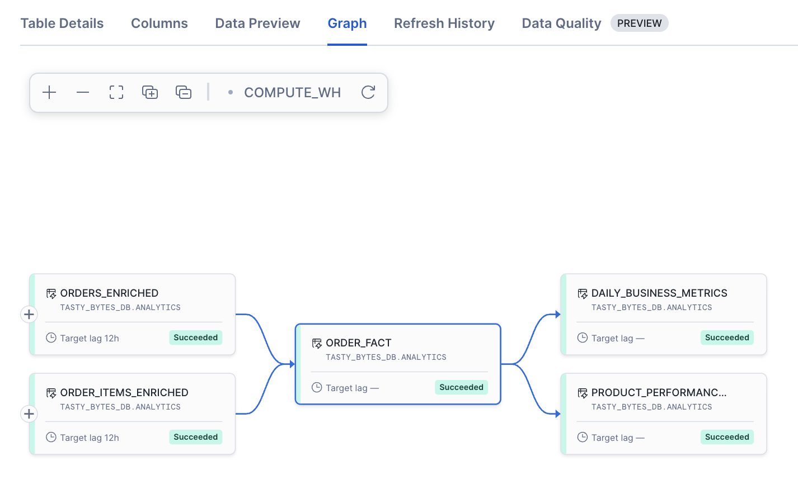
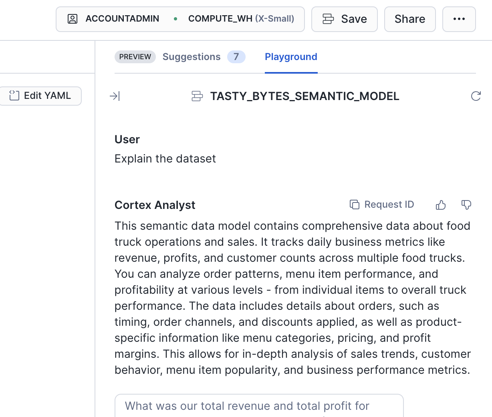
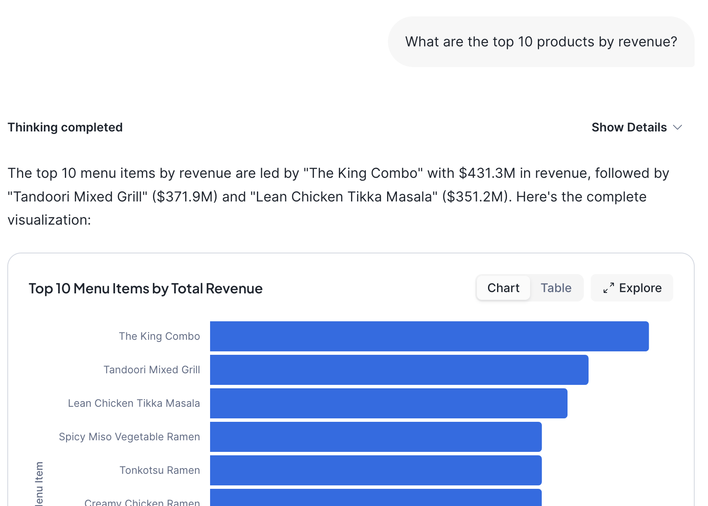

author: Gilberto Hernandez
id: snowflake-dynamic-tables-data-pipeline
categories: snowflake-site:taxonomy/solution-center/certification/quickstart, snowflake-site:taxonomy/product/data-engineering, snowflake-site:taxonomy/snowflake-feature/transformation
language: en
summary: Learn how to build declarative data pipelines using Snowflake Dynamic Tables with incremental refresh, monitoring, and intelligent querying capabilities.
environments: web
status: Published
feedback link: https://github.com/Snowflake-Labs/sfguides/issues
fork repo link: https://github.com/Snowflake-Labs/sfguide-declarative-pipelines-dynamic-tables

# Build Declarative Data Pipelines with Dynamic Tables
<!-- ------------------------ -->
## Overview 

Dynamic Tables in Snowflake provide a declarative way to build data pipelines. Rather than writing complex procedural code to orchestrate data transformations, you define the desired end state using SQL, and Snowflake automatically handles the refresh logic, dependency management, and incremental processing.

In this Quickstart, you'll build an end-to-end data pipeline using Dynamic Tables with the Tasty Bytes dataset, a fictitious food truck company. You'll create a three-tier pipeline that enriches raw order data, joins it into comprehensive fact tables, and pre-aggregates business metrics. Along the way, you'll explore incremental refresh capabilities, monitoring tools, and integrate with Snowflake Intelligence for natural language querying.

### Prerequisites
- Basic SQL knowledge
- Basic familiarity with data engineering concepts (data loading, transformations, insights delivery)

### What You'll Learn 
- How to ingest data into Snowflake using the COPY INTO SQL command
- How to create Dynamic Tables with declarative SQL
- How to configure refresh strategies for Dynamic Tables using TARGET_LAG and DOWNSTREAM
- How to build multi-tier data pipelines with automatic dependency management
- How to monitor Dynamic Table refresh operations
- How to generate synthetic data using a stored procedure to test incremental refresh
- How to visualize pipeline results using Streamlit in Snowflake
- How to integrate insights with Snowflake Intelligence

### What You'll Need 
- A Snowflake account ([trial](https://signup.snowflake.com/developers), or otherwise)
- ACCOUNTADMIN access (available in the trial account)

### What You'll Build 
- A three-tier declarative data pipeline processing order data
- Stored procedures for generating test data
- Monitoring queries for pipeline observability
- A semantic view for natural language querying

<!-- ------------------------ -->
## Create Snowflake Workspace

This Quickstart has a companion GitHub repository that contains all the SQL scripts you'll need to complete the lab. Rather than cloning the repository locally, we'll create a Snowflake Workspace directly from the GitHub repo, allowing you to work with the files inside Snowflake.

### Create an API Integration

First, create an API integration that allows Snowflake to connect to GitHub. 

In your Snowflake environment, run the following in a SQL worksheet:

```sql
USE ROLE ACCOUNTADMIN;

CREATE OR REPLACE API INTEGRATION dynamic_tables_git_integration
    API_PROVIDER = git_https_api
    API_ALLOWED_PREFIXES = ('https://github.com/Snowflake-Labs')
    ENABLED = TRUE;
```

This API integration allows Snowflake to access public repositories in the Snowflake-Labs organization on GitHub. 

> **Note**: Only users with ACCOUNTADMIN privileges (or the CREATE INTEGRATION privilege) can create API integrations. If you don't have these privileges, ask your Snowflake administrator to create this integration for you.

### Create the Workspace

Now let's create a workspace connected to the companion repository:

1. In the left navigation menu, select **Projects → Workspaces**

3. In the Workspaces menu at the top left, under "Create", select **From Git repository**

4. In the "Create Workspace" dialog:
   - **Repository URL**: Paste `https://github.com/Snowflake-Labs/sfguide-declarative-pipelines-dynamic-tables`
   - **Workspace name**: Leave it as-is, or enter a name you prefer
   - **API Integration**: Select the `dynamic_tables_git_integration` we created from the dropdown

5. Select **Public repository** (since the companion repo is a public repo)

6. Click **Create**

Snowflake will now clone the repository and create your workspace. This may take a few moments. Once complete, you'll see all the files from the GitHub repository in the left pane of your workspace:

- **00_load_tasty_bytes.sql**
- **01_dynamic_tables.sql**
- **02_sproc.sql**
- **03_incremental_refresh.sql**
- **04_monitoring.sql**
- **05_intelligence.sql**
- **06_cleanup.sql**
- **semantic_model.yaml**

You can now open these files directly within Snowflake. Throughout this Quickstart, when we reference a file (like "Open **01_dynamic_tables.sql**"), you'll open it from your workspace rather than from a local clone.

<!-- ------------------------ -->
## Load data

Let's now load the Tasty Bytes data that we'll use in our pipeline. 

We'll start by creating the necessary Snowflake objects to support our data pipeline. This includes a dedicated role, database, schemas, and compute resource.

Click on the **00_load_tasty_bytes.sql** file to open it in your workspace. This script will:

- Create a role called `lab_role` with the necessary privileges
- Create a database called `tasty_bytes_db` with two schemas: `raw` (for source data) and `analytics` (for transformed data)
- Create a compute resource called `tasty_bytes_wh`
- Define the structure for three raw tables: `order_header`, `order_detail`, and `menu`
- Create a file format for CSV ingestion
- Set up an external stage pointing to a public S3 bucket containing the Tasty Bytes dataset
- Load the data in CSV files in the S3 bucket into the target tables using COPY INTO

Run the entire script. The output should confirm the creation of these objects and the loading of all of the data. The load can take several minutes to complete given the volume of data – nearly 1 billion rows of raw data across the three tables.

If you encounter any errors, ensure you're using a role with sufficient privileges (such as ACCOUNTADMIN).
 
> **Note**: This script uses the `lab_role` role for all subsequent operations. If you encounter permission issues, you may need to grant additional privileges to this role or use ACCOUNTADMIN.


<!-- ------------------------ -->
## Understanding Dynamic Tables

Before building our pipeline, let's understand what Dynamic Tables are and why they're useful.

**What are Dynamic Tables?**

Dynamic Tables are a declarative way of defining data transformations in Snowflake. Instead of writing stored procedures, streams, and/or tasks to orchestrate your pipeline, you simply define what you want the result to look like using a `SELECT` statement. Snowflake automatically:

- Identifies and processes only rows that have changed (for incremental refresh)
- Refreshes dynamic tables based on a specified target lag setting
- Manages dependencies between Dynamic Tables

**Key Concepts**

- **TARGET_LAG**: Specifies the maximum acceptable delay between when source data changes and when the Dynamic Table reflects those changes. For example, `TARGET_LAG = '12 hours'` means the table will be refreshed to reflect changes within 12 hours.

- **DOWNSTREAM**: A special TARGET_LAG value that means "refresh this Dynamic Table whenever its downstream consumers need it." This creates a pull-based refresh model.

- **Incremental Refresh**: When possible, Dynamic Tables will perform incremental refreshes, processing only the changed data rather than recomputing the entire table. This is significantly more efficient and cost-effective than full refreshes.

- **Dependency Graph**: Snowflake automatically tracks dependencies between Dynamic Tables. When a source table changes, Snowflake knows which downstream Dynamic Tables need to be refreshed. You can also monitor the dependency graph within the Snowflake UI.

Let's build our three-tier pipeline.

<!-- ------------------------ -->
## Create Pipeline

### Tier 1: Enriched data

The first tier of our pipeline enriches the raw order data with additional dimensions and calculations. We'll create two Dynamic Tables in this tier.

Open **01_dynamic_tables.sql** in your workspace. Let's examine and create the first tier Dynamic Tables.

#### Create orders_enriched

This Dynamic Table adds temporal dimensions (day of week, hour) and financial metrics to order headers. It also adds a discount flag based on whether a discount was applied.

Note the `TARGET_LAG = '12 hours'` setting. This tells Snowflake to refresh this table within 12 hours of source data changes (i.e., new data in the three raw zone tables we created in **00_load_tasty_bytes.sql**).

```sql
USE ROLE lab_role;
USE DATABASE tasty_bytes_db;
USE WAREHOUSE tasty_bytes_wh;

CREATE OR REPLACE DYNAMIC TABLE tasty_bytes_db.analytics.orders_enriched
  TARGET_LAG = '12 hours'
  WAREHOUSE = tasty_bytes_wh
  AS
SELECT
  -- Order identifiers
  order_id,
  truck_id,
  customer_id,
  order_channel,
  -- Temporal dimensions
  order_ts AS order_timestamp,
  DATE(order_ts) AS order_date,
  DAYNAME(order_ts) AS day_name,
  HOUR(order_ts) AS order_hour,
  -- Financial metrics
  order_amount,
  order_total,
  TRY_TO_NUMBER(order_discount_amount, 10, 2) AS order_discount_amount,
  -- Simple discount flag
  CASE
    WHEN discount_id IS NOT NULL AND discount_id != '' THEN TRUE
    ELSE FALSE
  END AS has_discount
FROM tasty_bytes_db.raw.order_header
WHERE order_id IS NOT NULL
  AND order_ts IS NOT NULL;
```


#### Create order_items_enriched

This Dynamic Table enriches order line items by joining with the menu table to add product details and profit calculations:

```sql
CREATE OR REPLACE DYNAMIC TABLE tasty_bytes_db.analytics.order_items_enriched
  TARGET_LAG = '12 hours'
  WAREHOUSE = tasty_bytes_wh
  AS
SELECT
  -- Order detail identifiers
  od.order_detail_id,
  od.order_id,
  od.line_number,
  -- Product information
  od.menu_item_id,
  m.menu_item_name,
  m.item_category,
  m.item_subcategory,
  m.truck_brand_name,
  m.menu_type,
  -- Quantity and pricing
  od.quantity,
  od.unit_price,
  od.price AS line_total,
  m.cost_of_goods_usd,
  m.sale_price_usd,
  -- Profit calculations
  (od.unit_price - m.cost_of_goods_usd) AS unit_profit,
  (od.unit_price - m.cost_of_goods_usd) * od.quantity AS line_profit,
  CASE
    WHEN od.unit_price > 0 THEN
      ROUND(((od.unit_price - m.cost_of_goods_usd) / od.unit_price) * 100, 2)
    ELSE 0
  END AS profit_margin_pct,
  -- Discount information
  TRY_TO_NUMBER(od.order_item_discount_amount, 10, 2) AS line_discount_amount,
  CASE
    WHEN od.discount_id IS NOT NULL AND od.discount_id != '' THEN TRUE
    ELSE FALSE
  END AS has_discount
FROM tasty_bytes_db.raw.order_detail od
INNER JOIN tasty_bytes_db.raw.menu m
  ON od.menu_item_id = m.menu_item_id
WHERE od.order_id IS NOT NULL
  AND od.menu_item_id IS NOT NULL;
```

Run these `CREATE OR REPLACE DYNAMIC TABLE` statements in order. Snowflake will create the tables and immediately begin the first refresh. Note that the first refresh may take a few minutes. That's because Snowflake will perform a full refresh when initializing a new dynamic table. In our case, these dynamic tables are first created by processing the nearly 1 billion rows of raw data. Subsequently, these dynamic tables will only update incrementally.

### Create Tier 2: Fact tables

The second tier joins enriched data into comprehensive fact tables that are ready for analysis. This tier uses the `DOWNSTREAM` refresh strategy.

#### Create order_fact

This Dynamic Table joins order headers and enriched line items (which already include product details from the menu) into a complete picture of each order line:

```sql
CREATE OR REPLACE DYNAMIC TABLE tasty_bytes_db.analytics.order_fact
  TARGET_LAG = 'DOWNSTREAM' -- Checks upstream tables (tier 1) for changes then refreshes
  WAREHOUSE = tasty_bytes_wh
  AS
SELECT
  -- Order header fields
  o.order_id,
  o.truck_id,
  o.customer_id,
  o.order_channel,
  o.order_timestamp,
  o.order_date,
  o.day_name,
  o.order_hour,
  o.order_amount,
  o.order_total,
  o.order_discount_amount AS order_level_discount,
  o.has_discount AS order_has_discount,
  -- Order line item fields
  oi.order_detail_id,
  oi.line_number,
  oi.menu_item_id,
  oi.menu_item_name,
  oi.item_category,
  oi.item_subcategory,
  oi.truck_brand_name,
  oi.menu_type,
  oi.quantity,
  oi.unit_price,
  oi.line_total,
  oi.cost_of_goods_usd,
  oi.sale_price_usd,
  oi.unit_profit,
  oi.line_profit,
  oi.profit_margin_pct,
  oi.line_discount_amount,
  oi.has_discount AS line_has_discount
FROM tasty_bytes_db.analytics.orders_enriched o
INNER JOIN tasty_bytes_db.analytics.order_items_enriched oi
  ON o.order_id = oi.order_id;
```

Note the `TARGET_LAG = 'DOWNSTREAM'` setting. This means this table will only refresh when a downstream consumer (like our Tier 3 aggregations) needs fresh data. This creates an efficient, pull-based refresh pattern.

Run the statement to create the `order_fact` Dynamic Table.

### Create Tier 3: Aggregated metrics

The third tier pre-aggregates data into business metrics that power dashboards and reports. These aggregations make queries faster by pre-computing common calculations.

#### Create daily_business_metrics

This Dynamic Table aggregates daily business performance:

```sql
CREATE OR REPLACE DYNAMIC TABLE tasty_bytes_db.analytics.daily_business_metrics
  TARGET_LAG = 'DOWNSTREAM'
  WAREHOUSE = tasty_bytes_wh
  AS
SELECT
  order_date,
  day_name,
  -- Volume metrics
  COUNT(DISTINCT order_id) AS total_orders,
  COUNT(DISTINCT truck_id) AS active_trucks,
  COUNT(DISTINCT customer_id) AS unique_customers,
  SUM(quantity) AS total_items_sold,
  -- Revenue metrics
  SUM(order_total) AS total_revenue,
  ROUND(AVG(order_total), 2) AS avg_order_value,
  SUM(line_total) AS total_line_item_revenue,
  -- Profit metrics
  SUM(line_profit) AS total_profit,
  ROUND(AVG(profit_margin_pct), 2) AS avg_profit_margin_pct,
  -- Discount metrics
  SUM(CASE WHEN order_has_discount THEN 1 ELSE 0 END) AS orders_with_discount,
  SUM(order_level_discount) AS total_order_discount_amount,
  SUM(line_discount_amount) AS total_line_discount_amount
FROM tasty_bytes_db.analytics.order_fact
GROUP BY order_date, day_name;
```

#### Create product_performance_metrics

This Dynamic Table tracks product-level performance:

```sql
CREATE OR REPLACE DYNAMIC TABLE tasty_bytes_db.analytics.product_performance_metrics
  TARGET_LAG = 'DOWNSTREAM'
  WAREHOUSE = tasty_bytes_wh
  AS
SELECT
  -- Product dimensions
  menu_item_id,
  menu_item_name,
  item_category,
  item_subcategory,
  truck_brand_name,
  menu_type,
  -- Sales volume metrics
  COUNT(DISTINCT order_id) AS order_count,
  SUM(quantity) AS total_units_sold,
  -- Revenue and profit metrics
  SUM(line_total) AS total_revenue,
  SUM(line_profit) AS total_profit,
  ROUND(AVG(unit_price), 2) AS avg_unit_price,
  ROUND(AVG(profit_margin_pct), 2) AS avg_profit_margin_pct,
  -- Cost metrics
  AVG(cost_of_goods_usd) AS avg_cogs,
  AVG(sale_price_usd) AS standard_sale_price,
  -- Performance indicators
  SUM(line_total) / NULLIF(SUM(quantity), 0) AS revenue_per_unit,
  SUM(line_profit) / NULLIF(SUM(quantity), 0) AS profit_per_unit
FROM tasty_bytes_db.analytics.order_fact
GROUP BY
  menu_item_id,
  menu_item_name,
  item_category,
  item_subcategory,
  truck_brand_name,
  menu_type;
```

Run both statements to create these aggregated Dynamic Tables. These tables use `TARGET_LAG = 'DOWNSTREAM'`, meaning they'll refresh when needed by downstream consumers or when manually triggered.

With all three tiers created, you've now built a complete declarative data pipeline! Snowflake automatically manages the dependencies and refresh logic for you.

<!-- ------------------------ -->
## View dependency graph

Snowflake automatically tracks dependencies between your Dynamic Tables. Let's visualize this dependency graph.

Navigate to your `tasty_bytes_db` database in the Snowflake UI. Click on the `analytics` schema. You should see all five Dynamic Tables listed.

Click on any of the Dynamic Tables (for example, `order_fact`). In the details view, look for the "Graph" tab. This shows you:

- **Upstream dependencies**: Which tables this Dynamic Table depends on
- **Downstream dependencies**: Which tables depend on this Dynamic Table

For example, for `order_fact`, you should see:
- Upstream: `orders_enriched`, `order_items_enriched`
- Downstream: `daily_business_metrics`, `product_performance_metrics`

This visualization helps you understand how data flows through your pipeline. Snowflake uses this dependency graph to determine refresh order and optimize refresh operations.



<!-- ------------------------ -->
## Create stored procedure

Since we aren't automating the loading of new data from S3 into our raw tables, we need a different way to insert new data in our source tables. This will help us understand and demonstrate incremental refresh capabilities.

Let's create a stored procedure that we can call to generate synthetic order data and load it into the raw tables. By loading new data into the raw tables, we can trigger and propagate a refresh through all tiers of the pipeline. This will help you observe incremental refresh capabilities.

Open **02_sproc.sql** from your workspace and run the entire file.

```sql
USE ROLE lab_role;
USE DATABASE tasty_bytes_db;
USE WAREHOUSE tasty_bytes_wh;

-- Stored procedure to generate N synthetic orders with corresponding order details
-- Example usage: CALL tasty_bytes_db.raw.generate_demo_orders(500);
CREATE OR REPLACE PROCEDURE tasty_bytes_db.raw.generate_demo_orders(num_rows INTEGER)
RETURNS STRING
LANGUAGE SQL
AS
$
DECLARE
  orders_before INTEGER;
  orders_after INTEGER;
  orders_inserted INTEGER;
  details_before INTEGER;
  details_after INTEGER;
  details_inserted INTEGER;
BEGIN
  -- Capture counts before insert
  SELECT COUNT(*) INTO :orders_before FROM tasty_bytes_db.raw.order_header;
  SELECT COUNT(*) INTO :details_before FROM tasty_bytes_db.raw.order_detail;
  -- Create temporary table with new order IDs to maintain referential integrity
  CREATE OR REPLACE TEMPORARY TABLE new_orders AS
  SELECT
    (1000000 + UNIFORM(1, 999999, RANDOM()))::NUMBER(38,0) AS new_order_id,
    oh.order_id AS original_order_id,
    oh.truck_id,
    oh.location_id,
    oh.customer_id,
    oh.discount_id,
    oh.shift_id,
    oh.shift_start_time,
    oh.shift_end_time,
    oh.order_channel,
    DATEADD('day', DATEDIFF('day', oh.order_ts, CURRENT_DATE()), oh.order_ts) AS order_ts,
    oh.served_ts,
    oh.order_currency,
    oh.order_amount * (0.8 + UNIFORM(0, 0.4, RANDOM())) AS order_amount,
    oh.order_tax_amount,
    oh.order_discount_amount,
    oh.order_total * (0.8 + UNIFORM(0, 0.4, RANDOM())) AS order_total
  FROM tasty_bytes_db.raw.order_header oh
  WHERE oh.order_id IS NOT NULL
  ORDER BY RANDOM()
  LIMIT :num_rows;
  -- Insert synthetic order headers
  INSERT INTO tasty_bytes_db.raw.order_header (
    order_id, truck_id, location_id, customer_id, discount_id, shift_id,
    shift_start_time, shift_end_time, order_channel, order_ts, served_ts,
    order_currency, order_amount, order_tax_amount, order_discount_amount,
    order_total
  )
  SELECT
    new_order_id, truck_id, location_id, customer_id, discount_id, shift_id,
    shift_start_time, shift_end_time, order_channel, order_ts, served_ts,
    order_currency, order_amount, order_tax_amount, order_discount_amount,
    order_total
  FROM new_orders;
  -- Insert corresponding order details (line items)
  INSERT INTO tasty_bytes_db.raw.order_detail (
    order_detail_id, order_id, menu_item_id, discount_id, line_number,
    quantity, unit_price, price, order_item_discount_amount
  )
  SELECT
    (2000000 + UNIFORM(1, 9999999, RANDOM()))::NUMBER(38,0) AS order_detail_id,
    no.new_order_id AS order_id,
    od.menu_item_id,
    od.discount_id,
    od.line_number,
    od.quantity,
    od.unit_price * (0.8 + UNIFORM(0, 0.4, RANDOM())) AS unit_price,
    od.price * (0.8 + UNIFORM(0, 0.4, RANDOM())) AS price,
    od.order_item_discount_amount
  FROM new_orders no
  INNER JOIN tasty_bytes_db.raw.order_detail od
    ON no.original_order_id = od.order_id;

  -- Capture counts after insert
  SELECT COUNT(*) INTO :orders_after FROM tasty_bytes_db.raw.order_header;
  SELECT COUNT(*) INTO :details_after FROM tasty_bytes_db.raw.order_detail;

  orders_inserted := :orders_after - :orders_before;
  details_inserted := :details_after - :details_before;

  -- Clean up temporary table
  DROP TABLE IF EXISTS new_orders;

  RETURN 'Successfully generated ' || orders_inserted::STRING || ' new orders with ' ||
         details_inserted::STRING || ' line items. Total orders: ' || orders_after::STRING;
END;
$;
```

This stored procedure generates synthetic orders by sampling from existing real orders and modifying them to create new data. The approach:

- Samples random existing orders from the `order_header` table
- Creates new order IDs to avoid conflicts
- Updates timestamps to the current date while preserving time-of-day patterns
- Applies random price variations (±20%) to simulate realistic fluctuations
- Automatically generates corresponding line items by joining with existing `order_detail` records
- Maintains referential integrity between `order_header` and `order_detail` tables
- Returns detailed statistics showing how many orders and line items were created

<!-- ------------------------ -->
## Test incremental refresh

Now let's test the incremental refresh capabilities of our Dynamic Tables by inserting new data and observing how the pipeline updates.

Open **03_incremental_refresh.sql** from your workspace. Let's walk through each step:

### Check current state

First, let's check the current state of our raw tables to establish a baseline:

```sql
USE ROLE lab_role;
USE DATABASE tasty_bytes_db;
USE WAREHOUSE tasty_bytes_wh;

-- Grab current state --> ~248,201,269 records
SELECT COUNT(*) AS total_orders, MAX(order_ts) AS latest_order
FROM tasty_bytes_db.raw.order_header;

-- ~673,655,465 records
SELECT COUNT(*) AS total_order_details FROM tasty_bytes_db.raw.order_detail;
```

These queries show you the starting point before we generate new synthetic data.

### Generate new orders

Now, generate 500 new orders using the stored procedure:

```sql
CALL tasty_bytes_db.raw.generate_demo_orders(500);
```

The stored procedure will sample existing orders, create new variants, and insert them into the raw tables along with their corresponding line items.

### Verify new data was inserted

Let's verify the new data was successfully inserted:

```sql
-- Verify new data in raw tables
SELECT COUNT(*) AS total_orders FROM tasty_bytes_db.raw.order_header; -- +500 records
SELECT COUNT(*) AS total_order_details FROM tasty_bytes_db.raw.order_detail; --+1,397 records
```

You should see approximately 500 new order headers and around 1,397 new order detail records (since each order has multiple line items).

### Manually trigger refresh

While Dynamic Tables refresh automatically based on their TARGET_LAG, you can manually trigger a refresh for testing. Let's refresh the tables manually to to observe the dependency flow now:

First, refresh the Tier 1 tables:

```sql
-- Manually trigger incremental refresh across all dynamic tables
-- Tier 1 tables will refresh first
ALTER DYNAMIC TABLE tasty_bytes_db.analytics.orders_enriched REFRESH;
ALTER DYNAMIC TABLE tasty_bytes_db.analytics.order_items_enriched REFRESH;
```

Then, refresh Tier 2 and Tier 3 tables. These have `TARGET_LAG = 'DOWNSTREAM'`, so they'll refresh based on upstream changes:

```sql
-- Tier 2 and 3 will refresh due to DOWNSTREAM lag. Manually trigger:
ALTER DYNAMIC TABLE tasty_bytes_db.analytics.order_fact REFRESH;
ALTER DYNAMIC TABLE tasty_bytes_db.analytics.daily_business_metrics REFRESH;
ALTER DYNAMIC TABLE tasty_bytes_db.analytics.product_performance_metrics REFRESH;
```

### Verify incremental refresh

Now let's check whether Snowflake performed an incremental or full refresh. Query the refresh history for each table:

```sql
-- Check refresh history for orders_enriched
SELECT name, refresh_action, state, refresh_start_time, refresh_trigger
FROM TABLE(INFORMATION_SCHEMA.DYNAMIC_TABLE_REFRESH_HISTORY(
  NAME => 'tasty_bytes_db.ANALYTICS.ORDERS_ENRICHED'
))
ORDER BY REFRESH_START_TIME DESC LIMIT 10;

-- Check refresh history for order_items_enriched
SELECT name, refresh_action, state, refresh_start_time, refresh_trigger
FROM TABLE(INFORMATION_SCHEMA.DYNAMIC_TABLE_REFRESH_HISTORY(
  NAME => 'tasty_bytes_db.ANALYTICS.ORDER_ITEMS_ENRICHED'
))
ORDER BY REFRESH_START_TIME DESC LIMIT 10;

-- Check refresh history for order_fact
SELECT name, refresh_action, state, refresh_start_time
FROM TABLE(INFORMATION_SCHEMA.DYNAMIC_TABLE_REFRESH_HISTORY(
  NAME => 'tasty_bytes_db.ANALYTICS.ORDER_FACT'
))
ORDER BY REFRESH_START_TIME DESC LIMIT 10;

-- Check refresh history for daily_business_metrics
SELECT name, refresh_action, state, refresh_start_time
FROM TABLE(INFORMATION_SCHEMA.DYNAMIC_TABLE_REFRESH_HISTORY(
  NAME => 'tasty_bytes_db.ANALYTICS.DAILY_BUSINESS_METRICS'
))
ORDER BY REFRESH_START_TIME DESC LIMIT 10;

-- Check refresh history for product_performance_metrics
SELECT name, refresh_action, state, refresh_start_time
FROM TABLE(INFORMATION_SCHEMA.DYNAMIC_TABLE_REFRESH_HISTORY(
  NAME => 'tasty_bytes_db.ANALYTICS.PRODUCT_PERFORMANCE_METRICS'
))
ORDER BY REFRESH_START_TIME DESC LIMIT 10;
```

Look at the `refresh_action` column in the results. You should see:

- **INCREMENTAL**: Snowflake processed only the new 500 orders and their changes through the pipeline
- **FULL**: Snowflake recomputed the entire table (this happens on first run or when incremental refresh isn't possible)

The `refresh_trigger` column shows what triggered the refresh (e.g., `MANUAL` for our ALTER commands).

Incremental refreshes are significantly faster and more cost-effective than full refreshes. For our 500 new orders out of hundreds of millions of existing records, an incremental refresh processes only the changes, making it extremely efficient.

### View updated metrics

Finally, let's query the aggregated metrics to see the updated data:

```sql
-- Updated metrics from today
SELECT order_date, total_orders, total_items_sold, total_revenue, total_profit
FROM tasty_bytes_db.analytics.daily_business_metrics
ORDER BY order_date DESC LIMIT 5;

-- Updated product performance
SELECT menu_item_name, item_category, total_units_sold, total_revenue, total_profit
FROM tasty_bytes_db.analytics.product_performance_metrics
ORDER BY total_revenue DESC
LIMIT 10;
```

You should see today's date in the daily metrics with the newly generated orders included. The product performance metrics will reflect the updated aggregations across all orders.

You've now verified that Dynamic Tables can efficiently process incremental updates through a multi-tier pipeline!

<!-- ------------------------ -->
## Monitor pipeline

Monitoring is crucial for production data pipelines. Snowflake provides rich metadata about Dynamic Table operations.

Open **04_monitoring.sql** from your workspace. Let's explore the monitoring queries:

### View all Dynamic Tables

Get an overview of all Dynamic Tables in your analytics schema:

```sql
USE ROLE lab_role;
USE DATABASE tasty_bytes_db;
USE WAREHOUSE tasty_bytes_wh;

-- Check all dynamic tables in the analytics schema
SHOW DYNAMIC TABLES IN SCHEMA tasty_bytes_db.analytics;
```

This returns metadata including:

- Table name
- Target lag configuration
- Warehouse used for refresh operations
- Scheduling state (RUNNING, SCHEDULED, or SUSPENDED)
- Last refresh time
- Data timestamp

### Summary of latest refresh operations

Get a summary view of the most recent refresh operation for each Dynamic Table. This query shows whether tables are being refreshed incrementally or fully, and how long refreshes are taking:

```sql
-- Summary of latest refresh operations across all dynamic tables
-- Shows refresh type (INCREMENTAL vs FULL) and duration
SELECT
  name,
  refresh_action,
  state,
  refresh_start_time,
  refresh_end_time,
  DATEDIFF('second', refresh_start_time, refresh_end_time) AS refresh_duration_seconds
FROM (
  SELECT name, refresh_action, state, refresh_start_time, refresh_end_time,
         ROW_NUMBER() OVER (PARTITION BY name ORDER BY refresh_start_time DESC) as rn
  FROM TABLE(INFORMATION_SCHEMA.DYNAMIC_TABLE_REFRESH_HISTORY())
)
WHERE rn = 1
ORDER BY name;
```

This query uses a window function (`ROW_NUMBER()`) to get only the most recent refresh for each Dynamic Table. Key columns to watch:

- **name**: The Dynamic Table name
- **refresh_action**: Whether the refresh was `INCREMENTAL` or `FULL`
  - **INCREMENTAL**: Only changed data was processed (efficient)
  - **FULL**: Entire table was recomputed (happens on first run or when incremental isn't possible)
- **state**: The result of the refresh operation (e.g., `SUCCEEDED`, `FAILED`)
- **refresh_duration_seconds**: How long the refresh took

These monitoring queries are essential for understanding your pipeline's performance and troubleshooting issues in production.

<!-- ------------------------ -->
## Create a semantic view

Let's take things a step further. Let's make the data queryable using natural language with Snowflake Cortex Analyst. Cortex Analyst allows business users to ask questions in plain English and get answers powered by your data.

### Generate a semantic view using AI

Cortex Analyst requires a semantic view that describes your data in business terms. Rather than writing this YAML file manually, we'll use Snowflake's AI-powered UI to generate it automatically.

Let's create a semantic view for our Dynamic Tables:

1. In Snowsight, navigate to **AI & ML → Analyst** in the left navigation menu.

2. Click **Create New: Semantic View** in the top right

3. In the "Create Semantic View" dialog:
   - **Name**: Enter `tasty_bytes_semantic_model`
   - **Location**: Select database `TASTY_BYTES_DB` and schema `ANALYTICS`

4. Click **Next**. Skip "Provide context (optional)".

### Select tables for the semantic view

Now we'll tell Cortex Analyst which tables to include in the semantic view:

1. In the modal, select all of the Dynamic Tables from the `TASTY_BYTES_DB.ANALYTICS` schema:
   - `DAILY_BUSINESS_METRICS`
   - `PRODUCT_PERFORMANCE_METRICS`
   - `ORDER_FACT`
   - `ORDERS_ENRICHED`
   - `ORDER_ITEMS_ENRICHED`

2. Click **Next**

3. Select all columns in the next dialog (to do this quickly: click "Collapse all" first, then select the entire table)

4. Click **Create and Save**

Cortex Analyst will now analyze these tables and automatically generate:

- Descriptions for each table based on column names and data patterns
- Logical names for columns (e.g., converting `order_ts` to "Order Timestamp")
- Relationships between tables
- Suggested measures and dimensions
- Sample questions you can ask

This process takes a few moments as the AI examines your table structures and data.

### Review and refine the generated view

Once generation is complete, you'll see the semantic view with:

**Tables**: Each Dynamic Table with AI-generated business descriptions

**Columns**: Renamed with human-friendly labels and descriptions

**Verified queries**: Sample questions the model can answer, such as:

- "Which menu items generate the highest profit per order?"
- "What are the details of our 10 most recent orders, including what was ordered and their profitability?"

You can view the details of the semantic view by clicking "Edit YAML" in the Snowsight UI. You can edit any of these descriptions or add custom synonyms to improve how the view understands your business terminology. For now, the AI-generated view works great out of the box.

Click **Save** to save your semantic view. 
 
> **Note**: Your workspace includes a **semantic_model.yaml** file that represents an enhanced semantic view with additional synonyms and descriptions. Feel free to explore it as a reference for how you might further refine your semantic view, but for this Quickstart, we'll use the AI-generated version from the UI.


### Ask questions in the Analyst playground

You can test our your semantic view in Cortex Analyst by asking natural language questions about our data:

1. From the semantic view page, click **Playground** (or navigate to **AI & ML → Analyst** and select your view).

2. You should now see the Analyst chat interface with your semantic view loaded.

Try asking this question in natural language:

Question: "What are the top 10 products by revenue?"

Cortex Analyst will generate SQL against the `product_performance_metrics` Dynamic Table and return a chart showing the highest-grossing menu items.

As you ask questions, notice that Cortex Analyst:

- Translates your natural language question into SQL
- Shows you the generated SQL query (click "View SQL" to see it)
- Executes the query against your Dynamic Tables
- Returns results as tables or charts
- Provides explanations of the results

This natural language interface makes your Dynamic Tables pipeline accessible to business users who may not know SQL, democratizing access to your data.



<!-- ------------------------ -->
## Create and use an AI agent

Now let's create an AI agent. This agent will use the semantic view we created earlier to answer natural language questions about our Dynamic Tables data.

### Create the agent

Let's create an agent in the Snowflake UI:

1. In Snowsight, navigate to **AI & ML → Agents** in the left navigation menu

2. Click **Create agent** in the top right

3. In the "Create Agent" dialog:
   - **Database**: Select `TASTY_BYTES_DB`
   - **Schema**: Select `ANALYTICS`
   - **Agent object name**: Enter `tasty_bytes_agent`
   - **Display name**: Enter `Tasty Bytes Analytics Agent`

4. Click **Create**. Your agent is now created, but it doesn't have any tools yet. Let's attach Cortex Analyst so it can query your data.

5. Click the **Tools** tab

6. Click **Add+** next to Cortex Analyst text

7. Select the semantic view we created earlier in `TASTY_BYTES_DB.ANALYTICS.TASTY_BYTES_SEMANTIC_MODEL`

8. Enter a name for the tool.

9. Add a description by clicking **Generate with Cortex**.

10. Click **Add** to attach the tool to the agent.

11. Click **SAVE**.

Your agent now has access to Cortex Analyst and can query your Dynamic Tables using natural language!

### Use the agent in Snowflake Intelligence

Let's test the agent by asking questions about our data:

1. Navigate to **Snowflake Intelligence** **AI & ML → Snowflake Intelligence**). Log in if needed.

2. In the interface, select your agent from the agent selector

3. You should now see a chat interface where you can ask natural language questions

Try asking questions like:

- "What are the top 10 products by revenue?"
- "Show me daily revenue trends for the last 30 days"
- "Which truck brands are most profitable?"
- "How many unique customers do we have?"
- "What's the average order value by day of week?"

The agent will translate these natural language questions into SQL queries against your Dynamic Tables and return results. You can see the generated SQL and explore the data interactively. It will also generate visualizations when acceptable.

Great job, you just used an agent in Snowflake Intelligence!




<!-- ------------------------ -->
## Clean up

If you'd like to remove the objects created during this Quickstart, open **06_cleanup.sql** from your workspace.

The cleanup script will:

- Drop the `tasty_bytes_db` database (including all tables and Dynamic Tables)
- Drop the `snowflake_intelligence` database
- Drop the `tasty_bytes_wh` warehouse
- Optionally drop the `lab_role` role

Run the statements carefully, as this operation is irreversible:

```sql
USE ROLE lab_role;

-- Drop the main database (cascades to all schemas, tables, dynamic tables, views, stages, etc.)
DROP DATABASE IF EXISTS tasty_bytes_db;

-- Drop the Snowflake Intelligence database and agents
DROP DATABASE IF EXISTS snowflake_intelligence;

-- Drop the warehouse
DROP WAREHOUSE IF EXISTS tasty_bytes_wh;

-- Optionally drop the role (requires ACCOUNTADMIN)
-- USE ROLE ACCOUNTADMIN;
-- DROP ROLE IF EXISTS lab_role;
```

Before running cleanup, consider whether you want to keep the environment for further experimentation with Dynamic Tables.

<!-- ------------------------ -->
## Conclusion and Resources

Congratulations! You've built a complete declarative data pipeline using Snowflake Dynamic Tables. You've learned how to create multi-tier transformations, configure refresh strategies, monitor pipeline health, and enable natural language querying through AI agents powered by Cortex Analyst within Snowflake Intelligence.

Dynamic Tables eliminate the complexity of traditional pipeline orchestration by letting you declare what you want, not how to build it. Snowflake handles dependency management, incremental processing, and scheduling automatically, allowing you to focus on business logic rather than orchestration.

### What You Learned

- Ingesting data into Snowflake using the COPY INTO SQL command
- Creating Dynamic Tables with declarative SQL
- Configuring TARGET_LAG and DOWNSTREAM refresh strategies
- Building three-tier data pipelines with automatic dependency tracking
- Viewing dependency graphs to understand data flow
- Generating synthetic data using a stored procedure to test incremental refresh
- Monitoring pipeline operations using INFORMATION_SCHEMA views
- Creating semantic views with AI-generated descriptions using Cortex Analyst
- Building AI agents that use Cortex Analyst to query data with natural language
- Integrating agents with Snowflake Intelligence for conversational data exploration

### Related Resources

- [Snowflake Documentation: Dynamic Tables](https://docs.snowflake.com/en/user-guide/dynamic-tables-intro)
- [Snowflake Documentation: Dynamic Table Refresh](https://docs.snowflake.com/en/user-guide/dynamic-tables-refresh)
- [Snowflake Documentation: Cortex Analyst](https://docs.snowflake.com/en/user-guide/snowflake-cortex/cortex-analyst)
- [Snowflake Documentation: AI Agents](https://docs.snowflake.com/en/user-guide/snowflake-cortex/agents)
- [Snowflake Intelligence Documentation](https://docs.snowflake.com/en/user-guide/snowflake-intelligence)
- [GitHub Repository: sfguide-declarative-pipelines-dynamic-tables](https://github.com/Snowflake-Labs/sfguide-declarative-pipelines-dynamic-tables)