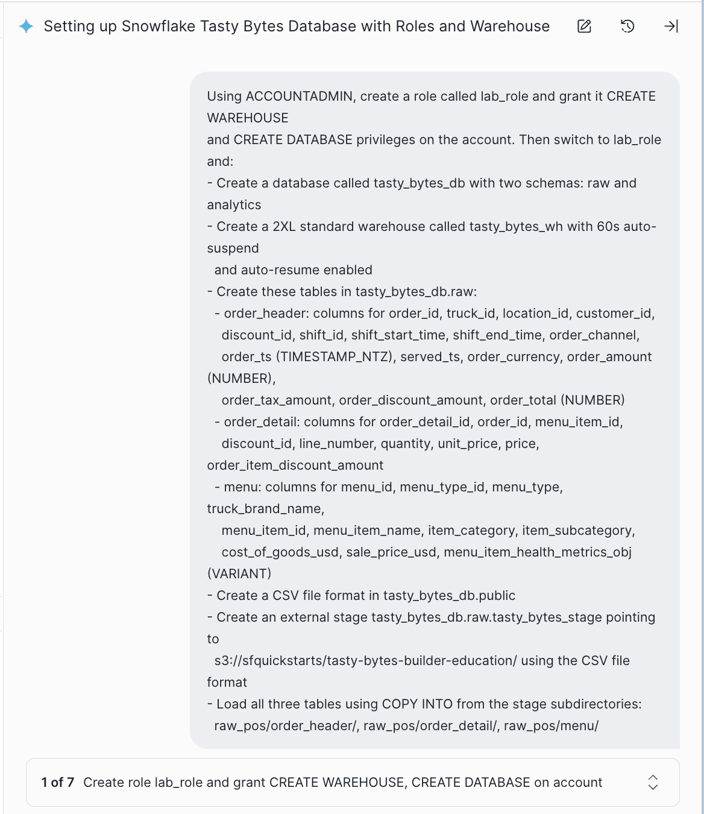
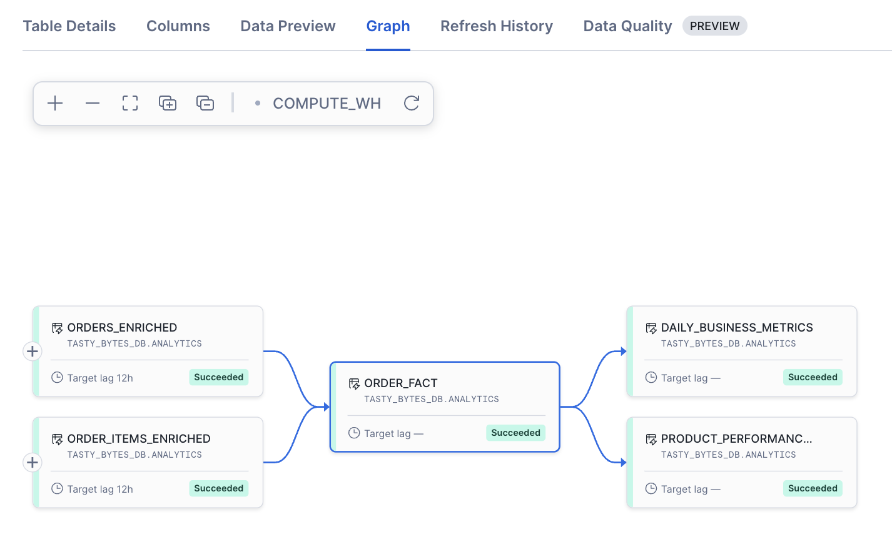
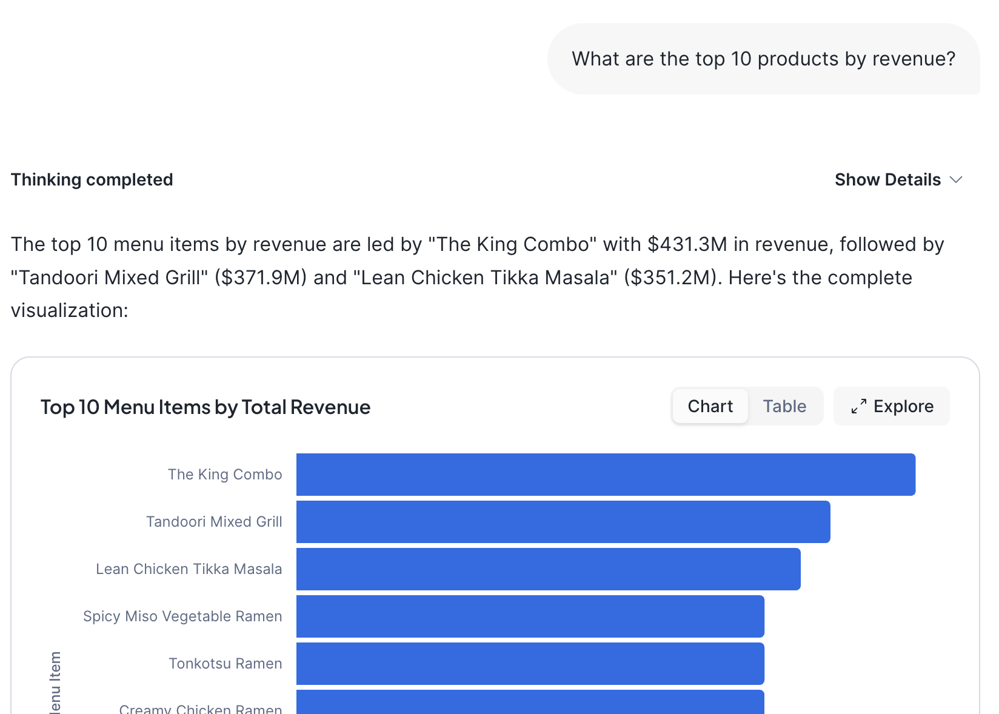
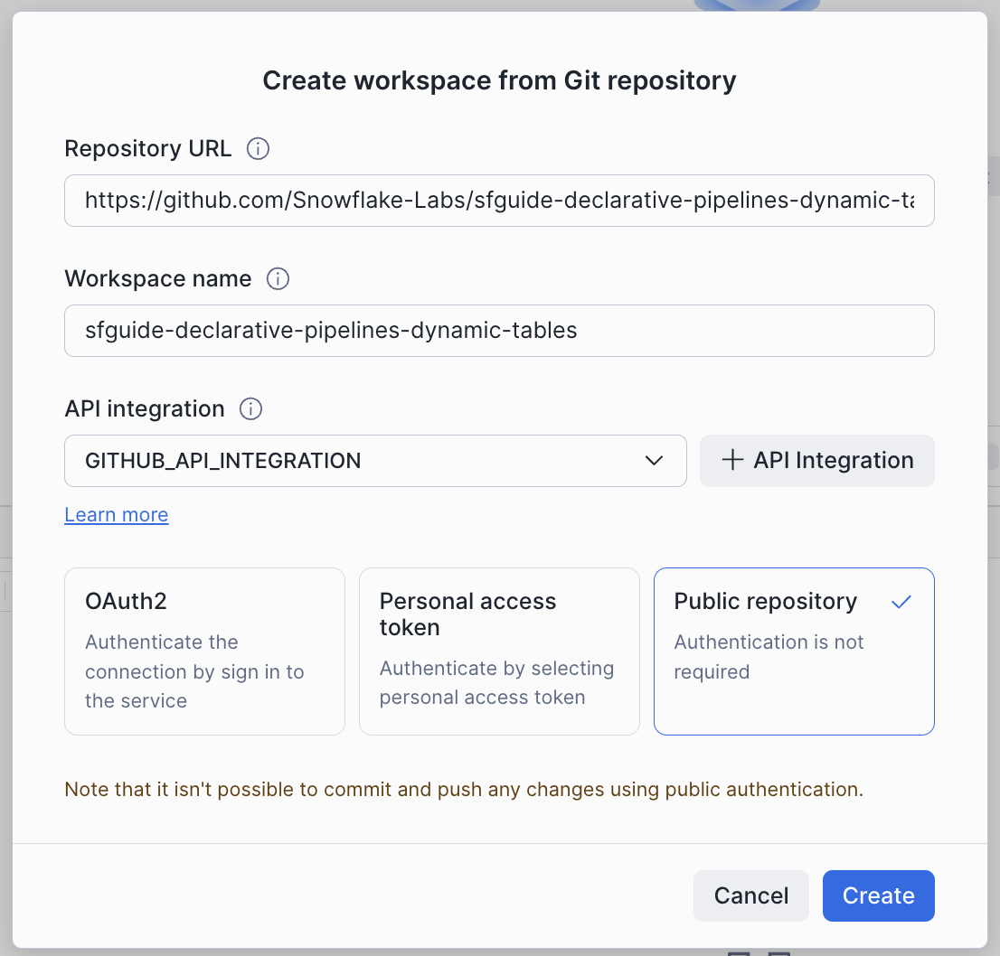

author: Yoav Ostrinsky
id: snowflake-dynamic-tables-data-pipeline
categories: snowflake-site:taxonomy/solution-center/certification/quickstart, snowflake-site:taxonomy/product/data-engineering, snowflake-site:taxonomy/snowflake-feature/transformation
language: en
summary: Build autonomous SQL pipelines for AI agents using Dynamic Tables, driven by natural language prompts to Cortex Code.
environments: web
status: Published
feedback link: https://github.com/Snowflake-Labs/sfguides/issues
fork repo link: https://github.com/Snowflake-Labs/sfguide-declarative-pipelines-dynamic-tables

# Build Autonomous SQL Pipelines for AI Agents
<!-- ------------------------ -->
## Overview

What if you could build a production data pipeline by simply describing what you want? In this quickstart, you'll do exactly that — using **Cortex Code** as your AI co-pilot to build an end-to-end **Dynamic Tables** pipeline from natural language prompts.

Dynamic Tables let you declare *what* your pipeline should produce using SQL. Cortex Code lets you describe *what* you want in plain English and generates the SQL for you. Together, they represent a fully declarative approach to data engineering — from intent to production pipeline, no boilerplate required.

You'll work with the Tasty Bytes dataset (a fictitious food truck company) to build a three-tier pipeline that enriches raw order data, joins it into fact tables, and pre-aggregates business metrics — all by giving Cortex Code prompts. Once the pipeline is running, you'll wire it up to an AI agent that answers natural language questions about your data.

### Prerequisites
- Basic familiarity with data engineering concepts (data loading, transformations)
- No SQL writing required — Cortex Code writes it for you

### What You'll Learn
- How to use Cortex Code as a data engineering co-pilot in Snowsight
- How to build Dynamic Tables by describing your pipeline in natural language
- How to configure refresh strategies (TARGET_LAG, DOWNSTREAM) through prompts
- How Dynamic Tables handle incremental refresh automatically
- How to monitor pipeline operations conversationally
- How to create semantic views and AI agents using Cortex Code

### What You'll Need
- A Snowflake account ([trial](https://signup.snowflake.com/developers), or otherwise) — preferably AWS US West 2 (Oregon), Enterprise edition
- ACCOUNTADMIN access (available in trial accounts)
- Cortex Code enabled in your account ([setup guide](https://docs.snowflake.com/en/user-guide/cortex-code/cortex-code-snowsight))

### What You'll Build
- A three-tier declarative data pipeline processing ~1 billion order records
- A stored procedure for generating synthetic test data
- Monitoring queries for pipeline observability
- A semantic view for natural language querying
- A Cortex Agent for conversational data exploration
- A Streamlit dashboard visualizing pipeline metrics

<!-- ------------------------ -->
## Open Cortex Code

All of the work in this quickstart is driven through **Cortex Code** — Snowflake's AI co-pilot built into Snowsight.

Open the Cortex Code panel by clicking the **Cortex Code icon** in the lower-right corner of Snowsight.



You'll see a chat interface. Throughout this quickstart, you'll paste prompts from each section directly into CoCo. CoCo will generate the SQL, explain what it's doing, and execute it for you.

<!-- ------------------------ -->
## Set Up the Environment

Let's create the database, warehouse, and load the Tasty Bytes dataset. Give CoCo the following prompt:

```
Using ACCOUNTADMIN, create a role called lab_role and grant it CREATE WAREHOUSE
and CREATE DATABASE privileges on the account. Then switch to lab_role and:
- Create a database called tasty_bytes_db with two schemas: raw and analytics
- Create a 2XL standard warehouse called tasty_bytes_wh with 60s auto-suspend
  and auto-resume enabled
- Create these tables in tasty_bytes_db.raw:
  - order_header: columns for order_id, truck_id, location_id, customer_id,
    discount_id, shift_id, shift_start_time, shift_end_time, order_channel,
    order_ts (TIMESTAMP_NTZ), served_ts, order_currency, order_amount (NUMBER),
    order_tax_amount, order_discount_amount, order_total (NUMBER)
  - order_detail: columns for order_detail_id, order_id, menu_item_id,
    discount_id, line_number, quantity, unit_price, price, order_item_discount_amount
  - menu: columns for menu_id, menu_type_id, menu_type, truck_brand_name,
    menu_item_id, menu_item_name, item_category, item_subcategory,
    cost_of_goods_usd, sale_price_usd, menu_item_health_metrics_obj (VARIANT)
- Create a CSV file format in tasty_bytes_db.public
- Create an external stage tasty_bytes_db.raw.tasty_bytes_stage pointing to
  s3://sfquickstarts/tasty-bytes-builder-education/ using the CSV file format
- Load all three tables using COPY INTO from the stage subdirectories:
  raw_pos/order_header/, raw_pos/order_detail/, raw_pos/menu/
```

CoCo will create all infrastructure and load ~1 billion rows from S3. The data load takes a few minutes due to the volume.

> **Note**: If you encounter permission errors, ensure you're running as ACCOUNTADMIN when creating the role and granting privileges.

<!-- ------------------------ -->
## Understanding Dynamic Tables

Before we build the pipeline, let's understand the key concepts.

**Dynamic Tables** are a declarative way of defining data transformations in Snowflake. Instead of writing stored procedures, streams, and tasks to orchestrate your pipeline, you define the desired result using a `SELECT` statement. Snowflake automatically:

- Identifies and processes only changed rows (incremental refresh)
- Refreshes tables based on a target lag setting
- Manages dependencies between Dynamic Tables

**Key Concepts:**

- **TARGET_LAG**: The maximum acceptable delay between source changes and the Dynamic Table reflecting them. Example: `TARGET_LAG = '1 hour'` means data is at most 1 hour stale.

- **DOWNSTREAM**: A special TARGET_LAG value meaning "refresh only when downstream consumers need it." Creates an efficient pull-based refresh model.

- **Incremental Refresh**: Dynamic Tables process only changed data rather than recomputing everything. Processing 500 new orders out of 1 billion is nearly instant.

- **Dependency Graph**: Snowflake tracks dependencies between Dynamic Tables and determines refresh order automatically.

- **INITIALIZE = 'ON_REFRESH'**: By default (`ON_CREATE`), a Dynamic Table performs an immediate full refresh the moment it's created — processing all source data before returning. With `ON_REFRESH`, the table is created instantly (empty) and populated on the first scheduled or manual refresh. This is the recommended approach for production and lab pipelines because it separates **definition** from **execution**: you can create the entire pipeline structure quickly, then trigger the initial load when you're ready. It also avoids long-running CREATE statements and makes deployments faster and more predictable.

Now let's tell Cortex Code to build a three-tier pipeline using these concepts.

<!-- ------------------------ -->
## Build the Pipeline

This is the core of the quickstart — you'll describe an entire three-tier data pipeline to Cortex Code, and it will generate all the Dynamic Table DDL. Give CoCo the following prompt:

```
Build a 3-tier dynamic table pipeline in tasty_bytes_db.analytics using
warehouse tasty_bytes_wh:

Use INITIALIZE = 'ON_REFRESH' for all dynamic tables.

Tier 1 - Enrichment (TARGET_LAG = DOWNSTREAM):
- orders_enriched: From tasty_bytes_db.raw.order_header. Include order_id,
  truck_id, customer_id, order_channel. Add temporal dimensions: order_date,
  day_name (DAYNAME), order_hour (HOUR), and order_ts as order_timestamp.
  Include order_amount and order_total. Cast order_discount_amount to NUMBER(10,2)
  using TRY_TO_NUMBER. Add a has_discount boolean (true when discount_id is not
  null and not empty string). Filter out null order_id and null order_ts.

- order_items_enriched: Join tasty_bytes_db.raw.order_detail with
  tasty_bytes_db.raw.menu on menu_item_id. Include order_detail_id, order_id,
  line_number, menu_item_id, menu_item_name, item_category, item_subcategory,
  truck_brand_name, menu_type, quantity, unit_price, price as line_total,
  cost_of_goods_usd, sale_price_usd. Calculate unit_profit (unit_price minus
  cost_of_goods_usd), line_profit (unit_profit times quantity), and
  profit_margin_pct (rounded to 2 decimals, handle zero unit_price). Cast
  order_item_discount_amount to NUMBER(10,2) as line_discount_amount. Add
  has_discount flag. Filter out null order_id and null menu_item_id.

Tier 2 - Fact Table (TARGET_LAG = DOWNSTREAM):
- order_fact: Inner join orders_enriched (alias o) with order_items_enriched
  (alias oi) on order_id. Include all columns from both. Rename
  o.order_discount_amount as order_level_discount and o.has_discount as
  order_has_discount, oi.has_discount as line_has_discount.

Tier 3 - Aggregated Metrics (TARGET_LAG = 1 hour):
- daily_business_metrics: Aggregate order_fact by order_date and day_name.
  Include count distinct order_id (total_orders), truck_id (active_trucks),
  customer_id (unique_customers), sum quantity (total_items_sold), sum
  order_total (total_revenue), avg order_total (avg_order_value), sum
  line_total (total_line_item_revenue), sum line_profit (total_profit),
  avg profit_margin_pct (avg_profit_margin_pct), count orders with discount,
  sum discount amounts.

- product_performance_metrics: Aggregate order_fact by menu_item_id,
  menu_item_name, item_category, item_subcategory, truck_brand_name, menu_type.
  Include count distinct order_id (order_count), sum quantity (total_units_sold),
  sum line_total (total_revenue), sum line_profit (total_profit), avg unit_price,
  avg profit_margin_pct, avg cost_of_goods_usd (avg_cogs), avg sale_price_usd
  (standard_sale_price), revenue_per_unit, profit_per_unit.
```

> **Review before executing**: Verify that TARGET_LAG values match (DOWNSTREAM for Tier 1-2, 1 hour for Tier 3), `INITIALIZE = 'ON_REFRESH'` is set on all tables, join conditions are correct, and the dependency flows raw → Tier 1 → Tier 2 → Tier 3.

> **Why ON_REFRESH?** With `INITIALIZE = 'ON_REFRESH'`, all 5 CREATE statements return immediately — no waiting for an initial full scan of 1 billion rows. The pipeline is defined but empty. You'll trigger the first load manually in the next step, giving you full control over when the expensive initial refresh happens.

<!-- ------------------------ -->
## View Dependency Graph

Snowflake automatically tracks dependencies between your Dynamic Tables. Let's visualize this.

1. Navigate to your `tasty_bytes_db` database in the Snowflake UI
2. Click on the `analytics` schema
3. Click on any Dynamic Table (e.g., `order_fact`)
4. Look for the **Graph** tab

You'll see:
- **Upstream**: `orders_enriched`, `order_items_enriched`
- **Downstream**: `daily_business_metrics`, `product_performance_metrics`



Optionally, ask CoCo:

```
Show me all dynamic tables in tasty_bytes_db.analytics with their target lag settings
```

<!-- ------------------------ -->
## Generate Test Data

To demonstrate incremental refresh, we need a way to insert new orders. Ask CoCo to create a stored procedure:

```
Create a stored procedure tasty_bytes_db.raw.generate_demo_orders(num_rows INTEGER)
using SQL language that generates synthetic orders. It should:
- Capture row counts in order_header and order_detail before insertion
- Sample num_rows random existing orders from order_header into a temporary table
- Assign new unique order IDs to avoid conflicts with existing data
- Set timestamps to the current date while preserving the original time-of-day
- Apply random price variation of plus or minus 20% using UNIFORM
- Insert the new orders into order_header
- For each new order, copy the corresponding order_detail records from the
  original order, generating new order_detail_ids and applying the same
  price randomization
- Capture row counts after insertion
- Clean up the temporary table
- Return a summary string showing how many orders and line items were inserted
```

> **Review before executing**: This is a complex stored procedure — verify it creates a temp table with new_order_id mappings and joins back to order_detail to preserve referential integrity.

<!-- ------------------------ -->
## Test Incremental Refresh

Now let's see incremental refresh in action. Give CoCo these prompts one at a time:

**Prompt 1** — Establish baseline:
```
How many rows are currently in tasty_bytes_db.raw.order_header and
tasty_bytes_db.raw.order_detail?
```

**Prompt 2** — Generate new data:
```
Call tasty_bytes_db.raw.generate_demo_orders(500)
```

**Prompt 3** — Trigger refresh:
```
Using tasty_bytes_wh, manually refresh all dynamic tables in
tasty_bytes_db.analytics in dependency order: first refresh orders_enriched
and order_items_enriched (tier 1), then order_fact (tier 2), then
daily_business_metrics and product_performance_metrics (tier 3).
```

**Prompt 4** — Verify incremental behavior:
```
Query tasty_bytes_db.information_schema.dynamic_table_refresh_history() for each
of the 5 dynamic tables in tasty_bytes_db.analytics. Show the most recent
refresh_action, state, refresh_trigger, and duration in seconds for each.
```

> **Key insight**: The `refresh_action` column should show **INCREMENTAL** — Snowflake processed only the 500 new orders through the entire pipeline, not the full billion-row dataset. This is what makes Dynamic Tables efficient at scale.

**Prompt 5** — View updated results:
```
Query tasty_bytes_db.analytics.daily_business_metrics ordered by order_date
descending, limit 5. Then query tasty_bytes_db.analytics.product_performance_metrics
ordered by total_revenue descending, limit 10.
```

<!-- ------------------------ -->
## Monitor Pipeline

Ask CoCo for a full monitoring summary:

```
Show a monitoring summary for all dynamic tables in tasty_bytes_db.analytics.
For each table, show its name, target_lag, scheduling state, and — from
tasty_bytes_db.information_schema.dynamic_table_refresh_history() — the most
recent refresh_action, state, and duration in seconds. Use a window function
to get only the latest refresh per table.
```

Key columns to watch:

- **refresh_action**: `INCREMENTAL` (efficient) vs `FULL` (first run or when incremental isn't possible)
- **state**: `SUCCEEDED` or `FAILED`
- **duration**: How long the refresh took

<!-- ------------------------ -->
## Create Semantic View and Agent

Let's make our pipeline data queryable in natural language by creating a semantic view and AI agent:

```
Create a semantic view called tasty_bytes_semantic_model in TASTY_BYTES_DB.ANALYTICS
over all 5 dynamic tables in the analytics schema: orders_enriched,
order_items_enriched, order_fact, daily_business_metrics, and
product_performance_metrics. Then create a Cortex Agent called tasty_bytes_agent
in TASTY_BYTES_DB.ANALYTICS that uses this semantic view as its Cortex Analyst
tool. Set the display name to "Tasty Bytes Analytics Agent".
```

### Test Your Agent

Once created, navigate to **AI & ML → Snowflake Intelligence** in Snowsight, select your agent, and try:

- "What are the top 10 products by revenue?"
- "Show me daily revenue trends for the last 30 days"
- "Which truck brands are most profitable?"
- "What's the average order value by day of week?"

The agent translates natural language into SQL queries against your Dynamic Tables and returns results with visualizations.



<!-- ------------------------ -->
## Streamlit Dashboard (Bonus)

Now that the pipeline is running, let's visualize the data with a Streamlit app. For this step you'll create a Snowsight Workspace from the companion GitHub repository, which contains a ready-made Streamlit dashboard.

### Create a Workspace from Git

1. Navigate to **Projects > Workspaces** in Snowsight.
2. Click **Create** (+) and select **Git repository**.
3. Enter the repository URL: `https://github.com/Snowflake-Labs/sfguide-declarative-pipelines-dynamic-tables`
4. Select an API Integration for GitHub ([create one if needed](https://docs.snowflake.com/en/user-guide/ui-snowsight/workspaces-git#label-create-a-git-workspace)).
5. Select **Public repository**.



### Run the Dashboard

Once the workspace is created, open `tasty_bytes_dashboard.py`. This Streamlit app:

- Displays the **top 10 products by revenue** as a bar chart colored by profit margin
- Shows **today's key metrics** (orders, revenue, profit, margin, customers, items sold) pulled from `daily_business_metrics` and `product_performance_metrics`

Click **Run** to launch the dashboard.

<!-- ------------------------ -->
## Clean up

Ask CoCo to tear down everything created during this quickstart:

```
Drop database tasty_bytes_db and warehouse tasty_bytes_wh using lab_role.
Then switch to ACCOUNTADMIN and drop lab_role.
```

<!-- ------------------------ -->
## Conclusion and Resources

Congratulations! You've built a complete autonomous data pipeline without writing a single line of SQL manually. By combining **Cortex Code** with **Dynamic Tables**, you:

- Described a multi-tier pipeline in plain English and had it materialized automatically
- Generated and executed complex stored procedures from a single prompt
- Verified incremental refresh behavior across a billion-row dataset
- Created a natural language AI agent backed by your pipeline data

### What You Learned

- Using Cortex Code to generate and execute SQL from natural language
- Building multi-tier Dynamic Table pipelines declaratively
- Configuring TARGET_LAG and DOWNSTREAM refresh strategies
- Verifying incremental refresh behavior
- Monitoring Dynamic Table operations
- Creating semantic views and AI agents with Cortex Code

### Related Resources

- [Cortex Code Documentation](https://docs.snowflake.com/en/user-guide/cortex-code/cortex-code-snowsight)
- [Dynamic Tables Documentation](https://docs.snowflake.com/en/user-guide/dynamic-tables-intro)
- [Dynamic Table Refresh](https://docs.snowflake.com/en/user-guide/dynamic-tables-refresh)
- [Cortex Analyst Documentation](https://docs.snowflake.com/en/user-guide/snowflake-cortex/cortex-analyst)
- [AI Agents Documentation](https://docs.snowflake.com/en/user-guide/snowflake-cortex/agents)
- [GitHub Repository](https://github.com/Snowflake-Labs/sfguide-declarative-pipelines-dynamic-tables)
