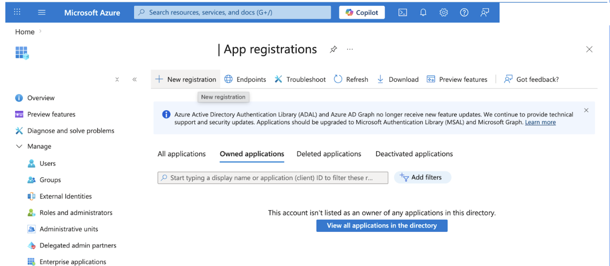
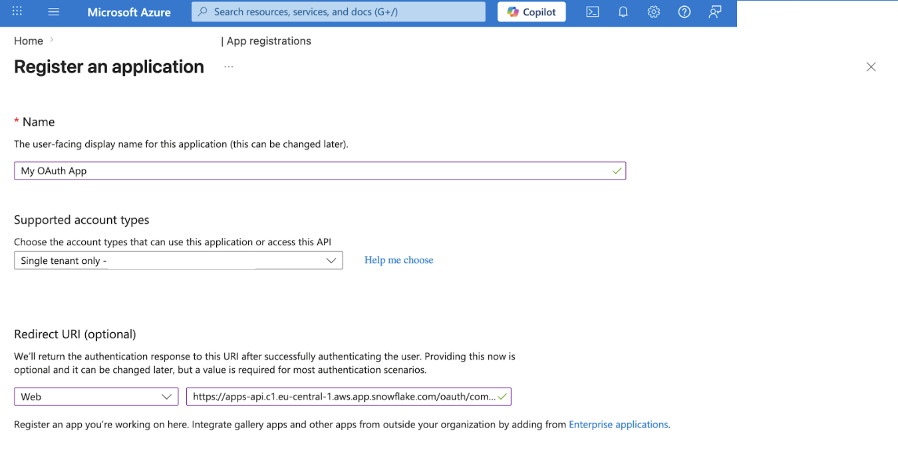
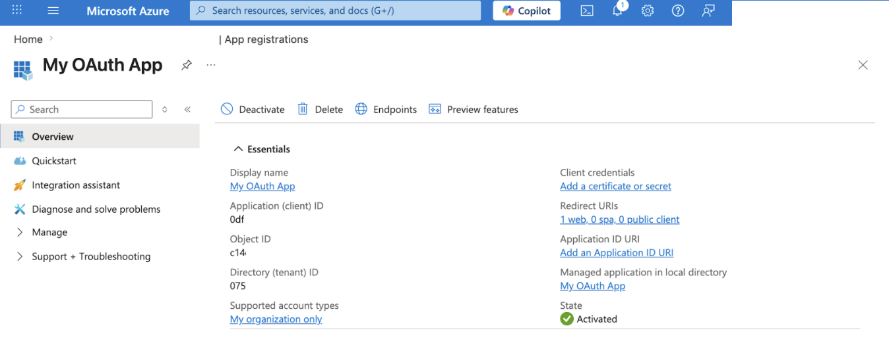
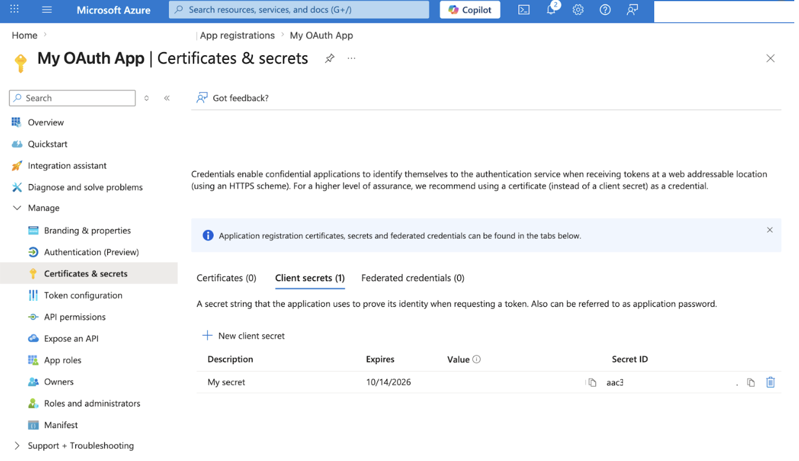
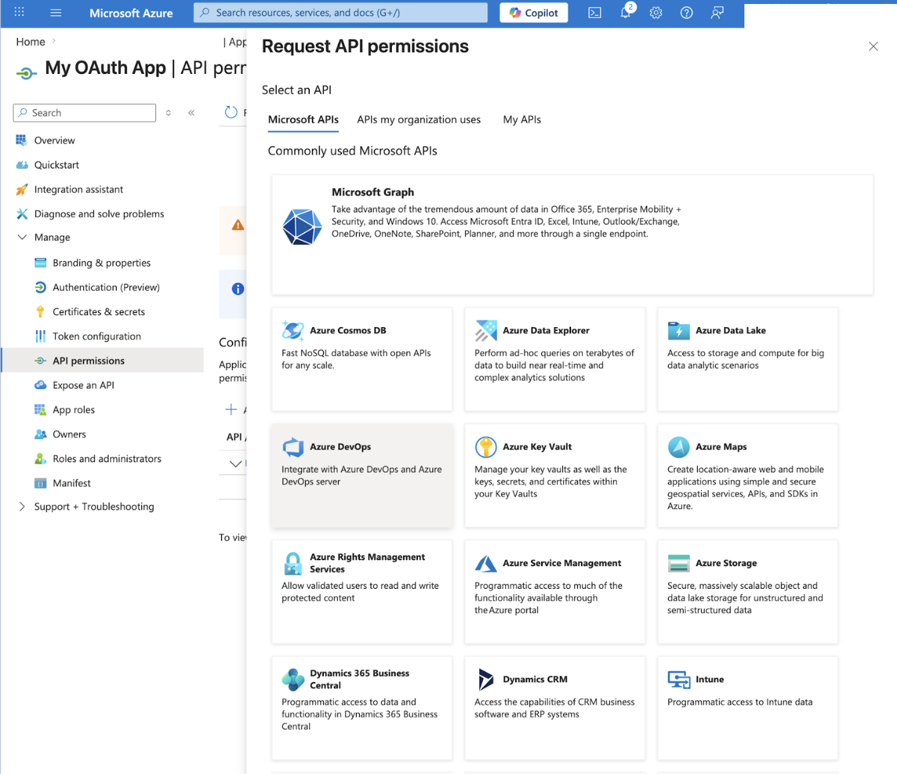
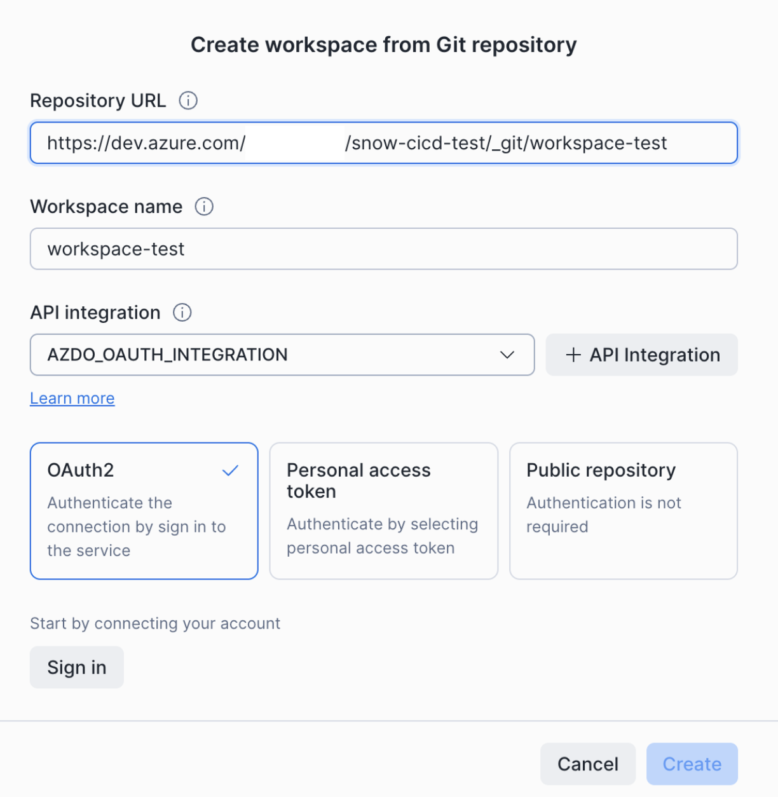
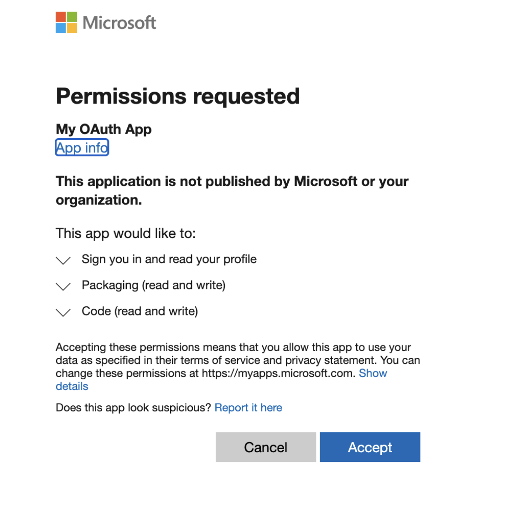
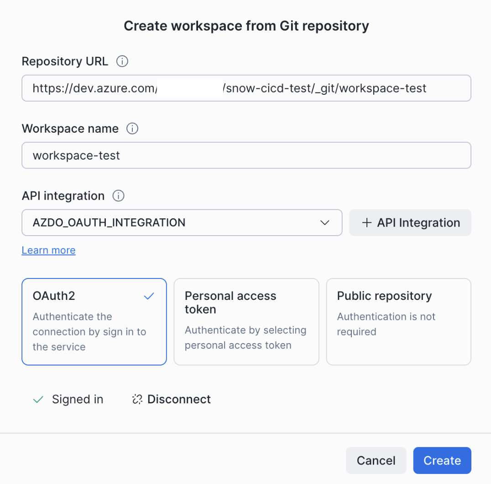

author: Jan Bilek
id: snowflake-git-oauth-azure-devops
summary: Set up OAuth2 authentication between Snowflake and Azure DevOps via Microsoft Entra ID so each user signs in with their own Microsoft account, no shared tokens.
categories: snowflake-site:taxonomy/solution-center/certification/quickstart, snowflake-site:taxonomy/product/platform
language: en
environments: web
status: Published
feedback link: https://github.com/Snowflake-Labs/sfguides/issues

# Connect Snowflake to Azure DevOps with OAuth2
<!-- ------------------------ -->
## Overview

Snowflake's Git integration lets you create workspaces backed by a Git repository so you can edit, commit, and push files directly from Snowsight. By default, the integration authenticates with a personal access token stored in a Snowflake secret. With **OAuth2**, each Snowflake user authenticates individually with Azure DevOps through a browser-based Microsoft Entra ID flow — no shared tokens, no secrets to rotate per user.

This guide walks through configuring OAuth2 between Snowflake and Azure DevOps and creating your first OAuth-backed Git workspace.

aside negative

Azure DevOps OAuth uses **Microsoft Entra ID** (formerly Azure Active Directory) endpoints — `login.microsoftonline.com` — and *not* the older `app.vssps.visualstudio.com` endpoints.

### Prerequisites
- A Snowflake account with the `ACCOUNTADMIN` role (or a role with the `CREATE INTEGRATION` privilege).
- An administrator (or a user permitted to register applications) in your Microsoft Entra ID tenant.
- An Azure DevOps organization and a repository you want to connect to Snowflake.

### What You'll Learn
- How to find the correct Snowflake redirect URI for your account region.
- How to register an Entra ID application for Azure DevOps.
- How to add the right Azure DevOps API permissions (`vso.code_write`, `vso.packaging_write`).
- How to create a Snowflake API integration that uses OAuth2 with Entra ID.
- How to create a Snowsight workspace from an Azure DevOps repository and sign in via OAuth.

### What You'll Need
- A [Snowflake account](https://signup.snowflake.com/?utm_source=snowflake-devrel&utm_medium=developer-guides&utm_cta=developer-guides) (a 30-day trial works).
- An [Azure portal](https://portal.azure.com) account with permission to register applications in Microsoft Entra ID.
- An [Azure DevOps](https://dev.azure.com) organization linked to that Entra tenant.

### What You'll Build
- A Microsoft Entra ID application registration with Azure DevOps API permissions.
- A Snowflake API integration that authenticates Snowflake users to Azure DevOps via OAuth2.
- A Snowsight workspace connected to an Azure DevOps repository over OAuth.

<!-- ------------------------ -->
## Determine your Snowflake redirect URI

Microsoft Entra ID requires a redirect URI when you register an application. This tells the provider where to send users after they authorize access.

Use the following format, based on the cloud region that hosts your Snowflake account:

```
https://apps-api.c1.<region>.<cloud>.app.snowflake.com/oauth/complete-secret
```

Examples:

| Cloud / Region | Redirect URI |
|---|---|
| AWS US West (Oregon) | `https://apps-api.c1.us-west-2.aws.app.snowflake.com/oauth/complete-secret` |
| AWS EU (Frankfurt) | `https://apps-api.c1.eu-central-1.aws.app.snowflake.com/oauth/complete-secret` |
| Azure East US 2 | `https://apps-api.c1.eastus2.azure.app.snowflake.com/oauth/complete-secret` |
| GCP US Central1 | `https://apps-api.c1.us-central1.gcp.app.snowflake.com/oauth/complete-secret` |

aside positive

To find your account's region and cloud platform, run `SELECT CURRENT_REGION();` in a Snowflake worksheet.

Keep this URI handy — you'll paste it into Microsoft Entra ID in the next step.

<!-- ------------------------ -->
## Register an OAuth application in Microsoft Entra ID

1. Sign in to the [Azure portal](https://portal.azure.com) and navigate to **Microsoft Entra ID** > **App registrations**.

   

2. Select **New registration** and fill in:
   - **Name**: A descriptive name, for example `Snowflake Git Integration`.
   - **Redirect URI**: Select **Web** and enter your Snowflake redirect URI from the previous step.

   

3. After registration, note the **Application (client) ID** and **Directory (tenant) ID** from the **Overview** page. You'll need both for the Snowflake API integration.

   

4. Go to **Certificates & secrets** > **New client secret**, create a secret, and copy its value immediately — it is only displayed once.

   

5. Go to **API permissions** > **Add a permission** > **Azure DevOps** and add the following **delegated** permissions:
   - `vso.code_write` — read and write access to source code.
   - `vso.packaging_write` — read and write access to packages.

   Select **Grant admin consent** if required by your organization.

   

<!-- ------------------------ -->
## Create an API integration in Snowflake

Run the following SQL, replacing the placeholder values with the **Application (client) ID**, **client secret**, and **tenant ID** from the previous step. Replace `my-org` in `API_ALLOWED_PREFIXES` with your Azure DevOps organization name.

```sql
CREATE OR REPLACE API INTEGRATION azdo_oauth_integration
  API_PROVIDER = git_https_api
  API_ALLOWED_PREFIXES = ('https://dev.azure.com/my-org')
  API_USER_AUTHENTICATION = (
    TYPE = OAUTH2
    OAUTH_AUTHORIZATION_ENDPOINT = 'https://login.microsoftonline.com/<tenant-id>/oauth2/v2.0/authorize'
    OAUTH_TOKEN_ENDPOINT = 'https://login.microsoftonline.com/<tenant-id>/oauth2/v2.0/token'
    OAUTH_CLIENT_ID = '<your-client-id>'
    OAUTH_CLIENT_SECRET = '<your-client-secret>'
    OAUTH_ACCESS_TOKEN_VALIDITY = 3600
    OAUTH_REFRESH_TOKEN_VALIDITY = 31536000
    OAUTH_ALLOWED_SCOPES = ('vso.code_write', 'vso.packaging_write')
    OAUTH_USERNAME = 'oauth2'
  )
  ENABLED = TRUE;
```

aside negative

Azure DevOps requires `OAUTH_USERNAME = 'oauth2'`. Without this, Git operations will fail with authentication errors.

aside positive

The two `<tenant-id>` placeholders in the authorization and token endpoints must both be replaced with your Entra **Directory (tenant) ID**.

<!-- ------------------------ -->
## Create a workspace from your Azure DevOps repository

1. In Snowsight, open the workspace selector and select **From Git repository**.

2. In the **Create workspace from Git repository** dialog:
   - **Repository URL**: The HTTPS URL of your Azure DevOps repository, for example `https://dev.azure.com/my-org/my-project/_git/my-repo`.
   - **Workspace name**: A name for the workspace.
   - **API integration**: The integration you created in the previous step.

3. Select the **OAuth2** card, then select **Sign in**.

   

4. Complete the Microsoft sign-in flow and consent to the requested Azure DevOps permissions.

   

5. After authorization, the dialog shows a green **Signed in** confirmation. Select **Create**.

   

You can now push, pull, and work with files in your Azure DevOps repository directly from the workspace.

<!-- ------------------------ -->
## Troubleshooting

### "Invalid redirect URI" error during authorization
Verify that the redirect URI registered in Microsoft Entra ID exactly matches the Snowflake redirect URI for your account's region (see [Determine your Snowflake redirect URI](#determine-your-snowflake-redirect-uri)).

### Authorization succeeds but Git operations fail
- Confirm that `OAUTH_USERNAME` is set to `oauth2` in your API integration.
- Check that `API_ALLOWED_PREFIXES` matches the repository URL you are connecting to (including organization and, if relevant, project segment).
- Confirm that the **`vso.code_write`** and **`vso.packaging_write`** delegated permissions are added in Entra and that admin consent has been granted if required.

### Wrong endpoints
Make sure you are using `login.microsoftonline.com/<tenant-id>/oauth2/v2.0/authorize` and `…/oauth2/v2.0/token` — *not* the older `app.vssps.visualstudio.com` endpoints.

### Client secret expired
Entra client secrets have a limited lifetime set when you create them. When a secret expires, create a new one in **Certificates & secrets** and recreate the Snowflake API integration with the updated `OAUTH_CLIENT_SECRET`.

### Outbound Private Link
OAuth authentication is not supported with outbound Private Link connections to Git providers. If your Snowflake account uses outbound Private Link, use token-based authentication instead.

<!-- ------------------------ -->
## Conclusion And Resources

You configured OAuth2 between Snowflake and Azure DevOps via Microsoft Entra ID, and your team can now sign in to Azure DevOps from Snowsight without sharing personal access tokens.

### What You Learned
- How to find your Snowflake redirect URI by region.
- How to register an Entra ID application and grant the right Azure DevOps API permissions.
- How to create a Snowflake API integration that uses OAuth2 with the correct `login.microsoftonline.com` endpoints.
- How to create a Snowsight workspace backed by an Azure DevOps repository over OAuth.

### Related Resources
- [Connect to a Git repository over a public network](https://docs.snowflake.com/en/developer-guide/git/git-setting-up-public)
- [`CREATE API INTEGRATION` SQL reference](https://docs.snowflake.com/en/sql-reference/sql/create-api-integration)
- [Microsoft Entra — Register an application](https://learn.microsoft.com/en-us/entra/identity-platform/quickstart-register-app)
- [Azure DevOps OAuth scopes](https://learn.microsoft.com/en-us/azure/devops/integrate/get-started/authentication/oauth)
- Companion guides: [GitLab](../snowflake-git-oauth-gitlab/snowflake-git-oauth-gitlab.md), [Bitbucket](../snowflake-git-oauth-bitbucket/snowflake-git-oauth-bitbucket.md)
