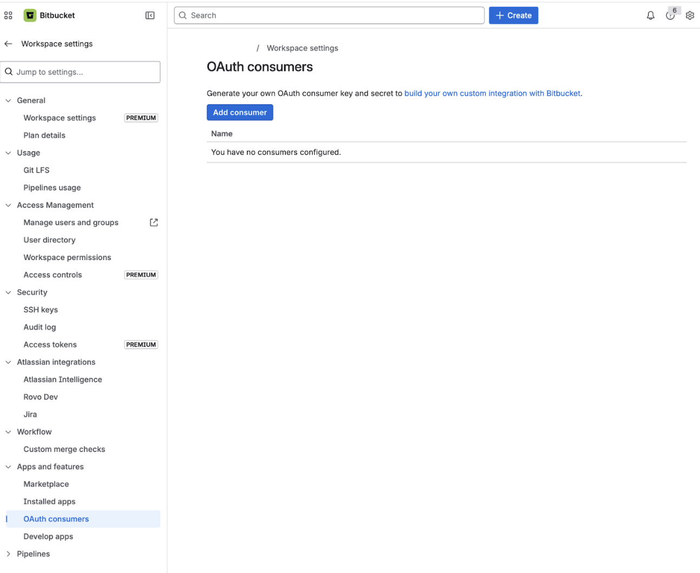
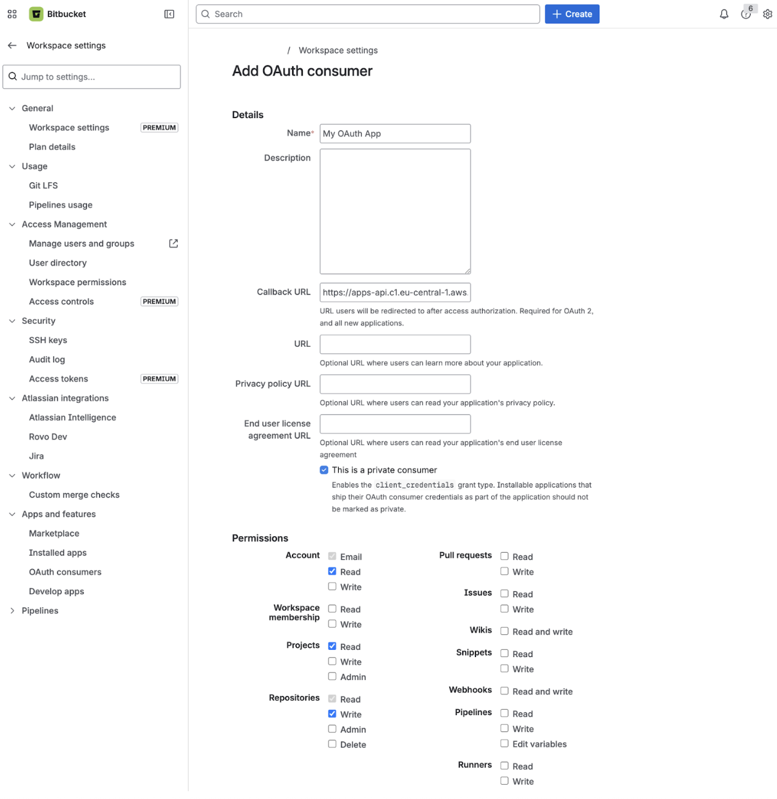
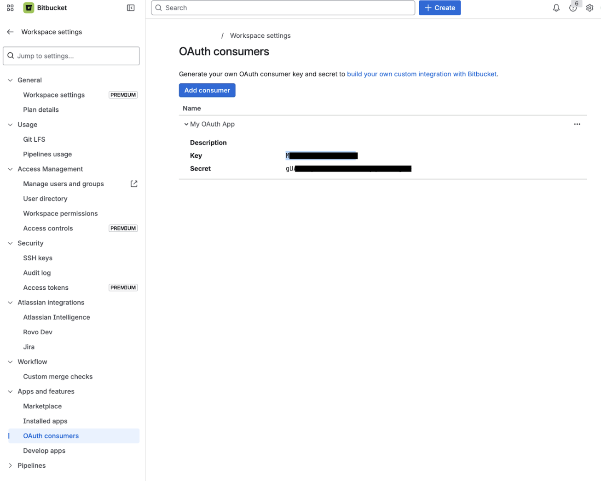
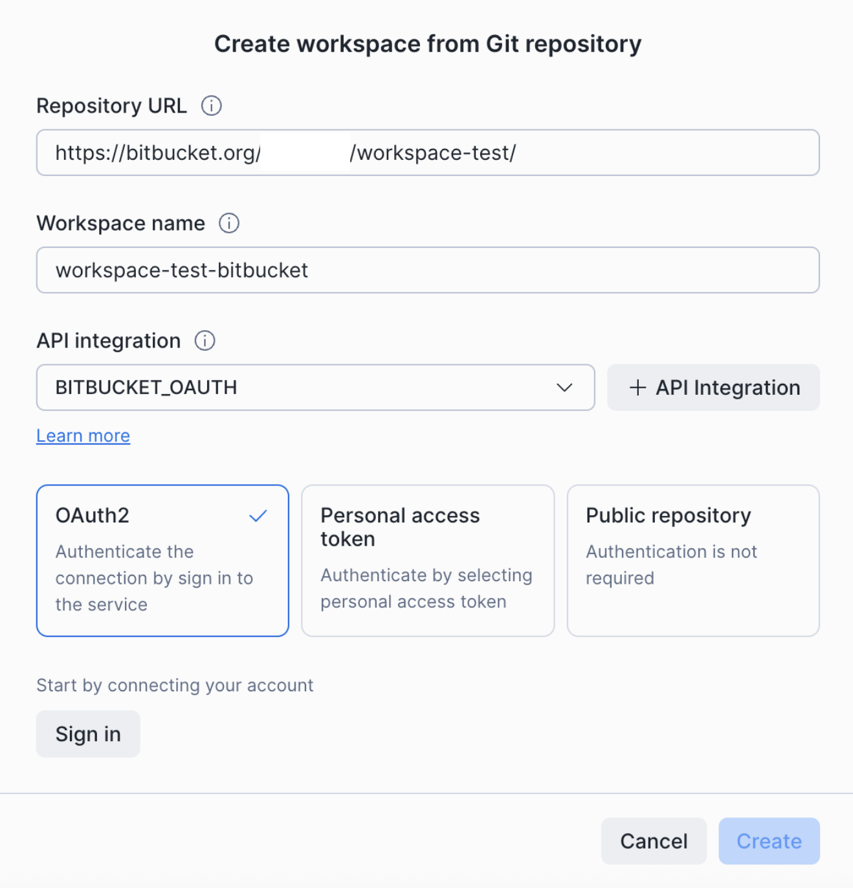
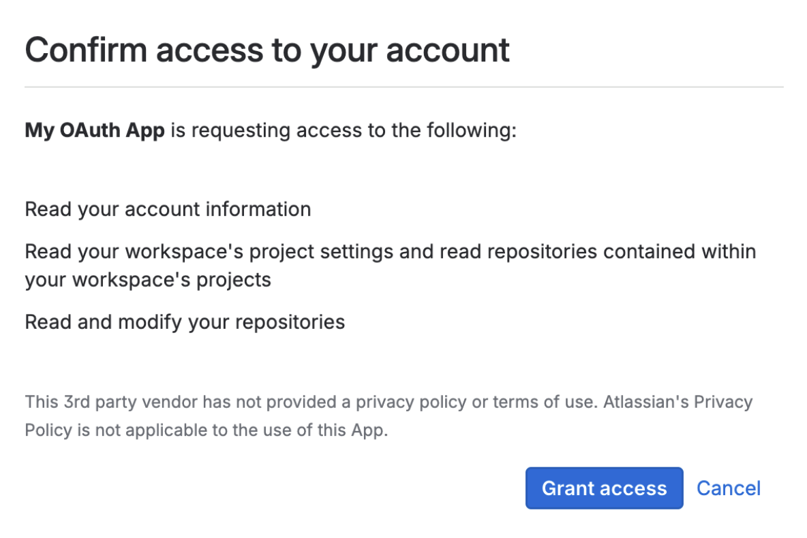
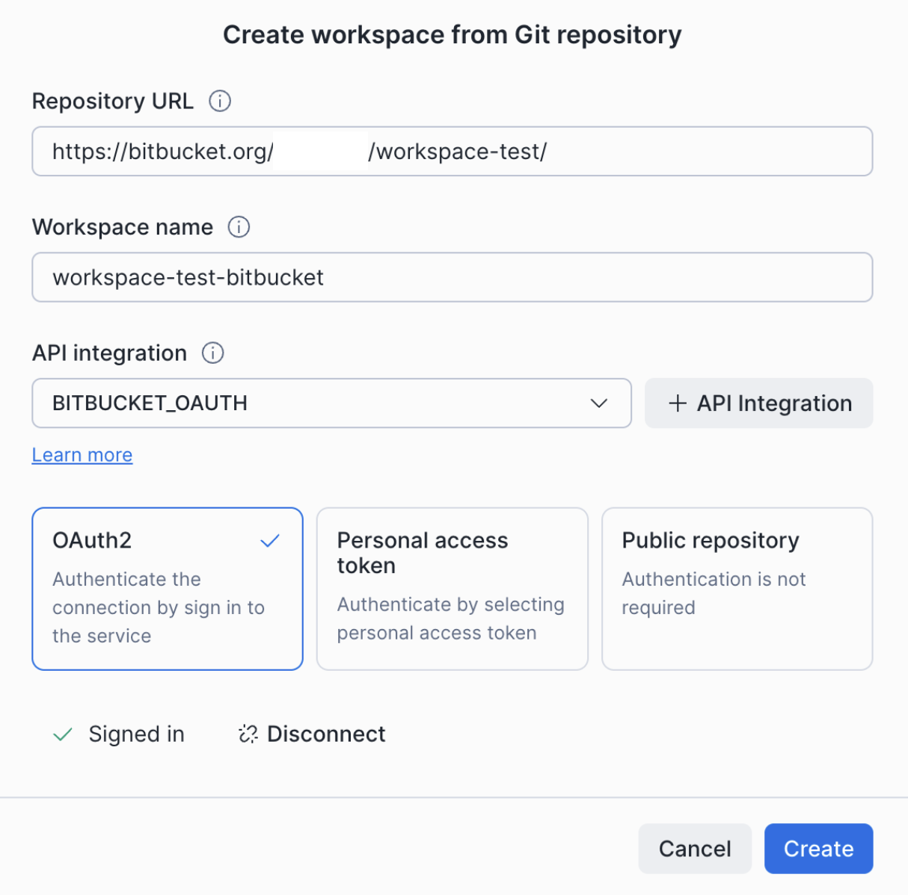

author: Jan Bilek
id: snowflake-git-oauth-bitbucket
summary: Set up OAuth2 authentication between Snowflake and Bitbucket Cloud so each user signs in with their own Bitbucket account, no shared tokens.
categories: snowflake-site:taxonomy/solution-center/certification/quickstart, snowflake-site:taxonomy/product/platform
language: en
environments: web
status: Published
feedback link: https://github.com/Snowflake-Labs/sfguides/issues

# Connect Snowflake to Bitbucket with OAuth2
<!-- ------------------------ -->
## Overview

Snowflake's Git integration lets you create workspaces backed by a Git repository so you can edit, commit, and push files directly from Snowsight. By default, the integration authenticates with a personal access token stored in a Snowflake secret. With **OAuth2**, each Snowflake user authenticates individually with Bitbucket through a browser-based flow — no shared tokens, no secrets to rotate per user.

This guide walks through configuring OAuth2 between Snowflake and Bitbucket Cloud and creating your first OAuth-backed Git workspace.

<aside class="negative">
Bitbucket requires a specific username (`x-token-auth`) on the Snowflake side. Skipping this is the most common cause of failed Git operations after a successful sign-in — the SQL block in this guide includes it.
</aside>

### Prerequisites
- A Snowflake account with the `ACCOUNTADMIN` role (or a role with the `CREATE INTEGRATION` privilege).
- A Bitbucket Cloud workspace where you can create OAuth consumers (workspace admin permission).
- A Bitbucket repository you want to connect to Snowflake.

### What You'll Learn
- How to find the correct Snowflake redirect URI for your account region.
- How to create an OAuth consumer in a Bitbucket workspace.
- How to create a Snowflake API integration that uses OAuth2.
- How to create a Snowsight workspace from a Bitbucket repository and sign in via OAuth.

### What You'll Need
- A [Snowflake account](https://signup.snowflake.com/?utm_source=snowflake-devrel&utm_medium=developer-guides&utm_cta=developer-guides) (a 30-day trial works).
- A [Bitbucket Cloud](https://bitbucket.org) workspace with admin permissions.

### What You'll Build
- A Bitbucket OAuth consumer with repository read/write permissions.
- A Snowflake API integration that authenticates Snowflake users to Bitbucket via OAuth2.
- A Snowsight workspace connected to a Bitbucket repository over OAuth.

<!-- ------------------------ -->
## Determine your Snowflake redirect URI

Bitbucket requires a callback URL when you create an OAuth consumer. This tells Bitbucket where to send users after they authorize access.

Use the following format, based on the cloud region that hosts your Snowflake account:

```
https://apps-api.c1.<region>.<cloud>.app.snowflake.com/oauth/complete-secret
```

Examples:

| Cloud / Region | Redirect URI |
|---|---|
| AWS US West (Oregon) | `https://apps-api.c1.us-west-2.aws.app.snowflake.com/oauth/complete-secret` |
| AWS EU (Frankfurt) | `https://apps-api.c1.eu-central-1.aws.app.snowflake.com/oauth/complete-secret` |
| Azure East US 2 | `https://apps-api.c1.eastus2.azure.app.snowflake.com/oauth/complete-secret` |
| GCP US Central1 | `https://apps-api.c1.us-central1.gcp.app.snowflake.com/oauth/complete-secret` |

<aside class="positive">
To find your account's region and cloud platform, run `SELECT CURRENT_REGION();` in a Snowflake worksheet.
</aside>

Keep this URI handy — you'll paste it into Bitbucket in the next step.

<!-- ------------------------ -->
## Create an OAuth consumer in Bitbucket

1. Sign in to [Bitbucket Cloud](https://bitbucket.org) and navigate to your workspace's **Settings**.
2. Under **Apps and features**, select **OAuth consumers**, then select **Add consumer**.

   

3. Fill in the fields:
   - **Name**: A descriptive name, for example `Snowflake Git Integration`.
   - **Callback URL**: The Snowflake redirect URI from the previous step.
   - **Permissions**: Under **Repositories**, select **Write** (which includes read access).

   

4. Select **Save**.
5. Note the **Key** (client ID) and **Secret** (client secret) displayed for the new consumer.

   

<!-- ------------------------ -->
## Create an API integration in Snowflake

Run the following SQL, replacing the placeholder values with the **Key** and **Secret** from the previous step. Replace `my-org` in `API_ALLOWED_PREFIXES` with your Bitbucket workspace name.

```sql
CREATE OR REPLACE API INTEGRATION bitbucket_oauth_integration
  API_PROVIDER = git_https_api
  API_ALLOWED_PREFIXES = ('https://bitbucket.org/my-org')
  API_USER_AUTHENTICATION = (
    TYPE = OAUTH2
    OAUTH_AUTHORIZATION_ENDPOINT = 'https://bitbucket.org/site/oauth2/authorize'
    OAUTH_TOKEN_ENDPOINT = 'https://bitbucket.org/site/oauth2/access_token'
    OAUTH_CLIENT_ID = '<your-consumer-key>'
    OAUTH_CLIENT_SECRET = '<your-consumer-secret>'
    OAUTH_ACCESS_TOKEN_VALIDITY = 7200
    OAUTH_REFRESH_TOKEN_VALIDITY = 31536000
    OAUTH_ALLOWED_SCOPES = ('repository:write')
    OAUTH_USERNAME = 'x-token-auth'
  )
  ENABLED = TRUE;
```

<aside class="negative">
Bitbucket requires `OAUTH_USERNAME = 'x-token-auth'`. Without this, Git operations will fail with authentication errors after a successful sign-in.
</aside>

<!-- ------------------------ -->
## Create a workspace from your Bitbucket repository

1. In Snowsight, open the workspace selector and select **From Git repository**.

2. In the **Create workspace from Git repository** dialog:
   - **Repository URL**: The HTTPS URL of your Bitbucket repository, for example `https://bitbucket.org/my-org/my-repo/`.
   - **Workspace name**: A name for the workspace.
   - **API integration**: The integration you created in the previous step.

3. Select the **OAuth2** card, then select **Sign in**.

   

4. Complete the Bitbucket authorization flow and grant the requested permissions.

   

5. After authorization, the dialog shows a green **Signed in** confirmation. Select **Create**.

   

You can now push, pull, and work with files in your Bitbucket repository directly from the workspace.

<!-- ------------------------ -->
## Troubleshooting

### "Invalid redirect URI" error during authorization
Verify that the callback URL on the Bitbucket consumer exactly matches the Snowflake redirect URI for your account's region (see [Determine your Snowflake redirect URI](#determine-your-snowflake-redirect-uri)).

### Authorization succeeds but Git operations fail
- Confirm that `OAUTH_USERNAME` is set to `x-token-auth` in your API integration. This is the most common cause.
- Check that `API_ALLOWED_PREFIXES` matches the repository URL you are connecting to (including the workspace segment).
- Confirm the consumer has **Repositories: Write** permission.

### Client secret expired or rotated
If you regenerate the consumer secret in Bitbucket, recreate the Snowflake API integration with the updated `OAUTH_CLIENT_SECRET`.

### Outbound Private Link
OAuth authentication is not supported with outbound Private Link connections to Git providers. If your Snowflake account uses outbound Private Link, use token-based authentication instead.

<!-- ------------------------ -->
## Conclusion And Resources

You configured OAuth2 between Snowflake and Bitbucket, and your team can now sign in to Bitbucket from Snowsight without sharing personal access tokens.

### What You Learned
- How to find your Snowflake redirect URI by region.
- How to create a Bitbucket OAuth consumer with the right permissions.
- How to create a Snowflake API integration that uses OAuth2 with the required `x-token-auth` username.
- How to create a Snowsight workspace backed by a Bitbucket repository over OAuth.

### Related Resources
- [Connect to a Git repository over a public network](https://docs.snowflake.com/en/developer-guide/git/git-setting-up-public)
- [`CREATE API INTEGRATION` SQL reference](https://docs.snowflake.com/en/sql-reference/sql/create-api-integration)
- [Bitbucket Cloud — OAuth on Bitbucket Cloud](https://support.atlassian.com/bitbucket-cloud/docs/use-oauth-on-bitbucket-cloud/)
- Companion guides: [GitLab](../snowflake-git-oauth-gitlab/snowflake-git-oauth-gitlab.md), [Azure DevOps](../snowflake-git-oauth-azure-devops/snowflake-git-oauth-azure-devops.md)
