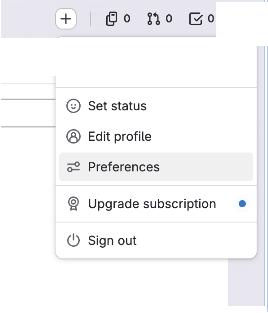
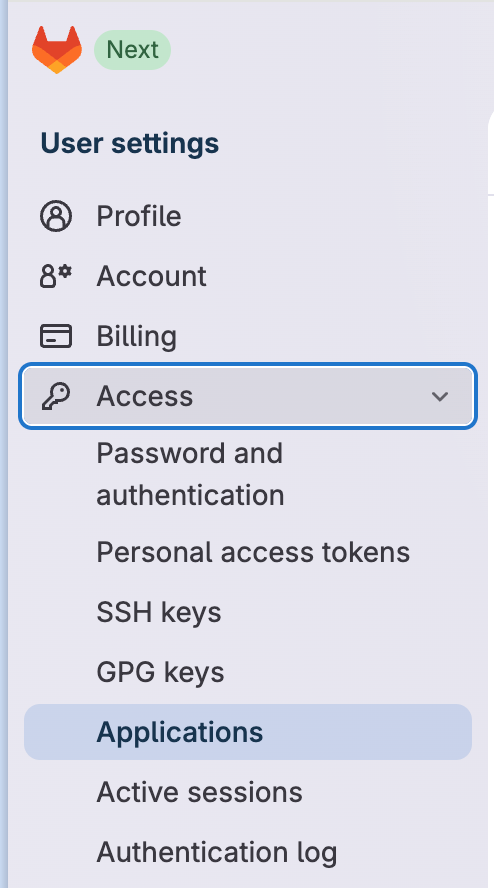
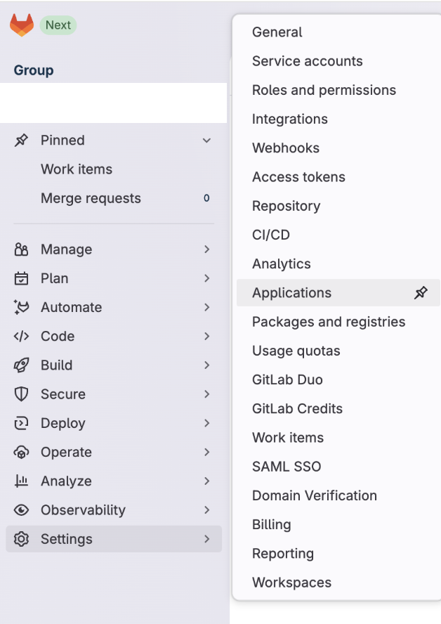
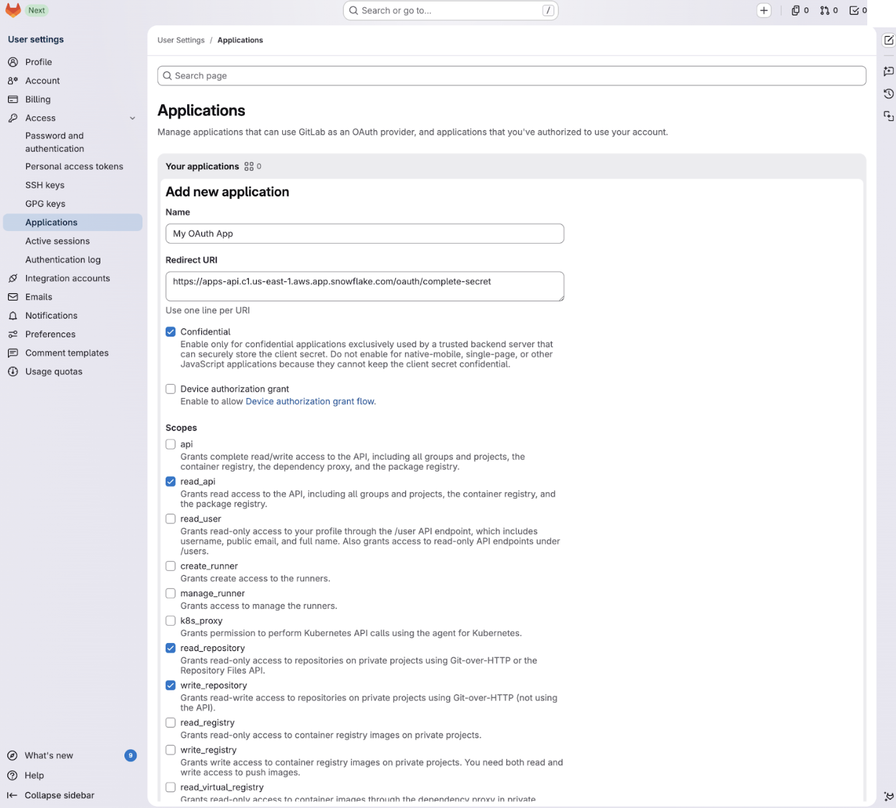
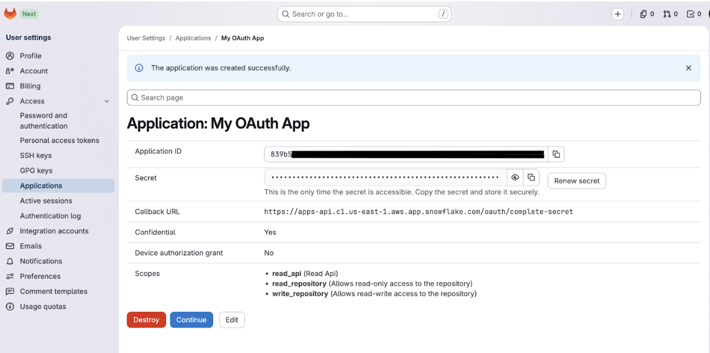
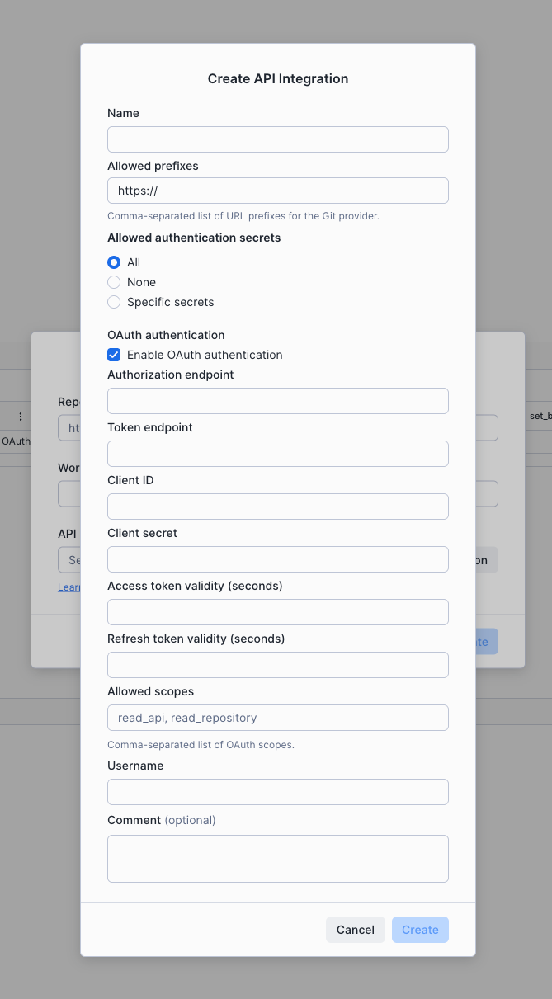
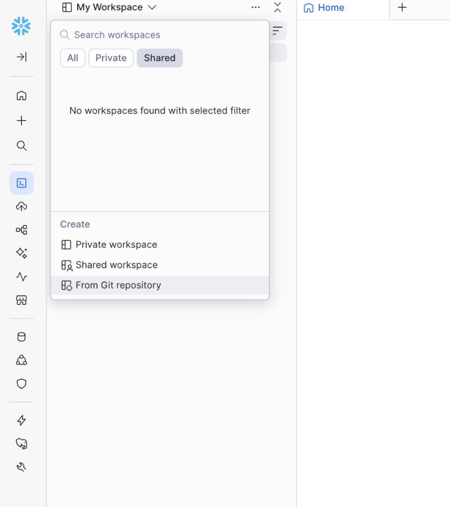
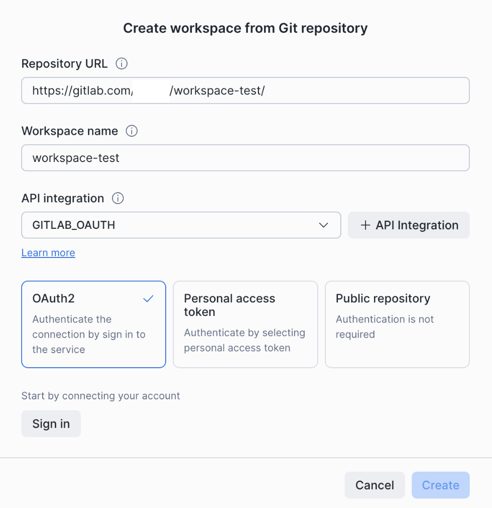
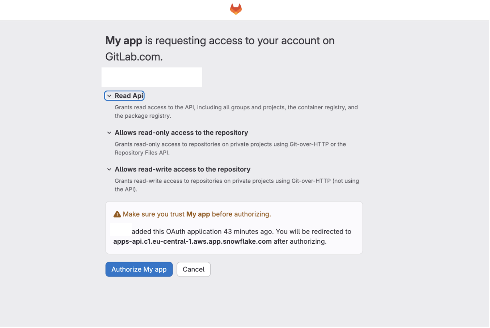
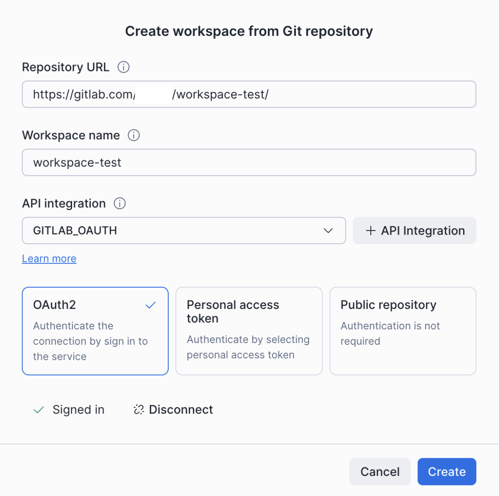

author: Jan Bilek
id: snowflake-git-oauth-gitlab
summary: Set up OAuth2 authentication between Snowflake and GitLab so each user signs in with their own GitLab account, no shared tokens.
categories: snowflake-site:taxonomy/solution-center/certification/quickstart, snowflake-site:taxonomy/product/platform
language: en
environments: web
status: Published
feedback link: https://github.com/Snowflake-Labs/sfguides/issues

# Connect Snowflake to GitLab with OAuth2
<!-- ------------------------ -->
## Overview

Snowflake's Git integration lets you create workspaces backed by a Git repository so you can edit, commit, and push files directly from Snowsight. By default, the integration authenticates with a personal access token stored in a Snowflake secret. With **OAuth2**, each Snowflake user authenticates individually with GitLab through a browser-based flow — no shared tokens, no secrets to rotate per user.

This guide walks through configuring OAuth2 between Snowflake and GitLab and creating your first OAuth-backed Git workspace.

<aside class="negative">
For **GitHub**, prefer the [Snowflake GitHub App](https://docs.snowflake.com/en/developer-guide/git/git-setting-up-public) — it is simpler than registering an OAuth application yourself.
</aside>

### Prerequisites
- A Snowflake account with the `ACCOUNTADMIN` role (or a role with the `CREATE INTEGRATION` privilege).
- An administrator account on GitLab (or a user permitted to create applications in your GitLab group).
- A GitLab repository you want to connect to Snowflake.

### What You'll Learn
- How to find the correct Snowflake redirect URI for your account region.
- How to register an OAuth application in GitLab.
- How to create a Snowflake API integration that uses OAuth2.
- How to create a Snowsight workspace from a GitLab repository and sign in via OAuth.

### What You'll Need
- A [Snowflake account](https://signup.snowflake.com/?utm_source=snowflake-devrel&utm_medium=developer-guides&utm_cta=developer-guides) (a 30-day trial works).
- A [GitLab](https://gitlab.com/) account with permission to create applications.

### What You'll Build
- A Snowflake API integration that authenticates Snowflake users to GitLab via OAuth2.
- A Snowsight workspace connected to a GitLab repository over OAuth.

<!-- ------------------------ -->
## Determine your Snowflake redirect URI

Every Git provider requires a redirect URI (sometimes called a callback URL) when you register an OAuth application. This tells the provider where to send users after they authorize access.

Use the following format, based on the cloud region that hosts your Snowflake account:

```
https://apps-api.c1.<region>.<cloud>.app.snowflake.com/oauth/complete-secret
```

Examples:

| Cloud / Region | Redirect URI |
|---|---|
| AWS US West (Oregon) | `https://apps-api.c1.us-west-2.aws.app.snowflake.com/oauth/complete-secret` |
| AWS EU (Frankfurt) | `https://apps-api.c1.eu-central-1.aws.app.snowflake.com/oauth/complete-secret` |
| Azure East US 2 | `https://apps-api.c1.eastus2.azure.app.snowflake.com/oauth/complete-secret` |
| GCP US Central1 | `https://apps-api.c1.us-central1.gcp.app.snowflake.com/oauth/complete-secret` |

<aside class="positive">
To find your account's region and cloud platform, run `SELECT CURRENT_REGION();` in a Snowflake worksheet.
</aside>

Keep this URI handy — you'll paste it into GitLab in the next step.

<!-- ------------------------ -->
## Register an OAuth application in GitLab

1. Sign in to GitLab as an administrator or a user with permission to create applications.
2. Go to **User Settings** > **Preferences**, expand the **Access** section, and select **Applications**.

   

   

<aside class="positive">
If you want the OAuth application to be available to all users in your GitLab group (rather than tied to your personal account), navigate to your group's **Settings** > **Applications** instead.
</aside>



3. Select **Add new application** and fill in the fields:
   - **Name**: A descriptive name, for example `Snowflake Git Integration`.
   - **Redirect URI**: The Snowflake redirect URI from the previous step.
   - **Confidential**: Select this checkbox. Snowflake stores the client secret securely server-side.
   - **Scopes**: Select the following:
     - `read_api` — read access to the API
     - `read_repository` — read-only access to repositories
     - `write_repository` — read-write access to repositories

   

4. Select **Save application**.
5. Copy the **Application ID** and **Secret**. Store them securely — the secret is only displayed once.

   

<aside class="negative">
If you lose the secret, you must select **Renew secret** to generate a new one and update the Snowflake API integration accordingly.
</aside>

<!-- ------------------------ -->
## Create an API integration in Snowflake

You can create the API integration with SQL or through the Snowsight UI.

### Option A: SQL

Run the following, replacing the placeholder values with the Application ID, Secret, and GitLab URL prefix from the previous step:

```sql
CREATE OR REPLACE API INTEGRATION gitlab_oauth_integration
  API_PROVIDER = git_https_api
  API_ALLOWED_PREFIXES = ('https://gitlab.com/my-org')
  API_USER_AUTHENTICATION = (
    TYPE = OAUTH2
    OAUTH_AUTHORIZATION_ENDPOINT = 'https://gitlab.com/oauth/authorize'
    OAUTH_TOKEN_ENDPOINT = 'https://gitlab.com/oauth/token'
    OAUTH_CLIENT_ID = '<your-application-id>'
    OAUTH_CLIENT_SECRET = '<your-secret>'
    OAUTH_ACCESS_TOKEN_VALIDITY = 28800
    OAUTH_REFRESH_TOKEN_VALIDITY = 15552000
    OAUTH_ALLOWED_SCOPES = ('read_api', 'read_repository', 'write_repository')
  )
  ENABLED = TRUE;
```

<aside class="positive">
For self-managed GitLab instances, replace `gitlab.com` in `API_ALLOWED_PREFIXES`, `OAUTH_AUTHORIZATION_ENDPOINT`, and `OAUTH_TOKEN_ENDPOINT` with your instance's domain.
</aside>

### Option B: Snowsight UI

When creating a workspace from a Git repository (next step), select **+ API Integration** next to the API Integration dropdown. The **Create API Integration** dialog appears.



Fill in the fields:

- **Name**: For example `GITLAB_OAUTH`.
- **Allowed prefixes**: Your GitLab URL prefix, for example `https://gitlab.com/my-org`.
- **OAuth authentication**: Select **Enable OAuth authentication**.
- **Authorization endpoint**: `https://gitlab.com/oauth/authorize`
- **Token endpoint**: `https://gitlab.com/oauth/token`
- **Client ID**: Paste the **Application ID** from GitLab.
- **Client secret**: Paste the **Secret** from GitLab.
- **Access token validity (seconds)**: `28800`
- **Refresh token validity (seconds)**: `15552000`
- **Allowed scopes**: `read_api`, `read_repository`, `write_repository`

Select **Create**.

<!-- ------------------------ -->
## Create a workspace from your GitLab repository

1. In Snowsight, open the workspace selector and select **From Git repository**.

   

2. In the **Create workspace from Git repository** dialog:
   - **Repository URL**: The HTTPS URL of your GitLab repository, for example `https://gitlab.com/my-org/my-repo/`.
   - **Workspace name**: A name for the workspace.
   - **API integration**: The integration you created in the previous step.

3. Select the **OAuth2** card, then select **Sign in**.

   

4. In the browser window that opens, GitLab asks you to authorize the application. Review the requested scopes and select **Authorize**.

   

5. After authorization, you are returned to Snowsight. The dialog shows a green **Signed in** confirmation.

   

6. Select **Create**.

You can now push, pull, and work with files in your GitLab repository directly from the workspace.

<!-- ------------------------ -->
## Troubleshooting

### "Invalid redirect URI" error during authorization
Verify that the redirect URI registered with GitLab exactly matches the Snowflake redirect URI for your account's region (see [Determine your Snowflake redirect URI](#determine-your-snowflake-redirect-uri)).

### Authorization succeeds but Git operations fail
Check that `API_ALLOWED_PREFIXES` in your API integration matches the repository URL you are connecting to.

### Client secret expired
OAuth client secrets have a limited lifetime set by GitLab. When a secret expires, generate a new one in GitLab and recreate the API integration with the updated `OAUTH_CLIENT_SECRET`.

### Outbound Private Link
OAuth authentication is not supported with outbound Private Link connections to Git providers. If your Snowflake account uses outbound Private Link, use token-based authentication instead.

<!-- ------------------------ -->
## Conclusion And Resources

You configured OAuth2 between Snowflake and GitLab, and your team can now sign in to GitLab from Snowsight without sharing personal access tokens.

### What You Learned
- How to find your Snowflake redirect URI by region.
- How to register a confidential OAuth application in GitLab with the right scopes.
- How to create a Snowflake API integration that uses OAuth2.
- How to create a Snowsight workspace backed by a GitLab repository over OAuth.

### Related Resources
- [Connect to a Git repository over a public network](https://docs.snowflake.com/en/developer-guide/git/git-setting-up-public)
- [`CREATE API INTEGRATION` SQL reference](https://docs.snowflake.com/en/sql-reference/sql/create-api-integration)
- [GitLab — Configure GitLab as an OAuth 2.0 authentication identity provider](https://docs.gitlab.com/ee/integration/oauth_provider.html)
- Companion guides: [Azure DevOps](../snowflake-git-oauth-azure-devops/snowflake-git-oauth-azure-devops.md), [Bitbucket](../snowflake-git-oauth-bitbucket/snowflake-git-oauth-bitbucket.md)
