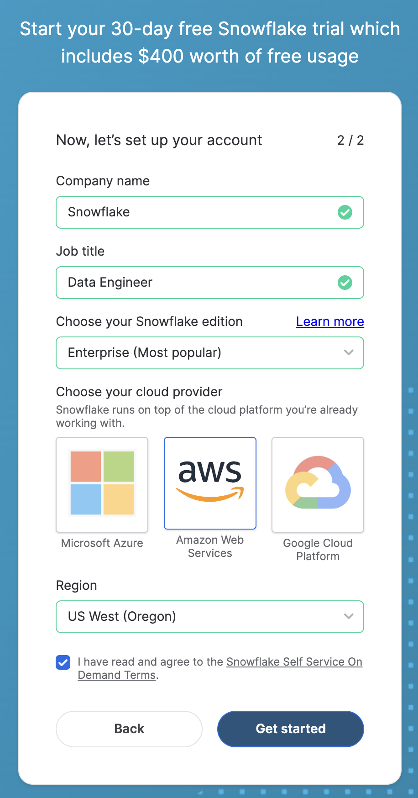
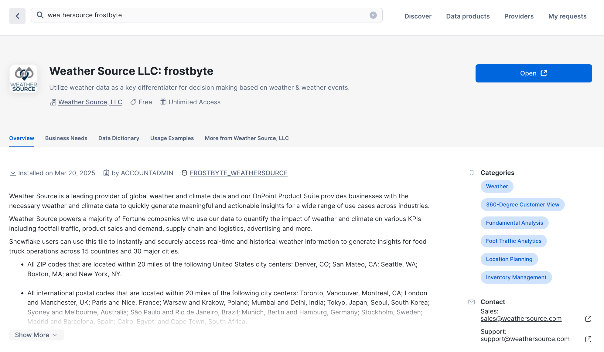
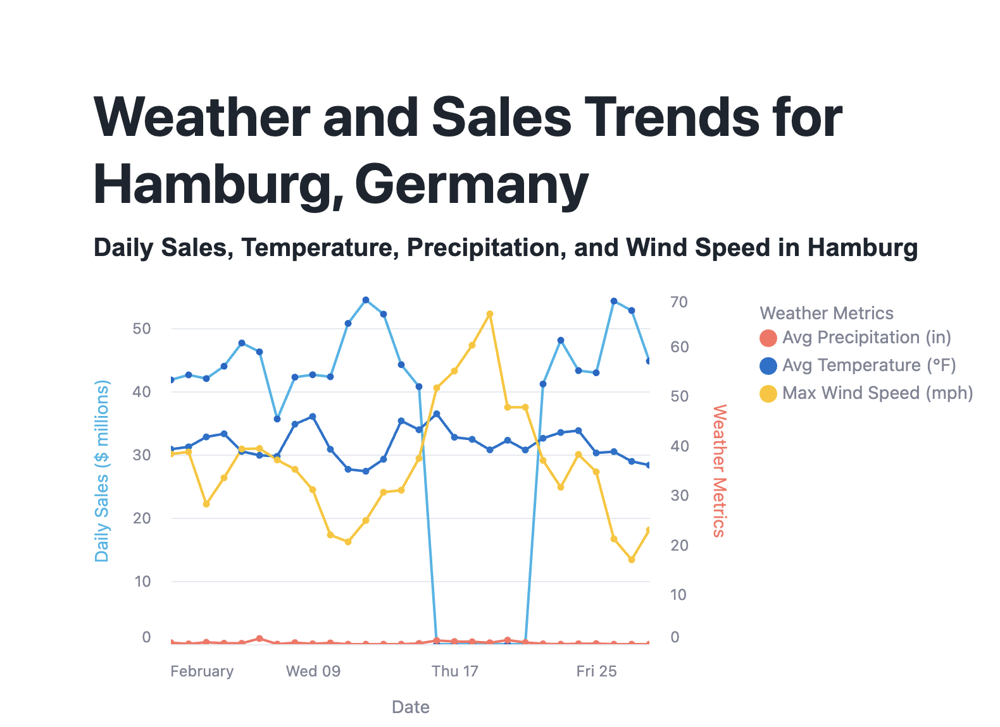

author: Sho Tanaka, Gilberto Hernandez, Rida Safdar
id: snowflake-northstar-data-engineering-ja
categories: snowflake-site:taxonomy/solution-center/certification/quickstart, snowflake-site:taxonomy/product/data-engineering
language: ja
summary: Snowflakeで I-T-D フレームワークを使ってエンドツーエンドのデータパイプラインを構築します。
environments: web
status: Published 
feedback link: https://github.com/Snowflake-Labs/sfguides/issues


# はじめての Data Engineering with Snowflake
<!-- ------------------------ -->
## 概要

### はじめに

このクイックスタートでは、Snowflakeを使ったデータエンジニアリングに焦点を当てます。具体的には、Snowflakeでエンドツーエンドのデータパイプラインを構築します。パイプラインの構築には、**取り込み（Ingestion）・変換（Transformation）・配信（Delivery）** フレームワーク（**I-T-D**）を適用します。

**取り込み（Ingestion）**

以下のソースからデータを読み込みます：

* Snowflake Marketplace
* AWS S3

**変換（Transformation）**

以下を使ってデータを変換します：

* SQL
* Views
* ユーザー定義関数 (UDFs)

**配信（Delivery）**

以下を使って最終的なデータプロダクトを配信します：

* Streamlit in Snowflake


### 前提条件
- SQLの基本的な知識

### 学習内容
- Snowflakeによるデータエンジニアリング
- データパイプラインのための I-T-D（取り込み・変換・配信）フレームワーク
- Snowflake Marketplaceからのデータ共有
- AWS S3 ブロブストレージからのデータ読み込み方法
- SQL、Python、ビュー、UDF、ストアドプロシージャを使ったデータ変換の方法
- Streamlit in Snowflakeを使った最終データプロダクトの配信方法

### 必要なもの
- Snowflakeの無料トライアルアカウント: [https://signup.snowflake.com/](https://signup.snowflake.com/?utm_source=snowflake-devrel&utm_medium=developer-guides&trial=student&cloud=aws&region=us-west-2&utm_campaign=introtosnowflake&utm_cta=developer-guides)
- このラボを完了するためのコードが含まれるGitHubリポジトリ: [sfguide-snowflake-northstar-data-engineering](https://github.com/Snowflake-Labs/sfguide-snowflake-northstar-data-engineering)

### 構築するもの
- Snowflakeにおけるエンドツーエンドのデータパイプライン

<!-- ------------------------ -->
## Snowflake トライアルアカウント

このラボを完了するには、Snowflakeアカウントが必要です。無料のSnowflakeトライアルアカウントで問題ありません。開設するには：

1. [https://signup.snowflake.com/](https://signup.snowflake.com/?utm_source=snowflake-devrel&utm_medium=developer-guides&trial=student&cloud=aws&region=us-west-2&utm_campaign=introtosnowflake&utm_cta=developer-guides) にアクセスします。

2. ページ上のフォームの最初のページを入力して、アカウント作成を開始します。

3. フォームの次のセクションで、Snowflakeのエディションを「Enterprise (Most popular)」に設定してください。

4. クラウドプロバイダーとして「AWS – Amazon Web Services」を選択します。

5. リージョンとして「US West (Oregon)」を選択します。

6. フォームの残りを入力し、「Get started」をクリックします。



<!-- ------------------------ -->
## 構築するパイプラインの概要

Tasty Bytesは、世界中の多くの国で事業を展開するフードトラック企業です。あなたはTasty Bytesチームのデータエンジニアで、チームのデータアナリストから最近以下のことを知りました：

* ドイツ・ハンブルク市での売上が、2月の数日間にわたって$0に落ち込んだ

データエンジニアとしてのあなたの目標は、なぜこのようなことが起きたのかを解明し、アナリストにハンブルクの天候情報を常に提供できるエンドツーエンドのデータパイプラインを構築することです。

以下のように進めます：

**取り込み（Ingestion）**

* Snowflake Marketplaceからリアルタイムの天候データを読み込む

* AWS S3バケットからTasty Bytesの売上データを読み込む

**変換（Transformation）**

* SQLを使って変換を実行する

* データ分析に使えるビューを作成する

* 天候関連の計算を行うユーザー定義関数（UDF）を作成し、ビューをより多くのデータで充実させる

**配信（Delivery）**

* Streamlit in Snowflakeを使って、ドイツ・ハンブルクの天候の最終的なインサイトとグラフを配信する（Pythonでアプリケーションを記述）

それでは始めましょう！

<!-- ------------------------ -->
## Snowflake Marketplaceからの天候データ

まず、生の天候データをSnowflakeに「読み込み」ましょう。実は「読み込み」という表現は正確ではありません。

ここではSnowflake Marketplaceにおける、Snowflake独自のデータ共有機能を使用します。この機能のおかげで、実際にはデータをSnowflakeアカウントにコピーするためのロジックを書く必要がありません。代わりに、Snowflake Marketplaceで信頼できるプロバイダーが共有している天候データに直接アクセスできます。さっそくやってみましょう。

1. Snowflakeアカウントにログインします。

2. 「Data Products」をクリックします。

3. 「Marketplace」をクリックします。

4. 検索バーで「weathersource frostbyte」を検索します。

5. 最初の検索結果は、「Weather Source, LLC」プロバイダーによる「Weather Source LLC: frostbyte」であるはずです。そのリスティングをクリックします。

6. 右側の「Get」をクリックします。

7. 表示されるモーダルで、もう一度「Get」をクリックします。データセットの名前は変更**しないでください**。

これでデータが使えるようになります！アカウントにデータを取り込むための取り込みロジックを書く必要はありません。データはプロバイダーによって管理・更新されます。



<!-- ------------------------ -->
## AWS S3からの売上データの読み込み

次に、Tasty Bytesの売上データを読み込みましょう。このデータは現在、AWS S3バケット内の複数のCSVファイルに格納されています。SnowflakeのCOPY INTOコマンドを使って、データをSnowflakeアカウントに読み込みます。

1. まず、新しいSQLワークシートを作成します。

2. コンテキストを設定します。ロールを**ACCOUNTADMIN**に、コンピュートリソース（仮想ウェアハウス）を**COMPUTE_WH**に設定します。

3. 次に、読み込むデータを格納するデータベースとスキーマを作成します。ワークシートに以下を入力します：

```sql
CREATE OR REPLACE DATABASE tasty_bytes;
CREATE OR REPLACE SCHEMA raw_pos;
```

4. これら2つのステートメントをハイライトし、SQLワークシートの右上にあるRunボタンをクリックして実行します。

5. 次に、**sfguide-snowflake-northstar-data-engineering** リポジトリの **00_ingestion** フォルダにある [**copy_into.sql**](https://github.com/Snowflake-Labs/sfguide-snowflake-northstar-data-engineering/blob/main/00_ingestion/copy_into.sql) ファイルの内容をコピーします。

6. Snowflakeに戻り、開いているSQLワークシートに移動します。先ほど書いた2行のSQLの下に、コピーしたコードを貼り付けます。

7. まず、データをSnowflakeに読み込むために必要なファイルフォーマットを作成します。「Create a CSV file format here:」コメントの下に以下を入力します：

```sql
CREATE OR REPLACE FILE FORMAT tasty_bytes.public.csv_ff
type = 'csv';
```

このコマンドを実行します。

8. 次のSQLブロックでは、`-- Specify the file format below:` というコメントがあり、CSVファイルを含むS3バケットを指すSnowflakeステージを作成します。読み込みプロセスに必要なファイルフォーマット引数が不足しています。`url` パラメータの下に以下を入力します：

```sql
file_format = tasty_bytes.public.csv_ff;
```

このコマンド全体を実行します。

9. 次のSQLブロックは、**tasty_bytes.raw_pos** スキーマに **COUNTRY** というテーブルを作成します。このSQLブロックを実行してテーブルを作成します。左側のオブジェクトピッカーを使ってテーブルの作成を確認します。

10. すべてをまとめましょう！テーブルを作成したら、強力な **COPY INTO** コマンドを使ってこのテーブルにデータを読み込みます。ワークシートの一番下、「Use the COPY INTO command...」コメントの下に以下を入力します：

```sql
COPY INTO tasty_bytes.raw_pos.country
FROM @tasty_bytes.public.s3load/raw_pos/country/;
```

このコマンドを実行します。コンソールに成功メッセージが表示されるはずです。

**まだ完了ではありません。** **COUNTRY** テーブルに約30行のデータを読み込みましたが、実際には約1GBの売上データを読み込む必要があります。これを1行ずつ行うのではなく、事前に用意されたSQLを使用します。

1. **sfguide-snowflake-northstar-data-engineering** リポジトリの **00_ingestion** フォルダにある [**load_tasty_bytes.sql**](https://github.com/Snowflake-Labs/sfguide-snowflake-northstar-data-engineering/blob/main/00_ingestion/load_tasty_bytes.sql) ファイルの内容をコピーします。

2. Snowflakeに戻り、新しいSQLワークシートを作成します。コピーした内容をワークシートに貼り付けます。

3. 右上のドロップダウンをクリックし、「Run All」をクリックして、ファイル全体を一度に実行します。

注意点：

* これにより、約1GBのTasty Bytes売上データがAWS S3からSnowflakeアカウントに読み込まれます。

* スクリプトはプログラムによってXLサイズのコンピュートリソース（仮想ウェアハウス）を作成し、データの読み込みに使用します。読み込みが完了すると、コンピュートリソースは削除されます。

* このワークシートには約300行のSQLが含まれています。先ほど **COUNTRY** テーブルにデータを読み込む際に書いたSQLの知識があれば、99%の内容を理解できるはずです。

ファイルの実行後、すべてのデータがアカウントに読み込まれているはずです！左側のオブジェクトピッカーを使って、すべてのテーブル（とそのデータ）の作成を確認してください。

これで、このラボにおけるパイプラインの**取り込み（Ingestion）**フェーズが完了です。

<!-- ------------------------ -->
## SQLによるデータ変換

必要なデータがSnowflakeアカウントに揃いました。私たちが必要とするインサイト（ドイツ・ハンブルク市の天候関連データ）に近づくためには、SQLを使ってデータに変換を適用する必要があります。これにより、求めるインサイトに近づきます。始めましょう。

1. まず、リポジトリの **01_transformation** フォルダにある [**hamburg_sales.sql**](https://github.com/Snowflake-Labs/sfguide-snowflake-northstar-data-engineering/blob/main/01_transformation/hamburg_sales.sql) ファイルの内容をコピーします。

2. Snowflakeで新しいSQLワークシートを開き、内容を貼り付けます。

このワークシートでは、SQLを使って、2月にドイツ・ハンブルクの売上に影響を与える天候の異常があるかどうかを調査します。調査を始めましょう。

3. 最初の数行を実行してコンテキストを設定します。

4. ハンブルクの売上を調査する最初のSQLブロックを実行します。エラーが発生するはずです。調査したい都市と国を指定する必要があります。16行目に、国として `'Germany'` 、都市として `'Hamburg'` を追加してください。SQLブロックを再実行します。

```sql
-- Query to explore sales in the city of Hamburg, Germany
WITH _feb_date_dim AS (
    SELECT DATEADD(DAY, SEQ4(), '2022-02-01') AS date 
    FROM TABLE(GENERATOR(ROWCOUNT => 28))
)
SELECT
    fdd.date,
    ZEROIFNULL(SUM(o.price)) AS daily_sales
FROM _feb_date_dim fdd
LEFT JOIN analytics.orders_v o
    ON fdd.date = DATE(o.order_ts)
    AND o.country = '#' -- Add country
    AND o.primary_city = '#' -- Add city
WHERE fdd.date BETWEEN '2022-02-01' AND '2022-02-28'
GROUP BY fdd.date
ORDER BY fdd.date ASC;
```

**アナリストの指摘は正しかったようです。2月中に売上が$0.00となった日が数日ありました。Chart機能を使って視覚的に確認できます。正しい方向に進んでいます！**

5. 次に、Snowflake Marketplaceから取得した共有の天候データを、Tasty Bytesが事業を展開するすべての都市に追加するビューを作成しましょう。次のSQLブロックを実行して `tasty_bytes.harmonized.daily_weather_v` ビューを作成します。このビューはパイプラインの後半で使用します。

```sql
-- Create view that adds weather data for cities where Tasty Bytes operates
CREATE OR REPLACE VIEW tasty_bytes.harmonized.daily_weather_v
COMMENT = 'Weather Source Daily History filtered to Tasty Bytes supported Cities'
    AS
SELECT
    hd.*,
    TO_VARCHAR(hd.date_valid_std, 'YYYY-MM') AS yyyy_mm,
    pc.city_name AS city,
    c.country AS country_desc
FROM Weather_Source_LLC_frostbyte.onpoint_id.history_day hd
JOIN Weather_Source_LLC_frostbyte.onpoint_id.postal_codes pc
    ON pc.postal_code = hd.postal_code
    AND pc.country = hd.country
JOIN TASTY_BYTES.raw_pos.country c
    ON c.iso_country = hd.country
    AND c.city = hd.city_name;
```

6. 次のSQLブロックは、このビューをクエリして、ハンブルクの2月の気温を調査するものです。コードブロックを実行します。実行後、「Chart」をクリックします。ここでは特に異常は見られないようです...

```sql
-- Query the view to explore daily temperatures in Hamburg, Germany for anomalies
SELECT
    dw.country_desc,
    dw.city_name,
    dw.date_valid_std,
    AVG(dw.avg_temperature_air_2m_f) AS avg_temperature_air_2m_f
FROM harmonized.daily_weather_v dw
WHERE 1=1
    AND dw.country_desc = 'Germany'
    AND dw.city_name = 'Hamburg'
    AND YEAR(date_valid_std) = '2022'
    AND MONTH(date_valid_std) = '2' -- February
GROUP BY dw.country_desc, dw.city_name, dw.date_valid_std
ORDER BY dw.date_valid_std DESC;
```

7. 次に、ハンブルクの風速を調査するクエリを実行します。同様に「Chart」をクリックしてデータを視覚化します。驚くべきことに、ハリケーン級に近い風速のスパイクがありました。**この風速が2月の売上に影響を与えたようです！**

```sql
-- Query the view to explore wind speeds in Hamburg, Germany for anomalies
SELECT
    dw.country_desc,
    dw.city_name,
    dw.date_valid_std,
    MAX(dw.max_wind_speed_100m_mph) AS max_wind_speed_100m_mph
FROM tasty_bytes.harmonized.daily_weather_v dw
WHERE 1=1
    AND dw.country_desc IN ('Germany')
    AND dw.city_name = 'Hamburg'
    AND YEAR(date_valid_std) = '2022'
    AND MONTH(date_valid_std) = '2' -- February
GROUP BY dw.country_desc, dw.city_name, dw.date_valid_std
ORDER BY dw.date_valid_std DESC;
```

8. 売上低下の原因と思われるものが見つかったので、風速を追跡するビューを作成しましょう。このビューはパイプラインの後半で使用します。次のSQLブロックを見つけて、1行目の末尾に `windspeed_hamburg` を追加し、`CREATE OR REPLACE VIEW tasty_bytes.harmonized.windspeed_hamburg` と読めるようにしてビューに名前を付けます。最後のSQLブロックを実行してビューを作成します。

```sql
-- Create a view that tracks windspeed for Hamburg, Germany
CREATE OR REPLACE VIEW tasty_bytes.harmonized. --add name of view
    AS
SELECT
    dw.country_desc,
    dw.city_name,
    dw.date_valid_std,
    MAX(dw.max_wind_speed_100m_mph) AS max_wind_speed_100m_mph
FROM harmonized.daily_weather_v dw
WHERE 1=1
    AND dw.country_desc IN ('Germany')
    AND dw.city_name = 'Hamburg'
GROUP BY dw.country_desc, dw.city_name, dw.date_valid_std
ORDER BY dw.date_valid_std DESC;
```

Snowflakeのビューは、クエリの**結果**を保存してアクセスすることを可能にします。これは、生データを持つ複数のテーブルをクエリしてインサイトを抽出するのとは対照的です。ビューに格納するクエリは、任意にシンプルにも複雑にもできます。これにより、必要なものを非常に高速にクエリできます。

ビューはまた、データのどの側面が価値があるかを整理し、安全なデータアクセス制御にも役立ちます。パフォーマンスを犠牲にすることなく、ビューを使ってデータパイプラインを構築できます。

これらのビューは、パイプラインの後半で使用します。

<!-- ------------------------ -->
## 計算のためのユーザー定義関数の作成

パイプラインに不足している重要なデータがあります。アナリストから、特定の気象測定値をメートル法で追跡するよう依頼されました。ヨーロッパの国を対象としているからです。

具体的には、気温を摂氏で、降水量をミリメートルで含めるよう依頼されています。

これを実現するために、既存のテーブルデータを受け取り、必要な変換を行うユーザー定義関数（UDF）を2つ作成します。その後、これらを呼び出して新しい値を導出します。

始めましょう。

1. リポジトリの **01_transformation** フォルダにある [**udf.sql**](https://github.com/Snowflake-Labs/sfguide-snowflake-northstar-data-engineering/blob/main/01_transformation/udf.sql) ファイルの内容をコピーします。

2. Snowflakeで新しいSQLワークシートを開き、内容を貼り付けます。

3. これら2つのSQLブロックは、それぞれUDFを作成します。1つは華氏から摂氏への温度変換、もう1つはインチからミリメートルへの変換です。

4. コードを実行して関数を作成する前に、SQL文を完成させる必要があります。各 `CREATE OR REPLACE` 文の後に `FUNCTION` という単語を追加してください。`/*  */` プレースホルダーは必ず削除してください。

```sql
CREATE OR REPLACE /*  */ tasty_bytes.analytics.fahrenheit_to_celsius(temp_f NUMBER(35,4))
  RETURNS NUMBER(35,4)
  AS
  $$
    (temp_f - 32) * (5/9)
  $$
;

CREATE OR REPLACE /*  */ tasty_bytes.analytics.inch_to_millimeter(inch NUMBER(35,4))
  RETURNS NUMBER(35,4)
  AS
  $$
    inch * 25.4
  $$
;
```

5. SQL文を完成させた後、ワークシート全体を実行します。成功メッセージが表示され、**tasty_bytes.analytics** スキーマで関数の作成を確認できます。

これらの関数を使って、パイプラインで使用予定のビューを拡張します。

<!-- ------------------------ -->
## UDFを使ったデータ変換の適用

UDFを使って、ビューに新しいカラムを追加しましょう。これらの新しいカラムには、気温と降水量の変換値が含まれます。

1. リポジトリの **01_transformation** フォルダにある [**updated_hamburg_sales.sql**](https://github.com/Snowflake-Labs/sfguide-snowflake-northstar-data-engineering/blob/main/01_transformation/updated_hamburg_sales.sql) ファイルの内容をコピーします。

2. Snowflakeで新しいSQLワークシートを開き、内容を貼り付けます。

3. 14行目と16行目では、UDFを呼び出して既存の値に適用し、それらの関数の出力を使って対応するデータを持つ新しいカラムを作成していることに注目してください。

```sql
-- Apply UDFs and confirm successful execution
...
-- Code to focus on
    ROUND(AVG(analytics.fahrenheit_to_celsius(fd.avg_temperature_air_2m_f)),2) AS avg_temperature_celsius,
    ROUND(AVG(fd.tot_precipitation_in),2) AS avg_precipitation_inches,
    ROUND(AVG(analytics.inch_to_millimeter(fd.tot_precipitation_in)),2) AS avg_precipitation_millimeters,

...
```

4. ビューに名前を付けます。6行目の文の末尾に `weather_hamburg` を追加してください。行全体が `CREATE OR REPLACE VIEW harmonized.weather_hamburg` となるようにします。

5. ファイル全体を上から下まで実行します。成功メッセージが表示され、左側のオブジェクトピッカーでビューの作成を確認できます。

いいですね！SQLを使ってビューを作成するデータ変換を行い、UDFを使ってビューを拡張（さらに新しいビューを作成）しました。これらの変換はパイプラインの後半で使用します。

これで、このラボにおけるパイプラインの**変換（Transformation）**フェーズが完了です。

<!-- ------------------------ -->
## Streamlit in Snowflakeでインサイトを配信する

必要なインサイトが揃い、データアナリストに配信する準備が整いました。具体的には、ドイツ・ハンブルクの天候と売上を追跡するビューが用意されています。では、これらのインサイトをデータアナリストがどのように簡単にアクセスできるようにするのでしょうか？

Streamlit in Snowflakeアプリを作成して、このデータを視覚化します。

補足として、StreamlitはPythonでデータアプリを作成するための人気のあるオープンソースPythonライブラリです。HTML、CSS、その他のフロントエンドフレームワークは不要です。また、Snowflake内でネイティブに利用可能であり、Snowflake環境のデータを使ったデータアプリの作成が強力かつ簡単にできます。

それでは、アナリスト向けのアプリを作成しましょう。

1. リポジトリの **02_delivery** フォルダにある [**streamlit.py**](https://github.com/Snowflake-Labs/sfguide-snowflake-northstar-data-engineering/blob/main/02_delivery/streamlit.py) ファイルの内容をコピーします。

2. 「Projects」に移動し、「Streamlit」をクリックします。

3. 上部で新しいStreamlitアプリを作成します。アプリ名を「HAMBURG_GERMANY_TRENDS」にします。

4. アプリの場所として、データベースに **TASTY_BYTES**、スキーマに **HARMONIZED** を選択します。その他はデフォルトのままにしてください。

5. アプリを作成し、起動を待ちます。デフォルトのサンプルアプリが自動的にレンダリングされます。

6. コードエディタが表示されていない場合は、上部の「Edit」をクリックします。表示されている場合は、SnowflakeのPythonエディタでこのサンプルアプリを動かしているコードを確認できます。

7. このサンプルコードをすべて削除します。

8. 先ほど **streamlit.py** ファイルからコピーしたPythonコードを貼り付けます。

このコードは、先ほど作成したビュー内のデータを視覚化するアプリを作成します。

9. 上部の「Run」をクリックします。エラーが発生するはずです。14行目の `"INSERT NAME OF VIEW HERE"` を `tasty_bytes.harmonized.weather_hamburg` に置き換え、もう一度「Run」をクリックします。

10. アプリケーションが正常にレンダリングされるはずです！おめでとうございます！



わずか54行のコードで、データから抽出したインサイトを配信するStreamlit in SnowflakeアプリケーションをPythonで作成しました。

上部の「Share」をクリックして、Snowflakeアカウント内の関連するアナリストロールとアプリを共有することを想像してみてください。

このアプリケーションにより、エンドツーエンドのデータパイプラインが完成しました。これで、このラボにおけるパイプラインの**配信（Delivery）**フェーズが完了です。

<!-- ------------------------ -->
## まとめとリソース

### まとめ

おめでとうございます！**取り込み（Ingestion）・変換（Transformation）・配信（Delivery）** フレームワーク（**I-T-D**）を使って、Snowflakeでエンドツーエンドのデータパイプラインを構築しました。行ったことを振り返りましょう。

### 学習した内容

ドイツ・ハンブルク市のTasty Bytesフードトラックの天候と売上データを追跡するデータパイプラインを構築しました。I-T-Dフレームワークの一環として、以下を実施しました：

**取り込み（Ingestion）**

以下からデータを読み込みました：

* Snowflake Marketplace
* AWS S3

**変換（Transformation）**

以下を使ってデータを変換しました：

* SQL
* Views
* ユーザー定義関数（UDF）

**配信（Delivery）**

以下を使って最終的なデータプロダクトを配信しました：

* Streamlit in Snowflake

おめでとうございます！

### リソース

その他のリソースは以下をご覧ください：

* パイプラインで使用したオブジェクトをSnowpark for Pythonでも構築できます。そのためのコードはリポジトリの [**hamburg_sales_snowpark.ipynb** Notebookファイル](https://github.com/Snowflake-Labs/sfguide-snowflake-northstar-data-engineering/blob/main/01_transformation/hamburg_sales_snowpark.ipynb) に提供されています。

* 開発者向けの詳細は [Snowflake Northstar](/en/developers/northstar/) をご覧ください。
