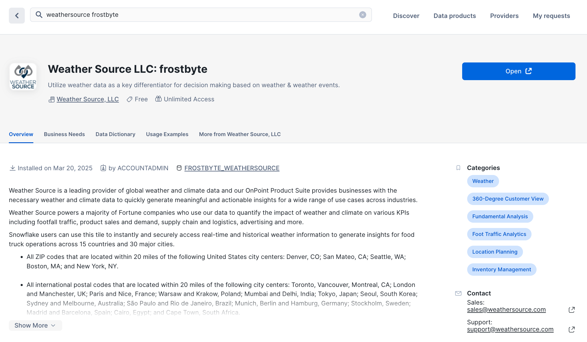
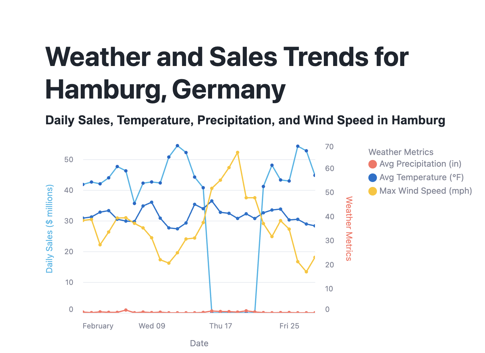

author: Gilberto Hernandez, Rida Safdar
id: snowflake-northstar-data-engineering
categories: snowflake-site:taxonomy/solution-center/certification/quickstart, snowflake-site:taxonomy/product/data-engineering
language: en
summary: Build an end-to-end data pipeline in Snowflake using the I-T-D framework. 
environments: web
status: Published 
feedback link: https://github.com/Snowflake-Labs/sfguides/issues


# Getting Started – Data Engineering with Snowflake
<!-- ------------------------ -->
## Overview 

### Overview

In this Quickstart, we're going to focus on data engineering with Snowflake. We'll specifically build an end-to-end data pipeline with Snowflake. We'll apply the  **Ingestion-Transformation–Delivery** framework, also known as **I-T-D**, to build the pipeline.

**Ingestion**

We'll load data from:

* Snowflake Marketplace
* AWS S3

**Transformation**

We'll transform our data using:

* SQL
* Views
* User-defined functions (UDFs)

**Delivery**

We'll deliver a final data product using:

* Streamlit in Snowflake


### Prerequisites
- Some basic familiarity with SQL

### What You’ll Learn 
- Snowflake for data engineering
- The Ingestion-Transformation-Delivery framework, or I-T-D, for data pipelines
- Data sharing from Snowflake Marketplace
- How to load data from AWS S3 blob storage
- How to perform transformations against data using SQL, Python, Views, UDFs, Stored Procedures
- How to deliver an end data product using Streamlit in Snowflake

### What You’ll Need 
- A free Snowflake trial account: [https://signup.snowflake.com/](https://signup.snowflake.com/?utm_source=snowflake-devrel&utm_medium=developer-guides&trial=student&cloud=aws&region=us-west-2&utm_campaign=introtosnowflake&utm_cta=developer-guides)
- The companion GitHub repo that contains the code to complete this lab: [sfguide-snowflake-northstar-data-engineering](https://github.com/Snowflake-Labs/sfguide-snowflake-northstar-data-engineering)

### What You’ll Build 
- An end-to-end data pipeline in Snowflake

<!-- ------------------------ -->
## Open a Snowflake Trial Account

To complete this lab, you'll need a Snowflake account. A free Snowflake trial account will work just fine. To open one:

1. Navigate to [https://signup.snowflake.com/](https://signup.snowflake.com/?utm_source=snowflake-devrel&utm_medium=developer-guides&trial=student&cloud=aws&region=us-west-2&utm_campaign=introtosnowflake&utm_cta=developer-guides)

2. Start the account creation by completing the first page of the form on the page.

3. On the next section of the form,  be sure to set the Snowflake edition to "Enterprise (Most popular").

4. Select "AWS – Amazon Web Services" as the cloud provider.

5. Select "US West (Oregon)" as the region.

6. Complete the rest of the form and click "Get started".


<!-- ------------------------ -->
## Understand The Pipeline We'll Build

Tasty Bytes is a food truck company that operates globally in many countries. You're a data engineer on the Tasty Bytes team, and you've recently learned from data analysts on the team that:

* Sales in the city of Hamburg, Germany dropped to $0 for a few days in the month of February

As a data engineer, your goal is to figure out why this happened, and to also build and end-to-end data pipeline that can  keep analysts up-to-date on the weather in Hamburg.

Here's how we'll do this:

**Ingestion**

* Load live weather data from Snowflake Marketplace

* Load Tasty Bytes sales data from an AWS S3 bucket

**Transformation**

* Use SQL to perform transformations

* Create views that we can use for data analytics

* Create user-defined functions (UDFs) that perform weather-related calculations to enrich the views with more data

**Deliver**

* Deliver final insights and a live graph of weather in Hamburg, Germany using Streamlit in Snowflake (write the application in Python)

Let's get started!

<!-- ------------------------ -->
## Weather Data From Snowflake Marketplace

Let's start by "loading" the raw weather data into Snowflake. It turns out that "loading" is really the wrong word here. 

We're using Snowflake's unique data sharing capability in Snowflake Marketplace. Because of this, we don't actually need to copy any data to our Snowflake account with any logic. Instead, we can directly access the weather data shared by a trusted provide in Snowflake Marketplace. Let's go ahead and do this.

1. Log into your Snowflake account.

2. Click on "Data Products".

3. Click on "Marketplace".

4. In the search bar, search for "weathersource frostbyte".

5. The first result should be "Weather Source LLC: frostbyte" by the "Weather Source, LLC" provider. Click on the listing.

6. On the right, click "Get".

7. In the ensuing modal, click "Get" once more. Do **NOT** rename the dataset.

This is a live dataset! No need to write ingestion logic to bring the data into your account. The data is maintained and kept fresh by the provider.



<!-- ------------------------ -->
## Load Sales Data From AWS S3

Let's now load the Tasty Bytes sales data. This data is currently sitting across many CSV files in an AWS S3 bucket. Let's use Snowflake's COPY INTO command to load the data into your Snowflake account.

1. Start by creating a new SQL worksheet.

2. Set your context. Set your role to **ACCOUNTADMIN**, and set your compute resource (virtual warehouse) to **COMPUTE_WH**.

3. Next, create the database and schema to store the data that we'll load. Type the following into the worksheet:

```sql
CREATE OR REPLACE DATABASE tasty_bytes;
CREATE OR REPLACE SCHEMA raw_pos;
```

4. Run this code by highlighting these two statements and clicking the Run button at the top right of the SQL worksheet.

5. Next, navigate to the [**copy_into.sql**](https://github.com/Snowflake-Labs/sfguide-snowflake-northstar-data-engineering/blob/main/00_ingestion/copy_into.sql) file in the **00_ingestion** folder of the **sfguide-snowflake-northstar-data-engineering** repo. Copy the contents of this file.

6. Navigate back to the SQL worksheet you opened. Paste in the code you copied under the two lines of SQL you wrote in the previous step.

7. Start by creating the file format necessary to load the data into Snowflake. Type the following underneath the "Create a CSV file format here:" comment:

```sql
CREATE OR REPLACE FILE FORMAT tasty_bytes.public.csv_ff
type = 'csv';
```

Run this command.

8. In the next block of SQL, with the comment `-- Specify the file format below:`, we create the Snowflake stage that points to the S3 bucket containing the CSV files. It's currently missing the file format argument that's necessary during the loading process. Below the `url` parameter, type:

```sql
file_format = tasty_bytes.public.csv_ff;
```

Run this entire command.

9. The next block of SQL creates a table called **COUNTRY** in the **tasty_bytes.raw_pos** schema. Run this block of SQL to create the table. Confirm the creation of the table using the object picker on the left-hand side.

10. Let's bring it all together now! After creating the table, let's now load the data into this table using the powerful **COPY INTO** command. At the very bottom of the worksheet, underneath the "Use the COPY INTO command..." comment, type:

```sql
COPY INTO tasty_bytes.raw_pos.country
FROM @tasty_bytes.public.s3load/raw_pos/country/;
```

Run this command. You should see a success message in the console. Great job!

**We're not quite done.** We loaded about 30 rows of data into the **COUNTRY** table, but we actually need to load close to 1 GB of sales data. We won't do this line-by-line. Instead, you'll use some SQL that we've written for you in advance.

1. Navigate to the [**load_tasty_bytes.sql**](https://github.com/Snowflake-Labs/sfguide-snowflake-northstar-data-engineering/blob/main/00_ingestion/load_tasty_bytes.sql) file in the **00_ingestion** folder within the **sfguide-snowflake-northstar-data-engineering** companion repo. Copy the contents. 

2. Navigate back to Snowflake and create a new SQL worksheet. Paste the contents you copied into the worksheet.

3. Run the entire file at once by clicking the drop-down at the top right, and clicking "Run All".

Observations:

* This will load close to 1 GB of Tasty Bytes sales data from AWS S3 into your Snowflake account.

* The script programmatically creates an XL compute resource (virtual warehouse) used for the loading of the data. Once the loading is done, the compute resource is dropped.

* This worksheet contains about 300 lines of SQL. The powerful thing is that you can understand 99% of it because of the SQL you wrote earlier to load data into the **COUNTRY** table.

After running the file, you should have all of the data loaded into your account! Confirm the creation of all the tables (and their data) using the object picker to the left.

This completes the **Ingestion** aspect of our pipeline for this lab.

<!-- ------------------------ -->
## Data Transformations With SQL

We now have the necessary data in our Snowflake account. To get closer to the insights that we need – weather-related data for the city of Hamburg, Germany – we need to use SQL to apply transformations to the data. This will bring us closer to the insights we're after. Let's begin.

1. Start by navigating to the [**hamburg_sales.sql**](https://github.com/Snowflake-Labs/sfguide-snowflake-northstar-data-engineering/blob/main/01_transformation/hamburg_sales.sql) file in the **01_transformation** folder in repo. Copy the contents.

2. Open a new SQL worksheet in Snowflake and paste the contents into the sheet.

In this worksheet, we use SQL to explore the suspicion that there are weather-related anomalies affecting sales in February in Hamburg, Germany. Let's start exploring.

3. Run the first few lines to set your context.

4. Run the first block of SQL that explores sales in Hamburg. You should encounter an error. We need to specify the city and country we're interested in exploring. On line 16, add `'Germany'` as the country, and `'Hamburg'` as the city. Re-run the block of SQL.

```sql
-- Query to explore sales in the city of Hamburg, Germany
WITH _feb_date_dim AS (
    SELECT DATEADD(DAY, SEQ4(), '2022-02-01') AS date 
    FROM TABLE(GENERATOR(ROWCOUNT => 28))
)
SELECT
    fdd.date,
    ZEROIFNULL(SUM(o.price)) AS daily_sales
FROM _feb_date_dim fdd
LEFT JOIN analytics.orders_v o
    ON fdd.date = DATE(o.order_ts)
    AND o.country = '#' -- Add country
    AND o.primary_city = '#' -- Add city
WHERE fdd.date BETWEEN '2022-02-01' AND '2022-02-28'
GROUP BY fdd.date
ORDER BY fdd.date ASC;
```

**It looks like the analysts were correct – there were several days in February where sales totaled 0.00. You can use the Chart feature to confirm this visually. We're on the right path!**

5. Let's now create a view that adds weather data – the data from our live data share we pulled from Snowflake Marketplace – to all cities where Tasty Bytes operates. Run the next block of SQL that creates the `tasty_bytes.harmonized.daily_weather_v` view. We'll use this view later on in our pipeline.

```sql
-- Create view that adds weather data for cities where Tasty Bytes operates
CREATE OR REPLACE VIEW tasty_bytes.harmonized.daily_weather_v
COMMENT = 'Weather Source Daily History filtered to Tasty Bytes supported Cities'
    AS
SELECT
    hd.*,
    TO_VARCHAR(hd.date_valid_std, 'YYYY-MM') AS yyyy_mm,
    pc.city_name AS city,
    c.country AS country_desc
FROM Weather_Source_LLC_frostbyte.onpoint_id.history_day hd
JOIN Weather_Source_LLC_frostbyte.onpoint_id.postal_codes pc
    ON pc.postal_code = hd.postal_code
    AND pc.country = hd.country
JOIN TASTY_BYTES.raw_pos.country c
    ON c.iso_country = hd.country
    AND c.city = hd.city_name;
```

6. The next block of SQL helps us query this view to explore temperatures for the month of February in Hamburg. Run the block of code. Click on "Chart" once the block of code executes. Nothing seems to be out of the ordinary here...

```sql
-- Query the view to explore daily temperatures in Hamburg, Germany for anomalies
SELECT
    dw.country_desc,
    dw.city_name,
    dw.date_valid_std,
    AVG(dw.avg_temperature_air_2m_f) AS avg_temperature_air_2m_f
FROM harmonized.daily_weather_v dw
WHERE 1=1
    AND dw.country_desc = 'Germany'
    AND dw.city_name = 'Hamburg'
    AND YEAR(date_valid_std) = '2022'
    AND MONTH(date_valid_std) = '2' -- February
GROUP BY dw.country_desc, dw.city_name, dw.date_valid_std
ORDER BY dw.date_valid_std DESC;
```

7. Run the next query that explores wind speeds in Hamburg. Once again, click "Chart" to visualize this data. Wow – there were spikes in windspeed that approached hurricane-force winds. **It looks like this windspeed affected sales during the month of February!**

```sql
-- Query the view to explore wind speeds in Hamburg, Germany for anomalies
SELECT
    dw.country_desc,
    dw.city_name,
    dw.date_valid_std,
    MAX(dw.max_wind_speed_100m_mph) AS max_wind_speed_100m_mph
FROM tasty_bytes.harmonized.daily_weather_v dw
WHERE 1=1
    AND dw.country_desc IN ('Germany')
    AND dw.city_name = 'Hamburg'
    AND YEAR(date_valid_std) = '2022'
    AND MONTH(date_valid_std) = '2' -- February
GROUP BY dw.country_desc, dw.city_name, dw.date_valid_std
ORDER BY dw.date_valid_std DESC;
```

8. Now that we've found a likely culprit behind the drop in sales, so let's create a view that tracks windspeed. We'll use this view later on in our pipeline. Locate the next block of SQL. Add `windspeed_hamburg` to the end of the first line, so that the line reads `CREATE OR REPLACE VIEW tasty_bytes.harmonized.windspeed_hamburg` and names our view. Run the final block of SQL to create the view.

```sql
-- Create a view that tracks windspeed for Hamburg, Germany
CREATE OR REPLACE VIEW tasty_bytes.harmonized. --add name of view
    AS
SELECT
    dw.country_desc,
    dw.city_name,
    dw.date_valid_std,
    MAX(dw.max_wind_speed_100m_mph) AS max_wind_speed_100m_mph
FROM harmonized.daily_weather_v dw
WHERE 1=1
    AND dw.country_desc IN ('Germany')
    AND dw.city_name = 'Hamburg'
GROUP BY dw.country_desc, dw.city_name, dw.date_valid_std
ORDER BY dw.date_valid_std DESC;
```

A view in Snowflake allows you to store and access the **result** of a query. This is in contrast to querying multiple tables with raw data to extract insights. The queries that views store can be arbitrarily simple or complex. This helps you query exactly what you need at a much faster speed. 

Views also help organize exactly which aspects of data might be valuable, and help with secure data access control. We can use views to power our data pipeline, without sacrificing performance.

We'll use these views in our pipeline later on.

<!-- ------------------------ -->
## Create User-Defined Functions For Calculations

We're missing some critical data for our pipeline. Our analysts have requested that we track certain weather measurements using the metric system. We are tracking a country in Europe after all.

They've specifically requested that we include temperature measurements in Celsius, and precipitation in millimeters.

To do this, we'll create two user-defined functions, or UDFs, that are able to take in existing data from our tables and perform the necessary conversions. We will then invoke them later on to derive these new values.

Let's get started.

1. Copy the contents of the [**udf.sql**](https://github.com/Snowflake-Labs/sfguide-snowflake-northstar-data-engineering/blob/main/01_transformation/udf.sql) file in the **01_transformation** folder in the repo.

2. Open a new SQL worksheet in Snowflake and paste the contents in.

3. These two blocks of SQL each create a UDF. One converts temperatures from Fahrenheit to Celsius, and the other converts inches to millimeters. 

4. We need to finish these SQL statements before we can run this code and create the functions. Add the word `FUNCTION` after each the `CREATE OR REPLACE` statements. Be sure to remove the `/*  */` placeholders.

```sql
CREATE OR REPLACE /*  */ tasty_bytes.analytics.fahrenheit_to_celsius(temp_f NUMBER(35,4))
  RETURNS NUMBER(35,4)
  AS
  $$
    (temp_f - 32) * (5/9)
  $$
;

CREATE OR REPLACE /*  */ tasty_bytes.analytics.inch_to_millimeter(inch NUMBER(35,4))
  RETURNS NUMBER(35,4)
  AS
  $$
    inch * 25.4
  $$
;
```

5. After completing the SQL statements, run the entire worksheet. You should see a success message, and you can verify the creation of the functions in the **tasty_bytes.analytics** schema.

Great! We'll use these functions to expand the views we're planning on using in our pipeline.

<!-- ------------------------ -->
## Apply UDFs For Data Transformations

Let's now use the UDFs to add new columns in our views. These new columns will contains the converted values for temperature and precipitation.

1. Copy the contents of the [**updated_hamburg_sales.sql**](https://github.com/Snowflake-Labs/sfguide-snowflake-northstar-data-engineering/blob/main/01_transformation/updated_hamburg_sales.sql) file in the **01_transformation** folder in repo.

2. Open a new SQL worksheet in Snowflake and paste the contents in.

3. Notice that on lines 14 and 16, we call the UDFs and apply them against existing values, and then use the output of those functions to create new columns with corresponding data.

```sql
-- Apply UDFs and confirm successful execution
...
-- Code to focus on
    ROUND(AVG(analytics.fahrenheit_to_celsius(fd.avg_temperature_air_2m_f)),2) AS avg_temperature_celsius,
    ROUND(AVG(fd.tot_precipitation_in),2) AS avg_precipitation_inches,
    ROUND(AVG(analytics.inch_to_millimeter(fd.tot_precipitation_in)),2) AS avg_precipitation_millimeters,

...
```

4. Name the view. On line 6, finish the statement by adding `weather_hamburg`. The entire line should read `CREATE OR REPLACE VIEW harmonized.weather_hamburg`.

5. Run the entire file top to bottom. You should see a successful message, and you can confirm the creation of the view using the object picker on the left.

Great job! We've transformed our data using SQL to create views, and we've used UDFs to expand our views (and create new views!). We'll use these transformations later on in our pipeline.

This completes the **Transformation** aspect of our pipeline for this lab.

<!-- ------------------------ -->
## Deliver Insights With Streamlit in Snowflake

We now have the insights that we need, and we can now also deliver them to our data analysts. We specifically have views that track the weather and sales in Hamburg, Germany. So how exactly will we make these insights easily accessible for our data analysts?

We're going to create a Streamlit in Snowflake app that will visualize this data for them.

For some context, Streamlit is a popular open-source Python library for creating data apps in Python – no need for HTML, CSS, or any other front-end frameworks. It's also natively available within Snowflake, which means creating data apps that use the data in our Snowflake environment is both powerful and easy to do.

Let's go ahead and create the app for our analysts.

1. Copy the contents of the [**streamlit.py**](https://github.com/Snowflake-Labs/sfguide-snowflake-northstar-data-engineering/blob/main/02_delivery/streamlit.py) file in the **02_delivery** folder in the repo.

2. Navigate to "Projects", then click on "Streamlit".

3. At the top, create a new Streamlit app. Name the app "HAMBURG_GERMANY_TRENDS".

4. For the app location, select **TASTY_BYTES** as the database, and **HARMONIZED** for the schema. Leave everything else as-is.

5. Create the app and wait for it to boot up. You'll notice a default, sample app rendered for you automatically.

6. If the code editor is not present, click on "Edit" at the top. Otherwise, you can see the code powering this sample app in the Python editor in Snowflake.

7. Delete all of this sample code.

8. Paste in the Python code you copied earlier from the **streamlit.py** file.

This code creates an app that visualizes the data within the views we created earlier. 

9. Click "Run" at the top. You should encounter an error. On line 14, replace `"INSERT NAME OF VIEW HERE"` with `tasty_bytes.harmonized.weather_hamburg` and click "Run once more.

10. The application should render successfully! Congratulations!



In just 54 lines of code, we created a Streamlit in Snowflake application with Python that delivers the insights we extracted from our data. 

At the top, you could imagine clicking on "Share" and sharing the app with relevant analyst roles in your Snowflake account.

With this application, we've now completed our end-to-end data pipeline. This completes the **Delivery** aspect of our pipeline for this lab.

<!-- ------------------------ -->
## Conclusion And Resources

### Conclusion

Congratulations! You've built an end-to-end data pipeline in Snowflake using the **Ingestion-Transformation–Delivery** framework, also known as **I-T-D**. Let's recap what you did. 

### What You Learned

You built a data pipeline that tracks weather and sales data for Tasty Bytes food trucks in the city of Hamburg, Germany. As part of the I-T-D framework, you:

**Ingestion**

Loaded data from:

* Snowflake Marketplace
* AWS S3

**Transformation**

Transformed data using:

* SQL
* Views
* User-defined functions (UDFs)

**Delivery**

Delivered a final data product using:

* Streamlit in Snowflake

Congratulations! 

### Resources

For more resources, check out the following:

* You can build the objects we used in the pipeline using Snowpark for Python as well. The code to do this is provided in the [**hamburg_sales_snowpark.ipynb** Notebook file in the repo](https://github.com/Snowflake-Labs/sfguide-snowflake-northstar-data-engineering/blob/main/01_transformation/hamburg_sales_snowpark.ipynb).

* Learn more at [Snowflake Northstar](/en/developers/northstar/) for developers.
