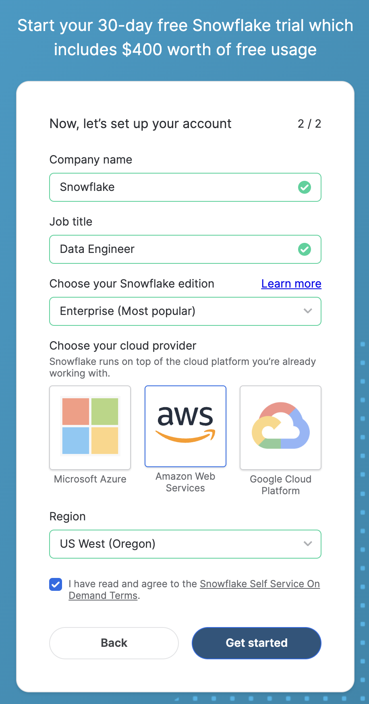
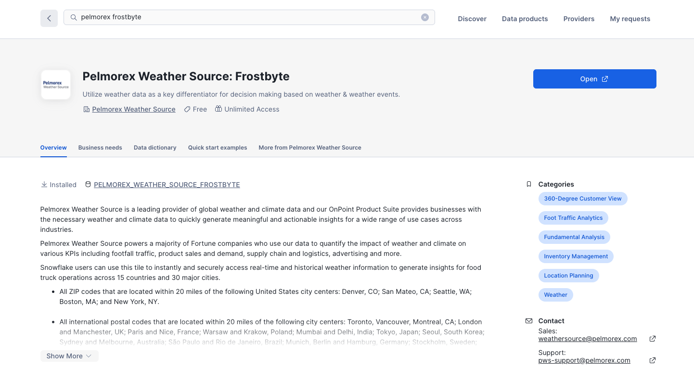

author: Gilberto Hernandez, Rida Safdar
id: snowflake-northstar-data-engineering
categories: snowflake-site:taxonomy/solution-center/certification/quickstart, snowflake-site:taxonomy/product/data-engineering
language: en
summary: Build an end-to-end data pipeline in Snowflake using the I-T-D framework — prompt-driven with Cortex Code, powered by Dynamic Tables, and delivered through a Cortex Agent in Snowflake CoWork.
environments: web
status: Published 
feedback link: https://github.com/Snowflake-Labs/sfguides/issues
fork repo link: https://github.com/Snowflake-Labs/sfguide-snowflake-northstar-data-engineering


# Getting Started – Data Engineering with Snowflake
<!-- ------------------------ -->
## Overview 

### Overview

In this Quickstart, we're going to build an end-to-end data pipeline in Snowflake using the **Ingestion–Transformation–Delivery** framework, also known as **I-T-D**.

There's a twist: instead of copying and pasting SQL from a repo, you'll build the pipeline by **prompting [Cortex Code](https://docs.snowflake.com/en/user-guide/snowflake-cortex/cortex-code) (CoCo)** — Snowflake's AI coding agent — right inside a Snowflake Workspace. You'll describe what you want in plain English, and Cortex Code will write the SQL for you.

We'll also use Snowflake's most modern building blocks:

**Ingestion**

We'll load data from:

* Snowflake Marketplace
* AWS S3

**Transformation**

We'll transform our data using:

* SQL and user-defined functions (UDFs)
* **Dynamic Tables** (instead of standard views)

**Delivery**

We'll deliver a final data product using:

* A **semantic view** and a **Cortex Agent**, queried in natural language through **Snowflake CoWork**


### Prerequisites
- Some basic familiarity with SQL

### What You’ll Learn 
- Snowflake for data engineering
- The Ingestion-Transformation-Delivery framework, or I-T-D, for data pipelines
- How to clone a public GitHub repo into Snowflake as a Git-backed Workspace
- How to develop prompt-first with Cortex Code
- Data sharing from Snowflake Marketplace and loading data from AWS S3
- How to build Dynamic Tables and user-defined functions (UDFs)
- How to create a semantic view and a Cortex Agent, and use them in Snowflake CoWork

### What You’ll Need 
- A free Snowflake trial account: [https://signup.snowflake.com/](https://signup.snowflake.com/?utm_source=snowflake-devrel&utm_medium=developer-guides&trial=student&cloud=aws&region=us-west-2&utm_campaign=introtosnowflake&utm_cta=developer-guides)
- The companion GitHub repo, which you'll clone into Snowflake as a Workspace: [sfguide-snowflake-northstar-data-engineering](https://github.com/Snowflake-Labs/sfguide-snowflake-northstar-data-engineering)

### What You’ll Build 
- An end-to-end, prompt-driven data pipeline in Snowflake that an analyst can query in natural language

<!-- ------------------------ -->
## Open a Snowflake Trial Account

To complete this lab, you'll need a Snowflake account. A free Snowflake trial account will work just fine. To open one:

1. Navigate to [https://signup.snowflake.com/](https://signup.snowflake.com/?utm_source=snowflake-devrel&utm_medium=developer-guides&trial=student&cloud=aws&region=us-west-2&utm_campaign=introtosnowflake&utm_cta=developer-guides)

2. Start the account creation by completing the first page of the form on the page.

3. On the next section of the form,  be sure to set the Snowflake edition to "Enterprise (Most popular").

4. Select "AWS – Amazon Web Services" as the cloud provider.

5. Select "US West (Oregon)" as the region.

6. Complete the rest of the form and click "Get started".



<!-- ------------------------ -->
## Understand The Pipeline We'll Build

Tasty Bytes is a food truck company that operates globally in many countries. You're a data engineer on the Tasty Bytes team, and you've recently learned from data analysts on the team that:

* Sales in the city of Hamburg, Germany dropped to $0 for a few days in the month of February

As a data engineer, your goal is to figure out why this happened, and to build an end-to-end data pipeline that lets analysts get answers about Hamburg weather and sales just by asking.

Here's how we'll do this:

**Ingestion**

* Load live weather data from Snowflake Marketplace

* Load Tasty Bytes sales data from an AWS S3 bucket

**Transformation**

* Use SQL and UDFs to perform transformations

* Build **Dynamic Tables** — self-refreshing tables that replace the standard views you'd normally maintain by hand

**Deliver**

* Create a **semantic view** over the transformed data, wire it to a **Cortex Agent**, and let analysts ask questions in plain English through **Snowflake CoWork**

The difference from a traditional lab: you won't copy and paste this SQL. You'll **prompt Cortex Code** to write it, working through files in a Snowflake Workspace.

Let's get started!

<!-- ------------------------ -->
## Set Up Your Workspace

Before we ingest anything, we'll set up the environment: create a Git integration, clone the companion repo **into Snowflake as a Workspace**, and open Cortex Code.

> **Note:** This setup is a bit heavier than a traditional Quickstart, because we're wiring up prompt-driven development and Snowflake CoWork up front. It only takes a few minutes.

### 1. Create the Git API integration

To clone a public GitHub repo into Snowflake, your account needs an **API integration**. On a trial account you're `ACCOUNTADMIN`, so you can create one.

1. Log into your Snowflake account.

2. Open a new SQL worksheet (**Projects » Worksheets » +**).

3. Run the following:

```sql
USE ROLE accountadmin;

CREATE OR REPLACE API INTEGRATION github_public_api
  API_PROVIDER = git_https_api
  API_ALLOWED_PREFIXES = ('https://github.com/Snowflake-Labs')
  ENABLED = TRUE;
```

> **Note:** Only users with the `ACCOUNTADMIN` role (or a role with `CREATE INTEGRATION`) can create API integrations.

### 2. Clone the companion repo as a Workspace

1. In the navigation menu, go to **Projects » Workspaces**.

2. Click the dropdown at the top and select **From Git repository**.

3. For the **Repository URL**, paste:
   `https://github.com/Snowflake-Labs/sfguide-snowflake-northstar-data-engineering`

4. For the **API integration**, select `GITHUB_PUBLIC_API`.

5. Check **Public repository**, give the Workspace a name, and create it.

Snowflake clones the repo into your Workspace. You'll see two folders — **project/** (the files you'll work through) and **solution/** (the answers, if you get stuck).

> **Note:** Workspaces clone public repos as **read-only**. You won't be pushing changes back, which is exactly what we want here.

### 3. Meet Cortex Code

With the Workspace open, open the **Cortex Code** panel. This is the AI coding agent you'll prompt throughout the lab. Instead of writing SQL by hand, you'll open a file, read the prompt in the comments, send it to Cortex Code, and run the SQL it generates.

### 4. Run the setup file

1. In your Workspace, open **project/00_setup/setup.sql**.

2. Work through it top to bottom. Some steps are marked **"Run as-is"** — just run them. Others are marked with a **▶ PROMPT** — copy that prompt into Cortex Code, then run the SQL it writes.

This file creates the `tasty_bytes` database and its schemas, and enables **Snowflake CoWork** (Snowflake Intelligence) so we can deliver our agent later.

Once you've run every step in **00_setup/setup.sql**, your account is ready. Let's ingest some data.

<!-- ------------------------ -->
## Ingestion — Load The Data

The first stage of I-T-D is **Ingestion**. We'll bring in weather data from Snowflake Marketplace and sales data from AWS S3.

### Weather data from Snowflake Marketplace

Let's start with the raw weather data. It turns out "loading" is the wrong word here — we'll use Snowflake's data sharing to access a live dataset without copying anything.

1. Click on **Marketplace**.

2. Click on **Snowflake Marketplace**.

3. In the search bar, search for "pelmorex frostbyte".

4. The first result should be "Pelmorex Weather Source: Frostbyte" by the "Pelmorex Weather Source" provider. Click on the listing.

5. On the right, click **Get**.

6. In the ensuing modal, click **Get** once more. Do **NOT** rename the dataset.

This is a live dataset! No need to write ingestion logic — the data is maintained and kept fresh by the provider.



### Sales data from AWS S3

Now let's load the Tasty Bytes sales data, which sits across many CSV files in an AWS S3 bucket. Rather than copy-paste the load scripts, you'll **prompt Cortex Code** to write them.

1. In your Workspace, open **project/01_ingestion/ingestion.sql**.

2. Work through the prompts in order. You'll prompt Cortex Code to:
   - Create a **CSV file format**.
   - Create the **external stage** on the Tasty Bytes S3 bucket.
   - Create the **COUNTRY** table — our single teaching example of the load pattern.
   - Run a **COPY INTO** to load the COUNTRY table.

   After each prompt, run the SQL Cortex Code generates. You should see success messages and about 30 rows land in the **COUNTRY** table. Great job!

3. **Scale it up.** Loading ~1 GB of sales data table-by-table would be tedious, and you've already learned the pattern. **Step 6** of the file is a large block of boilerplate — the remaining target tables, the `COPY INTO` loads, and the harmonized `orders_v` views — marked **"Run as-is."** Run it directly. It creates an XL warehouse, loads every table, and drops the warehouse when it's done.

After running the file, all of the Tasty Bytes data is in your account. Confirm the tables using the object picker on the left.

This completes the **Ingestion** stage of our pipeline.

<!-- ------------------------ -->
## Transformation — UDFs And Dynamic Tables

The second stage is **Transformation**. In the original version of this lab we created standard **views**. This time we'll create **Dynamic Tables** instead.

A Dynamic Table is a table whose contents are defined by a query — but unlike a view, Snowflake **materializes and automatically refreshes** the results for you based on a target lag you set. You get the simplicity of "define it with a query" plus the performance of a real table, without writing any refresh logic.

Open **project/02_transformation/dynamic_tables.sql** and work through the prompts.

1. **Explore the drop.** The first prompt asks Cortex Code to write a query showing daily Hamburg sales for February 2022. Run it — you'll see several days at $0.00. The analysts were right.

2. **Create two UDFs.** Analysts want metric units. Prompt Cortex Code to create two user-defined functions in `tasty_bytes.analytics`: one that converts Fahrenheit to Celsius, and one that converts inches to millimeters.

3. **Create the base weather Dynamic Table.** Prompt Cortex Code to create `daily_weather_dt`, which joins the shared Pelmorex weather data to the cities where Tasty Bytes operates.

   > **Important:** This Dynamic Table reads **live, shared data that we don't own**. Incremental refresh requires change tracking on the base objects, which requires `OWNERSHIP` — so we pin this table to `REFRESH_MODE = FULL`. Dynamic Tables built only on tables you own can refresh incrementally.

   The Dynamic Table Cortex Code generates should look like this:

   ```sql
   CREATE OR REPLACE DYNAMIC TABLE tasty_bytes.harmonized.daily_weather_dt
     TARGET_LAG = '1 day'
     WAREHOUSE = compute_wh
     REFRESH_MODE = FULL
     AS
   SELECT
       hd.*,
       TO_VARCHAR(hd.date_valid_std, 'YYYY-MM') AS yyyy_mm,
       pc.city_name AS city,
       c.country AS country_desc
   FROM Pelmorex_Weather_Source_frostbyte.onpoint_id.history_day hd
   JOIN Pelmorex_Weather_Source_frostbyte.onpoint_id.postal_codes pc
       ON pc.postal_code = hd.postal_code
       AND pc.country = hd.country
   JOIN tasty_bytes.raw_pos.country c
       ON c.iso_country = hd.country
       AND c.city = hd.city_name;
   ```

4. **Find the culprit.** The next prompts explore temperature and then wind speed in Hamburg for February 2022. Chart the wind speed result — you'll see spikes approaching hurricane-force winds. **That wind speed is our likely culprit.**

5. **Create the wind speed Dynamic Table.** Prompt Cortex Code to create `windspeed_hamburg_dt` from the base weather Dynamic Table.

6. **Create the combined Dynamic Table.** Finally, prompt Cortex Code to create `weather_hamburg_dt`, which joins weather to sales and **invokes your two UDFs** to add Celsius and millimeter columns. The generated table should look like this:

   ```sql
   CREATE OR REPLACE DYNAMIC TABLE tasty_bytes.harmonized.weather_hamburg_dt
     TARGET_LAG = '1 day'
     WAREHOUSE = compute_wh
     REFRESH_MODE = FULL
     AS
   SELECT
       fd.date_valid_std,
       fd.city_name,
       fd.country_desc,
       ZEROIFNULL(SUM(odv.price)) AS daily_sales,
       ROUND(AVG(fd.avg_temperature_air_2m_f),2) AS avg_temperature_fahrenheit,
       ROUND(AVG(analytics.fahrenheit_to_celsius(fd.avg_temperature_air_2m_f)),2) AS avg_temperature_celsius,
       ROUND(AVG(fd.tot_precipitation_in),2) AS avg_precipitation_inches,
       ROUND(AVG(analytics.inch_to_millimeter(fd.tot_precipitation_in)),2) AS avg_precipitation_millimeters,
       MAX(fd.max_wind_speed_100m_mph) AS max_wind_speed_100m_mph
   FROM harmonized.daily_weather_dt fd
   LEFT JOIN harmonized.orders_v odv
       ON fd.date_valid_std = DATE(odv.order_ts)
       AND fd.city_name = odv.primary_city
       AND fd.country_desc = odv.country
   WHERE 1=1
       AND fd.country_desc = 'Germany'
       AND fd.city = 'Hamburg'
       AND fd.yyyy_mm = '2022-02'
   GROUP BY fd.date_valid_std, fd.city_name, fd.country_desc;
   ```

Here's what these Dynamic Tables give us:

- **Self-refreshing pipelines** — no manual `CREATE OR REPLACE` or scheduled tasks; Snowflake keeps them fresh to your target lag.
- **A clear dependency chain** — `daily_weather_dt` feeds `windspeed_hamburg_dt` and `weather_hamburg_dt`, and Snowflake manages the refresh order.

This completes the **Transformation** stage of our pipeline.

<!-- ------------------------ -->
## Delivery — Semantic View And Cortex Agent

The final stage is **Delivery**. We have the insight we need — now we need to make it accessible to analysts. In the original lab we hand-coded a Streamlit app. This time we'll do something more powerful: we'll let analysts **ask questions in plain English** and get charts back, using a **Cortex Agent** in **Snowflake CoWork**.

To do that, we need two things: a **semantic view** (which teaches Cortex what our data means) and a **Cortex Agent** (which uses that semantic view to answer questions).

Open **project/03_delivery/semantic_view_and_agent.sql** and work through the prompts.

1. **Create the semantic view.** Prompt Cortex Code to create `hamburg_weather_sales_sv` over the `weather_hamburg_dt` Dynamic Table. Because that Dynamic Table already joins sales and weather at a daily grain, the semantic view is a single, clean table with:
   - **Dimensions:** date, city, country
   - **Metrics:** daily sales, average temperature (°C), maximum wind speed (mph), average precipitation (mm)
   - A **verified query** for our key question, which helps the agent answer accurately.

2. **Create the Cortex Agent.** Prompt Cortex Code to create `tasty_bytes_weather_agent` in the `snowflake_intelligence.agents` schema, backed by a Cortex Analyst tool that uses the semantic view. Agents created in this schema appear automatically in Snowflake CoWork.

3. **Ask your pipeline a question.** Open **Snowflake CoWork** (**AI & ML » Agents**), select the **Tasty Bytes Weather Analyst** agent, and ask:

   > *"Why did Hamburg sales drop to zero in February 2022?"*

CoWork queries your semantic view, correlates the wind speed spike with the sales drop, and charts the answer for you — no dashboard code required.

With this, we've completed our end-to-end pipeline. Analysts no longer need SQL or a custom app; they just ask. This completes the **Delivery** stage of our pipeline.

<!-- ------------------------ -->
## Clean Up

If you built this in a trial account you'd like to keep tidy, you can drop everything you created. Open a SQL worksheet and run the following:

```sql
USE ROLE accountadmin;

-- Drop the agent, then the pipeline database and its objects
DROP AGENT IF EXISTS snowflake_intelligence.agents.tasty_bytes_weather_agent;
DROP DATABASE IF EXISTS tasty_bytes;

-- Drop the Git API integration used to clone the Workspace
DROP INTEGRATION IF EXISTS github_public_api;
```

> **Note:** This leaves the `snowflake_intelligence` database in place, since your account may use it for other agents. Drop it with `DROP DATABASE IF EXISTS snowflake_intelligence;` only if you're sure nothing else depends on it.

You can also delete the Workspace you created from the **Projects » Workspaces** menu.

<!-- ------------------------ -->
## Conclusion And Resources

### Conclusion

Congratulations! You've built an end-to-end data pipeline in Snowflake using the **Ingestion–Transformation–Delivery (I-T-D)** framework — and you built it by prompting Cortex Code the whole way. Let's recap.

### What You Learned

You built a prompt-driven data pipeline that tracks weather and sales for Tasty Bytes food trucks in Hamburg, Germany. As part of the I-T-D framework, you:

**Ingestion**

Loaded data from:

* Snowflake Marketplace
* AWS S3

**Transformation**

Transformed data using:

* SQL and user-defined functions (UDFs)
* Dynamic Tables

**Delivery**

Delivered a final data product using:

* A semantic view and a Cortex Agent, queried through Snowflake CoWork

Along the way, you learned to develop prompt-first with Cortex Code inside a Git-backed Snowflake Workspace.

Congratulations! 

### Resources

For more resources, check out the following:

* The companion repo, with the `project/` prompts and `solution/` answers: [sfguide-snowflake-northstar-data-engineering](https://github.com/Snowflake-Labs/sfguide-snowflake-northstar-data-engineering)

* [Cortex Code documentation](https://docs.snowflake.com/en/user-guide/snowflake-cortex/cortex-code)

* [Dynamic Tables](https://docs.snowflake.com/en/user-guide/dynamic-tables-about)

* [Semantic views](https://docs.snowflake.com/en/user-guide/views-semantic/overview) and [Cortex Agents](https://docs.snowflake.com/en/user-guide/snowflake-cortex/cortex-agents)

* Learn more at [Snowflake Northstar](/en/developers/northstar/) for developers.
