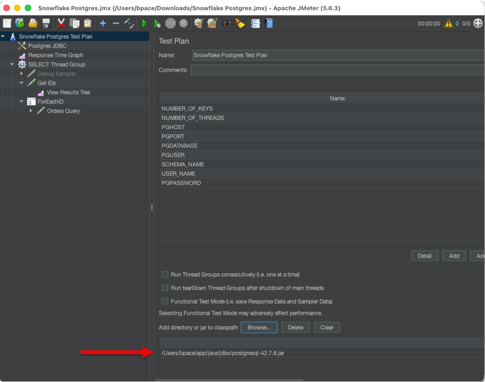
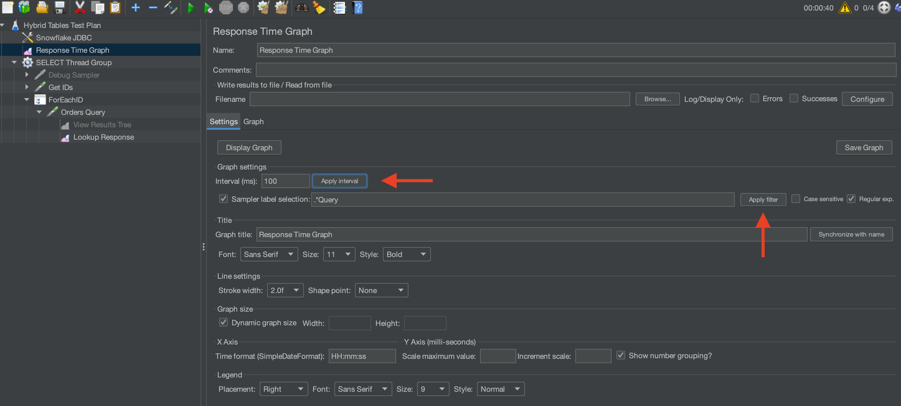

author: Brian Pace
id: snowflake-postgres-jmeter-performance-testing
categories: snowflake-site:taxonomy/solution-center/certification/quickstart, snowflake-site:taxonomy/product/data-engineering
language: en
summary: Execute a simple performance test to evaluate PostgreSQL and compare with Snowflake hybrid tables.
environments: web
status: Published 
feedback link: https://github.com/Snowflake-Labs/sfguides/issues

# Postgres Performance Testing with JMeter
<!-- ------------------------ -->
## Overview 

This guide will introduce you to performance testing Postgres using [JMeter](https://jmeter.apache.org/).
This guide is designed to complement the [Hybrid Tables Performance Testing with JMeter](/en/developers/guides/hybrid-tables-jmeter-performance-testing/) testing guide, allowing you to perform an apples-to-apples comparison between Postgres and Snowflake Hybrid Tables.

If your use case is response time sensitive and you're evaluating between Postgres and Snowflake Hybrid Tables, this guide will help you understand performance characteristics using identical test methodologies.

While you will be using JMeter for this quickstart, this guide is not a comprehensive JMeter tutorial. The basics will be covered to get you started.

### Prerequisites

- Installed and running [JMeter](https://jmeter.apache.org/)
- Download the latest [Postgres JDBC Driver](https://jdbc.postgresql.org/)
- Provisioned Postgres cluster (See the [Getting Started with Snowflake Postgres](en/developers/guides/getting-started-with-snowflake-postgres/))

### What You'll Learn

- How to configure a Postgres database and user for testing
- How to configure JMeter to connect to Postgres
- How to create basic Postgres tables for performance testing
- How to compare Postgres performance with Snowflake Hybrid Tables

### What You'll Need 

- JMeter installed and operational
- The Postgres JDBC Driver
- A shell terminal application
- About 20 minutes

### What You'll Build 

- A Postgres performance test using JMeter that mirrors the Snowflake Hybrid Tables test


<!-- ------------------------ -->
## Create Postgres Database

You will need a database and user configured in Postgres for this test.  Follow the  to create a Postgres instance and configure network policies and rules.

Set environment variables to store connection information for your Postgres cluster.

```bash
export PGHOST="<Snowflake host name>"
export PGDATABASE="postgres"
export PGUSER="snowflake_admin"
export PGPASSWORD="<password>"
export PGSSLMODE=require
``` 

Let's create the basic objects. Connect to your Postgres server using `psql` as a superuser (or a user with database creation privileges like snowflake_admin):

```bash
psql -U snowflake_admin -d postgres
```

Once connected, create the database objects used for the test.

```sql
-- Create database
CREATE DATABASE quickstart_db;

-- Create role (user)
CREATE USER quickstart_user WITH PASSWORD 'YourSecurePassword123!';

-- Grant privileges
GRANT ALL PRIVILEGES ON DATABASE quickstart_db TO quickstart_user;

-- Connect to the new database
\c quickstart_db

-- Create schema
CREATE SCHEMA IF NOT EXISTS quickstart;

-- Grant schema privileges
GRANT ALL PRIVILEGES ON SCHEMA quickstart TO quickstart_user;
GRANT ALL PRIVILEGES ON ALL TABLES IN SCHEMA quickstart TO quickstart_user;
GRANT ALL PRIVILEGES ON ALL SEQUENCES IN SCHEMA quickstart TO quickstart_user;

-- Make sure future tables are also accessible
ALTER DEFAULT PRIVILEGES IN SCHEMA quickstart GRANT ALL ON TABLES TO quickstart_user;
ALTER DEFAULT PRIVILEGES IN SCHEMA quickstart GRANT ALL ON SEQUENCES TO quickstart_user;
```

**Note:** For production environments, use a more secure password and follow your organization's security policies.

Next, we will create our table for testing.

<!-- ------------------------ -->
## Create the Postgres Table

For this quickstart, we will create a standard Postgres table that mirrors the structure
used in the Snowflake Hybrid Tables test. This allows for direct performance comparison.

Connect to your Postgres database and create the table with synthetic data:

```sql
-- Create the table
CREATE TABLE quickstart.icecream_orders (
    id SERIAL PRIMARY KEY,
    store_id INTEGER NOT NULL,
    flavor VARCHAR(20) NOT NULL,
    order_ts TIMESTAMP NOT NULL,
    num_scoops INTEGER NOT NULL
);

-- Create index on store_id for better query performance (optional but recommended)
CREATE INDEX idx_icecream_orders_store_id ON quickstart.icecream_orders(store_id);

-- Insert synthetic data (10,000 rows)
-- PostgreSQL doesn't have GENERATOR like Snowflake, so we use generate_series
INSERT INTO quickstart.icecream_orders (store_id, flavor, order_ts, num_scoops)
SELECT
    (random() * 9 + 1)::INTEGER AS store_id,
    (ARRAY['CHOCOLATE', 'VANILLA', 'STRAWBERRY', 'LEMON'])[floor(random() * 4 + 1)::INTEGER] AS flavor,
    CURRENT_DATE - (random() * 90)::INTEGER * INTERVAL '1 day' + (random() * 86400)::INTEGER * INTERVAL '1 second' AS order_ts,
    (random() * 2 + 1)::INTEGER AS num_scoops
FROM generate_series(1, 10000);
-- Feel free to change the number of rows as needed

-- Vacuum and Analyze the table for optimal query planning
VACUUM ANALYZE quickstart.icecream_orders;
```

Check that we created something useful:

```sql
SELECT *
FROM quickstart.icecream_orders
LIMIT 10;
```

You should see 10 ice cream orders with random data. The table is now ready for performance testing.

Type `\q` to exit psql. Now you're ready to configure JMeter.

<!-- ------------------------ -->
## Download and Configure the JMeter Script

For this part of the testing, you will:
* Download the JMeter script
* Add the Postgres JDBC Driver
* Customize the JDBC Connection
* Test that the script connects to your PostgreSQL instance


### Download the JMeter Script
Download the Jmeter [script](/en/developers/guides/snowflake-postgres-jmeter-performance-testing/assets/SnowflakePostgres.jmx). 

Start the JMeter software and open the downloaded script `File->Open`. The script is configured to do a very simple test against
the table we have already created:

- Connect to PostgreSQL using the configuration we supply
- Use a random sampling query to select random keys from the target table
```sql
SELECT ID FROM quickstart.ICECREAM_ORDERS TABLESAMPLE SYSTEM(${SAMPLE_PERCENT});
```
- Enumerate the keys with a configurable number of threads to test throughput and latency.
```sql
SELECT * FROM quickstart.icecream_orders WHERE id = ?
```
**Note:** Using prepared statements with bound parameters is a best practice. This method maximizes
query re-use and minimizes compile time.

### Configure the PostgreSQL JDBC Driver
JMeter will connect to Postgres using JDBC. PostgreSQL provides a jdbc driver for this type of connection. Follow
these steps to connect JMeter with your PostgreSQL instance.

1. Download the PostgreSQL JDBC Driver jar from [the official PostgreSQL JDBC website](https://jdbc.postgresql.org/download/).
1. Start JMeter 
    - If you installed jmeter using homebrew on a mac, the start script hard codes the `JAVA_HOME` environment variable.
    - If you need or want to change the java version, you will likely need to run your own start script.
1. Add the jar to the class list in the JMeter configuration like this:



### Customize the JDBC Connection
Most of the user defined variables will be setup to match the work you have already done. You will need to 
add your host and password values.

Update these variables in JMeter:
- `PGHOST`: Your Postgres server hostname (e.g., `localhost`)
- `PGPORT`: Postgres port (default is `5432`)
- `PGDATABASE`: `quickstart_db`
- `PGUSER`: `quickstart_user`
- `PGPASSWORD`: The password you set for the user
- `SCHEMA_NAME`: `quickstart`


### Test the Connection
With just a single thread and a few records, let's check that JMeter is connecting to Postgres. In the
User Defined Variables, set `SAMPLE_PERCENT` = 1 and `NUMBER_OF_THREADS` = 1. 

Click the green arrow in the tool bar or press Command+R to run a test. The test will run and then automatically
stop.

If successful, JMeter will sample 1% of total keys from the Postgres table and use a single thread to query the records. Check in the 
`View Results Tree` section on the left to see if the `Get IDs` request was successful:


A failed connection would look something like:


If the connection fails, clicking the failure will show you the nature of the error. Most failures are due to:
- Incorrect hostname or port
- Database name typo
- Incorrect username or password
- Postgres service not running

If your script successfully connected to Postgres and queried for a few records, congratulations! You
are ready for a longer test.

<!-- ------------------------ -->
## Run a Full Test

Change the configuration to make 250 requests from 4 threads. 
- `SAMPLE_PERCENT` = 5
- `NUMBER_OF_THREADS` = 4

Start a test. You can view the performance graph output by selecting `Response Time Graph`. Click
the `Apply interval` and `Apply filter` buttons before you visualize the graph:



Now you can adjust the number of keys and threads up to the limit of your particular machine.

Congratulations! You've executed a simple JMeter performance test for your PostgreSQL table.
Explore JMeter graphing and data capabilities to visualize the performance.

## Comparing Postgres and Snowflake Hybrid Tables

Now that you have a Postgres baseline, you can run the same test on Snowflake Hybrid Tables 
using the [Hybrid Tables Performance Testing with JMeter](/en/developers/guides/hybrid-tables-jmeter-performance-testing/) 
quickstart. This will allow you to compare:

- **Latency**: Compare the average, median, and 95th percentile response times
- **Throughput**: Compare how many queries per second each system can handle
- **Concurrency**: Test how each system performs with different thread counts
- **Scalability**: Increase the number of threads and see how performance degrades

### Tips for Fair Comparison
1. Run both tests from the same location (same network proximity/region to both databases)
2. Use the same number of rows (10,000 is a good starting point)
3. Use the same thread counts and test durations
4. Run multiple test iterations and average the results
5. Consider testing with different data volumes (10K, 100K, 1M rows)
6. Document your Postgres hardware specs and Snowflake warehouse size for context

## Conclusion and Resources

### Conclusion
Performance testing Postgres can be simple and easy with JMeter. The method presented here provides
a baseline for comparing PostgreSQL performance with Snowflake hybrid tables.

This tutorial uses JMeter with a user interface for ease of learning. The JMeter
user interface will slow the performance testing. If you require maximum performance from JMeter,
follow these additional steps:
- Create a virtual machine in your cloud provider within the same region as your PostgreSQL server
- Load JMeter onto the virtual machine
- Disable logging and unnecessary components in the performance test
- Run JMeter in a [headless, non-gui mode](https://jmeter.apache.org/usermanual/get-started.html#non_gui)

### Key Considerations for PostgreSQL Performance
When comparing PostgreSQL with Snowflake Hybrid Tables, keep in mind:
- **Infrastructure**: PostgreSQL performance depends heavily on your hardware (CPU, RAM, disk I/O)
- **Configuration**: PostgreSQL has many tuning parameters that can significantly impact performance
- **Indexes**: Proper indexing is critical for PostgreSQL query performance
- **Connection Pooling**: For high concurrency, consider using connection pooling (e.g., PgBouncer)
- **Caching**: PostgreSQL benefits from proper shared_buffers and OS page cache configuration

### What You Learned
1. How to create a PostgreSQL database and table for performance testing
2. How to configure JMeter to connect to PostgreSQL
3. How to run a basic load test against PostgreSQL
4. How to set up comparable tests between PostgreSQL and Snowflake hybrid tables

### Resources
- [PostgreSQL Official Documentation](https://www.postgresql.org/docs/)
- [PostgreSQL JDBC Driver](https://jdbc.postgresql.org/)
- [JMeter](https://jmeter.apache.org/)
- [Snowflake Hybrid Tables Documentation](https://docs.snowflake.com/en/user-guide/tables-hybrid)
- [PostgreSQL Performance Tuning](https://wiki.postgresql.org/wiki/Performance_Optimization)
