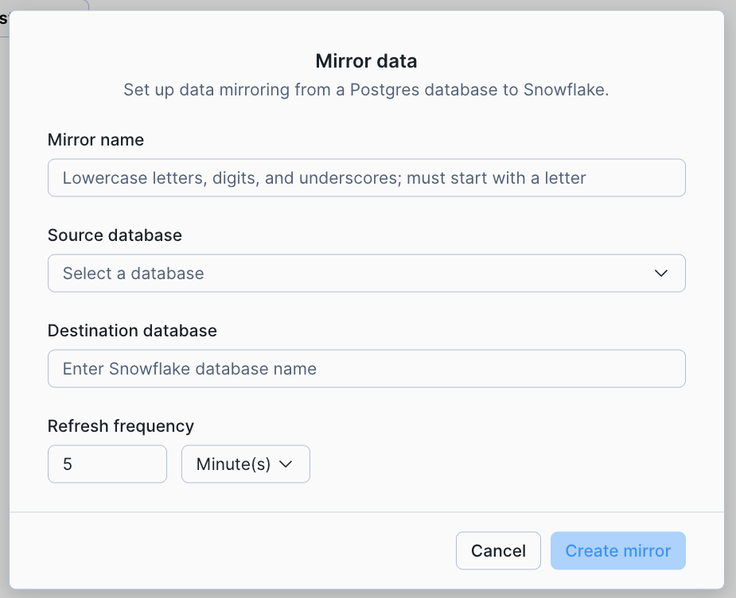

author: Elizabeth Christensen
id: snowflake-postgres-mirror-to-snowflake
categories: snowflake-site:taxonomy/solution-center/certification/quickstart, snowflake-site:taxonomy/product/platform
language: en
summary: Learn how to replicate Snowflake Postgres tables to Snowflake for analytics using a mirror
environments: web
status: Draft
feedback link: https://github.com/Snowflake-Labs/sfguides/issues
tags: Postgres

# Mirror Data from Snowflake Postgres to Snowflake
<!-- ------------------------ -->

>**Note:
>Postgres Mirror features are in preview and under rapid development. Some features may not be available.**<br>

If you have operational data in Snowflake Postgres, you can use **Postgres Mirror** to automatically replicate tables into Snowflake for analytics. Mirror uses change data capture (CDC) under the hood to keep Snowflake tables in sync with Postgres — no ETL pipelines, no external tooling, and no manual data movement.

In this quickstart, you will create an operational Postgres database with a simple IoT schema, set up Postgres Mirror to replicate those tables into Snowflake, and verify that new data flows through automatically.

### What You Will Build
- A Snowflake Postgres instance with an operational IoT database (devices, sensors, and readings)
- A Postgres Mirror that replicates selected tables into Snowflake on a schedule
- An end-to-end sync pipeline that picks up new rows, schema changes, and deletes automatically

### What You Will Learn
- How to create and connect to a Snowflake Postgres instance
- How to configure grants required for Postgres Mirror replication
- How to enable the required extensions (`pg_lake` and `snowflake_cdc`)
- How to create a mirror using SQL or the Snowflake UI
- How to verify data replication and monitor ongoing sync
- How schema changes (DDL) propagate automatically through the mirror
- How deletes replicate from Postgres to Snowflake
- How to use `$live` views for sub-minute read latency and `$changes` for a 7-day audit trail

### Prerequisites
- Access to a Snowflake account with Snowflake Postgres enabled
- A SQL client capable of connecting to Postgres (e.g., `psql`)

<!-- ------------------------ -->
## Create a Postgres Instance

Start by creating a new Snowflake Postgres instance. You will need the instance name in a later step when creating the mirror.

### Create the Instance
Create a new Snowflake Postgres instance from the Snowflake UI or SQL. If this is your first time, follow the [Getting Started with Snowflake Postgres](https://www.snowflake.com/en/developers/guides/getting-started-with-snowflake-postgres/) guide for detailed instructions. Copy and save the **instance name** — you will need it when setting up the mirror.

### Connect to the Instance
Connect to your Snowflake Postgres instance using `psql` or your preferred SQL client:

```bash
psql postgres://<user>:<password>@<instance-host>:5432/postgres
```

### Existing instances

If you already have an instance created prior to the mirroring feature, you will need to do an instance refresh from the Postgres -- Manage options. 

<!-- ------------------------ -->
## Set Up Grants for Replication

Before creating a mirror, you need to grant the required permissions in Snowflake. This grant allow the Snowflake application to administer mirrors and access your Postgres instance.

Run the following in **Snowflake**:

```sql
GRANT USAGE ON POSTGRES INSTANCE "my-instance" TO APPLICATION snowflake;
```

Replace `"my-instance"` with the name of your Postgres instance.

<!-- ------------------------ -->
## Create Postgres Tables

Now switch to your **Postgres** connection. Create a simple IoT schema with three related tables: devices, sensors, and readings.

```sql
CREATE TABLE devices (
    device_id SERIAL PRIMARY KEY,
    device_name TEXT NOT NULL,
    location TEXT,
    created_at TIMESTAMP DEFAULT NOW()
);

CREATE TABLE sensors (
    sensor_id SERIAL PRIMARY KEY,
    device_id INT REFERENCES devices(device_id),
    sensor_type TEXT NOT NULL, -- e.g., 'Temperature', 'Humidity'
    unit TEXT
);

CREATE TABLE readings (
    reading_id SERIAL PRIMARY KEY,
    sensor_id INT REFERENCES sensors(sensor_id),
    value NUMERIC(10, 2),
    ts TIMESTAMP DEFAULT NOW()
);
```

### Seed Sample Data
Populate the tables with sample IoT data — 5 devices, 2 sensors per device, and 485 sensor readings spread over the past several hours.

```sql
-- 2. Insert 5 Devices
INSERT INTO devices (device_name, location)
SELECT 
    'IoT-Gateway-' || i,
    CASE WHEN i % 2 = 0 THEN 'Warehouse-A' ELSE 'Loading-Dock' END
FROM generate_series(1, 5) AS i;

-- 3. Insert 10 Sensors (2 for each device)
INSERT INTO sensors (device_id, sensor_type, unit)
SELECT 
    d.device_id,
    s.type,
    CASE WHEN s.type = 'Temperature' THEN 'Celsius' ELSE 'Percent' END
FROM devices d
CROSS JOIN (SELECT unnest(ARRAY['Temperature', 'Humidity']) AS type) AS s;

-- 4. Insert 485 Readings
INSERT INTO readings (sensor_id, value, ts)
SELECT 
    (sample_id % 10) + 1, -- Cycles through the 10 sensors
    (random() * 40 + 10)::numeric(10,2), -- Generates a value between 10 and 50
    NOW() - (sample_id || ' minutes')::interval -- Offsets time into the past
FROM generate_series(1, 485) AS sample_id;
```

### Verify the Data
Confirm the data was inserted:

```sql
select COUNT(*) from readings;
```

You should see 485 rows.

<!-- ------------------------ -->
## Enable Extensions and Create the Mirror

### Enable Extensions
Install `pg_lake` and `snowflake_cdc` on your Postgres instance. These extensions provide the change data capture and object storage capabilities that Postgres Mirror relies on.

```sql
CREATE EXTENSION snowflake_cdc CASCADE;
```

### Create the Mirror via SQL
You can create a mirror using the `snowflake.postgres.create_mirror` procedure. This tells Snowflake which Postgres tables to replicate and how often to sync.

> **Note:** The target database in Snowflake must not already exist — the mirror will create it automatically.

Switch to **Snowflake** and run the following:

```sql
CALL snowflake.postgres.create_mirror(
    mirror_name         => 'iot_mirror',
    postgres_instance   => 'mirror-test-sql',
    postgres_database   => 'postgres',
    target_database     => 'POSTGRESMIRRORTOSNOWFLAKE',
    postgres_tables     => ['public.devices', 'public.sensors', 'public.readings'],
    postgres_schemas    => NULL,
    refresh_interval    => '1 minute'
);
```

Replace `postgres_instance` with your instance. Mirror name and target database are names you choose. 

### Create the Mirror via UI
You can also create a mirror from the Snowflake UI. Navigate to your Postgres instance and select **Manage** to configure mirroring.



There is also a Mirroring tab on the Postgres landing page . This may take a few minutes to refresh after your initial mirror creation, you can do a hard refresh.

<!-- ------------------------ -->
## Confirm Data in Snowflake

Once the mirror is created and the initial sync completes, run the following in **Snowflake** to verify that the data has arrived.

```sql
SELECT COUNT(*) FROM POSTGRESMIRRORTOSNOWFLAKE.PUBLIC.READINGS;
```

You should see 485 rows, matching the count from Postgres.

<!-- ------------------------ -->
## Add More Data and Monitor Sync

Now test that ongoing changes replicate automatically. Switch back to **Postgres** and insert 500 additional readings with varied sensor data spread over the last 24 hours.

```sql
-- Insert 500 additional readings with varied logic
INSERT INTO readings (sensor_id, value, ts)
SELECT 
    s.sensor_id,
    CASE 
        WHEN s.sensor_type = 'Temperature' THEN (20 + (random() * 15))::numeric(10,2) -- Temp: 20-35°C
        ELSE (40 + (random() * 50))::numeric(10,2)                                -- Humidity: 40-90%
    END as value,
    -- Spreads the data over the last 24 hours
    NOW() - (random() * (24 * 60) * '1 minute'::interval) as ts
FROM sensors s
CROSS JOIN generate_series(1, 50) -- 10 sensors * 50 iterations = 500 rows
ORDER BY random();
```

### Verify in Postgres
Confirm the new total in Postgres:

```sql
select COUNT(*) from readings;
```

You should see 985 rows (485 original + 500 new).

### Verify in Snowflake
Wait about a minute for the mirror to sync, then check the count in Snowflake:

```sql
SELECT COUNT(*) FROM POSTGRESMIRRORTOSNOWFLAKE.PUBLIC.READINGS;
```

The count should match 985. From this point on, any inserts, updates, or deletes in Postgres will automatically replicate to Snowflake on the configured refresh interval.

<!-- ------------------------ -->
## Schema Changes Through the Mirror

Postgres Mirror supports **schema evolution** — DDL changes on the source automatically propagate to the Snowflake target without reconfiguring the mirror.

### Add a Column

Add a `status` column to the `devices` table in **Postgres**. Tables tracked by `snowflake_cdc` don't allow `ADD COLUMN` with a `DEFAULT` clause, so add the column first, then populate existing rows:

```sql
ALTER TABLE devices ADD COLUMN status TEXT;
UPDATE devices SET status = 'active';
```

### Rename a Column

Rename the `location` column to `site_location`:

```sql
ALTER TABLE devices RENAME COLUMN location TO site_location;
```

### Verify Schema Changes in Snowflake

Wait about a minute, then confirm the updated schema in **Snowflake**:

```sql
DESCRIBE TABLE POSTGRESMIRRORTOSNOWFLAKE.PUBLIC.DEVICES;
SELECT * FROM IOT_TEST3_MIRROR.PUBLIC.DEVICES LIMIT 20;
```

You should see the new `STATUS` column and the renamed `SITE_LOCATION` column. The mirror handles these DDL changes automatically — no need to drop and recreate anything.

<!-- ------------------------ -->
## Data Deletes

Postgres Mirror replicates deletes in addition to inserts and updates. Test this by removing some rows from the source.

> **Note:** Tables must have a primary key to support `UPDATE` and `DELETE` replication. The tables in this quickstart already have primary keys defined.

### Delete Rows in Postgres

Remove all readings older than 12 hours in **Postgres**:

```sql
DELETE FROM readings WHERE ts < NOW() - INTERVAL '12 hours';
```

Check the remaining count:

```sql
SELECT COUNT(*) FROM readings;
```

### Verify Deletes in Snowflake

After the next refresh cycle, the Snowflake target table should reflect the same count:

```sql
SELECT COUNT(*) FROM POSTGRESMIRRORTOSNOWFLAKE.PUBLIC.READINGS;
```

The deleted rows are gone from the target table. If you need to see what was deleted, the `$changes` table retains a 7-day history of all changes including deletes (covered in the next section).

<!-- ------------------------ -->
## Query $live and $changes

Every mirrored table has two companion objects that give you more visibility into the data:

- **`$live`** — A view that combines the target table with not-yet-merged changes, giving sub-minute read lag regardless of the `refresh_interval`.
- **`$changes`** — A rolling 7-day change feed showing every insert, update, and delete as queryable rows.

### Use $live for Low-Latency Reads

The `$live` view lets you query the latest committed state from Postgres without waiting for the next apply run. Insert a new device in **Postgres**:

```sql
INSERT INTO devices (device_name, site_location, status)
VALUES ('IoT-Gateway-Urgent', 'Emergency-Bay', 'active');
```

Immediately query `$live` in **Snowflake** — you should see the new row within ~30 seconds, even before the next scheduled refresh:

```sql
SELECT * FROM POSTGRESMIRRORTOSNOWFLAKE.PUBLIC.DEVICES$live
ORDER BY CREATED_AT DESC
LIMIT 5;
```

Compare this with the target table, which only updates on the refresh interval:

```sql
SELECT COUNT(*) FROM POSTGRESMIRRORTOSNOWFLAKE.PUBLIC.DEVICES;
SELECT COUNT(*) FROM POSTGRESMIRRORTOSNOWFLAKE.PUBLIC.DEVICES$live;
```

A gap between these counts indicates changes are pending and will be merged on the next apply run.

> **Note:** `$live` views are not transactional. Because `$changes` rows arrive incrementally, `$live` can expose a partial transaction. For transactional consistency, query the target tables directly.

### Use $changes for Audit and Change History

The `$changes` table exposes every row-level change with metadata columns. Query recent changes to the `readings` table in **Snowflake**:

```sql
SELECT
    _commit_time,
    _change_type,
    _is_update,
    READING_ID,
    SENSOR_ID,
    VALUE
FROM POSTGRESMIRRORTOSNOWFLAKE.PUBLIC.READINGS$changes
ORDER BY _commit_lsn DESC, _lsn DESC
LIMIT 20;
```

Key columns in `$changes`:
- `_change_type`: `I` for insert, `D` for delete. Updates appear as a `D`/`I` pair.
- `_is_update`: `true` on the insert half of an update, `false` on pure inserts.
- `_commit_time`: Timestamp of the source transaction commit.
- `_data_version`: Increments on `TRUNCATE` or primary key changes — a signal to reset any downstream bookmarks.

### See the Deletes from Earlier

You can confirm the deletes you ran earlier show up in the change feed:

```sql
SELECT _change_type, COUNT(*)
FROM POSTGRESMIRRORTOSNOWFLAKE.PUBLIC.READINGS$changes
GROUP BY _change_type;
```

You should see `D` rows corresponding to the readings you deleted, and `I` rows for all the inserts.

<!-- ------------------------ -->
## Cleanup

When you're done experimenting, clean up the resources created in this quickstart.

### Drop the Mirror

Drop the mirror from **Snowflake**. Use `CASCADE` to also delete the target database:

```sql
CALL SNOWFLAKE.POSTGRES.DROP_MIRROR('iot_mirror', CASCADE => TRUE);
```

If you omit `CASCADE`, the target database is left in place and remains queryable, but it will no longer receive updates.

### Delete the Postgres Instance

Delete the Snowflake Postgres instance from Snowsight or SQL:

```sql
DROP POSTGRES INSTANCE "my-instance";
```

Replace `"my-instance"` with the name of your instance.

<!-- ------------------------ -->
## Conclusion and Resources

### Congratulations!
You have successfully set up Postgres Mirror to replicate operational data from Snowflake Postgres into Snowflake — with no external ETL pipeline required. New changes in Postgres are automatically captured and synced on a schedule, including schema changes and deletes.

### What You Learned
- How to create a Snowflake Postgres instance and connect to it
- How to configure the grants required for Postgres Mirror
- How to enable the `pg_lake` and `snowflake_cdc` extensions
- How to create a mirror using SQL or the Snowflake UI
- How to verify initial replication and monitor ongoing sync
- How schema changes (add/rename/alter columns) propagate automatically
- How deletes replicate through the mirror
- How to use `$live` for sub-minute read latency
- How to query `$changes` for a 7-day audit trail of all row-level changes

### Related Resources
- [Getting Started with Snowflake Postgres](https://www.snowflake.com/en/developers/guides/getting-started-with-snowflake-postgres/)
- [pg_lake for Snowflake Documentation](https://docs.snowflake.com/en/user-guide/snowflake-postgres/postgres-pg_lake)
- [Introducing pg_lake: Integrate Your Data Lakehouse with Postgres](https://www.snowflake.com/en/engineering-blog/pg-lake-postgres-lakehouse-integration/) (blog)
