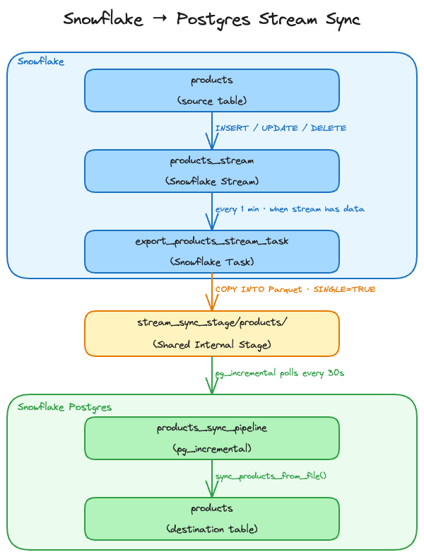

author: Brian Pace
id: snowflake-postgres-stream-snowflake-with-pglake
categories: snowflake-site:taxonomy/solution-center/certification/quickstart, snowflake-site:taxonomy/product/platform
language: en
summary: Stream row-level changes from a Snowflake table to Snowflake Postgres using Streams, Tasks, pg_lake, and pg_incremental
environments: web
status: Published
feedback link: https://github.com/Snowflake-Labs/sfguides/issues

# Stream Snowflake Changes to Postgres with pg_lake
<!-- ------------------------ -->
## Overview

### What You Will Build

This quickstart demonstrates how to build an automated pipeline that streams row-level changes (INSERT, UPDATE, DELETE) from a Snowflake table down to a Snowflake Postgres table. Changes made in Snowflake are exported as Parquet files to a shared internal stage by a scheduled Task, then detected and merged into Postgres by a `pg_incremental` pipeline — with no S3 bucket, no external pipeline, and no manual intervention.

### How It Works

Snowflake Streams capture every row-level change made to a table since the stream was last consumed. A scheduled Snowflake Task reads the stream and writes the captured changes as Parquet files to a shared internal stage. On the Postgres side, `pg_incremental` polls the stage every 30 seconds and calls a sync function for each new file. The sync function reads the Parquet file using a `pg_lake` foreign table and merges each record into the local Postgres table.

### Architecture



### Stream Change Record Semantics

Snowflake streams encode all three change types using two metadata columns:

| `_action` | `_is_update` | Meaning | Postgres action |
|-----------|-------------|---------|-----------------|
| `INSERT` | `FALSE` | New row inserted | INSERT |
| `INSERT` | `TRUE` | New version of an updated row | INSERT |
| `DELETE` | `FALSE` | Row deleted | DELETE |
| `DELETE` | `TRUE` | Old version of an updated row | DELETE |

An UPDATE produces two stream records for the same `product_id` — a `DELETE` (old values) and an `INSERT` (new values), both with `_is_update=TRUE`. Crucially, a Snowflake stream reports the **net outcome** of each row between two consumes, not a full statement-by-statement history: within a single exported file, each `product_id` appears as at most a single `INSERT`, a single `DELETE`, or one `DELETE`+`INSERT` update pair. The sync function uses this guarantee to apply each file with a single set-based `MERGE`: the `_is_update` flag distinguishes a genuine deletion (`_is_update=FALSE`) from the delete-half of an update (`_is_update=TRUE`), so after filtering out the update-half deletes there is exactly one intended action per key. This makes UPDATE handling completely transparent — no row-by-row loop and no special update-detection logic is needed.

### File Ordering Guarantee

With a scheduled task writing files over time, Postgres must apply files in the order they were written to preserve data integrity. This is handled in two layers:

**Cross-run ordering** is guaranteed by one property and enforced by a sorted wrapper function:

1. **Snowflake tasks run serially.** A task never executes concurrently with itself. Each run atomically consumes the full stream snapshot and writes its file before the next run can start. All files from task run N therefore have an earlier modification timestamp than any file from task run N+1.
2. **`lake_file.list()` does not sort its results.** It passes through whatever order the object storage API returns with no sort step. `pg_incremental` also applies no sort — it builds an internal list in whatever row order the list function returns and processes files in that order. To guarantee modification-time ordering, this quickstart passes a `public.list_files_sorted` wrapper function (created in Postgres Setup Step 5) that adds `ORDER BY last_modified_time ASC`. Without this, file order would be undefined and older files could be applied after newer ones.

**Within-run ordering** is handled by using `SINGLE = TRUE` in the `COPY INTO` statement. This forces all stream records from a single task run into one file. Without this, the `COPY INTO` may split records across multiple files with no guaranteed distribution order — meaning the DELETE and INSERT halves of the same UPDATE pair could land in different files and be applied out of order, producing incorrect results. With `SINGLE = TRUE`, each task run produces exactly one file containing a complete, self-consistent batch, which the sync function processes safely in a single transaction.

### Data Model

**Snowflake `products` table:**

| Column | Type | Description |
|--------|------|-------------|
| `product_id` | INT | Primary key |
| `product_name` | VARCHAR(100) | Display name |
| `category` | VARCHAR(50) | Product category |
| `price` | NUMBER(10,2) | Current price |
| `status` | VARCHAR(20) | `active` or `discontinued` |
| `updated_at` | TIMESTAMP_NTZ | Last modified in Snowflake |

**Postgres `products` table** — same schema plus:

| Column | Type | Description |
|--------|------|-------------|
| `synced_at` | TIMESTAMP | When the row was last written by the sync pipeline |

### Prerequisites

- Snowflake account with ACCOUNTADMIN access
- Local terminal session to run `psql`
- Familiarity with SQL and basic Postgres concepts

<!-- ------------------------ -->
## Postgres Instance Setup

Create a Snowflake Postgres instance. Skip this section if you already have an instance you want to use — just substitute its name for `PG_LAB` throughout.

### Step 1: Create Network Policy

Snowflake Postgres requires a network policy to allow client connections. Replace `nnn.nnn.nnn.nnn/32` with a specific IP address or CIDR for your organization.

```sql
-- Postgres Instance Setup: Step 1 - Create Network Policy
-- Execute in: Snowsight (Snowflake)
USE ROLE ACCOUNTADMIN;

CREATE DATABASE IF NOT EXISTS pg_network_db;
CREATE SCHEMA  IF NOT EXISTS pg_network_db.pg_network;

USE SCHEMA pg_network_db.pg_network;

-- Run this to find your current IP address if needed
SELECT current_ip_address();

CREATE OR REPLACE NETWORK RULE pg_lab_ingress_rule
    TYPE       = IPV4
    VALUE_LIST = ('nnn.nnn.nnn.nnn/32')
    MODE       = POSTGRES_INGRESS
    COMMENT    = 'Allow Postgres client connections (restrict in production)';

CREATE OR REPLACE NETWORK POLICY pg_lab_network_policy
    ALLOWED_NETWORK_RULE_LIST = ('pg_lab_ingress_rule')
    COMMENT = 'Network policy for Snowflake Postgres instances';
```

### Step 2: Create Postgres Instance

```sql
-- Postgres Instance Setup: Step 2 - Create Postgres Instance
-- Execute in: Snowsight (Snowflake)

CREATE POSTGRES INSTANCE PG_LAB
    AUTHENTICATION_AUTHORITY = POSTGRES_OR_SNOWFLAKE
    COMPUTE_FAMILY           = 'STANDARD_L'
    STORAGE_SIZE_GB          = 50
    POSTGRES_VERSION         = 18
    HIGH_AVAILABILITY        = FALSE
    NETWORK_POLICY           = 'pg_lab_network_policy'
    COMMENT                  = 'Postgres instance for stream-to-postgres quickstart';
```

> **Important:** Save the username and password displayed in the `access_roles` field and the `host` value — you will need them to connect.

### Step 3: Monitor Instance Status

Wait for the instance to reach READY state before proceeding.

```sql
-- Postgres Instance Setup: Step 3 - Monitor Instance Status
-- Execute in: Snowsight (Snowflake)

SHOW POSTGRES INSTANCES;
```

### Step 4: Configure psql Connection

Set environment variables in your terminal once the instance is READY:

```bash
export PGHOST=<hostname from SHOW POSTGRES INSTANCES>
export PGPORT=5432
export PGDATABASE=postgres
export PGUSER=snowflake_admin
export PGPASSWORD=<password from CREATE POSTGRES INSTANCE output>
export PGSSLMODE=require
```

Test the connection:

```bash
psql -c "SELECT version();"
```

<!-- ------------------------ -->
## Snowflake Setup

Create the Snowflake database, table, stage, stream, and export task.

> **Role Required:** This section requires **ACCOUNTADMIN** to create the storage integration.

### Step 1: Create Database, Schema, Products Table, and Sample Data

This simulates a realistic starting point where a table already exists and contains data before the sync pipeline is set up.

```sql
-- Snowflake Setup: Step 1 - Create Database, Schema, Products Table, and Sample Data
-- Execute in: Snowsight (Snowflake)

CREATE DATABASE IF NOT EXISTS stream_lab;
CREATE SCHEMA  IF NOT EXISTS stream_lab.catalog;

USE SCHEMA stream_lab.catalog;

CREATE OR REPLACE TABLE products (
    product_id    INT            NOT NULL,
    product_name  VARCHAR(100)   NOT NULL,
    category      VARCHAR(50)    NOT NULL,
    price         NUMBER(10,2)   NOT NULL,
    status        VARCHAR(20)    NOT NULL,
    updated_at    TIMESTAMP_NTZ  DEFAULT current_timestamp(),  -- must be set on every INSERT and UPDATE; used for sync ordering
    PRIMARY KEY (product_id)
);

INSERT INTO products (product_id, product_name, category, price, status)
VALUES
    (1, 'Wireless Headphones',   'electronics',  89.99, 'active'),
    (2, 'USB-C Hub 7-Port',      'electronics',  49.99, 'active'),
    (3, 'Mechanical Keyboard',   'electronics', 129.99, 'active'),
    (4, 'Running Jacket',        'apparel',       74.99, 'active'),
    (5, 'Merino Wool Socks',     'apparel',       18.99, 'active'),
    (6, 'Trail Running Shoes',   'apparel',      119.99, 'active'),
    (7, 'Bamboo Desk Organizer', 'home',          34.99, 'active'),
    (8, 'LED Desk Lamp',         'home',          55.99, 'active');
```

### Step 2: Create Storage Integration, Stage, and Verify

The storage integration links the Snowflake internal stage to the Postgres instance's internal storage so both sides can read and write the same files.

```sql
-- Snowflake Setup: Step 2 - Create Storage Integration, Stage, and Verify
-- Execute in: Snowsight (Snowflake)
CREATE OR REPLACE STORAGE INTEGRATION pg_lab_stream_int
    TYPE              = POSTGRES_INTERNAL_STORAGE
    POSTGRES_INSTANCE = 'PG_LAB'
    ENABLED           = TRUE;

CREATE OR REPLACE STAGE stream_sync_stage
    STORAGE_INTEGRATION = pg_lab_stream_int
    RELATIVE_URL        = '/';

-- Confirm stage is accessible (returns empty result if no files yet)
LIST @stream_sync_stage/;
```

### Step 3: Create Stream and View Initial Rows

`SHOW_INITIAL_ROWS = TRUE` causes the stream to surface all existing rows as INSERT records the first time it is consumed, regardless of when those rows were inserted. This is the recommended approach when setting up sync against a table that already contains data — no separate initial-load step is needed.

`APPEND_ONLY = FALSE` captures INSERT, UPDATE, and DELETE operations going forward. Each UPDATE produces two stream records: a DELETE record (old values) and an INSERT record (new values).

```sql
-- Snowflake Setup: Step 3 - Create Stream and View Initial Rows
-- Execute in: Snowsight (Snowflake)
CREATE OR REPLACE STREAM products_stream
    ON TABLE products
    APPEND_ONLY       = FALSE
    SHOW_INITIAL_ROWS = TRUE
    COMMENT = 'Captures all changes to the products table for sync to Postgres';

-- All 8 existing rows should appear with _action = 'INSERT', _is_update = FALSE
SELECT
    METADATA$ACTION   AS _action,
    METADATA$ISUPDATE AS _is_update,
    product_id, product_name, category, price, status
FROM products_stream
ORDER BY product_id;
```

### Step 4: Create Export Procedure, Task, and Verify

`SINGLE = TRUE` and `INCLUDE_QUERY_ID = TRUE` cannot be used together — Snowflake raises a compilation error. The solution is a stored procedure that builds a timestamp-based suffix using `EXECUTE IMMEDIATE`, so each task run writes its single file with a unique time based suffix (e.g. `products/product_stream_20240115_103000.parquet`). The task then calls the procedure instead of running `COPY INTO` directly.

```sql
-- Snowflake Setup: Step 4 - Create Export Procedure, Task, and Verify
-- Execute in: Snowsight (Snowflake)
CREATE OR REPLACE PROCEDURE export_products_stream()
RETURNS STRING
LANGUAGE SQL
EXECUTE AS CALLER
AS
$$
DECLARE
    stage_path TEXT;
    row_count  INTEGER;
BEGIN
    row_count := (SELECT COUNT(*) FROM stream_lab.catalog.products_stream);

    IF (row_count = 0) THEN
        RETURN NULL;
    END IF;

    stage_path := '@stream_sync_stage/products/product_stream_'
                  || TO_CHAR(CURRENT_TIMESTAMP(), 'YYYYMMDD_HH24MISS')
                  || '.parquet';

    EXECUTE IMMEDIATE
        'COPY INTO ' || :stage_path || '
        FROM (
            SELECT
                product_id,
                product_name,
                category,
                ROUND(price * 100)::INTEGER AS price_cents,
                status,
                updated_at,
                METADATA$ACTION            AS _action,
                METADATA$ISUPDATE::BOOLEAN AS _is_update
            FROM stream_lab.catalog.products_stream
        )
        FILE_FORMAT = (TYPE = ''PARQUET'')
        SINGLE      = TRUE';

    RETURN :stage_path || ' (' || :row_count::TEXT || ' rows)';
END;
$$;

CREATE OR REPLACE TASK export_products_stream_task
    WAREHOUSE = COMPUTE_WH
    SCHEDULE  = '1 MINUTE'
WHEN
    SYSTEM$STREAM_HAS_DATA('stream_lab.catalog.products_stream')
AS
    CALL export_products_stream();

ALTER TASK export_products_stream_task RESUME;

-- Wait up to 1 minute for the task to run on schedule, then verify
-- Files land at products/product_stream_YYYYMMDD_HH24MISS.parquet
LIST @stream_sync_stage/products/;

-- Confirm the stream is now empty (task consumed the initial rows)
SELECT count(*) AS pending_changes FROM products_stream;
```

Wait up to 1 minute for the task to run. You should see a Parquet file containing a timestamp in the file name and `pending_changes = 0`.

<!-- ------------------------ -->
## Postgres Setup

Install extensions, create the products table, create the sync function, and start the `pg_incremental` pipeline.

### Step 1: Enable Extensions

[psql](https://www.postgresql.org/docs/current/app-psql.html) is the interactive terminal for PostgreSQL, allowing you to enter queries, execute SQL commands, and manage the database from the command line.

Connect to Postgres via `psql` and enable the required extensions (assumes you set the PG* environment variables from the earlier step):

```bash
psql
```

```sql
-- Postgres Setup: Step 1 - Enable Extensions
-- Execute in: psql (Postgres)
CREATE EXTENSION IF NOT EXISTS pg_lake CASCADE;
CREATE EXTENSION IF NOT EXISTS pg_cron;
CREATE EXTENSION IF NOT EXISTS pg_incremental;
```

| Extension | Purpose |
|-----------|---------|
| `pg_lake` | Reads Parquet files from the internal stage via SQL |
| `pg_cron` | In-database scheduler used by `pg_incremental` |
| `pg_incremental` | Tracks processed files and schedules new-file callbacks |

### Step 2: Create Products Table

The schema mirrors the Snowflake source table exactly, with an additional `synced_at` column to record when each row was last written by the pipeline.

```sql
-- Postgres Setup: Step 2 - Create Products Table
-- Execute in: psql (Postgres)
CREATE TABLE IF NOT EXISTS products (
    product_id    INTEGER        NOT NULL PRIMARY KEY,
    product_name  TEXT           NOT NULL,
    category      TEXT           NOT NULL,
    price         NUMERIC(10,2)  NOT NULL,
    status        TEXT           NOT NULL,
    updated_at    TIMESTAMP      NOT NULL,
    synced_at     TIMESTAMP      NOT NULL DEFAULT now()
);
```

### Step 3: Create Foreign Table

The foreign table covers all Parquet files written by the Snowflake task using a wildcard path. The `filename 'true'` option instructs `pg_lake` to include the source file path as a `_filename` column on every row, enabling the sync function to filter down to exactly one file per call.

> **Note on monetary values:** Snowflake exports `NUMBER(10,2)` columns as `DOUBLE PRECISION` in Parquet format (IEEE 754 binary float). Most decimal fractions — including common prices like `89.99` — cannot be represented exactly in binary floating point. While PostgreSQL's shortest-representation conversion handles most cases correctly, this is not guaranteed for all possible values. To eliminate this risk entirely, the Snowflake task exports `price` as integer cents (`price * 100`) and the sync function divides by 100 when inserting into Postgres. This keeps monetary values as exact integers throughout the pipeline.
>
> **Format comparison for fixed-point values:**
>
> | Format | How `NUMBER(10,2)` travels | Precision risk | Foreign table type |
> |--------|---------------------------|----------------|--------------------|
> | Parquet | Exported as `DOUBLE` (float64) | Yes — cents approach required | `INTEGER` (cents) |
> | CSV | Exported as decimal string `"89.99"` | None — exact text round-trip | `NUMERIC(10,2)` directly |
> | JSON | Exported as decimal string `89.99`, but many JSON parsers parse numbers as float64 internally | Depends on pg_lake implementation | Test before trusting `NUMERIC` |
>
> If you switch to CSV format, you can remove the cents conversion entirely — declare `price NUMERIC(10,2)` in the foreign table and remove the `price_cents` column and division from the sync function.

```sql
-- Postgres Setup: Step 3 - Create Foreign Table
-- Execute in: psql (Postgres)
CREATE FOREIGN TABLE products_stream_files (
    product_id    INTEGER,
    product_name  TEXT,
    category      TEXT,
    price_cents   INTEGER,
    status        TEXT,
    updated_at    TIMESTAMP,
    _action       TEXT,
    _is_update    BOOLEAN,
    _filename     TEXT
)
SERVER pg_lake
OPTIONS (
    path     '@STAGE/products/product_stream_*.parquet',
    format   'parquet',
    filename 'true'
);
```

### Step 4: Create Sync Function

The sync function applies a single Parquet file inside a single transaction using one set-based `MERGE` — no row-by-row loop. To understand why a single statement is sufficient (and correct), you first need to understand what a Snowflake stream actually hands you.

> **How Snowflake streams work — net outcome, not history:** A standard (delta) stream does **not** replay every DML statement applied to the source. It exposes the **net change of each row between two offsets** (the last time the stream was consumed and now). All intermediate churn for a given key is collapsed before you ever see it. Concretely, within a single consume — and therefore within a single exported file — each `product_id` appears as **at most one** of the following:
>
> | Records for a key in one file | `METADATA$ISUPDATE` (`_is_update`) | Net meaning |
> |---|---|---|
> | `INSERT` alone | `false` | net-new row |
> | `DELETE` alone | `false` | genuine removal |
> | `DELETE` + `INSERT` pair | `true` (both) | update |
>
> You can never get two independent inserts, or an unrelated delete and insert, for the same key in one file. For example, if a row is deleted and then re-inserted before the next consume, the stream nets it to a single `INSERT` (if the row was absent at the start offset) or to a `DELETE`+`INSERT` update pair (if it was present) — never to two separate events. This is why a per-key final-state resolution is always well defined.

The `_is_update` flag is the key to routing each record correctly. The important property: a `DELETE` with `_is_update = true` **always** has its partner `INSERT` in the same file (the pair is emitted atomically in one consume). So the delete-half of an update is noise — the paired `INSERT` already carries the correct final state — and only a `DELETE` with `_is_update = false` should actually remove a row.

By filtering out the update-half deletes (`_action = 'DELETE' AND _is_update = true`), the source reduces to **exactly one row per `product_id`**, each carrying a single intended action. That is precisely the shape Postgres `MERGE` needs (it cannot delete and insert the same target row in one pass), so the whole file collapses into one statement:

- **net update** and **reinsert of an existing row**: the `DELETE` is filtered out; the `INSERT` matches the existing row → `UPDATE`.
- **net insert**: no matching target row → `INSERT`.
- **net delete**: `DELETE` with `_is_update = false` matches the target row → `DELETE`.

> **Note on `updated_at`:** Because routing is decided by record *structure* (`_is_update`) rather than by ordering, `updated_at` is **not** a control key for this function — it is stored as a plain data column. Cross-file ordering is handled separately by the sorted list wrapper in Step 5 (file modification time), which sequences one file after another. Within a file there is only one net state per key, so no per-record ordering is required. Snowflake streams expose only three metadata columns — `METADATA$ACTION`, `METADATA$ISUPDATE`, and `METADATA$ROW_ID` — and `_is_update` (`METADATA$ISUPDATE`) is the one that makes this deterministic.

```sql
-- Postgres Setup: Step 4 - Create Sync Function
-- Execute in: psql (Postgres)
CREATE OR REPLACE FUNCTION sync_products_from_file(filepath TEXT)
RETURNS VOID
LANGUAGE SQL AS $$
    MERGE INTO products t
    USING (
        SELECT product_id, product_name, category, (price_cents::NUMERIC / 100)::NUMERIC(10,2) AS price,
               status, updated_at::TIMESTAMP AS updated_at, _action
        FROM   products_stream_files
        WHERE  _filename = filepath
               AND  NOT (_action = 'DELETE' AND _is_update = true)  -- drop the delete-half of updates
    ) s
    ON t.product_id = s.product_id
    WHEN MATCHED AND s._action = 'DELETE' THEN
        DELETE
    WHEN MATCHED AND s._action = 'INSERT' THEN
        UPDATE SET product_name = s.product_name,
                   category     = s.category,
                   price        = s.price,
                   status       = s.status,
                   updated_at   = s.updated_at,
                   synced_at    = now()
    WHEN NOT MATCHED AND s._action = 'INSERT' THEN
        INSERT (product_id, product_name, category, price, status, updated_at, synced_at)
        VALUES (s.product_id, s.product_name, s.category, s.price, s.status, s.updated_at, now());
$$;
```

### Step 5: Create Sorted List Wrapper and pg_incremental Pipeline

Neither `pg_lake` nor `pg_incremental` sorts file results. `pg_incremental` processes files in whatever order the list function returns them, and `lake_file.list()` passes through the object storage API order with no sort step. To guarantee that files are applied in modification-time order, create a thin SQL wrapper that adds `ORDER BY last_modified_time ASC` and pass it as the `list_function` argument.

```sql
-- Postgres Setup: Step 5 - Create Sorted List Wrapper and pg_incremental Pipeline
-- Execute in: psql (Postgres)

-- Sorted wrapper: returns files ordered by modification time ascending.
-- pg_incremental calls this with one text argument (the file pattern) and
-- reads only the path column, so additional columns are harmless.
CREATE OR REPLACE FUNCTION public.list_files_sorted(url_wildcard text,
    OUT path text,
    OUT file_size bigint,
    OUT last_modified_time timestamptz,
    OUT etag text)
RETURNS SETOF record
LANGUAGE SQL STABLE AS $$
    SELECT path, file_size, last_modified_time, etag
    FROM   lake_file.list(url_wildcard)
    ORDER BY last_modified_time ASC NULLS LAST;
$$;

-- Pipeline: polls every 30 seconds, calls sync_products_from_file per new file,
-- and processes files in modification-time order via the sorted wrapper.
SELECT incremental.create_file_list_pipeline(
    pipeline_name => 'products_sync_pipeline',
    file_pattern  => '@STAGE/products/product_stream_*.parquet',
    command       => $$SELECT sync_products_from_file($1)$$,
    list_function => 'public.list_files_sorted',
    schedule      => '30 seconds'
);
```

`pg_incremental` records every successfully processed file in `incremental.processed_files`, guaranteeing exactly-once delivery even if the pipeline restarts.

### Step 6: Monitor the Pipeline

Wait 30-60 seconds for the pipeline to detect and process the initial Parquet files written by the Snowflake task.

```sql
-- Postgres Setup: Step 6 - Monitor the Pipeline
-- Execute in: psql (Postgres)
SELECT   jobname, start_time, end_time, status, return_message
FROM     cron.job_run_details
         JOIN cron.job USING (jobid)
WHERE    jobname LIKE '%products_sync_pipeline%'
ORDER BY start_time DESC
LIMIT    10;
```

### Step 7: Verify Initial Data Loaded

All 8 products inserted in Snowflake should now be present in Postgres.

```sql
-- Postgres Setup: Step 7 - Verify Initial Data Loaded
-- Execute in: psql (Postgres)
SELECT   product_id, product_name, category, price, status, updated_at, synced_at
FROM     products
ORDER BY product_id;
```

### Step 8: Check Processed Files

```sql
-- Postgres Setup: Step 8 - Check Processed Files
-- Execute in: psql (Postgres)
SELECT *
FROM   incremental.processed_files
WHERE  pipeline_name = 'products_sync_pipeline';
```

### Step 9: Schedule Stage File Purge

`incremental.processed_files` accumulates one row per processed file and the Parquet files themselves remain on the stage indefinitely. Create a maintenance function that purges files older than a configurable number of days and schedule it with pg_cron to run daily.

**Operation order matters for safety.** If the `processed_files` row were deleted first and the stage delete then failed, pg_incremental would no longer recognise the file as processed and would apply it again on the next pipeline run, producing duplicate rows. To prevent this, the function deletes the stage file and flushes the cache *before* removing the tracking row. If `lake_file.delete` raises an error, the `processed_files` row is left intact and the file cannot be reprocessed. A per-file loop with an inner exception block isolates failures so one bad file does not abort the entire purge run — skipped files are logged as warnings.

```sql
-- Postgres Setup: Step 9 - Schedule Stage File Purge
-- Execute in: psql (Postgres)

CREATE OR REPLACE FUNCTION purge_old_sync_files(older_than_days INT DEFAULT 7)
RETURNS INT LANGUAGE plpgsql AS $$
DECLARE
    rec           RECORD;
    deleted_count INT := 0;
BEGIN
    FOR rec IN
        SELECT file_path
        FROM   incremental.processed_files
        WHERE  pipeline_name = 'products_sync_pipeline'
          AND  processed_at  < now() - (older_than_days || ' days')::interval
    LOOP
        BEGIN
            -- Stage delete first: if this fails the processed_files row is
            -- preserved and the file will not be reprocessed
            PERFORM lake_file.delete(rec.file_path);
            PERFORM lake_file_cache.remove(rec.file_path);

            -- Only remove the tracking row after the stage delete succeeds
            DELETE FROM incremental.processed_files
            WHERE  file_path = rec.file_path;

            deleted_count := deleted_count + 1;
        EXCEPTION WHEN OTHERS THEN
            RAISE WARNING 'purge_old_sync_files: skipping % — %',
                          rec.file_path, SQLERRM;
        END;
    END LOOP;

    RETURN deleted_count;
END;
$$;

-- Run daily at 03:00 UTC, retaining the last 30 days of files
SELECT cron.schedule(
    'purge-old-sync-files',
    '0 3 * * *',
    $$SELECT purge_old_sync_files(7)$$
);

-- Confirm the job is registered
SELECT jobid, jobname, schedule, active FROM cron.job ORDER BY jobid;
```

Adjust the `7` day default in the `cron.schedule` call to match your retention requirements.

<!-- ------------------------ -->
## Observe Live Sync

With both sides running, make changes in Snowflake and watch them propagate to Postgres automatically.

### Step 1: Make Changes in Snowflake

```sql
-- Observe Live Sync: Step 1 - Make Changes in Snowflake
-- Execute in: Snowsight (Snowflake)
USE SCHEMA stream_lab.catalog;

-- Update: raise product 1 price from 89.99 to 99.99
UPDATE products
SET    price = 99.99, updated_at = current_timestamp()
WHERE  product_id = 1;

-- Insert: add a new product
INSERT INTO products (product_id, product_name, category, price, status)
VALUES (9, 'Smart Water Bottle', 'home', 42.99, 'active');

-- Delete: discontinue product 5
DELETE FROM products WHERE product_id = 5;
```

### Step 2: View Pending Stream Changes

```sql
-- Observe Live Sync: Step 2 - View Pending Stream Changes
-- Execute in: Snowsight (Snowflake)
SELECT
    METADATA$ACTION   AS _action,
    METADATA$ISUPDATE AS _is_update,
    product_id, product_name, category, price, status
FROM products_stream
ORDER BY product_id;
```

You should see 5 records: 2 for the UPDATE (DELETE old + INSERT new), 1 INSERT, and 1 DELETE.

### Step 3: Wait for Task to Export Changes

The task runs every minute when the stream has data. Wait up to 1 minute, then confirm the new file appeared and the stream is empty:

```sql
-- Observe Live Sync: Step 3 - Wait for Task to Export Changes
-- Execute in: Snowsight (Snowflake)
LIST @stream_sync_stage/products/;

-- Confirm stream is empty (task consumed the changes)
SELECT count(*) AS pending_changes FROM products_stream;
```

You should see a new Parquet file in the stage and `pending_changes = 0`.

### Step 4: Verify Changes in Postgres

Within approximately 30 seconds of the Parquet file appearing, the `pg_incremental` pipeline will detect and process it. Check that all three changes arrived:

```sql
-- Observe Live Sync: Step 4 - Verify Changes in Postgres
-- Execute in: psql (Postgres)
SELECT   product_id, product_name, price, status, updated_at, synced_at
FROM     products
ORDER BY product_id;
```

Expected results:
- Product 1 (`Wireless Headphones`) price = `99.99`
- Product 5 (`Merino Wool Socks`) is absent
- Product 9 (`Smart Water Bottle`) is present

<!-- ------------------------ -->
## Cleanup

### Postgres Cleanup

```sql
-- Cleanup: Postgres Cleanup
-- Execute in: psql (Postgres)
SELECT cron.unschedule('purge-old-sync-files');

DROP FUNCTION      IF EXISTS purge_old_sync_files(INT);

SELECT incremental.drop_pipeline('products_sync_pipeline');

DROP FUNCTION      IF EXISTS sync_products_from_file(TEXT);
DROP FOREIGN TABLE IF EXISTS products_stream_files;
DROP TABLE         IF EXISTS products;

SELECT lake_file_cache.remove(path) FROM lake_file_cache.list();
```

### Snowflake Cleanup

```sql
-- Cleanup: Snowflake Cleanup
-- Execute in: Snowsight (Snowflake)
USE ROLE ACCOUNTADMIN;
USE SCHEMA stream_lab.catalog;

ALTER TASK IF EXISTS stream_lab.catalog.export_products_stream_task SUSPEND;
DROP  TASK      IF EXISTS stream_lab.catalog.export_products_stream_task;
DROP  PROCEDURE IF EXISTS stream_lab.catalog.export_products_stream();

DROP STREAM IF EXISTS stream_lab.catalog.products_stream;
DROP TABLE  IF EXISTS stream_lab.catalog.products;

REMOVE @stream_sync_stage/products/;

DROP STAGE               IF EXISTS stream_lab.catalog.stream_sync_stage;
DROP STORAGE INTEGRATION IF EXISTS PG_LAB_stream_int;

DROP SCHEMA   IF EXISTS stream_lab.catalog;
DROP DATABASE IF EXISTS stream_lab;
```

### Infrastructure Cleanup (Optional)

The Postgres instance, network policy, and network rule are preserved by the cleanup above to avoid lengthy recreation time. To fully remove all infrastructure:

```sql
-- Cleanup: Infrastructure Cleanup (Optional)
-- Execute in: Snowsight (Snowflake)
USE ROLE ACCOUNTADMIN;

DROP POSTGRES INSTANCE IF EXISTS PG_LAB;
DROP NETWORK POLICY    IF EXISTS PG_LAB_network_policy;
DROP NETWORK RULE      IF EXISTS pg_network_db.pg_network.PG_LAB_ingress_rule;
```

<!-- ------------------------ -->
## Conclusion and Resources

### What You Learned

Congratulations! You have successfully:

- Created a Snowflake Stream to capture row-level changes (INSERT, UPDATE, DELETE)
- Created a Snowflake Task that exports stream records to Parquet files on a shared internal stage
- Understood stream metadata columns (`METADATA$ACTION`, `METADATA$ISUPDATE`) and how streams report the net outcome per row across INSERT, UPDATE, and DELETE
- Written a Postgres sync function that applies each file with a single set-based `MERGE`, using `_is_update` to route each change correctly
- Used `pg_incremental` to automatically detect and process new stage files with exactly-once delivery
- Observed end-to-end sync — a change made in Snowflake appeared in Postgres within ~30 seconds

### Key Capabilities Demonstrated

| Snowflake | Snowflake Postgres |
|---|---|
| Streams for change capture | `pg_lake` foreign tables for Parquet reads |
| Tasks for scheduled export | `pg_incremental` for file-list pipelines |
| Internal stage (shared with Postgres) | `pg_cron` for in-database scheduling |
| `INCLUDE_QUERY_ID` for unique filenames | Upsert with `ON CONFLICT DO UPDATE` |

### Related Resources

- [Snowflake Streams Documentation](https://docs.snowflake.com/en/user-guide/streams-intro)
- [Snowflake Tasks Documentation](https://docs.snowflake.com/en/user-guide/tasks-intro)
- [Snowflake Postgres Documentation](https://docs.snowflake.com/en/user-guide/snowflake-postgres/about)
- [Bidirectional Data Pipelines with pg_lake - Internal Stage](en/developers/guides/snowflake-postgres-pg-lake-iot-internal-stage/)
