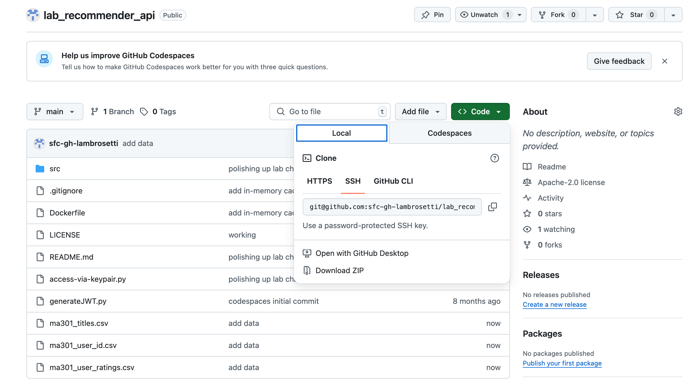
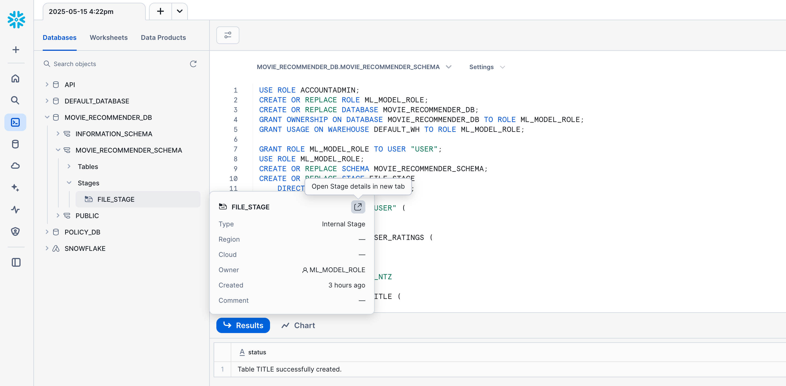
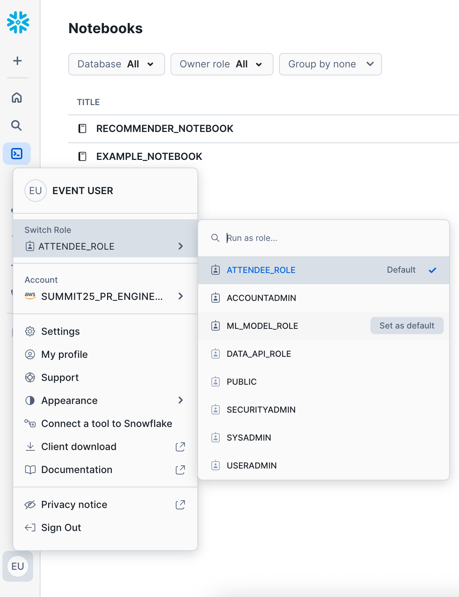
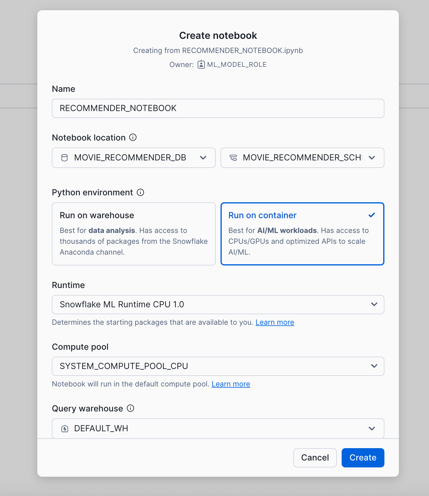
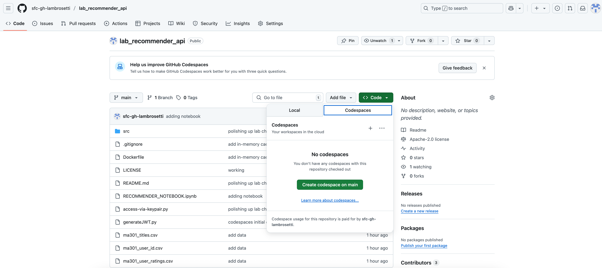

author: Luke Ambrosetti (special thanks: Aric Wang, Brian Hess, Brad Culberson)
id: snowflake-recommendation-engine
categories: snowflake-site:taxonomy/solution-center/certification/quickstart, snowflake-site:taxonomy/product/data-engineering, snowflake-site:taxonomy/product/applications-and-collaboration, snowflake-site:taxonomy/snowflake-feature/build
language: en
summary: A guide to building and running a recommendation engine in Snowflake 
environments: web
status: Published 
feedback link: https://github.com/Snowflake-Labs/sfguides/issues

# Build a Real-Time Recommendation Engine
<!-- ------------------------ -->
## Overview 

For real-time recommendations and personalization, modern mobile+web applications and marketing technology platforms often want to retrieve customer profile, product/inventory, or location data through http APIs in real-time. This tutorial will go through how to build, deploy, host, and call a custom API for these point-lookups in real-time, all powered by Snowflake.

This API consists of creating a single endpoint for customer profile data stored in Snowflake. After completing this guide, you will have built a custom API built with [Python Flask](https://flask.palletsprojects.com/) that queries a [Snowflake Hybrid Table](https://docs.snowflake.com/en/user-guide/tables-hybrid). 

Optionally, you'll be able to test this endpoint to show that these lookups with [Apache JMeter](https://JMeter.apache.org/download_JMeter.cgi) to show that you can get ~200ms or less response time (P90) on these lookups. 

For **real-time recommendations** and enhanced personalization, modern mobile and web applications, alongside marketing technology platforms, increasingly rely on retrieving customer profile, product/inventory, or location data through HTTP APIs. Delivering relevant suggestions in the moment is key to a compelling user experience. This tutorial will guide you through building, deploying, hosting, and calling a custom API for these point-lookups, all powered by Snowflake. Crucially, we'll also explore how a recommendation engine, developed within a Snowflake notebook, can leverage this data to power a better, more engaging experience for your customers directly on your website or app.

This API will feature a single endpoint for customer profile data stored in Snowflake. After completing this guide, you will have built a custom API with [Python Flask](https://flask.palletsprojects.com/) that queries a [Snowflake Hybrid Table](https://docs.snowflake.com/en/user-guide/tables-hybrid). This setup will serve as the foundation for delivering the insights generated by your Snowflake notebook-based recommendation engine.

Optionally, you'll be able to test this endpoint using [Apache JMeter](https://JMeter.apache.org/download_JMeter.cgi) to demonstrate that you can achieve approximately 200ms or less response time (P90) for these lookups – essential for real-time interactions.

The dataset for this guide is the [MovieLens 100K Dataset](https://grouplens.org/datasets/movielens/100k/) that will be loaded in as a part of this process.

### Prerequisites
- Privileges necessary to create a user, database, warehouse, compute pool, repository, network rule, external access integration, and service in Snowflake
- Access to run SQL in the Snowflake console or SnowSQL
- Basic experience using git, GitHub, and Codespaces
- Intermediate knowledge of Python

### What You’ll Learn 
- How to build a batch recommendation workflow in a Snowflake Notebook
- How to build, publish, and deploy a container with the API in Snowflake

### What You’ll Need 
- [Snowflake](https://snowflake.com) Account in an AWS or Azure commercial region
- [GitHub](https://github.com/) Account with credits for Codespaces

### What You’ll Build 
- Real-Time Recommendation Engine Powered by Snowflake


<!-- ------------------------ -->
## Download the Git Repository

**First**: Go to [GitHub](https://github.com/sfc-gh-lambrosetti/lab_recommender_api) to download the data we'll be using for this lab.



If you don't have a GitHub account, [sign up](https://github.com/signup) for one. It's required for this lab!

Unzip the data this locally on your machine - we'll come back to it later.

<!-- ------------------------ -->
## Create the Initial Objects

Login to **Snowflake** and create a `New Worksheet`. 

Copy and paste the following blocks of code into the worksheet and run them.

This creates the role, database, schema, stage, and tables for the data.

```sql
USE ROLE ACCOUNTADMIN;
CREATE OR REPLACE ROLE ML_MODEL_ROLE;
CREATE OR REPLACE DATABASE MOVIE_RECOMMENDER_DB;
GRANT OWNERSHIP ON DATABASE MOVIE_RECOMMENDER_DB TO ROLE ML_MODEL_ROLE;
GRANT USAGE ON WAREHOUSE DEFAULT_WH TO ROLE ML_MODEL_ROLE;

GRANT ROLE ML_MODEL_ROLE TO USER "USER";
USE ROLE ML_MODEL_ROLE;
CREATE OR REPLACE SCHEMA MOVIE_RECOMMENDER_SCHEMA;
CREATE OR REPLACE STAGE FILE_STAGE 
	DIRECTORY = ( ENABLE = true );
    
CREATE OR REPLACE TABLE "USER" (
    ID NUMBER
);
CREATE OR REPLACE TABLE USER_RATINGS (
    USER_ID NUMBER,
    ITEM_ID NUMBER,
    RATING NUMBER,
    "TIMESTAMP" TIMESTAMP_NTZ
);
CREATE OR REPLACE TABLE TITLE (
    ITEM_ID NUMBER,
    TITLE VARCHAR
);
```

<!-- ------------------------ -->
## Load the Data

In the database explorer, click on -> `MOVIE_RECOMMENDER_DB` -> `MOVIE_RECOMMENDER_SCHEMA` -> `Stages` -> hover over `File Stage` and click **"Open the Stage details in a new tab"**.



Click the **+Files** button to load files into the stage. Browse your local machine to find the git repo you downloaded and unzipped earlier, and choose the 3 csv files there:
- ma301_titles.csv
- ma301_user_id.csv
- ma301_user_ratings.csv

Then, go back to the **Worksheet** and run these commands to load the data into the tables we created earlier:

```sql
COPY INTO "USER" FROM @file_stage
MATCH_BY_COLUMN_NAME = CASE_INSENSITIVE
FILE_FORMAT = (TYPE = CSV FIELD_DELIMITER = ',' PARSE_HEADER = true)
FILES = ('ma301_user_id.csv');

COPY INTO USER_RATINGS FROM @file_stage
MATCH_BY_COLUMN_NAME = CASE_INSENSITIVE
FILE_FORMAT = (TYPE = CSV FIELD_DELIMITER = ',' PARSE_HEADER = true)
FILES = ('ma301_user_ratings.csv');

COPY INTO TITLE FROM @file_stage
MATCH_BY_COLUMN_NAME = CASE_INSENSITIVE
FILE_FORMAT = (TYPE = CSV FIELD_DELIMITER = ',' PARSE_HEADER = true FIELD_OPTIONALLY_ENCLOSED_BY = '"')
FILES = ('ma301_titles.csv');

select * from user;
select * from user_ratings;
select * from title;
```

## Load / Run the Notebook

On the left nav, go to `Projects` -> `Notebooks` - we'll create a new notebook via the import method.

**IMPORTANT: While on this page, change your role from the current role to the new `ML_MODEL_ROLE`**



After changing your role, on the top right click the **down arrow** *next* to the +Notebook button. Click `import .ipynb file`.

Select the "RECOMMENDER_NOTEBOOK.ipynb" from the git repo you downloaded and unzipped earlier. 



**IMPORTANT: Make sure you select "Run on container" as the Python environment.**

For the next few steps, you won't need this guide - follow the cells in the notebook and come back to this when you're finished!

<!-- ------------------------ -->
## Set up a Warehouse

The API needs a warehouse to query the data to return to the caller. To create the database and warehouse, connect to Snowflake and run the following commands in the Snowflake console or using SnowSQL:

```sql
USE ROLE ACCOUNTADMIN;
CREATE WAREHOUSE DATA_API_WH WITH WAREHOUSE_SIZE='xsmall';
```

### Create the Application Role in Snowflake

The API will run as a new role with minimal priviledges. To create the role, connect to Snowflake and run the following SQL statements to create the role and grant it access to the data needed for the application.

```SQL
USE ROLE ACCOUNTADMIN;
CREATE ROLE DATA_API_ROLE;

GRANT USAGE ON WAREHOUSE DATA_API_WH TO ROLE DATA_API_ROLE;

GRANT ROLE DATA_API_ROLE TO ROLE ACCOUNTADMIN;
```

### Creating the Image Registry and Hybrid Table

The API needs the underlying data to be indexed to a Hybrid table. While we're here, we'll also create the image registry for the image that we'll create in a later step.

```sql
USE ROLE ACCOUNTADMIN;
CREATE DATABASE API;
CREATE SCHEMA DATA;

GRANT ALL ON DATABASE API TO ROLE DATA_API_ROLE;
GRANT ALL ON SCHEMA API.PUBLIC TO ROLE DATA_API_ROLE;
GRANT ALL ON SCHEMA API.DATA TO ROLE DATA_API_ROLE;
GRANT ALL ON DATABASE MOVIE_RECOMMENDER_DB TO ROLE DATA_API_ROLE;
GRANT ALL ON SCHEMA MOVIE_RECOMMENDER_DB.MOVIE_RECOMMENDER_SCHEMA TO ROLE DATA_API_ROLE;
GRANT ALL ON TABLE MOVIE_RECOMMENDER_DB.MOVIE_RECOMMENDER_SCHEMA.MOVIE_RECOMMENDATIONS TO ROLE DATA_API_ROLE;

USE ROLE DATA_API_ROLE;
CREATE OR REPLACE HYBRID TABLE hybrid_movie_recommendations (
  user_id NUMBER(38,0) PRIMARY KEY,
    recommendations variant
) AS
SELECT 
  "user_id",
  "recommendations"
FROM MOVIE_RECOMMENDER_DB.MOVIE_RECOMMENDER_SCHEMA.MOVIE_RECOMMENDATIONS;

USE ROLE ACCOUNTADMIN;
USE DATABASE API;
USE SCHEMA PUBLIC;

CREATE OR REPLACE IMAGE REPOSITORY API;

GRANT READ ON IMAGE REPOSITORY API TO ROLE DATA_API_ROLE;

SHOW IMAGE REPOSITORIES;
```

Note the `repository_url` in the response as that will be needed in the next step.

<!-- ------------------------ -->
## Set up Dev Environment

The code used in this guide is hosted in github. You will need a new Codespace from the GitHub [repository](https://github.com/sfc-gh-lambrosetti/lab_recommender_api).

To create a new codespace, browse to the GitHub [repository](https://github.com/sfc-gh-lambrosetti/lab_recommender_api) in a browser. You will need to login to GitHub if you are not already logged in to access Codespaces. After logging in, click on the green "<> Code" button and "create codespace on main" button.



You will then be redirected into Codespaces where your development environment will load and all code from GitHub will be loaded in the project.

### Endpoint
The API creates a single endpoint using the Snowflake connector:

`https://host/customer/CUST_ID`

Which takes the following required path parameter:

`CUST_ID` - the customer ID. This is a unique customer identifier for you customer. This guide uses a numeric ID; however, alphanumeric is also acceptable.

### Code

**NOTE: No coding or actions necessary as a part of this section - this is for your review and understanding only!**

The `src/` directory has all the source code for the API. The `app.py` file contains the main entrypoint for the API endpoint, `get_customer()`, using the Snowflake Connector for Python. The function retrieves a single, or multiple comma-separated, customer(s) from the `hybrid_movie_recommendations` table. Review the code and the SQL needed to retrieve the data from Snowflake and serialize it to JSON for the response.

```python
@app.route('/customer/<cust_id>')
@cache.memoize(timeout=180)
def get_customer(cust_id):
    sql_string = '''
        SELECT
            USER_ID,
            RECOMMENDATIONS
        FROM api.data.hybrid_movie_recommendations
        WHERE USER_ID in ({cust_id});
    '''
    sql = sql_string.format(cust_id=cust_id)
    try:
        res = conn.cursor(DictCursor).execute(sql)
        return make_response(jsonify(res.fetchall()))
    except:
        abort(500, "Error reading from Snowflake. Check the QUERY_HISTORY for details.")
```

You'll notice that an in-memory cache is used to cache responses for 180 seconds (3 minutes). This is because:
  1. It's assumed that this data will not change very often (e.g. every 30-60 minutes).
  2. A cache layer is needed because of the use-case and to reduce strain on the database (e.g. repeat calls to the same endpoint with the same ID)
  3. A caching mechanism is not possible from the caller

Later on, we'll have the opportunity to test the endpoint with and without the in-memory cache.

While this is only a single endpoint, you can easily add other endpoints as well. Check out how to create other endpoints in a similar version to this guide [here](https://github.com/sfc-gh-bculberson/lab_data_api_python).

<!-- ------------------------ -->
## Build and Push Container

To create the application container, we will leverage docker. The Dockerfile is based on python 3.8 and installs the required libraries needed for the application as well as the code. To create the docker container, run this command in the terminal provided by **Codespaces**:
```bash
docker build -t papi .
```

Go back to **Snowflake** and grab the repository URL. You can use this command to find it:

```sql
SHOW IMAGE REPOSITORIES;
```

Back in **Codespaces**, run the following command in the terminal, replacing the `{repository_url}` with your repository in the previous step, to login to the container repository. You will be prompted for your Snowflake username and password to login to your repository. If you're running this in a Snowflake Hands on Lab, use the password that was initially provided to you.

```bash
docker login {repository_url}
docker build -t {repository_url}/papi .
docker push {repository_url}/papi
```

<!-- ------------------------ -->
## Create the Compute Pool

To create the compute pool to run the application, go back to **Snowflake** and run the following command in the Snowflake console or using SnowSQL:

```sql

USE ROLE ACCOUNTADMIN;

CREATE COMPUTE POOL API
  MIN_NODES = 1
  MAX_NODES = 5
  INSTANCE_FAMILY = CPU_X64_XS;

GRANT USAGE ON COMPUTE POOL API TO ROLE DATA_API_ROLE;
GRANT MONITOR ON COMPUTE POOL API TO ROLE DATA_API_ROLE;

```

<!-- ------------------------ -->
## Create the Container Service

To create the service to host the application, connect to Snowflake and run the following command in the Snowflake console or using SnowSQL.

```sql

USE ROLE ACCOUNTADMIN;
GRANT BIND SERVICE ENDPOINT ON ACCOUNT TO ROLE DATA_API_ROLE;

CREATE SECURITY INTEGRATION IF NOT EXISTS SNOWSERVICES_INGRESS_OAUTH 
TYPE=oauth
OAUTH_CLIENT=snowservices_ingress
ENABLED=true;

USE ROLE DATA_API_ROLE;
CREATE SERVICE API.PUBLIC.API
 IN COMPUTE POOL API
 FROM SPECIFICATION  
$$
spec:
  container:
  - name: api
    image: /api/public/api/papi:latest
  endpoint:
  - name: api
    port: 8001
    public: true
$$
QUERY_WAREHOUSE = DATA_API_WH;

```

It will take a few minutes for your service to initialize, you can check status with these commands:

```sql
CALL SYSTEM$GET_SERVICE_STATUS('api');
CALL SYSTEM$GET_SERVICE_LOGS('api.public.api', 0, 'api');
```

After your service has started, you can get the endpoints with this command:

```sql
SHOW ENDPOINTS IN SERVICE API;
```

The endpoint generation will take 2-3 minutes, while you wait, go ahead and check to make sure you can select from the Hybrid Table:

```sql
USE ROLE DATA_API_ROLE;
SELECT * FROM HYBRID_MOVIE_RECOMMENDATIONS WHERE USER_ID = 22;
```

Check the endpoint again when you're ready to see if it's finished:

```sql
SHOW ENDPOINTS IN SERVICE API;
```

Make note of the ingress_url as that will be needed to test the application. This service will start the API, running at `https://{INGRESS_URL}`.


<!-- ------------------------ -->
## Test the API

To verify the API is online, go to the `https://{INGRESS_URL}` in your browser. You will be asked to authenticate to Snowflake and be given the root content: 

```json
{"result":"Nothing to see here"}
```

### Testing using a webpage
This project comes with a simple webpage that allows you to test the API. To get to it, open `https://{INGRESS_URL}/test` in a web browser.

There is a form that allows you to test retrieval of a customer. Use one of the USER_IDs from the last time you ran the SQL.

When you hit the `Submit` button, the API endpoint is called and the data is returned to the web page.

**Note: The first time you try this, it might take 1-3 seconds because the virtual warehouse needs to start. Afterwards, you should not see this latency.**

<!-- ------------------------ -->
## Call the API programmatically

### Create the user and generate the Snowflake Token

For this next step, go back to **codespaces** - we'll need to create a Snowflake service user to programmatically call the API. This user will need to authenticate with key-pair authentication - let's generate the RSA private key:

```bash
openssl genrsa 2048 | openssl pkcs8 -topk8 -inform PEM -out rsa_key.p8 -nocrypt
```

Then generate public key:

```bash
openssl rsa -in rsa_key.p8 -pubout -out rsa_key.pub
```

And finally print the key to use on the new Snowflake service user:

```bash
awk 'NF {sub(/-----.*-----/, ""); printf "%s", $0} END {print ""}' rsa_key.pub
```

Go ahead and copy the above public key output, as you'll need to paste it into the `RSA_PUBLIC_KEY` below when you create the user in Snowflake:

```sql
USE ROLE ACCOUNTADMIN;
CREATE USER SVC_DATA_API TYPE = SERVICE DEFAULT_ROLE = DATA_API_ROLE RSA_PUBLIC_KEY = 'MIIB...';
GRANT ROLE DATA_API_ROLE TO USER SVC_DATA_API;
```

Great! Now, we'll need to generate a token to call the API, this is a 2 step process:
  1. Generate a JWT (JSON Web Token) using your key-pair
  2. Use the JWT to generate a Snowflake Token

Luckily, we have some helper scripts to do that for you. 

Back in **codespaces**, here's what you need to run:

*Note, if using codespaces, you'll want to install a couple of packages first:
```bash
pip install cryptography
pip install pyjwt
```

Then replace the bracketed variables here with their values and run the script.

```bash
python3 access-via-keypair.py \
--account {account-identifier} \
--user SVC_DATA_API \
--role DATA_API_ROLE \
--private_key_file_path rsa_key.p8 \
--endpoint {ingress-url}
```

- **ACCOUNT-IDENTIFIER** is your ACCOUNT-IDENTIFIER *or* LOCATOR + REGION (e.g. ABC1234.CA-CENTRAL-1.AWS). Find more info about that [here](https://docs.snowflake.com/en/user-guide/admin-account-identifier#non-vps-account-locator-formats-by-cloud-platform-and-region).
  Note*: Locator is usually not recommended; however, it's the only thing that works with Snowflake Hands on Lab accounts. Try with your true "account identifier", otherwise, revert to the locator + region approach.
- **INGRESS-URL** is the `{INGRESS_URL}` from earlier. In case you need a way to find it again, run this in Snowflake or SnowSQL:

```sql
-- ACCOUNT_LOCATOR
SELECT CURRENT_ACCOUNT_LOCATOR();

-- INGRESS-URL
SHOW ENDPOINTS IN SERVICE API;
```

Now, run the helper script by copy+paste into codespaces, and you should get a Snowflake Token in the response, printed in the codespaces terminal. Copy that for the next step. This Snowflake Token will be available for use for the next 59 minutes. Afterwards, you'll need to generate a new token by running the same script.

If you want more details on how the JWT get and Snowflake Token get generated, and to get the full helper scripts, visit these [docs](https://docs.snowflake.com/en/developer-guide/snowpark-container-services/tutorials/tutorial-1#optional-access-the-public-endpoint-programmatically).

### Test using cURL or Postman

You can test this from codespaces, or your terminal locally (remember to use `bash` if you're in zsh):

```bash
curl --location 'https://{INGRESS_URL}/customer/22' \
--header 'Authorization: Snowflake Token="<SNOWFLAKE_TOKEN>"' \
--header 'Content-Type: application/x-www-form-urlencoded'
```

Alternatively, you can test with [Postman](https://www.postman.com/downloads/).

When testing individual calls, remember that performance might be slightly higher than you expect. It's why I recommend testing under some load with JMeter.

<!-- ------------------------ -->
## (Optional) Test with JMeter 

Disclaimer: This performance testing is supposed to be directional in nature - don't think of it as "true" performance testing.

First, install Apache JMeter. If you're on a Mac, it's easiest to do this with Homebrew via

```bash
brew install jmeter

#after installation
jmeter
```

Otherwise, check the [download page](https://JMeter.apache.org/download_JMeter.cgi).

From the github repo, download the Test Plan `snow_papi.jmx` and the `cust_ids.csv` files locally. 

After starting JMeter, select `File` and then `Open`, and select `snow_papi.jmx`. This is the test plan that you'll use for JMeter. You'll need to change the following configurations to the test plan:
  1. In the left nav, under "Test Personalization API", click `HTTP Request` and replace the `{INGRESS_URL}` with the endpoint URL. You can copy/paste from your cURL or Postman test earlier.
  2. In the "HTTP Header Manager", replace `<Snowflake TOKEN>` with the correct Token. You can also copy/paste this from the cURL/Postman test earlier.
  3. In the "Customer ID Test Set Config", change the `Filename` path to be the correct path for the `cust_ids.csv` file that you downloaded earlier.

After that, you should be able to hit the green arrow (play button) at top to start/run! You can click "Aggregate Graph", select  multiple check boxes for Median, 90% line, 95% line, and 99% line to compare, and the `Graph` tab to look at the actual bar chart.

A quick note - while we load an in-memory cache as part of the app, this test set is set by default *to not use* the cache at all. To see performance with the cache, go back to "Customer ID Test Set Config", and turn `Sharing Mode` to "Current Thread". If you decide to try this, don't forget to stop the exist testing, right-click the "Results Tree" and "Aggregate Graph" to `clear` out captured results before testing again!

<!-- ------------------------ -->
## Stop the API

To stop the API, you can suspend the service. From the Snowflake console or SnowSQL, run:

```sql
USE ROLE DATA_API_ROLE;
ALTER SERVICE API.PUBLIC.API SUSPEND;
```

<!-- ------------------------ -->
## Cleanup

To fully remove everything you did today you only need to drop some objects in your Snowflake account. From the Snowflake console or SnowSQL, as `ACCOUNTADMIN` run:
```SQL
USE ROLE ACCOUNTADMIN;

DROP DATABASE IF EXISTS API;
DROP USER IF EXISTS SVC_DATA_API;
DROP ROLE IF EXISTS DATA_API_ROLE;
DROP COMPUTE POOL IF EXISTS API;
DROP WAREHOUSE IF EXISTS DATA_API_WH;

DROP DATABASE IF EXISTS MOVIE_RECOMMENDER_DB
```

<!-- ------------------------ -->
## Conclusion and Resources

### Conclusion

You've successfully built a custom Personalization API in Python powered by Snowflake Hybrid Tables and Snowpark Container Services. 

When you go to put an API into production you should think about how you'll generate new tokens over time, and use a more production-ready cache like Redis, which can also be hosted with Snowpark Container Serivces.

To get more comfortable with this solution, implement new endpoints with new datasets, like products, store locations, or other catalog data.

### What You Learned
- How to configure and build a custom point-lookup API Powered by Snowflake
- How to test the API from your local machine

### Resources

If you want to build a Data API using Snowflake standard tables for analytical queries, be sure to check out the previous version of this [here](https://github.com/sfc-gh-bculberson/lab_data_api_python). 
