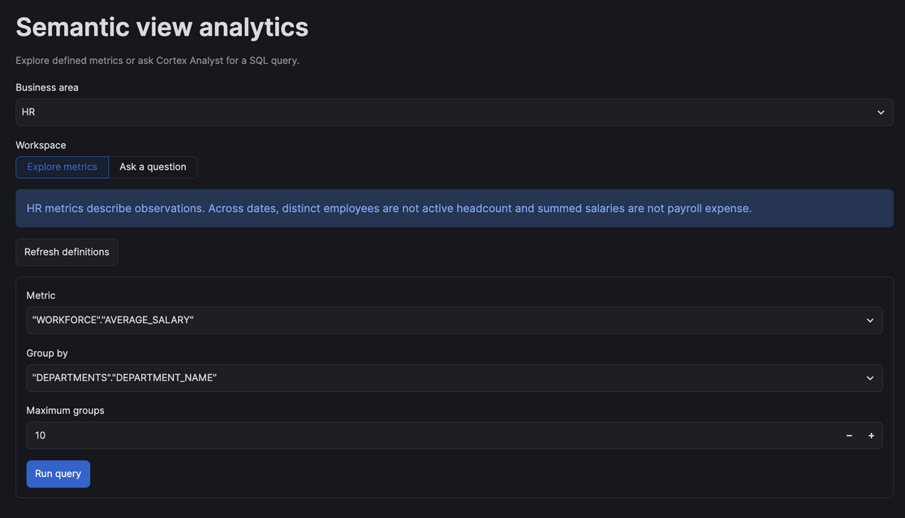
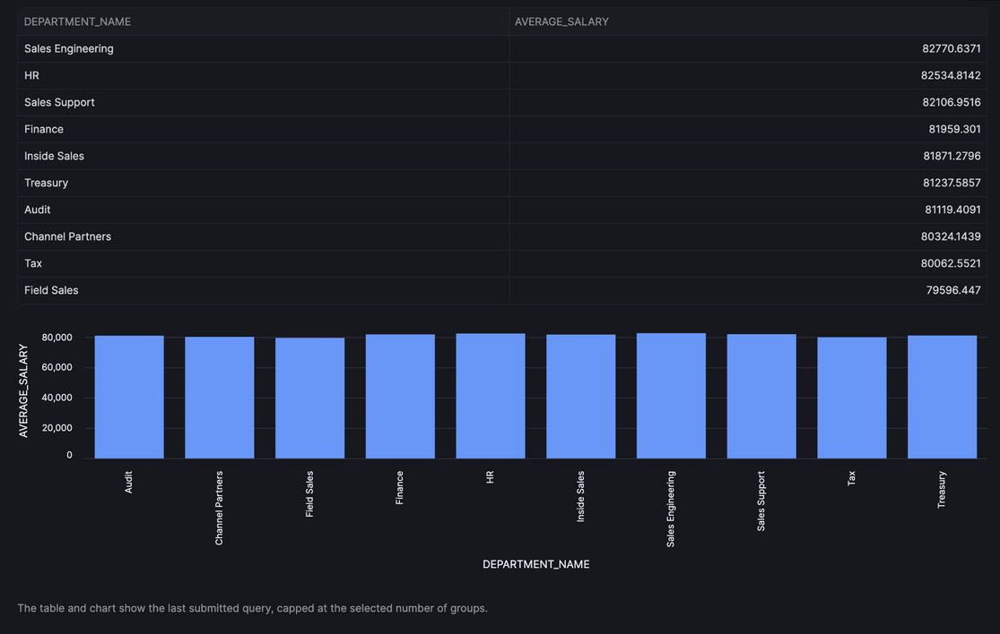
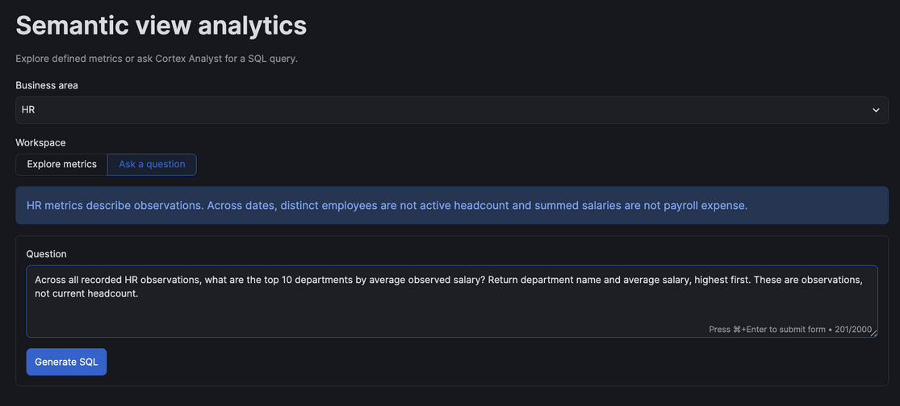
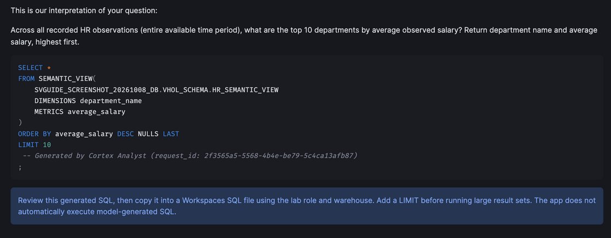

author: Chanin Nantasenamat, Josh Klahr
id: snowflake-semantic-view-agentic-analytics
categories: snowflake-site:taxonomy/product/ai, snowflake-site:taxonomy/product/analytics, snowflake-site:taxonomy/solution-center/certification/quickstart
language: en
summary: Learn how to build business-friendly semantic views over an enterprise data warehouse and enable cross-functional, AI-powered natural language querying using Snowflake Cortex Analyst and Snowflake Intelligence Agents. 
environments: web
status: Published
feedback link: https://github.com/Snowflake-Labs/sfguides/issues


 # Build Agentic Analytics with Semantic Views

 ## Overview

 In this hands-on lab, you'll build business-friendly semantic views on top of enterprise data warehouses and enhance them with AI-powered natural language querying through Cortex Analyst. You'll create intelligent agents using Snowflake Intelligence that can answer cross-functional business questions by automatically routing queries across Sales, Marketing, Finance, and HR semantic views.

 This guide covers creating a comprehensive data foundation, deploying semantic views manually and using AI assistance (Semantic View Autopilot), querying them using Semantic SQL and Cortex Analyst, and finally deploying a cross-functional intelligent agent using Snowflake Intelligence.

 ### What You'll Learn
 - Build a comprehensive data foundation with dimension and fact tables.
 - Create business-friendly Semantic Views for Sales, Marketing, and Finance domains.
 - Use Semantic View Autopilot (SVA) to AI-generate and enhance semantic views for HR.
 - Query Semantic Views using Cortex Analyst (natural language querying).
 - Deploy a cross-functional Intelligent Agent using Snowflake Intelligence.

 ### What You'll Build
 You will build a complete Agentic Analytics solution including:
 * **Data Foundation**: 13 dimension tables, 4 fact tables, Salesforce CRM integration
 * **Semantic Views**: Business-friendly layers for Sales, Marketing, Finance & HR
 * **AI Enhancement**: Auto-generate semantic views using Semantic View Autopilot
 * **Natural Language Querying**: Query data with plain English via Cortex Analyst
 * **Interactive Apps**: Streamlit visualizations and chat interfaces
 * **Intelligent Agents**: Cross-functional AI agents for business analytics

 ### Prerequisites
 - A Snowflake account.
 - Access to the Snowsight interface (web environment).
 - Account Administrator (`ACCOUNTADMIN`) role access for initial setup.


## Setup
### Load the Base Data

Run the SQL in this guide in **Projects > Workspaces > SQL file**, in section order. Use a fresh, non-production lab: the original setup below replaces named resources and changes user defaults. Review those statements before execution and do not run them against resources used by others.

The [companion folder](https://github.com/Snowflake-Labs/snowflake-demo-notebooks/tree/main/snowflake-semantic-view-agentic-analytics) also provides a separate scripted path: [01_setup.sql](https://github.com/Snowflake-Labs/snowflake-demo-notebooks/blob/main/snowflake-semantic-view-agentic-analytics/sql/01_setup.sql) loads the public data, [02_semantic_views.sql](https://github.com/Snowflake-Labs/snowflake-demo-notebooks/blob/main/snowflake-semantic-view-agentic-analytics/sql/02_semantic_views.sql) creates three compact baseline views, and [03_hr_baseline.sql](https://github.com/Snowflake-Labs/snowflake-demo-notebooks/blob/main/snowflake-semantic-view-agentic-analytics/sql/03_hr_baseline.sql) supplies an HR baseline instead of Autopilot. [04_semantic_query.sql](https://github.com/Snowflake-Labs/snowflake-demo-notebooks/blob/main/snowflake-semantic-view-agentic-analytics/sql/04_semantic_query.sql) queries the companion marketing view. These are an alternative to the corresponding inline setup, view and query blocks below, not duplicate steps; their semantic definitions differ. Choose one path and do not mix their view definitions or queries.

For either path, finish the data and four views first. Next, complete or skip the two **Optional** enrichment sections, run the separate Streamlit app, and then create and test the agent. On the companion path, [05_agent.sql](https://github.com/Snowflake-Labs/snowflake-demo-notebooks/blob/main/snowflake-semantic-view-agentic-analytics/sql/05_agent.sql) replaces the inline agent setup. Run the optional notebook before cleanup; it is not required by the app or agent. The setup loads the sample data directly, so no manual CSV download is needed.

This creates a comprehensive data warehouse supporting cross-functional analytics across Sales, Marketing, Finance, and HR domains.

**Dimension Tables (13):**
- `product_category_dim`
- `product_dim`
- `vendor_dim`
- `customer_dim`
- `account_dim`
-  `department_dim`
-  `region_dim`
-  `sales_rep_dim`
- `campaign_dim`
- `channel_dim`
-  `employee_dim`
-  `job_dim`
-  `location_dim`
    
**Fact Tables (4):**
- `sales_fact` - Sales transactions with amounts and units (12,000 records)
- `finance_transactions` - Financial transactions across departments
- `marketing_campaign_fact` - Campaign performance metrics with product targeting
- `hr_employee_fact` - Employee data with salary and attrition (5,640 records)

**Salesforce CRM Tables (3):**
- `sf_accounts` - Customer accounts linked to customer_dim (1,000 records)
- `sf_opportunities` - Sales pipeline and revenue data (25,000 records)
- `sf_contacts` - Contact records with campaign attribution (37,563 records)


```
--- This script borrows heavily from the Snowflake Intelligence end to end demo here: https://github.com/NickAkincilar/Snowflake_AI_DEMO

--- should take around 2 minutes to run completely


 -- Switch to accountadmin role to create warehouse
    USE ROLE accountadmin;

    -- Enable Snowflake Intelligence by creating the Config DB & Schema
    CREATE DATABASE IF NOT EXISTS agentic_analytics_vhol;
    CREATE SCHEMA IF NOT EXISTS agentic_analytics_vhol.agents;
    
    -- Allow anyone to see the agents in this schema
    GRANT USAGE ON DATABASE agentic_analytics_vhol TO ROLE PUBLIC;
    GRANT USAGE ON SCHEMA agentic_analytics_vhol.agents TO ROLE PUBLIC;


    create or replace role agentic_analytics_vhol_role;


    SET current_user_name = CURRENT_USER();
    
    -- Step 2: Use the variable to grant the role
    GRANT ROLE agentic_analytics_vhol_role TO USER IDENTIFIER($current_user_name);
    GRANT CREATE DATABASE ON ACCOUNT TO ROLE agentic_analytics_vhol_role;
    
    -- Create a dedicated warehouse for the demo with auto-suspend/resume
    CREATE OR REPLACE WAREHOUSE agentic_analytics_vhol_wh 
        WITH WAREHOUSE_SIZE = 'XSMALL'
        AUTO_SUSPEND = 300
        AUTO_RESUME = TRUE;


    -- Grant usage on warehouse to admin role
    GRANT USAGE ON WAREHOUSE agentic_analytics_vhol_wh TO ROLE agentic_analytics_vhol_role;


  -- Alter current user's default role and warehouse to the ones used here
    ALTER USER IDENTIFIER($current_user_name) SET DEFAULT_ROLE = agentic_analytics_vhol_role;
    ALTER USER IDENTIFIER($current_user_name) SET DEFAULT_WAREHOUSE = agentic_analytics_vhol_wh;
    

    -- Switch to SF_Intelligence_Demo role to create demo objects
    use role agentic_analytics_vhol_role;
  
    -- Create database and schema
    CREATE OR REPLACE DATABASE SV_VHOL_DB;
    USE DATABASE SV_VHOL_DB;

    CREATE SCHEMA IF NOT EXISTS VHOL_SCHEMA;
    USE SCHEMA VHOL_SCHEMA;

    -- Create file format for CSV files
    CREATE OR REPLACE FILE FORMAT CSV_FORMAT
        TYPE = 'CSV'
        FIELD_DELIMITER = ','
        RECORD_DELIMITER = '\n'
        SKIP_HEADER = 1
        FIELD_OPTIONALLY_ENCLOSED_BY = '"'
        TRIM_SPACE = TRUE
        ERROR_ON_COLUMN_COUNT_MISMATCH = FALSE
        ESCAPE = 'NONE'
        ESCAPE_UNENCLOSED_FIELD = '\134'
        DATE_FORMAT = 'YYYY-MM-DD'
        TIMESTAMP_FORMAT = 'YYYY-MM-DD HH24:MI:SS'
        NULL_IF = ('NULL', 'null', '', 'N/A', 'n/a');


use role accountadmin;
    -- Create API Integration for GitHub (public repository access)
    CREATE OR REPLACE API INTEGRATION git_api_integration
        API_PROVIDER = git_https_api
        API_ALLOWED_PREFIXES = ('https://github.com/NickAkincilar/')
        ENABLED = TRUE;


GRANT USAGE ON INTEGRATION GIT_API_INTEGRATION TO ROLE agentic_analytics_vhol_role;


use role agentic_analytics_vhol_role;
    -- Create Git repository integration for the public demo repository
    CREATE OR REPLACE GIT REPOSITORY AA_VHOL_REPO
        API_INTEGRATION = git_api_integration
        ORIGIN = 'https://github.com/NickAkincilar/Snowflake_AI_DEMO.git';

    -- Create internal stage for copied data files
    CREATE OR REPLACE STAGE INTERNAL_DATA_STAGE
        FILE_FORMAT = CSV_FORMAT
        COMMENT = 'Internal stage for copied demo data files'
        DIRECTORY = ( ENABLE = TRUE)
        ENCRYPTION = (   TYPE = 'SNOWFLAKE_SSE');

    ALTER GIT REPOSITORY AA_VHOL_REPO FETCH;

    -- ========================================================================
    -- COPY DATA FROM GIT TO INTERNAL STAGE
    -- ========================================================================

    -- Copy all CSV files from Git repository demo_data folder to internal stage
    COPY FILES
    INTO @INTERNAL_DATA_STAGE/demo_data/
    FROM @AA_VHOL_REPO/branches/main/demo_data/;


    COPY FILES
    INTO @INTERNAL_DATA_STAGE/unstructured_docs/
    FROM @AA_VHOL_REPO/branches/main/unstructured_docs/;

    -- Verify files were copied
    LS @INTERNAL_DATA_STAGE;

    ALTER STAGE INTERNAL_DATA_STAGE refresh;

  

    -- ========================================================================
    -- DIMENSION TABLES
    -- ========================================================================

    -- Product Category Dimension
    CREATE OR REPLACE TABLE product_category_dim (
        category_key INT PRIMARY KEY,
        category_name VARCHAR(100) NOT NULL,
        vertical VARCHAR(50) NOT NULL
    );

    -- Product Dimension
    CREATE OR REPLACE TABLE product_dim (
        product_key INT PRIMARY KEY,
        product_name VARCHAR(200) NOT NULL,
        category_key INT NOT NULL,
        category_name VARCHAR(100),
        vertical VARCHAR(50)
    );

    -- Vendor Dimension
    CREATE OR REPLACE TABLE vendor_dim (
        vendor_key INT PRIMARY KEY,
        vendor_name VARCHAR(200) NOT NULL,
        vertical VARCHAR(50) NOT NULL,
        address VARCHAR(200),
        city VARCHAR(100),
        state VARCHAR(10),
        zip VARCHAR(20)
    );

    -- Customer Dimension
    CREATE OR REPLACE TABLE customer_dim (
        customer_key INT PRIMARY KEY,
        customer_name VARCHAR(200) NOT NULL,
        industry VARCHAR(100),
        vertical VARCHAR(50),
        address VARCHAR(200),
        city VARCHAR(100),
        state VARCHAR(10),
        zip VARCHAR(20)
    );

    -- Account Dimension (Finance)
    CREATE OR REPLACE TABLE account_dim (
        account_key INT PRIMARY KEY,
        account_name VARCHAR(100) NOT NULL,
        account_type VARCHAR(50)
    );

    -- Department Dimension
    CREATE OR REPLACE TABLE department_dim (
        department_key INT PRIMARY KEY,
        department_name VARCHAR(100) NOT NULL
    );

    -- Region Dimension
    CREATE OR REPLACE TABLE region_dim (
        region_key INT PRIMARY KEY,
        region_name VARCHAR(100) NOT NULL
    );

    -- Sales Rep Dimension
    CREATE OR REPLACE TABLE sales_rep_dim (
        sales_rep_key INT PRIMARY KEY,
        rep_name VARCHAR(200) NOT NULL,
        hire_date DATE
    );

    -- Campaign Dimension (Marketing)
    CREATE OR REPLACE TABLE campaign_dim (
        campaign_key INT PRIMARY KEY,
        campaign_name VARCHAR(300) NOT NULL,
        objective VARCHAR(100)
    );

    -- Channel Dimension (Marketing)
    CREATE OR REPLACE TABLE channel_dim (
        channel_key INT PRIMARY KEY,
        channel_name VARCHAR(100) NOT NULL
    );

    -- Employee Dimension (HR)
    CREATE OR REPLACE TABLE employee_dim (
        employee_key INT PRIMARY KEY,
        employee_name VARCHAR(200) NOT NULL,
        gender VARCHAR(1),
        hire_date DATE
    );

    -- Job Dimension (HR)
    CREATE OR REPLACE TABLE job_dim (
        job_key INT PRIMARY KEY,
        job_title VARCHAR(100) NOT NULL
    );

    -- Location Dimension (HR)
    CREATE OR REPLACE TABLE location_dim (
        location_key INT PRIMARY KEY,
        location_name VARCHAR(200) NOT NULL
    );

    -- ========================================================================
    -- FACT TABLES
    -- ========================================================================

    -- Sales Fact Table
    CREATE OR REPLACE TABLE sales_fact (
        sale_id INT PRIMARY KEY,
        date DATE NOT NULL,
        customer_key INT NOT NULL,
        product_key INT NOT NULL,
        sales_rep_key INT NOT NULL,
        region_key INT NOT NULL,
        vendor_key INT NOT NULL,
        amount DECIMAL(10,2) NOT NULL,
        units INT NOT NULL
    );

    -- Finance Transactions Fact Table
    CREATE OR REPLACE TABLE finance_transactions (
        transaction_id INT PRIMARY KEY,
        date DATE NOT NULL,
        account_key INT NOT NULL,
        department_key INT NOT NULL,
        vendor_key INT NOT NULL,
        product_key INT NOT NULL,
        customer_key INT NOT NULL,
        amount DECIMAL(12,2) NOT NULL,
        approval_status VARCHAR(20) DEFAULT 'Pending',
        procurement_method VARCHAR(50),
        approver_id INT,
        approval_date DATE,
        purchase_order_number VARCHAR(50),
        contract_reference VARCHAR(100),
        CONSTRAINT fk_approver FOREIGN KEY (approver_id) REFERENCES employee_dim(employee_key)
    ) COMMENT = 'Financial transactions with compliance tracking. approval_status should be Approved/Pending/Rejected. procurement_method should be RFP/Quotes/Emergency/Contract';

    -- Marketing Campaign Fact Table
    CREATE OR REPLACE TABLE marketing_campaign_fact (
        campaign_fact_id INT PRIMARY KEY,
        date DATE NOT NULL,
        campaign_key INT NOT NULL,
        product_key INT NOT NULL,
        channel_key INT NOT NULL,
        region_key INT NOT NULL,
        spend DECIMAL(10,2) NOT NULL,
        leads_generated INT NOT NULL,
        impressions INT NOT NULL
    );

    -- HR Employee Fact Table
    CREATE OR REPLACE TABLE hr_employee_fact (
        hr_fact_id INT PRIMARY KEY,
        date DATE NOT NULL,
        employee_key INT NOT NULL,
        department_key INT NOT NULL,
        job_key INT NOT NULL,
        location_key INT NOT NULL,
        salary DECIMAL(10,2) NOT NULL,
        attrition_flag INT NOT NULL
    );

    -- ========================================================================
    -- SALESFORCE CRM TABLES
    -- ========================================================================

    -- Salesforce Accounts Table
    CREATE OR REPLACE TABLE sf_accounts (
        account_id VARCHAR(20) PRIMARY KEY,
        account_name VARCHAR(200) NOT NULL,
        customer_key INT NOT NULL,
        industry VARCHAR(100),
        vertical VARCHAR(50),
        billing_street VARCHAR(200),
        billing_city VARCHAR(100),
        billing_state VARCHAR(10),
        billing_postal_code VARCHAR(20),
        account_type VARCHAR(50),
        annual_revenue DECIMAL(15,2),
        employees INT,
        created_date DATE
    );

    -- Salesforce Opportunities Table
    CREATE OR REPLACE TABLE sf_opportunities (
        opportunity_id VARCHAR(20) PRIMARY KEY,
        sale_id INT,
        account_id VARCHAR(20) NOT NULL,
        opportunity_name VARCHAR(200) NOT NULL,
        stage_name VARCHAR(100) NOT NULL,
        amount DECIMAL(15,2) NOT NULL,
        probability DECIMAL(5,2),
        close_date DATE,
        created_date DATE,
        lead_source VARCHAR(100),
        type VARCHAR(100),
        campaign_id INT
    );

    -- Salesforce Contacts Table
    CREATE OR REPLACE TABLE sf_contacts (
        contact_id VARCHAR(20) PRIMARY KEY,
        opportunity_id VARCHAR(20) NOT NULL,
        account_id VARCHAR(20) NOT NULL,
        first_name VARCHAR(100),
        last_name VARCHAR(100),
        email VARCHAR(200),
        phone VARCHAR(50),
        title VARCHAR(100),
        department VARCHAR(100),
        lead_source VARCHAR(100),
        campaign_no INT,
        created_date DATE
    );

    -- ========================================================================
    -- LOAD DIMENSION DATA FROM INTERNAL STAGE
    -- ========================================================================

    -- Load Product Category Dimension
    COPY INTO product_category_dim
    FROM @INTERNAL_DATA_STAGE/demo_data/product_category_dim.csv
    FILE_FORMAT = CSV_FORMAT
    ON_ERROR = 'CONTINUE';

    -- Load Product Dimension
    COPY INTO product_dim
    FROM @INTERNAL_DATA_STAGE/demo_data/product_dim.csv
    FILE_FORMAT = CSV_FORMAT
    ON_ERROR = 'CONTINUE';

    -- Load Vendor Dimension
    COPY INTO vendor_dim
    FROM @INTERNAL_DATA_STAGE/demo_data/vendor_dim.csv
    FILE_FORMAT = CSV_FORMAT
    ON_ERROR = 'CONTINUE';

    -- Load Customer Dimension
    COPY INTO customer_dim
    FROM @INTERNAL_DATA_STAGE/demo_data/customer_dim.csv
    FILE_FORMAT = CSV_FORMAT
    ON_ERROR = 'CONTINUE';

    -- Load Account Dimension
    COPY INTO account_dim
    FROM @INTERNAL_DATA_STAGE/demo_data/account_dim.csv
    FILE_FORMAT = CSV_FORMAT
    ON_ERROR = 'CONTINUE';

    -- Load Department Dimension
    COPY INTO department_dim
    FROM @INTERNAL_DATA_STAGE/demo_data/department_dim.csv
    FILE_FORMAT = CSV_FORMAT
    ON_ERROR = 'CONTINUE';

    -- Load Region Dimension
    COPY INTO region_dim
    FROM @INTERNAL_DATA_STAGE/demo_data/region_dim.csv
    FILE_FORMAT = CSV_FORMAT
    ON_ERROR = 'CONTINUE';

    -- Load Sales Rep Dimension
    COPY INTO sales_rep_dim
    FROM @INTERNAL_DATA_STAGE/demo_data/sales_rep_dim.csv
    FILE_FORMAT = CSV_FORMAT
    ON_ERROR = 'CONTINUE';

    -- Load Campaign Dimension
    COPY INTO campaign_dim
    FROM @INTERNAL_DATA_STAGE/demo_data/campaign_dim.csv
    FILE_FORMAT = CSV_FORMAT
    ON_ERROR = 'CONTINUE';

    -- Load Channel Dimension
    COPY INTO channel_dim
    FROM @INTERNAL_DATA_STAGE/demo_data/channel_dim.csv
    FILE_FORMAT = CSV_FORMAT
    ON_ERROR = 'CONTINUE';

    -- Load Employee Dimension
    COPY INTO employee_dim
    FROM @INTERNAL_DATA_STAGE/demo_data/employee_dim.csv
    FILE_FORMAT = CSV_FORMAT
    ON_ERROR = 'CONTINUE';

    -- Load Job Dimension
    COPY INTO job_dim
    FROM @INTERNAL_DATA_STAGE/demo_data/job_dim.csv
    FILE_FORMAT = CSV_FORMAT
    ON_ERROR = 'CONTINUE';

    -- Load Location Dimension
    COPY INTO location_dim
    FROM @INTERNAL_DATA_STAGE/demo_data/location_dim.csv
    FILE_FORMAT = CSV_FORMAT
    ON_ERROR = 'CONTINUE';

    -- ========================================================================
    -- LOAD FACT DATA FROM INTERNAL STAGE
    -- ========================================================================

    -- Load Sales Fact
    COPY INTO sales_fact
    FROM @INTERNAL_DATA_STAGE/demo_data/sales_fact.csv
    FILE_FORMAT = CSV_FORMAT
    ON_ERROR = 'CONTINUE';

    -- Load Finance Transactions
    COPY INTO finance_transactions
    FROM @INTERNAL_DATA_STAGE/demo_data/finance_transactions.csv
    FILE_FORMAT = CSV_FORMAT
    ON_ERROR = 'CONTINUE';

    -- Load Marketing Campaign Fact
    COPY INTO marketing_campaign_fact
    FROM @INTERNAL_DATA_STAGE/demo_data/marketing_campaign_fact.csv
    FILE_FORMAT = CSV_FORMAT
    ON_ERROR = 'CONTINUE';

    -- Load HR Employee Fact
    COPY INTO hr_employee_fact
    FROM @INTERNAL_DATA_STAGE/demo_data/hr_employee_fact.csv
    FILE_FORMAT = CSV_FORMAT
    ON_ERROR = 'CONTINUE';

    -- ========================================================================
    -- LOAD SALESFORCE DATA FROM INTERNAL STAGE
    -- ========================================================================

    -- Load Salesforce Accounts
    COPY INTO sf_accounts
    FROM @INTERNAL_DATA_STAGE/demo_data/sf_accounts.csv
    FILE_FORMAT = CSV_FORMAT
    ON_ERROR = 'CONTINUE';

    -- Load Salesforce Opportunities
    COPY INTO sf_opportunities
    FROM @INTERNAL_DATA_STAGE/demo_data/sf_opportunities.csv
    FILE_FORMAT = CSV_FORMAT
    ON_ERROR = 'CONTINUE';

    -- Load Salesforce Contacts
    COPY INTO sf_contacts
    FROM @INTERNAL_DATA_STAGE/demo_data/sf_contacts.csv
    FILE_FORMAT = CSV_FORMAT
    ON_ERROR = 'CONTINUE';

    -- ========================================================================
    -- VERIFICATION
    -- ========================================================================

    -- Verify Git integration and file copy
    SHOW GIT REPOSITORIES;
  -- SELECT 'Internal Stage Files' as stage_type, COUNT(*) as file_count FROM (LS @INTERNAL_DATA_STAGE);

    -- Verify data loads
    SELECT 'DIMENSION TABLES' as category, '' as table_name, NULL as row_count
    UNION ALL
    SELECT '', 'product_category_dim', COUNT(*) FROM product_category_dim
    UNION ALL
    SELECT '', 'product_dim', COUNT(*) FROM product_dim
    UNION ALL
    SELECT '', 'vendor_dim', COUNT(*) FROM vendor_dim
    UNION ALL
    SELECT '', 'customer_dim', COUNT(*) FROM customer_dim
    UNION ALL
    SELECT '', 'account_dim', COUNT(*) FROM account_dim
    UNION ALL
    SELECT '', 'department_dim', COUNT(*) FROM department_dim
    UNION ALL
    SELECT '', 'region_dim', COUNT(*) FROM region_dim
    UNION ALL
    SELECT '', 'sales_rep_dim', COUNT(*) FROM sales_rep_dim
    UNION ALL
    SELECT '', 'campaign_dim', COUNT(*) FROM campaign_dim
    UNION ALL
    SELECT '', 'channel_dim', COUNT(*) FROM channel_dim
    UNION ALL
    SELECT '', 'employee_dim', COUNT(*) FROM employee_dim
    UNION ALL
    SELECT '', 'job_dim', COUNT(*) FROM job_dim
    UNION ALL
    SELECT '', 'location_dim', COUNT(*) FROM location_dim
    UNION ALL
    SELECT '', '', NULL
    UNION ALL
    SELECT 'FACT TABLES', '', NULL
    UNION ALL
    SELECT '', 'sales_fact', COUNT(*) FROM sales_fact
    UNION ALL
    SELECT '', 'finance_transactions', COUNT(*) FROM finance_transactions
    UNION ALL
    SELECT '', 'marketing_campaign_fact', COUNT(*) FROM marketing_campaign_fact
    UNION ALL
    SELECT '', 'hr_employee_fact', COUNT(*) FROM hr_employee_fact
    UNION ALL
    SELECT '', '', NULL
    UNION ALL
    SELECT 'SALESFORCE TABLES', '', NULL
    UNION ALL
    SELECT '', 'sf_accounts', COUNT(*) FROM sf_accounts
    UNION ALL
    SELECT '', 'sf_opportunities', COUNT(*) FROM sf_opportunities
    UNION ALL
    SELECT '', 'sf_contacts', COUNT(*) FROM sf_contacts;

    -- Show all tables
    SHOW TABLES IN SCHEMA VHOL_SCHEMA; 
```

### Create Semantic Views

We will create 3 semantic views, one each for:
- Sales
- Marketing
- Finance 

We will use the Semantic View Autopilot feature to create the fourth semantic view for HR.

More info here https://docs.snowflake.com/en/user-guide/views-semantic/sql


```
-- Creates business unit-specific semantic views for natural language queries

-- Set role, database and schema
USE ROLE agentic_analytics_vhol_role;
USE DATABASE SV_VHOL_DB;
USE SCHEMA VHOL_SCHEMA;

-- FINANCE SEMANTIC VIEW
create or replace semantic view FINANCE_SEMANTIC_VIEW
    tables (
        TRANSACTIONS as FINANCE_TRANSACTIONS primary key (TRANSACTION_ID) with synonyms=('finance transactions','financial data') comment='All financial transactions across departments',
        ACCOUNTS as ACCOUNT_DIM primary key (ACCOUNT_KEY) with synonyms=('chart of accounts','account types') comment='Account dimension for financial categorization',
        DEPARTMENTS as DEPARTMENT_DIM primary key (DEPARTMENT_KEY) with synonyms=('business units','departments') comment='Department dimension for cost center analysis',
        VENDORS as VENDOR_DIM primary key (VENDOR_KEY) with synonyms=('suppliers','vendors') comment='Vendor information for spend analysis',
        PRODUCTS as PRODUCT_DIM primary key (PRODUCT_KEY) with synonyms=('products','items') comment='Product dimension for transaction analysis',
        CUSTOMERS as CUSTOMER_DIM primary key (CUSTOMER_KEY) with synonyms=('clients','customers') comment='Customer dimension for revenue analysis'
    )
    relationships (
        TRANSACTIONS_TO_ACCOUNTS as TRANSACTIONS(ACCOUNT_KEY) references ACCOUNTS(ACCOUNT_KEY),
        TRANSACTIONS_TO_DEPARTMENTS as TRANSACTIONS(DEPARTMENT_KEY) references DEPARTMENTS(DEPARTMENT_KEY),
        TRANSACTIONS_TO_VENDORS as TRANSACTIONS(VENDOR_KEY) references VENDORS(VENDOR_KEY),
        TRANSACTIONS_TO_PRODUCTS as TRANSACTIONS(PRODUCT_KEY) references PRODUCTS(PRODUCT_KEY),
        TRANSACTIONS_TO_CUSTOMERS as TRANSACTIONS(CUSTOMER_KEY) references CUSTOMERS(CUSTOMER_KEY)
    )
    facts (
        TRANSACTIONS.TRANSACTION_AMOUNT as amount comment='Transaction amount in dollars',
        TRANSACTIONS.TRANSACTION_RECORD as 1 comment='Count of transactions'
    )
    dimensions (
        TRANSACTIONS.TRANSACTION_DATE as date with synonyms=('date','transaction date') comment='Date of the financial transaction',
        TRANSACTIONS.TRANSACTION_MONTH as MONTH(date) comment='Month of the transaction',
        TRANSACTIONS.TRANSACTION_YEAR as YEAR(date) comment='Year of the transaction',
        ACCOUNTS.ACCOUNT_NAME as account_name with synonyms=('account','account type') comment='Name of the account',
        ACCOUNTS.ACCOUNT_TYPE as account_type with synonyms=('type','category') comment='Type of account (Income/Expense)',
        DEPARTMENTS.DEPARTMENT_NAME as department_name with synonyms=('department','business unit') comment='Name of the department',
        VENDORS.VENDOR_NAME as vendor_name with synonyms=('vendor','supplier') comment='Name of the vendor',
        PRODUCTS.PRODUCT_NAME as product_name with synonyms=('product','item') comment='Name of the product',
        CUSTOMERS.CUSTOMER_NAME as customer_name with synonyms=('customer','client') comment='Name of the customer',
        TRANSACTIONS.APPROVAL_STATUS as approval_status with synonyms=('approval','status','approval state') comment='Transaction approval status (Approved/Pending/Rejected)',
        TRANSACTIONS.PROCUREMENT_METHOD as procurement_method with synonyms=('procurement','method','purchase method') comment='Method of procurement (RFP/Quotes/Emergency/Contract)',
        TRANSACTIONS.APPROVER_ID as approver_id with synonyms=('approver','approver employee id') comment='Employee ID of the approver from HR',
        TRANSACTIONS.APPROVAL_DATE as approval_date with synonyms=('approved date','date approved') comment='Date when transaction was approved',
        TRANSACTIONS.PURCHASE_ORDER_NUMBER as purchase_order_number with synonyms=('PO number','PO','purchase order') comment='Purchase order number for tracking',
        TRANSACTIONS.CONTRACT_REFERENCE as contract_reference with synonyms=('contract','contract number','contract ref') comment='Reference to related contract'
    )
    metrics (
        TRANSACTIONS.AVERAGE_AMOUNT as AVG(transactions.amount) comment='Average transaction amount',
        TRANSACTIONS.TOTAL_AMOUNT as SUM(transactions.amount) comment='Total transaction amount',
        TRANSACTIONS.TOTAL_TRANSACTIONS as COUNT(transactions.transaction_record) comment='Total number of transactions'
    )
    comment='Semantic view for financial analysis and reporting';


-- SALES SEMANTIC VIEW
create or replace semantic view SALES_SEMANTIC_VIEW
  tables (
    CUSTOMERS as CUSTOMER_DIM primary key (CUSTOMER_KEY) with synonyms=('clients','customers','accounts') comment='Customer information for sales analysis',
    PRODUCTS as PRODUCT_DIM primary key (PRODUCT_KEY) with synonyms=('products','items','SKUs') comment='Product catalog for sales analysis',
    PRODUCT_CATEGORY_DIM primary key (CATEGORY_KEY),
    REGIONS as REGION_DIM primary key (REGION_KEY) with synonyms=('territories','regions','areas') comment='Regional information for territory analysis',
    SALES as SALES_FACT primary key (SALE_ID) with synonyms=('sales transactions','sales data') comment='All sales transactions and deals',
    SALES_REPS as SALES_REP_DIM primary key (SALES_REP_KEY) with synonyms=('sales representatives','reps','salespeople') comment='Sales representative information',
    VENDORS as VENDOR_DIM primary key (VENDOR_KEY) with synonyms=('suppliers','vendors') comment='Vendor information for supply chain analysis'
  )
  relationships (
    PRODUCT_TO_CATEGORY as PRODUCTS(CATEGORY_KEY) references PRODUCT_CATEGORY_DIM(CATEGORY_KEY),
    SALES_TO_CUSTOMERS as SALES(CUSTOMER_KEY) references CUSTOMERS(CUSTOMER_KEY),
    SALES_TO_PRODUCTS as SALES(PRODUCT_KEY) references PRODUCTS(PRODUCT_KEY),
    SALES_TO_REGIONS as SALES(REGION_KEY) references REGIONS(REGION_KEY),
    SALES_TO_REPS as SALES(SALES_REP_KEY) references SALES_REPS(SALES_REP_KEY),
    SALES_TO_VENDORS as SALES(VENDOR_KEY) references VENDORS(VENDOR_KEY)
  )
  facts (
    SALES.SALE_AMOUNT as amount comment='Sale amount in dollars',
    SALES.SALE_RECORD as 1 comment='Count of sales transactions',
    SALES.UNITS_SOLD as units comment='Number of units sold'
  )
  dimensions (
    CUSTOMERS.CUSTOMER_INDUSTRY as INDUSTRY with synonyms=('industry','customer type') comment='Customer industry',
    CUSTOMERS.CUSTOMER_KEY as CUSTOMER_KEY,
    CUSTOMERS.CUSTOMER_NAME as customer_name with synonyms=('customer','client','account') comment='Name of the customer',
    PRODUCTS.CATEGORY_KEY as CATEGORY_KEY with synonyms=('category_id','product_category','category_code','classification_key','group_key','product_group_id') comment='Unique identifier for the product category.',
    PRODUCTS.PRODUCT_KEY as PRODUCT_KEY,
    PRODUCTS.PRODUCT_NAME as product_name with synonyms=('product','item') comment='Name of the product',
    PRODUCT_CATEGORY_DIM.CATEGORY_KEY as CATEGORY_KEY with synonyms=('category_id','category_code','product_category_number','category_identifier','classification_key') comment='Unique identifier for a product category.',
    PRODUCT_CATEGORY_DIM.CATEGORY_NAME as CATEGORY_NAME with synonyms=('category_title','product_group','classification_name','category_label','product_category_description') comment='The category to which a product belongs, such as electronics, clothing, or software as a service.',
    PRODUCT_CATEGORY_DIM.VERTICAL as VERTICAL with synonyms=('industry','sector','market','category_group','business_area','domain') comment='The industry or sector in which a product is categorized, such as retail, technology, or manufacturing.',
    REGIONS.REGION_KEY as REGION_KEY,
    REGIONS.REGION_NAME as region_name with synonyms=('region','territory','area') comment='Name of the region',
    SALES.CUSTOMER_KEY as CUSTOMER_KEY,
    SALES.PRODUCT_KEY as PRODUCT_KEY,
    SALES.REGION_KEY as REGION_KEY,
    SALES.SALES_REP_KEY as SALES_REP_KEY,
    SALES.SALE_DATE as date with synonyms=('date','sale date','transaction date') comment='Date of the sale',
    SALES.SALE_ID as SALE_ID,
    SALES.SALE_MONTH as MONTH(date) comment='Month of the sale',
    SALES.SALE_YEAR as YEAR(date) comment='Year of the sale',
    SALES.VENDOR_KEY as VENDOR_KEY,
    SALES_REPS.SALES_REP_KEY as SALES_REP_KEY,
    SALES_REPS.SALES_REP_NAME as REP_NAME with synonyms=('sales rep','representative','salesperson') comment='Name of the sales representative',
    VENDORS.VENDOR_KEY as VENDOR_KEY,
    VENDORS.VENDOR_NAME as vendor_name with synonyms=('vendor','supplier','provider') comment='Name of the vendor'
  )
  metrics (
    SALES.AVERAGE_DEAL_SIZE as AVG(sales.amount) comment='Average deal size',
    SALES.AVERAGE_UNITS_PER_SALE as AVG(sales.units) comment='Average units per sale',
    SALES.TOTAL_DEALS as COUNT(sales.sale_record) comment='Total number of deals',
    SALES.TOTAL_REVENUE as SUM(sales.amount) comment='Total sales revenue',
    SALES.TOTAL_UNITS as SUM(sales.units) comment='Total units sold'
  )
  comment='Semantic view for sales analysis and performance tracking'
;


-- MARKETING SEMANTIC VIEW
create or replace semantic view MARKETING_SEMANTIC_VIEW
  tables (
    ACCOUNTS as SF_ACCOUNTS primary key (ACCOUNT_ID) with synonyms=('customers','accounts','clients') comment='Customer account information for revenue analysis',
    CAMPAIGNS as MARKETING_CAMPAIGN_FACT primary key (CAMPAIGN_FACT_ID) with synonyms=('marketing campaigns','campaign data') comment='Marketing campaign performance data',
    CAMPAIGN_DETAILS as CAMPAIGN_DIM primary key (CAMPAIGN_KEY) with synonyms=('campaign info','campaign details') comment='Campaign dimension with objectives and names',
    CHANNELS as CHANNEL_DIM primary key (CHANNEL_KEY) with synonyms=('marketing channels','channels') comment='Marketing channel information',
    CONTACTS as SF_CONTACTS primary key (CONTACT_ID) with synonyms=('leads','contacts','prospects') comment='Contact records generated from marketing campaigns',
    CONTACTS_FOR_OPPORTUNITIES as SF_CONTACTS primary key (CONTACT_ID) with synonyms=('opportunity contacts') comment='Contact records generated from marketing campaigns, specifically for opportunities, not leads',
    OPPORTUNITIES as SF_OPPORTUNITIES primary key (OPPORTUNITY_ID) with synonyms=('deals','opportunities','sales pipeline') comment='Sales opportunities and revenue data',
    PRODUCTS as PRODUCT_DIM primary key (PRODUCT_KEY) with synonyms=('products','items') comment='Product dimension for campaign-specific analysis',
    REGIONS as REGION_DIM primary key (REGION_KEY) with synonyms=('territories','regions','markets') comment='Regional information for campaign analysis'
  )
  relationships (
    CAMPAIGNS_TO_CHANNELS as CAMPAIGNS(CHANNEL_KEY) references CHANNELS(CHANNEL_KEY),
    CAMPAIGNS_TO_DETAILS as CAMPAIGNS(CAMPAIGN_KEY) references CAMPAIGN_DETAILS(CAMPAIGN_KEY),
    CAMPAIGNS_TO_PRODUCTS as CAMPAIGNS(PRODUCT_KEY) references PRODUCTS(PRODUCT_KEY),
    CAMPAIGNS_TO_REGIONS as CAMPAIGNS(REGION_KEY) references REGIONS(REGION_KEY),
    CONTACTS_TO_ACCOUNTS as CONTACTS(ACCOUNT_ID) references ACCOUNTS(ACCOUNT_ID),
    CONTACTS_TO_CAMPAIGNS as CONTACTS(CAMPAIGN_NO) references CAMPAIGNS(CAMPAIGN_FACT_ID),
    CONTACTS_TO_OPPORTUNITIES as CONTACTS_FOR_OPPORTUNITIES(OPPORTUNITY_ID) references OPPORTUNITIES(OPPORTUNITY_ID),
    OPPORTUNITIES_TO_ACCOUNTS as OPPORTUNITIES(ACCOUNT_ID) references ACCOUNTS(ACCOUNT_ID),
    OPPORTUNITIES_TO_CAMPAIGNS as OPPORTUNITIES(CAMPAIGN_ID) references CAMPAIGNS(CAMPAIGN_FACT_ID)
  )
  facts (
    PUBLIC CAMPAIGNS.CAMPAIGN_RECORD as 1 comment='Count of campaign activities',
    PUBLIC CAMPAIGNS.CAMPAIGN_SPEND as spend comment='Marketing spend in dollars',
    PUBLIC CAMPAIGNS.IMPRESSIONS as IMPRESSIONS comment='Number of impressions',
    PUBLIC CAMPAIGNS.LEADS_GENERATED as LEADS_GENERATED comment='Number of leads generated',
    PUBLIC CONTACTS.CONTACT_RECORD as 1 comment='Count of contacts generated',
    PUBLIC OPPORTUNITIES.OPPORTUNITY_RECORD as 1 comment='Count of opportunities created',
    PUBLIC OPPORTUNITIES.REVENUE as AMOUNT comment='Opportunity revenue in dollars'
  )
  dimensions (
    PUBLIC ACCOUNTS.ACCOUNT_ID as ACCOUNT_ID,
    PUBLIC ACCOUNTS.ACCOUNT_NAME as ACCOUNT_NAME with synonyms=('customer name','client name','company') comment='Name of the customer account',
    PUBLIC ACCOUNTS.ACCOUNT_TYPE as ACCOUNT_TYPE with synonyms=('customer type','account category') comment='Type of customer account',
    PUBLIC ACCOUNTS.ANNUAL_REVENUE as ANNUAL_REVENUE with synonyms=('customer revenue','company revenue') comment='Customer annual revenue',
    PUBLIC ACCOUNTS.EMPLOYEES as EMPLOYEES with synonyms=('company size','employee count') comment='Number of employees at customer',
    PUBLIC ACCOUNTS.INDUSTRY as INDUSTRY with synonyms=('industry','sector') comment='Customer industry',
    PUBLIC ACCOUNTS.SALES_CUSTOMER_KEY as CUSTOMER_KEY with synonyms=('Customer No','Customer ID') comment='This is the customer key thank links the Salesforce account to customers table.',
    PUBLIC CAMPAIGNS.CAMPAIGN_DATE as date with synonyms=('date','campaign date') comment='Date of the campaign activity',
    PUBLIC CAMPAIGNS.CAMPAIGN_FACT_ID as CAMPAIGN_FACT_ID,
    PUBLIC CAMPAIGNS.CAMPAIGN_KEY as CAMPAIGN_KEY,
    PUBLIC CAMPAIGNS.CAMPAIGN_MONTH as MONTH(date) comment='Month of the campaign',
    PUBLIC CAMPAIGNS.CAMPAIGN_YEAR as YEAR(date) comment='Year of the campaign',
    PUBLIC CAMPAIGNS.CHANNEL_KEY as CHANNEL_KEY,
    PUBLIC CAMPAIGNS.PRODUCT_KEY as PRODUCT_KEY with synonyms=('product_id','product identifier') comment='Product identifier for campaign targeting',
    PUBLIC CAMPAIGNS.REGION_KEY as REGION_KEY,
    PUBLIC CAMPAIGN_DETAILS.CAMPAIGN_KEY as CAMPAIGN_KEY,
    PUBLIC CAMPAIGN_DETAILS.CAMPAIGN_NAME as CAMPAIGN_NAME with synonyms=('campaign','campaign title') comment='Name of the marketing campaign',
    PUBLIC CAMPAIGN_DETAILS.CAMPAIGN_OBJECTIVE as OBJECTIVE with synonyms=('objective','goal','purpose') comment='Campaign objective',
    PUBLIC CHANNELS.CHANNEL_KEY as CHANNEL_KEY,
    PUBLIC CHANNELS.CHANNEL_NAME as CHANNEL_NAME with synonyms=('channel','marketing channel') comment='Name of the marketing channel',
    PUBLIC CONTACTS.ACCOUNT_ID as ACCOUNT_ID,
    PUBLIC CONTACTS.CAMPAIGN_NO as CAMPAIGN_NO,
    PUBLIC CONTACTS.CONTACT_ID as CONTACT_ID,
    PUBLIC CONTACTS.DEPARTMENT as DEPARTMENT with synonyms=('department','business unit') comment='Contact department',
    PUBLIC CONTACTS.EMAIL as EMAIL with synonyms=('email','email address') comment='Contact email address',
    PUBLIC CONTACTS.FIRST_NAME as FIRST_NAME with synonyms=('first name','contact name') comment='Contact first name',
    PUBLIC CONTACTS.LAST_NAME as LAST_NAME with synonyms=('last name','surname') comment='Contact last name',
    PUBLIC CONTACTS.LEAD_SOURCE as LEAD_SOURCE with synonyms=('lead source','source') comment='How the contact was generated',
    PUBLIC CONTACTS.OPPORTUNITY_ID as OPPORTUNITY_ID,
    PUBLIC CONTACTS.TITLE as TITLE with synonyms=('job title','position') comment='Contact job title',
    PUBLIC OPPORTUNITIES.ACCOUNT_ID as ACCOUNT_ID,
    PUBLIC OPPORTUNITIES.CAMPAIGN_ID as CAMPAIGN_ID with synonyms=('campaign fact id','marketing campaign id') comment='Campaign fact ID that links opportunity to marketing campaign',
    PUBLIC OPPORTUNITIES.CLOSE_DATE as CLOSE_DATE with synonyms=('close date','expected close') comment='Expected or actual close date',
    PUBLIC OPPORTUNITIES.OPPORTUNITY_ID as OPPORTUNITY_ID,
    PUBLIC OPPORTUNITIES.OPPORTUNITY_LEAD_SOURCE as lead_source with synonyms=('opportunity source','deal source') comment='Source of the opportunity',
    PUBLIC OPPORTUNITIES.OPPORTUNITY_NAME as OPPORTUNITY_NAME with synonyms=('deal name','opportunity title') comment='Name of the sales opportunity',
    PUBLIC OPPORTUNITIES.OPPORTUNITY_STAGE as STAGE_NAME comment='Stage name of the opportinity. Closed Won indicates an actual sale with revenue',
    PUBLIC OPPORTUNITIES.OPPORTUNITY_TYPE as TYPE with synonyms=('deal type','opportunity type') comment='Type of opportunity',
    PUBLIC OPPORTUNITIES.SALES_SALE_ID as SALE_ID with synonyms=('sales id','invoice no') comment='Sales_ID for sales_fact table that links this opp to a sales record.',
    PUBLIC PRODUCTS.PRODUCT_CATEGORY as CATEGORY_NAME with synonyms=('category','product category') comment='Category of the product',
    PUBLIC PRODUCTS.PRODUCT_KEY as PRODUCT_KEY,
    PUBLIC PRODUCTS.PRODUCT_NAME as PRODUCT_NAME with synonyms=('product','item','product title') comment='Name of the product being promoted',
    PUBLIC PRODUCTS.PRODUCT_VERTICAL as VERTICAL with synonyms=('vertical','industry') comment='Business vertical of the product',
    PUBLIC REGIONS.REGION_KEY as REGION_KEY,
    PUBLIC REGIONS.REGION_NAME as REGION_NAME with synonyms=('region','market','territory') comment='Name of the region'
  )
  metrics (
    PUBLIC CAMPAIGNS.AVERAGE_SPEND as AVG(CAMPAIGNS.spend) comment='Average campaign spend',
    PUBLIC CAMPAIGNS.TOTAL_CAMPAIGNS as COUNT(CAMPAIGNS.campaign_record) comment='Total number of campaign activities',
    PUBLIC CAMPAIGNS.TOTAL_IMPRESSIONS as SUM(CAMPAIGNS.impressions) comment='Total impressions across campaigns',
    PUBLIC CAMPAIGNS.TOTAL_LEADS as SUM(CAMPAIGNS.leads_generated) comment='Total leads generated from campaigns',
    PUBLIC CAMPAIGNS.TOTAL_SPEND as SUM(CAMPAIGNS.spend) comment='Total marketing spend',
    PUBLIC CONTACTS.TOTAL_CONTACTS as COUNT(CONTACTS.contact_record) comment='Total contacts generated from campaigns',
    PUBLIC OPPORTUNITIES.AVERAGE_DEAL_SIZE as AVG(OPPORTUNITIES.revenue) comment='Average opportunity size from marketing',
    PUBLIC OPPORTUNITIES.CLOSED_WON_REVENUE as SUM(CASE WHEN OPPORTUNITIES.opportunity_stage = 'Closed Won' THEN OPPORTUNITIES.revenue ELSE 0 END) comment='Revenue from closed won opportunities',
    PUBLIC OPPORTUNITIES.TOTAL_OPPORTUNITIES as COUNT(OPPORTUNITIES.opportunity_record) comment='Total opportunities from marketing',
    PUBLIC OPPORTUNITIES.TOTAL_REVENUE as SUM(OPPORTUNITIES.revenue) comment='Total revenue from marketing-driven opportunities'
  )
  comment='Enhanced semantic view for marketing campaign analysis with complete revenue attribution and ROI tracking'
;

-- Display the semantic views
SHOW SEMANTIC VIEWS;
```

### Query Semantic Views

Let's try a natural language query that uses our semantic view first.

Let's open the <a href="https://app.snowflake.com/_deeplink/#/cortex/analyst/databases/SV_VHOL_DB/schemas/VHOL_SCHEMA/semanticView/MARKETING_SEMANTIC_VIEW/edit?utm_source=snowflake-devrel&utm_medium=developer-guides&utm_content=snowflake-semantic-view-agentic-analytics&utm_cta=developer-guides-deeplink" class="_deeplink">Marketing semantic view in Cortex Analyst</a> and ask a question like:

> *"Which marketing campaign names generated the most revenue in 2025? Show me marketing ROI and cost per lead by channel."*


And *now* let's try running that same query, but use Snowflake's declarative "Semantic SQL" interface to the semantic view.


```
USE ROLE agentic_analytics_vhol_role;
USE DATABASE SV_VHOL_DB;
USE SCHEMA VHOL_SCHEMA;


SELECT * FROM SEMANTIC_VIEW(
  SV_VHOL_DB.VHOL_SCHEMA.MARKETING_SEMANTIC_VIEW 
  DIMENSIONS 
    campaign_details.campaign_name,
    channels.channel_name 
  METRICS 
    opportunities.total_revenue, 
    campaigns.total_spend,
    campaigns.total_leads
  WHERE
    campaigns.campaign_year = 2025
                        )
WHERE total_revenue > 0
ORDER BY total_revenue DESC
;
```

## AI-Assisted Semantic View Creation with Semantic View Autopilot (SVA)

For the previous semantic views, you were provided a pre-created script. In this step, we will use the semantic view wizard and new auto pilot feature. To get started, you will want to <a href="https://app.snowflake.com/_deeplink/#/cortex/analyst?utm_source=snowflake-devrel&utm_medium=developer-guides&utm_content=snowflake-semantic-view-agentic-analytics&utm_cta=developer-guides-deeplink" class="_deeplink">go to the Cortex Analyst home page</a> and select "Create New Semantic View".

- Select `SV_VHOL_DB.VHOL_SCHEMA` for the "Location to store" field
- Name your semantic view `HR_SEMANTIC_VIEW`
- Select `HR_EMPLOYEE_FACT` together with the Employee, Department, Job and Location dimensions
- In the "Semantic View" tab, scroll down and for "Verified Queries" click on the "+" button then pass the questions and SQL from the 5 examples below into the wizard

(Note - run the optional cell below to delete the `HR_SEMANTIC_VIEW` if this is not your first time running through the VHOL)


```
--- optional - if this is not your first time running through this lab, you may want to run this command before creating your HR_SEMANTIC_VIEW

USE ROLE agentic_analytics_vhol_role;
USE DATABASE SV_VHOL_DB;
USE SCHEMA VHOL_SCHEMA;

DROP SEMANTIC VIEW HR_SEMANTIC_VIEW;
```

### Query 1
```
Show a complete workforce breakdown report across employee, department, and location
```
```
SELECT 
    -- Employee dimensions
    e.EMPLOYEE_KEY,
    e.EMPLOYEE_NAME,
    e.GENDER,
    e.HIRE_DATE,
    -- Department dimensions  
    d.DEPARTMENT_KEY,
    d.DEPARTMENT_NAME,
    -- Job dimensions
    j.JOB_KEY,
    j.JOB_TITLE,
    j.JOB_LEVEL,
    -- Location dimensions
    l.LOCATION_KEY,
    l.LOCATION_NAME,
    -- Fact metrics
    f.HR_FACT_ID,
    f.DATE as RECORD_DATE,
    EXTRACT(YEAR FROM f.DATE) as RECORD_YEAR,
    EXTRACT(MONTH FROM f.DATE) as RECORD_MONTH,
    f.SALARY as EMPLOYEE_SALARY,
    f.ATTRITION_FLAG,
    -- Aggregated metrics
    COUNT(*) as EMPLOYEE_RECORD,
    SUM(f.SALARY) as TOTAL_SALARY_COST,
    AVG(f.SALARY) as AVG_SALARY,
    SUM(f.ATTRITION_FLAG) as ATTRITION_COUNT,
    COUNT(DISTINCT f.EMPLOYEE_KEY) as TOTAL_EMPLOYEES
FROM SV_VHOL_DB.VHOL_SCHEMA.HR_EMPLOYEE_FACT f
JOIN SV_VHOL_DB.VHOL_SCHEMA.EMPLOYEE_DIM e 
    ON f.EMPLOYEE_KEY = e.EMPLOYEE_KEY
JOIN SV_VHOL_DB.VHOL_SCHEMA.DEPARTMENT_DIM d 
    ON f.DEPARTMENT_KEY = d.DEPARTMENT_KEY
JOIN SV_VHOL_DB.VHOL_SCHEMA.JOB_DIM j 
    ON f.JOB_KEY = j.JOB_KEY
JOIN SV_VHOL_DB.VHOL_SCHEMA.LOCATION_DIM l 
    ON f.LOCATION_KEY = l.LOCATION_KEY
GROUP BY 
    e.EMPLOYEE_KEY, e.EMPLOYEE_NAME, e.GENDER, e.HIRE_DATE,
    d.DEPARTMENT_KEY, d.DEPARTMENT_NAME,
    j.JOB_KEY, j.JOB_TITLE, j.JOB_LEVEL,
    l.LOCATION_KEY, l.LOCATION_NAME,
    f.HR_FACT_ID, f.DATE, f.SALARY, f.ATTRITION_FLAG
ORDER BY f.DATE DESC, f.SALARY DESC;
```

### Query 2
```
Provide department-Level Analytics over time with  salary metrics and attrition metrics
```
```
SELECT 
    d.DEPARTMENT_KEY,
    d.DEPARTMENT_NAME,
    EXTRACT(YEAR FROM f.DATE) as RECORD_YEAR,
    EXTRACT(MONTH FROM f.DATE) as RECORD_MONTH,
    -- Employee metrics
    COUNT(DISTINCT f.EMPLOYEE_KEY) as TOTAL_EMPLOYEES,
    COUNT(DISTINCT CASE WHEN e.GENDER = 'F' THEN f.EMPLOYEE_KEY END) as FEMALE_EMPLOYEES,
    COUNT(DISTINCT CASE WHEN e.GENDER = 'M' THEN f.EMPLOYEE_KEY END) as MALE_EMPLOYEES,
    -- Salary metrics
    SUM(f.SALARY) as TOTAL_SALARY_COST,
    AVG(f.SALARY) as AVG_SALARY,
    MIN(f.SALARY) as MIN_SALARY,
    MAX(f.SALARY) as MAX_SALARY,
    -- Attrition metrics
    SUM(f.ATTRITION_FLAG) as ATTRITION_COUNT,
    ROUND(SUM(f.ATTRITION_FLAG) * 100.0 / COUNT(*), 2) as ATTRITION_RATE_PCT,
    -- Tenure metrics
    AVG(DATEDIFF('month', e.HIRE_DATE, f.DATE)) as AVG_TENURE_MONTHS,
    AVG(DATEDIFF('day', e.HIRE_DATE, f.DATE)) as AVG_TENURE_DAYS
FROM SV_VHOL_DB.VHOL_SCHEMA.HR_EMPLOYEE_FACT f
JOIN SV_VHOL_DB.VHOL_SCHEMA.DEPARTMENT_DIM d 
    ON f.DEPARTMENT_KEY = d.DEPARTMENT_KEY
JOIN SV_VHOL_DB.VHOL_SCHEMA.EMPLOYEE_DIM e 
    ON f.EMPLOYEE_KEY = e.EMPLOYEE_KEY
GROUP BY d.DEPARTMENT_KEY, d.DEPARTMENT_NAME, EXTRACT(YEAR FROM f.DATE), EXTRACT(MONTH FROM f.DATE)
ORDER BY d.DEPARTMENT_NAME, RECORD_YEAR, RECORD_MONTH;
```

### Query 3
```
Provide Job and Location Analytics over time, with salary metrics
```
```
SELECT 
    j.JOB_KEY,
    j.JOB_TITLE,
    j.JOB_LEVEL,
    l.LOCATION_KEY,
    l.LOCATION_NAME,
    EXTRACT(YEAR FROM f.DATE) as RECORD_YEAR,
    -- Employee counts by job and location
    COUNT(DISTINCT f.EMPLOYEE_KEY) as TOTAL_EMPLOYEES,
    COUNT(DISTINCT CASE WHEN e.GENDER = 'F' THEN f.EMPLOYEE_KEY END) as FEMALE_EMPLOYEES,
    COUNT(DISTINCT CASE WHEN e.GENDER = 'M' THEN f.EMPLOYEE_KEY END) as MALE_EMPLOYEES,
    -- Salary analysis
    SUM(f.SALARY) as TOTAL_SALARY_COST,
    AVG(f.SALARY) as AVG_SALARY,
    MIN(f.SALARY) as MIN_SALARY,
    MAX(f.SALARY) as MAX_SALARY,
    STDDEV(f.SALARY) as SALARY_STDDEV,
    -- Attrition analysis
    SUM(f.ATTRITION_FLAG) as ATTRITION_COUNT,
    ROUND(SUM(f.ATTRITION_FLAG) * 100.0 / COUNT(*), 2) as ATTRITION_RATE_PCT,
    -- Tenure analysis
    AVG(DATEDIFF('month', e.HIRE_DATE, f.DATE)) as AVG_TENURE_MONTHS
FROM SV_VHOL_DB.VHOL_SCHEMA.HR_EMPLOYEE_FACT f
JOIN SV_VHOL_DB.VHOL_SCHEMA.JOB_DIM j 
    ON f.JOB_KEY = j.JOB_KEY
JOIN SV_VHOL_DB.VHOL_SCHEMA.LOCATION_DIM l 
    ON f.LOCATION_KEY = l.LOCATION_KEY
JOIN SV_VHOL_DB.VHOL_SCHEMA.EMPLOYEE_DIM e 
    ON f.EMPLOYEE_KEY = e.EMPLOYEE_KEY
GROUP BY j.JOB_KEY, j.JOB_TITLE, j.JOB_LEVEL, l.LOCATION_KEY, l.LOCATION_NAME, EXTRACT(YEAR FROM f.DATE)
ORDER BY j.JOB_TITLE, l.LOCATION_NAME, RECORD_YEAR;
```

### Query 4
```
Show a trend of all key HR metrics over time
```
```
SELECT 
    EXTRACT(YEAR FROM f.DATE) as RECORD_YEAR,
    EXTRACT(MONTH FROM f.DATE) as RECORD_MONTH,
    f.DATE as RECORD_DATE,
    -- Employee metrics over time
    COUNT(DISTINCT f.EMPLOYEE_KEY) as TOTAL_EMPLOYEES,
    COUNT(DISTINCT f.DEPARTMENT_KEY) as TOTAL_DEPARTMENTS,
    COUNT(DISTINCT f.JOB_KEY) as TOTAL_JOBS,
    COUNT(DISTINCT f.LOCATION_KEY) as TOTAL_LOCATIONS,
    -- Salary trends
    SUM(f.SALARY) as TOTAL_SALARY_COST,
    AVG(f.SALARY) as AVG_SALARY,
    MIN(f.SALARY) as MIN_SALARY,
    MAX(f.SALARY) as MAX_SALARY,
    -- Attrition trends
    SUM(f.ATTRITION_FLAG) as ATTRITION_COUNT,
    ROUND(SUM(f.ATTRITION_FLAG) * 100.0 / COUNT(*), 2) as ATTRITION_RATE_PCT,
    -- Gender distribution over time
    COUNT(DISTINCT CASE WHEN e.GENDER = 'F' THEN f.EMPLOYEE_KEY END) as FEMALE_EMPLOYEES,
    COUNT(DISTINCT CASE WHEN e.GENDER = 'M' THEN f.EMPLOYEE_KEY END) as MALE_EMPLOYEES,
    -- Tenure analysis over time
    AVG(DATEDIFF('month', e.HIRE_DATE, f.DATE)) as AVG_TENURE_MONTHS
FROM SV_VHOL_DB.VHOL_SCHEMA.HR_EMPLOYEE_FACT f
JOIN SV_VHOL_DB.VHOL_SCHEMA.EMPLOYEE_DIM e 
    ON f.EMPLOYEE_KEY = e.EMPLOYEE_KEY
GROUP BY EXTRACT(YEAR FROM f.DATE), EXTRACT(MONTH FROM f.DATE), f.DATE
ORDER BY RECORD_YEAR, RECORD_MONTH, RECORD_DATE;
```

### Query 5
```
Provide an Executive Summary with All Key Metrics
```
```
SELECT 
    'HR_ANALYTICS_SUMMARY' as REPORT_TYPE,
    -- Employee metrics
    COUNT(DISTINCT f.EMPLOYEE_KEY) as TOTAL_EMPLOYEES,
    COUNT(DISTINCT f.DEPARTMENT_KEY) as TOTAL_DEPARTMENTS,
    COUNT(DISTINCT f.JOB_KEY) as TOTAL_JOBS,
    COUNT(DISTINCT f.LOCATION_KEY) as TOTAL_LOCATIONS,
    -- Salary metrics
    SUM(f.SALARY) as TOTAL_SALARY_COST,
    AVG(f.SALARY) as AVG_SALARY,
    MIN(f.SALARY) as MIN_SALARY,
    MAX(f.SALARY) as MAX_SALARY,
    -- Attrition metrics
    SUM(f.ATTRITION_FLAG) as TOTAL_ATTRITION_COUNT,
    ROUND(SUM(f.ATTRITION_FLAG) * 100.0 / COUNT(*), 2) as OVERALL_ATTRITION_RATE,
    -- Gender metrics
    COUNT(DISTINCT CASE WHEN e.GENDER = 'F' THEN f.EMPLOYEE_KEY END) as FEMALE_EMPLOYEES,
    COUNT(DISTINCT CASE WHEN e.GENDER = 'M' THEN f.EMPLOYEE_KEY END) as MALE_EMPLOYEES,
    ROUND(COUNT(DISTINCT CASE WHEN e.GENDER = 'F' THEN f.EMPLOYEE_KEY END) * 100.0 / 
          COUNT(DISTINCT f.EMPLOYEE_KEY), 2) as FEMALE_PERCENTAGE,
    -- Tenure metrics
    AVG(DATEDIFF('month', e.HIRE_DATE, f.DATE)) as AVG_TENURE_MONTHS,
    AVG(DATEDIFF('day', e.HIRE_DATE, f.DATE)) as AVG_TENURE_DAYS,
    -- Time range
    MIN(f.DATE) as EARLIEST_RECORD_DATE,
    MAX(f.DATE) as LATEST_RECORD_DATE
FROM SV_VHOL_DB.VHOL_SCHEMA.HR_EMPLOYEE_FACT f
JOIN SV_VHOL_DB.VHOL_SCHEMA.EMPLOYEE_DIM e 
    ON f.EMPLOYEE_KEY = e.EMPLOYEE_KEY;
```

## Optional: AI-Powered Semantic View Enrichment

You can skip this section and the following **Optional: Setup Semantic View Enhancement with AI Workflow** section and continue to **Interactive Semantic View Visualization**. The original detailed SQL and Python workflow is retained below. As a shorter alternative, use the [companion notebook, query_history_enrichment.ipynb](https://github.com/Snowflake-Labs/snowflake-demo-notebooks/blob/main/snowflake-semantic-view-agentic-analytics/query_history_enrichment.ipynb); it generates its own three seed queries and returns review-only suggestions. Choose the detailed workflow or the companion notebook, not both.

In this section, we will run some SQL queries to generate a synthetic set of query history entries in Snowflake.  We will then use AI (leveraging Snowlake AISQL) to mine query history and suggest enhancements to the HR semantic view.

Let's first generate those query histroy entries by running the SQL in the cell below.

Check out the <a href="https://app.snowflake.com/_deeplink/#/compute/history/?utm_source=snowflake-devrel&utm_medium=developer-guides&utm_content=snowflake-semantic-view-agentic-analytics&utm_cta=developer-guides-deeplink" class="_deeplink">Query History</a> to see if they are running.

### Generate Synthetic Query History for AI Enhancement

This cell executes 25+ HR analytics queries to create realistic query history entries. These queries cover employee demographics, salary analysis, attrition rates, and performance metrics - simulating typical business questions analysts ask about HR data.

The generated query history (marked with `-- VHOL Seed Query` comments) will be analyzed by AI to automatically suggest enhancements to the HR semantic view, including new metrics, dimensions, and business logic based on actual usage patterns.

Subsequent Python cells will mine this query history and use Cortex AI to generate an improved semantic view DDL.


```
-- Set role, database and schema
USE ROLE agentic_analytics_vhol_role;
USE DATABASE SV_VHOL_DB;
USE SCHEMA VHOL_SCHEMA;


-- VHOL Seed Query
SELECT 
    d.DEPARTMENT_NAME,
    COUNT(DISTINCT f.EMPLOYEE_KEY) as employee_count
FROM HR_EMPLOYEE_FACT f
JOIN DEPARTMENT_DIM d 
    ON f.DEPARTMENT_KEY = d.DEPARTMENT_KEY
GROUP BY d.DEPARTMENT_NAME
ORDER BY employee_count DESC;

-- 2. Average Salary by Department and Gender
-- Business Question: "What is the average salary by department and gender?"
SELECT 
    d.DEPARTMENT_NAME,
    e.GENDER,
    AVG(f.SALARY) as avg_salary,
    COUNT(DISTINCT f.EMPLOYEE_KEY) as employee_count
FROM HR_EMPLOYEE_FACT f
JOIN DEPARTMENT_DIM d 
    ON f.DEPARTMENT_KEY = d.DEPARTMENT_KEY
JOIN EMPLOYEE_DIM e 
    ON f.EMPLOYEE_KEY = e.EMPLOYEE_KEY
GROUP BY d.DEPARTMENT_NAME, e.GENDER
ORDER BY d.DEPARTMENT_NAME, e.GENDER;

-- VHOL Seed Query
SELECT 
    d.DEPARTMENT_NAME,
    COUNT(*) as total_records,
    SUM(f.ATTRITION_FLAG) as attrition_count,
    ROUND(SUM(f.ATTRITION_FLAG) * 100.0 / COUNT(*), 2) as attrition_rate_pct
FROM HR_EMPLOYEE_FACT f
JOIN DEPARTMENT_DIM d 
    ON f.DEPARTMENT_KEY = d.DEPARTMENT_KEY
GROUP BY d.DEPARTMENT_NAME
ORDER BY attrition_rate_pct DESC;

-- VHOL Seed Query
SELECT 
    EXTRACT(YEAR FROM f.DATE) as year,
    EXTRACT(MONTH FROM f.DATE) as month,
    AVG(f.SALARY) as avg_salary,
    MIN(f.SALARY) as min_salary,
    MAX(f.SALARY) as max_salary,
    COUNT(DISTINCT f.EMPLOYEE_KEY) as employee_count
FROM HR_EMPLOYEE_FACT f
GROUP BY EXTRACT(YEAR FROM f.DATE), EXTRACT(MONTH FROM f.DATE)
ORDER BY year, month;

-- VHOL Seed Query
SELECT 
    d.DEPARTMENT_NAME,
    AVG(DATEDIFF('day', e.HIRE_DATE, f.DATE)) as avg_tenure_days,
    AVG(DATEDIFF('month', e.HIRE_DATE, f.DATE)) as avg_tenure_months,
    COUNT(DISTINCT f.EMPLOYEE_KEY) as employee_count
FROM HR_EMPLOYEE_FACT f
JOIN DEPARTMENT_DIM d 
    ON f.DEPARTMENT_KEY = d.DEPARTMENT_KEY
JOIN EMPLOYEE_DIM e 
    ON f.EMPLOYEE_KEY = e.EMPLOYEE_KEY
GROUP BY d.DEPARTMENT_NAME
ORDER BY avg_tenure_days DESC;

-- VHOL Seed Query
SELECT 
    e.EMPLOYEE_NAME,
    d.DEPARTMENT_NAME,
    j.JOB_TITLE,
    f.SALARY,
    f.DATE as salary_date
FROM HR_EMPLOYEE_FACT f
JOIN EMPLOYEE_DIM e 
    ON f.EMPLOYEE_KEY = e.EMPLOYEE_KEY
JOIN DEPARTMENT_DIM d 
    ON f.DEPARTMENT_KEY = d.DEPARTMENT_KEY
JOIN JOB_DIM j 
    ON f.JOB_KEY = j.JOB_KEY
ORDER BY f.SALARY DESC
LIMIT 10;

-- VHOL Seed Query
SELECT 
    j.JOB_TITLE,
    j.JOB_LEVEL,
    COUNT(DISTINCT f.EMPLOYEE_KEY) as employee_count,
    AVG(f.SALARY) as avg_salary
FROM HR_EMPLOYEE_FACT f
JOIN JOB_DIM j 
    ON f.JOB_KEY = j.JOB_KEY
GROUP BY j.JOB_TITLE, j.JOB_LEVEL
ORDER BY j.JOB_LEVEL, employee_count DESC;

-- VHOL Seed Query
SELECT 
    l.LOCATION_NAME,
    COUNT(DISTINCT f.EMPLOYEE_KEY) as employee_count,
    AVG(f.SALARY) as avg_salary,
    SUM(f.ATTRITION_FLAG) as attrition_count
FROM HR_EMPLOYEE_FACT f
JOIN LOCATION_DIM l 
    ON f.LOCATION_KEY = l.LOCATION_KEY
GROUP BY l.LOCATION_NAME
ORDER BY employee_count DESC;

-- VHOL Seed Query
SELECT 
    d.DEPARTMENT_NAME,
    e.GENDER,
    COUNT(DISTINCT f.EMPLOYEE_KEY) as employee_count,
    ROUND(COUNT(DISTINCT f.EMPLOYEE_KEY) * 100.0 / 
          SUM(COUNT(DISTINCT f.EMPLOYEE_KEY)) OVER (PARTITION BY d.DEPARTMENT_NAME), 2) as gender_pct
FROM HR_EMPLOYEE_FACT f
JOIN DEPARTMENT_DIM d 
    ON f.DEPARTMENT_KEY = d.DEPARTMENT_KEY
JOIN EMPLOYEE_DIM e 
    ON f.EMPLOYEE_KEY = e.EMPLOYEE_KEY
GROUP BY d.DEPARTMENT_NAME, e.GENDER
ORDER BY d.DEPARTMENT_NAME, e.GENDER;

-- VHOL Seed Query
SELECT 
    d.DEPARTMENT_NAME,
    EXTRACT(YEAR FROM f.DATE) as year,
    COUNT(DISTINCT f.EMPLOYEE_KEY) as employee_count,
    AVG(f.SALARY) as avg_salary
FROM HR_EMPLOYEE_FACT f
JOIN DEPARTMENT_DIM d 
    ON f.DEPARTMENT_KEY = d.DEPARTMENT_KEY
GROUP BY d.DEPARTMENT_NAME, EXTRACT(YEAR FROM f.DATE)
ORDER BY d.DEPARTMENT_NAME, year;

-- VHOL Seed Query
SELECT 
    j.JOB_TITLE,
    COUNT(DISTINCT f.EMPLOYEE_KEY) as employee_count,
    MIN(f.SALARY) as min_salary,
    MAX(f.SALARY) as max_salary,
    AVG(f.SALARY) as avg_salary,
    STDDEV(f.SALARY) as salary_stddev
FROM HR_EMPLOYEE_FACT f
JOIN JOB_DIM j 
    ON f.JOB_KEY = j.JOB_KEY
GROUP BY j.JOB_TITLE
ORDER BY avg_salary DESC;

-- VHOL Seed Query
SELECT 
    d.DEPARTMENT_NAME,
    COUNT(DISTINCT f.EMPLOYEE_KEY) as employee_count,
    SUM(f.SALARY) as total_salary_cost,
    AVG(f.SALARY) as avg_salary,
    MAX(f.SALARY) as max_salary,
    MIN(f.SALARY) as min_salary
FROM HR_EMPLOYEE_FACT f
JOIN DEPARTMENT_DIM d 
    ON f.DEPARTMENT_KEY = d.DEPARTMENT_KEY
GROUP BY d.DEPARTMENT_NAME
ORDER BY total_salary_cost DESC;

-- VHOL Seed Query
SELECT 
    d.DEPARTMENT_NAME,
    COUNT(DISTINCT f.EMPLOYEE_KEY) as employee_count,
    PERCENTILE_CONT(0.25) WITHIN GROUP (ORDER BY f.SALARY) as p25_salary,
    PERCENTILE_CONT(0.50) WITHIN GROUP (ORDER BY f.SALARY) as p50_salary,
    PERCENTILE_CONT(0.75) WITHIN GROUP (ORDER BY f.SALARY) as p75_salary,
    PERCENTILE_CONT(0.90) WITHIN GROUP (ORDER BY f.SALARY) as p90_salary
FROM HR_EMPLOYEE_FACT f
JOIN DEPARTMENT_DIM d 
    ON f.DEPARTMENT_KEY = d.DEPARTMENT_KEY
GROUP BY d.DEPARTMENT_NAME
ORDER BY p50_salary DESC;

-- VHOL Seed Query
SELECT 
    j.JOB_LEVEL,
    j.JOB_TITLE,
    COUNT(*) as total_records,
    SUM(f.ATTRITION_FLAG) as attrition_count,
    ROUND(SUM(f.ATTRITION_FLAG) * 100.0 / COUNT(*), 2) as attrition_rate_pct,
    AVG(f.SALARY) as avg_salary
FROM HR_EMPLOYEE_FACT f
JOIN JOB_DIM j 
    ON f.JOB_KEY = j.JOB_KEY
WHERE j.JOB_LEVEL IS NOT NULL
GROUP BY j.JOB_LEVEL, j.JOB_TITLE
ORDER BY attrition_rate_pct DESC;

-- VHOL Seed Query
SELECT 
    CASE 
        WHEN DATEDIFF('month', e.HIRE_DATE, f.DATE) <= 12 THEN 'Recent Hire (≤12 months)'
        WHEN DATEDIFF('month', e.HIRE_DATE, f.DATE) <= 24 THEN 'Mid-tenure (13-24 months)'
        ELSE 'Long-tenure (>24 months)'
    END as tenure_category,
    COUNT(*) as total_records,
    SUM(f.ATTRITION_FLAG) as attrition_count,
    ROUND(SUM(f.ATTRITION_FLAG) * 100.0 / COUNT(*), 2) as attrition_rate_pct
FROM HR_EMPLOYEE_FACT f
JOIN EMPLOYEE_DIM e 
    ON f.EMPLOYEE_KEY = e.EMPLOYEE_KEY
GROUP BY tenure_category
ORDER BY attrition_rate_pct DESC;

-- VHOL Seed Query
SELECT 
    CASE 
        WHEN f.SALARY < 40000 THEN 'Low Salary (<40k)'
        WHEN f.SALARY < 60000 THEN 'Mid Salary (40k-60k)'
        ELSE 'High Salary (>60k)'
    END as salary_bracket,
    COUNT(*) as total_records,
    SUM(f.ATTRITION_FLAG) as attrition_count,
    ROUND(SUM(f.ATTRITION_FLAG) * 100.0 / COUNT(*), 2) as attrition_rate_pct,
    AVG(f.SALARY) as avg_salary
FROM HR_EMPLOYEE_FACT f
GROUP BY salary_bracket
ORDER BY avg_salary;

-- VHOL Seed Query
SELECT 
    EXTRACT(YEAR FROM f.DATE) as year,
    EXTRACT(MONTH FROM f.DATE) as month,
    COUNT(DISTINCT f.EMPLOYEE_KEY) as active_employees,
    SUM(f.ATTRITION_FLAG) as attrition_count,
    AVG(f.SALARY) as avg_salary
FROM HR_EMPLOYEE_FACT f
GROUP BY EXTRACT(YEAR FROM f.DATE), EXTRACT(MONTH FROM f.DATE)
ORDER BY year, month;

-- VHOL Seed Query
SELECT 
    EXTRACT(YEAR FROM f.DATE) as year,
    CASE 
        WHEN EXTRACT(MONTH FROM f.DATE) IN (1,2,3) THEN 'Q1'
        WHEN EXTRACT(MONTH FROM f.DATE) IN (4,5,6) THEN 'Q2'
        WHEN EXTRACT(MONTH FROM f.DATE) IN (7,8,9) THEN 'Q3'
        ELSE 'Q4'
    END as quarter,
    COUNT(DISTINCT f.EMPLOYEE_KEY) as employee_count,
    AVG(f.SALARY) as avg_salary,
    SUM(f.ATTRITION_FLAG) as attrition_count
FROM HR_EMPLOYEE_FACT f
GROUP BY EXTRACT(YEAR FROM f.DATE), quarter
ORDER BY year, quarter;

-- VHOL Seed Query
SELECT 
    f.EMPLOYEE_KEY,
    e.EMPLOYEE_NAME,
    COUNT(DISTINCT f.DEPARTMENT_KEY) as departments_worked,
    MIN(f.DATE) as first_date,
    MAX(f.DATE) as last_date,
    AVG(f.SALARY) as avg_salary
FROM HR_EMPLOYEE_FACT f
JOIN EMPLOYEE_DIM e 
    ON f.EMPLOYEE_KEY = e.EMPLOYEE_KEY
GROUP BY f.EMPLOYEE_KEY, e.EMPLOYEE_NAME
HAVING COUNT(DISTINCT f.DEPARTMENT_KEY) > 1
ORDER BY departments_worked DESC, avg_salary DESC;

-- VHOL Seed Query
SELECT 
    e.EMPLOYEE_NAME,
    d.DEPARTMENT_NAME,
    MIN(f.SALARY) as starting_salary,
    MAX(f.SALARY) as current_salary,
    MAX(f.SALARY) - MIN(f.SALARY) as salary_growth,
    ROUND((MAX(f.SALARY) - MIN(f.SALARY)) / MIN(f.SALARY) * 100, 2) as growth_pct
FROM HR_EMPLOYEE_FACT f
JOIN EMPLOYEE_DIM e 
    ON f.EMPLOYEE_KEY = e.EMPLOYEE_KEY
JOIN DEPARTMENT_DIM d 
    ON f.DEPARTMENT_KEY = d.DEPARTMENT_KEY
GROUP BY e.EMPLOYEE_NAME, d.DEPARTMENT_NAME
HAVING COUNT(*) > 1
ORDER BY growth_pct DESC;

-- VHOL Seed Query
SELECT 
    d.DEPARTMENT_NAME,
    COUNT(DISTINCT f.EMPLOYEE_KEY) as total_employees,
    COUNT(DISTINCT CASE WHEN e.GENDER = 'F' THEN f.EMPLOYEE_KEY END) as female_employees,
    COUNT(DISTINCT CASE WHEN e.GENDER = 'M' THEN f.EMPLOYEE_KEY END) as male_employees,
    ROUND(COUNT(DISTINCT CASE WHEN e.GENDER = 'F' THEN f.EMPLOYEE_KEY END) * 100.0 / 
          COUNT(DISTINCT f.EMPLOYEE_KEY), 2) as female_pct,
    AVG(f.SALARY) as avg_salary
FROM HR_EMPLOYEE_FACT f
JOIN DEPARTMENT_DIM d 
    ON f.DEPARTMENT_KEY = d.DEPARTMENT_KEY
JOIN EMPLOYEE_DIM e 
    ON f.EMPLOYEE_KEY = e.EMPLOYEE_KEY
GROUP BY d.DEPARTMENT_NAME
ORDER BY total_employees DESC;

-- VHOL Seed Query
SELECT 
    'Total Employees' as metric,
    COUNT(DISTINCT f.EMPLOYEE_KEY) as value
FROM HR_EMPLOYEE_FACT f
WHERE f.DATE = (SELECT MAX(DATE) FROM HR_EMPLOYEE_FACT)

UNION ALL

SELECT 
    'Total Departments' as metric,
    COUNT(DISTINCT f.DEPARTMENT_KEY) as value
FROM HR_EMPLOYEE_FACT f
WHERE f.DATE = (SELECT MAX(DATE) FROM HR_EMPLOYEE_FACT)

UNION ALL

SELECT 
    'Average Salary' as metric,
    ROUND(AVG(f.SALARY), 2) as value
FROM HR_EMPLOYEE_FACT f
WHERE f.DATE = (SELECT MAX(DATE) FROM HR_EMPLOYEE_FACT)

UNION ALL

SELECT 
    'Total Attrition Count' as metric,
    SUM(f.ATTRITION_FLAG) as value
FROM HR_EMPLOYEE_FACT f
WHERE f.DATE = (SELECT MAX(DATE) FROM HR_EMPLOYEE_FACT);

-- VHOL Seed Query
SELECT 
    d.DEPARTMENT_NAME,
    COUNT(DISTINCT f.EMPLOYEE_KEY) as employee_count,
    AVG(f.SALARY) as avg_salary,
    ROUND(SUM(f.ATTRITION_FLAG) * 100.0 / COUNT(*), 2) as attrition_rate_pct,
    AVG(DATEDIFF('month', e.HIRE_DATE, f.DATE)) as avg_tenure_months,
    -- Health score: lower attrition + higher tenure + reasonable salary = healthier
    ROUND(
        (100 - ROUND(SUM(f.ATTRITION_FLAG) * 100.0 / COUNT(*), 2)) * 0.4 +
        LEAST(AVG(DATEDIFF('month', e.HIRE_DATE, f.DATE)) / 12, 10) * 0.3 +
        LEAST(AVG(f.SALARY) / 1000, 10) * 0.3, 2
    ) as health_score
FROM HR_EMPLOYEE_FACT f
JOIN DEPARTMENT_DIM d 
    ON f.DEPARTMENT_KEY = d.DEPARTMENT_KEY
JOIN EMPLOYEE_DIM e 
    ON f.EMPLOYEE_KEY = e.EMPLOYEE_KEY
GROUP BY d.DEPARTMENT_NAME
ORDER BY health_score DESC;

SELECT 1;

```

## Optional: Setup Semantic View Enhancement with AI Workflow

Initialize libraries, session, and configuration for AI-powered semantic view enhancement workflow.

For the detailed workflow below, first run the seed SQL in the preceding section, then create a notebook in **Projects > Workspaces** and add the Python blocks below as separate cells in their existing order. Select **Connect**, wait for the kernel, then choose `AGENTIC_ANALYTICS_VHOL_ROLE` and `AGENTIC_ANALYTICS_VHOL_WH` in the connection controls. Run the initialization cell first. The hosted session needs no password or local connector.

If you chose the shorter [companion notebook](https://github.com/Snowflake-Labs/snowflake-demo-notebooks/blob/main/snowflake-semantic-view-agentic-analytics/query_history_enrichment.ipynb), use GitHub's **Download raw file** control, upload the `.ipynb` into Workspaces and connect in the same way. Run its four Python cells from top to bottom instead of the detailed cells below. It contains no Streamlit code and does not deploy generated DDL.

The detailed workflow below reads `ACCOUNT_USAGE` query history, which requires suitable permissions and can have reporting delay. Use an enabled Cortex model for your account. Review generated DDL before running the deployment cell: that original cell drops the existing HR view. Do not run it unless you intend to replace that lab view and have retained its definition.


```
# setup for AI-powered enrichment
# Import required libraries (available in Snowflake notebooks)
import json
import re
import pandas as pd
from typing import List, Dict, Any
from snowflake.snowpark import Session
from snowflake.snowpark.context import get_active_session

# Get the built-in Snowpark session
session = get_active_session()

# Configuration
HOURS_BACK = 12  # How many hours back to look in query history
SEMANTIC_VIEW_NAME = 'HR_SEMANTIC_VIEW'
CORTEX_MODEL = 'claude-3-5-sonnet'  # Claude model with high token limit

# Set context for the analysis
# Select agentic_analytics_vhol_role in the notebook connection controls before running.
session.sql("USE DATABASE SV_VHOL_DB").collect()
session.sql("USE SCHEMA VHOL_SCHEMA").collect()

# Verify connection
current_context = session.sql("""
    SELECT 
        CURRENT_DATABASE() as database,
        CURRENT_SCHEMA() as schema,
        CURRENT_WAREHOUSE() as warehouse,
        CURRENT_ROLE() as role,
        CURRENT_USER() as user
""").collect()
```

### Mine Query History

Retrieve and analyze recent VHOL Seed Queries from Snowflake query history for enhancement patterns.


```
# Query to retrieve VHOL Seed Queries from history
query_history_sql = f"""
SELECT 
    QUERY_TEXT,
    START_TIME,
    EXECUTION_STATUS,
    USER_NAME
FROM 
    SNOWFLAKE.ACCOUNT_USAGE.QUERY_HISTORY
WHERE 
    START_TIME >= DATEADD('hour', -{HOURS_BACK}, CURRENT_TIMESTAMP())
    AND QUERY_TEXT ILIKE '%VHOL Seed Query%'
    AND QUERY_TEXT NOT ILIKE '%QUERY_TEXT%'
    AND EXECUTION_STATUS = 'SUCCESS'
ORDER BY 
    START_TIME DESC
LIMIT 50
"""

print(f"🔍 Retrieving VHOL Seed Queries from last {HOURS_BACK} hours...")

# Execute query and convert to pandas DataFrame
query_history_result = session.sql(query_history_sql).collect()
query_history_df = pd.DataFrame([dict(row.asDict()) for row in query_history_result])

print(f"📊 Found {len(query_history_df)} VHOL Seed Queries in the last {HOURS_BACK} hours")

if len(query_history_df) > 0:
    print("\nSample queries found:")
    for i, row in query_history_df.head(3).iterrows():
        print(f"\n{i+1}. Query at {row['START_TIME']}:")
        # Show first 1000 characters of query
        query_preview = row['QUERY_TEXT'][:1000] + "..." if len(row['QUERY_TEXT']) > 1000 else row['QUERY_TEXT']
        print(f"   {query_preview}")
else:
    print("⚠️  No VHOL Seed Queries found. You may need to:")
    print("   1. Run some queries with 'VHOL Seed Query' comments")
    print("   2. Increase the HOURS_BACK parameter")
    print("   3. Check that the queries executed successfully")
```

### Extract Metrics & Dimensions  
Parse SQL queries to identify aggregation functions (metrics) and column references (dimensions) with alias resolution.


```
def extract_metrics_and_dimensions(query_text: str) -> Dict[str, List[str]]:
    """
    Extract metrics (aggregation functions) and dimensions from SQL query
    """
    metrics = []
    dimensions = []
    
    # Clean query text
    query_clean = re.sub(r'--.*?\n', '\n', query_text)  # Remove line comments
    query_clean = re.sub(r'/\*.*?\*/', '', query_clean, flags=re.DOTALL)  # Remove block comments
    query_upper = query_clean.upper()
    
    # Extract aggregation functions (metrics)
    metric_patterns = [
        r'COUNT\s*\([^)]+\)',
        r'SUM\s*\([^)]+\)',
        r'AVG\s*\([^)]+\)',
        r'MIN\s*\([^)]+\)',
        r'MAX\s*\([^)]+\)',
        r'STDDEV\s*\([^)]+\)',
        r'PERCENTILE_CONT\s*\([^)]+\)',
        r'ROUND\s*\([^)]+\)',
    ]
    
    for pattern in metric_patterns:
        matches = re.findall(pattern, query_upper)
        metrics.extend(matches)
    
    # Extract column references from SELECT, WHERE, GROUP BY
    column_patterns = [
        r'SELECT\s+.*?([A-Z_][A-Z0-9_]*\.[A-Z_][A-Z0-9_]*)',  # table.column in SELECT
        r'WHERE\s+.*?([A-Z_][A-Z0-9_]*\.[A-Z_][A-Z0-9_]*)',   # table.column in WHERE
        r'GROUP BY\s+.*?([A-Z_][A-Z0-9_]*\.[A-Z_][A-Z0-9_]*)', # table.column in GROUP BY
        r'EXTRACT\s*\(\s*[A-Z]+\s+FROM\s+([A-Z_][A-Z0-9_]*\.[A-Z_][A-Z0-9_]*)\)',  # EXTRACT functions
        r'DATEDIFF\s*\([^,]+,\s*([A-Z_][A-Z0-9_]*\.[A-Z_][A-Z0-9_]*)',  # DATEDIFF functions
    ]
    
    for pattern in column_patterns:
        matches = re.findall(pattern, query_upper)
        for match in matches:
            # Skip if it's part of an aggregation function
            if not any(agg in match for agg in ['COUNT', 'SUM', 'AVG', 'MIN', 'MAX']):
                dimensions.append(match)
    
    # Clean and deduplicate
    metrics = list(set([m.strip() for m in metrics if m.strip()]))
    dimensions = list(set([d.strip() for d in dimensions if d.strip()]))
    
    return {
        'metrics': metrics,
        'dimensions': dimensions
    }

# Analyze all queries
all_metrics = []
all_dimensions = []

print("🔍 Analyzing queries for metrics and dimensions...")

for i, row in query_history_df.iterrows():
    analysis = extract_metrics_and_dimensions(row['QUERY_TEXT'])
    all_metrics.extend(analysis['metrics'])
    all_dimensions.extend(analysis['dimensions'])

# Deduplicate and summarize
unique_metrics = list(set(all_metrics))
unique_dimensions = list(set(all_dimensions))

print(f"\n📈 Analysis Results (with aliases):")
print(f"   Total unique metrics found: {len(unique_metrics)}")
print(f"   Total unique dimensions found: {len(unique_dimensions)}")

if unique_metrics:
    print(f"\n🔢 Sample Metrics (with aliases):")
    for metric in unique_metrics[:5]:  # Show first 5
        print(f"   - {metric}")

if unique_dimensions:
    print(f"\n📊 Sample Dimensions (with aliases):")
    for dim in unique_dimensions[:5]:  # Show first 5
        print(f"   - {dim}")

# VHOL table alias mappings
alias_to_table = {
    'F': 'HR_EMPLOYEE_FACT',
    'E': 'EMPLOYEE_DIM', 
    'D': 'DEPARTMENT_DIM',
    'J': 'JOB_DIM',
    'L': 'LOCATION_DIM'
}

print(f"\n🔧 Resolving VHOL table aliases to actual table names...")
print(f"📋 Alias mappings: {alias_to_table}")

# Resolve aliases in metrics
resolved_metrics = []
for metric in unique_metrics:
    resolved_metric = metric
    for alias, table in alias_to_table.items():
        resolved_metric = resolved_metric.replace(f'{alias}.', f'{table}.')
    resolved_metrics.append(resolved_metric)

# Resolve aliases in dimensions
resolved_dimensions = []
for dim in unique_dimensions:
    if '.' in dim:
        table_alias = dim.split('.')[0]
        column_name = dim.split('.')[1]
        
        if table_alias in alias_to_table:
            resolved_dim = f"{alias_to_table[table_alias]}.{column_name}"
            resolved_dimensions.append(resolved_dim)
        else:
            resolved_dimensions.append(dim)
    else:
        resolved_dimensions.append(dim)

# Update with resolved names
unique_metrics = list(set(resolved_metrics))
unique_dimensions = list(set(resolved_dimensions))

print(f"\n✅ Final Analysis Results (aliases resolved):")
print(f"   📊 Resolved metrics: {len(unique_metrics)}")
print(f"   📏 Resolved dimensions: {len(unique_dimensions)}")

if unique_metrics:
    print(f"\n🔢 Final Resolved Metrics:")
    for metric in unique_metrics[:5]:
        print(f"   - {metric}")

if unique_dimensions:
    print(f"\n📊 Final Resolved Dimensions:")
    for dim in unique_dimensions[:5]:
        print(f"   - {dim}")

print(f"\n🎯 Ready for semantic view enhancement!")
```

### Retrieve Current Semantic View DDL
Fetch existing `HR_SEMANTIC_VIEW` definition for AI enhancement analysis.


```
# Retrieve current semantic view DDL
print(f"📋 Retrieving DDL for {SEMANTIC_VIEW_NAME}...")

try:
    ddl_result = session.sql(f"SELECT GET_DDL('semantic_view','{SEMANTIC_VIEW_NAME}') as DDL").collect()
    
    if ddl_result and len(ddl_result) > 0:
        current_ddl = ddl_result[0]['DDL']
        print(f"✅ Retrieved DDL for {SEMANTIC_VIEW_NAME}")
        print(f"📝 DDL Length: {len(current_ddl)} characters")
        
        # Show first few lines
        ddl_lines = current_ddl.split('\n')
        print(f"\n📋 Preview (first 20 lines):")
        for i, line in enumerate(ddl_lines[:20]):
            print(f"   {i+1:2d}: {line}")
        
        if len(ddl_lines) > 20:
            print(f"   ... ({len(ddl_lines)-20} more lines)")
    else:
        print(f"❌ No DDL found for {SEMANTIC_VIEW_NAME}")
        current_ddl = ""
        
except Exception as e:
    print(f"❌ Error retrieving DDL: {e}")
    current_ddl = ""

if current_ddl:
    print(f"\n✅ DDL retrieval successful! Ready for AI enhancement.")
else:
    print(f"\n⚠️  No DDL available - you may need to create the semantic view first.")
```

### AI-Enhanced DDL Generation
Use Cortex AI to enhance semantic view with discovered metrics and dimensions from query patterns.


```
if current_ddl and (unique_metrics or unique_dimensions):
    # Create AI prompt for enhancement (optimized for token efficiency)
    top_metrics = unique_metrics[:10]  # Top 10 most important
    top_dimensions = unique_dimensions[:10]  # Top 10 most important
    
    prompt = f"""
Enhance this CREATE SEMANTIC VIEW DDL by adding new METRICS/DIMENSION clauses for discovered query patterns.

CURRENT DDL:
{current_ddl}

ADD THESE NEW METRICS: {', '.join(top_metrics)}
ADD THESE NEW DIMENSIONS: {', '.join(top_dimensions)}

RULES:
- Keep all existing content unchanged
- IMPORTANT: Maintain correct DDL section order: FACTS(), DIMENSIONS(), METRICS()
- Add ALL aggregate expressions (SUM, COUNT, AVG, etc.) to the METRICS() section ONLY
- METRICS() format: table_name.metric_name AS AGG(expression) --- added with AI enhancement
- FACTS() section is for table references, NOT aggregate expressions
- Non-aggregate column references go in DIMENSION sections
- DO NOT include any "WITH EXTENSION" section in the output
- Mark new additions with comment: --- added with AI enhancement
- Return only the complete enhanced DDL, no explanation

CORRECT DDL STRUCTURE:
FACTS (table_references)
DIMENSIONS (column_references)  
METRICS (
  HR_EMPLOYEE_FACT.total_salary AS SUM(salary) --- added with AI enhancement
)

OUTPUT:
"""
    
    # Escape single quotes for SQL
    prompt_escaped = prompt.replace("'", "''")
    
    # Use CORTEX_COMPLETE to generate enhanced DDL
    cortex_sql = f"""
    SELECT SNOWFLAKE.CORTEX.COMPLETE(
        '{CORTEX_MODEL}',
        '{prompt_escaped}'
    ) as enhanced_ddl
    """
    
    print(f"🤖 Using CORTEX_COMPLETE with {CORTEX_MODEL} to enhance semantic view...")
    print("   This may take 30-60 seconds...")
    
    try:
        # Execute CORTEX_COMPLETE
        cortex_result = session.sql(cortex_sql).collect()
        
        if cortex_result and len(cortex_result) > 0:
            enhanced_ddl = cortex_result[0]['ENHANCED_DDL']
            print("\n✅ Successfully generated enhanced semantic view DDL!")
            
            # Show statistics
            original_lines = len(current_ddl.split('\n'))
            enhanced_lines = len(enhanced_ddl.split('\n'))
            
            print(f"📊 Enhancement Statistics:")
            print(f"   Original DDL: {original_lines} lines, {len(current_ddl)} characters")
            print(f"   Enhanced DDL: {enhanced_lines} lines, {len(enhanced_ddl)} characters")
            print(f"   Lines added: {enhanced_lines - original_lines}")
            
            # Count new metrics and dimensions by looking for AI enhancement comments
            ai_additions_count = enhanced_ddl.count('--- added with AI enhancement')
            
            print(f"   New metrics/dimensions added: {ai_additions_count}")
            
        else:
            print("❌ CORTEX_COMPLETE returned no result")
            enhanced_ddl = current_ddl
            
    except Exception as e:
        print(f"❌ Error with CORTEX_COMPLETE: {e}")
        enhanced_ddl = current_ddl
        
else:
    print("⚠️  Skipping enhancement - no DDL or no new metrics/dimensions found")
    enhanced_ddl = current_ddl if 'current_ddl' in locals() else ""

# Display enhanced DDL results
if 'enhanced_ddl' in locals() and enhanced_ddl:
    print("\n" + "="*80)
    print("COMPLETE ENHANCED SEMANTIC VIEW DDL")
    print("="*80)
    print("📝 COMPLETE DDL OUTPUT (no truncation):")
    print()
    print(enhanced_ddl)
    print()
    print("="*80)
    
    # Highlight the new AI-enhanced additions
    enhanced_lines = enhanced_ddl.split('\n')
    new_additions = [line for line in enhanced_lines if '--- added with AI enhancement' in line]
    
    if new_additions:
        print("\n🤖 AI-ENHANCED ADDITIONS:")
        print("-" * 50)
        for addition in new_additions:
            print(addition.strip())
    else:
        print("\n⚠️  No new additions detected in the enhanced DDL")
    
    print(f"\n💡 Next Steps:")
    print(f"   1. Review the enhanced DDL above")
    print(f"   2. Test the DDL in a development environment")
    print(f"   3. Deploy to production when ready")
    print(f"   4. Update documentation with new metrics/dimensions")
    
else:
    print("❌ No enhanced DDL available")

print("\n🎉 Analysis complete!")
if 'query_history_df' in locals():
    print(f"   • Analyzed {len(query_history_df)} queries from the last {HOURS_BACK} hours")
if 'unique_metrics' in locals():
    print(f"   • Found {len(unique_metrics)} unique metrics")
if 'unique_dimensions' in locals():
    print(f"   • Found {len(unique_dimensions)} unique dimensions")
print(f"   • Enhanced {SEMANTIC_VIEW_NAME} using {CORTEX_MODEL}")
```

### Deploy Enhanced Semantic View
Drop existing view and create enhanced version with AI-generated improvements.


```
# Deploy the enhanced semantic view DDL
if 'enhanced_ddl' in locals() and enhanced_ddl and enhanced_ddl.strip():
    print("🚀 Deploying Enhanced Semantic View...")
    print("="*60)
    
    try:
        # First, drop the existing semantic view if it exists
        drop_sql = f"DROP SEMANTIC VIEW IF EXISTS {SEMANTIC_VIEW_NAME}"
        print(f"📋 Dropping existing semantic view: {SEMANTIC_VIEW_NAME}")
        session.sql(drop_sql).collect()
        print("   ✅ Existing semantic view dropped successfully")
        
        # Execute the enhanced DDL
        print(f"🔧 Creating enhanced semantic view...")
        session.sql(enhanced_ddl).collect()
        print("   ✅ Enhanced semantic view created successfully!")
        
        # Verify the deployment
        verification_sql = f"SHOW SEMANTIC VIEWS LIKE '{SEMANTIC_VIEW_NAME}'"
        result = session.sql(verification_sql).collect()
        
        if result:
            print(f"\n🎉 SUCCESS! Enhanced {SEMANTIC_VIEW_NAME} deployed successfully!")
            print(f"📊 Semantic view details:")
            for row in result:
                print(f"   Name: {row['name']}")
                print(f"   Database: {row['database_name']}")
                print(f"   Schema: {row['schema_name']}")
                print(f"   Created: {row['created_on']}")
        else:
            print(f"⚠️  Deployment completed but verification failed - please check manually")
            
        # Show what was added
        if '--- added with AI enhancement' in enhanced_ddl:
            additions_count = enhanced_ddl.count('--- added with AI enhancement')
            print(f"\n🤖 AI Enhancement Summary:")
            print(f"   • {additions_count} new metrics/dimensions added")
            print(f"   • All additions marked with '--- added with AI enhancement'")
            print(f"   • Ready for immediate use in analytics!")
        
    except Exception as e:
        print(f"❌ Error deploying semantic view: {e}")
        print(f"\n🔍 Troubleshooting:")
        print(f"   1. Check if you have CREATE SEMANTIC VIEW privileges")
        print(f"   2. Verify the DDL syntax above is correct")
        print(f"   3. Ensure all referenced tables exist")
        print(f"   4. Try running the DDL manually if needed")
        
else:
    print("⚠️  No enhanced DDL available for deployment")
    print("   Please run Step 5 first to generate the enhanced DDL")

print(f"\n" + "="*60)
print("🏁 SEMANTIC VIEW ENHANCEMENT WORKFLOW COMPLETE!")
print("="*60)
```

### Interactive Semantic View Visualization
Streamlit app for exploring semantic views with dynamic metric/dimension discovery and chart generation.

Run this section in a separate **Streamlit in Snowflake app in Workspaces**, not in a notebook cell. Finish loading the data and creating all four semantic views first. The optional enrichment workflow is not required, and the app creates its own Snowflake session.

1. Open **Projects > Workspaces > Add new > Streamlit App** and name it `semantic_analytics`.
2. In **Settings**, select `AGENTIC_ANALYTICS_VHOL_ROLE` for **App executes as**, `AGENTIC_ANALYTICS_VHOL_WH` for **Query warehouse**, and an administrator-approved compute pool. Save the settings.
3. Replace the generated main Python file with [streamlit_app/streamlit_app.py](https://github.com/Snowflake-Labs/snowflake-demo-notebooks/blob/main/snowflake-semantic-view-agentic-analytics/streamlit_app/streamlit_app.py). Keep the configuration generated by Workspaces. The app uses `streamlit`, `pandas`, `requests` and `snowflake-snowpark-python`.
4. Select **Run** for the private preview. Choose **Explore metrics**, select a business area, metric and grouping, then select **Run query** inside the app. The table and chart show the last submitted query; submit again after changing inputs.

The standalone app replaces the two notebook-embedded Streamlit examples. Its connection, semantic metadata discovery and Analyst authentication are handled in the app file. Do not paste that file into the enrichment notebook. If you deploy it, use `SV_VHOL_DB.VHOL_SCHEMA` and keep access private while it runs as the lab role.

The screenshots show the companion HR baseline from [sql/03_hr_baseline.sql](https://github.com/Snowflake-Labs/snowflake-demo-notebooks/blob/main/snowflake-semantic-view-agentic-analytics/sql/03_hr_baseline.sql). Autopilot-generated metric names may differ; select the corresponding salary metric and department dimension. Do not run the baseline script over an existing HR view. In the captured example, the metric is `"WORKFORCE"."AVERAGE_SALARY"`, the grouping is `"DEPARTMENTS"."DEPARTMENT_NAME"`, and **Maximum groups** is `10`.



Scroll down to see the table and bar chart. These averages cover recorded HR observations across dates, not current active headcount. Results can change with the source data.



### Natural Language Query Interface

Use **Ask a question** in the same standalone app. Enter a question, select **Generate SQL**, and wait for Cortex Analyst's interpretation and SQL.

> Across all recorded HR observations, what are the top 10 departments by average observed salary? Return department name and average salary, highest first. These are observations, not current headcount.





Review the generated SQL before copying it into a Workspaces SQL file and running it with the lab role and warehouse. The app does not automatically execute model-generated SQL. The screenshot uses an isolated test database; use your own database name. You can stop the preview before continuing to the agent, but retain the lab tables and views.

## Enable and Configure Snowflake Intelligence

Here, we'll set up the infrastructure for Snowflake Intelligence by creating network rules, external access integration, and granting necessary privileges to enable agent creation. 

Finally, we'll create an intelligent agent called `"Agentic_Analytics_VHOL_Chatbot"` that can answer cross-functional business questions by querying four different semantic views (Finance, Sales, HR, and Marketing) using natural language.


```
-- Set role, database and schema
USE ROLE accountadmin;
USE DATABASE SV_VHOL_DB;
USE SCHEMA VHOL_SCHEMA;

-- Create the AGENTS schema
CREATE OR REPLACE SCHEMA SV_VHOL_DB.AGENTS;

-- Create network rule in the correct schema
CREATE OR REPLACE NETWORK RULE SV_VHOL_DB.AGENTS.Snowflake_intelligence_WebAccessRule
  MODE = EGRESS
  TYPE = HOST_PORT
  VALUE_LIST = ('0.0.0.0:80', '0.0.0.0:443');

-- Create external access integration
CREATE OR REPLACE EXTERNAL ACCESS INTEGRATION Snowflake_intelligence_ExternalAccess_Integration
  ALLOWED_NETWORK_RULES = (SV_VHOL_DB.AGENTS.Snowflake_intelligence_WebAccessRule)
  ENABLED = true;

-- Grant privileges
GRANT ALL PRIVILEGES ON DATABASE SV_VHOL_DB TO ROLE agentic_analytics_vhol_role;
GRANT ALL PRIVILEGES ON SCHEMA SV_VHOL_DB.AGENTS TO ROLE agentic_analytics_vhol_role;
GRANT ALL PRIVILEGES ON SCHEMA SV_VHOL_DB.VHOL_SCHEMA TO ROLE agentic_analytics_vhol_role;
GRANT CREATE AGENT ON SCHEMA SV_VHOL_DB.AGENTS TO ROLE agentic_analytics_vhol_role;
GRANT USAGE ON INTEGRATION Snowflake_intelligence_ExternalAccess_Integration TO ROLE agentic_analytics_vhol_role;
GRANT USAGE ON NETWORK RULE SV_VHOL_DB.AGENTS.Snowflake_intelligence_WebAccessRule TO ROLE agentic_analytics_vhol_role;

-- Switch to the working role
USE ROLE agentic_analytics_vhol_role;
USE DATABASE SV_VHOL_DB;
USE SCHEMA AGENTS;

-- Create the agent
CREATE OR REPLACE AGENT SV_VHOL_DB.AGENTS.Agentic_Analytics_VHOL_Chatbot
WITH PROFILE='{ "display_name": "1-Agentic Analytics VHOL Chatbot" }'
    COMMENT='This is an agent that can answer questions about company specific Sales, Marketing, HR & Finance questions.'
FROM SPECIFICATION $$
{
  "models": {
    "orchestration": ""
  },
  "instructions": {
    "response": "Answer user questions about Sales, Marketing, HR, and Finance using the provided semantic views. When appropriate, ask clarifying questions, generate safe SQL via the tools, and summarize results clearly."
  },
  "tools": [
    {
      "tool_spec": {
        "type": "cortex_analyst_text_to_sql",
        "name": "Query Finance Datamart",
        "description": "Allows users to query finance data for revenue & expenses."
      }
    },
    {
      "tool_spec": {
        "type": "cortex_analyst_text_to_sql",
        "name": "Query Sales Datamart",
        "description": "Allows users to query sales data such as products and sales reps."
      }
    },
    {
      "tool_spec": {
        "type": "cortex_analyst_text_to_sql",
        "name": "Query HR Datamart",
        "description": "Allows users to query HR data; employee_name includes sales rep names."
      }
    },
    {
      "tool_spec": {
        "type": "cortex_analyst_text_to_sql",
        "name": "Query Marketing Datamart",
        "description": "Allows users to query campaigns, channels, impressions, and spend."
      }
    }
  ],
  "tool_resources": {
    "Query Finance Datamart": {
      "semantic_view": "SV_VHOL_DB.VHOL_SCHEMA.FINANCE_SEMANTIC_VIEW"
    },
    "Query HR Datamart": {
      "semantic_view": "SV_VHOL_DB.VHOL_SCHEMA.HR_SEMANTIC_VIEW"
    },
    "Query Marketing Datamart": {
      "semantic_view": "SV_VHOL_DB.VHOL_SCHEMA.MARKETING_SEMANTIC_VIEW"
    },
    "Query Sales Datamart": {
      "semantic_view": "SV_VHOL_DB.VHOL_SCHEMA.SALES_SEMANTIC_VIEW"
    }
  }
}
$$;
```


```
-- -- Set role, database and schema
-- USE ROLE agentic_analytics_vhol_role;
-- USE DATABASE SV_VHOL_DB;
-- USE SCHEMA VHOL_SCHEMA;

-- CREATE OR REPLACE SCHEMA SV_VHOL_DB.AGENTS;


-- -- NETWORK rule is part of db schema
-- CREATE OR REPLACE NETWORK RULE Snowflake_intelligence_WebAccessRule
--   MODE = EGRESS
--   TYPE = HOST_PORT
--   VALUE_LIST = ('0.0.0.0:80', '0.0.0.0:443');


-- -- Grant privileges
-- GRANT ALL PRIVILEGES ON DATABASE SV_VHOL_DB TO ROLE ACCOUNTADMIN;
-- GRANT ALL PRIVILEGES ON SCHEMA SV_VHOL_DB.VHOL_SCHEMA TO ROLE ACCOUNTADMIN;
-- GRANT USAGE ON NETWORK RULE snowflake_intelligence_webaccessrule TO ROLE accountadmin;

-- USE SCHEMA SV_VHOL_DB.VHOL_SCHEMA;

-- use role accountadmin;
-- CREATE OR REPLACE EXTERNAL ACCESS INTEGRATION Snowflake_intelligence_ExternalAccess_Integration
-- ALLOWED_NETWORK_RULES = (Snowflake_intelligence_WebAccessRule)
-- ENABLED = true;


-- GRANT USAGE ON DATABASE SV_VHOL_DB TO ROLE agentic_analytics_vhol_role;
-- GRANT USAGE ON SCHEMA SV_VHOL_DB.agents TO ROLE agentic_analytics_vhol_role;
-- GRANT CREATE AGENT ON SCHEMA SV_VHOL_DB.agents TO ROLE agentic_analytics_vhol_role;

-- GRANT USAGE ON INTEGRATION Snowflake_intelligence_ExternalAccess_Integration TO ROLE agentic_analytics_vhol_role;


-- -- CREATES A SNOWFLAKE INTELLIGENCE AGENT WITH MULTIPLE TOOLS
-- -- Switch to accountadmin to grant privileges
-- USE ROLE accountadmin;
-- USE DATABASE SV_VHOL_DB;

-- -- Ensure the AGENTS schema exists and grant proper privileges
-- CREATE OR REPLACE SCHEMA SV_VHOL_DB.AGENTS;

-- -- Grant necessary privileges to the role
-- GRANT ALL PRIVILEGES ON SCHEMA SV_VHOL_DB.AGENTS TO ROLE agentic_analytics_vhol_role;
-- GRANT CREATE AGENT ON SCHEMA SV_VHOL_DB.AGENTS TO ROLE agentic_analytics_vhol_role;
-- GRANT USAGE ON SCHEMA SV_VHOL_DB.AGENTS TO ROLE agentic_analytics_vhol_role;

-- -- Also ensure database-level privileges
-- GRANT USAGE ON DATABASE SV_VHOL_DB TO ROLE agentic_analytics_vhol_role;

-- USE ROLE agentic_analytics_vhol_role;
-- USE DATABASE SV_VHOL_DB;
-- USE SCHEMA AGENTS;

-- ]

-- CREATE OR REPLACE AGENT SV_VHOL_DB.AGENTS.Agentic_Analytics_VHOL_Chatbot
-- WITH PROFILE='{ "display_name": "1-Agentic Analytics VHOL Chatbot" }'
--     COMMENT=$$ This is an agent that can answer questions about company specific Sales, Marketing, HR & Finance questions. $$
-- FROM SPECIFICATION $$
-- {
--   "models": {
--     "orchestration": ""
--   },
--   "instructions": {
--     "response": "Answer user questions about Sales, Marketing, HR, and Finance using the provided semantic views. When appropriate, ask clarifying questions, generate safe SQL via the tools, and summarize results clearly."
--   },
--   "tools": [
--     {
--       "tool_spec": {
--         "type": "cortex_analyst_text_to_sql",
--         "name": "Query Finance Datamart",
--         "description": "Allows users to query finance data for revenue & expenses."
--       }
--     },
--     {
--       "tool_spec": {
--         "type": "cortex_analyst_text_to_sql",
--         "name": "Query Sales Datamart",
--         "description": "Allows users to query sales data such as products and sales reps."
--       }
--     },
--     {
--       "tool_spec": {
--         "type": "cortex_analyst_text_to_sql",
--         "name": "Query HR Datamart",
--         "description": "Allows users to query HR data; employee_name includes sales rep names."
--       }
--     },
--     {
--       "tool_spec": {
--         "type": "cortex_analyst_text_to_sql",
--         "name": "Query Marketing Datamart",
--         "description": "Allows users to query campaigns, channels, impressions, and spend."
--       }
--     }
--   ],
--   "tool_resources": {
--     "Query Finance Datamart": {
--       "semantic_view": "SV_VHOL_DB.VHOL_SCHEMA.FINANCE_SEMANTIC_VIEW"
--     },
--     "Query HR Datamart": {
--       "semantic_view": "SV_VHOL_DB.VHOL_SCHEMA.HR_SEMANTIC_VIEW"
--     },
--     "Query Marketing Datamart": {
--       "semantic_view": "SV_VHOL_DB.VHOL_SCHEMA.MARKETING_SEMANTIC_VIEW"
--     },
--     "Query Sales Datamart": {
--       "semantic_view": "SV_VHOL_DB.VHOL_SCHEMA.SALES_SEMANTIC_VIEW"
--     }
--   }
-- }
-- $$;
```

### Let's Go Talk to Our Data
<a href="https://app.snowflake.com/_deeplink/#/agents/database/SV_VHOL_DB/schema/AGENTS/agent/AGENTIC_ANALYTICS_VHOL_CHATBOT/details?utm_source=snowflake-devrel&utm_medium=developer-guides&utm_content=snowflake-semantic-view-agentic-analytics&utm_cta=developer-guides-deeplink" class="_deeplink">Open the Snowflake Intelligence Agent</a>

Ask this question: 
> *"For each of my campaign channels, can you tell me what products customers and up using if they were exposed to that campaign?"*


```
USE ROLE agentic_analytics_vhol_role;
USE DATABASE SV_VHOL_DB;
USE SCHEMA VHOL_SCHEMA;
DROP SEMANTIC VIEW HR_SEMANTIC_VIEW;
```


## Conclusion and Resources

Congratulations! You've successfully built a comprehensive data foundation and deployed business-friendly Semantic Views for cross-functional analytics, enhancing one view using AI-powered automation and deploying an Intelligent Agent for natural language querying across all domains. You are now ready to empower your business users with agentic analytics. Happy Coding!

### What You Learned
- Creating semantic views
- Mining query history for AI enhancement
- Building apps with semantic views

### Documentation
- [Semantic Views SQL Documentation](https://docs.snowflake.com/en/user-guide/views-semantic/sql)
- [Cortex Analyst Documentation](https://docs.snowflake.com/en/user-guide/snowflake-cortex/cortex-analyst)
- [Snowflake Intelligence (AI Agents)](https://docs.snowflake.com/en/user-guide/snowflake-intelligence)

### GitHub Repositories
- [Snowflake AI Demo (NickAkincilar)](https://github.com/NickAkincilar/Snowflake_AI_DEMO)
- [Getting Started with Cortex Analyst: Augment BI with AI](https://www.snowflake.com/en/developers/guides/getting-started-with-cortex-analyst/)
