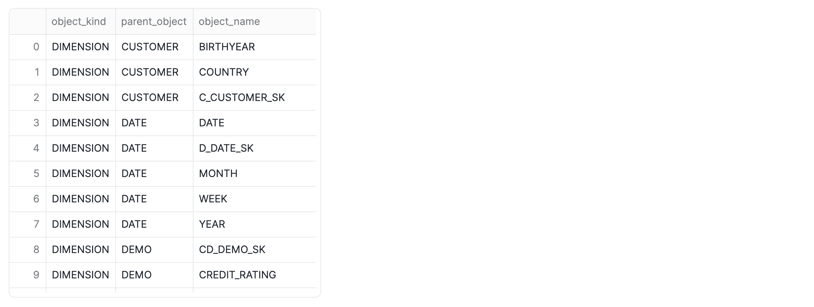

author: Chanin Nantasenamat
id: getting-started-snowflake-semantic-view
summary: Learn how to create and query Snowflake Semantic Views to enhance AI-powered Business Intelligence and conversational analytics with a consistent, database-native semantic layer.
categories: getting-started, data-engineering, artificial-intelligence
environments: web
status: Published
feedback link: https://github.com/Snowflake-Labs/sfguides/issues
tags: Snowflake, Semantic Views, AI, Business Intelligence, BI, TPC-DS, Cortex Analyst, Data Modeling

# Getting Started with Snowflake Semantic View
<!-- ------------------------ -->
## Overview
Duration: 45

AI-powered Business Intelligence (BI) and conversational analytics hold immense promise for data-driven decision-making. However, directly applying these technologies to complex enterprise schemas often leads to inaccurate or inconsistent results, commonly referred to as "hallucinations." This challenge arises because AI and BI systems may struggle to interpret raw data without a clear understanding of the organizational context and definitions.

Snowflake addresses these challenges by introducing Semantic Views, a new schema-level object that stores all semantic model information natively within the database. Semantic views capture and store semantic model information directly within the database, including business-relevant concepts such as metrics (*e.g.,* total sales), dimensions (*e.g.,* product category), and facts.

### What You'll Learn
- How to set up a database and schema in Snowflake
- How to create views from existing sample data
- The process of defining a Snowflake semantic view with tables, relationships, dimensions, and metrics
- How to query a semantic view
- How semantic views enhance AI-powered analytics and consistency across BI tools

### What You'll Build
You will build a foundational understanding and practical setup of a Snowflake semantic view, complete with data views and a defined semantic model, enabling simplified and consistent data querying for BI and AI applications using TPC-DS sample data.

### Prerequisites
- A Snowflake account with appropriate permissions (`ACCOUNTADMIN` role is required for creating semantic views)
- Access to the `SNOWFLAKE_SAMPLE_DATA` database
- A Snowflake Worksheet or Notebook environment to execute SQL commands
- Basic understanding of SQL and data modeling concepts

<!-- ------------------------ -->
## Understanding Semantic Views
Duration: 5

### What is a Semantic View?

A semantic view acts as a translator between your raw data and how humans or AI interpret it. It defines key business concepts like "metrics" (*e.g.,* total sales) and "dimensions" (*e.g.,* customer location) by referencing your underlying tables and their relationships.

### Why Semantic Views Matter

Semantic views are crucial for several reasons:

- **Ensures AI and BI consistency**: By embedding organizational context and definitions directly into the data layer, semantic views ensure that both AI and BI systems interpret information uniformly, leading to trustworthy answers.
- **Enables AI-powered analytics**: They make data "AI-ready," unlocking advanced use cases such as conversational analytics and significantly reducing the risk of AI hallucinations.
- **Maintains consistency across BI Tools**: Semantic models are shifted from individual BI tool layers to the core data platform, guaranteeing that all tools utilize the same semantic concepts.
- **Unlocks rich analytical capabilities**: Semantic views power diverse user interfaces, including AI-powered analytics, traditional BI clients, Streamlit applications, and custom applications.

### Basic Elements of a Semantic View Definition

Every semantic view definition requires essential elements:

- **Physical model objects**: These refer to your existing tables, views, or (in future releases) SQL queries that contain the raw data.
- **Relationships**: These define how your physical objects connect to each other (*e.g.,* a CUSTOMER table linked to an ORDERS table).
- **Dimensions**: These are business-friendly attributes used to group or filter your data (*e.g.,* customer's birth year, product category).
- **Metrics**: These are business-friendly calculations or aggregations, often representing Key Performance Indicators (KPIs) (*e.g.,* total sales price, total sales quantity).

<!-- ------------------------ -->
## Setup Environment
Duration: 10

### Step 1: Set up your Database and Schema

First, we'll create a new database named `SAMPLE_DATA` and a schema named `TPCDS_SF10TCL` to organize our data. We will then set the context to use this new schema.

```sql
-- Create a new test database named SAMPLE_DATA
CREATE DATABASE SAMPLE_DATA;

-- Use the newly created database
USE DATABASE SAMPLE_DATA;

-- Create a new schema named TPCDS_SF10TCL within SAMPLE_DATA
CREATE SCHEMA TPCDS_SF10TCL;

-- Set the context to use the new schema
USE SCHEMA TPCDS_SF10TCL;
```

### Step 2: Create Views from Sample Data

Next, we'll create views for the tables we want to analyze. These views will be based on the `SNOWFLAKE_SAMPLE_DATA.TPCDS_SF10TCL` dataset, allowing us to work with a subset of the data without modifying the original tables.

```sql
-- Create or replace views for the tables from SNOWFLAKE_SAMPLE_DATA.TPCDS_SF10TCL

CREATE OR REPLACE VIEW CUSTOMER AS
SELECT * FROM SNOWFLAKE_SAMPLE_DATA.TPCDS_SF10TCL.CUSTOMER;

CREATE OR REPLACE VIEW CUSTOMER_DEMOGRAPHICS AS
SELECT * FROM SNOWFLAKE_SAMPLE_DATA.TPCDS_SF10TCL.CUSTOMER_DEMOGRAPHICS;

CREATE OR REPLACE VIEW DATE_DIM AS
SELECT * FROM SNOWFLAKE_SAMPLE_DATA.TPCDS_SF10TCL.DATE_DIM;

CREATE OR REPLACE VIEW ITEM AS
SELECT * FROM SNOWFLAKE_SAMPLE_DATA.TPCDS_SF10TCL.ITEM;

CREATE OR REPLACE VIEW STORE AS
SELECT * FROM SNOWFLAKE_SAMPLE_DATA.TPCDS_SF10TCL.STORE;

CREATE OR REPLACE VIEW STORE_SALES AS
SELECT * FROM SNOWFLAKE_SAMPLE_DATA.TPCDS_SF10TCL.STORE_SALES;
```

### Step 3: Verify your Environment Setup

Before proceeding, let's ensure our warehouse, database, and schema are correctly set, and then list the views we just created.

```sql
-- Select the warehouse, database, and schema
USE WAREHOUSE COMPUTE_WH;
USE DATABASE SAMPLE_DATA;
USE SCHEMA TPCDS_SF10TCL;

-- Show all views in the current schema to verify creation
SHOW VIEWS;
```


> aside positive
> IMPORTANT:
> - Ensure you have the `ACCOUNTADMIN` role to create semantic views
> - Verify that all views are created successfully before proceeding to the next step

<!-- ------------------------ -->
## Creating the Semantic View
Duration: 15

### Step 1: Define the Semantic View

We'll start by switching to the `ACCOUNTADMIN` role:

```sql
-- Switch to ACCOUNTADMIN role to create the semantic view
USE ROLE ACCOUNTADMIN;
```

Now, we'll define our `TPCDS_SEMANTIC_VIEW_SM` semantic view. This view will establish relationships between our tables, define facts (measures), and dimensions (attributes), making it easier to query and analyze our data without complex joins.

```sql
-- Create or replace the semantic view named TPCDS_SEMANTIC_VIEW_SM
CREATE OR REPLACE SEMANTIC VIEW TPCDS_SEMANTIC_VIEW_SM
	tables (
		CUSTOMER primary key (C_CUSTOMER_SK),
		DATE as DATE_DIM primary key (D_DATE_SK),
		DEMO as CUSTOMER_DEMOGRAPHICS primary key (CD_DEMO_SK),
		ITEM primary key (I_ITEM_SK),
		STORE primary key (S_STORE_SK),
		STORESALES as STORE_SALES
        primary key (SS_SOLD_DATE_SK,SS_CDEMO_SK,SS_ITEM_SK,SS_STORE_SK,SS_CUSTOMER_SK)
	)
	relationships (
		SALESTOCUSTOMER as STORESALES(SS_CUSTOMER_SK) references CUSTOMER(C_CUSTOMER_SK),
		SALESTODATE as STORESALES(SS_SOLD_DATE_SK) references DATE(D_DATE_SK),
		SALESTODEMO as STORESALES(SS_CDEMO_SK) references DEMO(CD_DEMO_SK),
		SALESTOITEM as STORESALES(SS_ITEM_SK) references ITEM(I_ITEM_SK),
		SALETOSTORE as STORESALES(SS_STORE_SK) references STORE(S_STORE_SK)
	)
	facts (
		ITEM.COST as i_wholesale_cost,
		ITEM.PRICE as i_current_price,
		STORE.TAX_RATE as S_TAX_PRECENTAGE
	)
	dimensions (
		CUSTOMER.BIRTHYEAR as C_BIRTH_YEAR,
		CUSTOMER.COUNTRY as C_BIRTH_COUNTRY,
		CUSTOMER.C_CUSTOMER_SK as c_customer_sk,
		DATE.DATE as D_DATE,
		DATE.D_DATE_SK as d_date_sk,
		DATE.MONTH as D_MOY,
		DATE.WEEK as D_WEEK_SEQ,
		DATE.YEAR as D_YEAR,
		DEMO.CD_DEMO_SK as cd_demo_sk,
		DEMO.CREDIT_RATING as CD_CREDIT_RATING,
		DEMO.MARITAL_STATUS as CD_MARITAL_STATUS,
		ITEM.BRAND as I_BRAND,
		ITEM.CATEGORY as I_CATEGORY,
		ITEM.CLASS as I_CLASS,
		ITEM.I_ITEM_SK as i_item_sk,
		STORE.MARKET as S_MARKET_ID,
		STORE.SQUAREFOOTAGE as S_FLOOR_SPACE,
		STORE.STATE as S_STATE,
		STORE.STORECOUNTRY as S_COUNTRY,
		STORE.S_STORE_SK as s_store_sk,
		STORESALES.SS_CDEMO_SK as ss_cdemo_sk,
		STORESALES.SS_CUSTOMER_SK as ss_customer_sk,
		STORESALES.SS_ITEM_SK as ss_item_sk,
		STORESALES.SS_SOLD_DATE_SK as ss_sold_date_sk,
		STORESALES.SS_STORE_SK as ss_store_sk
	)
	metrics (
		STORESALES.TOTALCOST as SUM(item.cost),
		STORESALES.TOTALSALESPRICE as SUM(SS_SALES_PRICE),
		STORESALES.TOTALSALESQUANTITY as SUM(SS_QUANTITY)
	)
	with extension (CA='{"tables":[{"dimensions":[{"name":"BIRTHYEAR","unique":false,"is_enum":false},{"name":"COUNTRY","unique":false,"is_enum":false},{"name":"c_customer_sk","unique":false,"is_enum":false}],"name":"CUSTOMER"},{"dimensions":[{"name":"DATE","unique":false,"is_enum":false},{"name":"MONTH","unique":false,"is_enum":false},{"name":"WEEK","unique":false,"is_enum":false},{"name":"YEAR","unique":false,"is_enum":false},{"name":"d_date_sk","unique":false,"is_enum":false}],"name":"DATE"},{"dimensions":[{"name":"CREDIT_RATING","unique":false,"is_enum":false},{"name":"MARITAL_STATUS","unique":false,"is_enum":false},{"name":"cd_demo_sk","unique":false,"is_enum":false}],"name":"DEMO"},{"dimensions":[{"name":"BRAND","unique":false,"is_enum":false},{"name":"CATEGORY","unique":false,"is_enum":false},{"name":"CLASS","unique":false,"is_enum":false},{"name":"i_item_sk","unique":false,"is_enum":false}],"facts":[{"name":"COST"},{"name":"PRICE"}],"name":"ITEM"},{"dimensions":[{"name":"MARKET","unique":false,"is_enum":false},{"name":"SQUAREFOOTAGE","unique":false,"is_enum":false},{"name":"STATE","unique":false,"is_enum":false},{"name":"STORECOUNTRY","unique":false,"is_enum":false},{"name":"s_store_sk","unique":false,"is_enum":false}],"facts":[{"name":"TAX_RATE"}],"name":"STORE"},{"dimensions":[{"name":"ss_sold_date_sk","unique":false,"is_enum":false},{"name":"ss_cdemo_sk","unique":false,"is_enum":false},{"name":"ss_item_sk","unique":false,"is_enum":false},{"name":"ss_store_sk","unique":false,"is_enum":false},{"name":"ss_customer_sk","unique":false,"is_enum":false}],"name":"STORESALES"}],"relationships":[{"name":"SALESTOCUSTOMER","join_type":"inner","relationship_type":"many_to_one"},{"name":"SALESTODATE","join_type":"inner","relationship_type":"many_to_one"},{"name":"SALESTODEMO","join_type":"inner","relationship_type":"many_to_one"},{"name":"SALESTOITEM","join_type":"inner","relationship_type":"many_to_one"},{"name":"SALETOSTORE","join_type":"inner","relationship_type":"many_to_one"}]}');
```

### Step 2: Verify the Semantic View Creation

Let's confirm that our semantic view has been successfully created by listing all semantic views in the current database.

```sql
-- Lists semantic views in the database that is currently in use
SHOW SEMANTIC VIEWS;
```


### Step 3: Describe the Semantic View

To understand the structure and components of our newly created semantic view, we can use the `DESC SEMANTIC VIEW` command.

```sql
-- Describes the semantic view named TPCDS_SEMANTIC_VIEW_SM
DESC SEMANTIC VIEW TPCDS_SEMANTIC_VIEW_SM;
```



<!-- ------------------------ -->
## Querying Semantic Views
Duration: 10

### Basic Query Structure

To query a semantic view, you'll use this special query structure:

```sql
SELECT * FROM SEMANTIC_VIEW (view_name
    METRICS metric1, metric2, ...
    DIMENSIONS dimension1, dimension2, ...
);
```

Let's break down each part:
- `SELECT * FROM SEMANTIC_VIEW (view_name ...)`: This initiates your query, indicating that you want to retrieve data from a semantic view
- `METRICS metric1, metric2, ...`: Within the parentheses, specify the metrics (calculated values or totals) you wish to retrieve
- `DIMENSIONS dimension1, dimension2, ...`: Next, specify the dimensions (categories or attributes) you want to group or filter your data by

### Adding Filters and Sorting

You can enhance your queries with standard SQL clauses:

- **Filtering**: Use `WHERE` clauses to filter your results
- **Sorting**: Use `ORDER BY` to sort your results
- **Limiting**: Use `LIMIT` to restrict the number of results

### Example Query: Top Selling Brands

Now that our semantic view is defined, we can easily query it to retrieve aggregated data. The following query demonstrates how to find the top-selling brands in a specific state and category for a given year and month:

```sql
-- Query the semantic view to find top selling brands
SELECT * FROM SEMANTIC_VIEW
(
 TPCDS_SEMANTIC_VIEW_SM
    DIMENSIONS
            Item.Brand,
            Item.Category,
            Date.Year,
            Date.Month,
            Store.State
    METRICS
        StoreSales.TotalSalesQuantity
)
WHERE Year = '2002' AND Month = '12' AND State ='TX' AND Category = 'Books'
ORDER BY TotalSalesQuantity DESC LIMIT 10;
```


<!-- ------------------------ -->
## Exploring with Cortex Analyst
Duration: 5

### Natural Language Querying

Snowflake's Cortex Analyst allows you to interact with your semantic views using natural language. This powerful feature transforms how users can explore data without needing to know SQL syntax.

### Accessing Cortex Analyst

You can access Cortex Analyst through the Snowflake interface. Use the following SQL to generate a direct link to your semantic view in Cortex Analyst:

```sql
SELECT 'https://app.snowflake.com/' || CURRENT_ORGANIZATION_NAME() || '/' || CURRENT_ACCOUNT_NAME() || '/#/studio/analyst/databases/SAMPLE_DATA/schemas/TPCDS_SF10TCL/semanticView/TPCDS_SEMANTIC_VIEW_SM/edit' AS RESULT;
```

### Example Natural Language Query

Once in Cortex Analyst, you can ask questions like:

*"Show me the top selling brands in terms of total sales quantity in the state 'TX' in the 'Books' category in the year 2003"*

Cortex Analyst will automatically translate this natural language question into the appropriate Semantic SQL query and return the results.


## Conclusion And Resources
Duration: 5

Congratulations! You've successfully created your first Snowflake semantic view. By implementing this semantic layer directly within Snowflake, you've established a foundation for consistent, AI-ready analytics that bridges the gap between raw data and meaningful business insights. 

The semantic view you built not only simplifies complex data relationships but also enables natural language querying through Cortex Analyst, democratizing data access across your organization. As you continue to develop your semantic models, remember that this approach scales to support enterprise-wide analytics initiatives, ensuring that all stakeholders — from data analysts to business users — can trust and understand the data that they're working with.

### What You Learned
- How to create and configure Snowflake semantic views using the TPC-DS sample data
- The importance of semantic views for AI-powered analytics and BI consistency
- How to define relationships, dimensions, and metrics in a semantic view
- How to query semantic views
- How to leverage Cortex Analyst for natural language data exploration

### Related Resources

Articles:

- [Using SQL commands to create and manage semantic views](https://docs.snowflake.com/user-guide/views-semantic/sql)
- [Using the Cortex Analyst Semantic View Generator](https://docs.snowflake.com/en/user-guide/views-semantic/ui)
- [Sample Data: TPC-DS](https://docs.snowflake.com/en/user-guide/sample-data-tpcds)
- [TPC-DS Benchmark Overview](https://www.tpc.org/tpcds/) - Understanding the sample dataset used in this guide

Documentation:
- [Overview of semantic views](https://docs.snowflake.com/en/user-guide/views-semantic/overview)
- [CREATE SEMANTIC VIEW](https://docs.snowflake.com/en/sql-reference/sql/create-semantic-view)
- [DROP SEMANTIC VIEW](https://docs.snowflake.com/en/sql-reference/sql/drop-semantic-view)
- [SHOW SEMANTIC VIEWS](https://docs.snowflake.com/en/sql-reference/sql/show-semantic-views)
- [DESCRIBE SEMANTIC VIEW](https://docs.snowflake.com/en/sql-reference/sql/desc-semantic-view)
