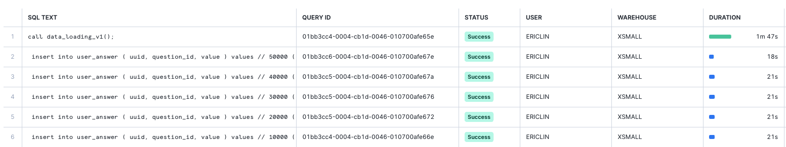
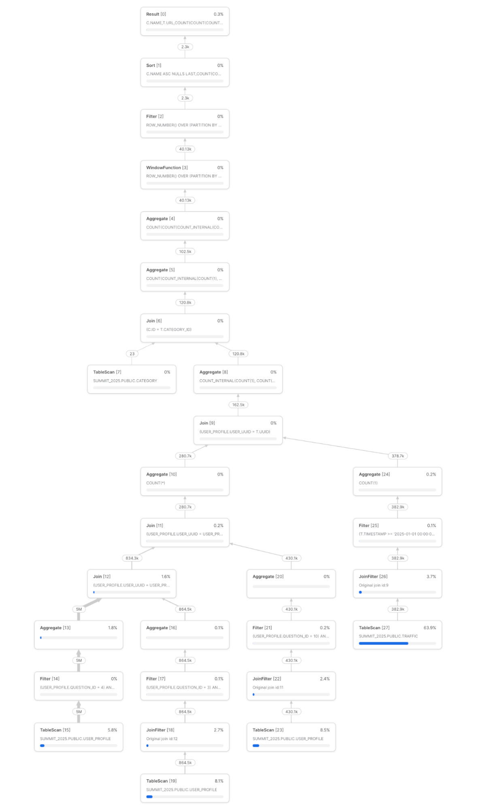
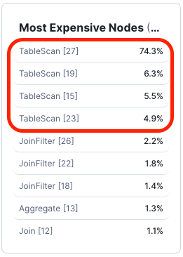
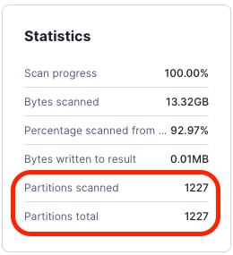
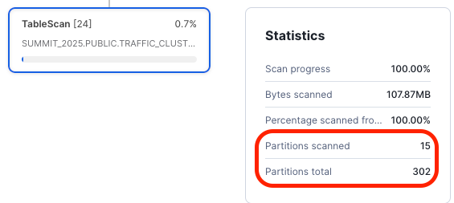
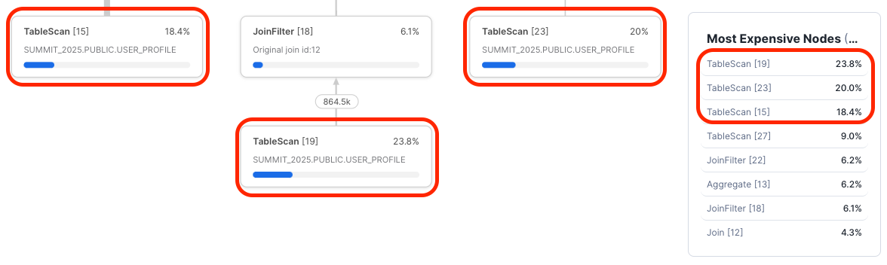

author: Minzhen Yang, Eric Lin
id: snowflake-sql-performance-optimization
summary: This lab shows you how to use various techniques to optimize Snowflake SQL performance.
categories: sql-performance
environments: web
status: Published 
feedback link: https://github.com/Snowflake-Labs/sfguides/issues
tags: SQL Performance, Auto Clustering, Materialized View, Search Optimization Service, Query Acceleration Service 

# Snowflake SQL Performance Optimization
<!-- ------------------------ -->
## Overview 
Duration: 2

In this HOL, you will learn how to use a query profile page in Snowsight to analyze potential query bottlenecks and optimize your SQL queries. This guide provides step-by-step instructions on how to apply various techniques to vastly improve your query performance.

### Prerequisites
- TO BE ADDED

### What You’ll Learn 
How to apply the following techniques to improve query performance.

- Javascript Stored Procedure/UDTF
- Automatic Clustering
- Materialized Views
- Search Optimization Service
- Query Acceleration Service

### What You’ll Need 
- Access to a Snowflake Account

- Understanding of the following concepts in Snowflake
  - Javascript Stored Procedures
  - Javascript UDTF
  - Automatic Clustering
  - Materialized Views
  - Search Optimization Service
  - Query Acceleration Service

## Creating a Step
Duration: 2

Make sure you have the following tables with the correct contents under schema `SUMMIT_2025_SQL_PERF_HOL.WEB_TRAFFIC_EXAMPLE`:

- CATEGORY
  - List of website category names
  - There should be 23 rows for the purpose of the lab

- QUESTION
  - List of questions asked from a survey
  - There should be 12 rows for the purpose of the lab

- USER_SRC_RAW_50000
  - The list of user raw data with 50K rows
  - This allows us to perform data transformations on a sample dataset for demonstration purposes because processing on the full dataset can be slow in the example provided.

- USER_SRC_RAW
  - The full user profile data in the RAW format
  - We will use this table to populate the USER_PROFILE table which is needed to perform further exercises in this lab
  - This table should have 10M rows

- USER_PROFILE
  - List of answers provided by random people online. Each answer was saved against a user UUID which is used to identify a particular user.
  - This forms the demographics/profiles of a certain population
  - It will be empty to start with, and we will populate it using the data from the USER_SRC_RAW table during the exercise

- TRAFFIC
  - The list of websites visited by each user over the course of the last 12 months

Verify that they have the correct number of records in them:

```sql
SELECT COUNT(1) FROM QUESTION;
-- 12

SELECT COUNT(1) FROM CATEGORY;
-- 23

SELECT COUNT(1) FROM USER_SRC_RAW_50000;
-- 50K

SELECT COUNT(1) FROM USER_SRC_RAW;
-- 10M

SELECT COUNT(1) FROM USER_PROFILE;
-- 0

SELECT COUNT(1) FROM TRAFFIC;
-- 160M
```


<!-- ------------------------ -->
## Data Transformation
Duration: 7

The table USER_SRC_RAW_50000 contains the raw data format, which we will need to transform into the table USER_PROFILE. Each question/profile, e.g., First Name or Last Name, will be one entry in the USER_PROFILE table. 

For example, one record in table USER_SRC_RAW_50000 looks like below:

<table>
  <tr>
    <td>ID</td>
    <td>UUID</td>
    <td>DATA</td>
    <td>CREATED_AT</td>
  <tr>
  <tr>
    <td>6586473</td>
    <td>6827d677-cfc0-48f1-9e04-8c1b7d059d39</td>
    <td>Gary|Moore|F|1970-07-07|keith37@example.org|466500|001-576-010-2252|59226 Rachel Stream Apt. 938
East Kayla, LA 73924|15018|Saint Barthelemy|Cook Islands|Dance movement psychotherapist</td>
    <td>2025-02-20 00:00:00.000</td>
  <tr>
</table>

The DATA column contains the user’s profile details, which are mapped to certain profiles in order and separated by a ‘|’ character.

We would need to transform the data into the following format in the USER_PROFILE table:

<table>
  <tr>
    <td>UUID</td>
    <td>QUESTION_ID</td>
    <td>VALUE</td>
    <td>CREATED_AT</td>
  </tr>
  <tr>
    <td>6827d677-cfc0-48f1-9e04-8c1b7d059d39</td>
    <td>1</td>
    <td>Gary</td>
    <td>2025-02-20 00:00:00.000</td>
  </tr>
  <tr>
    <td>6827d677-cfc0-48f1-9e04-8c1b7d059d39</td>
    <td>2</td>
    <td>Moore</td>
    <td>2025-02-20 00:00:00.000</td>
  </tr>
  <tr>
    <td>6827d677-cfc0-48f1-9e04-8c1b7d059d39</td>
    <td>4</td>
    <td>F</td>
    <td>2025-02-20 00:00:00.000</td>
  </tr>
  <tr>
    <td>6827d677-cfc0-48f1-9e04-8c1b7d059d39</td>
    <td>3</td>
    <td>1970-07-07</td>
    <td>2025-02-20 00:00:00.000</td>
  </tr>
  <tr>
    <td>6827d677-cfc0-48f1-9e04-8c1b7d059d39</td>
    <td>5</td>
    <td>keith37@example.org</td>
    <td>2025-02-20 00:00:00.000</td>
  </tr>
  <tr>
    <td>6827d677-cfc0-48f1-9e04-8c1b7d059d39</td>
    <td>10</td>
    <td>466500</td>
    <td>2025-02-20 00:00:00.000</td>
  </tr>
  <tr>
    <td>6827d677-cfc0-48f1-9e04-8c1b7d059d39</td>
    <td>6</td>
    <td>001-576-010-2252</td>
    <td>2025-02-20 00:00:00.000</td>
  </tr>
  <tr>
    <td>6827d677-cfc0-48f1-9e04-8c1b7d059d39</td>
    <td>7</td>
    <td>59226 Rachel Stream Apt. 938 East Kayla, LA 73924</td>
    <td>2025-02-20 00:00:00.000</td>
  </tr>
  <tr>
    <td>6827d677-cfc0-48f1-9e04-8c1b7d059d39</td>
    <td>8</td>
    <td>15018</td>
    <td>2025-02-20 00:00:00.000</td>
  </tr>
  <tr>
    <td>6827d677-cfc0-48f1-9e04-8c1b7d059d39</td>
    <td>9</td>
    <td>Saint Barthelemy</td>
    <td>2025-02-20 00:00:00.000</td>
  </tr>
  <tr>
    <td>6827d677-cfc0-48f1-9e04-8c1b7d059d39</td>
    <td>12</td>
    <td>Cook Islands</td>
    <td>2025-02-20 00:00:00.000</td>
  </tr>
  <tr>
    <td>6827d677-cfc0-48f1-9e04-8c1b7d059d39</td>
    <td>11</td>
    <td>Dance movement psychotherapist</td>
    <td>2025-02-20 00:00:00.000</td>
  </tr>
</table>

It is designed this way because the list of user profiles (survey questions) can be dynamic. Therefore, it is not practical to have a fixed number of columns in the USER_PROFILE table if we design it horizontally rather than vertically. This allows more profiles to be added easily in the future.

Run the following queries to examine the content of the sample table:

```sql
SELECT * FROM USER_SRC_RAW_50000 LIMIT 1000;

SELECT * FROM QUESTION;
```

One assumption that we need to make here is that the order of data in the DATA column of table USER_SRC_RAW_50000 is in the following order in terms of user profiles:

```
first_name|last_name|gender|dob|email|income|phone_number|address|postcode|country|nationality|occupation
```

One common approach by SQL developers for this type of issue is to scan through the RAW table and then build INSERT statements to transform data into a new table. This is the most straightforward way. Let’s see how this was done initially (this was a real customer use case that we helped to optimize):

```sql
create or replace procedure data_loading_v1()
returns string
language javascript
as 
$$
    var rs;

    // get the list of question info, so that we can build the question ID 
    // based on the order of each column in the DATA field
    rs = snowflake.createStatement( 
        {sqlText: 'select id, idx from question'} 
    ).execute();
    questions = {}

    while (rs.next())  {
        question_id = rs.getColumnValue(1);
        question_idx = rs.getColumnValue(2);

        questions[question_idx] = question_id
    }

    // we batch the insert by 10K, this helps to avoid 
    // query string too long issue
    const batch_size = 10000;
    const bulk_insert_template = `
        insert into user_profile (
            uuid, question_id, value, created_at
        ) values
    `;

    let bulk_insert_value = [];
    let bulk_insert_sql = '';
    const select_source_sql = `
        select uuid, data, created_at::string from user_src_raw_50000;
    `;

    // make sure the target table user_profile is clean
    snowflake.createStatement( {sqlText: 'truncate table user_profile'} ).execute();
    
    const statement = snowflake.createStatement( {sqlText: select_source_sql} );
    rs = statement.execute();
    let n = 0;
    var uuid, data, user_data;
    while (rs.next())  {
        uuid = rs.getColumnValue(1);
        data = rs.getColumnValue(2);
        created_at = rs.getColumnValue(3);

        user_data = data.split('|');

        for (var i = 0; i < user_data.length; i++) {
            bulk_insert_value.push(
                "('" + uuid + "', '" + questions[i] + "', '" + user_data[i].replace('\n', ' ').replace("'", "\\'") + "', '" + created_at + "')\n"
            );
        }

        if (n > 0 && n % batch_size == 0) {
            bulk_insert_sql = bulk_insert_template + "// " + n + "\n" + bulk_insert_value.join(',')

            try {
                snowflake.createStatement( {sqlText: bulk_insert_sql} ).execute();
            } catch (err) {
                return "Failed: " + bulk_insert_sql + ", Error: " + err;
            }
            bulk_insert_value = [];
        }
        n += 1;
    }

    if (bulk_insert_value.length > 0) {
        bulk_insert_sql = bulk_insert_template + bulk_insert_value.join(',')
        try {
            snowflake.createStatement( {sqlText: bulk_insert_sql} ).execute();
        } catch (err) {
            return "Failed: " + bulk_insert_sql + ", Error: " + err;
        }
    }

    return n*12 + ' number of records inserted';
$$;
```

Go ahead to create this Stored Procedure (SP) and then run it using the following query on an XSMALL warehouse:

```sql
call data_loading_v1();
```

It should take around one and a half to two minutes on an XSMALL warehouse. After it finishes, you can go to the Query History page in Snowsight to see the list of children INSERT queries triggered by the SP. Since we have 50K samples, it runs the INSERT batch 5 times, and each of them takes around 20 seconds or so:



There are only 50K rows, and if we have used the full user set of 10M rows, then it will even take much longer to do this transformation (20s * 10M/10K = 20,000 seconds = 5.6 hours). 

Apart from each INSERT query taking time, the overhead of SP to manage those children's queries can also take time. The more children queries we have, the more time it will take to run through the full process.

`INSERT INTO ... VALUES ...` is an anti-pattern in Snowflake when we talk about data ingestion, yet many Snowflake customers still use this approach, which results in unnecessarily long processing and credit usage.

The better approach is to step back and think through other better options.

When you consider that we are given one row of user profiles and need to produce 12 rows, one row for each profile into a new table, this behavior matches exactly what the UDTF function does.

We can write a UDTF function that accepts one row of user profiles as its input and produces 12 rows, each containing one profile, such as First Name or Last Name, but we use the `QUESTION_ID` value instead.

The logic is as below:

```sql
create or replace function data_loading_v2(uuid string, data string)
returns table(
    uuid string,
    idx varchar,
    value varchar
)
language javascript
as
$$
{
    processRow: function (row, rowWriter, context) {
        const data = row.DATA.split('|');
        for (i = 0; i < data.length; i++) {
            rowWriter.writeRow({
                UUID: row.UUID,
                IDX: i,
                VALUE: data[i]
            });
        }
    }
}
$$;
```

For details on how Javascript UDTF works, refer to this documentation page. We will not discuss details on how Javascript UDTF works here in the lab.

What we are doing here is simply taking a row of data (`row.DATA`), splitting it, and producing each element as its own row via the function call `rowWriter.writeRow`.

Then, we can use the following query to transform our table:

```sql
with user_profile as (
    select 
        s.uuid,
        idx,
        value,
        created_at
    from user_src_raw_50000 s, table(data_loading_v2(uuid, data))
)
select 
    a.uuid,
    q.id as question_id,
    a.value,
    created_at
from user_profile a
join question q on (
    a.idx = q.idx
);
```

This query can finish in around 2-3 seconds on an XSMALL warehouse, which is significantly faster than the INSERT INTO version that we shared above over 50K rows.

For those of you who are familiar with Snowflake’s built-in functions, you might wonder why we don't just use the `SPLIT_TO_TABLE` function. Exactly, we can achieve the same goal by using this function instead:

```sql
with user_profile as (
    select 
        uuid,
        -- idx here starts with 1
        (d.index - 1) as idx,
        value,
        created_at
    from user_src_raw_50000 s,
    lateral split_to_table(s.data, '|') d
)
select
    uuid,
    q.id as question_id,
    value,
    created_at
from user_profile p
join question q on (
    p.idx = q.idx
);
```

If you check its performance, it should take about the same time as our custom UDTF example above.

We used the UDTF example here for demonstration purposes only. The `SPLIT_TO_TABLE` function cannot cover all use cases, and some business requirements will require more complicated logic to be implemented in the UDTF function, which `SPLIT_TO_TABLE` probably can’t cover.

Now, let’s load the final data into the `USER_PROFILE` table from the `USER_SRC_RAW` full dataset for us to use in the next exercise:

```sql
truncate table user_profile;

insert into user_profile
with user_profile as (
    select 
        uuid,
        -- index here from function SPLIT_TO_TABLE starts with 1
        (d.index - 1) as idx,
        value,
        created_at
    from user_src_raw s,
    lateral split_to_table(s.data, '|') d
)
select
    uuid,
    q.id as question_id,
    value,
    created_at
from user_profile p
join question q on (
    p.idx = q.idx
);
```

In my test, loading 120M profile rows into the `USER_PROFILE` table on an XSMALL warehouse took 25-30 seconds.

<!-- ------------------------ -->
## Website Ranking Report using Demographic Data
Duration: 10

Let's run a query that will return the following report: 

Return the top 100 websites visited by males aged between 20 and 30 with salary incomes from 50K to 100K, ranked by the number of visits under each category in January 2025.

Let’s disable the result cache first, this is essential during the course of the lab:

```sql
alter session set use_cached_result = false;
```

The query is as below:

```sql
with age_20_to_30 as (
    select distinct uuid
    from user_profile
    where question_id = 3 -- DOB question
        and value::date between dateadd(year, -30, current_date) 
            and dateadd(year, -20, current_date)
),
gender_male as (
    select distinct uuid
    from user_profile
    where question_id = 4 -- Gender question
        and value::string = 'M'
),
income_50K_to_100K as (
    select distinct uuid
    from user_profile
    where question_id = 10 -- Income question
        and value::int between 50000 and 100000
)
select
    c.name,
    url,
    count(1) as visits
from traffic t
join category c on (
    c.id = t.category_id
)
join age_20_to_30 a on (
    a.uuid = t.uuid
)
join gender_male g on (
    g.uuid = t.uuid
)
join income_50K_to_100K i on (
    i.uuid = t.uuid
)
where
    t.timestamp between '2025-01-01' and '2025-02-01'
group by all
qualify row_number() over (
    partition by c.name order by visits desc
) <= 100
order by c.name, visits desc;
```

Run the above query using an XSMALL warehouse and see how long it will take.

If everything is good, it should finish the query in about 11-15 seconds. If it takes longer for you, it might be due to caching when running the first time, try again and observe.

The high-level query plan looks like below:



By looking at the processing breakdown on the Most Expensive Nodes panel (on the right) of the query profile page:



We can see that the majority of the time was spent on TableScan across all 4 tables, and the Statistics section also tells us that we pretty much performed a FULL TABLE SCAN in this query:



This is a sign that the partition pruning is not working, and we need to focus on this area to improve the efficiency of this query (actual numbers might vary).

<!-- ------------------------ -->
## Clustered Table

Though there were 4 TableScans, only 2 tables were involved, namely USER_PROFILE and TRAFFIC. Let’s focus on the TRAFFIC table first, as it was the main bottleneck from the above query.

If we check the query, we have a filter that is applied to the TRAFFIC table on the TIMESTAMP column:

```sql
t.timestamp between '2025-01-01' and '2025-02-01'
```

Also, we had a JOIN condition on the CATEGORY_ID column:

```sql
join category c on (
    c.id = t.category_id
)
```

Adding clustering keys to those 2 columns can help us perform the partition pruning and improve the table scan.

However, before doing so, let’s have a look at the TRAFFIC table on how well it is clustered based on those two columns:

```sql
select system$clustering_information(
    'traffic', 
    '(timestamp, category_id)'
);
```

In my lab, it returned the following (it might be slightly different from yours)

```json
{
  "cluster_by_keys" : "LINEAR(timestamp, category_id)",
  "notes" : "Clustering key columns contain high cardinality key TIMESTAMP which might result in expensive re-clustering. Consider reducing the cardinality of clustering keys. Please refer to https://docs.snowflake.net/manuals/user-guide/tables-clustering-keys.html for more information.",
  "total_partition_count" : 539,
  "total_constant_partition_count" : 0,
  "average_overlaps" : 538.0,
  "average_depth" : 539.0,
  "partition_depth_histogram" : {
    "00000" : 0,
    "00001" : 0,
    "00002" : 0,
    "00003" : 0,
    "00004" : 0,
    "00005" : 0,
    "00006" : 0,
    "00007" : 0,
    "00008" : 0,
    "00009" : 0,
    "00010" : 0,
    "00011" : 0,
    "00012" : 0,
    "00013" : 0,
    "00014" : 0,
    "00015" : 0,
    "00016" : 0,
    "01024" : 539
  },
  "clustering_errors" : [ ]
}
```

A couple of things here to note:

- The cardinality (the distinct number of values) on those two columns is very high, meaning that there are many different distinct values. This is due to the value of TIMESTAMP, which records up to milliseconds. This is OK when distributing the data across different partitions, however, it will be very expensive to maintain, as one single new value from the middle of the partition will result in all data from later TIMESTAMP values being shifted across all the remaining partitions.
- There are 539 partitions in the table; however, the values of AVERAGE_OVERLAPS and AVERAGE_DEPTH are very close to this value. This means that pretty much all partitions have overlapping values, so this table is not well clustered at all.
- For more information on how to interpret the clustering information, please refer to Clustering Information Maintained for Micro-partitions and SYSTEM$CLUSTERING_INFORMATION

Let’s add the clustering keys on the TRAFFIC table, by creating a new table so that we can compare:

```sql
create or replace table traffic_clustered 
cluster by (
    timestamp::date, category_id
) as
select * from traffic 
order by timestamp, category_id;
```

Adding an ORDER BY clause at the end here can help us cluster the table at the creation time, so we do not need to wait for the auto clustering to kick in to see the effects.

Due to its size, this query might take some time to run on an XSMALL warehouse. In my test, it took around 5 minutes. Please feel free to use a larger warehouse, like a MEDIUM-sized warehouse, to run it; it can save you some waiting time (around 40-50 seconds). 

Please remember to switch back to the XSMALL warehouse to continue the following exercises so that we can compare them with the previous runs.

Now, let’s check the clustering information on the new table and compare it with the previous result:

```sql
-- we do not need the column information this time
-- because the table is defined as clustered ready

select system$clustering_information(
    'traffic_clustered'
);

{
  "cluster_by_keys" : "LINEAR(date(timestamp), category_id)",
  "total_partition_count" : 302,
  "total_constant_partition_count" : 0,
  "average_overlaps" : 2.0728,
  "average_depth" : 2.0795,
  "partition_depth_histogram" : {
    "00000" : 0,
    "00001" : 0,
    "00002" : 278,
    "00003" : 24,
    "00004" : 0,
    "00005" : 0,
    "00006" : 0,
    "00007" : 0,
    "00008" : 0,
    "00009" : 0,
    "00010" : 0,
    "00011" : 0,
    "00012" : 0,
    "00013" : 0,
    "00014" : 0,
    "00015" : 0,
    "00016" : 0
  },
  "clustering_errors" : [ ]
}
```

We can see now the AVERAGE_OVERLAPS and AVERAGE_DEPTH are only around 2 out of 302 partitions. This is a good indication that this new table is very well clustered.

Now, change the query to scan against the TRAFFIC_CLUSTERED table instead:

```sql
with age_20_to_30 as (
    select distinct uuid
    from user_profile
    where question_id = 3 -- DOB question
        and value::date between dateadd(year, -30, current_date) and dateadd(year, -20, current_date)
),
gender_male as (
    select distinct uuid
    from user_profile
    where question_id = 4 -- Gender question
        and value::string = 'M'
),
income_50K_to_100K as (
    select distinct uuid
    from user_profile
    where question_id = 10 -- Income question
        and value::int between 50000 and 100000
)
select
    c.name,
    url,
    count(1) as visits
from traffic_clustered t
join category c on (
    c.id = t.category_id
)
join age_20_to_30 a on (
    a.uuid = t.uuid
)
join gender_male g on (
    g.uuid = t.uuid
)
join income_50K_to_100K i on (
    i.uuid = t.uuid
)
where 
    t.timestamp between '2025-01-01' and '2025-02-01'
group by all
qualify row_number() over (partition by c.name order by visits desc) <= 100
order by c.name, visits desc
;
```

The overall query plan should look the same, however, this time we scanned far fewer partitions on the TRAFFIC_CLUSTERED table and should finish the query at around the 7-8 seconds mark on an XSMALL warehouse:



However, the query is still not as performant because we still spend lots of time scanning the USER_PFOFILE table:



So we also need to focus on that.

<!-- ------------------------ -->
## Clustered Materialized Views
Duration: 10

We could also add clustering keys to the USER_PROFILE table. However, due to its setup, the VALUE column can be different types when performing filters based on different questions, and it can be of different to set up the clustering key on the ANSWER table based on both the QUESTION_ID and VALUE columns.

One way to do so is to use the Materialized Views (MV), and we can create one MV per profile data type. For example, we can create one MV for the STRING data type, one MV for the DATE data type, and another one for the INTEGER. This can help us fully use the clustering methods when applying those different types.

Let’s define the following Materialized Views:

```sql
create or replace materialized view user_profile_string 
cluster by (question_id, value) 
as
select question_id, value::string as value, uuid
from user_profile
where question_id in (1, 2, 4, 5, 6, 7, 8, 9, 11, 12);

create or replace materialized view user_profile_date 
cluster by (question_id, value::date) 
as
select question_id, value::date as value, uuid
from user_profile
where question_id in (3);

create or replace function cluster_by_int(value int)
returns int
language sql
as
$$
    round(value/1000)*1000
$$
;

create or replace materialized view user_profile_int 
cluster by (question_id, cluster_by_int(value::int)) 
as
select question_id, value::int as value, uuid
from user_profile
where question_id in (10);
```

Notice that we will cast the value to its expected data type for best performance. Also, for the INT data type, the values can have a large number of cardinalities, which can affect the clustering, so we added a UDF function (cluster_by_int) on top of it to round the value to nearly a thousand (this can be adjusted based on the nature of those integers).

Again, please feel free to switch to a larger warehouse to run to save some time, and then switch back to the XSMALL warehouse to continue.

Then we can run the following query against the new MVs:

```sql
select
    c.name,
    url,
    count(1) as visits
from traffic_clustered t
join category c on (
    c.id = t.category_id
)
join user_profile_date a on (
    a.uuid = t.uuid
    and a.question_id = 3
    and a.value between dateadd(year, -30, current_date) and dateadd(year, -20, current_date)
)
join user_profile_string g on (
    g.uuid = t.uuid
    and g.question_id = 4
    and g.value = 'M'
)
join user_profile_int i on (
    i.uuid = t.uuid
    and i.question_id = 10
    and i.value between 50000 and 100000
)
where 
    t.timestamp between '2025-01-01' and '2025-02-01'
group by all
qualify row_number() over (partition by c.name order by visits desc) <= 100
order by c.name, visits desc
;
```

If everything goes well, the query should finish in around 2-3 seconds on an XSMALL warehouse (depending on the cold or warm warehouse). This is because we only need to scan 41 out of 515 partitions (actual numbers might vary):


<!-- ------------------------ -->
## Conclusion And Resources
Duration: 2

### What You Learned
- How to use Auto Clustering (AC) to speed up query performance
- How to use Materialized View (together with AC) to optimize query performance

### Related Resources
- [Resource Optimization: Performance](https://quickstarts.snowflake.com/guide/resource_optimization_performance_optimization/index.html?index=..%2F..index&utm_cta=quickstarts_#12) [Monitoring]
- [Resource Optimization: Usage Monitoring](https://quickstarts.snowflake.com/guide/resource_optimization_usage_monitoring/index.html?index=..%2F..index&utm_cta=quickstarts_#0)
- [Resource Optimization: Billing Metrics](https://quickstarts.snowflake.com/guide/resource_optimization_billing_metrics/index.html?utm_cta=quickstarts_#0) (SOS)
- [Resource Optimization: Setup & Configuration](https://quickstarts.snowflake.com/guide/resource_optimization_setup/index.html?index=..%2F..index&utm_cta=quickstarts_#0)
- [Getting Started with Cost and Performance Optimization](https://quickstarts.snowflake.com/guide/getting_started_cost_performance_optimization/index.html?index=..%2F..index&utm_cta=quickstarts_#0) [AC, MV, QAS, SOS]
- [Educational service performance course objectives](https://www.snowflake.com/wp-content/uploads/2022/06/Performance-Automation-and-Tuning-3-Day.pdf)
- [DEFINITIVE GUIDE TO MANAGING SPEND IN SNOWFLAKE](https://www.snowflake.com/wp-content/uploads/2023/10/Definitive-Guide-to-Managing-Spend-in-Snowflake.pdf?utm_cta=quickstarts_) [white paper] [P14 onward on AC, MV, QAS, SOS]
- [Analyze Query Performance in Snowflake Notebooks](https://quickstarts.snowflake.com/guide/automated-query-performance-insights/index.html?index=..%2F..index&utm_cta=quickstarts_#0)
- [Build Interactive Query Performance App in Snowflake Notebooks](https://quickstarts.snowflake.com/guide/automated-query-performance-insights-with-streamlit/index.html?index=..%2F..index&utm_cta=quickstarts_#0)
- [Performance Optimization Techniques for Geospatial queries](https://quickstarts.snowflake.com/guide/geo_performance/index.html?utm_cta=quickstarts_#5) [SO to speed up lookup queries] 
- [Tabular JavaScript UDFs (UDTFs)](https://docs.snowflake.com/en/developer-guide/udf/javascript/udf-javascript-tabular-functions)
- [Writing stored procedures in JavaScript](https://docs.snowflake.com/en/developer-guide/stored-procedure/stored-procedures-javascript)
