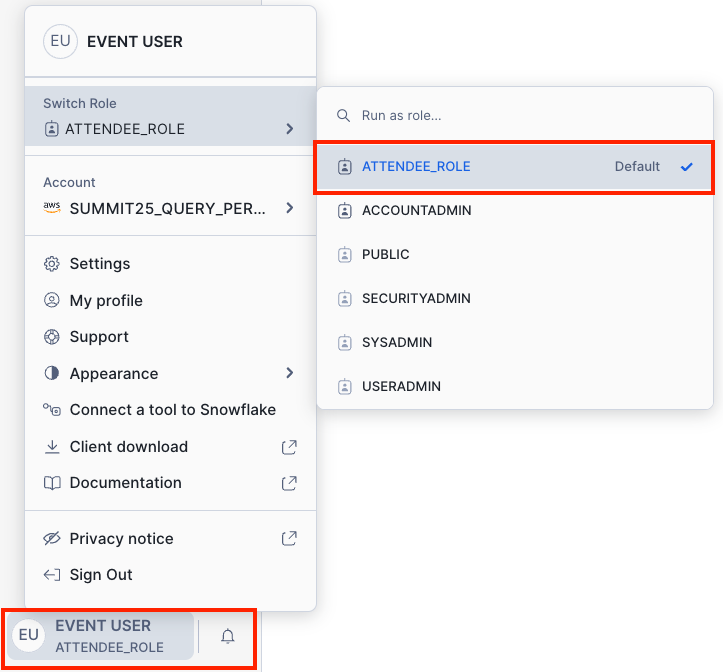

author: Minzhen Yang, Eric Lin
id: snowflake-sql-performance-optimization
summary: This lab shows you how to use various techniques to optimize Snowflake SQL performance.
categories: sql-performance
environments: web
status: Published 
feedback link: https://github.com/Snowflake-Labs/sfguides/issues
tags: SQL Performance, Auto Clustering, Materialized View, Search Optimization Service, Query Acceleration Service 

# OP304 Snowflake 2025 Summit Query Performance HOLs
<!-- ------------------------ -->
## Overview
Duration: 2

This hands-on lab for query performance tuning and optimization involves a structured approach. You can experiment with different optimization techniques, including Auto Clustering, Materialized Views, Search Optimization Service, and Query Acceleration Service, with a focus on query performance monitoring, performance tuning/optimization, and performance cost analysis.

> aside positive
> Note: Please use the specified warehouse for performance comparison and analysis as instructed. 

> aside positive
> *It is also important to note that there are dependencies between each module and the steps within them. Please follow the steps carefully, otherwise you will encounter issues like objects not found at a later stage of the lab.*

### Prerequisites

- A pre-built Snowflake account with pre-installed tables that are needed in this lab.
  - USER_PROFILE
  - TRAFFIC
  - TRAFFIC_LARGE
  - TRAFFIC_CLUSTERED
  - CATEGORY
  - QUESTION
- Understanding the following features/concepts in Snowflake
  - Automatic Clustering
  - Materialized Views
  - Search Optimization Service
  - Query Acceleration Service
  - HashJoin Basis
  - Join Skewness

### What You’ll Learn 

How to apply the following techniques to improve query performance in Snowflake.

- Automatic Clustering
- Materialized Views
- Search Optimization Service
- Query Acceleration Service
- Join Skewness

## Module 1. Object and Data Preparation
Duration: 5

Before diving into performance hands-on labs, let's explain the database, schema, the tables involved, and their relationships. 

All tables are in the database SQL_PERF_OPTIMIZATION, schema PUBLIC. After logging into your registered account, you can run the “show tables” command to get statistics of those tables in the worksheet (using database SQL_PERF_OPTIMIZATION and schema PUBLIC in your worksheet to avoid errors like “object not authorized or existed”). 

```sql
show tables in schema SQL_PERF_OPTIMIZATION.PUBLIC;
```

<table>
  <tr>
    <td>Table Name</td>
    <td>Rows#</td>
    <td>Bytes#</td>
    <td>Description</td>
  </tr>
  <tr>
    <td>CATEGORY</td>
    <td>23</td>
    <td>1536</td>
    <td>List of website category names</td>
  </tr>
  <tr>
    <td>QUESTION</td>
    <td>12</td>
    <td>2048</td>
    <td>List of questions asked in a survey</td>
  </tr>
  <tr>
    <td>TRAFFIC</td>
    <td>319996776</td>
    <td>17261814784</td>
    <td>The list of websites visited by each user over the course of the last 12 months</td>
  </tr>
  <tr>
    <td>USER_PROFILE</td>
    <td>120000000</td>
    <td>1096803328</td>
    <td>List of answers provided by random people online. Each answer was saved against a user UUID, which is used to identify a particular user.<br />This forms the demographics/profiles of a certain population</td>
  </tr>
</table>

Each of those tables has the following columns and data types, as shown in the screenshots below.


As you can see, the TRAFFIC table contains columns such as TIMESTAMP, CATEGORY_ID, UUID, USER_ID, etc. The Category table contains columns such as ID, NAME, etc. Their relationships are based on the CATEGORY_ID in the traffic table matching the ID in the category table.

Warehouses are defined as follows:

- WH_SUMMIT25_PERF_BASE (XSMALL): to run baseline reporting workload 
- WH_SUMMIT25_PERF_OPS (LARGE): for commands and any other operations than executing reporting workloads, creating 8x large data with the TRAFFIC table for the QAS source table
- WH_SUMMIT25_PERF_AC (XSMALL):  to run reporting queries for Automatic Clustering
- WH_SUMMIT25_PERF_MV (XSMALL): to run reporting queries for materialized views
- WH_SUMMIT25_PERF_SOS (XSMALL): to run reporting queries for search optimization service clustering
- WH_SUMMIT25_PERF_QAS (XSMALL): to run reporting queries for the Query Acceleration Service

You will use the role `ATTENDEE_ROLE` to run the whole lab. This session is just for your reference. We have created all objects, including tables, warehouses, and roles, and prepared all of the data and reporting queries as a base workload for a performance experiment. You just need to follow the instructions below. 

**Most of the tasks** will be completed via notebooks **by default**. Upon login, make sure you use the role ATTENDEE_ROLE by clicking on the login user from the bottom left.



To get to notebooks, click on Projects → Notebooks from the left side panel. 

If you click on the “Title” heading to order the notebooks in ascending order by title, they will be ordered in the order you will encounter them in this hands-on lab.

We suggest you **duplicate** the browser of your assigned account so that you have two side-by-side screens. One browser is on notebooks, and the other is on worksheets and the dashboard. The instructions below will show you how to access notebooks, worksheets, and the dashboard as needed.
 


## Module 2. Baseline Monitoring for Reporting Workload
Duration: 10

### 2.1. Run Base Workload of Reporting Queries 

Let’s run the base workload of 9 reporting queries.  From Notebooks, click on **MODULE2_PART1_BASE_WORKLOAD**, double-check the warehouse WH_SUMMIT25_PERF_BASE being used via the notebook setting.


You can click the “**Run all**” button (top right corner) to quickly execute all base reporting queries in this workload on the Warehouse **WH_SUMMIT25_PERF_BASE**. This will take a couple of minutes to finish. If your workload is somewhat interrupted, you can always re-run them in the notebook.

### 2.2. Collect Baseline Metrics 

We are going to collect statistics of the base workload that are executed in the previous steps. The stats are collected via the system function [GET_QUERY_OPERATOR_STATS](https://docs.snowflake.com/en/sql-reference/functions/get_query_operator_stats). 

Click on Notebooks to return to the Notebooks panel. Then click on **MODULE2_PART2_PERFORMANCE_MONITORING**. Follow the instructions there to collect statistics via a stored procedure and store metrics in a predefined local table called `BASE_QUERY_STATS`.

*Note: Please make sure that you have completed this module before proceeding*.

### 2.3. Create a Dashboard for Query Performance Monitoring Visualization [Bonus]

Optionally, you can create a visualization dashboard for query performance monitoring.  

First, click on Projects → Dashboards from the left side panel.


If you don't see the Dashboard word, try to expand the menu first.


Create a new dashboard by clicking on the “**+ Dashboard**” button from the top right corner, and call it “Reporting Workload Performance” as the dashboard name (or choose your own name).Click “Create Dashboard”


Choose “**WH_SUMMIT25_PERF_OPS**” as the warehouse on the upper right. 


Now, click on “New Tile” from “SQL Worksheet” to add a new monitoring tile.


Or from “+” at the top-left corner.


Name the title “Long Running Queries” of this dashboard tile:


While still in your SQL Worksheet, copy the following SQL script into the worksheet, and click the Run button. 

```sql
-- overall long running queries
select 
    query_id,
    REGEXP_SUBSTR(
        query_text, 
        '[A-Z]{1,} WORKLOAD QUERY - [0-9]{2}'
    ) as query_tag,
   total_elapsed_time as total_elapsed_ms
from table(sql_perf_optimization.information_schema.query_history())
where 
    execution_time > 0
    and query_text ilike '%WORKLOAD QUERY%'
    and warehouse_name ilike 'WH_SUMMIT25_PERF%'
order by total_elapsed_time desc
limit 10;
```

Return to the main Dashboard page by clicking on the “Return to Reporting Workload Performance” button at the top left corner of Snowsight.


Following these similar steps by clicking “+” from the top-left corner, create 5 more tiles based on the following monitoring scripts. 

*Please note that some of the queries might return zero rows because we do not have all the examples available in this lab*.

**Long Table Scan**

```sql
-- Long Table Scan
select 
   query_id,
   query_tag,
   operator_statistics:pruning:partitions_scanned as mp_scanned,
   operator_statistics:pruning:partitions_total as mp_total
from sql_perf_optimization.public.base_query_stats
where 
    mp_total is not null
    and (mp_scanned/mp_total) > 0.8
    and query_tag ilike '%WORKLOAD QUERY%'
order by mp_scanned desc
;
```

**Storage Spills**

```sql
-- Storage spills
select
    query_id,
    query_tag,
    operator_statistics:spilling:bytes_spilled_remote_storage as remote_spills,
    operator_statistics:spilling:bytes_spilled_local_storage as local_spills
from sql_perf_optimization.public.base_query_stats
where 
    (remote_spills > 0 or local_spills > 0)
    and query_tag ilike '%WORKLOAD QUERY%'
order by local_spills desc
;
```

**Long Compilation**

*Note: this might contain 0 rows because in our example, we do not have long compilation example queries*.

```sql
-- Long Compilation
with tb_tablescan as (
    select 
        REGEXP_SUBSTR(
            query_text, 
            '[A-Z]{1,} WORKLOAD QUERY - [0-9]{2}'
        ) as query_tag,
        compilation_time as compile_time_ms,
        execution_time as exec_time_ms,
        compilation_time / execution_time as compile_ratio
    FROM TABLE(
        sql_perf_optimization.INFORMATION_SCHEMA.QUERY_HISTORY_BY_WAREHOUSE(
            WAREHOUSE_NAME => 'WH_SUMMIT25_PERF_HOL', 
            RESULT_LIMIT =>10000
        )
    )
    where
        execution_time > 0
        and query_text ilike '%WORKLOAD QUERY%'
        and warehouse_name ilike 'WH_SUMMIT25_PERF%'
    )
select 
    query_tag,
    compile_time_ms,
    exec_time_ms,
    compile_ratio
from tb_tablescan
where 
    compile_ratio > 0.5
order by compile_ratio desc
;
```

**OOMs & Retries**

*Note: this might contain 0 rows because in our example, we do not have such example queries*.

```sql
-- OOMs & Retries
select 
    query_id,
    REGEXP_SUBSTR(
        query_text, 
        '[A-Z]{1,} WORKLOAD QUERY - [0-9]{2}'
    ) as query_tag,
    compilation_time as compile_time_ms,
    execution_time as exec_time_ms,
    query_tag
FROM TABLE(
    sql_perf_optimization.INFORMATION_SCHEMA.QUERY_HISTORY(
        RESULT_LIMIT =>10000
    )
)
where 
    (error_code = 604 or query_retry_cause like '%oom%')
    and query_tag ilike '%WORKLOAD QUERY%'
    and warehouse_name ilike 'WH_SUMMIT25_PERF%'
;
```

**Join Explosion**

*Note: this might contain 0 rows because in our example, we do not have such example queries*.

```sql
-- JOIN explosion
select 
    query_id,
    query_tag,
    (operator_statistics:output_rows / operator_statistics:input_rows) row_multiple
from sql_perf_optimization.public.base_query_stats
where
    operator_type = 'Join'
    and row_multiple > 10
    and query_tag ilike '%WORKLOAD QUERY%'
order by row_multiple DESC
;
```

You can modify the tile to show as a chart (as shown in the below screenshot) instead of the result when you see fit. 


Your dashboard looks like below. Periodically, you can check this dashboard as new queries are being executed.


## Module 3. Auto Clustering for Performance Tuning
Duration: 8

This Module focuses on exploring and discovering clustering keys that can benefit the reporting workload. As we mentioned in the presentation, Auto Clustering is an overall query performance technique on a table for the most important workloads that need to perform the best most of the time. You need to consider the balance of query performance on the most important workloads and the frequent DML that may disrupt your clustering, and find a sweet spot between the balance of the two. In this lab, we only focus on the reporting workloads, not the DML workloads, while in reality, you need to take DML workloads into account.

You can just follow MODULE3_PART1_AC_SETUP in the notebooks to complete this module. The instruction below provides some sample result screenshots for your reference. 

### 3.1 Analyze table size


 
3.2 Analyze Query Filters and Join Filters

In the real world, you may not be involved in table design. Queries are often modified over time. You want to find out what the most common local filters and join filters are, without going through every query in the workload. Many workloads are a lot of queries. This step is to mimic these common scenarios.

We are going to analyze query filters and join filters to discover table columns that may be good auto clustering key columns.

Please follow 3.2 in the notebooks `MODULE3_PART1_AC_SETUP`, and you will see the following similar result.


Focus on columns from the traffic table, such as TIMESTAMP, CATEGORY_ID, and UUID, which are used mostly in local filters and join filters. Find out the distinct count of those three columns. Since we typically use date instead of timestamp, do a distinct count on to_date(TIMESTAMP).

*Please note that the values you see might differ from the screenshot below*.


This analysis will guide the selection of clustering keys `(TO_DATE(TIMESTAMP), CATEGORY_ID)`. For more details, see the AC guide in the notebook descriptions.

### 3.3 Adding Auto Clustering Keys 

Please follow **MODULE3_PART1_AC_SETUP** in section 3.3 for this step.  

For your information only, the output of Auto Clustering Estimation looks like the following:

```sql
SELECT SYSTEM$ESTIMATE_AUTOMATIC_CLUSTERING_COSTS(
    'traffic', 
    '(TO_DATE(TIMESTAMP),CATEGORY_ID)'
);
```

```json
{
  "reportTime": "Wed, 23 Apr 2025 18:00:31 GMT",
  "clusteringKey": "LINEAR(TO_DATE(TIMESTAMP),CATEGORY_ID)",
  "initial": {
    "unit": "Credits",
    "value": 0.20201056,
    "comment": "Total upper bound of one time cost"
  },
  "maintenance": {
    "comment": "Unable to produce maintenance cost estimate because table does not have enough substantial DMLs in the past 7 days."
  }
}
```

### 3.4 Rerun the Workload 

Rerun the reporting workload by following **MODULE3_PART2_AC_WORKLOAD** in the notebooks by clicking the “Run All” button in the top-right corner. 

### 3.5 Comparing performance 

Follow section 3.5 in the **MODULE3_PART3_BASE_VS_AC_WORKLOAD** of the notebook, which will help you:

- Analyze the performance metrics (especially execution time and credits used) for `WH_SUMMIT25_PERF_BASE` (baseline) and `WH_SUMMIT25_PERF_AC` (with Auto Clustering). 
- Quantify the performance improvement. 
- Discover the potential trade-off of pre-clustering if the data is frequently updated.

### 3.6 Cost Analysis

Please follow section 3.6 in the notebook **MODULE3_PART3_BASE_VS_AC_WORKLOAD**, which compares the cost of workloads with and without Auto Clustering.

## Module 4. Materialized Views for Performance Tuning
Duration: 7

Materialized View (MV) is another optimization feature for query performance, depending on your workload and goal. MV is suitable for frequently executed queries with expensive operations like aggregation, sort, etc. An MV is similar to a physical table, while its metadata links to its base table, so it does incur extra storage.

This Module is to focus on exploring and discovering how a query can benefit from a Materialized View.

Follow **MODULE4_MV_OPTIMIZATION** of notebooks for Module 4.

### 4.1 Identify MV Candidates


Based on the number of outputs, Query 09 is considered one of the top candidates for expensive aggregation (**Note**: *there might be other criteria you want to consider for your specific workloads and needs*).

### 4.2 Design Materialized View

Based on the expensive aggregation on TRAFFIC and Query 09, create a materialized view.


### 4.3 Rerun Query on WH_SUMMIT25_PERF_MV

Rerun the query 09 from step 4.3 in notebook MODULE4_MV_OPTIMIZATION . Then go to Query History to identify the query profile. 


You can specify “MV WORKLOAD” in SQL Text filter, and `WH_SUMMIT25_PERF_MV` in Warehouses filter to narrow the queries. Click on the query ID, which will bring you to the query panel.


Snowflake should automatically rewrite the query to use the materialized view. 

### 4.4 Compare performance

Go back to step 4.4 of Notebook MODULE4_MV_OPTIMIZATION.


4.5 Compare Costs


## Module 5. Search Optimization Service for Performance Tuning
Duration: 10

Search Optimization Service (SOS) is a supplement optimization feature of Auto Clustering. SOS benefits queries by allowing them to access a very small subset of data scattered over many MPs, like finding a needle in a haystack. SOS is implemented as MV internally, so it also occupies additional storage.

This module is to explore how SOS can improve a query’s performance.

Follow `MODULE5_SOS_OPTIMIZATION` in the notebooks for this Module. 

### 5.1 Identify SOS Candidates 

Analyze the reporting queries and look for a lookup type of queries where it does a big TableScan (i.e., full TableScan) and outputs a few number of rows. 


### 5.2 Design Search Optimized Object

The next step is to design a Search-Optimized Object. Let's look at this query. We look for high-cardinality filter columns (e.g., UUID in this query with an IN list), though it needs to have sufficient distinct values, ideally 100K-200K distinct values or more.


UUID does qualify for SOS. Now we can create a search optimization object on UUID:

```sql
ALTER TABLE traffic ADD SEARCH OPTIMIZATION ON EQUALITY(uuid);
```

Verify that SOS is enabled on the table. You can rerun this cell after a minute or so if it shows less than 100%.


We can also estimate the cost of the SOS on the UUID equality filter.


### 5.3 Rerun the Query

Rerun query **03 from the notebook**. And check the query profile (follow the instructions of step 4.3 in Module 4 earlier to find the query history and query profile. You can filter on warehouse `WH_SUMMIT25_PERF_SOS` and SQL Text with “**BASE WORKLOAD QUERY - 03**” in the query history).


As you can see, SOS is used instead of tableScan on the Traffic table. SOS pruned 421 out of 1013 partitions on “Partitions pruned by search optimization”; instead of the previous full TableScan. Now only 592 partitions are scanned.

### 5.4 Compare Performance

Compare the query performance between WH_SUMMIT25_PERF_BASE(without SOS) and WH_SUMMIT25_PERF_SOS (with SOS). 


Quantify improvements from SOS.  

SOS helps prune micro-partitions, improving query performance for highly selective filters.

### 5.5 Compare Costs

Compare the cost of query execution with and without SOS.


Now, check the cost of the SOS service. 


## Module 6. Query Acceleration Service for Performance Tuning
Duration: 7

Query Acceleration Service (QAS) is another optimization feature that may complement other optimization features. QAS can compute part of your query. Its best use cases are ad hoc queries or mixed workloads with a few outliers of long-running queries, so that you don’t need to size up your warehouse.

This module explores how SOS can improve a query’s performance. You can follow **MODULE6_QAS_OPTIMIZATION** in the notebook for this Module. 

### 6.1 Identify QAS Candidates & Data Preparation

We have created an SP to find QAS-eligible queries on historic queries. Please follow the instructions in step 6.1 of the Notebook MODULE6_QAS_OPTIMIZATION.

### 6.2 Enable QAS


This confirms that the QAS is enabled on `WH_SUMMIT25_PERF_QAS`.

### 6.3 Rerun Query and Validate 

Rerun the query 081 on WH_SUMMIT25_PERF_QAS. Use the query profile to validate that QAS was used and look for “partition scanned by service” on the node TableScan of the TRAFFIC_LARGE table. 

*Note: you can follow instructions from step 4.3 of the notebook MODULE4_MV_OPTIMIZATION earlier to find the query profil*e.


Then rerun the eligibility check stored procedure to verify QAS has been applied.


### 6.4 Compare Performance and Cost 


## Module 7. Explore JOIN Skewness [Bonus]
Duration: 10

Follow **MODULE7_SKEWNESS_OPTIMIZATION** in the notebooks and the section below for this module. 

### 7.1 Background

This module assumes that you have a basic understanding of how Hash Join works.

There are three main types of skewness that can happen during a query execution that can slow down query performance:

1. Data distribution skewness

This can happen when the underlying data for a table is not evenly distributed across multiple files. Different workers can read different amounts of data after the TableScan operator, which can cause uneven processing between workers while executing a query.

2. Join key skewness

This can happen when we try to join two tables with data unevenly distributed based on the join key condition. Since the HashJoin operator distributes data during the processing based on the joining key(s), different workers will receive different amounts of data in such a case, which can result in processing skewness.

3.  Probe side skewness

This happens when the table that is put on the Probe side of the join requires a small number of file scans (this can be due to a small table or a large table with restrictive filtering conditions). Since one file/partition can only be read by a single worker instance, the number of worker instances involved in the query processing will be limited to the number of instances used in the table scan. This skewness can carry to the downstream operators of the query processing if its path does not become the Build side on later joins( i.e., to reuse the same worker without redistribution of the data), hence can result in processing skewness throughout the whole process.

In this module, we will focus on the third scenario mentioned above.

### 7.2 Prepare the data.

Follow step 7.2 in the notebook to create the tables needed in this module.

### 7.3 Execute the query and analyze the problem.

Execute the query in the notebook, locate it on the Query History page, and then check the profile  (refer to **step 4.3** earlier on how to identify query history and query profile). In our test, this query spent 15 seconds on the XSMALL warehouse.


The query profile looks something like this:


We can see that the bottleneck is at the stage when Snowflake tries to write the result into the Result Cache in the S3 store.

Let’s examine in more detail what happened here and see how we can fix the bottleneck.

If you check all the TableScan operators at the bottom of the plan chart, you will notice that each table has only one partition being scanned.


We can also observe that table T1 is on the Probe side of the HashJoin operator. As mentioned above in the Background section, this will result in only one worker instance being used to read the table. Since it is on the Probe side of the join, this single worker instance process will be carried over to the rest of the query processing until the final Result operator.


We can also see that after the final Join in operator Join [1], it returned 8M rows, it will be slow if we can only process this data on a single worker instance while saving the result in the final stage.

To summarize what has been observed from the query profile on this particular query:

- The TableScan operator on the table T1 was put on the Probe side of the Hash Join
- Due to the small number of partitions being scanned, the number of threads used to perform the table scan is limited
- This small number of threads got carried over to the later part of query operators and eventually to the final step of saving ResultSets
- Since the ResultSet is relatively large (of over 8M rows) and with a limited number of worker instances, this operation is slow, and occupied almost 70% of the total query execution

### 7.4 The solution

If we can find a way to force Snowflake to distribute the data before joining the Probe side (the right side) of the Join with the Build side (on the left side), we will be able to fully utilize the warehouse’s worker resources and, hence, improve the query performance.

One way to do so is to force the shuffling of the table T1 (the one on the Probe side). The technique is to use the ORDER BY RANDOM() clause on the table before being joined.

The query has been prepared for you in the notebook. Please go ahead to execute it and check the query profile again:


You will notice that we now have an extra Sort [8] operator before the first Join. This will force Snowflake to reshuffle the data across all workers.

Even though this can introduce extra time spent on the “ORDER BY RANDOM()” operation, the time saved by having more threads to perform the rest of the query execution can be more significant, depending on the number of JOINs and the amount of data returned after each of the JOIN operations. So, this needs to be analyzed on a case-by-case basis.

Then, continue with the instructions in the notebook to compare the result and finish this module.

## Module 8. Leverage AI Feature Copilot to Generate Monitoring Queries [Bonus]
Duration: 5

This module is offered as a bonus session on exploring the AI feature Copilot to speed up performance monitoring efforts. 

You can open Copilot directly from the Notebooks or from a worksheet. In Notebooks, there is an  “Ask Copilot” button in the top right corner.


From a worksheet, open a worksheet first and use the schema `SQL_PERF_OPTIMIZATION.PUBLIC`, warehouse `WH_SUMMIT25_PERF_OPS`. Click on “Ask Copilot” in the lower-right corner.


In the Copilot chat box, input a prompt. It will generate a query based on your prompt. You can copy the query and run it in your worksheet, analyzing it to see whether it makes sense or not. If not, you can let the Copilot know where it is not accurate or provide a better version there, which will help the Copilot improve over time. 

Below are 3 sample prompts for you to explore and play with Copilot. The sample queries are generated from one of our accounts; since your account is new, yours may be very different, less accurate, or slower. You may get empty results for the first few attempts.

### 1st prompt: Slow queries and anomaly detection 

1st Prompt: “Please write a query to identify slow-running queries, detect patterns or anomalies, and suggest optimizations or resource adjustments to improve efficiency.”

It will return something similar to the following. You can run the one generated from your own try or the one below, or compare both. 

```sql
WITH query_metrics AS (
  SELECT
    query_tag,
    COUNT(*) AS execution_count,
    AVG(
      CAST(
        GET_PATH (
          PARSE_JSON (operator_statistics),
          'executionTime'
        ) AS FLOAT
      )
    ) AS avg_execution_time,
    MAX(
      CAST(
        GET_PATH (
          PARSE_JSON (operator_statistics),
          'executionTime'
        ) AS FLOAT
      )
    ) AS max_execution_time,
    MIN(
      CAST(
        GET_PATH (
          PARSE_JSON (operator_statistics),
          'executionTime'
        ) AS FLOAT
      )
    ) AS min_execution_time,
    ARRAY_AGG (DISTINCT operator_type) AS operator_types_used,
    COUNT(DISTINCT operator_id) AS num_operators
  FROM
    base_query_stats
  WHERE
    NOT query_tag IS NULL
  GROUP BY
    query_tag
)
SELECT
  query_tag,
  execution_count,
  avg_execution_time,
  max_execution_time,
  min_execution_time,
  operator_types_used,
  num_operators,
  CASE
    WHEN avg_execution_time > 1000
    AND num_operators > 5 THEN 'Complex query, consider optimization'
    WHEN avg_execution_time > 1000 THEN 'Long-running, might need resources'
    WHEN num_operators > 5 THEN 'Complex but performing well'
    ELSE 'Performing adequately'
  END AS optimization_suggestion
FROM
  query_metrics
ORDER BY
  avg_execution_time DESC
LIMIT
  20;
```

You can consider adding it to the dashboard for future monitoring.


### 2nd prompt: Recurring query pattern 

2nd Prompt: “Please write a query to identify recurring query patterns and suggest optimizations tailored to your specific workload characteristics.”

```sql
WITH query_patterns AS (
  SELECT
    query_tag,
    operator_type,
    COUNT(*) AS pattern_frequency,
    AVG(
      CAST(
        GET_PATH (
          PARSE_JSON (operator_statistics),
          'executionTime'
        ) AS FLOAT
      )
    ) AS avg_execution_time,
    ARRAY_AGG (DISTINCT operator_id) AS operator_sequence,
    COUNT(DISTINCT start_time) AS execution_count
  FROM
    base_query_stats
  WHERE
    start_time >= DATEADD (DAY, -7, CURRENT_TIMESTAMP())
  GROUP BY
    query_tag,
    operator_type
),
pattern_analysis AS (
  SELECT
    query_tag,
    LISTAGG (operator_type, ' -> ') WITHIN GROUP (
      ORDER BY
        avg_execution_time DESC
    ) AS operation_pattern,
    SUM(pattern_frequency) AS total_occurrences,
    AVG(avg_execution_time) AS avg_pattern_execution_time,
    MAX(execution_count) AS pattern_executions
  FROM
    query_patterns
  GROUP BY
    query_tag
)
SELECT
  p.query_tag,
  p.operation_pattern,
  p.total_occurrences,
  ROUND(p.avg_pattern_execution_time, 2) AS avg_execution_time,
  p.pattern_executions,
  CASE
    WHEN p.operation_pattern ILIKE '%TABLE SCAN%'
    AND p.avg_pattern_execution_time > 1000 THEN 'Consider adding appropriate indexes'
    WHEN p.operation_pattern ILIKE '%SORT%'
    AND p.avg_pattern_execution_time > 500 THEN 'Consider materialized views or pre-sorting'
    WHEN p.operation_pattern ILIKE '%JOIN%'
    AND p.avg_pattern_execution_time > 800 THEN 'Review join conditions and table statistics'
    WHEN p.pattern_executions > 100
    AND p.avg_pattern_execution_time > 300 THEN 'Consider query result caching'
    ELSE 'Performance within acceptable range'
  END AS optimization_suggestion
FROM
  pattern_analysis AS p
WHERE
  p.total_occurrences > 5
ORDER BY
  p.avg_pattern_execution_time DESC,
  p.total_occurrences DESC
LIMIT
  20;
```

### 3rd prompt: Data Change Detection

3rd Prompt: “Please write a query to detect underlying data change for a query.”

```sql
WITH historical_metrics AS (
  SELECT
    query_tag,
    DATE_TRUNC ('HOUR', start_time) AS time_bucket,
    operator_type,
    AVG(
      CAST(
        GET_PATH (PARSE_JSON (operator_statistics), 'outputRows') AS INT
      )
    ) AS avg_output_rows,
    AVG(
      CAST(
        GET_PATH (
          PARSE_JSON (operator_statistics),
          'executionTime'
        ) AS FLOAT
      )
    ) AS avg_execution_time,
    COUNT(DISTINCT operator_id) AS operator_count
  FROM
    base_query_stats
  WHERE
    start_time BETWEEN DATEADD (DAY, -7, CURRENT_TIMESTAMP())
    AND DATEADD (HOUR, -1, CURRENT_TIMESTAMP())
  GROUP BY
    1,
    2,
    3
),
current_metrics AS (
  SELECT
    query_tag,
    DATE_TRUNC ('HOUR', start_time) AS time_bucket,
    operator_type,
    AVG(
      CAST(
        GET_PATH (PARSE_JSON (operator_statistics), 'outputRows') AS INT
      )
    ) AS avg_output_rows,
    AVG(
      CAST(
        GET_PATH (
          PARSE_JSON (operator_statistics),
          'executionTime'
        ) AS FLOAT
      )
    ) AS avg_execution_time,
    COUNT(DISTINCT operator_id) AS operator_count
  FROM
    base_query_stats
  WHERE
    start_time >= DATEADD (HOUR, -1, CURRENT_TIMESTAMP())
  GROUP BY
    1,
    2,
    3
)
SELECT
  c.query_tag,
  c.operator_type,
  c.time_bucket AS current_time,
  ROUND(c.avg_output_rows, 0) AS current_output_rows,
  ROUND(h.avg_output_rows, 0) AS historical_output_rows,
  ROUND(
    (c.avg_output_rows - h.avg_output_rows) / NULLIF(h.avg_output_rows, 0) * 100,
    2
  ) AS row_change_percentage,
  ROUND(
    (c.avg_execution_time - h.avg_execution_time) / NULLIF(h.avg_execution_time, 0) * 100,
    2
  ) AS execution_time_change_percentage,
  CASE
    WHEN ABS(
      (c.avg_output_rows - h.avg_output_rows) / NULLIF(h.avg_output_rows, 0)
    ) > 0.5
    AND c.avg_execution_time > h.avg_execution_time THEN 'Significant data volume change'
    WHEN c.operator_count <> h.operator_count THEN 'Query plan change'
    WHEN c.avg_execution_time > h.avg_execution_time * 1.5 THEN 'Performance degradation'
    ELSE 'Normal'
  END AS change_detection
FROM
  current_metrics AS c
  LEFT JOIN historical_metrics AS h ON c.query_tag = h.query_tag
  AND c.operator_type = h.operator_type
WHERE
  h.avg_output_rows > 0
  AND ABS(
    (c.avg_output_rows - h.avg_output_rows) / h.avg_output_rows
  ) > 0.1
ORDER BY
  ABS(row_change_percentage) DESC
LIMIT
  20;
```

## Module 9. Recap and Summary
Duration: 2

Conclude by summarizing insights gained from each technique:

- Auto Clustering improves overall query performance across diverse workloads with no storage cost.
- Materialized Views excel at caching results for queries performing expensive aggregations.
- Search Optimization is advantageous for lookup-heavy queries with large datasets.
- Query Acceleration facilitates swift analysis by offloading computations to scalable Snowflake resources without the need to scale up the user warehouse size.
- JOIN skewness is one of the common query performance issues, often caused by a skewed joining key or skewed probe-side worker instances. As a result, a few worker instances may work on most JOIN operations while others are idle, which leads to less parallelism and longer execution time. This lab demonstrates randomizing data on the probe side to force more evenly distributed data to work around the JOIN skewness issue.    

Query Performance monitoring is an important part of query performance tuning and optimization. This lab provides some monitoring queries as an example and also introduces AI Feature Copilot as a tool for generating monitoring queries.

This lab provides a comprehensive view of different optimization strategies that participants can use and compare, enhancing both their knowledge and the application's efficiency within Snowflake.

*Note: MV, SOS, and QAS features require Enterprise Edition (or higher)*.

## Resources
- [Clustering Keys & Clustered Tables](https://docs.snowflake.com/en/user-guide/tables-clustering-keys)
  - [Automatic Clustering](https://docs.snowflake.com/en/user-guide/tables-auto-reclustering)
- [Working with Materialized Views](https://docs.snowflake.com/en/user-guide/views-materialized)
- [Search Optimization Service](https://docs.snowflake.com/en/user-guide/search-optimization-service)
  - [Identifying queries that can benefit from search optimization](https://docs.snowflake.com/en/user-guide/search-optimization/queries-that-benefit)
  - [Monitoring search optimization using Snowsight](https://docs.snowflake.com/en/user-guide/search-optimization/monitoring-search-optimization)
  - [Speeding up point lookup queries with search optimization](https://docs.snowflake.com/en/user-guide/search-optimization/point-lookup-queries)
- [Using the Query Acceleration Service](https://docs.snowflake.com/en/user-guide/query-acceleration-service)
  - [Trying query acceleration](https://docs.snowflake.com/en/user-guide/performance-query-warehouse-qas)
  - [SYSTEM$ESTIMATE_QUERY_ACCELERATION](https://docs.snowflake.com/en/sql-reference/functions/system_estimate_query_acceleration)
- Performance Monitoring and Cost
  - [GET_QUERY_OPERATOR_STATS](https://docs.snowflake.com/en/sql-reference/functions/get_query_operator_stats)
  - [QUERY_HISTORY INFORMATION SCHEMA function](https://docs.snowflake.com/en/sql-reference/functions/query_history)
  - [QUERY_HISTORY view](https://docs.snowflake.com/en/sql-reference/account-usage/query_history)
  - [WAREHOUSE_METERING_HISTORY view](https://docs.snowflake.com/en/sql-reference/account-usage/warehouse_metering_history)
  - [METERING_DAILY_HISTORY view](https://docs.snowflake.com/en/sql-reference/account-usage/metering_daily_history) 
