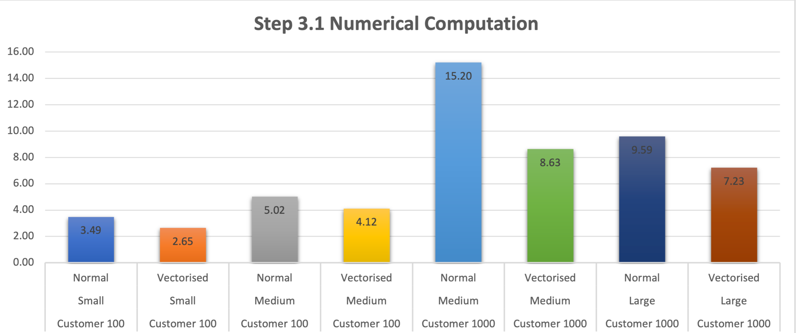

author: Jonathan Tao and Hanbing Yan
id: snowpark_python_top_three_tips_for_optimal_performance
summary: Snowpark Python: Top Three Tips for Optimal Performance
categories: Data-Engineering
environments: web
status: Published 
feedback link: https://github.com/Snowflake-Labs/sfguides/issues
tags: Getting Started, Data Engineering, Best Practices

# Snowpark Python: Top Three Tips for Optimal Performance
<!-- ------------------------ -->
## Overview 
Duration: 5

This Quickstart guide contains key tips for optimal performance when using Snowpark Python.  The guide is broken up into multiple labs, each covering a key concept that can improve performance and/or efficiency while running workloads in Snowpark.  

### Prerequisites
- Understanding of [Snowpark Python Dataframes](https://docs.snowflake.com/developer-guide/snowpark/reference/python/dataframe.html)
- Understanding of [Python UDFs](https://docs.snowflake.com/en/developer-guide/snowpark/python/creating-udfs)
- Familarity with using Notebook IDEs

### What You’ll Learn

In this quickstart, you will learn how to make optimized decisions when using Snowpark Python.  These choices will be compared with others to show performance improvements.  Each concept is broken up into a lab, listed below:

- [Lab 1](https://quickstarts.snowflake.com/guide/snowpark_python_top_three_tips_for_optimal_performance/index.html?index=..%2F..index#2): Using Snowpark dataframes perform ~8X faster compared to Pandas dataframes
- [Lab 2](https://quickstarts.snowflake.com/guide/snowpark_python_top_three_tips_for_optimal_performance/index.html?index=..%2F..index#4): Using Vectorized UDFs can improve numerical computations by 30-40%
- [Lab 3](https://quickstarts.snowflake.com/guide/snowpark_python_top_three_tips_for_optimal_performance/index.html?index=..%2F..index#6): Using Cachetools library to improve performance up to 20x (~20 mins)

### What You’ll Need 

- A Snowflake account with [Anaconda Packages enabled by ORGADMIN](https://docs.snowflake.com/en/developer-guide/udf/python/udf-python-packages.html#using-third-party-packages-from-anaconda). If you do not have a Snowflake account, you can register for a [free trial account](https://signup.snowflake.com/).
- A Snowflake account login with ACCOUNTADMIN role. If you have this role in your environment, you may choose to use it. If not, you will need to 1) Register for a free trial, 2) Use a different role that has the ability to create database, schema, tables, stages, tasks, user-defined functions, and stored procedures OR 3) Use an existing database and schema in which you are able to create the mentioned objects.


## Setup
Duration: 5

### Python Environment Setup 

Let's set up the Python environment necessary to run this quickstart:

First, clone the source code for this repo to your local environment:
```bash
git clone https://github.com/Snowflake-Labs/sfguide-snowpark-python-top-three-tips-for-optimal-performance
cd sfguide-snowpark-python-top-three-tips-for-optimal-performance
```

#### Snowpark Python via Anaconda

> aside positive
> IMPORTANT:
> - If you are using a machine wth Apple M1 chip, follow [these instructions](https://docs.snowflake.com/en/developer-guide/snowpark/python/setup) to create the virtual environment and install Snowpark Python instead of what's described below.

If you are using [Anaconda](https://www.anaconda.com/products/distribution) on your local machine, create a conda env for this quickstart:
```bash
conda env create -f conda_env.yml
conda activate pysnowpark
```

Conda will automatically install `snowflake-snowpark-python` and all other dependencies for you.

Now, launch Jupyter Notebook on your local machine:
```bash
jupyter notebook
```

### Troubleshooting `pyarrow` related issues

- If you have `pyarrow` library already installed, uninstall it before installing Snowpark.
- If you do not have `pyarrow` installed, you do not need to install it yourself; installing Snowpark automatically installs the appropriate version.
- Do not reinstall a different version of `pyarrow` after installing Snowpark.

### Snowflake Environment Setup

Create a fresh database in your Snowflake account for the following labs.  Login to [Snowsight](https://docs.snowflake.com/en/user-guide/ui-snowsight-quick-tour) and issue the following command:

```
CREATE DATABASE SNOWPARK_BEST_PRACTICES_LABS;
```

We'll also standardize the [warehouse](https://docs.snowflake.com/en/user-guide/warehouses) we will use for the following labs.  Run the following command:

```
CREATE OR REPLACE WAREHOUSE compute_wh WAREHOUSE_SIZE=SMALL INITIALLY_SUSPENDED=TRUE;
```

### Edit the credentials.json file

Throughout all the following labs, we will need to connect your notebook IDE to Snowflake.  This is done via a credentials file.  Edit the `credentials.json` file found in the cloned repo with your Snowflake account information.  
 - Provide your account information, username, and password.
 - Ensure the role you are specifying upon login will have access to the database you just created.
 - Specify default warehouse as `COMPUTE_WH` as created above.
 - Specify the default database as `SNOWPARK_BEST_PRACTICES_LABS` and default schema as `PUBLIC`.

## Lab 1 (Snowpark Dataframes) - Overview


Snowpark is essentially a wrapper that converts Spark or Pandas APIs into SQL when executing and data engineers don't need to spend excessive time to find out how it works behind scenes. This notebook guides you through why we should use Snowpark Dataframe and avoid using Pandas Data Frame.

Though Pandas has tons of really good APIs in day-to-day DE job, the challenge with Pandas is that it does not scale with your data volume linearly due to single-machine processing. For example, Pandas fails with out-of-memory error if it attempts to read a dataset that is larger than the memory available in a single machine.


Now we will see how Pandas works with Snowpark and how Snowflake has tried to parallelize the processing of Pandas API. Lets use a simple example to remove duplicates from a 6M sample table.


<!-- ------------------------ -->
## Lab 1 (Snowpark Dataframes) - Execution

Duration: 15

### Prerequisites
- Your snowflake user needs to be granted to a role have write access to database SNOWFLAKE_SAMPLE_DATA. For instructions to import SNOWFLAKE_SAMPLE_DATA, please click [here](https://docs.snowflake.com/en/user-guide/sample-data-using).
- By now, you should have finished setting up credentials.json configuration file in the overview section, please ensure this configuration file is in the same folder of the Jupyter Notebook you will run.


### What You'll Do
- Create a Snowpark Session and connect with Snowpark using the connection parameters specified in credentials.json file.
- Create a Stored Procedure to remove duplicates using Snowpark Dataframe and analyze how SQL is run in your Snowflake account.
- Create a Stored Procedure to remove duplicates using Pandas Dataframe.

### Run the Lab

Open up the jupyter notebook titled [lab1_avoid_pandas_df](https://github.com/Snowflake-Labs/sfguide-snowpark-python-top-three-tips-for-optimal-performance/blob/main/lab1_avoid_pandas_df.ipynb) and run each of the cells.


### Conclusion 

If you are interested, you can go to Snowflake UI to to check query history of the runs.
I have summarized the performance differences between Snowpark Dataframe and Pandas Dataframe, both using the same small warehouse. As you can see the performance using Snowpark Dataframe is 8X faster than using Pandas Dataframe and it's always a best practice to leverage Snowpark Dataframe as much as you can!


## Lab 2 (Vectorised UDFs) - Overview
Duration: 2

### Lab Summary

The Snowpark API provides methods that help to create a [User Defined Function](https://docs.snowflake.com/en/sql-reference/udf-overview). This can be done either using a Lambda or a typical Function in Python. When you create these UDFs, the Snowpark library uploads this code to an internal stage. When you call these UDFs, the Snowpark library executes your function on the server, where the data is. As a result, the data doesn’t need to be transferred to the client in order for the function to process the data.

Naturally, you're wondering then, what is a [Vectorised UDF](https://docs.snowflake.com/en/developer-guide/snowpark/python/creating-udfs#label-snowpark-python-udf-vectorized)?

The Python UDF batch API enables defining Python functions that receive batches of input rows (aka chunked rows) as Pandas DataFrames and return batches of results as Pandas arrays or Series. The column in the Snowpark dataframe will be vectorized as a Pandas Series inside the UDF.

The goal of this lab is to compare the performance of a UDF Operation with and without using the Python UDF Batch API (or Vectorised UDFs).

In this notebook, we will do the following:
 - We will work with 4 datasets, namely Customers and Orders from the TPCH Datasets of different sizes (15M to 1.5B records) freely and instantly available in Snowflake through an inbound share.
 - We will use 3 different Virtual Warehouse sizes, i.e., Small, Medium, and Large.
 - We will execute 4 different use-cases, namely, Numerical Computation, String Manipulation, Regex Masking, and Timestamp Manipulation. Please note, these are hypothetical use-cases but are commonly found when working with data in Snowflake.

## Lab 2 (Vectorised UDFs) - Execution
Duration: 20

### Prerequisites
- Your snowflake user needs to be granted to a role have write access to database SNOWFLAKE_SAMPLE_DATA. For instructions to import SNOWFLAKE_SAMPLE_DATA, please click [here](https://docs.snowflake.com/en/user-guide/sample-data-using).
- By now, you should have finished setting up credentials.json configuration file in the overview section, please ensure this configuration file is in the same folder of the Jupyter Notebook you will run.


### What You'll Do

This lab consists of the following major steps:

1. Importing libraries and connecting to Snowflake
2. Creating the dataframes of test data from the TPCDS dataset
3. Setting up the virtual warehouses prior to testing
4. Running four test suites on typical UDF operations 
    - Numeric Computation (~3 minutes)
    - String Manipulation (~5 minutes)
    - Batch Sizing (~5 minutes)
    - Timestamp Manipulation (~60 minutes)
5. Analyzing the results, forming conclusions, and cleanup

### Run the lab

Open up the jupyter notebook titled [lab2_vectorized_udfs](https://github.com/Snowflake-Labs/sfguide-snowpark-python-top-three-tips-for-optimal-performance/blob/main/lab2_vectorized_udfs.ipynb) and run each of the cells.

### Analysis

Below is analysis of the tests ran in the notebook.  Please compare these findings with the results in your notebook.

#### Recap

Before we look into the results, let's recap what we have done so far:
- We took 4 different TPCH datasets of varying sizes...
- ...Used 3 different Virtual Warehouse sizes, i.e., Small, Medium, and Large...
- ...On 4 different hypothetical use-cases...
- ...and generated results that will allow us to compare the performance of a UDF Operation with and without using Vectorised UDFs .

#### Numeric Computation Use Cases



For Numerical Computation, keeping the same dataset and warehouse size, Vectorised UDFs outperform Normal UDFs.
- This is also seen when we change the size of the warehouse (to Large) to accommodate the change in dataset size (to Customer 1000)
- This is because Numerical data types (including Boolean [0, 1]) expose their contents as _memoryviews()_. Memoryviews allow direct read & write access to the data without needing to copy it. But if you do require to copy it, they don't need to be read sequentially first. This significantly improves performance.
- What is peculiar is the behavior when working with a Medium warehouse and Customer 100 dataset. Where it performs slightly less efficient than a Small Warehouse. This could have several reasons, but what I noticed in the Query Profile was:
  - It takes the Medium warehouse upto 35% of the time to initialise as compared to ~10% of time for a Smaller warehouse.
  - Another is the time it took to create the python sandbox environment, i.e. ~900ms on a Medium warehouse compared to <400ms for Smaller warehouse.  The last one especially could compound across the UDFs that get created and to cause the slight difference in performance.
  - Of course, this previous point above doesn't carry across the other dataset and warehouse size.
- *Optional Work*: Leverage `GET_QUERY_OPERATOR_STATS()` table function for a more detailed and thorough analysis.

#### Non-Numeric Computation Use Cases


As expected, it makes sense not to use Vectorised UDFs for Non-numeric operations
- But apart from the obvious, let's check out what the Query Profile looks like for the String Manipulation for Customer 100 Dataset when using a Small warehouse:
  - The Total (and by extention Average) UDF Handler Execution Time was about half for a Normal UDF when compared to the Vectorised UDF
  - The Average UDF encoding/decoding time was less than 1/100th of a millisecond for a Normal UDF when compared to 5 ms for a Vectorised UDF
  - I think we have to appreciate the difference of orders of magnitude here and especially when compounded, really makes the difference in performance between a Normal and Vectorised UDF
  - The Python Sandbox environment creation time was 1/3rd for Normal UDFs when compared to Vectorised UDFs
  - It is also important to note that the Bytes scanned and written were almost the same, and the partitions were the same as no partitioning had been done to this dataset.
- *Optional Work*: Leverage `GET_QUERY_OPERATOR_STATS()` table function for a more detailed and thorough analysis.

#### Batch Sizes

Additionally, when using Vectorised UDFs, you may want to play around with Batch Sizes.
- This is done with the input argument to the decorator @udf like so:
```
@udf(max_batch_size=1000)
def vect_udf_bc_100(inp: PandasSeries[float]) -> PandasSeries[float]:
    return (inp - df_customer_100_mean + df_customer_100_stddev) * 10000.0
```
It is important to note:
- Setting a batch size doesn't guarantee which records will be present in a particular batch
- It also doesn't guarantee that a batch size will be of the same size. For instance, if the argument `max_batch_size = 50000`, does not mean 50k records are sent per batch
- An increase in batch size doesn't guarantee improvement in performance
- A very very low batch size (e.g. ~50-200) does slow performance depending on the size of the dataset. While a moderately sized batch (e.g. ~2000) does improve performance. This is what I have seen in my tests
- Typically, Snowflake automatically picks a batch size for you which is performance efficient and should suffice in most cases

### Conclusion

Your Python code must operate efficiently on batch of rows
- For Numerical Computations, you can expect between 30% and 40% improvement in performance using Vectorised UDFs
- For Non-Numeric Computaions/Manipulations, you're likely to see performance degredation using Vectorised UDFs; therefore we would recommend to stick with normal non-vectorised UDFs
- If you're working with Numerical Computations, xperiment with different Warehouse and Batch Sizes to get more performance as a result. But remember, higher sizes does not always mean or always guarantee higher performance
- Lastly, make sure to dive deep into Query Profiling either through the Snowsight UI or the newly launched `GET_QUERY_OPERATOR_STATS()` table function to further optimize

### Cleanup

> aside positive
> If you did not complete all test cases in the notebook, please ensure you cleaned up the environment by executing the final code block so that all other labs will function properly


## Lab 3 (Cachetools) - Overview
Duration: 3

### Lab Summary

When using Snowpark, it is common for data engineers and data scientists to create pickle files, upload them to internal/external stage, and use them with Snowflake UDFs and Stored Procedures (SPs).  This lab will show how using the Python library Cachetools can be used to speed up UDF or SP performance by ensuring the logic is cached in memory in cases of repeated reads. For simplicity we will demonstrate this scenario using a pickle file which has the dictionary object serialized.


### Background Information - Cachetools and pickle files

#### Cachetools
[Cachetools](https://pypi.org/project/cachetools/) is a Python library that provides a collection of caching algorithms. It offers simple and efficient caching methods, such as LRU (Least Recently Used) and FIFO (First In First Out), to store a limited number of items for a specified duration. The library is useful in applications where temporarily storing data in memory improves performance. It's easy to use and can be integrated into an application with just a few lines of code.

The Cachetools library with Snowpark UDF can be used for:

- Loading pretrained ML models from the stage for model inference
- Reading data which is stored in pickle file

#### Pickle File
A [pickle](https://docs.python.org/3/library/pickle.html) file is a file format used to store Python objects as binary data. It is used in data engineering to store and retrieve data objects that can be used across different applications or scripts.For example, you might use pickle to store data objects such as pandas dataframes, numpy arrays, or even custom Python classes and functions. By using pickle, you can save these objects to disk and load them later without having to recreate the data from scratch.

### Scenario

There is a ficticious system that generates transactional data along with the day of the week information for each row. To access the names of the weekdays, we are required to use a Python pickle file that is shared by the upstream data teams. This file contains the names of the weekdays, which may change in different scenarios. To ensure compatibility and security, the upstream data teams only provide access to this information through the pickle file.

To analyze this data in Snowflake Snowpark Python, we have created a Python User Defined Function (UDF) to efficiently retrieve the corresponding day name based on the day number which comes as an input. This UDF provides a convenient and reliable way to access the day names from the pickle file, allowing us to perform the necessary DataFrame transformations for our analysis.

Lately as the number of transactions are growing we are seeing performance degradation of our select queries which is using the UDF to fetch the required information from the pickle file. We need to look for ways to improve the performance of the Python UDF that we have created.

## Lab 3 (Cachetools) - Execution
Duration: 5

### What You'll Do

This lab consists of the following major steps:

1. Importing libraries and connecting to Snowflake
2. Creating a pickle file
3. Running a UDF without Cachetools 
4. Running a UDF with Cachetools
5. Conclusion and Cleanup

### Run the lab

Open up the jupyter notebook titled [lab3_cachetools_library](https://github.com/Snowflake-Labs/sfguide-snowpark-python-top-three-tips-for-optimal-performance/blob/main/lab3_cachetools_library.ipynb) and run each of the cells.

### Conclusion 

Based on the our testing, we have identified that the total duration for the query using Cachetools decorator for this use case yields a significant performance increase for the Python UDF execution.

## Conclusion and Resources
Duration: 3

Congratulations! You've successfully performed all the labs illustrating the best practices for getting optimal performance when using Snowpark Python.  You're now ready to implement these concepts in your own projects.

### What You Learned

- The importance of Snowpark dataframes versus Pandas dataframes
- The performance benefits of Vectorised UDFs, and what type of operations benefit the most from them
- The performance benefits of the cachetools library 

### Related Resources

- [Source Code on GitHub](https://github.com/Snowflake-Labs/sfguide-snowpark-python-top-three-tips-for-optimal-performance)
- [Getting Started with Data Engineering and ML using Snowpark Python](https://quickstarts.snowflake.com/guide/getting_started_with_dataengineering_ml_using_snowpark_python/index.html#0) 
- [Advanced: Snowpark for Python Data Engineering Guide](https://quickstarts.snowflake.com/guide/data_engineering_pipelines_with_snowpark_python/index.html)
- [Advanced: Snowpark for Python Machine Learning Guide](https://quickstarts.snowflake.com/guide/getting_started_snowpark_machine_learning/index.html)
- [Snowpark for Python Demos](https://github.com/Snowflake-Labs/snowpark-python-demos/blob/main/README.md)
- [Snowpark for Python Developer Guide](https://docs.snowflake.com/en/developer-guide/snowpark/python/index.html)


