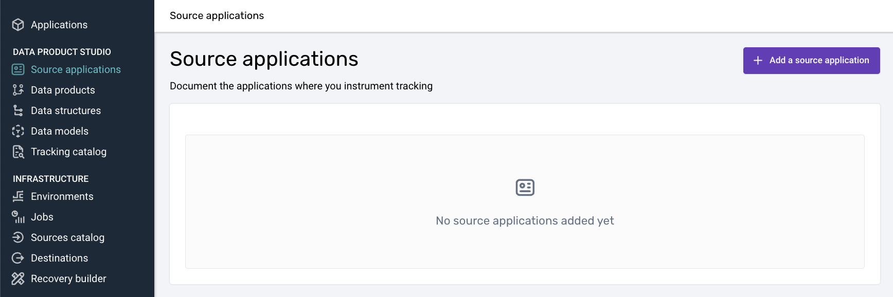

author: Snowplow
id: snowplow-web-analytics
categories: snowflake-site:taxonomy/solution-center/certification/quickstart, snowflake-site:taxonomy/solution-center/certification/partner-solution, snowflake-site:taxonomy/solution-center/includes/architecture, snowflake-site:taxonomy/product/analytics
language: en
summary: Set up real-time event tracking and analytics using Snowplow and Snowflake
environments: web
status :Published
feedback link: https://github.com/Snowflake-Labs/sfguides/issues
# Snowplow Digital Analytics with Snowflake

## Overview

### Overview

In this guide, you'll learn how to set up real-time event tracking and analytics, configure the Snowflake Streaming Loader for immediate data availability, and deploy Snowplow’s Unified Digital dbt package for simplified data modeling and consumption. By the end of this tutorial, you'll have a fully functioning analytics pipeline, enabling you to make data-driven decisions swiftly and accurately.

### What You Will Build

- A pipeline for behavioral data from the source to the analysis
- A quick analysis of that behavioral data

### What You Will Learn

- How to set up Snowplow's tracking for event data collection
- How to configure the Snowflake Streaming Loader to ingest data in near real-time
- How to deploy Unified Digital dbt package in Snowflake

### Prerequisites

- [Snowplow Behavioral Data Platform (BDP) subscription](https://snowplow.io/)
- Basic knowledge of SQL and Snowflake
- Access to Snowflake account


## Set up Tracking 

With Snowplow, tracking capabilities are virtually limitless, offering a wide range of possibilities. 

Basic tracking functionalities can be easily integrated into your app by following [this guide](https://docs.snowplow.io/docs/recipes/recipe-basic-tracking-design/), while more advanced features can be unlocked by utilizing Snowplow’s full suite of products.


### Example Web Tracking Implementation with Data Products and Automatic Code Generation

Here's a summary of the steps to implement a basic web tracking setup using Snowplow’s Data Products and advanced Snowplow features:

1. **Create a Source Application**: 
   Define your web app's tracking source and configure the necessary application contexts.

2. **Set up Base Data Product**: 
   Use the Base Web Data Product template to track standard events like page views and clicks in your app.
   
3. **Initialize the Tracker**: 
   Install [Snowplow's browser tracker](https://docs.snowplow.io/docs/collecting-data/collecting-from-own-applications/javascript-trackers/web-tracker/quick-start-guide/#quick-start-basic), configure it to automatically send page views and page pings, and track user interactions.
4. **Verify Event Data**: 
   Use the [Snowplow Inspector browser extension](https://docs.snowplow.io/docs/testing-debugging/snowplow-inspector/overview/) to confirm that page views, clicks, and other tracked events are being recorded.
   
5. **Create Custom Data Structures**: 
   You can define custom data structures (e.g., "new_game" and "start_game") to track specific website or app interactions and utilize Snowtype to generate code for custom event tracking. More details about that in the full documentation below.

[For a complete setup guide/recipe, visit Snowplow's official documentation.](https://docs.snowplow.io/docs/recipes/recipe-data-products-base-tracking/)


## Configure Snowflake Streaming Loader

In this section, you'll learn how to set up the Snowflake Streaming Loader to ingest Snowplow event data into Snowflake in near real-time. By the end of this step, you'll have a streaming pipeline that delivers enriched event data with minimal latency.

### Introduction to Snowflake's Snowpipe Streaming

**Snowpipe Streaming** is Snowflake's real-time data ingestion service, which allows for the immediate availability of data as it's ingested. This capability is crucial for businesses that rely on up-to-the-minute data to make timely, informed decisions.

### Snowflake Streaming Loader

The [Snowflake Streaming Loader](https://docs.snowplow.io/docs/pipeline-components-and-applications/loaders-storage-targets/snowflake-streaming-loader/) is an advanced data integration solution that continuously captures and delivers real-time information to Snowflake, enabling organizations to access up-to-the-minute insights and drive informed decision-making.

#### Benefits of using Snowflake Streaming Loader

- **Low Latency**: Data becomes available in Snowflake within seconds, enabling near real-time analytics.
- **Cost-Efficiency**: Eliminates the need for expensive infrastructure like EMR clusters or large compute instances.
- **Immediate Availability**: As soon as data is generated, it's ready for querying.

#### Step 1: Go to Destinations

Go to your Snowplow BDP console, under infra in destinations, and select the Snowflake ( Streaming Option )


#### Step 2: Set Up the Configuration

Complete your details


and then generate and run the script to set up everything that will be needed in Snowflake


#### Step 3: Complete destination set up

Click the “Test and complete destination set up” button and reach out to Snowplow Support (support@snowplow.io) to finish the process

## Deploy Unified Digital dbt Package

In this section, we'll explore how to deploy the Unified Digital dbt package in Snowflake to transform raw event data into modeled data and actionable insights. We will use the raw data that we previously ingested in Snowflake using the streaming loader

### Prerequisites

- Access to Snowplow BDP.
- A Snowflake account with permissions to create databases, schemas, and roles.
- Admin rights in Snowplow BDP to set up connections and models.

### Understanding Unified Digital dbt Package
The unified data package is essential for consistent analytics across different data sources and platforms. It standardizes the structure and schema of your data, making it easier to query and derive insights.

#### Why it's useful

- **Consistency**: Ensures that all data adheres to the same structure.
- **Simplified Consumption**: Makes it easier for analysts and data scientists to work with the data.
- **Scalability**: Simplifies the addition of new data sources or event types.

### Deployment Steps

We'll use Snowplow BDP to run the standard data models in Snowflake.

#### Step 1: Create a Warehouse Connection

1. **Navigate to Data Models**: Log in to Snowplow BDP Console and click on the **Data Models** tab.
2. **Set Up New Connection**:
   - Click on **Set up new connection**.
   - Fill in the required Snowflake connection details:
     - **Hostname**
     - **Database Name**
     - **Warehouse**
     - **User**
     - **Role** (specific to data modeling)
   - **Note**: Use a role with permissions tailored for data modeling activities.


> aside negative
> 
> If you've already set up a warehouse connection for loading data, you will still need to create a new connection specifically for data modeling. This is required since data models often require different users, roles, and permissions to manage how data is accessed and processed.


#### Step 2: Create a Data Model

1. **Add Data Model**: Click on **Add data model**.
2. **Select the Unified Digital Model**:
   - Choose **Unified Digital** from the list of standard models.

3. **Assign Warehouse Connection**:
   - Link the data model to the warehouse connection you just created.
4. **Specify Model Owners**:
   - Add team members who should receive alerts in case of model run issues.


#### Step 3: Adjust Data Models Configuration

We can go to the dedicated screen per model and configure the model as we want


Steps:

1. **Check the Data Models Page**:
   - Navigate to the **Data Models** page.
2. **Schedule the Model**:
   - Set the frequency for the data model to run (e.g., hourly, daily).
3. **Alerts**:
   - Owners will receive email notifications if a model run fails.
4.  **Customize Based on Business Needs**:
   - Ability to configure variables.

### Tips on Customizing Models

- **Adjust Metrics**: Modify the model to include metrics that are specific to your business needs.
- **Add Modules**: Snowplow offers additional modules for Consent Reporting, Core Web Vitals, etc.
- **User Mapping**: Utilize the User Mapping Module for advanced session stitching.

> aside positive
> 
> **Gains**: Deploying the Unified Digital Model simplifies your data landscape. With standardized tables and fields, your team can focus on generating insights rather than spending time and engineering resources wrangling data. Visit [Unified documentation](https://docs.snowplow.io/docs/modeling-your-data/modeling-your-data-with-dbt/dbt-models/dbt-unified-data-model/) for further customization 

## Explore Modeled with Snowflake Notebooks

In this section, we'll explore your processed behavioral derived data using Snowflake Notebooks in depth. We'll focus on the derived tables created by the Unified Digital package, such as `derived.snowplow_unified_users`, `derived.snowplow_unified_sessions`, and `derived.snowplow_unified_views`. This hands-on session will guide you through querying these tables to extract valuable insights into user behavior, session metrics, and content performance.

### Exploring Derived Tables in Snowflake

Derived tables are the result of transforming raw event data into structured, analytical datasets. They aggregate and organize data to provide meaningful insights without the complexity of raw event logs.

- **`derived.snowplow_unified_users`**: Aggregated user-level data.
- **`derived.snowplow_unified_sessions`**: Data summarizing user sessions.
- **`derived.snowplow_unified_views`**: Information about page or screen views.

#### Step 1: Accessing the Derived Tables

1. **Open Snowflake Notebooks**: Log in to your Snowflake account and navigate to the **Notebooks** section.
2. **Create a New Notebook**: Click on **Create Notebook** and select the database and schema where your derived tables are stored (e.g., `snowplow.derived`).
3. **List Available Tables**:

   ```sql
   SHOW TABLES IN SCHEMA snowplow.derived;
   ```

   This command lists all the derived tables available for analysis.

#### Step 2: Analyzing User-Level Data

Let's start by exploring the `derived.snowplow_unified_users` table to gain insights into your user base.

**Query 1: View Sample User Data**

```sql
SELECT * FROM derived.snowplow_unified_users LIMIT 5;
```

- **Purpose**: Get acquainted with the structure and fields of the user data.
- **Analysis**: Review the sample data to understand available user attributes.

**Query 2: User Acquisition Over Time**

```sql
SELECT
  DATE_TRUNC('day', START_TSTAMP) AS first_session_date,
  COUNT(*) AS new_users
FROM
  derived.snowplow_unified_users
GROUP BY
  first_session_date
ORDER BY
  first_session_date;
```

- **Purpose**: Observe trends in new user sign-ups.
- **Visualization**: Create a line chart to visualize user acquisition over time.

**Query 3: Top Engaged Users**

```sql

SELECT
  USER_ID,
  SESSIONS,
  ENGAGED_TIME_IN_S
FROM derived.snowplow_unified_users
ORDER BY
  ENGAGED_TIME_IN_S DESC
LIMIT 10;
```

- **Purpose**: Identify users with the highest engagement.
- **Analysis**: These users may be valuable for feedback or loyalty programs.

#### Step 3: Examining Session Data

Next, we'll delve into the `derived.snowplow_unified_sessions` table to understand user interaction patterns.

**Query 1: Average Session Duration**

```sql
SELECT
  AVG(engaged_time_in_s) AS average_session_duration
FROM
  derived.snowplow_unified_sessions;
```

- **Purpose**: Determine the typical length of user sessions.
- **Analysis**: A longer average session duration may indicate higher user engagement.

**Query 2: Sessions Over the Last 7 Days**

```sql
SELECT
  DATE_TRUNC('day', START_TSTAMP) AS session_date,
  COUNT(*) AS session_count
FROM
  derived.snowplow_unified_sessions
WHERE
  START_TSTAMP >= DATEADD('day', -7, CURRENT_DATE)
GROUP BY
  session_date
ORDER BY
  session_date;
```

- **Purpose**: Analyze daily session activity for the past week.
- **Visualization**: Plot a bar chart to highlight trends or spikes in user sessions.

**Query 3: Session Counts by User**

```sql
SELECT
  user_id,
  COUNT(*) AS session_count
FROM derived.snowplow_unified_sessions
GROUP BY
  user_id
ORDER BY
  session_count DESC
LIMIT 10;
```

- **Purpose**: Find users with the most sessions.
- **Analysis**: Frequent visitors are key to understanding user loyalty.

#### Step 4: Investigating Page and Screen Views

Now, let's explore the `derived.snowplow_unified_views` table to assess content performance.

**Query 1: Most Viewed Pages**

```sql
SELECT
  page_urlpath,
  COUNT(*) AS view_count
FROM derived.snowplow_unified_views
GROUP BY
  page_urlpath
ORDER BY
  view_count DESC
LIMIT 10;
```

- **Purpose**: Identify the most popular pages on your site.
- **Analysis**: Use this information to optimize high-traffic pages.

**Query 2: Average Time Spent per Page**

```sql
SELECT
  page_urlpath,
  AVG(ENGAGED_TIME_IN_S) AS average_time_spent
FROM derived.snowplow_unified_views
GROUP BY page_urlpath
ORDER BY average_time_spent DESC
LIMIT 10;
```

- **Purpose**: Discover which pages retain user attention the longest.
- **Analysis**: Pages with higher engagement may serve as models for other content.

**Query 3: Page Views by Device Type**

```sql
SELECT
  DEVICE_CATEGORY,
  COUNT(*) AS view_count
FROM derived.snowplow_unified_views
GROUP BY DEVICE_CATEGORY
ORDER BY view_count DESC;
```

- **Purpose**: Understand the distribution of device types accessing your content.
- **Analysis**: Optimize user experience for the most commonly used devices.

#### Step 5: Understanding Geographic Distribution

Analyzing geographic data helps tailor content and marketing strategies to your audience locations.

**Query 1: Sessions by Country**

```sql
SELECT
  FIRST_GEO_COUNTRY,
  COUNT(*) AS session_count
FROM derived.snowplow_unified_sessions
GROUP BY FIRST_GEO_COUNTRY
ORDER BY session_count DESC;
```

- **Purpose**: Identify key markets based on user sessions.
- **Visualization**: Create a map visualization to see the geographic spread.

**Query 2: New Users by Region**

```sql
SELECT
  FIRST_GEO_REGION_NAME,
  COUNT(*) AS new_user_count
FROM derived.snowplow_unified_users
GROUP BY FIRST_GEO_REGION_NAME
ORDER BY new_user_count DESC;
```

- **Purpose**: Understand where new users are signing up.
- **Analysis**: Assess the effectiveness of regional marketing efforts.

#### Step 6: Segmenting Users for Deeper Insights

User segmentation allows for personalized marketing and improved user experiences.

**Query 1: High-Value User Segment**

```sql
SELECT
  user_id,
  ENGAGED_TIME_IN_S
FROM derived.snowplow_unified_users
WHERE
  ENGAGED_TIME_IN_S > (
    SELECT AVG(ENGAGED_TIME_IN_S) FROM derived.snowplow_unified_users
  )
ORDER BY  ENGAGED_TIME_IN_S DESC;
```

- **Purpose**: Identify users who are more engaged than average.
- **Analysis**: Target these users with special offers or exclusive content.

#### Step 7: Collaborating with Snowflake Notebooks

Maximize the value of your analysis by collaborating within your team.

- **Sharing Notebooks**: Click the **Share** button to invite colleagues to view or edit your notebook.
- **Commenting**: Use inline comments to discuss specific queries or results.
- **Version Control**: Keep track of changes to maintain the integrity of your analyses.

### Bringing It All Together

By systematically exploring the derived tables, you've uncovered:

- **User Acquisition Trends**: Understanding how and when users join your platform.
- **Engagement Metrics**: Identifying your most active users and sessions.
- **Content Performance**: Recognizing which pages and content types resonate with your audience.
- **Geographical Insights**: Tailoring strategies to regions with the highest impact.
- **User Segmentation**: Personalizing experiences for different user groups.

### Next Steps and Advanced Analyses

With a solid understanding of your data, consider:

- **Building Custom Dashboards**: Create tailored views for stakeholders.
- **Implementing Machine Learning Models**: Predict user behavior and personalize content.
- **Conducting A/B Testing Analyses**: Evaluate the effectiveness of changes to your platform.

By focusing on the derived tables, you've efficiently navigated through high-level insights, enabling strategic decision-making without getting frustrated by raw data complexity. Continue to explore and customize your analyses to align with your business objectives.


### What You Learned

- Navigated and queried key derived tables (`derived.users`, `derived.snowplow_unified_sessions`, `derived.snowplow_unified_views`).
- Extracted insights into user acquisition, engagement, and retention.
- Assessed content performance and user interaction patterns.
- Leveraged Snowflake Notebooks for collaborative data exploration.

## Conclusion and Resources

### Conclusion
At the end of this guide, you've successfully set up a near real-time data ingestion pipeline using Snowplow and Snowflake and deployed the Unified Digital dbt package for streamlined analytics. This powerful combination allows your business to harness real-time insights and make data-driven decisions efficiently.

### What You Learned

- Configured the Snowflake Streaming Loader for real-time data ingestion.
- Deployed Unified Data package in Snowflake using Snowplow BDP.
- Customized data models to fit specific business needs.
- Explored the results.

### Related Resources

- [Snowplow GitHub Repository](https://github.com/snowplow/snowplow)
- [Snowplow Documentation](https://docs.snowplow.io/)
- [Snowflake Snowpipe Streaming Documentation](https://docs.snowflake.com/en/user-guide/data-load-snowpipe-streaming-overview)
- [Download Reference Architecture](/content/dam/snowflake-site/developers/2024/10/Next-Gen-Digital-Analytics-with-Snowplow.pdf)
- [Read the Blog](https://medium.com/snowflake/snowflake-hybrid-connected-native-apps-featuring-snowplow-e704314bcc90)
- [Watch the Demo](https://youtu.be/mk2LrJ6JikM?list=TLGGuTqHXnTLVtcyNTA5MjAyNQ)

Happy Streaming and Analyzing!
