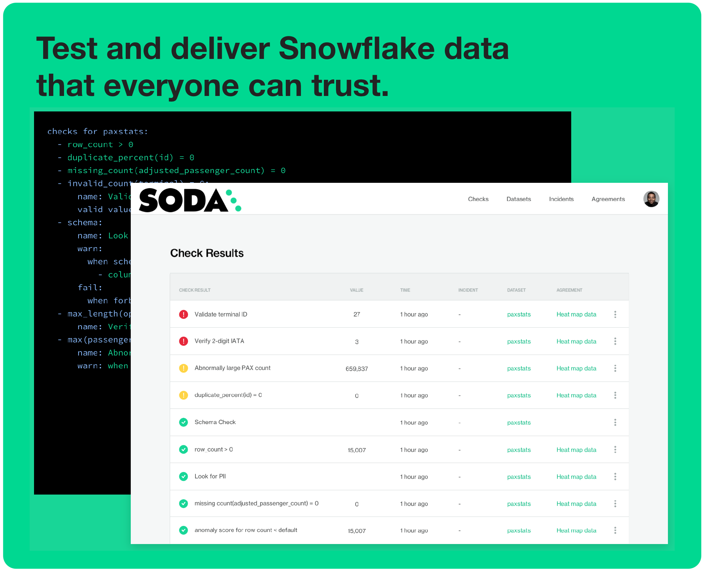
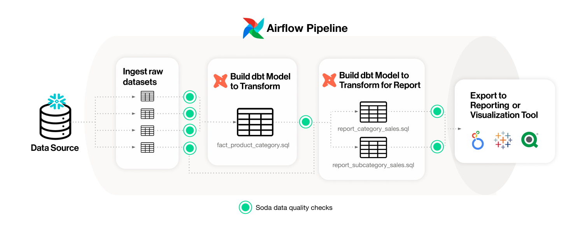
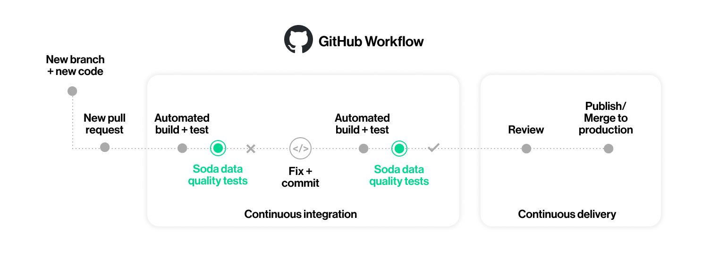
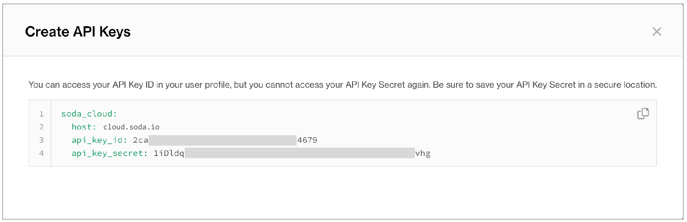
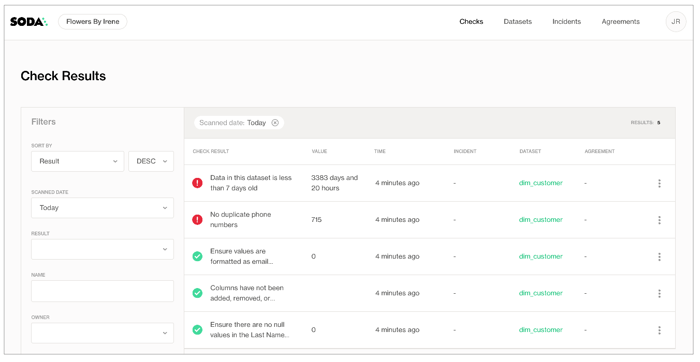
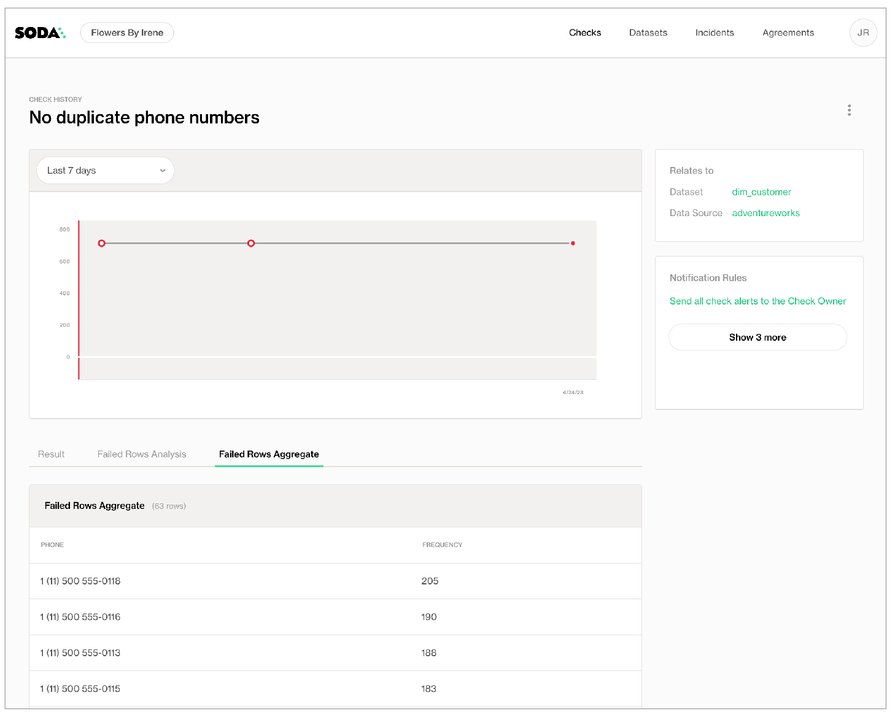

author: Janet Revell
id: soda
summary: Follow this guide to set up and run a Soda scan for data quality in Snowflake.
categories: Getting-Started, Data-Engineering
environments: web
status: Published 
feedback link: https://github.com/Snowflake-Labs/sfguides/issues
tags: Getting Started, Data Science, Data Engineering, Data Quality, Data Testing

# Data Quality Testing with Soda
<!-- ------------------------ -->
## Overview 
Duration: 2



Is Soda the data quality testing solution you’ve been looking for? 🥤Take a sip and see!  Use this guide to install Soda, connect it to your Snowflake data source, and run a simple Soda scan for data quality.

Soda is a tool that enables Data Engineers to test data for quality where and when they need to.

Is your data fresh? Is it complete or missing values? Are there unexpected duplicate values? Did something go wrong during transformation? Are all the data values valid? These are the questions that Soda answers for Data Engineers.

- Use Soda with GitHub Actions to test data quality during CI/CD development.
- Use it with Airflow to test data quality after ingestion and transformation in your pipeline.
- Import your dbt tests into the Soda Cloud to facilitate issue investigation and track dataset health over time.
- Integrate Soda with your data catalog to gauge dataset health from within the catalog.
 

### Prerequisites
- This guide assumes you are comfortable using the command-line.

### What You Will Learn 
- How to install Soda from the command line
- How to connect Soda to Snowflake
- How to create and connect a Soda Cloud account 
- How to write checks to test for data quality
- How to run a scan and see test results in the CLI and in Soda Cloud 

### What You Need 
- You have installed [Python 3.8](https://www.python.org/downloads/) or greater.
- You have installed Pip 21.0 or greater.
- You have installed a code editor such as [Visual Studio Code](https://code.visualstudio.com/) or [Sublime](https://www.sublimetext.com/).
- You have a Snowflake Account. If not, [start a free trial](https://trial.snowflake.com/?owner=SPN-PID-420074)!
- You have a Snowflake database that contains data.
- You have login credentials for your Snowflake database.

### What You Will Build 
- You'll have a set of data quality tests and a means to execute them against your data in Snowflake.
- You'll have a Soda Cloud account that enables you to set up alert notifications, access visualized scan results that track trends in data quality over time, and invite colleagues to join your data quality testing efforts. 

<!-- ------------------------ -->
## How Soda Works
Duration: 2

Soda works by taking the data quality checks that you prepare and using them to run a scan of datasets in a data source. A scan is a CLI command which instructs Soda to prepare optimized SQL queries that execute data quality checks on your data source to find invalid, missing, or unexpected data. When checks fail, they surface bad-quality data and present check results that help you investigate and address quality issues.

To test your data quality, you install the **Soda Library CLI tool** and sign up for a **Soda Cloud account** so that you can complete the following tasks:

- **Connect to your data source**
To connect to your Snowflake data source, you use a `configuration.yml` file which stores access details for your data source such as host, port, and data source login credentials.
- **Define checks to surface “bad” data**
To define the data quality checks that Soda runs against a dataset, you use a `checks.yml` file. A Soda Check is a test that Soda performs when it scans a dataset in your data source. The checks YAML file stores the checks you write using the Soda Checks Language (SodaCL), a domain-specific language for data quality testing.
- **Run a scan to execute your data quality checks**
During a scan, Soda does not ingest your data, it only scans it for quality metrics, then uses the metadata to prepare scan results. (An exception to this rule is when Soda collects failed row samples that it presents in scan output to aid with issue investigation, a feature you can limit or disable.) <br />After a scan, each check results in one of three default states:
  - pass: the values in the dataset match or fall within the thresholds you specified
  - fail: the values in the dataset do not match or fall within the thresholds you specified
  - error: the syntax of the check is invalid, or there are runtime or credential errors
  - A fourth state, warn, is something you can explicitly configure for individual checks.
- **Review scan results and investigate issues**
You can review the scan output in the command-line and in your Soda Cloud account. Add API keys to the same `configuration.yml` file to push check results to your account so you can access visualized scan results, set alert notifications, track trends in data quality over time, and integrate with the messaging, ticketing, and data cataloging tools you already use, like Slack, Jira, and Alation.

Add Soda data quality checks to your **data pipeline** to prevent downstream issues.



Use GitHub Actions to add automated Soda data quality checks to your **development workflow** to prevent merging issues into production.



<!-- ------------------------ -->
## Install Soda
Duration: 2

1. In your command-line interface, create a Soda project directory in your local environment, then navigate to the directory.
    ```shell
    mkdir soda_sip
    cd soda_sip
    ```
2. Best practice dictates that you install the Soda using a virtual environment. In your command-line interface, create a virtual environment in a `.venv` directory.
    ```
    python3 -m venv .venv
    ```
3. Activate the virtual environment.
    ```shell
    source .venv/bin/activate
    ```
4. Execute the following command to install the Soda package for Snowflake in your virtual environment. 
    ```shell
    pip install -i https://pypi.cloud.soda.io soda-snowflake
    ```
5. Validate the installation.
    ```shell
    soda --help
    ```
    ```shell
    # Example output
    Usage: soda [OPTIONS] COMMAND [ARGS]...

      Soda Library CLI version 1.0.0, Soda Core CLI version 3.0.39

    Options:
      --version  Show the version and exit.
      --help     Show this message and exit.

    Commands:
      ingest           Ingests test results from a different tool
      scan             Runs a scan
      suggest          Generates suggestions for a dataset
      test-connection  Tests a connection
      update-dro       Updates contents of a distribution reference file
    ```


To exit the virtual environment when you are done with this tutorial, use the command `deactivate`.

<!-- ------------------------ -->
## Connect Soda to Snowflake
Duration: 8

To connect Soda to Snowflake, you use a `configuration.yml` file which stores access details for your data source.

This guide also instructs you to connect to a Soda Cloud account using API keys that you create and add to the same `configuration.yml` file. Available for free as a 45-day trial, your Soda Cloud account gives you access to visualized scan results, tracks trends in data quality over time, enables you to set alert notifications, and much more.

1. In a code editor such as Sublime or Visual Studio Code, create a new file called `configuration.yml` and save it in your `soda_sip` directory.
2. Copy and paste the connection configuration details for Snowflake as in the example below. 
- Replace `my_datasource_name` with the name of your own Snowflake data source. 
- Replace the values for each parameter with your own Snowflake-specific values. Refer to [Soda documentation](https://go.soda.io/connect-snowflake) for details.
    ```yaml
     data_source my_datasource_name:
       type: snowflake
       connection:
         username: ${SNOWFLAKE_USER}
         password: ${SNOWFLAKE_PASS}
         account: plu449.us-west-1
         database: sodadata_test
         warehouse: compute_wh
         role: analyst
         session_parameters:
           QUERY_TAG: soda-queries
           QUOTED_IDENTIFIERS_IGNORE_CASE: false
       schema: public
    ```
3. In a browser, navigate to [cloud.soda.io/signup](https://cloud.soda.io/signup?utm_source=snowflake+quickstart) to create a new Soda account. If you already have a Soda account, log in.
4. Navigate to **your avatar** > **Profile**, then access the **API keys** tab. Click the plus icon to generate a new set of API keys.

5. Copy the `soda_cloud` syntax and paste into your `configuration.yml` file. Do not nest the `soda_cloud` syntax in the `data_source` block.
    ```yaml
     data_source my_datasource_name:
       type: snowflake
       connection:
         username: ${SNOWFLAKE_USER}
         password: ${SNOWFLAKE_PASS}
         ...

     soda_cloud:
        host: cloud.soda.io
        api_key_id: 2ca***4679
        api_key_secret: 1iDldq***vhg
    ```
6. Save the `configuration.yml` file and close the API modal in your Soda account.
7. From the command-line, in the virtual environment in the `soda_sip` directory, run the following command to test Soda’s connection to Snowflake, replacing the value of `my_datasource_name` with the name of your Snowflake data source.
    ```shell
    soda test-connection -d my_datasource_name -c configuration.yml
    ```
    ```shell
    # Example output
    Soda Library 1.0.0
    Soda Core 3.0.39
    Successfully connected to 'adventureworks'.
    Connection 'adventureworks' is valid.
    ```
    Need help? Ask the [Soda community on Slack](https://go.soda.io/slack).

<!-- ------------------------ -->
## Write data quality checks and run a scan
Duration: 6

A check is a test that Soda executes when it scans a dataset in your data source. The `checks.yml` file stores the checks you write using the [Soda Checks Language (SodaCL)](https://go.soda.io/sodacl). You can create multiple checks.yml files to organize your data quality checks and run all, or some of them, at scan time.

1. In the same `soda_sip` directory, create another file named `checks.yml`.
2. Open the `checks.yml` file in your code editor, then copy and paste the following rather generic checks into the file. Note that the `row_count` check is written to fail to demonstrate what happens when a data quality check fails.
- Replace the value of `dataset_name` with the name of a dataset in your Snowflake data source.
- Replace the value of `column1` with the name of a column in the dataset.
    ```yaml
       checks for dataset_name:
       # Checks that dataset contains fewer than 2 rows; written to fail
         - row_count < 2:
             name: Dataset is unreasonably small
       # Checks that column contains no NULL values
         - missing_count(column1) = 0:
             name: No NULL values
       # Checks for columns removed or added, or changed type or index 
         - schema:
             warn:
               when schema changes: any
             name: No changes to schema
    ```
3. Save the `checks.yml` file, then, from the command-line, use the following command to run a scan. A scan is a CLI command which instructs Soda to prepare SQL queries that execute data quality checks on your data source. As input, the command requires:
- `-d` the name of the data source to scan; replace `my_datasource_name` with your Snowflake data source name
- `-c` the filepath and name of the `configuration.yml` file
- the filepath and name of the `checks.yml` file
    ```shell
    soda scan -d my_datasource_name -c configuration.yml checks.yml
    ```
    ```shell
    # Example output
    Soda 1.0.0
    Soda Core 3.0.39
    By downloading and using Soda Library, you agree to Sodas Terms & Conditions (https://go.soda.io/t&c) and Privacy Policy (https://go.soda.io/privacy). 
    Sending failed row samples to Soda Cloud
    Scan summary:
    3/5 checks PASSED: 
     dim_customer in adventureworks
     No changes to schema [PASSED]
     Emails formatted correctly [PASSED]
     No null values for last name [PASSED]
    2/5 checks FAILED: 
     dim_customer in adventureworks
     No duplicate phone numbers [FAILED]
       check_value: 715
     Data is fresh [FAILED]
       max_column_timestamp: 2014-01-28 23:59:59.999999
       max_column_timestamp_utc: 2014-01-28 23:59:59.999999+00:00
       now_variable_name: NOW
       now_timestamp: 2023-04-24T21:02:15.900007+00:00
       now_timestamp_utc: 2023-04-24 21:02:15.900007+00:00
       freshness: 3372 days, 21:02:15.900008
    Oops! 2 failures. 0 warnings. 0 errors. 3 pass.
    Sending results to Soda Cloud
    Soda Cloud Trace: 4417******32502
    ```
    Need help? Ask the [Soda community on Slack](https://go.soda.io/slack).<br />
4. As you can see from the CLI output, some checks failed and Soda sent the results to your Soda Cloud account. To access visualized check results and further examine the failed checks, return to your Soda account in your browser and click **Checks**.
    
5. In the table of check results Soda displays, you can click the line item for one of the checks that failed to examine the visualized results in a line graph, and to access the failed row samples that Soda automatically collected when it ran the scan and executed the checks.
    

✨Well done!✨ You’ve taken the first step towards a future in which you and your colleagues can trust the quality and reliability of your data. Huzzah!

<!-- ------------------------ -->
## Conclusion and Resources
Duration: 1

Now that you have seen Soda in action, learn more about how and where to integrate data quality into your existing workflows and pipelines.

### Choose Your Adventure
- [Test data during development](https://go.soda.io/cicd)
- [Test data in your pipeline](https://go.soda.io/pipeline)
- [Enable end-user testing](https://go.soda.io/self-serve)

### Experiment
- [SodaCL tutorial](https://go.soda.io/sodacl-quick-start)
- [Discover 25+ built-in Soda metrics and checks](https://go.soda.io/metric_check_configurations)
- [Compare your data](https://go.soda.io/compare)

### Sip More Soda
- [Integrate with Slack](https://go.soda.io/integrate-slack)
- [Add alert notification rules](https://go.soda.io/alerts)
- [Integrate with dbt](https://go.soda.io/soda-dbt)
- [Report on data health](https://go.soda.io/reporting-api)


### Need help?
- [Request a demo.](https://www.soda.io/schedule-a-demo) Hey, what can Soda do for you?
- Join the [Soda community on Slack](https://go.soda.io/slack).
