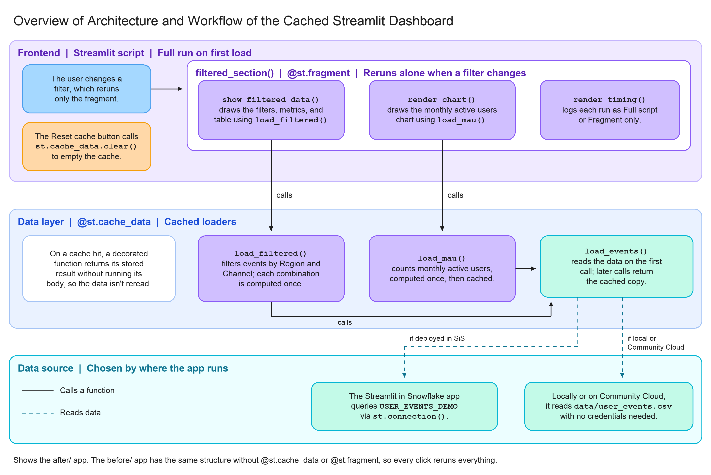
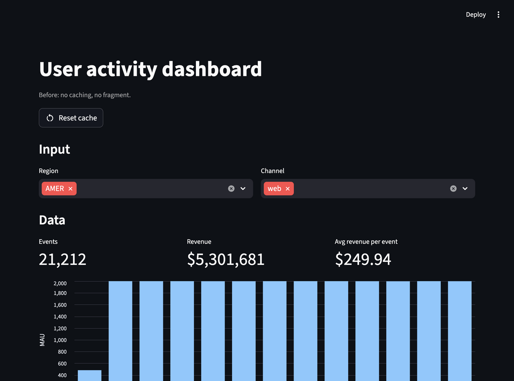
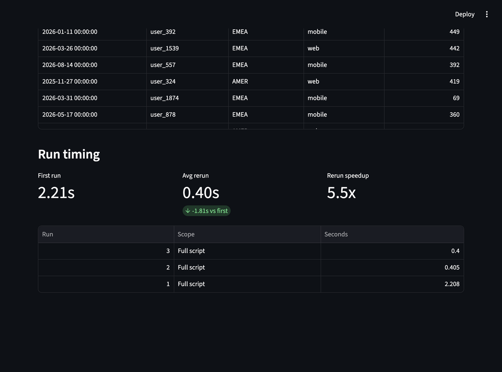
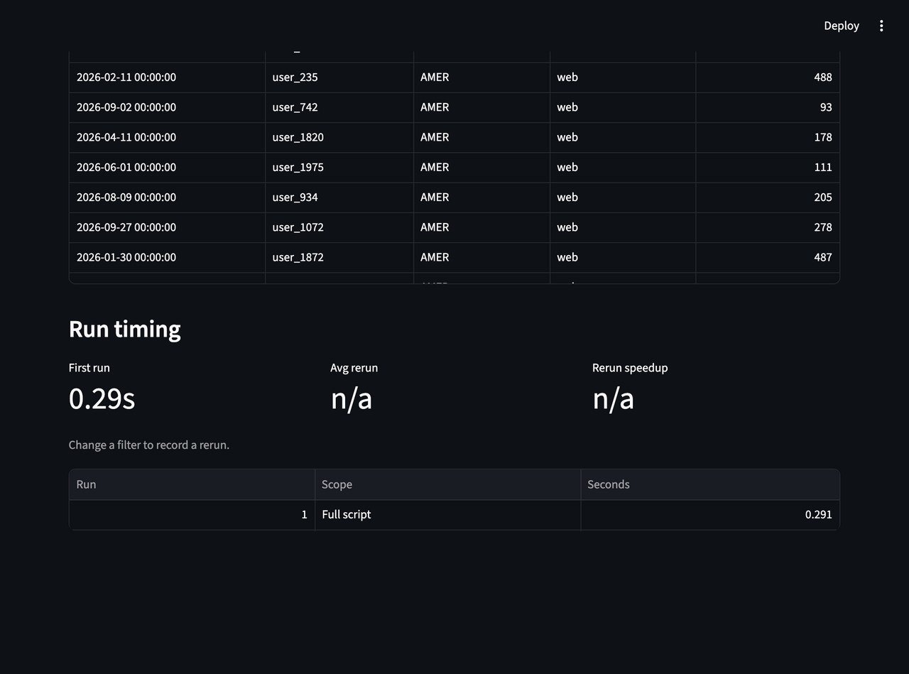
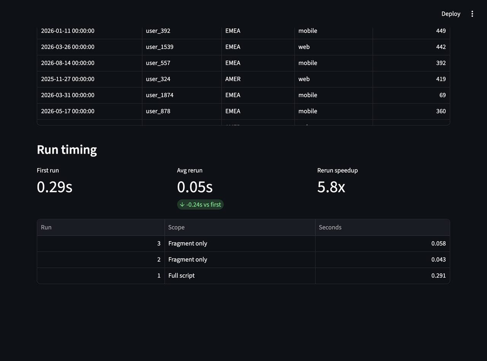
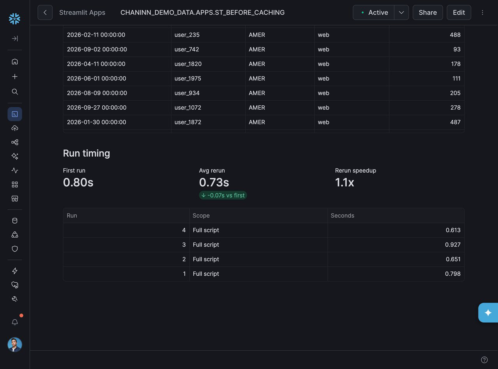
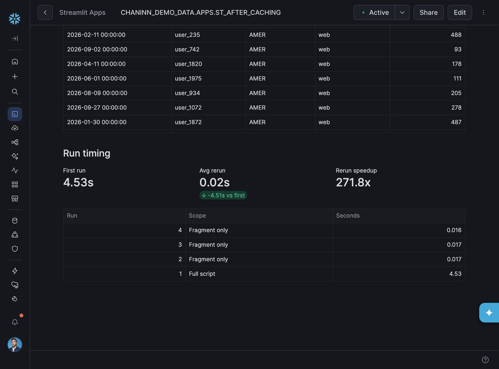
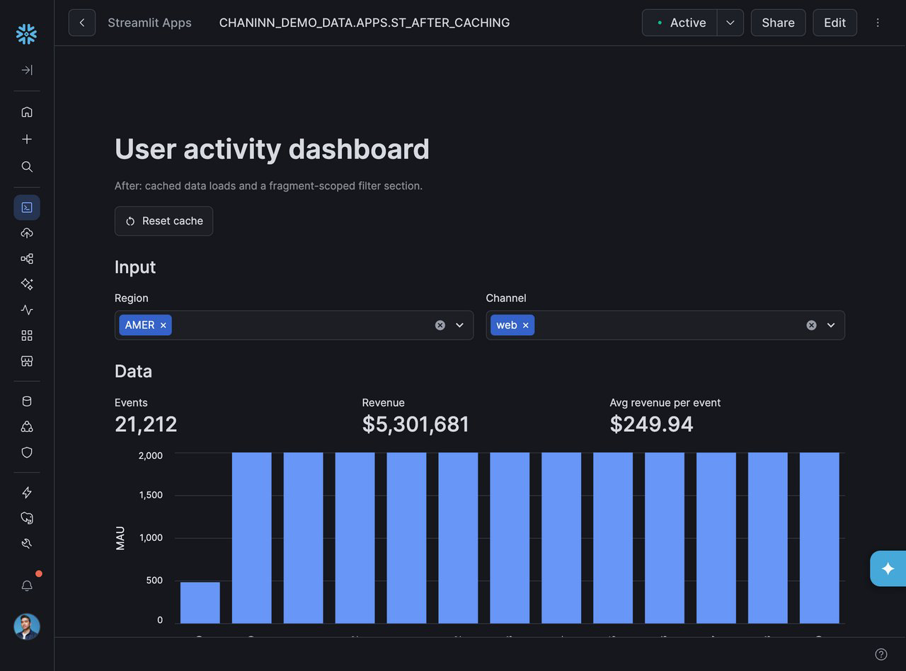

author: Chanin Nantasenamat
id: speed-up-streamlit-apps-with-caching-and-fragments
categories: snowflake-site:taxonomy/solution-center/certification/quickstart, snowflake-site:taxonomy/product/applications-and-collaboration
language: en
summary: Use Cortex Code to add @st.cache_data and @st.fragment to a Streamlit dashboard so filter clicks stop rerunning the whole script and reloading the data.
environments: web
status: Published
feedback link: https://github.com/Snowflake-Labs/sfguides/issues
fork repo link: https://github.com/sfc-gh-cnantasenamat/speed-up-streamlit-apps-with-caching-and-fragments


# Speed Up Streamlit Apps with Caching and Fragments
<!-- ------------------------ -->
## Overview

A Streamlit app is easy to build until users start clicking filters. Every click reruns the whole script from top to bottom, and every data load runs again, even when nothing about the data changed. Against a Snowflake warehouse, that means repeated queries, slower widgets, and credits spent on work that didn't need to happen.

In this guide, you start with a user-activity dashboard that has this problem and ask Cortex Code (CoCo) to fix it with two Streamlit features: `@st.cache_data`, which loads data once and reuses it, and `@st.fragment`, which limits a filter click to rerunning just the filter section.


### What You'll Learn
- Why a Streamlit app reruns the whole script, and every data load, on each widget click
- How `@st.cache_data` stores the result of a data load and reuses it on later calls and reruns
- How `@st.fragment` scopes a rerun to one section of the page
- How to prompt CoCo to apply both patterns and review the proposed diff

### What You'll Build
Two versions of the same dashboard: a "before" app with no caching and no fragment, and an "after" app with `@st.cache_data` on its three data loads and `@st.fragment` on its filter section. Each app has a timing panel so you can measure the difference yourself.

The diagram below shows how the after app fits together. The filter section is a fragment that calls the cached loaders, and all of those loaders share one cached read of the data source.



### Prerequisites
- Access to a [Snowflake account](https://signup.snowflake.com/?utm_source=snowflake-devrel&utm_medium=developer-guides&utm_cta=developer-guides)
- Access to [Cortex Code](https://docs.snowflake.com/en/user-guide/cortex-code/cortex-code), in Snowsight or CoCo Desktop
- Python 3.11 or later and Git
- Optional: the [Snowflake CLI](https://docs.snowflake.com/en/developer-guide/snowflake-cli/index), to deploy to Streamlit in Snowflake with `setup.sql`
- Optional: a GitHub account, to deploy to Streamlit Community Cloud
- Basic familiarity with Streamlit

<!-- ------------------------ -->
## Setup

### Clone the Companion Repo

The companion repo contains both apps and a bundled CSV of 200k synthetic user events, so no Snowflake credentials are needed to run them.

```bash
git clone https://github.com/sfc-gh-cnantasenamat/speed-up-streamlit-apps-with-caching-and-fragments.git
cd speed-up-streamlit-apps-with-caching-and-fragments
pip install -r after/requirements.txt
```

The repo layout:

| Path | Contents |
|---|---|
| `before/streamlit_app.py` | The starting dashboard: no caching, no fragment |
| `after/streamlit_app.py` | The finished dashboard, for comparing with CoCo's changes |
| `before/requirements.txt`, `after/requirements.txt` | Packages for running locally or on Streamlit Community Cloud |
| `before/pyproject.toml`, `after/pyproject.toml` | Packages for Streamlit in Snowflake, including Snowpark |
| `data/user_events.csv` | 200k synthetic user events |
| `setup.sql` | Loads the CSV into a table and creates both apps in Streamlit in Snowflake |

### Run the Before App

```bash
streamlit run before/streamlit_app.py --server.port 8601
```

If your shell can't find the `streamlit` command, run `python -m streamlit run before/streamlit_app.py --server.port 8601` instead.

The dashboard opens at `http://localhost:8601`, with Region and Channel filters, metrics, a monthly active users chart, a data table, and a **Run timing** panel.



<!-- ------------------------ -->
## Explore the Before App

### Find the Repeated Work

The app loads its data in three functions. `load_events()` reads the data (the CSV when you run locally), and both `load_filtered()` (for the metrics and the table) and `load_mau()` (for the chart) call it:

```python
def load_events() -> pd.DataFrame:
    session = snowflake_session()
    if session is not None:
        df = session.sql(
            "SELECT EVENT_DATE, USER_ID, REGION, CHANNEL, REVENUE FROM USER_EVENTS_DEMO"
        ).to_pandas()
        df["EVENT_DATE"] = pd.to_datetime(df["EVENT_DATE"])
        return df
    try:
        return pd.read_csv(DATA_PATH, parse_dates=["EVENT_DATE"])
    except (FileNotFoundError, pd.errors.EmptyDataError, pd.errors.ParserError):
        return generate_events()


def load_filtered(regions: tuple[str, ...], channels: tuple[str, ...]) -> pd.DataFrame:
    df = load_events()
    return df[df["REGION"].isin(regions) & df["CHANNEL"].isin(channels)]


def load_mau() -> pd.DataFrame:
    df = load_events()
    month = df["EVENT_DATE"].dt.to_period("M").dt.to_timestamp()
    return (
        df.groupby(month)["USER_ID"].nunique()
        .rename("MAU").rename_axis("MONTH").reset_index()
    )
```

Nothing is cached, so every run of the script reads the CSV twice: once through `load_filtered()` and once through `load_mau()`.

### Measure a Rerun

Change the Region filter a few times and watch the **Run timing** panel. Each click logs a **Full script** run, because Streamlit reruns the entire file whenever a widget changes. The reruns come in a little under the first run, which also pays one-time startup costs, but each one still reads the CSV twice and rebuilds everything on the page.



<!-- ------------------------ -->
## Refactor with CoCo

### Ask CoCo to Diagnose

Open `before/streamlit_app.py` in Cortex Code, either in Snowsight or in CoCo Desktop. Don't highlight a selection, so CoCo works with the whole file. Start by asking CoCo to find the problem rather than telling it the fix:

```console
This Streamlit app feels slow every time I change a filter. Explain what work is repeated on each rerun and how I could avoid it. Don't change any code yet.
```

CoCo should point out the same issues you found in the previous section:

- Nothing is cached, so `load_events()` reads the CSV on every run
- `load_filtered()` and `load_mau()` both call `load_events()`, so each run reads the CSV twice
- Every filter change reruns the whole script, not just the filter section

It may suggest `@st.cache_data` and `@st.fragment` on its own. Its exact wording will vary.

### Prompt CoCo to Refactor

Now ask for the fix. Naming the functions keeps the change focused:

```console
Add @st.cache_data to load_events(), load_filtered(), and load_mau(), and decorate filtered_section() with @st.fragment so a filter change reruns only that section. Don't change anything else.
```

### Review the Diff

CoCo shows its proposed changes as a diff for you to review before accepting. Check that it:

- Adds `@st.cache_data` to `load_events()`, `load_filtered()`, and `load_mau()`
- Adds `@st.fragment` to `filtered_section()`
- Leaves the rest of the app unchanged

Accept the changes, then compare your result with the finished version in the repo:

```bash
diff before/streamlit_app.py after/streamlit_app.py
```

Besides the four decorators, this diff shows a few cosmetic differences that CoCo won't make from the prompt: the docstring, the page title, and the caption under the title. You can ignore these. Only the decorators change how the app runs.

The next two sections explain what each change does.

<!-- ------------------------ -->
## Cache Data Loads

### Add @st.cache_data

`@st.cache_data` stores a function's return value. The next call with the same arguments returns the stored copy instead of running the function again:

```python
@st.cache_data(show_spinner="Loading events...")
def load_events() -> pd.DataFrame:
    session = snowflake_session()
    if session is not None:
        df = session.sql(
            "SELECT EVENT_DATE, USER_ID, REGION, CHANNEL, REVENUE FROM USER_EVENTS_DEMO"
        ).to_pandas()
        df["EVENT_DATE"] = pd.to_datetime(df["EVENT_DATE"])
        return df
    try:
        return pd.read_csv(DATA_PATH, parse_dates=["EVENT_DATE"])
    except (FileNotFoundError, pd.errors.EmptyDataError, pd.errors.ParserError):
        return generate_events()


@st.cache_data(show_spinner="Filtering events...")
def load_filtered(regions: tuple[str, ...], channels: tuple[str, ...]) -> pd.DataFrame:
    df = load_events()
    return df[df["REGION"].isin(regions) & df["CHANNEL"].isin(channels)]


@st.cache_data(show_spinner="Aggregating monthly active users...")
def load_mau() -> pd.DataFrame:
    df = load_events()
    month = df["EVENT_DATE"].dt.to_period("M").dt.to_timestamp()
    return (
        df.groupby(month)["USER_ID"].nunique()
        .rename("MAU").rename_axis("MONTH").reset_index()
    )
```

### What Changes on Each Run

- **First run:** `load_filtered()` calls `load_events()`, which reads the CSV and caches the result. When `load_mau()` calls `load_events()`, it gets the cached copy, so the CSV is read once instead of twice.
- **Reruns:** `load_filtered()` and `load_mau()` are cached too, so a repeat filter selection returns from the cache without reading the CSV at all.
- **Cache keys:** The function arguments are part of the cache key. Each Region and Channel combination is computed once, and picking it again returns the stored result.

After you click **Reset cache**, the after app's first run fills the cache with a single CSV read:



### Things to Know

- Locally and on Community Cloud, the cache is shared across all users and sessions of the app, not just your browser tab. If someone else already filled it, your "first run" is already fast. In Streamlit in Snowflake, this holds only on the container runtime; the warehouse runtime caches within a single viewer's session.
- The apps include a **Reset cache** button that calls `st.cache_data.clear()`, so you can measure from an empty cache.
- For data that changes, set a `ttl`, for example `@st.cache_data(ttl="10m")`, so cached results expire and reload.

<!-- ------------------------ -->
## Isolate Filters with Fragments

### Add @st.fragment

Without a fragment, any widget change reruns the whole script. With `@st.fragment`, a widget change inside the decorated function reruns only that function:

```python
@st.fragment
def filtered_section() -> None:
    start = run_start if st.session_state.get("full_run") else time.perf_counter()
    show_filtered_data()
    render_timing(start)


st.subheader("Input")
filtered_section()
```

The Region and Channel filters live inside `filtered_section()`, so changing a filter now reruns just this section. The **Run timing** panel logs these runs as **Fragment only** instead of **Full script**.



### When Fragments Help Most

In this small app, the fragment covers most of the page, so most of the speedup comes from caching. Fragments pay off more as an app grows: a filter section in a fragment won't rerun other charts, tabs, or expensive sections elsewhere on the page.

<!-- ------------------------ -->
## Compare the Results

Run both apps side by side:

```bash
streamlit run before/streamlit_app.py --server.port 8601
streamlit run after/streamlit_app.py --server.port 8602
```

In each app, click **Reset cache**, then change the Region filter a few times. In the screenshots above, the two apps compared like this:

| | Before | After |
|---|---|---|
| First run | ~2.2s (2 CSV reads, plus startup) | ~0.3s (1 CSV read) |
| Avg rerun | ~0.4s (2 CSV reads again, full script) | ~0.05s (0 reads, fragment only) |

Your numbers will vary with hardware, but the pattern holds: the before app redoes all its work on every click, and the after app reuses it. The gap is larger in Streamlit in Snowflake, where each uncached rerun is a round trip to run a query. Running both apps there against the same table gave:

| | Before | After |
|---|---|---|
| First run | ~4.1s (2 queries, plus container startup) | ~4.5s (1 query, plus container startup) |
| Avg rerun | ~0.73s (2 queries again, full script) | ~0.017s (0 queries, fragment only) |

The first runs are close because container startup dominates them. The reruns are where the apps differ: every rerun of the before app queries the warehouse twice, and the after app's reruns don't touch the warehouse at all.





<!-- ------------------------ -->
## Load from Snowflake

Both apps pick their data source based on where they run. A helper, `snowflake_session()`, returns the app's Snowpark session when the app runs in Streamlit in Snowflake, and `None` everywhere else:

```python
def snowflake_session():
    # Container runtime: the SPCS service mounts a session token here.
    # Errors aren't caught, so a missing Snowpark package fails loudly
    # instead of falling back to sample data.
    if Path("/snowflake/session/token").exists():
        return st.connection("snowflake").session()
    try:
        # Warehouse runtime: Snowpark provides the active session.
        from snowflake.snowpark.context import get_active_session
        return get_active_session()
    except Exception:
        return None
```

- **Locally or on Streamlit Community Cloud:** there's no Snowflake session, so `load_events()` reads `data/user_events.csv`. No credentials are needed.
- **In Streamlit in Snowflake:** `load_events()` queries the `USER_EVENTS_DEMO` table using the app owner's role.

### Deploy to Streamlit Community Cloud

The apps run on Community Cloud without changes, because they fall back to the bundled CSV:

1. Fork the companion repo to your GitHub account.
2. In [Streamlit Community Cloud](https://share.streamlit.io), select **Create app** » **Deploy a public app from GitHub**.
3. Pick your fork and the `main` branch, and set the main file path to `after/streamlit_app.py`. Community Cloud installs the packages from `after/requirements.txt`.
4. Select **Deploy**. Repeat with `before/streamlit_app.py` to compare the two apps.

### Deploy to Streamlit in Snowflake

To run the after app in Streamlit in Snowflake from Snowsight:

1. **Create the table.** In Snowsight, select **Create** » **Table** » **From File**, upload `data/user_events.csv`, pick the database and schema for the app, and name the table `USER_EVENTS_DEMO`. Your role needs USAGE on the database and CREATE TABLE on the schema. To use your own table instead, change the query in `load_events()` to point at a table with the same columns.
2. **Create the app on a container runtime.** Create a Streamlit app in the same database and schema, and choose the container runtime when you set it up. The container runtime runs Streamlit 1.50 or later, which supports `@st.fragment`, and it shares cached values across all viewers. The warehouse runtime offers a limited selection of Streamlit versions and caches per viewer session only. Your role needs CREATE STREAMLIT on the schema, plus USAGE on a compute pool, a query warehouse, and the external access integration from the next step.
3. **Add the code and its dependencies.** Replace the app's `streamlit_app.py` and `pyproject.toml` with the files in `after/`. The repo's `pyproject.toml` lists `snowflake-snowpark-python`, which the container runtime needs to open a session. The runtime installs these packages from PyPI when it starts, so the app also needs an external access integration that allows PyPI. Ask your admin for one if you don't have it. Without it, the app fails to start with a package server error.
4. **Run the app and confirm the source.** Run the app. The first open takes a minute or two while the container starts and installs the packages. The **Events** count should match `SELECT COUNT(*) FROM USER_EVENTS_DEMO WHERE REGION = 'AMER' AND CHANNEL = 'web'`. The data now comes from the query, and `@st.cache_data` caches the query result in the same way it cached the CSV read.



To compare both apps as in the table above, repeat steps 2 to 4 with the files in `before/`.

If you'd rather use SQL, `setup.sql` in the repo does all of this for both apps. It creates the `USER_EVENTS_DEMO` table, uploads the CSV and both apps' `streamlit_app.py` and `pyproject.toml` files to a stage, loads the table, and creates `USER_ACTIVITY_BEFORE` and `USER_ACTIVITY_AFTER` on the container runtime. Replace the placeholders at the top of the file with your database, schema, warehouse, compute pool, and external access integration, then run it from the repo root with the [Snowflake CLI](https://docs.snowflake.com/en/developer-guide/snowflake-cli/index):

```bash
snow sql -f setup.sql
```

The file uses `PUT` to upload local files, so run it from the Snowflake CLI rather than a Snowsight worksheet. Each app is created from its own stage folder:

```sql
CREATE OR REPLACE STREAMLIT USER_ACTIVITY_AFTER
  FROM '@ST_CACHING_STAGE/after'
  MAIN_FILE = 'streamlit_app.py'
  RUNTIME_NAME = 'SYSTEM$ST_CONTAINER_RUNTIME_PY3_11'
  COMPUTE_POOL = MY_COMPUTE_POOL
  QUERY_WAREHOUSE = MY_WAREHOUSE
  EXTERNAL_ACCESS_INTEGRATIONS = (MY_PYPI_ACCESS_INTEGRATION);
```

The last statement in the file prints the AMER and web event count, which the after app's **Events** metric should match.

If the app doesn't start, check these:

- **"Failed to retrieve packages from the package server":** the app has no external access integration that allows PyPI. Attach one with `ALTER STREAMLIT ... SET EXTERNAL_ACCESS_INTEGRATIONS = (...)`.
- **"The selected compute pool is unable to start your app":** the compute pool is at its node limit. Wait for capacity, stop other apps on the pool, or use a different pool.
- **Numbers don't match the `COUNT(*)` query:** the app isn't reading your table. Check that `pyproject.toml` lists `snowflake-snowpark-python` and that the table is in the same database and schema as the app.

`load_filtered()` and `load_mau()` don't change. They still call `load_events()`, so caching saves a query instead of a CSV read. Each uncached rerun would otherwise use warehouse time.

To point the query at a different table, ask CoCo:

```console
Change the query in load_events() to read from MY_DB.MY_SCHEMA.MY_EVENTS, and keep the column names the same.
```

<!-- ------------------------ -->
## Clean Up

When you're done, remove what you created so the apps stop using compute and the table stops using storage.

### Snowflake Objects

If you ran `setup.sql`, run these statements in the same database and schema. They're also at the end of the file:

```sql
USE SCHEMA MY_DB.MY_SCHEMA;
DROP STREAMLIT IF EXISTS USER_ACTIVITY_BEFORE;
DROP STREAMLIT IF EXISTS USER_ACTIVITY_AFTER;
DROP STAGE IF EXISTS ST_CACHING_STAGE;
DROP TABLE IF EXISTS USER_EVENTS_DEMO;
```

If you created the apps in Snowsight instead, use the app names you chose there, and drop the `USER_EVENTS_DEMO` table you created from the file. There's no stage to drop in that case. You can also delete each app from its menu in the Snowsight list of Streamlit apps.

### Local and Community Cloud Apps

Stop the local apps with **Ctrl+C** in each terminal. To remove a Community Cloud app, open its menu in your workspace and select **Delete**.

<!-- ------------------------ -->
## Conclusion And Resources

Congratulations! You've successfully used Cortex Code to speed up a Streamlit dashboard with `@st.cache_data` and `@st.fragment`. Filter clicks in the after app reuse cached data and rerun only the filter section, instead of reloading everything on every click.

### What You Learned
- Every widget click reruns a Streamlit script, including every data load, unless you cache it
- `@st.cache_data` stores results by function arguments and reuses them within a run, across reruns, and across sessions
- `@st.fragment` scopes a widget's rerun to a single section of the page
- CoCo can diagnose why an app is slow, and apply both patterns, with each change shown as a diff for review

### Related Resources

Documentation:
- [st.cache_data](https://docs.streamlit.io/develop/api-reference/caching-and-state/st.cache_data)
- [Caching overview](https://docs.streamlit.io/develop/concepts/architecture/caching)
- [st.fragment](https://docs.streamlit.io/develop/api-reference/execution-flow/st.fragment)
- [Working with fragments](https://docs.streamlit.io/develop/concepts/architecture/fragments)
- [Cortex Code](https://docs.snowflake.com/en/user-guide/cortex-code/cortex-code)
- [Connect Streamlit to Snowflake](https://docs.streamlit.io/develop/tutorials/databases/snowflake)
- [Runtime environments for Streamlit in Snowflake](https://docs.snowflake.com/en/developer-guide/streamlit/app-development/runtime-environments)

Companion Repo:
- [speed-up-streamlit-apps-with-caching-and-fragments](https://github.com/sfc-gh-cnantasenamat/speed-up-streamlit-apps-with-caching-and-fragments)
