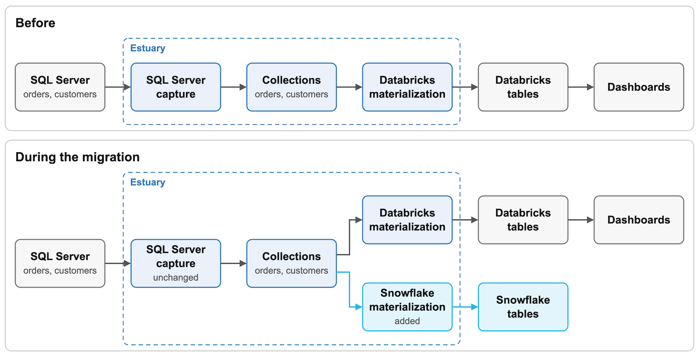
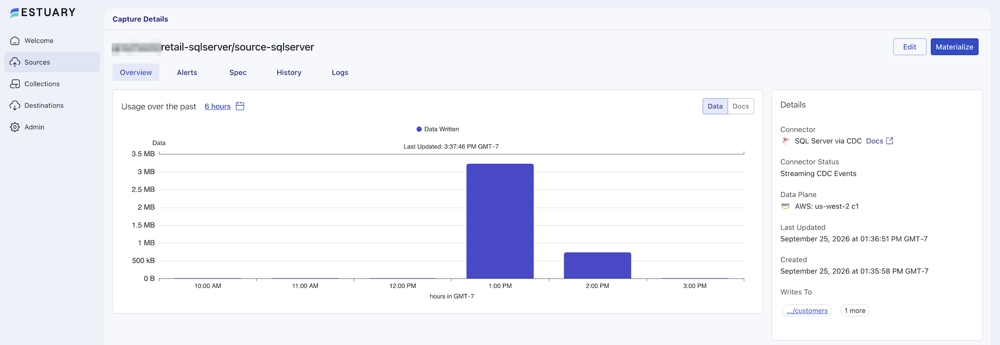
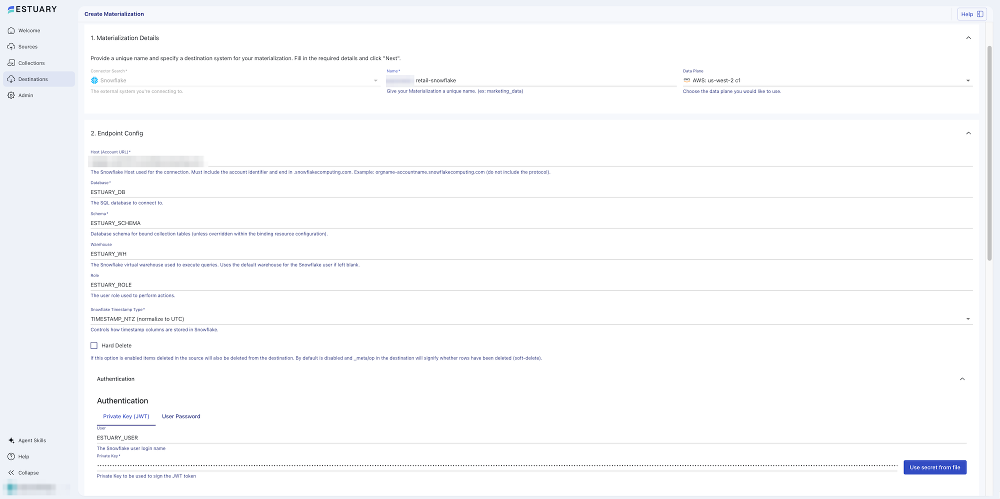
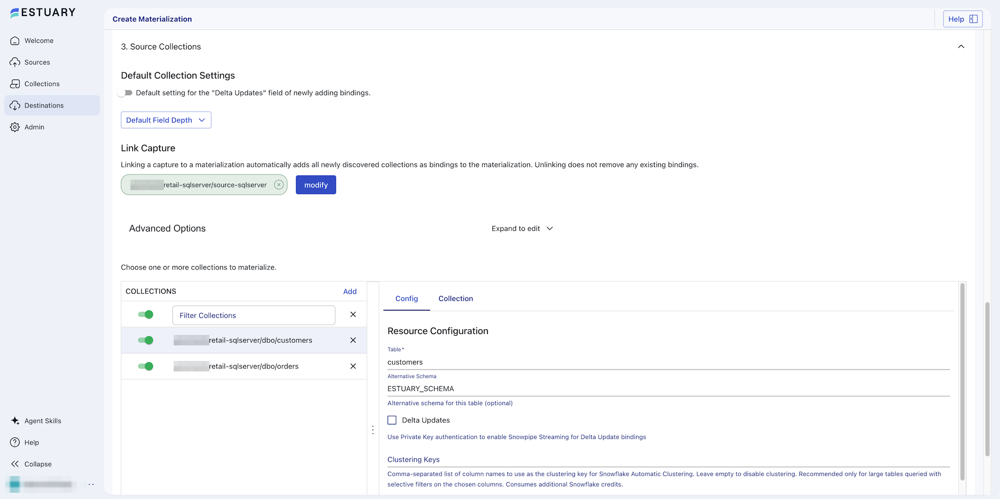
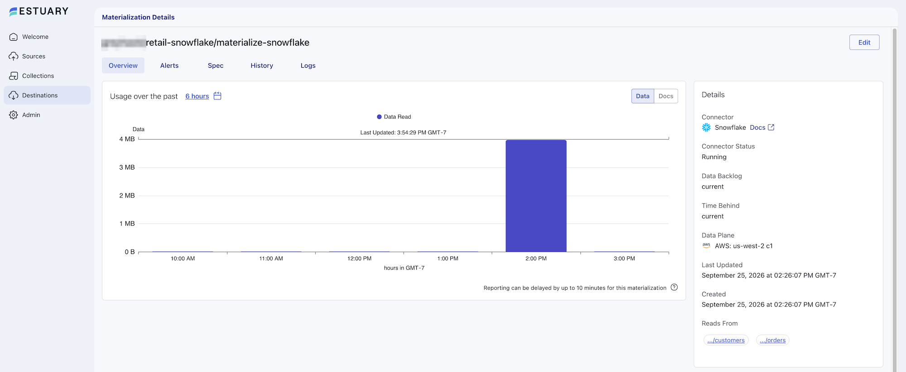
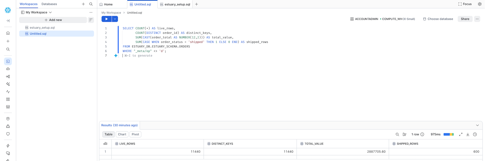
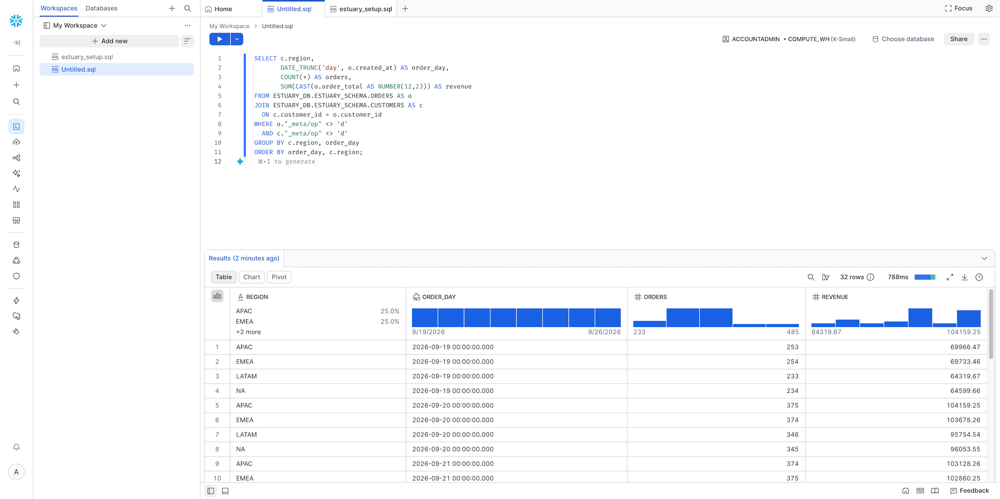
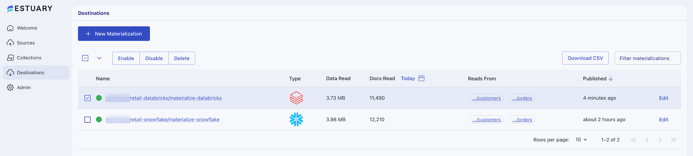

author: Brian Sheehan
id: sql-server-pipeline-migration-with-estuary
language: en
summary: Migrate your SQL Server-to-warehouse pipeline from Databricks to Snowflake using Estuary to keep your old warehouse available through validation and cutover.
categories: snowflake-site:taxonomy/solution-center/certification/quickstart, snowflake-site:taxonomy/solution-center/certification/partner-solution, snowflake-site:taxonomy/product/data-engineering, snowflake-site:taxonomy/snowflake-feature/ingestion, snowflake-site:taxonomy/snowflake-feature/migrations
environments: web
status: Published
feedback link: https://github.com/Snowflake-Labs/sfguides/issues

# Migrate a SQL Server Analytics Pipeline from Databricks to Snowflake with Estuary
<!-- ------------------------ -->
## Overview

This guide shows a SQL Server to Snowflake migration for a team whose analytics pipeline already runs through [Estuary](https://estuary.dev/). SQL Server changes are captured into Estuary and delivered to Databricks, and the team wants its analytics workload in Snowflake instead.

In Estuary, a *capture* reads SQL Server's change data into *collections*, which are durable datasets in cloud storage. Each destination is a *materialization* that reads those collections independently. One capture can feed several destinations. This guide uses that to migrate a data pipeline to Snowflake without a second capture against the production database: add Snowflake beside Databricks, validate the two against each other, move the analytics consumers, and retire Databricks.

### Prerequisites
* Familiarity with SQL and Snowsight
* A working understanding of change data capture (CDC) in SQL Server

### What You'll Learn
* How to add a Snowflake destination to an existing Estuary capture
* What limits how much history a new destination can load
* How to validate Snowflake against SQL Server and Databricks before cutover

### What You'll Need
* An [Estuary](https://dashboard.estuary.dev/register) account with a SQL Server capture and a Databricks materialization, or the sample setup in **Migration Architecture**
* A SQL Server database with CDC enabled that accepts connections from your Estuary data plane's IP addresses. CDC needs SQL Server Enterprise, Standard or Developer edition, or an Azure SQL Database on a vCore tier or DTU tier S3 and above.
* Access to the Databricks workspace the current materialization writes to
* A [Snowflake](https://signup.snowflake.com/) account with access to the ACCOUNTADMIN role

### What You'll Build
* One SQL Server capture feeding Databricks and Snowflake in parallel, then Snowflake alone

<!-- ------------------------ -->
## Migration Architecture

The starting pipeline has an Estuary SQL Server capture writing `orders` and `customers` collections, and a Databricks materialization keeping a table current for each. The migration adds a Snowflake materialization on the same collections. Both destinations receive every change until Snowflake is validated and the consumers have moved, and the Databricks materialization is removed after a rollback period. SQL Server stays in production and the capture is never recreated.



Estuary loads only the tables it materializes. Views, notebooks, jobs and permissions built on top of them in Databricks need to be rebuilt in Snowflake separately.

### Sample dataset

To follow along without an existing pipeline, create the sample tables in a test SQL Server database. [How to enable CDC in SQL Server](https://estuary.dev/blog/enable-sql-server-change-data-capture/) covers the SQL Server setup in more depth.

```sql
CREATE TABLE dbo.customers (
  customer_id   INT           NOT NULL PRIMARY KEY,
  customer_name NVARCHAR(100) NOT NULL,
  region        NVARCHAR(20)  NOT NULL
);

CREATE TABLE dbo.orders (
  order_id     INT           NOT NULL PRIMARY KEY,
  customer_id  INT           NOT NULL REFERENCES dbo.customers (customer_id),
  order_status NVARCHAR(20)  NOT NULL,
  order_total  DECIMAL(12,2) NOT NULL,
  created_at   DATETIME2(3)  NOT NULL,
  updated_at   DATETIME2(3)  NOT NULL
);

INSERT INTO dbo.customers (customer_id, customer_name, region)
SELECT n, CONCAT(N'Customer ', n), CHOOSE(n % 4 + 1, N'NA', N'EMEA', N'APAC', N'LATAM')
FROM (SELECT TOP (50) CAST(ROW_NUMBER() OVER (ORDER BY (SELECT NULL)) AS INT) AS n
      FROM sys.all_objects) AS t;

INSERT INTO dbo.orders (order_id, customer_id, order_status, order_total, created_at, updated_at)
SELECT n, n % 50 + 1, N'placed', CAST(n % 500 + 19.99 AS DECIMAL(12,2)),
       DATEADD(MINUTE, -n, SYSUTCDATETIME()), DATEADD(MINUTE, -n, SYSUTCDATETIME())
FROM (SELECT TOP (10000) CAST(ROW_NUMBER() OVER (ORDER BY (SELECT NULL)) AS INT) AS n
      FROM sys.all_objects AS a CROSS JOIN sys.all_objects AS b) AS t;
```

Enable CDC and create the login Estuary connects with, following the connector's setup instructions:

```sql
EXEC sys.sp_cdc_enable_db;

CREATE LOGIN flow_capture WITH PASSWORD = '<strong-password>';
CREATE USER flow_capture FOR LOGIN flow_capture;
GRANT SELECT ON SCHEMA :: dbo TO flow_capture;
GRANT SELECT ON SCHEMA :: cdc TO flow_capture;
GRANT VIEW DATABASE STATE TO flow_capture;

EXEC sys.sp_cdc_enable_table @source_schema = 'dbo', @source_name = 'customers', @role_name = 'flow_capture';
EXEC sys.sp_cdc_enable_table @source_schema = 'dbo', @source_name = 'orders',    @role_name = 'flow_capture';
```

On self-hosted SQL Server, SQL Server Agent must be running for CDC. Azure SQL Database runs CDC with its own scheduler.

On Azure SQL Database, run `CREATE LOGIN` while connected to the `master` database, then reconnect to the sample database for the remaining statements, or replace the `CREATE LOGIN` and `CREATE USER ... FOR LOGIN` statements with a contained user: `CREATE USER flow_capture WITH PASSWORD = '<strong-password>';`. When the capture is published there, its log shows a warning that begins `error determining replica status, assuming primary`. The warning doesn't stop the capture.

Then create a capture with the [SQL Server](https://docs.estuary.dev/reference/Connectors/capture-connectors/SQLServer/) connector (the **SQL Server via CDC** tile) and a materialization on its collections with the [Databricks](https://docs.estuary.dev/reference/Connectors/materialization-connectors/databricks/) connector.

Run this batch a few times during the migration to generate inserts, updates and deletes:

```sql
DECLARE @next INT = (SELECT MAX(order_id) FROM dbo.orders);

INSERT INTO dbo.orders (order_id, customer_id, order_status, order_total, created_at, updated_at)
SELECT @next + n, n % 50 + 1, N'placed', CAST(n % 300 + 9.99 AS DECIMAL(12,2)),
       SYSUTCDATETIME(), SYSUTCDATETIME()
FROM (SELECT TOP (500) CAST(ROW_NUMBER() OVER (ORDER BY (SELECT NULL)) AS INT) AS n
      FROM sys.all_objects) AS t;

UPDATE TOP (200) dbo.orders
SET order_status = N'shipped', updated_at = SYSUTCDATETIME()
WHERE order_status = N'placed';

DELETE TOP (20) FROM dbo.orders
WHERE order_status = N'placed';
```

<!-- ------------------------ -->
## Check Readiness

Snowflake will load from the data Estuary already holds, not from SQL Server. In the Estuary dashboard, open **Sources** and select the SQL Server capture. Its **Connector Status** should read **Streaming CDC Events**, which means no table is still backfilling. During a backfill it reads **Backfilling Tables**. A table set to capture only new changes never backfills its existing rows, so also select **Edit**, open each table's **Config** tab, and check that its **Backfill Mode** isn't **Only Changes**. Leave the page without saving.



Two retention settings apply, and only one limits what Snowflake can load:

* **SQL Server CDC retention** keeps change rows in SQL Server's change tables for three days by default. If change rows expire before the capture reads them, it needs a full backfill from SQL Server. Snowflake never reads the change tables.
* **Collection retention** decides how much history a new destination can read, and is set by the collection's [storage mapping](https://docs.estuary.dev/concepts/storage-mappings/). On Estuary's own trial bucket, data is deleted 20 days after collection. On your own bucket, it stays until your lifecycle policy removes it.

A new materialization reads each collection from the oldest data still retained. If the capture's initial backfill ran longer ago than the retention period, rows it loaded and never changed since are gone from the collection and won't reach Snowflake. If this capture originally populated its collections and its **Created** date, in its **Details** panel, falls within the retention period, every table's initial backfill is still retained. **Populate Snowflake** covers the fix.

On the Databricks materialization's **Spec** tab, note the `syncFrequency` (30 minutes when absent) for the Snowflake sync schedule. The validation queries in this guide assume standard (merge) bindings on both destinations. Note whether any Databricks binding has `"delta_updates": true`: its tables need different comparison queries, and the recovery step in **Populate Snowflake** depends on it. List the dashboards and jobs that will move.

<!-- ------------------------ -->
## Add the Snowflake Destination

### Prepare Snowflake

In a Snowsight workspace with **ACCOUNTADMIN** as the role, select **+ Add new** > **SQL file** and paste the setup script from the [Snowflake connector documentation](https://docs.estuary.dev/reference/Connectors/materialization-connectors/Snowflake/). It creates a role, database, schema, warehouse and service user for Estuary. Change the names in the first five lines if you want different ones, and use your names wherever this guide shows the defaults. Then run the whole file with **Run all** (Cmd+Shift+Return on macOS, Ctrl+Shift+Enter on Windows).

```sql
set database_name = 'ESTUARY_DB';
set warehouse_name = 'ESTUARY_WH';
set estuary_role = 'ESTUARY_ROLE';
set estuary_user = 'ESTUARY_USER';
set estuary_schema = 'ESTUARY_SCHEMA';
-- create role and schema for Estuary
create role if not exists identifier($estuary_role);
grant role identifier($estuary_role) to role SYSADMIN;
-- Create snowflake DB
create database if not exists identifier($database_name);
use database identifier($database_name);
create schema if not exists identifier($estuary_schema);
-- create a user for Estuary
create user if not exists identifier($estuary_user)
  type = service
  default_role = $estuary_role
  default_warehouse = $warehouse_name;
grant role identifier($estuary_role) to user identifier($estuary_user);
-- Estuary requires case-sensitive quoted identifiers (e.g. "_meta/op").
alter user identifier($estuary_user) set QUOTED_IDENTIFIERS_IGNORE_CASE = FALSE;
grant all on schema identifier($estuary_schema) to identifier($estuary_role);
-- create a warehouse for estuary
create warehouse if not exists identifier($warehouse_name)
  warehouse_size = xsmall
  warehouse_type = standard
  auto_suspend = 60
  auto_resume = true
  initially_suspended = true;
-- grant Estuary role access to warehouse
grant USAGE
  on warehouse identifier($warehouse_name)
  to role identifier($estuary_role);
-- grant Estuary access to database
grant CREATE SCHEMA, MONITOR, USAGE on database identifier($database_name) to role identifier($estuary_role);
-- change role to ACCOUNTADMIN for STORAGE INTEGRATION support to Estuary (only needed for Snowflake on GCP)
use role ACCOUNTADMIN;
grant CREATE INTEGRATION on account to role identifier($estuary_role);
use role sysadmin;
COMMIT;
```

The connector authenticates with a key pair. Generate one in a terminal:

```shell
openssl genrsa 2048 | openssl pkcs8 -topk8 -inform PEM -out rsa_key.p8 -nocrypt
openssl rsa -in rsa_key.p8 -pubout -out rsa_key.pub
cat rsa_key.pub
```

Assign the public key to the service user, without the `BEGIN` and `END` lines:

```sql
USE ROLE ACCOUNTADMIN;
ALTER USER ESTUARY_USER SET RSA_PUBLIC_KEY = 'MIIBIjANBgkqh...';
```

### Create the materialization

In the Estuary dashboard:

1. Select **Destinations**, then **New Materialization**. Search for Snowflake and select **Materialization** on its tile.
2. Enter a name and select the SQL Server capture's data plane. Changing the data plane after filling **Endpoint Config** can reset those fields.
3. Under **Endpoint Config**, enter the **Host (Account URL)** (`orgname-accountname.snowflakecomputing.com`, without `https://`), **Database** `ESTUARY_DB`, **Schema** `ESTUARY_SCHEMA`, **Warehouse** `ESTUARY_WH` and **Role** `ESTUARY_ROLE`.
4. Under **Authentication**, on the **Private Key (JWT)** tab, enter `ESTUARY_USER` as the **User** and paste the contents of `rsa_key.p8` into **Private Key**.
5. For **Snowflake Timestamp Type**, choose **TIMESTAMP_NTZ (normalize to UTC)**.



Under **Sync Schedule**, set **Sync Frequency** to match the Databricks materialization. The default is 30 minutes. Once the initial load is done, a frequency of minutes or more accounts for most of the delay between a change in SQL Server and its arrival in Snowflake. The setup script suspends the warehouse after 60 seconds of inactivity. When a sync leaves it idle that long, the next sync resumes it, with a 60-second minimum charge.

Then link the collections the Databricks materialization already reads:

1. Under **Source Collections**, find **Link Capture** and select **modify**.
2. Select the SQL Server capture and select **Continue**.
3. For **Destination Layout**, select **Set a default schema** instead of the default, **Match source structure**, and enter `ESTUARY_SCHEMA` as the **Schema**.
4. Confirm with **Set Source Capture**.

The capture's collections, ending in `dbo/orders` and `dbo/customers`, appear in the collections table, and **Set a default schema** names their Snowflake tables `ORDERS` and `CUSTOMERS`. Leave **Delta Updates** unchecked on each binding's **Config** tab. With standard (merge) updates, Estuary keeps one row per key and applies each update and delete to it.



Select **Next** to test the connection, then **Save and publish**.

<!-- ------------------------ -->
## Populate Snowflake

Estuary starts loading Snowflake from the collections as soon as the materialization is published: retained history first, then new changes. The capture and the Databricks materialization carry on unchanged, and SQL Server keeps taking writes.

On the materialization's details page, **Data Backlog** and **Time Behind** show how far Snowflake is behind its source collections. Both read **current** once it has caught up.



In Snowflake, watch the tables fill:

```sql
SELECT 'ORDERS' AS table_name, COUNT(*) AS row_count, MAX(flow_published_at) AS latest_change
FROM ESTUARY_DB.ESTUARY_SCHEMA.ORDERS
UNION ALL
SELECT 'CUSTOMERS', COUNT(*), MAX(flow_published_at)
FROM ESTUARY_DB.ESTUARY_SCHEMA.CUSTOMERS;
```

`flow_published_at` is the time Estuary published each document to its collection, so `latest_change` advances as new changes arrive.

If the readiness check showed incomplete collection history, run an incremental backfill of the capture:

1. Edit the capture and select **Backfill**.
2. Change **Backfill Mode** from its default, **Dataflow Reset**, to **Incremental backfill (advanced)**.
3. Select **Save and publish**.

The capture's **Connector Status** reads **Backfilling Tables** until the reread finishes. It rereads the tables from SQL Server into the existing collections without dropping any destination table, and both destinations receive the rows. Standard (merge) bindings absorb them without duplicates, but a Databricks binding with delta updates would get a second copy of each row. Don't use a dataflow reset during the migration: it empties every destination table on those collections, including the Databricks tables consumers are still reading. A materialization backfill can't recover the missing rows either, because it reloads only what the collections still hold. [Backfilling data](https://docs.estuary.dev/reference/backfilling-data/) describes all three options.

<!-- ------------------------ -->
## Validate the Migration

Databricks and Snowflake commit on their own schedules. A query run against both at the same moment can see different points in the change stream. To compare them at a common point:

1. Stop the workload batch, or pick a period with no writes to the captured tables.
2. Confirm the capture reads **Streaming CDC Events** with no errors, and wait until **Data Backlog** and **Time Behind** read **current** on both materializations, allowing for the dashboard's reporting delay of up to 10 minutes.
3. Confirm that the last row inserted or updated in SQL Server appears, with the same values, in both destinations.
4. As a supporting check, confirm that `MAX(flow_published_at)` on each table has stopped changing in both destinations.

Databricks displays `flow_published_at` with a `+00:00` offset and Snowflake without one. Both are UTC unless the Databricks session time zone has been changed.

Estuary keeps a deleted row with `_meta/op = 'd'` unless **Hard Delete** is enabled. The destination queries filter those rows out. The column name has to be quoted: in double quotes in Snowflake and in backticks in Databricks.

Estuary materializes SQL Server `DECIMAL` columns as `FLOAT` in Snowflake and `DOUBLE` in Databricks. The queries cast `order_total` back to two decimal places, and a view or dashboard that needs exact decimal arithmetic should do the same. A float holds about 15 significant digits, so the cast restores values like this sample's `DECIMAL(12,2)` but not values with more precision.

In SQL Server:

```sql
SELECT COUNT(*) AS live_rows,
       COUNT(DISTINCT order_id) AS distinct_keys,
       SUM(order_total) AS total_value,
       SUM(CASE WHEN order_status = N'shipped' THEN 1 ELSE 0 END) AS shipped_rows
FROM dbo.orders;
```

In Snowflake:

```sql
SELECT COUNT(*) AS live_rows,
       COUNT(DISTINCT order_id) AS distinct_keys,
       SUM(CAST(order_total AS NUMBER(12,2))) AS total_value,
       SUM(CASE WHEN order_status = 'shipped' THEN 1 ELSE 0 END) AS shipped_rows
FROM ESTUARY_DB.ESTUARY_SCHEMA.ORDERS
WHERE "_meta/op" <> 'd';
```

In Databricks, using the catalog and schema the Databricks materialization writes to:

```sql
SELECT COUNT(*) AS live_rows,
       COUNT(DISTINCT order_id) AS distinct_keys,
       SUM(CAST(order_total AS DECIMAL(12,2))) AS total_value,
       SUM(CASE WHEN order_status = 'shipped' THEN 1 ELSE 0 END) AS shipped_rows
FROM <catalog>.<schema>.orders
WHERE `_meta/op` <> 'd';
```

Each query returns one row, and the three rows should match. For your own tables, start with the same measures: row count, distinct keys, the sum of a numeric column and the count of one status or category.



Compare the customers table the same way. In SQL Server:

```sql
SELECT COUNT(*) AS live_customers,
       COUNT(DISTINCT customer_id) AS distinct_keys,
       SUM(CASE WHEN region = N'NA' THEN 1 ELSE 0 END) AS na,
       SUM(CASE WHEN region = N'EMEA' THEN 1 ELSE 0 END) AS emea,
       SUM(CASE WHEN region = N'APAC' THEN 1 ELSE 0 END) AS apac,
       SUM(CASE WHEN region = N'LATAM' THEN 1 ELSE 0 END) AS latam
FROM dbo.customers;
```

In Snowflake:

```sql
SELECT COUNT(*) AS live_customers,
       COUNT(DISTINCT customer_id) AS distinct_keys,
       SUM(CASE WHEN region = 'NA' THEN 1 ELSE 0 END) AS na,
       SUM(CASE WHEN region = 'EMEA' THEN 1 ELSE 0 END) AS emea,
       SUM(CASE WHEN region = 'APAC' THEN 1 ELSE 0 END) AS apac,
       SUM(CASE WHEN region = 'LATAM' THEN 1 ELSE 0 END) AS latam
FROM ESTUARY_DB.ESTUARY_SCHEMA.CUSTOMERS
WHERE "_meta/op" <> 'd';
```

In Databricks:

```sql
SELECT COUNT(*) AS live_customers,
       COUNT(DISTINCT customer_id) AS distinct_keys,
       SUM(CASE WHEN region = 'NA' THEN 1 ELSE 0 END) AS na,
       SUM(CASE WHEN region = 'EMEA' THEN 1 ELSE 0 END) AS emea,
       SUM(CASE WHEN region = 'APAC' THEN 1 ELSE 0 END) AS apac,
       SUM(CASE WHEN region = 'LATAM' THEN 1 ELSE 0 END) AS latam
FROM <catalog>.<schema>.customers
WHERE `_meta/op` <> 'd';
```

For the sample dataset, all three return 50 customers: 12 in NA, 13 in EMEA, 13 in APAC and 12 in LATAM.

| Mismatch | Likely cause |
|---|---|
| Row counts differ | The capture or a destination hasn't caught up, a query counts soft-deleted rows, or collection history was incomplete when Snowflake loaded |
| Values differ | A column mapped to a different type; run `DESCRIBE TABLE` in both destinations |
| Deleted rows differ | **Hard Delete** is set differently on the two materializations; live-row counts still match |
| Timestamps differ | The **Snowflake Timestamp Type** setting, or a Databricks session time zone other than UTC |

Finish with the query the migrated dashboard runs. For the sample dataset, daily revenue by region:

```sql
SELECT c.region,
       DATE_TRUNC('day', o.created_at) AS order_day,
       COUNT(*) AS orders,
       SUM(CAST(o.order_total AS NUMBER(12,2))) AS revenue
FROM ESTUARY_DB.ESTUARY_SCHEMA.ORDERS AS o
JOIN ESTUARY_DB.ESTUARY_SCHEMA.CUSTOMERS AS c
  ON c.customer_id = o.customer_id
WHERE o."_meta/op" <> 'd'
  AND c."_meta/op" <> 'd'
GROUP BY c.region, order_day
ORDER BY order_day, c.region;
```

Run the equivalent query in Databricks and compare the results. The Databricks version runs `SET TIME ZONE 'UTC';` first, casts to `DECIMAL(12,2)` instead of `NUMBER(12,2)`, and quotes the column as `` `_meta/op` ``.



<!-- ------------------------ -->
## Cut Over and Retire

Agree on acceptance criteria before switching anything, such as matching validation results at two separate comparison points and a freshness target held for a full business cycle.

Grant the role your dashboards use read access to the Estuary schema, replacing `ANALYST` with that role's name. The role has to exist already and have `USAGE` on the warehouse its queries run on. The future grant covers tables Estuary creates later, including a table it re-creates after a schema change.

```sql
USE ROLE SECURITYADMIN;
GRANT USAGE ON DATABASE ESTUARY_DB TO ROLE ANALYST;
GRANT USAGE ON SCHEMA ESTUARY_DB.ESTUARY_SCHEMA TO ROLE ANALYST;
GRANT SELECT ON ALL TABLES IN SCHEMA ESTUARY_DB.ESTUARY_SCHEMA TO ROLE ANALYST;
GRANT SELECT ON FUTURE TABLES IN SCHEMA ESTUARY_DB.ESTUARY_SCHEMA TO ROLE ANALYST;
```

Move one dashboard or job at a time: port its queries to Snowflake SQL, run them under the consumer role and warehouse, and compare the output with Databricks before switching it. Track the age of the newest change in Snowflake with:

```sql
SELECT DATEDIFF('minute', MAX(flow_published_at), SYSDATE()) AS minutes_since_last_change
FROM ESTUARY_DB.ESTUARY_SCHEMA.ORDERS;
```

With **TIMESTAMP_NTZ (normalize to UTC)**, `flow_published_at` holds UTC time, and `SYSDATE()` returns the current UTC time in the same type.

With a 30-minute sync frequency, steady writes and a healthy pipeline, the value climbs to about 30 and resets after each sync.

Keep the Databricks materialization running through an agreed rollback period. It still receives every change. Rolling back means repointing the consumer to the Databricks tables, connection and queries you kept, with no rebuild. Keep the Databricks materialization's credentials, an access token or an OAuth secret, valid for the whole period.

When the period ends and every consumer has moved:

1. In Estuary, open **Destinations**, select the Databricks materialization, choose **Disable**, and confirm with **Continue**. The capture and the Snowflake materialization keep running.
2. Confirm that nothing still queries the Databricks tables, then select the materialization again, choose **Delete**, and confirm with **Continue**. Deletion is permanent.
3. Deleting the materialization leaves its tables in Databricks. Drop or archive them, stop the SQL warehouse if nothing else uses it, and revoke the materialization's credentials.



<!-- ------------------------ -->
## Conclusion and Resources

The SQL Server capture now feeds Snowflake, and the analytics workload runs there after parallel operation and validation. The same capture ran throughout, and Databricks stayed current until it was retired.

To build your own pipeline, [create a free Estuary account](https://dashboard.estuary.dev/register).

### What You Learned
* How to add a Snowflake materialization to an existing SQL Server capture
* How collection retention limits what a new destination can load
* How to validate two destinations at a common point before cutover

### Related Resources
* [Estuary SQL Server capture connector](https://docs.estuary.dev/reference/Connectors/capture-connectors/SQLServer/)
* [Estuary Snowflake materialization connector](https://docs.estuary.dev/reference/Connectors/materialization-connectors/Snowflake/)
* [Estuary Databricks materialization connector](https://docs.estuary.dev/reference/Connectors/materialization-connectors/databricks/)
* [Backfilling data in Estuary](https://docs.estuary.dev/reference/backfilling-data/)
* [Materialization sync schedule](https://docs.estuary.dev/reference/materialization-sync-schedule/)
* [SQL Server to Snowflake guide](https://estuary.dev/blog/sql-server-to-snowflake/)
