id: streamline-healthcare-cdc-ddb-and-openflow
categories: snowflake-site:taxonomy/solution-center/certification/quickstart, snowflake-site:taxonomy/industry/healthcare-and-life-sciences, snowflake-site:taxonomy/product/platform, snowflake-site:taxonomy/snowflake-feature/openflow
language: en
summary: This guide will walk you through how to build CDC pipelines to synchronize the front-end DynamoDB and back-end Snowflake tables for processing real-time insurance claims 
environments: web
status: Published
feedback link: https://github.com/Snowflake-Labs/sfguides/issues
authors: James Sun, Snowflake


# Streamlining Healthcare Claims Change Data Capture Processing Using Amazon DynamoDB and Snowflake OpenFlow
<!---------------------------->
## Overview

### Overview
In a healthcare claims processing system, [Amazon DynamoDB](https://docs.aws.amazon.com/amazondynamodb/latest/developerguide/Introduction.html) can serve as an effective front-end database due to its high scalability, low-latency performance, and schema flexibility. It allows real-time ingestion and access to diverse, evolving claim event data such as status changes, user interactions, or system-generated events without the constraints of a rigid relational schema. This is especially valuable in front-end applications where speed and adaptability are critical. On the back end, Snowflake complements DynamoDB by handling complex analytics, aggregations, data sharing and reporting. Claim data can be streamed in near real-time from DynamoDB into Snowflake via [Openflow](/en/product/features/openflow/) seamlessly, where advanced SQL queries, joins, and business intelligence tools can be applied to support audits, compliance checks, long-term trends and securely shared with teams across the globe. Together, this architecture balances speed and flexibility at the front with powerful analytics and data integrity at the back.

This guickstart will walk you through how to build CDC pipelines to synchronize the front-end DynamoDB and back-end Snowflake tables for processing real-time insurance claims

Below is a schematic diagram of the demo. The CDC events in DynamoDB are captured in a [Kinesis data stream](https://docs.aws.amazon.com/streams/latest/dev/key-concepts.html), we then use an Openflow connector to consume those events and they are streamed into a CDC table which holds the events yet to be merged with the destination table, while all historical events are loaded into the event history table for logging and tracking purposes. After the CDC events are merged, the source DynamoDB table and the destination Snowflake table are synchronized.


### What You Will Learn
- How to set up Change Data Capture (CDC) between Amazon DynamoDB and Snowflake
- How to configure and use Snowflake Openflow for real-time data synchronization
- How to capture and process DynamoDB stream events using Kinesis Data Streams
- How to transform semi-structured JSON data for analytics in Openflow
- How to implement and monitor real-time CDC operations (INSERT, MODIFY, REMOVE)
- Best practices for healthcare claims data processing in a hybrid architecture

### What You will Build
- A complete CDC pipeline that synchronizes healthcare insurance claims data between DynamoDB and Snowflake
- An Openflow connector that consumes, transforms, and loads CDC events into Snowflake
- A set of Snowflake tables for storing and tracking claim events, including:
  - A destination table synchronized with the source DynamoDB table
  - A CDC operations table for staging changes
  - An event history table for auditing and tracking all data modifications
- SQL merge operations that maintain data consistency across both systems

### Prerequisites OR What You Will Need
Before proceeding with the quickstart, ensure you have:

1. **Snowflake and AWS Account Access**
   - A Snowflake account in one of the AWS commercial [regions](https://docs.snowflake.com/en/user-guide/intro-regions#label-na-general-regions). If you do not have one you can register for a [free trial account](https://signup.snowflake.com/?utm_source=snowflake-devrel&utm_medium=developer-guides&utm_cta=developer-guides).
   - An AWS account with permissions to create the required resources using [Cloudformation](https://docs.aws.amazon.com/AWSCloudFormation/latest/UserGuide/Welcome.html).
   - Access to the AWS Management Console and [AWS CLI](https://docs.aws.amazon.com/cli/v1/userguide/cli-chap-configure.html) configured with required credentials.
   - A Snowflake account with permissions to run queries and create [Openflow](/en/product/features/openflow/) objects

2. **Network Infrastructure**
   - An AWS VPC with at least one subnet that has internet access

3. **Knowledge Requirements**
   - Basic understanding of AWS services (CloudFormation, DynamoDB, Kinesis Data Streams, EC2)
   - Familiarity with CloudFormation templates and parameters
   - Familiarity with Snowflake SQL and Snowsight UI

4. **An Openflow deployment either on AWS BYOC or Snowflake VPC with Snowpark Container Services (SPCS) versions**
   - Refer to this [blog](https://medium.com/@rahul.reddy.ai/your-step-by-step-practical-guide-to-setting-up-snowflake-openflow-on-aws-byoc-07e5b7be5056) to deploy Openflow on AWS BYOC.
   - Openflow - Snowflake Deployment, using Snowpark Container Services (SPCS), provides a streamlined and integrated solution for connectivity. Because SPCS is a self-contained service within Snowflake, it’s easy to deploy and manage and offers a convenient and cost-effective environment for running your data flows. Refer to this [quickstart](/en/developers/guides/getting-started-with-openflow-spcs/) to get started.

5. **A Snowflake role that can access or create Openflow runtimes**
   - Refer to this [doc](https://docs.snowflake.com/en/user-guide/data-integration/openflow/setup-openflow) for more details.

<!---------------------------->
## Deploy AWS Resources

Click on this [link](https://console.aws.amazon.com/cloudformation/home#/stacks/new?stackName=Openflow-DDB-CDC&templateURL=https://snowflake-corp-se-workshop.s3.us-west-1.amazonaws.com/Openflow_Dynamo_CDC/ddb-cft.yaml) to start a CloudFormation template. 

Click `Next`, in the `Specify stack details` page, select a `SubnetId` in the drop-down menu, this subnet will be used to deploy the EC2 instance. Note that this subnet must be a public subnet with egress to the internet. Also specify the `VpcId` in the drop-down menu, make sure that you select a VPC that includes the subnet from above. Leave the other parameters as default and click `Next`.

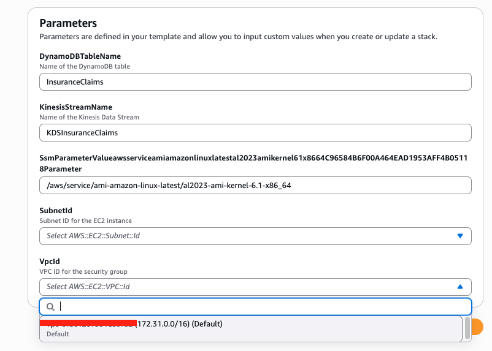

In the `Configure stack options` page, check the box that says `I acknowledge that AWS CloudFormation might create IAM resources.` and click `Next`. 

Click `Submit` button to deploy the resources.

In 5-10 minutes, the Cloudformation template finishes deploying the following AWS resources:

1. **DynamoDB Table**
   - Table name: Configurable (default: `InsuranceClaims`)
   - Primary key: `claim_id` (String)

2. **Kinesis Data Stream**
   - Stream name: Configurable (default: `InsuranceClaimsStream`)
   - Shard count: 1

3. **EC2 Jumphost**
   - To run a script to stream data into the DynamoDB table

4. **IAM Roles and Policies**
   - To ensure the created resources have appropriate permissions to carry out necessary tasks


Next we are ready to connect to the EC2 instance to create the OpenSSL key pair used for authentication with Snowflake.

#### 1. Configure the Linux session for timeout and default shell

In this step we need to connect to the EC2 instance in order to ingest the real-time data.

Go to the AWS [Systems Manager](https://us-west-2.console.aws.amazon.com/systems-manager/home) console in the same region where you set up the EC2 instance,
Click `Session Manager` on the left pane.

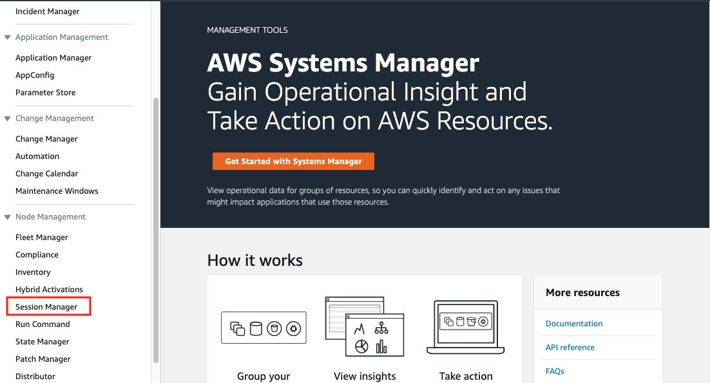

Next, we will set the preferred shell as bash.

Click the `Preferences` tab.


Click the `Edit` button.


Go to `General preferences` section, type in 60 minutes for idle session timeout value.


Further scroll down to `Linux shell profile` section, and type in `/bin/bash` before clicking `Save` button.


#### 2. Connect to the Linux EC2 instance console
Now go back to the `Session` tab and click the `Start session` button.


Now you should see the EC2 instance created by the Cloudformation template under `Target instances`.
Its name should be `MyEC2Instance`, select it and click `Start session`.

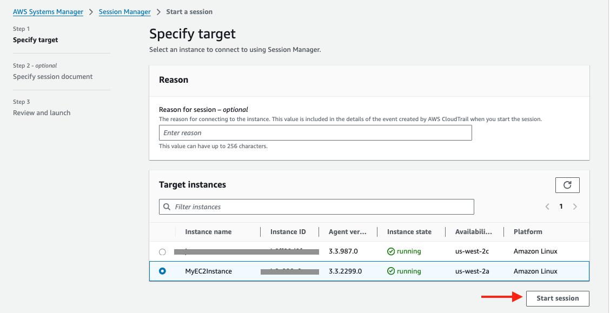

#### 3. Create a key-pair to be used for authenticating with Snowflake
Create a key pair in AWS Session Manager console by executing the following commands. You will be prompted to give an encryption password(passphrase), remember this passphrase, you will need it later.

**Note, for better security, it is advised not to use an empty string as the passphrase

```commandline
cd $HOME
openssl genrsa 2048 | openssl pkcs8 -topk8 -inform PEM -out rsa_key.p8
```
See below example screenshot:

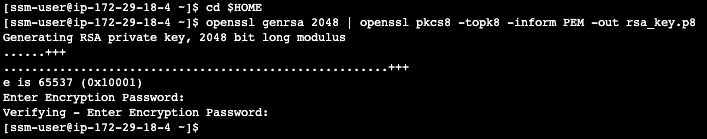

Next we will create a public key by running following commands. You will be prompted to type in the passphrase you used in above step.
```
openssl rsa -in rsa_key.p8 -pubout -out rsa_key.pub
```
see below example screenshot:


Next we will save the public and private key string in a correct format that we can use for configuration later.
```
grep -v KEY rsa_key.pub | tr -d '\n' | awk '{print $1}' > pub.Key
cat pub.Key
```
see below example screenshot:


<!---------------------------->
## Setup Snowflake

#### 1. Create role, schema and database
First login to your Snowflake account as a power user with ACCOUNTADMIN role. 
Then run the following SQL commands in a worksheet to create a database, schema and the role that we will use in the lab.

```sql
-- Type in the username who has the ACCOUNTADMIN role
-- This can be the username you picked when sign up for
-- the Snowflake trial account
SET USER = < username with ACCOUNTADMIN role >
```

```sql
-- Set default value for multiple variables
-- For purpose of this workshop, it is recommended to use these defaults during the exercise to avoid errors
-- You should change them after the workshop
SET DB = 'CDC_DB';
SET SCHEMA = 'CDC_SCHEMA';
SET WH = 'CDC_WH';
SET ROLE = 'CDC_RL';

USE ROLE ACCOUNTADMIN;

-- CREATE ROLES
CREATE OR REPLACE ROLE IDENTIFIER($ROLE);

-- CREATE DATABASE AND WAREHOUSE
CREATE DATABASE IF NOT EXISTS IDENTIFIER($DB);
USE IDENTIFIER($DB);
CREATE SCHEMA IF NOT EXISTS IDENTIFIER($SCHEMA);
CREATE OR REPLACE WAREHOUSE IDENTIFIER($WH) WITH WAREHOUSE_SIZE = 'SMALL';

-- GRANTS
GRANT CREATE WAREHOUSE ON ACCOUNT TO ROLE IDENTIFIER($ROLE);
GRANT ROLE IDENTIFIER($ROLE) TO USER IDENTIFIER($USER);
GRANT ROLE IDENTIFIER($ROLE) TO ROLE ACCOUNTADMIN;
GRANT OWNERSHIP ON DATABASE IDENTIFIER($DB) TO ROLE IDENTIFIER($ROLE);
GRANT OWNERSHIP ON SCHEMA IDENTIFIER($SCHEMA) TO ROLE IDENTIFIER($ROLE);
GRANT USAGE ON WAREHOUSE IDENTIFIER($WH) TO ROLE IDENTIFIER($ROLE);

-- SET DEFAULTS
ALTER USER IDENTIFIER($USER) SET DEFAULT_ROLE=$ROLE;
ALTER USER IDENTIFIER($USER) SET DEFAULT_WAREHOUSE=$WH;

-- RUN FOLLOWING COMMANDS TO FIND YOUR ACCOUNT IDENTIFIER, WRITE IT DOWN FOR USE LATER
-- IT WILL BE SOMETHING LIKE <organization_name>-<account_name>
-- e.g. ykmxgak-wyb52636

WITH HOSTLIST AS 
(SELECT * FROM TABLE(FLATTEN(INPUT => PARSE_JSON(SYSTEM$allowlist()))))
SELECT REPLACE(VALUE:host,'.snowflakecomputing.com','') AS ACCOUNT_IDENTIFIER
FROM HOSTLIST
WHERE VALUE:type = 'SNOWFLAKE_DEPLOYMENT_REGIONLESS';
```

Please write down the Account Identifier, we will need it later.
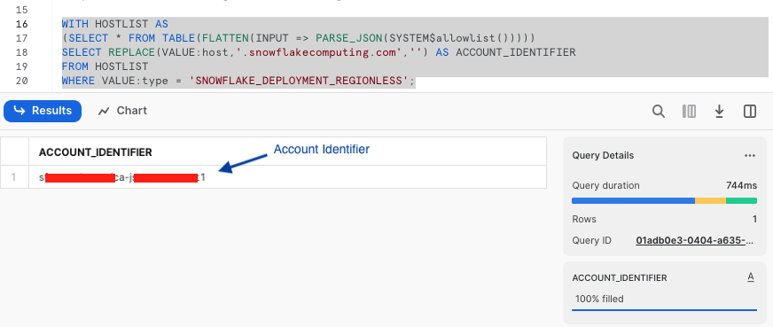

#### 2. Set Up Key Pair Authentication
Next we need to configure the public key for the streaming user to access Snowflake programmatically.

In the Snowflake worksheet, replace `< pubKey >` with the content of the file `/home/ssm-user/pub.Key` on the EC2 instance and execute the follow command in Snowflake SQL worksheet.

```sql
USE ROLE ACCOUNTADMIN;

-- Replace the username with the one (with ACCOUNTADMIN role) you used at the beggining in step 1 above
ALTER USER < username > SET RSA_PUBLIC_KEY='< pubKey >';
```

#### 3. Set Up the Snowflake Tables

Connect to your Snowflake account and create the CDC, event history and destination tables:

```sql
-- Use appropriate role, database, schema, and warehouse
USE ROLE IDENTIFIER($ROLE);
USE DATABASE IDENTIFIER($DB);
USE SCHEMA IDENTIFIER($SCHEMA);
USE WAREHOUSE IDENTIFIER($WH);

-- Create the destination table (to be synchronized with the source DynamoDB table)
CREATE OR REPLACE TABLE openflow_insclaim_dest_tbl (
    eventName STRING,
    eventCreationUnixTime STRING,
    claimId STRING,
    diagnosisCodes STRING,
    dateOfService STRING,
    totalCharge FLOAT,
    procedureDetails STRING,
    memberId STRING,
    insurancePlan STRING,
    patientZip INTEGER,
    patientState STRING,
    patientCity STRING,
    patientStreet STRING,
    patientGender VARCHAR(1),
    patientDOB STRING,
    patientLastName STRING,
    patientPhone STRING,
    patientFirstName STRING,
    patientEmail STRING,
    claimStatus STRING,
    createdTimeStamp timestamp_ntz(9),
    providerName STRING,
    providerNPI STRING,
    providerZip INTEGER,
    providerState STRING,
    providerCity STRING,
    providerStreet STRING,
    billSubmitDate STRING,
    payerName STRING,
    payerId STRING,
    payerContactNumber STRING,
    paymentStatus STRING
);

-- Create a event history table to track the changes being applied at the source
CREATE OR REPLACE TABLE openflow_insClaim_event_hist_tbl LIKE openflow_insClaim_dest_tbl;

-- Create a CDC operation table that holds the changes yet to be merged with the destination table
CREATE OR REPLACE TABLE openflow_insClaim_cdc_tbl like openflow_insClaim_dest_tbl;
```

<!---------------------------->
## Setup Openflow Connector

 Download the [Openflow connector definition file](https://snowflake-corp-se-workshop.s3.us-west-1.amazonaws.com/Openflow_Dynamo_CDC/Openflow-DDB-CDC-connector.json) and save it to your desktop.

#### 1. Import the connector definition file
In Snowsight, switch to the role that has access to Openflow runtimes (described in the `Prerequisites OR What You Will Need` section above). Go to Openflow by clicking on `Openflow` in the `Data` drop-down menu in the Snowsight left pane.

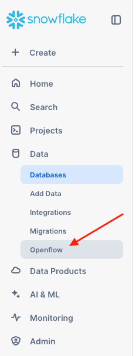

Click the `Launch Openflow` button located at the top-right corner to launch Openflow.

Click `View all` in the Runtime tile.

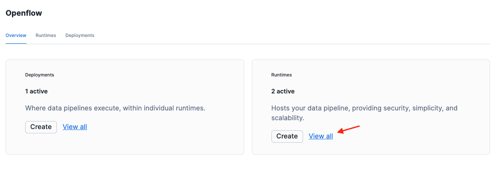

Click on the runtime that is assigned to you by your Openflow administrator.
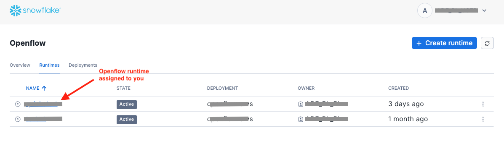

Drag the processor group icon located at the top to the canvas, release mouse button, then click the browse button to import the json file (Openflow-DDB-CDC-connector.json) you just downloaded. The connector is now imported.

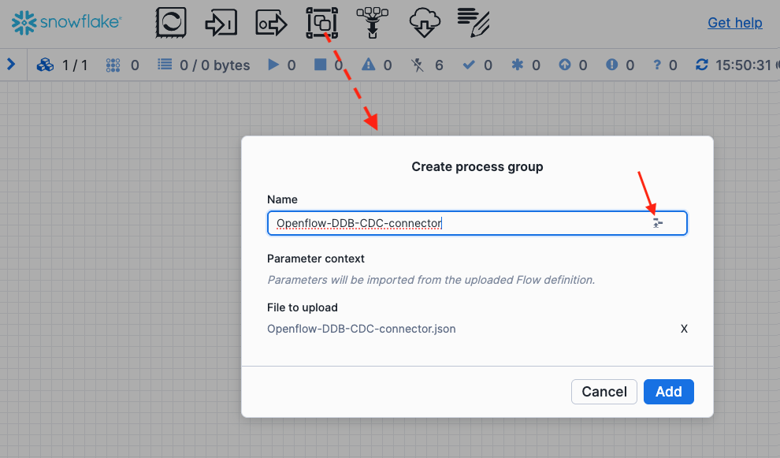

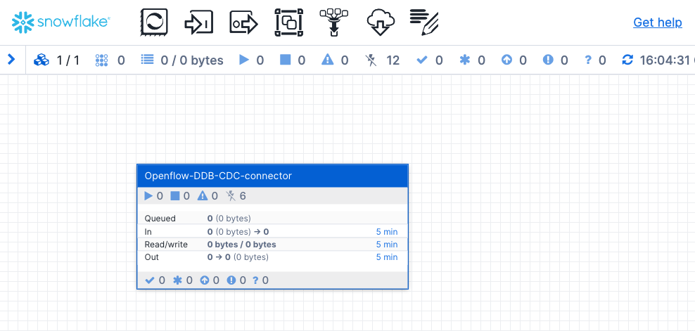


#### 2. Configure parameters for the connector

Right click anywhere on the connector and select `Parameters`.

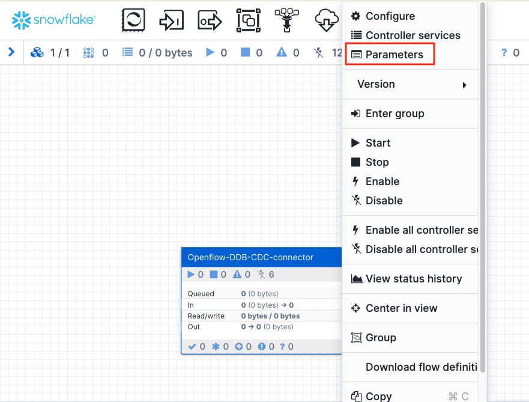

There are five parameters you will need to fill in. Leave the others as default. Click on the three dots and `Edit` to add the values for each of them.

-  AWS KEY ID
-  AWS SECRET ACCESS KEY
-  SNOWFLAKE ACCOUNT NAME: This is the Snowflake account identifier you wrote down previously
-  SNOWFLAKE KEY PASSPHRASE: This is the Snowflake key passphrase you chose when creating the key pair with openssl
-  SNOWFLAKE PRIVATE KEY: This is the content of the `rsa_key.p8` file you created in the home directory on the EC2 instance.
- SNOWFLAKE USER: This is the username with ACCOUNTADMIN role when you setup Snowflake in previous step

Once finished, click `Apply` and `Close` to take effect.

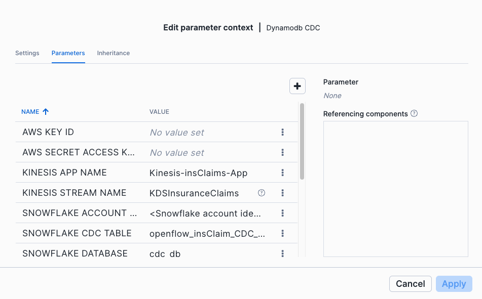

Click `Back to process group` to return to the main canvas.

Now we are ready to start the Openflow connector. To do so, first right click on the connector and select `Enable`. Next, right click on the connector again and select `Enable all controller services`. Finally, right click on the connector and select `Start`.

Double click anywhere on the connector, you will see all the processors that are used to make up the connector.
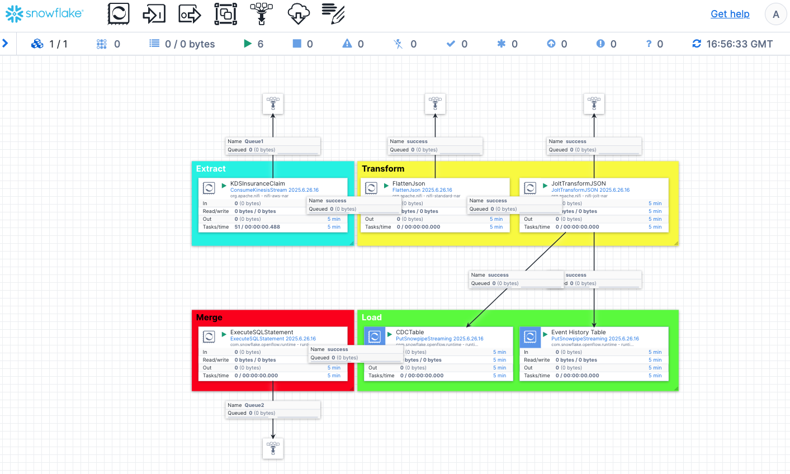

The pipeline is made up of Extract, Transform, Load and Merge stages:

- Extract: This is a processor `ConsumeKinesisStream` that listens to the CDC events in the Kinesis data stream and extract them.
- Transform: We use a couple of transformation processors ([`FlattenJson`](https://docs.snowflake.com/en/user-guide/data-integration/openflow/processors/flattenjson) and [`JoltTransformJSON`](https://docs.snowflake.com/en/user-guide/data-integration/openflow/processors/jolttransformjson)) to transform the raw json into 
a format that is consumable by the Snowflake tables. The raw json contains multi-level json structure and needs to be flattened and its long key names need to be renamed to shorter, descriptive column names in Snowflake.
- Load: The `PutSnowpipeStreaming` processors in this stage are used to stream the jsons into the CDC and event history tables we created previously.
- Merge: At this stage, we use the `ExecuteSQLStatement` processor to merge the changes held in the CDC table into the destination table to complete the synchronization.

Note, we also created the funnels to help us examine contents of the flow files at the Extract, Transformation and Merge stages so you can see the progress and json formats at different stages as the data passing through the pipeline.
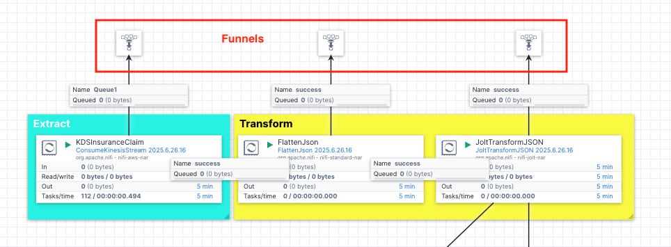

At this point, we have successfully connected the Openflow connector to the upstream Kinesis data stream.

For a list of all of the available Openflow processors, visit this [doc](https://docs.snowflake.com/en/user-guide/data-integration/openflow/processors/index) for more details.

<!---------------------------->
## Enable [DynamoDB Streams](https://docs.aws.amazon.com/amazondynamodb/latest/developerguide/Streams.html)

Navigate to the [DynamoDB Table Console](https://console.aws.amazon.com/dynamodbv2/home?#tables) and click `InsuranceClaims` table.

Click on the tab that says `Exports and streams` at the top.
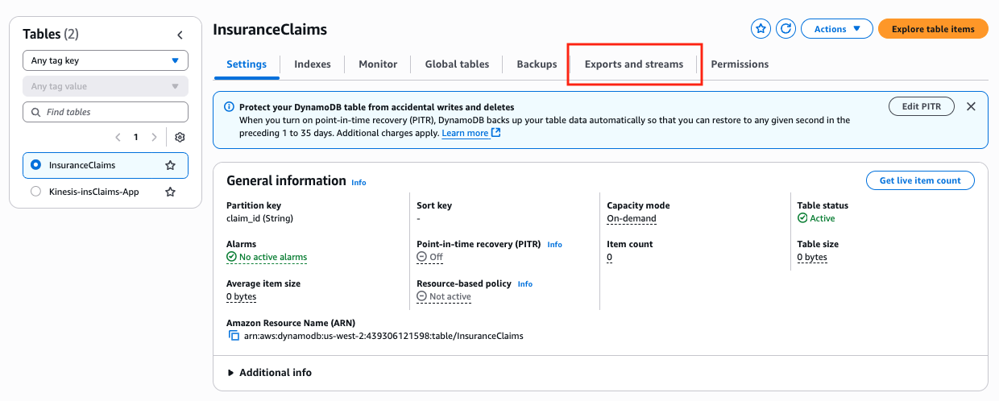

Scroll all the way down to the bottom of the page and find the `Amazon Kinesis data stream details` section, click `Turn on`.
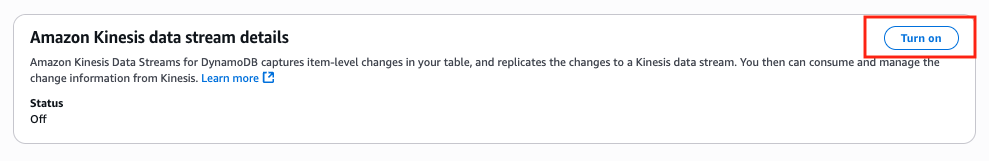

Next, you will be prompted to select the destination Kinesis data stream name to capture the CDC events. Go ahead and select `KDSInsuranceClaims` as the destination stream, click `Turn on stream`.
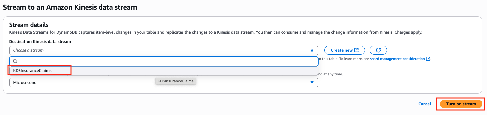

In a few seconds, the DynamoDB stream is enabled. You will see notification of success at the top of the page.

<!---------------------------->
## Change Data Capture (CDC) In Action

### Ingest Claims to DynamoDB 
Let's ingest a few sample insurance claims into the source DynamoDB table. To do this, go back to the EC2 instance console in session manager and issue this command:

```command
cd $HOME
python3 ingest_med_claims.py 20
```

This will ingest 20 sample claims into the DynamoDB table and because these are new CDC events, so they will be captured by DynamoDB streams and get streamed into the Kinesis data stream followed by the Openflow pipeline. 

Let's navigate to the [DynamoDB Table Console](https://console.aws.amazon.com/dynamodbv2/home?#tables) and click on the `InsuranceClaims` table, then click the `Explore table items` button located at the top-right corner of the page. You should see 20 items have been inserted to the table. If you don't see them, just click the `Run` button to refresh.

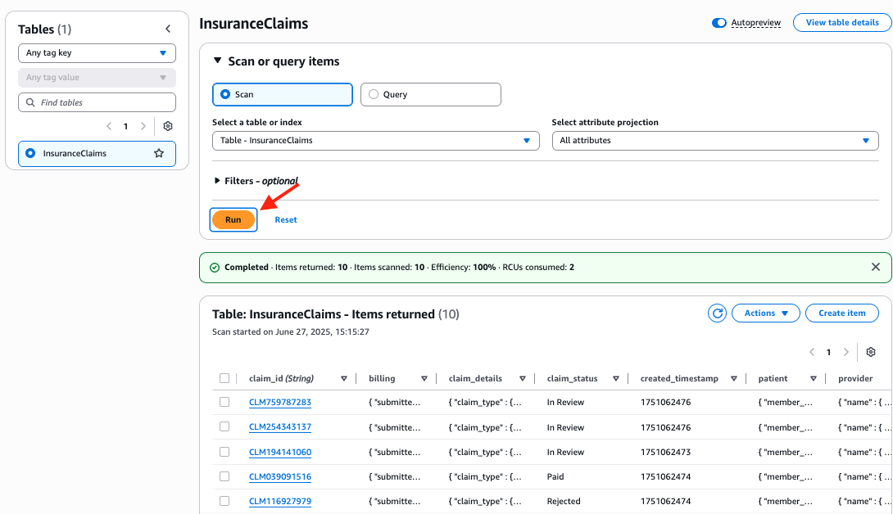

Now, go to the Openflow canvas, you should notice that 20 items are also captured by Openflow and they are merged and landed in the destination table in Snowflake. You can right click anywhere on the canvas and select `Refresh` to see the number of items in `Queue2` keeps increasing until it hits 20.

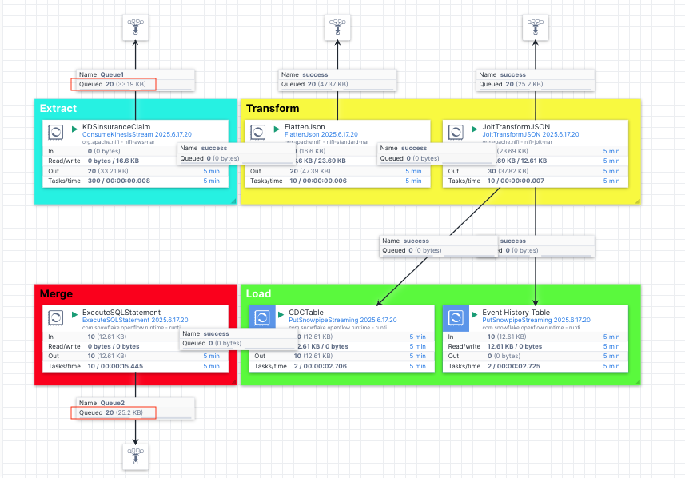

To verify, go to the worksheet in Snowsight and issue this SQL command:

```sql
-- count and show rows in the destination table
select * from openflow_insclaim_dest_tbl;
select count(*) from openflow_insclaim_dest_tbl;
```

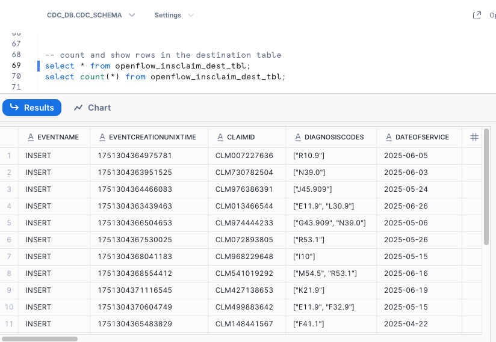

```sql
-- All the Insert events are captured in the event history table
select * from openflow_insclaim_event_hist_tbl where eventname='INSERT';
```

### Modify Claim Status in DynamoDB
In this step, let's modify the claim status in the source DynamoDB table and see the change synchronized with the destination table in Snowflake thanks to the CDC operations by Openflow.

Go to the DynamoDB console, pick any claim whose status is `In Review`.
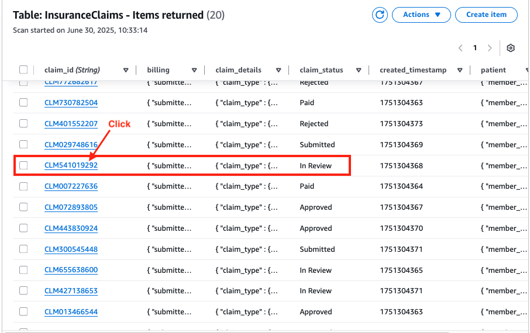

Modify the status from `In Review` to `Rejected`, then click `Save and close`.

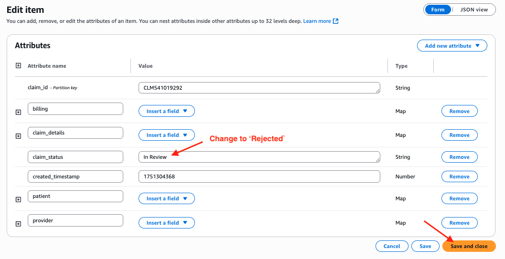

Because this is a new CDC 'MODIFY' event, you will see the number in Queue1 and Queue2 in Openflow increased to 21 now.
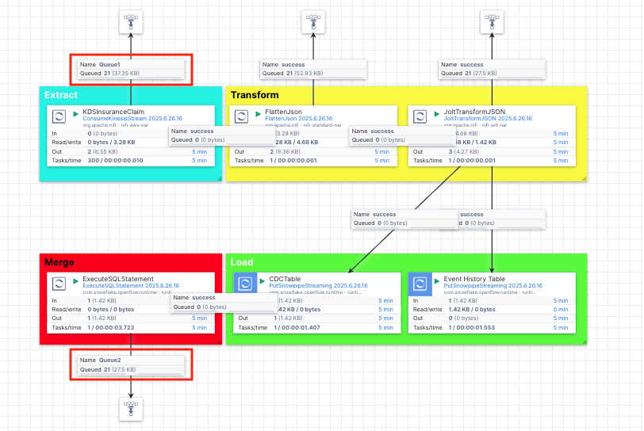

To verify, go to the worksheet in Snowsight and issue this SQL command:

```sql
select 
    eventName,
    TO_TIMESTAMP(TO_NUMBER(eventCreationUnixTime) / 1000000) AS eventCreationUTC,
    claimId, 
    claimStatus, 
    paymentStatus, 
    totalCharge, 
    insurancePlan,
    memberId,
    providerName
  from openflow_insclaim_dest_tbl where eventname = 'MODIFY';
```
You can see the claim status has been changed from `In Review` to `Rejected` in the destination table too, this means the source DynamoDB and destination table are synchronized in real-time! Note that modification time stamp is also captured in the `EVENTCREATIONUTC` column.

The update is again logged in the event history table.
```sql
select 
    eventName,
    TO_TIMESTAMP(TO_NUMBER(eventCreationUnixTime) / 1000000) AS eventCreationUTC,
    claimId, 
    claimStatus, 
    paymentStatus, 
    totalCharge, 
    insurancePlan,
    memberId,
    providerName
  from openflow_insclaim_event_hist_tbl where eventname = 'MODIFY' order by eventCreationUTC;
```


### Delete Claims from DynamoDB
Now let's delete the claim we just modified by going to the DynamoDB console, check the claim and select `Delete items` from the `Actions` drop-down menu and confirm.
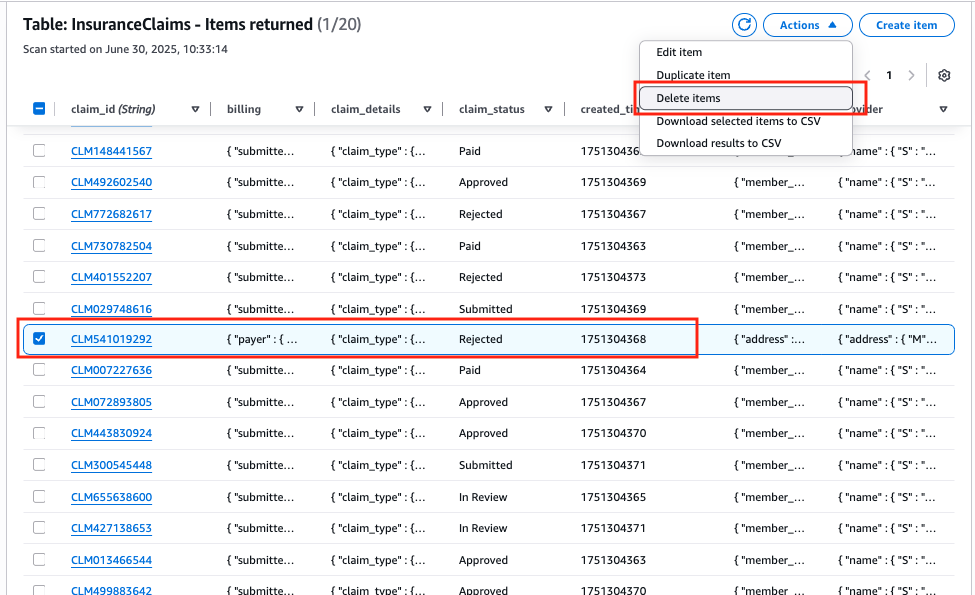

Similarly, because the claim deletion is a new CDC event, you will see the counters in Queue1 and Queue2 increased to 22 now.

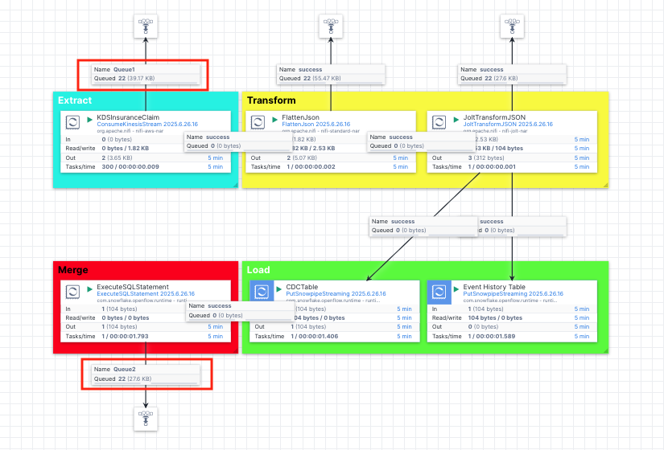

Now if you issue the following SQL query, the result should be empty because the claim has been deleted from the destination table too.

```sql
SELECT *
FROM openflow_insclaim_dest_tbl
-- get the claim id from the event history table
WHERE claimid IN (
    SELECT claimid
    FROM openflow_insclaim_event_hist_tbl
    WHERE eventname = 'MODIFY'
);
```

Again, the deletion event is captured in the event history table.
```sql
select 
    eventName,
    TO_TIMESTAMP(TO_NUMBER(eventCreationUnixTime) / 1000000) AS eventCreationUTC,
    claimId, 
    claimStatus, 
    paymentStatus, 
    totalCharge, 
    insurancePlan,
    memberId,
    providerName
  from openflow_insclaim_event_hist_tbl where eventname = 'REMOVE' order by eventCreationUTC;
```

<!---------------------------->
## Transformed Data Across Pipeline

You can view the transformed json contents in various stages by right-clicking tags in the pipeline, and select `List queue`
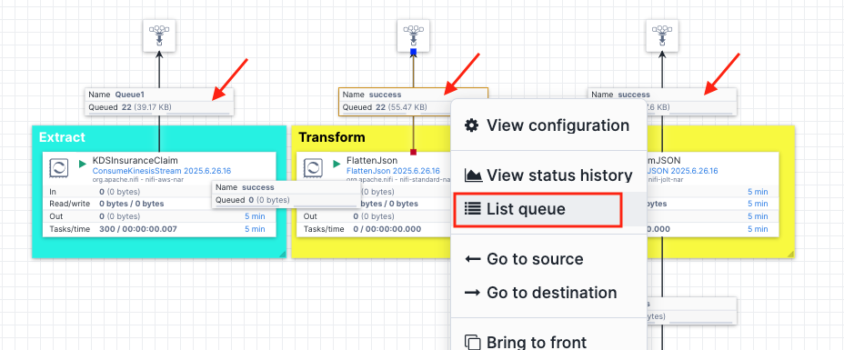

click on the 3 dots and select `Download content` and they will be saved to your computer. 
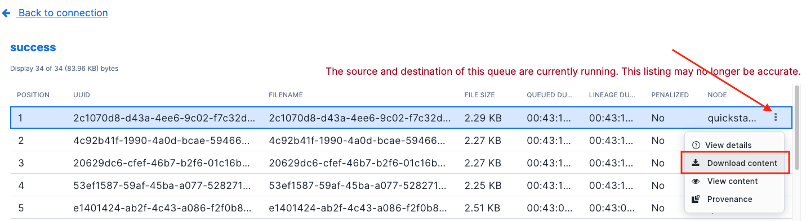

Feel free to compare these contents to see how the data is transformed by the [`FlatJson`](https://docs.snowflake.com/en/user-guide/data-integration/openflow/processors/flattenjson) and [`JoltTransformJson`](https://docs.snowflake.com/en/user-guide/data-integration/openflow/processors/jolttransformjson) processors.

<!---------------------------->
## The ExecuSQLCommand Processor

Let's take a look at the `ExecuteSQLStatement` processor and see what SQL query it uses to merge the CDC events.

Right click on the `ExecuteSQLStatement` processor and select `View configuration`.

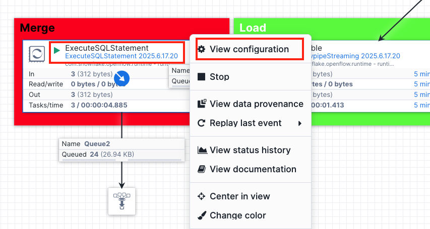

Click on the `properties` tab at the top and click `SQL` to expand the value, here you will see the SQL queries used to merge the CDC events.


For your reference, below is the SQL command used in the [Openflow ExecuSQLCommand processor](https://docs.snowflake.com/en/user-guide/data-integration/openflow/processors/executesqlstatement) to merge the events in the CDC table to destination table in Snowflake.

```sql
BEGIN
-- Create temporary table with all claimIds to be processed
CREATE OR REPLACE TEMPORARY TABLE temp_claim_ids AS
SELECT DISTINCT claimId 
FROM openflow_insclaim_cdc_tbl;

-- Perform the merge operation
MERGE INTO openflow_insclaim_dest_tbl tgt
    USING openflow_insclaim_cdc_tbl src
    ON tgt.claimId = src.claimId

    -- Delete rows
    WHEN MATCHED AND src.eventName = 'REMOVE' THEN DELETE

    -- Update existing rows
    WHEN MATCHED AND src.eventName = 'MODIFY'
    THEN
        UPDATE SET
            tgt.eventName = src.eventName,
            tgt.eventCreationUnixTime = src.eventCreationUnixTime,
            tgt.claimId = src.claimId,
            tgt.diagnosisCodes = src.diagnosisCodes,
            tgt.dateOfService = src.dateOfService,
            tgt.totalCharge = src.totalCharge,
            tgt.procedureDetails = src.procedureDetails,
            tgt.memberId = src.memberId,
            tgt.insurancePlan = src.insurancePlan,
            tgt.patientZip = src.patientZip,
            tgt.patientState = src.patientState,
            tgt.patientCity = src.patientCity,
            tgt.patientStreet = src.patientStreet,
            tgt.patientGender = src.patientGender,
            tgt.patientDOB = src.patientDOB,
            tgt.patientLastName = src.patientLastName,
            tgt.patientPhone = src.patientPhone,
            tgt.patientFirstName = src.patientFirstName,
            tgt.patientEmail = src.patientEmail,
            tgt.claimStatus = src.claimStatus,
            tgt.createdTimeStamp = src.createdTimeStamp,
            tgt.providerName = src.providerName,
            tgt.providerNPI = src.providerNPI,
            tgt.providerZip = src.providerZip,
            tgt.providerState = src.providerState,
            tgt.providerCity = src.providerCity,
            tgt.providerStreet = src.providerStreet,
            tgt.billSubmitDate = src.billSubmitDate,
            tgt.payerName = src.payerName,
            tgt.payerId = src.payerId,
            tgt.payerContactNumber = src.payerContactNumber,
            tgt.paymentStatus = src.paymentStatus

    -- Insert new rows that don't exist in target_table
    WHEN NOT MATCHED AND src.eventName = 'INSERT' THEN
        INSERT (eventName, eventCreationUnixTime, claimId, diagnosisCodes, dateOfService, totalCharge, procedureDetails, memberId, insurancePlan, patientZip, patientState, patientCity, patientStreet, patientGender, patientDOB, patientLastName, patientPhone, patientFirstName, patientEmail, claimStatus, createdTimeStamp, providerName, providerNPI, providerZip, providerState, providerCity, providerStreet, billSubmitDate, payerName, payerId, payerContactNumber, paymentStatus)
        VALUES (src.eventName, src.eventCreationUnixTime, src.claimId, src.diagnosisCodes, src.dateOfService, src.totalCharge, src.procedureDetails, src.memberId, src.insurancePlan, src.patientZip, src.patientState, src.patientCity, src.patientStreet, src.patientGender, src.patientDOB, src.patientLastName, src.patientPhone, src.patientFirstName, src.patientEmail, src.claimStatus, src.createdTimeStamp, src.providerName, src.providerNPI, src.providerZip, src.providerState, src.providerCity, src.providerStreet, src.billSubmitDate, src.payerName, src.payerId, src.payerContactNumber, src.paymentStatus);

-- Delete processed records in the cdc table from temp table
DELETE FROM openflow_insclaim_cdc_tbl 
WHERE claimId IN (SELECT claimId FROM temp_claim_ids);

END;
```

<!---------------------------->
## Cleanup

When you're done with the demo, you can delete all resources to avoid incurring charges:

### 1. Delete the CloudFormation Stack

Using the AWS Management Console:
1. Navigate to CloudFormation
2. Select your stack
3. Click "Delete"
4. Confirm the deletion

Using the AWS CLI:

```bash
aws cloudformation delete-stack --stack-name Openflow-DDB-CDC
```

### 2. Verify Resource Deletion

Ensure that all resources have been deleted:
- EC2 instance
- DynamoDB table
- Kinesis stream
- IAM roles and policies

### 3. Clean Up Snowflake Resources (Optional)

If you no longer need the Snowflake tables:

```sql
USE ROLE ACCOUNTADMIN;
-- Drop Snowflake tables
DROP TABLE IF EXISTS openflow_insclaim_dest_tbl;
DROP TABLE IF EXISTS openflow_insclaim_cdc_tbl;
DROP TABLE IF EXISTS openflow_insclaim_event_hist_tbl;
-- Drop schema and database
DROP SCHEMA CDC_SCHEMA;
DROP DATABASE CDC_DB;
```

<!---------------------------->
## Conclusion And Resources 

### Overview
In this quickstart guide, you've built a complete Change Data Capture (CDC) pipeline that synchronizes healthcare insurance claims data between Amazon DynamoDB and Snowflake. This architecture leverages DynamoDB's strengths as a high-performance, scalable front-end database for real-time claims processing, while utilizing Snowflake's powerful analytics capabilities for complex reporting, data sharing, and long-term trend analysis. The Openflow connector serves as the critical bridge between these systems, ensuring that all changes (inserts, updates, and deletions) are captured and synchronized in near real-time.

### What You Learned
- How to set up and configure DynamoDB streams to capture change events
- How to use Kinesis Data Streams as a transport layer for CDC events
- How to configure and deploy an Openflow connector for real-time data integration
- How to transform complex JSON data structures into analytics-ready formats
- How to implement CDC operations (INSERT, MODIFY, REMOVE) with proper tracking
- How to use Snowflake's MERGE operation for efficient data synchronization
- How to maintain an audit trail of all data changes using event history tables
- Best practices for healthcare data integration across AWS and Snowflake

### Resources
- [Snowflake Openflow Documentation](https://docs.snowflake.com/en/user-guide/data-integration/openflow/about)
- [Snowflake Openflow Processors](https://docs.snowflake.com/en/user-guide/data-integration/openflow/processors/index)
- [Snowflake MERGE Statement Documentation](https://docs.snowflake.com/en/sql-reference/sql/merge)
- [Amazon DynamoDB Streams Documentation](https://docs.aws.amazon.com/amazondynamodb/latest/developerguide/Streams.html)
- [Amazon Kinesis Data Streams Documentation](https://docs.aws.amazon.com/streams/latest/dev/introduction.html)
- [AWS CloudFormation Documentation](https://docs.aws.amazon.com/AWSCloudFormation/latest/UserGuide/Welcome.html)
