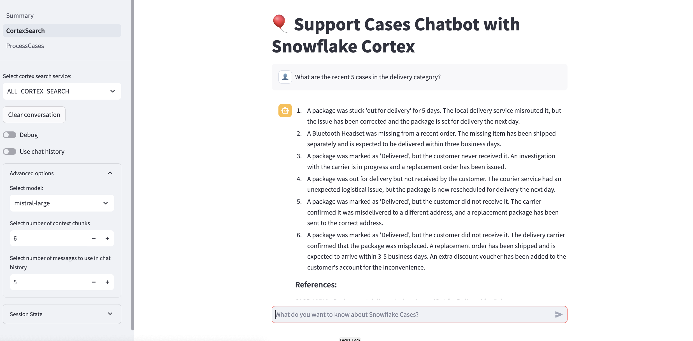

author: Kala Govindarajan
id: streamlining-support-case-analysis-with-snowflake-cortex
categories: snowflake-site:taxonomy/solution-center/certification/quickstart, snowflake-site:taxonomy/solution-center/certification/certified-solution, snowflake-site:taxonomy/solution-center/includes/architecture, snowflake-site:taxonomy/product/ai, snowflake-site:taxonomy/product/data-engineering
language: en
summary: A streamlined approach using advanced data processing and AI-driven summarization to help analyze support tickets leading to faster resolution times and better insights into common customer issues. By integrating Snowflake Cortex AI features, product managers and support teams can automate the analysis and summarization of support tickets seamlessly. 
environments: web
status: Published 
feedback link: https://github.com/Snowflake-Labs/sfguides/issues


# Streamlining Support Case Analysis with Snowflake Cortex
<!-- ------------------------ -->
## Overview 

Support case analysis is a critical task for any product-driven company. Understanding customer issues, their frequency, and patterns can significantly enhance product development and customer satisfaction. With the rise of data engineering and AI, platforms like Snowflake with AI-powered language models are game-changers in automating and enhancing this process. In this guide, we will explore how to leverage these technologies to dissect, analyze, and summarize product support cases effectively.

By completing this QuickStart guide, you will deploy a Streamlit application that leverages Snowflake Cortex AI features like LLM Inference and Cortex Search for summarization, search and analysis, alongside the LangChain framework to chain together interoperable components for large language models (LLMs).By leveraging Snowflake Cortex, this solution not only processes but also meaningfully summarizes support tickets, aiding in more agile issue resolution and strategic planning.


### What is Cortex Search
Cortex Search provides low-latency, high-quality fuzzy search capabilities for Snowflake data, enabling a range of advanced search experiences, including Retrieval-Augmented Generation (RAG) applications that leverage Large Language Models (LLMs).

With Cortex Search, one can quickly set up a hybrid (vector and keyword) search engine on the text data in minutes, eliminating the need for embedding management, infrastructure maintenance, search quality adjustments, or index refreshes. This allows you to focus more on building robust chat and search applications and less on managing infrastructure and fine-tuning search quality. 

### Prerequisites
- A non-trial Snowflake account with access to a role that has the ACCOUNTADMIN role. If not, you will need to work with your admin to perform the initial environment setup.
- Git installed
- A basic knowledge of how Langchain and LLMs integrations work 

### What You’ll Learn 
- How to Leverage Snowflake Cortex to perform support tickets summarization and analysis.
- How to use the LangChain framework to connect large language model (LLM) components for complex tasks.
- How to handle tokenization inside Snowflake using external libraries
- How to utilize CharacterTextSplitter to efficiently chunk text for input into the LLM


### What You’ll Need 
- A [Snowflake](https://signup.snowflake.com/?utm_source=snowflake-devrel&utm_medium=developer-guides&utm_cta=developer-guides) account in a region where Snowflake Cortex and Arctic are available.
- Access to the ACCOUNTADMIN role. If not, you will need to work with your admin to perform the initial environment setup.
- Git installed.

### What You’ll Build 
- An End-to-End Ticket summarizing data app that fetches the tickets and stages, tokenizes, splits, and processes it with Snowflake Cortex for summarization.
- A workflow that uses LangChain and Snowflake’s Cortex for scalable text analysis, ready for further customization and scaling in business use cases.


<!-- ------------------------ -->
## Setup Environment

This section will walk you through creating various objects

**Step 1**. - Clone [GitHub](https://github.com/Snowflake-Labs/sfguide-analyzing-support-cases-using-snowflake-cortex) repository.


**Step 2**. - Run the code under the scripts/setup.sql file in Snowsight SQL Worksheet.
Once the objects are setup, now let us proceed to the notebook execution 

**Step 3**.
The Notebook is available to download from the /notebook folder in the git repository.

- Overall the Notebook does the following :

1. Fetches summary tickets that is stages in an external stage and loads to a Snowflake table. This can be a direct streaming ingestion or through a connector from a ticketing platform such as ServiceNow.

2. Use a custom class CortexLLM, which uses Snowflake Cortex LLM , to invoke language models that can understand and summarize text. 
   
3. Then we create prompt templates using [langchain PromptTemplate](https://api.python.langchain.com/en/latest/prompts/langchain_core.prompts.prompt.PromptTemplate.html) for mapping and reducing tasks, which instruct the language model on how to process the support case texts.

```
from langchain_core.prompts import PromptTemplate

map_template = PromptTemplate.from_template("""
                                            Given the following support cases for an order, return a summary of each case.
                                            Include details on the category of the issue, the errors or symptoms the customer noticed,
                                            and any basic details about what the customer was looking to accomplish.
                                            If multiple cases exist in the same category, you can group them together.
                                            The summary will be used to understand overall case trends and causes that the team can 
                                            use to prioritize fixes and improvements.
                                                
                                            ### Cases ###
                                            
                                            {cases}
                                                """)

reduce_template = PromptTemplate.from_template("""
                                                Given the following set of summaries for support case reports opened for an order, 
                                                distill it into a final, consolidated and detailed summary of trends and top pain points or blockers customers have been hitting.
                                                Prioritize issue categories that show up in multiple summaries as they are likely to be the most impactful.
                                                Include a description of the issue, the symptoms the customer noticed, what they were trying to do, and what led them to open the case.
                                               
                                                ### Case Chunk Summaries ###
                                               
                                                {summaries} 
                                               """)
```
4. Leveraging the Langchain library, we implement a map-reduce strategy to handle our summarization task. The MapReduceDocumentsChain orchestrates this process, taking our large text input, breaking it down into manageable chunks, processing each chunk to create individual summaries, and finally reducing these summaries into a comprehensive overview of customer issues.

5. We configure an InMemoryCache and set up Tiktoken caching. Tiktoken is a tokenization library that efficiently converts text into tokens, a format required by most AI models for natural language processing tasks.

6. Once the map-reduce chain is invoked, the results are returned in a structured format, including both the intermediate steps and the final summarized output. We then structure this data into a schema and save it as a new table in Snowflake for easy access and analysis.

7. Finally we create a Cortex Search Service within Snowflake. This service allows us to do a lexical and keyword - hybrid search through our support cases using natural language queries, making it easier to find specific issues or patterns in the data.


<!-- ------------------------ -->
## Streamlit Application 


The app is built on open source Streamlit and can be hosted in one's own platform. The app allows the user carries the end to end processing that was carried in the Notebook with fine tuned granular control by the end user.

Here is the [Streamlit source code](https://github.com/Snowflake-Labs/sfguide-analyzing-support-cases-using-snowflake-cortex/tree/main/scripts/streamlit) repository and instructions for running the Streamlit app.

### Support Case Summary Page

In the Support Case Summary page one can view support case summaries using Cortex LLMs. It retrieve the Summary tables created for different categories and lists them in a dropdown. The app displays the most recent record’s summary from the selected table and includes an expandable section to show each step of intermediate analysis.


### Support Cases Chatbot

To help users get a chatbot experience, the Support cases 
Chatbot page helps users ask questions about the support cases logged using Snowflake Cortex. 
The Key components include :

1. Setup and Initialization: Connects to Snowflake and sets up necessary variables, column names, and model options.
Sidebar Configurations: Allows users to select which Cortex search service, toggle settings, and adjust advanced options like the number of retrieved context chunks.

2. Data Retrieval and Processing: Queries support cases using Cortex Search and compiles relevant context based on user queries.
   
3. Prompt Generation and Response: Builds a prompt using the user’s question, chat history, and context to generate responses via Cortex LLM inference functions.
   
4. A Chat Interface: Displays an interactive chat with user and assistant messages, including reference links to relevant cases.
This enables efficient question-answering on support cases with context-based responses.




### Process Cases

This Streamlit page processes and summarizes Snowflake support cases to identify trends and key issues.

1. Controls: Users filter cases by weeks back and select categories, set concurrency, and edit prompts for summarizing cases.
   
2. Core Functionality: Users can preview cases, add a prefix to summaries, and start processing cases that pretty much the end to end functionality that was done in the Notebook but for the selected issue category.
   
3. Processing and Cost Estimate: On the click of the button, the processing begins and a new cortex search service is created for the filtered data. A progress bar shows completion status. Afterward, it provides token usage, processing time, and cost estimates.


<!-- ------------------------ -->
## Conclusion And Resources

### Conclusion


In this fast-paced world, providing timely, effective support is critical for customer satisfaction and operational success for a successful product evolution. Support Teams often receive a high volume of support requests ranging from routine inquiries to complex technical issues. Analyzing and summarizing these support cases helps uncover patterns, identify recurring issues, and ultimately improve product service quality. However, managing and synthesizing this data can be resource-intensive without the right tools. 

By combining the power of Snowflake Cortex and AI-powered language models, we have created a sophisticated pipeline that automates the analysis of support cases. This approach not only saves time and resources but also provides deeper insights into customer issues, enabling organizations to make data-driven decisions for product improvements and customer service strategies.


### What You Learned
- Leverage Snowflake Cortex to perform support tickets summarization and analysis.
- Use LangChain framework to connect large language model (LLM) components for complex tasks.
- Handle tokenization inside Snowflake using external libraries
and how to efficiently chunk text for input into the LLM.
- Developing an application for carrying ongoing summarization and analysis tasks 

### Related Resources


- #### [Snowpark Cortex Documentation](https://docs.snowflake.com/en/user-guide/snowflake-cortex/cortex-search/cortex-search-overview)
  
- #### [Snowpark Cortex Search Tutorials](https://docs.snowflake.com/en/user-guide/snowflake-cortex/cortex-search/overview-tutorials)

- [Fork Repo on GitHub](https://github.com/Snowflake-Labs/sfguide-analyzing-support-cases-using-snowflake-cortex)
- [Download Reference Architecture](/content/dam/snowflake-site/developers/2025/streamlining-support-case-analysis-with-snowflake-cortex.pdf)
- [Read Medium Blog](https://medium.com/snowflake/streamline-your-support-tickets-with-snowflakes-ai-powered-ticket-automation-agent-d148527ecd84)
- [Watch the Demo](https://youtu.be/Orvlo9q3iBo?list=TLGGvAiUj-zrj0gyNDA5MjAyNQ)
  
