author: Chanin Nantasenamat
id: streamlit-apps-git-backed-workspaces
categories: snowflake-site:taxonomy/solution-center/certification/quickstart,snowflake-site:taxonomy/product/applications-and-collaboration
language: en
summary: Learn how a Snowsight Workspaces user and a command-line Git user can collaborate on the same Streamlit in Snowflake app using a git-backed workspace.
environments: web
status: Published
feedback link: https://github.com/Snowflake-Labs/sfguides/issues
fork repo link: https://github.com/sfc-gh-cnantasenamat/simple-streamlit-app


# Build Streamlit Apps Together with Git-Backed Workspaces

## Overview

Snowflake Workspaces give you two ways to work on a Streamlit in Snowflake (SiS) app as a team: **shared workspaces**, where everyone edits inside Snowsight, and **git-backed workspaces**, where Git is the syncing mechanism between Snowsight and everyone's local machine. Git-backed workspaces are the better fit when part of your team is comfortable in a terminal and part of your team prefers building visually inside Snowsight.

This guide walks through a single realistic scenario with two collaborators working on the same app:

- **Priya** builds and previews the app entirely inside **Snowsight Workspaces** (browser-only, no local setup).
- **Marcus** works entirely from the **command line** with a local clone of the same Git repository.

Both are editing the same `streamlit_app.py`, in the same repository, on the same branch, and Git is what keeps them in sync.

### What You'll Learn
- How to connect a Snowflake account to a GitHub repository so Workspaces can use it
- How to create a git-backed workspace from an existing repository in Snowsight
- How to edit and preview a Streamlit app inside a workspace, then commit and push straight from Snowsight
- How a command-line Git user pulls those changes, makes their own edit, and pushes back
- How to pull remote changes back into the workspace and deploy the app to a shared `STREAMLIT` object

### What You'll Build
A small Cortex-powered Streamlit app (prompt pills that call `ai_complete()`) that ends up with contributions from both a Snowsight-only user and a command-line-only user, deployed as a shared Streamlit in Snowflake app.

### The Collaboration Flow
The diagram below summarizes how the two personas hand off work through Git over the course of this guide:

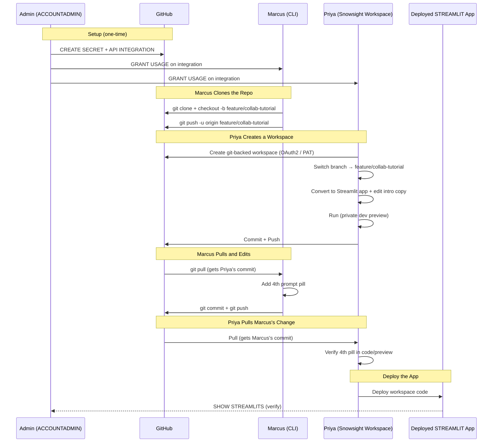

### Prerequisites
- Access to a [Snowflake account](https://signup.snowflake.com/?utm_source=snowflake-devrel&utm_medium=developer-guides&utm_cta=developer-guides) with Cortex AI enabled
- A role with `USAGE` on a compute pool, and a default warehouse selected for your user (Streamlit apps in Workspaces run on a compute pool). Most accounts already have a default compute pool configured; if `SHOW COMPUTE POOLS` returns nothing usable, ask an admin to create one
- A GitHub account and a [personal access token](https://docs.github.com/en/authentication/keeping-your-account-and-data-secure/managing-your-personal-access-tokens) with `repo` scope
- A Snowflake role with `ACCOUNTADMIN`, or one that has been granted the account-level `CREATE INTEGRATION` privilege, for the one-time Git setup step
- `git` installed locally (any recent version)
- A fork of [sfc-gh-cnantasenamat/simple-streamlit-app](https://github.com/sfc-gh-cnantasenamat/simple-streamlit-app), forked into your own GitHub account so both collaborators can push to it

## Setup

Before either collaborator touches the app, someone with elevated privileges connects the Snowflake account to GitHub. This is a one-time, account-wide step; once it's done, any user with `USAGE` on the resulting objects can create git-backed workspaces against that GitHub organization or user.

### Store your GitHub credentials as a secret

Run this as a role that can create secrets in a schema you control (this does **not** require `ACCOUNTADMIN`):

```sql
CREATE OR REPLACE SECRET my_db.my_schema.github_pat
  TYPE = password
  USERNAME = '<your_github_username>'
  PASSWORD = '<your_github_personal_access_token>';
```

### Create the API integration

This step requires `ACCOUNTADMIN`, or a role explicitly granted the account-level `CREATE INTEGRATION` privilege, making it the one part of this guide a typical developer role cannot run:

```sql
USE ROLE ACCOUNTADMIN;

CREATE OR REPLACE API INTEGRATION github_git_api_integration
  API_PROVIDER = git_https_api
  API_ALLOWED_PREFIXES = ('https://github.com/<your_github_username>')
  ALLOWED_AUTHENTICATION_SECRETS = (my_db.my_schema.github_pat)
  ENABLED = TRUE;

GRANT USAGE ON INTEGRATION github_git_api_integration TO ROLE my_developer_role;
GRANT USAGE ON SECRET my_db.my_schema.github_pat TO ROLE my_developer_role;
```

Scope `API_ALLOWED_PREFIXES` to your own GitHub username (or org) rather than all of `https://github.com`, since it's a prefix match: `https://github.com/<your_github_username>` covers every repository you own.

> **Note:** Already have a GitHub OAuth app configured for Workspaces? Some accounts have an account-wide OAuth integration (`API_USER_AUTHENTICATION = (TYPE = SNOWFLAKE_GITHUB_APP)` or a custom OAuth2 integration) set up by an admin. If so, skip the secret and PAT-based integration above. When you create the workspace in the next section, choose **OAuth2** instead of **Personal access token** and sign in with GitHub directly. Both paths land in the same place: an API integration your role can use to connect a workspace to a repository.

### Verify the connection with SQL (optional)

You can sanity-check that Snowflake can actually reach your fork before going into Snowsight:

```sql
CREATE OR REPLACE GIT REPOSITORY my_db.my_schema.simple_streamlit_app_check
  API_INTEGRATION = github_git_api_integration
  GIT_CREDENTIALS = my_db.my_schema.github_pat
  ORIGIN = 'https://github.com/<your_github_username>/simple-streamlit-app.git';

SHOW GIT BRANCHES IN my_db.my_schema.simple_streamlit_app_check;

LS @my_db.my_schema.simple_streamlit_app_check/branches/main;
```

`SHOW GIT BRANCHES` should return your `main` branch with a commit hash, and `LS` should list `streamlit_app.py`, `requirements.txt`, `README.md`, and `.streamlit/config.toml`, the four files in the sample app. This is a throwaway check; drop it once confirmed:

```sql
DROP GIT REPOSITORY my_db.my_schema.simple_streamlit_app_check;
```

## Marcus Clones the Repo

Marcus works entirely from the terminal. He starts by cloning his fork and creating a feature branch that both collaborators will work on:

```bash
git clone https://github.com/<your_github_username>/simple-streamlit-app.git
cd simple-streamlit-app
git checkout -b feature/collab-tutorial
git push -u origin feature/collab-tutorial
```

At this point the branch exists on GitHub with the same four files as `main`; nothing has changed yet. Pushing an unmodified branch first means Priya has something to select when she creates her workspace in the next section.

> **Note:** First push over HTTPS asking for a password? If `git push` fails with "Password authentication is not supported", configure a credential helper. If you use the GitHub CLI, sign in with `gh auth login`, then run `gh auth setup-git`. Keep tokens out of remote URLs, shell history, and committed files.

## Priya Creates a Workspace

Priya has never touched the app before and doesn't use `git` day-to-day. She does everything from Snowsight.

### Create the workspace

1. Sign in to Snowsight.

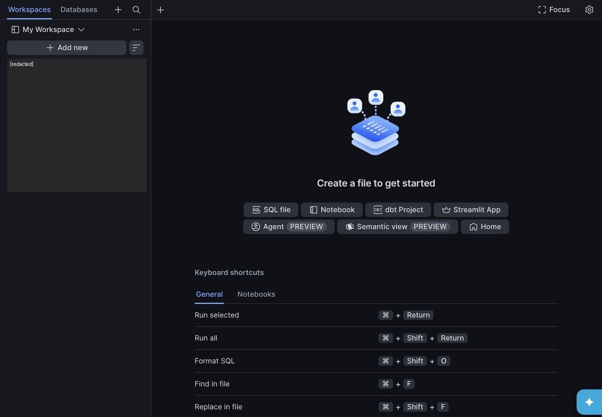

2. In the navigation menu, select **Projects » Workspaces**.
3. Select **Add new** » **Create new workspace**, then choose **Git workspace** from the menu. This opens the **Create workspace from Git repository** dialog.

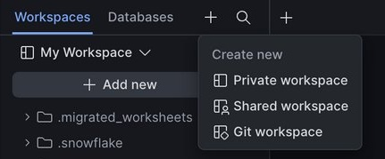

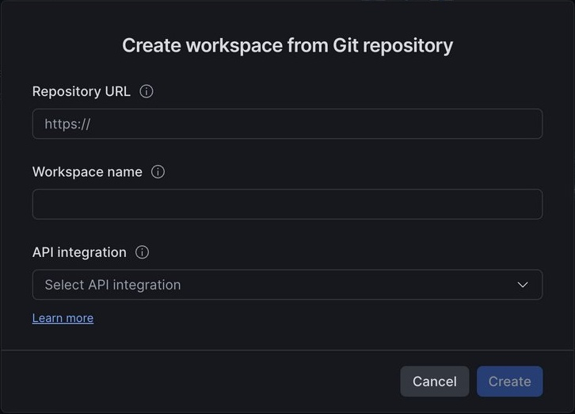

4. Paste the repository URL: `https://github.com/<your_github_username>/simple-streamlit-app`. The **Workspace name** field auto-fills from the repo name.
5. From the **API integration** menu, select `github_git_api_integration` (or the OAuth integration your admin configured).
6. Choose an authentication method. The dialog offers three:
   - **OAuth2**: sign in to GitHub directly (default if an OAuth integration is configured)
   - **Personal access token**: if you followed the Setup section
   - **Public repository**: no credentials at all, available whenever the repo is public; read-only, so **Push** stays disabled. This is fine for quickly previewing this guide, but Priya needs OAuth2 or a personal access token to complete the commit-and-push steps below

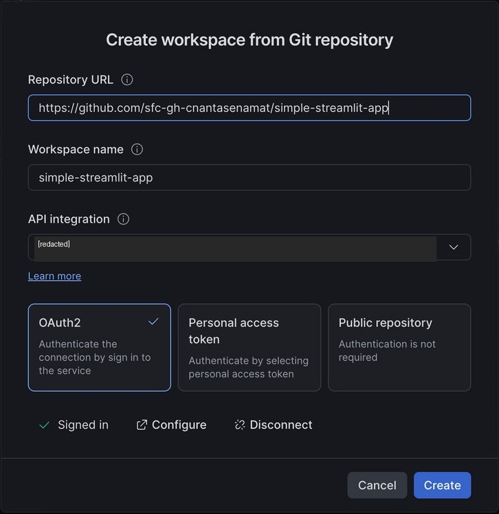

7. Select **Create**. Give it a moment, then confirm the workspace actually exists. The UI can show the Files/Changes tabs as if creation succeeded even when it didn't fully persist. If reopening **Projects » Workspaces** doesn't show it, redo the dialog.
8. Once the workspace opens, use the branch selector at the bottom of the screen (shows **main** by default) to switch to `feature/collab-tutorial`, the branch Marcus pushed. If it doesn't appear in the list yet, select **Fetch all** first to pull the latest remote branches, then look again.

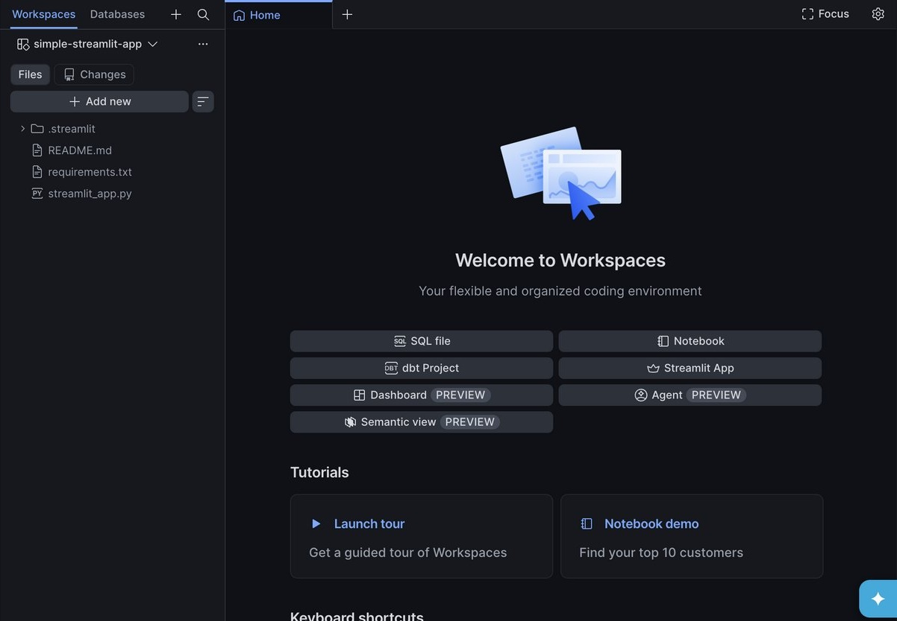

### Run the app

1. Open `streamlit_app.py` in the file browser. A banner appears: *"This file looks like a Streamlit app, but is missing configuration."* Clicking plain **Run** at this point executes the file as a generic Python script and fails with `ModuleNotFoundError: No module named 'streamlit'`, so don't click it yet.

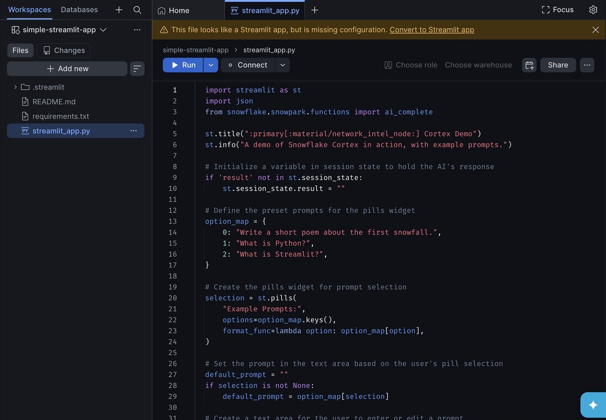

2. Select **Convert to Streamlit app** from the banner. In the confirmation dialog, leave **Move into a new app folder** checked and keep the default folder name (or set your own).

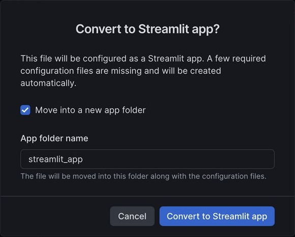

3. Confirm. Workspaces moves `streamlit_app.py` and `.streamlit/config.toml` into that folder and generates two new files alongside them: `pyproject.toml` and `snowflake.yml` (the container-runtime Streamlit app config). All four show up as **A** (added) in the file tree.

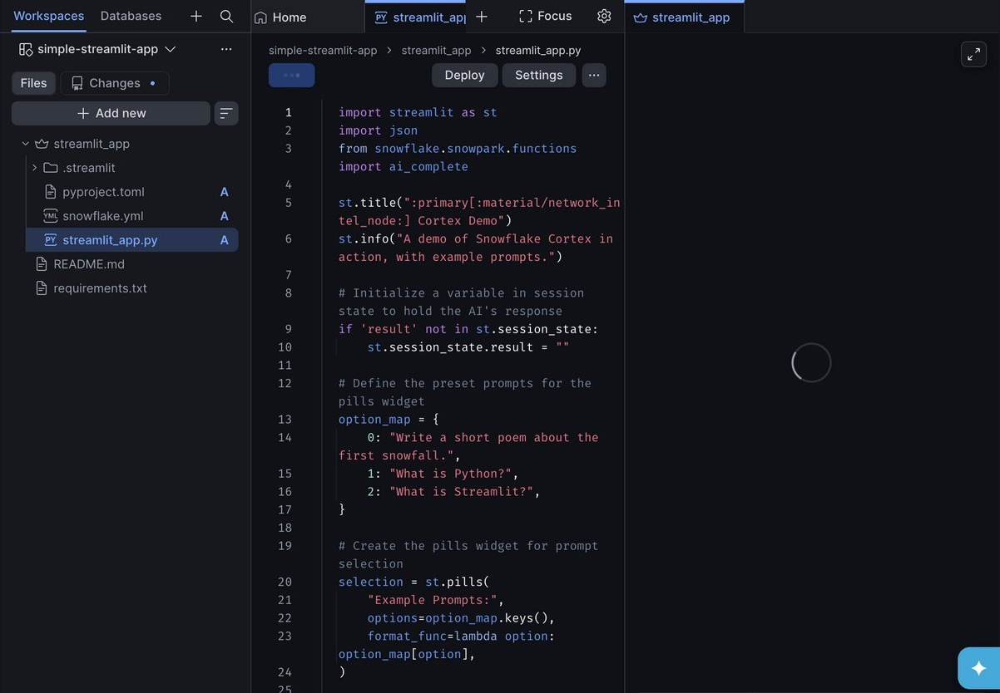

4. Now select **Run** (or `Cmd+Enter` / `Ctrl+Enter`). This launches a private **development app** that only Priya can see, running on the account's compute pool.
5. Confirm the app loads: a title, an info banner, three example prompt pills, and a text area.

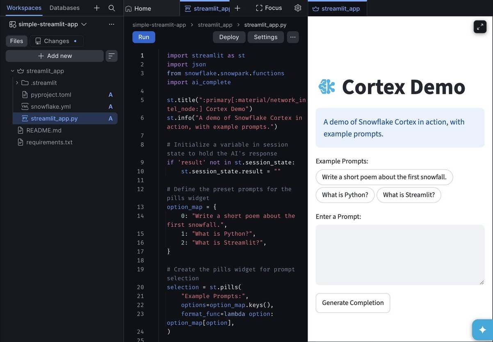

> **Note:** One-time restructuring. "Convert to Streamlit app" only needs to run once per app file; it's how Workspaces turns a plain `.py` file into a recognized Streamlit app. If you clone this repo fresh or someone else already ran the conversion and pushed the resulting `pyproject.toml`/`snowflake.yml`, Workspaces detects the existing configuration and shows a working **Run** button immediately, no conversion needed.

> **Note:** Preview stuck on "Starting app..."? If the status sticks there for more than about a minute, even though the Logs panel already shows "Streamlit process started," don't wait it out. Close the preview tab and select **Run** again with `streamlit_app.py` as the active file tab; this reliably clears it in under 30 seconds. It's a one-off stall in the auto-triggered run from the Convert dialog, unrelated to compute pool capacity.

> **Note:** "App not found" with no logs at all? If Run reports that you don't have access to the app or it doesn't exist, and the Logs panel stays empty, open **Settings** and check **Compute pool**. If it's blank, select an available compute pool, save, and Run again. A missing compute pool was the cause in one test of this guide; the message can also indicate other access or configuration problems.

### Make an edit

Priya wants to make the app's intro copy clearer. She edits the `st.title` and `st.info` lines in `streamlit_app/streamlit_app.py` (the file's new path after the conversion step above):

```python
st.title(":primary[:material/network_intel_node:] Cortex Demo")
st.info("A demo of Snowflake Cortex in action, with example prompts.")
```

becomes:

```python
st.title(":primary[:material/network_intel_node:] Cortex Demo")
st.info("Pick a prompt below, or write your own, then generate a response with Snowflake Cortex.")
```

She saves and re-runs to confirm the new copy shows up in the preview.


### Commit and push

1. Select **Changes** at the top of the folder view.
2. Because the conversion step moved files, this commit includes more than just the copy edit: `streamlit_app.py` and `.streamlit/config.toml` show as **D** (deleted) at the repo root, and `streamlit_app/streamlit_app.py`, `streamlit_app/.streamlit/config.toml`, `streamlit_app/pyproject.toml`, and `streamlit_app/snowflake.yml` show as **A** (added). The file move and the new config files are captured in the same set of changes as Priya's copy edit.

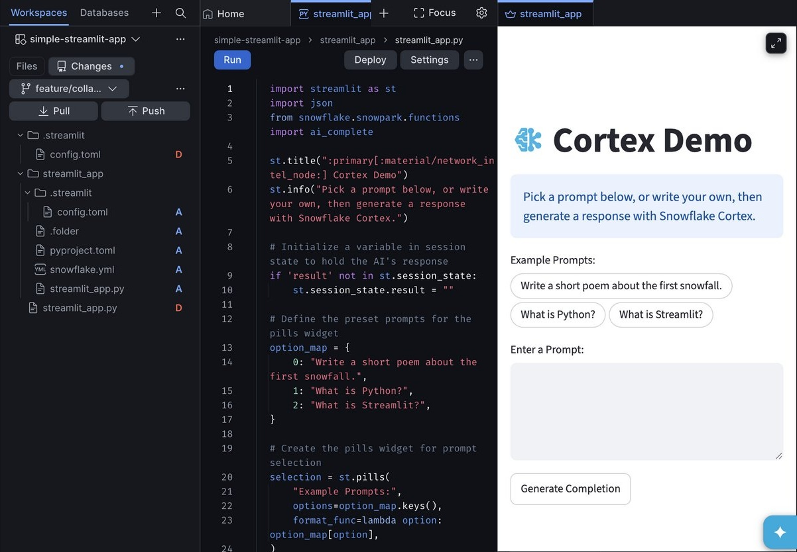

3. Enter a commit message, for example: `Convert to Streamlit app and clarify intro copy`.
4. Select **Push**.

The change is now on `feature/collab-tutorial` in GitHub. Marcus hasn't touched his laptop yet, and he already has Priya's change waiting for him.

> **Note:** Confirm the push actually landed. Snowsight can show a successful "Pushing to remote" state even when the commit didn't reach GitHub, and the UI gives no error in that case. Before assuming Marcus has something to pull, check the repository directly (the GitHub UI, or `git log origin/feature/collab-tutorial` after a `git fetch` on Marcus's side) and confirm the new commit is there. If it isn't, the reliable fallback is pushing the same change from a local clone with `git`, which doesn't share this failure mode.

## Marcus Pulls and Edits

Back on the command line, Marcus fetches Priya's commit:

```bash
git pull origin feature/collab-tutorial
git log --oneline -3
```

He sees Priya's commit (`Convert to Streamlit app and clarify intro copy`) and notices the file layout changed: `streamlit_app.py` moved from the repo root into a `streamlit_app/` folder, alongside a new `pyproject.toml` and `snowflake.yml`. The updated `st.info` line is now in `streamlit_app/streamlit_app.py`.

Marcus adds a fourth prompt pill, a code change that's easier for him to make in his own editor than in a browser:

```python
option_map = {
    0: "Write a short poem about the first snowfall.",
    1: "What is Python?",
    2: "What is Streamlit?",
    3: "What is a Snowflake git-backed workspace?",
}
```

He commits and pushes:

```bash
git add streamlit_app/streamlit_app.py
git commit -m "Add a fourth example prompt about git-backed workspaces"
git push origin feature/collab-tutorial
```

## Priya Pulls Marcus's Change

Marcus's commit is on GitHub, but Priya's workspace doesn't have it yet, since Workspaces doesn't auto-sync remote changes.

1. Back in Snowsight, open the workspace and select **Changes**.
2. Select the down arrow next to **Pull**, and confirm there are no local uncommitted edits first.
3. Select **Pull** to fetch and merge Marcus's commit.
4. Open `streamlit_app/streamlit_app.py` and confirm the fourth prompt pill (`What is a Snowflake git-backed workspace?`) is now present.

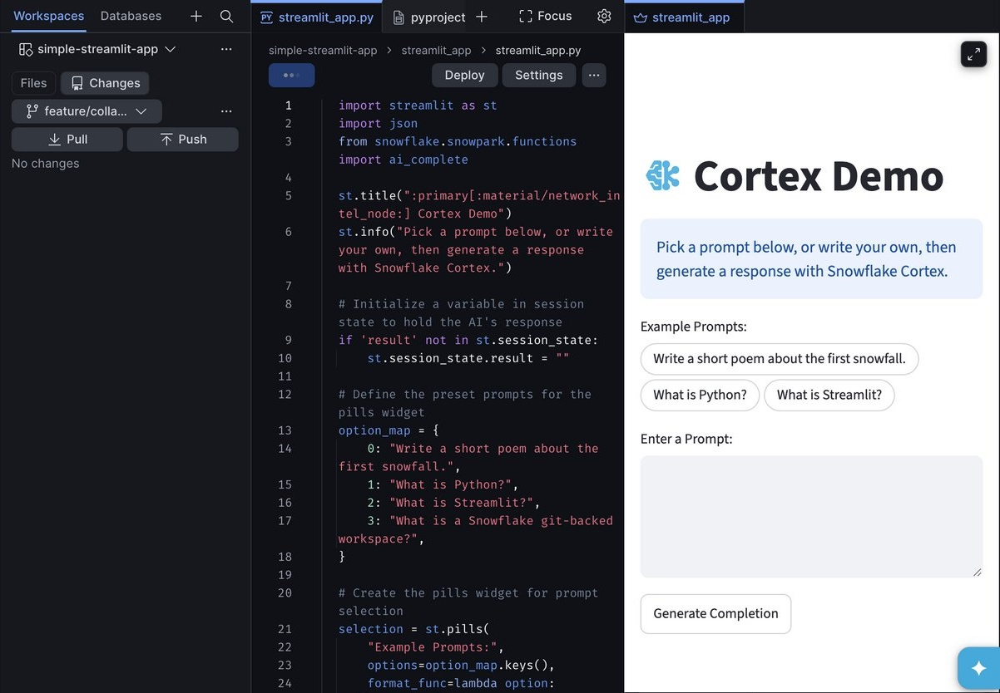

5. Select **Run** again to confirm the app shows four pills instead of three.

> **Note:** Preview still showing three pills after Pull? The live preview iframe can lag behind the code after a Pull, even across repeated Run clicks. Trust the code editor over the preview: if `streamlit_app/streamlit_app.py` already shows the fourth pill in the source, the pull succeeded and it's safe to continue to Deploy.

> **Note:** What if Priya and Marcus edit the same line? A push can be rejected if the remote has commits the workspace doesn't have yet. Snowsight will prompt Priya to **Pull** first; if the pull produces a genuine conflict, the affected file shows a red `M` and an inline diff where she can **Accept all current**, **Accept all remote**, or resolve line-by-line before pushing again. See [Integrate workspaces with a Git repository](https://docs.snowflake.com/en/user-guide/ui-snowsight/workspaces-git) for the full conflict-resolution walkthrough.

## Deploy the App

So far, both collaborators have only seen a **private development app**, Priya's preview and nobody else's. Deploying publishes the current workspace code to a real `STREAMLIT` object other roles can access.

1. In the workspace's project pane toolbar, select **Deploy**.
2. Review the settings: app title, target database and schema, compute pool, and the query warehouse.

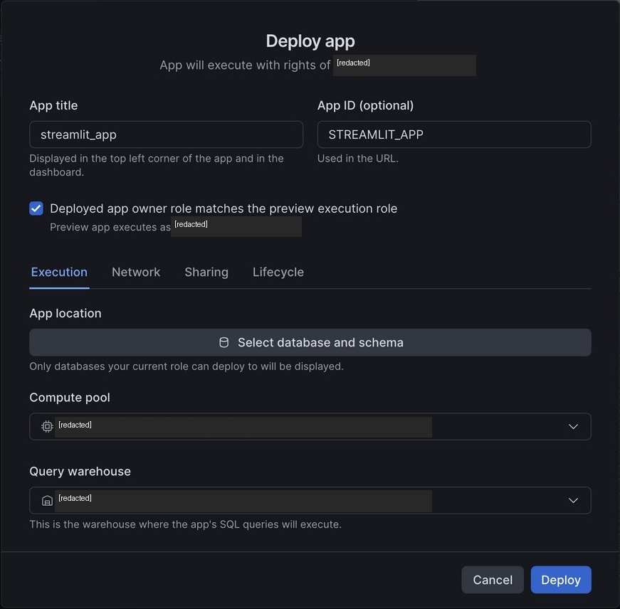

3. Select **Deploy**.

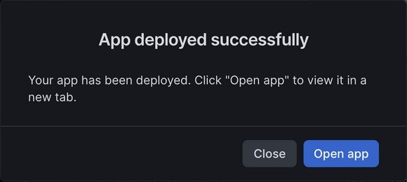

Verify from SQL (the app's name is auto-populated from the app folder, `streamlit_app`, not the repository name):

```sql
SHOW STREAMLITS LIKE '%STREAMLIT_APP%' IN ACCOUNT;
```

Keep in mind the split between the two states: editing the workspace code afterward does **not** change the deployed app until you deploy again, and changing the deployed app's settings does not persist across future deploys. See [Streamlit in Snowflake in Workspaces](https://docs.snowflake.com/en/developer-guide/streamlit/streamlit-in-workspaces/streamlit-in-workspaces-overview) for the full development-app-versus-deployed-app model.

## Clean Up

Keep any changes you want to retain in GitHub before removing tutorial resources. Coordinate with your collaborator so neither person loses uncommitted work.

1. Remove the deployed tutorial app from the database and schema you selected during deployment. Confirm the exact app name and ownership first; do not remove an existing app that you reused.
2. Delete the tutorial workspace only after confirming that its changes are saved remotely. Deleting the workspace and removing the deployed app are separate cleanup steps.
3. If you created the optional Git repository object for the connection check and have not already removed it, use the removal command in **Setup**. Do not remove a repository object shared by other projects.
4. Ask the administrator to remove the API integration and secret only if they were created exclusively for this tutorial and no other workspace or repository uses them. Leave existing OAuth integrations, shared compute pools, and warehouses unchanged.
5. After both collaborators finish, merge or otherwise save the work you need, then delete the tutorial feature branch from your own fork. Remove local tutorial clones only after checking for uncommitted files.
6. Revoke any GitHub personal access token created solely for this tutorial once no remaining connection needs it.

## Conclusion And Resources

Congratulations! You've successfully connected a Snowflake account to a GitHub repository, created a git-backed workspace, and walked through a full collaboration loop between a Snowsight-only user and a command-line Git user editing the same Streamlit in Snowflake app, ending with a deployed, shareable app that carries commits from both of them.

### What You Learned
- Git-backed workspaces use Git itself as the sync mechanism between Snowsight and a local clone, so no shared workspace or RBAC grant is needed for two people to collaborate
- Connecting Snowflake to GitHub is a one-time, account-level step (`CREATE API INTEGRATION` needs `ACCOUNTADMIN`), but everyday use of that connection doesn't
- A workspace's **Run** preview is private to you; nothing is visible to others until you **Deploy**
- Commit and Push/Pull inside Snowsight map directly to the `git` commands a command-line collaborator already knows

### Related Resources

Documentation:
- [Integrate workspaces with a Git repository](https://docs.snowflake.com/en/user-guide/ui-snowsight/workspaces-git)
- [Streamlit in Snowflake in Workspaces](https://docs.snowflake.com/en/developer-guide/streamlit/streamlit-in-workspaces/streamlit-in-workspaces-overview)
- [Sync Streamlit in Snowflake apps with a Git repository](https://docs.snowflake.com/en/developer-guide/streamlit/features/git-integration)
- [Setting up Snowflake to use Git](https://docs.snowflake.com/en/developer-guide/git/git-setting-up)
- [CREATE API INTEGRATION](https://docs.snowflake.com/en/sql-reference/sql/create-api-integration)

Additional Reading:
- [sfc-gh-cnantasenamat/simple-streamlit-app](https://github.com/sfc-gh-cnantasenamat/simple-streamlit-app), the sample app used throughout this guide
- [Snowflake Cortex Overview](https://docs.snowflake.com/en/user-guide/snowflake-cortex/overview)
