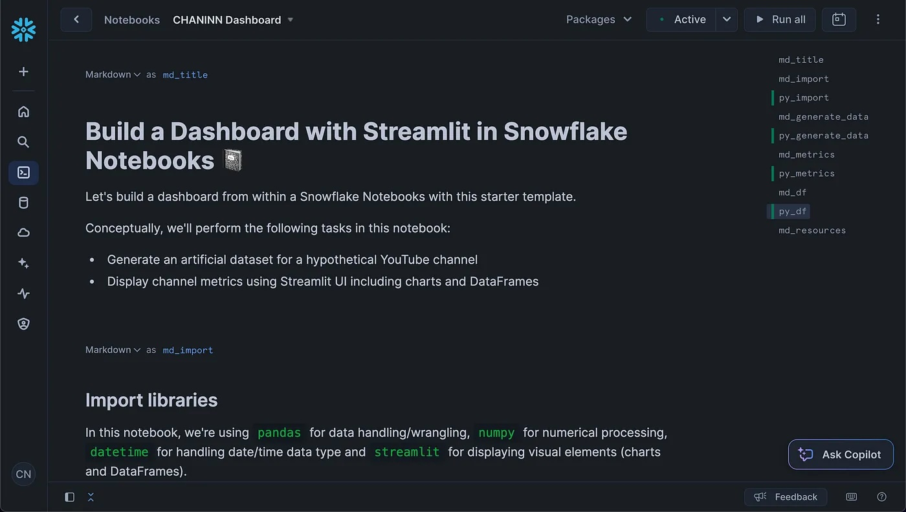
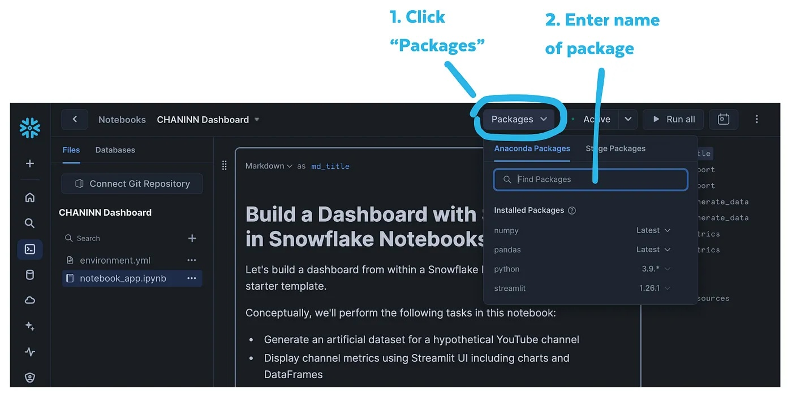
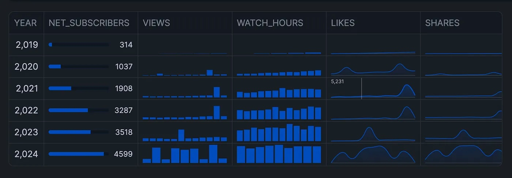

author: Chanin Nantasenamat
id: streamlit-dashboard
categories: snowflake-site:taxonomy/solution-center/certification/quickstart, snowflake-site:taxonomy/product/analytics, snowflake-site:taxonomy/product/applications-and-collaboration, snowflake-site:taxonomy/snowflake-feature/build
language: en
summary: Learn how to create an interactive YouTube analytics dashboard using Streamlit within Snowflake Notebooks. This guide covers data generation, visualization, and user interaction to effectively communicate your data insights. 
environments: web
status: Published
feedback link: https://github.com/Snowflake-Labs/sfguides/issues  


# Building a YouTube Analytics Dashboard with Streamlit in Snowflake Notebooks
<!-- ------------------------ -->
## Overview

Have you ever wanted to create an interactive dashboard directly within your Snowflake environment? Many data professionals struggle with building visually appealing and interactive dashboards that can effectively communicate their data insights. This tutorial leverages Snowflake Notebooks combined with Streamlit to build a comprehensive YouTube analytics dashboard without leaving your Snowflake environment.

By the end of this guide, you'll have a fully functional dashboard that visualizes key YouTube metrics, allowing for interactive data exploration and analysis.

### What You'll Learn
- Generate and structure sample data for dashboard visualization
- Create interactive charts and metrics displays using Streamlit
- Implement user controls for data filtering and visualization options

### What You'll Build
You will create a YouTube analytics dashboard that displays metrics such as subscribers gained/lost, views, watch hours, likes, shares, and comments. The dashboard will feature interactive charts and user controls that allow for dynamic data filtering and visualization.

The dashboard displays key metrics, such as subscriber growth, views, and engagement statistics.



### Prerequisites
- Access to a Snowflake account (sign up for a [free trial account](https://signup.snowflake.com/?utm_source=snowflake-devrel&utm_medium=developer-guides&utm_cta=developer-guides)) with permissions to use Snowflake Notebooks
- Basic knowledge of Python programming
- Familiarity with data manipulation using pandas

<!-- ------------------------ -->
## Setup

### Environment Configuration
Begin by setting up your environment by importing the required libraries. We'll use pandas for data manipulation, numpy for numerical operations, datetime for handling dates, and streamlit for creating the dashboard interface.


### Installation
To install these libraries, you can click on the Packages drop-down found at the top menu followed by entering the name of the Python library:



> 
> IMPORTANT:
> It should be noted that after adding packages, this will create the `environment.yml` file that encodes instruction for installing prerequisite libraries to run the notebook.


### Import libraries
Let's start by importing our required libraries:

```python
import pandas as pd
import numpy as np
from datetime import datetime, timedelta
import streamlit as st
```


<!-- ------------------------ -->
## Building the Dashboard Framework

Before diving into the implementation details, let's set up the framework for our dashboard. We'll start by generating sample YouTube channel data spanning 5 years with various metrics.

### Generating Sample Data
To create a realistic dashboard, we'll generate a synthetic YouTube channel dataset.

```python
# Set random seed for reproducibility
np.random.seed(42)

# Generate dates for 5 years
start_date = datetime(2019, 8, 1)
end_date = datetime(2024, 9, 30)
date_range = pd.date_range(start=start_date, end=end_date, freq='ME')

# Initialize data structure
n_months = len(date_range)
data = {
    'DATE': date_range.strftime('%Y-%m'),
    'SUBSCRIBERS_GAINED': np.zeros(n_months, dtype=int),
    'SUBSCRIBERS_LOST': np.zeros(n_months, dtype=int),
    'VIEWS': np.zeros(n_months, dtype=int),
    'WATCH_HOURS': np.zeros(n_months, dtype=int),
    'LIKES': np.zeros(n_months, dtype=int),
    'SHARES': np.zeros(n_months, dtype=int),
    'COMMENTS': np.zeros(n_months, dtype=int)
}

# Create DataFrame
df = pd.DataFrame(data)

# Function to generate growth
def generate_growth(start, end, months):
    return np.linspace(start, end, months)

# Generate growth patterns
subscribers_gained = generate_growth(30, 6000, n_months)
subscribers_lost = generate_growth(0, 1500, n_months)
views = generate_growth(300, 300000, n_months)
watch_hours = generate_growth(30, 30000, n_months)
likes = generate_growth(0, 15000, n_months)
shares = generate_growth(0, 3000, n_months)
comments = generate_growth(0, 1500, n_months)

# Add randomness and ensure integer values
for i, col in enumerate(['SUBSCRIBERS_GAINED', 'SUBSCRIBERS_LOST', 'VIEWS', 'WATCH_HOURS', 'LIKES', 'SHARES', 'COMMENTS']):
    random_factor = np.random.normal(1, 0.1, n_months)  # Mean of 1, standard deviation of 0.1
    df[col] = np.maximum(0, (eval(col.lower()) * random_factor).astype(int))

# Seasonal variation (higher in summer)
summer_boost = np.sin(np.linspace(0, 2*np.pi, 12))
df['VIEWS'] = df['VIEWS'] * (1 + 0.2 * np.tile(summer_boost, n_months // 12 + 1)[:n_months])

# Occasional viral videos (once every 6 months on average)
viral_months = np.random.choice(range(1, n_months), size=n_months // 6, replace=False)
df.loc[viral_months, ['VIEWS', 'LIKES', 'SHARES', 'COMMENTS']] = df.loc[viral_months, ['VIEWS', 'LIKES', 'SHARES', 'COMMENTS']] * 5

# Ensure integer values
for col in df.columns:
    if col != 'DATE':
        df[col] = df[col].astype(int)

# Calculate cumulative subscribers
df['NET_SUBSCRIBERS'] = (df['SUBSCRIBERS_GAINED'] - df['SUBSCRIBERS_LOST'])

# Ensure no negative values
df[df.select_dtypes(include=[np.number]).columns] = df.select_dtypes(include=[np.number]).clip(lower=0)

# Convert DATE column to datetime
df['DATE'] = pd.to_datetime(df['DATE'])
```

<!-- ------------------------ -->
## Building the Interactive Dashboard

### Helper functions
First, let's create helper functions for powering the dashboard with the data and charts.

Here's the code for creating our helper functions:

```python
# Header for the app
st.header("Cumulative Stats")

# Helper functions for data formatting and aggregation
def format_with_commas(number):
    return f"{number:,}"

def aggregate_data(df, freq):
    return df.resample(freq, on='DATE').agg({
        'VIEWS': 'sum',
        'WATCH_HOURS': 'sum',
        'NET_SUBSCRIBERS': 'sum',
        'LIKES': 'sum'
    }).reset_index()

def create_chart(y, color, height, chart_type):
    if chart_type=='Bar':
        st.bar_chart(df_display, x="DATE", y=y, color=color, height=height)
    if chart_type=='Area':
        st.area_chart(df_display, x="DATE", y=y, color=color, height=height)
```

### Interactive widgets
To introduce interactivity to the dashboard, we’re leveraging input widgets for data range selection, time frame filtering, chart type selection:

```python
# Input widgets
# Date range selection
col = st.columns(4)
with col[0]:
    start_date = st.date_input("Start date", df['DATE'].min().date())
with col[1]:
    end_date = st.date_input("End date", df['DATE'].max().date())
# Time frame selection
with col[2]:
    time_frame = st.selectbox("Select time frame",
        ("Daily", "Weekly", "Monthly", "Quarterly")
    )
# Chart type
with col[3]:
    chart_selection = st.selectbox("Select a chart type",
                                  ("Bar", "Area"))

st.divider()
```

### Data filtering
Next, the data is filtered by using the aforementioned user-provided input widgets. Thus, with each widget interaction, the data is filtered in real-time to display a custom request.

```python
# Filter data based on date range
mask = (df['DATE'].dt.date >= start_date) & (df['DATE'].dt.date <= end_date)
df_filtered = df.loc[mask]

# Aggregate data based on selected time frame
if time_frame == 'Daily':
    df_display = df_filtered
elif time_frame == 'Weekly':
    df_display = aggregate_data(df_filtered, 'W-MON')
elif time_frame == 'Monthly':
    df_display = aggregate_data(df_filtered, 'ME')
elif time_frame == 'Quarterly':
    df_display = aggregate_data(df_filtered, 'QE')


# Compute metric growth based on selected time frame
if len(df_display) >= 2:
    subscribers_growth = int(df_display.NET_SUBSCRIBERS.iloc[-1] - df_display.NET_SUBSCRIBERS.iloc[-2])
    views_growth = int(df_display.VIEWS.iloc[-1] - df_display.VIEWS.iloc[-2])
    watch_hours_growth = int(df_display.WATCH_HOURS.iloc[-1] - df_display.WATCH_HOURS.iloc[-2])
    likes_growth = int(df_display.LIKES.iloc[-1] - df_display.LIKES.iloc[-2])
else:
    subscribers_growth = views_growth = watch_hours_growth = likes_growth = 0
```

### Dashboard Charts
Now, here is where we lay the charts and DataFrame elements onto the dashboard with the help of `st.columns()`.

```python
# Create metrics columns
cols = st.columns(4)
with cols[0]:
    st.metric("Subscribers", 
              format_with_commas(df_display.NET_SUBSCRIBERS.sum()),
              format_with_commas(subscribers_growth)
             )
    create_chart(y="NET_SUBSCRIBERS", color="#29B5E8", height=200, chart_type=chart_selection)
with cols[1]:
    st.metric("Views", 
              format_with_commas(df_display.VIEWS.sum()), 
              format_with_commas(views_growth)
             )
    #st.bar_chart(df_display, x="DATE", y="VIEWS", color="#FF9F36", height=200)
    create_chart(y="VIEWS", color="#FF9F36", height=200, chart_type=chart_selection)
with cols[2]:
    st.metric("Watch Hours", 
              format_with_commas(df_display.WATCH_HOURS.sum()), 
              format_with_commas(watch_hours_growth)
             )
    #st.bar_chart(df_display, x="DATE", y="WATCH_HOURS", color="#D45B90", height=200)
    create_chart(y="WATCH_HOURS", color="#D45B90", height=200, chart_type=chart_selection)
with cols[3]:
    st.metric("Likes", 
              format_with_commas(df_display.LIKES.sum()), 
              format_with_commas(likes_growth)
             )
    #st.bar_chart(df_display, x="DATE", y="LIKES", color="#7D44CF", height=200)
    create_chart(y="LIKES", color="#7D44CF", height=200, chart_type=chart_selection)

# Display filtered DataFrame
with st.expander("See filtered data"):
    st.dataframe(df_display)
```

The end product?

A stunning interactive, dashboard right inside the notebook:


As you can see, the app is responsive and instantaneously updates as we adjust various widgets.

### Dashboard DataFrame

Aside from charts, we can also display a DataFrame that inherently support the display of mini-charts directly in the columns.

So, we’ll start by aggregating the data to a yearly format.

```python
# Function to aggregate data by year, showing monthly values as lists
def aggregate_by_year(df):
    # Convert DATE to datetime
    df['DATE'] = pd.to_datetime(df['DATE'])
    
    # Function to create a list of monthly values
    def monthly_list(x):
        return list(x)
    
    # Group by year and aggregate
    yearly_data = df.groupby(df['DATE'].dt.year).agg({
        'SUBSCRIBERS_GAINED': monthly_list,
        'SUBSCRIBERS_LOST': monthly_list,
        'VIEWS': monthly_list,
        'WATCH_HOURS': monthly_list,
        'LIKES': monthly_list,
        'SHARES': monthly_list,
        'COMMENTS': monthly_list,
        'NET_SUBSCRIBERS': lambda x: list(x)[-1]  # Take the last value of the year
    }).reset_index()
    
    # Rename DATE column to YEAR
    yearly_data = yearly_data.rename(columns={'DATE': 'YEAR'})
    
    return yearly_data

df2 = aggregate_by_year(df)
```

Next, we’ll display this interactive DataFrame with built-in chart displays:



And this is implemented using the following code snippet:

```python
# Display DataFrame with built-in chart displays using column_config
st.dataframe(
    df2,
    column_config={
        "NET_SUBSCRIBERS": st.column_config.ProgressColumn(
            "NET_SUBSCRIBERS",
            min_value=df.NET_SUBSCRIBERS.min(),
            max_value=df.NET_SUBSCRIBERS.max(),
            format="%s"
        ),
        "VIEWS": st.column_config.BarChartColumn(
            "VIEWS",
            y_min=df.VIEWS.min(),
            y_max=df.VIEWS.max(),
        ),
        "WATCH_HOURS": st.column_config.BarChartColumn(
            "WATCH_HOURS",
            y_min=df.WATCH_HOURS.min(),
            y_max=df.WATCH_HOURS.max(),
        ),
        "LIKES": st.column_config.LineChartColumn(
            "LIKES",
            y_min=df.SHARES.min(),
            y_max=df.SHARES.max(),
        ),
        "SHARES": st.column_config.LineChartColumn(
            "SHARES",
            y_min=df.SHARES.min(),
            y_max=df.SHARES.max(),
        ),
        "COMMENTS": st.column_config.LineChartColumn(
            "COMMENTS",
            y_min=df.COMMENTS.min(),
            y_max=df.COMMENTS.max(),
        ),
    },
    column_order=("YEAR",
                  "NET_SUBSCRIBERS",
                  "VIEWS",
                  "WATCH_HOURS",
                  "LIKES",
                  "SHARES",
                  "COMMENTS"),
    hide_index=True
)
```

<!-- ------------------------ -->
## Conclusion and Resources

Congratulations! You've successfully built a comprehensive YouTube analytics dashboard using Streamlit within Snowflake Notebooks. This dashboard allows you to visualize key metrics, interactively filter data, and gain valuable insights directly within your Snowflake environment. Happy coding!

### What You Learned
- How to generate and structure sample data for dashboard visualization
- Creating interactive charts and metrics displays using Streamlit
- Implementing user controls for data filtering and visualization options

For a step-by-step walkthrough, check out the complementary video:


The repository to the notebook is available [here](https://github.com/Snowflake-Labs/snowflake-demo-notebooks/tree/main/Dashboard_with_Streamlit).

### Related Resources

Tutorial videos:
- [Watch complementary tutorial video](https://www.youtube.com/watch?v=LrQwXQm28qE)
- [YouTube Playlist on Snowflake Notebooks](https://www.youtube.com/watch?v=YB1B6vcMaGE&list=PLavJpcg8cl1Efw8x_fBKmfA2AMwjUaeBI)

Documentation:
- [About Snowflake Notebooks](https://docs.snowflake.com/en/user-guide/ui-snowsight/notebooks)
- [Streamlit Documentation](https://docs.streamlit.io/)
- [Snowflake Documentation](https://docs.snowflake.com/)

Additional Reading:
- [st.metric](https://docs.streamlit.io/develop/api-reference/data/st.metric)
- [st.area_chart](https://docs.streamlit.io/develop/api-reference/charts/st.area_chart)
- [st.bar_chart](https://docs.streamlit.io/develop/api-reference/charts/st.bar_chart)
- [st.dataframe](https://docs.streamlit.io/develop/api-reference/data/st.dataframe)
- [st.column_config](https://docs.streamlit.io/develop/api-reference/data/st.column_config)
