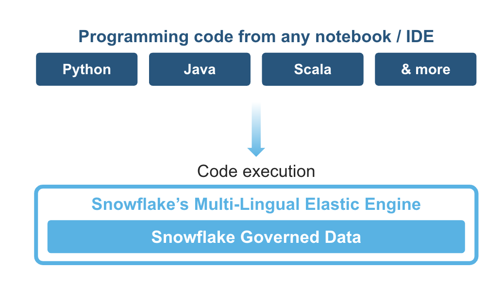
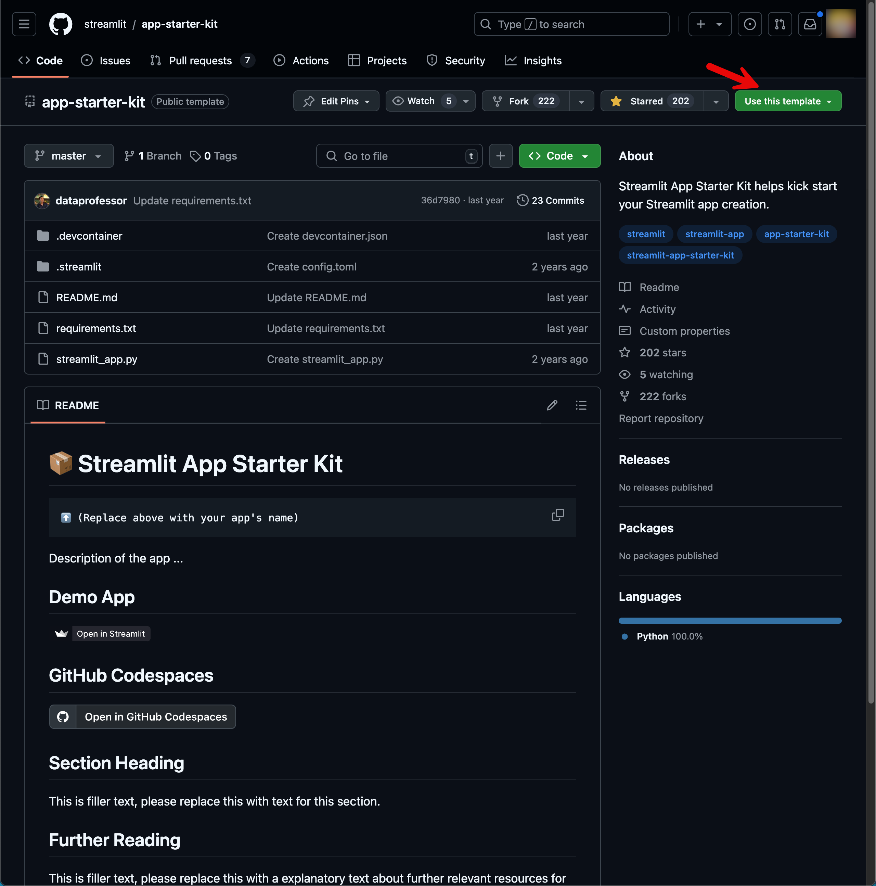

id: streamlit_oss_to_sis_bootstrap
summary: Bootstrapping Your Transition from Streamlit OSS to Streamlit in Snowflake(SiS)
categories: featured,getting-started,data-science-&-ml,data-engineering,app-development
environments: web
status: Published
feedback link: <https://github.com/Snowflake-Labs/sfguides/issues>
tags: Getting Started, Snowpark Python, Streamlit, scikit-learn, Data Engineering, Machine Learning
authors: Kamesh Sampath

# Bootstrapping Your Transition from Streamlit OSS to Streamlit in Snowflake(SiS)
<!-- ------------------------ -->
## Overview

Duration: 5

Ready to transform a simple Streamlit application into an enterprise-grade solution in to SiS? In this hands-on tutorial, you'll explore Streamlit's versatility while building an interactive data application. Using a Machine Learning example, you'll discover how easily Streamlit can evolve from your local machine to a fully integrated Snowflake application.

Your journey will take you through the complete Streamlit development lifecycle. Starting locally, you'll progress to Streamlit OSS cloud deployment, and finally integrate with Snowflake. Get ready to unlock Streamlit's powerful features at each stage!

> aside positive
>    This tutorial is adapted from <https://www.youtube.com/watch?v=LJ6DcLGQ4vY>

Your Development Journey:

🚀 **Start with Streamlit Local Development**

- Create your first interactive web application with [Streamlit](https://streamlit.io)'s components
- Set up data handling and visualization features
- Discover Streamlit's intuitive widget system
- Learn application state management

☁️ **Deploy to Streamlit Community Cloud**

- Launch your application to the cloud
- Master deployment best practices
- Handle dependencies like a pro

❄️ **Connect to Snowflake**

- Level up your app with [Snowflake](https://snowflake.com) connectivity
- Set up secure connections
- Leverage [Snowpark Python](https://docs.snowflake.com/en/developer-guide/snowpark/python/index)
- Deploy the application right from your command line using [Snowflake CLI](https://docs.snowflake.com/en/developer-guide/snowflake-cli/index)

🏢 **Go Native with Streamlit in Snowflake**
    
- Deploy directly in Snowflake
- Adapt your code seamlessly
- Leverage enterprise-grade security

📓 **Explore Snowflake Notebooks**

- Rebuild your app in a new environment
- Combine notebook analytics with Streamlit
- Discover alternative development approaches

### What is Streamlit and Streamlit in Snowflake(SiS) ?

Streamlit is an open-source Python library that makes it easy to create interactive web applications for data science and machine learning. It allows you to quickly build and deploy data apps by writing simple Python scripts. You can learn more about Streamlit in the [official documentation](https://docs.streamlit.io/).

Streamlit integrates seamlessly with Snowflake, enabling you to build Streamlit apps that connect to and query data stored in Snowflake. This combination is often referred to as Streamlit in Snowflake (SiS). The [Snowflake Connector for Python](https://docs.snowflake.com/en/user-guide/python-connector.html) allows you to interact with Snowflake from your Python code. Additionally, Streamlit provides detailed guides on [using Streamlit with Snowflake (SiS)](https://docs.streamlit.io/knowledge-base/tutorials/databases/snowflake) in their documentation.

With Streamlit and Snowflake (SiS), you can build powerful, data-driven applications that provide real-time insights and visualizations.

### What is Snowpark?

Snowpark is the set of libraries and code execution environments that run Python and other programming languages next to your data in Snowflake. Snowpark can be used to build data pipelines, ML models, apps, and other data processing tasks.



**Client Side Libraries** - Snowpark libraries can be installed and downloaded from any client-side notebook or IDE and are used for code development and deployment. Libraries include the Snowpark API for data pipelines and apps and the Snowpark ML API for end to end machine learning.

**Elastic Compute Runtimes** - Snowpark provides elastic compute runtimes for secure execution of your code in Snowflake. Runtime options include: Python, Java, and Scala in warehouses, container runtimes for out-of-the-box distributed processing with CPUs or GPUs using any Python framework, or custom runtimes brought in from Snowpark Container Services to execute any language of choice with CPU or GPU compute.

Learn more about [Snowpark](https://www.snowflake.com/snowpark/).

### What You Will Learn

By the end of this tutorial, you'll:

🎯 Command Streamlit's core features

🚀 Master multiple deployment options

❄️ Integrate seamlessly with Snowflake

🔍 Explore various development environments

⚡ Create production-ready applications

### What You Will Build

Watch your Streamlit application evolve:

- From your laptop to the cloud
- Through Snowflake integration
- Into native Snowflake deployment
- With surprisingly few code changes

Ready to begin? Let's start your journey from local Streamlit development to deploying enterprise-ready applications in Snowflake! 

*Note: This tutorial uses a Machine Learning example to showcase Streamlit's capabilities, but the skills you'll learn apply to any data application you want to build.*

### Prerequisites

To follow along with this tutorial and set up your project successfully, you'll need the following tools and accounts:

* [Visual Studio Code](https://code.visualstudio.com/) 

* [Docker for Desktop](https://www.docker.com/products/docker-desktop/) 

* A GitHub account: If you don't already have a GitHub account, you'll need to create one. 

* [Miniconda](https://docs.anaconda.com/miniconda/) 

* [Snowflake Account](https://signup.snowflake.com): 
    ** A Snowflake account login with ACCOUNTADMIN role. If you have this role in your environment, you may choose to use it. If not, you will need to 1) Register for a free trial, 2) Use a different role that has the ability to create database, schema, tables, stages, tasks, user-defined functions, and stored procedures OR 3) Use an existing database and schema in which you are able to create the mentioned objects.
    ** A Snowflake account with [Anaconda Packages enabled by ORGADMIN](https://docs.snowflake.com/en/developer-guide/udf/python/udf-python-packages.html#using-third-party-packages-from-anaconda). If you do not have a Snowflake account, you can register for a [free trial account](https://signup.snowflake.com/?utm_cta=quickstarts_).

* [Snowflake CLI](https://docs.snowflake.com/en/developer-guide/snowflake-cli/index) 

* And last but not the least latest Google Chrome browser

Please ensure you have all these tools and accounts set up before proceeding with the tutorial. In the following sections, we'll guide you through the process of setting up your GitHub project using the Streamlit Starter Kit.

<!-- ------------------------ -->
## Setup Environment

Duration: 15

### Creating a Project

Let us create a base Streamlit project from scratch using [Streamlit application Starter Kit](https://github.com/streamlit/app-starter-kit).

Navigate to the folder where you want to create your application,

```shell
cd <directory where you want to create your project>
```

Create the application folder for the rest of the demo we will call this as `st-ml-app` and for easy reference we will export to an environment variable named `$TUTORIAL_HOME`,

```shell
export TUTORIAL_HOME='st-ml-app'
mkdir -p $TUTORIAL_HOME
cd $TUTORIAL_HOME
```

You can either directly use the template from the repo <https://github.com/streamlit/app-starter-kit>,



Once you fork the repository clone the same to `$TUTORIAL_HOME`.

```shell
git clone <your template repo> $TUTORIAL_HOME
```

**(OR)**

We can use [GitHub CLI](https://cli.github.com/) and create a remote git repository under your GitHub account using the same template,

```shell
gh repo create st-ml-app \
   --template='streamlit/app-starter-kit' \
   --public 
```

Clone the created repository to current directory,

```shell
gh repo clone st-ml-app .
```

### Choice of Development Environment

This tutorial can be run in many ways

- Locally on your machine installing all tools
- Using [DevContainer](https://code.visualstudio.com/docs/devcontainers/create-dev-container). The project is also enabled with DevContainers.
- Using [GitHub Codespaces](https://github.com/features/codespaces)


> aside positive
> **IMPORTANT**: For this demo we will do all the setup locally on our machines.

Once you have all that lets get to next chapter where we will deploy the bare bone application Streamlit community cloud.


<!-- ------------------------ -->
## Deploying Your Streamlit App to Streamlit Cloud

Duration: 15

Congratulations on setting up your project using the Streamlit Starter Kit!  In this chapter, we'll take the next exciting step, deploying your bare-bones application to Streamlit Cloud. This will be the starting point of your application-building journey.

Streamlit Cloud is a platform that allows you to easily deploy, manage your Streamlit applications. By deploying your app to Streamlit Cloud, you'll be able to access it from anywhere, collaborate with others, and showcase your work to a wider audience.

In this chapter, we'll cover the following topics:

-  ✅ Creating a Streamlit Cloud account
-  ✅ Preparing your app for deployment
-  ✅ Connecting your GitHub repository to Streamlit Cloud
-  ✅ Configuring your app settings on Streamlit Cloud
-  ✅ Deploying your app and accessing it via a public URL
-  ✅ Making updates to your app and watch application refresh automatically in few seconds

By the end of this chapter, you'll have a live, publicly accessible Streamlit app that serves as a foundation for your application-building exercises. You'll be able to share the URL with others, gather feedback, and iterate on your app as you progress through the tutorial.

Let's dive in and get your app deployed to Streamlit Cloud!

### Navigate to app folder

If you are not on `$TUTORIAL_HOME`, navigate to it and open the project in VS Code:

```shell
cd $TUTORIAL_HOME
code .
```

### Install and Update Python packages

> aside positive
> **NOTE**: Defining the right package versions will allow us to deploy the same application to SiS without any trouble.

Update the `$TUTORIAL_HOME/requirements.txt` to be like:

```py
snowflake-cli-labs>=3.1.0,<4.0.0
streamlit==1.35.0
pandas==2.0.3
numpy==1.24.3
scikit-learn==1.3.0
```

### Creating a Python Virtual Environment

We will use [`miniconda`](https://docs.anaconda.com/miniconda/) to create a Python virtual environment and install all the packages.

Create an environment file `$TUTORIAL_HOME/environment.yml` to be like:

```yaml
name: st_ml_app
channels:
  - snowflake
  - conda-forge
dependencies:
  - python=3.11
  - pip
  - pip:
    - -r requirements.txt
```

Run the following command to create the Python virtual environment:

```shell
conda env create -f environment.yml 
```

And activate the environment:

```shell
conda activate st_ml_app
```

> aside positive
> **TIP**: Use [direnv](https://direnv.net) to de-clutter your local environment. You can create a Python virtual environment simply by creating a file named `.envrc` in your `$TUTORIAL_HOME` with the following content:
>
> ```shell
>    layout_python
> ```


### Application Update

Let us start with a small change to the application code.

> aside negative
> **IMPORTANT**:
> For the entire tutorial, we will be making changes to the `$TUTORIAL_HOME/streamlit_app.py` file. The code listings will show the entire source with the change highlighted. This approach helps avoid any copy/paste errors while doing the exercises.

Edit and update the `$TUTORIAL_HOME/streamlit_app.py`:

```py 
import streamlit as st

st.title("🤖 Machine Learning App")

st.write("Welcome to world of Machine Learning with Streamlit.")
```
Commit the code: 

```shell
git commit -m "First deployment" streamlit_app.py
```

And push the code your remote(`st-ml-app`) Github repository.

> aside positive
> **NOTE**:
> You can also do commit and push using VS Code. For the rest of the tutorial, commits and pushes are assumed implicit after each code update.

### Deploying to Streamlit Community Cloud

To deploy the application navigate to <https://streamlit.io>, Sign-In and click **Create app**.

You will need the following details for deploying the app,

- **GitHub Repo name** - `gh-user/st-ml-app`
- **Branch** - `main`
- **Main file path** - `streamlit_app.py`
- **App URL** - choose a public url for your application easiest one to avoid is to use something like `gh-user-ml-app`.

Any commit and push to your repository will trigger a new application update. **Give it a try!**

🎉 Great! You have successfully deployed your bare-bones Streamlit app to Streamlit Cloud. Now you're ready to dive into the exciting world of building machine learning applications and discover how Streamlit can enhance that experience.

In the next chapter, we'll start transforming your starter app into a fully-fledged ML application.

<!-- ------------------------ -->

## Exploring the Penguins Dataset with Streamlit

Duration: 10

In this chapter, we'll explore the Penguins dataset and use it as a base to build an interactive ML application using Streamlit.

By the end of this chapter you will,

-  ✅ Loading, preprocessing, and preparing the dataset for visualization
-  ✅ Using Streamlit Expander to display:
    * Dataset Information
    * Machine Learning Model Features (**X**)
    * Prediction Target(`species`) variable (**y**)
-  ✅ Creating interactive scatter plots to identify patterns and relationships

### Download Dataset

Let us download the dataset locally,

```shell
mkdir -p "$TUTORIAL_HOME/data"
curl -sSL \
  -o data/penguins_cleaned.csv \
  https://raw.githubusercontent.com/dataprofessor/data/refs/heads/master/penguins_cleaned.csv
```

### Displaying the Data

Edit and update the `streamlit_app.py` with the following code,

```py
import streamlit as st

# import pandas to read the our data file
import pandas as pd

st.title("🤖 Machine Learning App")

st.write("Welcome to world of Machine Learning with Streamlit.")

# read the csv file
df = pd.read_csv("data/penguins_cleaned.csv")
df
```
Stage, commit and push the code to the repository. In few seconds you should notice that your application on Streamlit Community Cloud refreshed with all your changes.

### Application Overview

As part of this machine learning application, we will be building a simple classification model to predict Penguin species (**y**) using input variables (**X**). Using Streamlit's interactive widgets, we'll display these variables to make our application user-friendly and intuitive.

This classification model will help us categorize penguins into their respective species based on their physical characteristics. The input variables and target variable will be presented through Streamlit's interface, allowing users to easily interact with and understand the prediction process.

### Adding Our First Widget

Let us add our first Streamlit widget [expander](https://docs.streamlit.io/develop/api-reference/layout/st.expander) to allow expand and collapse of the data frame.

Edit and update the `$TUTORIAL_HOME/streamlit_app.py` with the following code,

```py
import streamlit as st

# import pandas to read the our data file
import pandas as pd

st.title("🤖 Machine Learning App")

st.write("Welcome to world of Machine Learning with Streamlit.")

with st.expander("Data"):
    st.write("**Raw Data**")
    # read the csv file
    df = pd.read_csv("data/penguins_cleaned.csv")
    df
```

### Displaying the Variables

Let us create and display the input features(**X**) and target(**y**), edit and update the `$TUTORIAL_HOME/streamlit_app.py` with the following code,

```py
import streamlit as st

# import pandas to read the our data file
import pandas as pd

st.title("🤖 Machine Learning App")

st.write("Welcome to world of Machine Learning with Streamlit.")

with st.expander("Data"):
    st.write("**Raw Data**")
    # read the csv file
    df = pd.read_csv("data/penguins_cleaned.csv")
    df
    # define and display
    st.write("**X**")
    X = df.drop("species",axis=1)
    X

    st.write("**y**")
    y = df.species
    y
```

### Data Visualization

Let us visualize the Penguins data using a [scatter plot](https://docs.streamlit.io/develop/api-reference/charts/st.scatter_chart) , edit and update the `$TUTORIAL_HOME/streamlit_app.py` with the following code,

```py
import streamlit as st

# import pandas to read the our data file
import pandas as pd

st.title("🤖 Machine Learning App")

st.write("Welcome to world of Machine Learning with Streamlit.")

with st.expander("Data"):
    st.write("**Raw Data**")
    # read the csv file
    df = pd.read_csv("data/penguins_cleaned.csv")
    df
    # define and display
    st.write("**X**")
    x = df.drop("species", axis=1)
    x

    st.write("**y**")
    y = df.species
    y

with st.expander("Data Visualization"):
    st.scatter_chart(
        df,
        x="bill_length_mm",
        y="body_mass_g",
        color="species",
    )
```

Now that we have our variables and target displayed for reference, let's move to the next chapter where we'll explore Streamlit's interactive features.

<!-- ------------------------ -->
## Interactive Features

Duration: 15

In this chapter, we'll discover how to add user interactivity to our application using Streamlit widgets:

- ⚡ [Sidebar](https://docs.streamlit.io/library/api-reference/layout/st.sidebar) for organizing widgets in a collapsible panel
- ⚡ [Select box](https://docs.streamlit.io/library/api-reference/widgets/st.selectbox) for choosing categorical features
- ⚡ [Slider](https://docs.streamlit.io/library/api-reference/widgets/st.slider) for adjusting numerical values
- ⚡ [Radio buttons](https://docs.streamlit.io/library/api-reference/widgets/st.radio) for making single-choice selections
- ⚡ [Checkbox](https://docs.streamlit.io/library/api-reference/widgets/st.checkbox) for toggle options

These widgets will allow users to dynamically modify model feature values, which will then update our model's predictions in real-time.

### Build a Sidebar

Streamlit's sidebar provides a convenient way for users to interactively filter and select input features for our machine learning model, enhancing the app's functionality and user experience. To implement this, let's update the `$TUTORIAL_HOME/streamlit_app.py` file with the following code:

```py title="streamlit_app.py"
import streamlit as st

# import pandas to read the our data file
import pandas as pd

st.title("🤖 Machine Learning App")

st.write("Welcome to world of Machine Learning with Streamlit.")

with st.expander("Data"):
    st.write("**Raw Data**")
    # read the csv file
    df = pd.read_csv("data/penguins_cleaned.csv")
    df
    # define and display
    st.write("**X**")
    X = df.drop("species", axis=1)
    X

    st.write("**y**")
    y = df.species
    y

with st.expander("Data Visualization"):
    st.scatter_chart(
        df,
        x="bill_length_mm",
        y="body_mass_g",
        color="species",
    )

# Interactivity
# Columns:
# 'species', 'island', 'bill_length_mm', 'bill_depth_mm',
# 'flipper_length_mm', 'body_mass_g', 'sex'
with st.sidebar:
    st.header("Input Features")
    # Islands
    islands = df.island.unique().astype(str)
    island = st.selectbox(
        "Island",
        islands,
    )
    # Bill Length
    min, max, mean = (
        df.bill_length_mm.min(),
        df.bill_length_mm.max(),
        df.bill_length_mm.mean().round(2),
    )
    bill_length_mm = st.slider(
        "Bill Length(mm)",
        min_value=min,
        max_value=max,
        value=mean,
    )
    # Bill Depth
    min, max, mean = (
        df.bill_depth_mm.min(),
        df.bill_depth_mm.max(),
        df.bill_depth_mm.mean().round(2),
    )
    bill_depth_mm = st.slider(
        "Bill Depth(mm)",
        min_value=min,
        max_value=max,
        value=mean,
    )
    # Flipper Length
    min, max, mean = (
        df.flipper_length_mm.min().astype(float),
        df.flipper_length_mm.max().astype(float),
        df.flipper_length_mm.mean().round(2),
    )
    flipper_length_mm = st.slider(
        "Flipper Length(mm)",
        min_value=min,
        max_value=max,
        value=mean,
    )
    # Body Mass
    min, max, mean = (
        df.body_mass_g.min().astype(float),
        df.body_mass_g.max().astype(float),
        df.body_mass_g.mean().round(2),
    )
    body_mass_g = st.slider(
        "Body Mass(g)",
        min_value=min,
        max_value=max,
        value=mean,
    )
    # Gender
    gender = st.radio(
        "Gender",
        ("Male", "Female"),
    )
```

### Feature Data Preprocessing

We will now filter the `data` DataFrame based on the selected features and use [`pd.concat`](https://pandas.pydata.org/docs/reference/api/pandas.concat.html), ensuring the new data undergoes the same preprocessing steps as our training data.

Edit and update the `$TUTORIAL_HOME/streamlit_app.py` with the following code,

```py
import streamlit as st

# import pandas to read the our data file
import pandas as pd

st.title("🤖 Machine Learning App")

st.write("Welcome to world of Machine Learning with Streamlit.")

with st.expander("Data"):
    st.write("**Raw Data**")
    # read the csv file
    df = pd.read_csv("data/penguins_cleaned.csv")
    df
    # define and display
    st.write("**X**")
    x = df.drop("species", axis=1)
    x

    st.write("**y**")
    y = df.species
    y

with st.expander("Data Visualization"):
    st.scatter_chart(
        df,
        x="bill_length_mm",
        y="body_mass_g",
        color="species",
    )

# Interactivity
# Columns:
# 'species', 'island', 'bill_length_mm', 'bill_depth_mm',
# 'flipper_length_mm', 'body_mass_g', 'sex'
with st.sidebar:
    st.header("Input Features")
    # Islands
    islands = df.island.unique().astype(str)
    island = st.selectbox(
        "Island",
        islands,
    )
    # Bill Length
    min, max, mean = (
        df.bill_length_mm.min(),
        df.bill_length_mm.max(),
        df.bill_length_mm.mean().round(2),
    )
    bill_length_mm = st.slider(
        "Bill Length(mm)",
        min_value=min,
        max_value=max,
        value=mean,
    )
    # Bill Depth
    min, max, mean = (
        df.bill_depth_mm.min(),
        df.bill_depth_mm.max(),
        df.bill_depth_mm.mean().round(2),
    )
    bill_depth_mm = st.slider(
        "Bill Depth(mm)",
        min_value=min,
        max_value=max,
        value=mean,
    )
    # Flipper Length
    min, max, mean = (
        df.flipper_length_mm.min().astype(float),
        df.flipper_length_mm.max().astype(float),
        df.flipper_length_mm.mean().round(2),
    )
    flipper_length_mm = st.slider(
        "Flipper Length(mm)",
        min_value=min,
        max_value=max,
        value=mean,
    )
    # Body Mass
    min, max, mean = (
        df.body_mass_g.min().astype(float),
        df.body_mass_g.max().astype(float),
        df.body_mass_g.mean().round(2),
    )
    body_mass_g = st.slider(
        "Body Mass(g)",
        min_value=min,
        max_value=max,
        value=mean,
    )
    # Gender
    gender = st.radio(
        "Gender",
        ("male", "female"),
    )

# Dataframes for Input features
data = {
    "island": island,
    "bill_length_mm": bill_length_mm,
    "bill_depth_mm": bill_depth_mm,
    "flipper_length_mm": flipper_length_mm,
    "body_mass_g": body_mass_g,
    "sex": gender,
}
input_df = pd.DataFrame(data, index=[0])
input_penguins = pd.concat([input_df, X], axis=0)

with st.expander("Input Features"):
    st.write("**Input Penguins**")
    input_df
    st.write("**Combined Penguins Data**")
    input_penguins
```

Now that we've prepared our input data, let's handle the categorical variables using encoding techniques. Feature encoding is crucial for converting categorical data into a format suitable for machine learning models.

<!-- ------------------------ -->
## Data Preparation

Duration: 15

Before applying our machine learning model, we need to convert categorical variables into numerical format using [One-Hot Encoding](https://scikit-learn.org/stable/modules/preprocessing.html#encoding-categorical-features). In our penguin dataset, we'll use pandas [`get_dummies()`](https://pandas.pydata.org/docs/reference/api/pandas.get_dummies.html) to encode:

**Features (X):**

-  ✅ `island` - Categorical location of penguin
-  ✅ `sex` - Gender of penguin

**Target (y):**

-  ✅ `species` - Type of penguin (our prediction target)

📝 **One-Hot Encoding** converts categorical variables into binary (0 or 1) format. For example:
```python
# Original: island = ['Torgersen', 'Biscoe']
# After encoding:
# island_Torgersen = [1, 0]
# island_Biscoe    = [0, 1]
```

### Encoding Features and Target

Edit and update the `$TUTORIAL_HOME/streamlit_app.py` with the following code,

```py
import streamlit as st

# import pandas to read the our data file
import pandas as pd

st.title("🤖 Machine Learning App")

st.write("Welcome to world of Machine Learning with Streamlit.")

with st.expander("Data"):
    st.write("**Raw Data**")
    # read the csv file
    df = pd.read_csv("data/penguins_cleaned.csv")
    df
    # define and display
    st.write("**X**")
    X_raw = df.drop("species", axis=1)
    X_raw

    st.write("**y**")
    y_raw = df.species
    y_raw

with st.expander("Data Visualization"):
    st.scatter_chart(
        df,
        x="bill_length_mm",
        y="body_mass_g",
        color="species",
    )

# Interactivity
# Columns:
# 'species', 'island', 'bill_length_mm', 'bill_depth_mm',
# 'flipper_length_mm', 'body_mass_g', 'sex'
with st.sidebar:
    st.header("Input Features")
    # Islands
    islands = df.island.unique().astype(str)
    island = st.selectbox(
        "Island",
        islands,
    )
    # Bill Length
    min, max, mean = (
        df.bill_length_mm.min(),
        df.bill_length_mm.max(),
        df.bill_length_mm.mean().round(2),
    )
    bill_length_mm = st.slider(
        "Bill Length(mm)",
        min_value=min,
        max_value=max,
        value=mean,
    )
    # Bill Depth
    min, max, mean = (
        df.bill_depth_mm.min(),
        df.bill_depth_mm.max(),
        df.bill_depth_mm.mean().round(2),
    )
    bill_depth_mm = st.slider(
        "Bill Depth(mm)",
        min_value=min,
        max_value=max,
        value=mean,
    )
    # Flipper Length
    min, max, mean = (
        df.flipper_length_mm.min().astype(float),
        df.flipper_length_mm.max().astype(float),
        df.flipper_length_mm.mean().round(2),
    )
    flipper_length_mm = st.slider(
        "Flipper Length(mm)",
        min_value=min,
        max_value=max,
        value=mean,
    )
    # Body Mass
    min, max, mean = (
        df.body_mass_g.min().astype(float),
        df.body_mass_g.max().astype(float),
        df.body_mass_g.mean().round(2),
    )
    body_mass_g = st.slider(
        "Body Mass(g)",
        min_value=min,
        max_value=max,
        value=mean,
    )
    # Gender
    gender = st.radio(
        "Gender",
        ("male", "female"),
    )

# Dataframes for Input features
data = {
    "island": island,
    "bill_length_mm": bill_length_mm,
    "bill_depth_mm": bill_depth_mm,
    "flipper_length_mm": flipper_length_mm,
    "body_mass_g": body_mass_g,
    "sex": gender,
}
input_df = pd.DataFrame(data, index=[0])
input_penguins = pd.concat([input_df, X_raw], axis=0)

with st.expander("Input Features"):
    st.write("**Input Penguins**")
    input_df
    st.write("**Combined Penguins Data**")
    input_penguins

## Data Preparation

## Encode X
X_encode = ["island", "sex"]
df_penguins = pd.get_dummies(input_penguins, prefix=X_encode)
X=df_penguins[1:]
input_row = df_penguins[:1]

## Encode Y
target_mapper = {
    "Adelie": 0,
    "Chinstrap": 1,
    "Gentoo": 2,
}


def target_encoder(val_y: str) -> int:
    return target_mapper[val_y]


y = y_raw.apply(target_encoder)

with st.expander("Data Preparation"):
    st.write("**Encoded X (input penguins)**")
    input_row
    st.write("**Encoded y**")
    y
```

After successfully preprocessing our penguin dataset with appropriate encoding and feature selection, let's move forward to training our model and calculating species prediction probabilities. This step will prepare us for creating interactive visualizations in Streamlit.

<!-- ------------------------ -->
## Training and Prediction

Duration: 20

Now that our data is properly encoded, we'll use a classification model to predict penguin species based on their filtered physical characteristics. We'll employ scikit-learn's [Random Forest Classifier](https://scikit-learn.org/stable/modules/generated/sklearn.ensemble.RandomForestClassifier.html) to calculate probability scores for each species prediction.

In this chapter, we will:

-  ✅ Split our filtered dataset into training and testing sets
-  ✅ Train a Random Forest Classifier using our selected feature set  
-  ✅ Calculate prediction probabilities for each penguin species
-  ✅ Visualize these probabilities using Streamlit's interactive components

### Train and Predict

As part of displaying the predictions we will use the following Streamlit components to make the output aesthetically appealing,

- [Progress Column Config](https://docs.streamlit.io/develop/api-reference/data/st.column_config/st.column_config.progresscolumn)
- [Success Message](https://docs.streamlit.io/develop/api-reference/status/st.success)
- [Container](https://docs.streamlit.io/develop/api-reference/layout/st.container)

Edit and update the `$TUTORIAL_HOME/streamlit_app.py` with the following code,

```py
import streamlit as st

# import pandas to read the our data file
import pandas as pd
from sklearn.ensemble import RandomForestClassifier

st.title("🤖 Machine Learning App")

st.write("Welcome to world of Machine Learning with Streamlit.")

with st.expander("Data"):
    st.write("**Raw Data**")
    # read the csv file
    df = pd.read_csv("data/penguins_cleaned.csv")
    df
    # define and display
    st.write("**X**")
    X_raw = df.drop("species", axis=1)
    X_raw

    st.write("**y**")
    y_raw = df.species
    y_raw

with st.expander("Data Visualization"):
    st.scatter_chart(
        df,
        x="bill_length_mm",
        y="body_mass_g",
        color="species",
    )

# Interactivity
# Columns:
# 'species', 'island', 'bill_length_mm', 'bill_depth_mm',
# 'flipper_length_mm', 'body_mass_g', 'sex'
with st.sidebar:
    st.header("Input Features")
    # Islands
    islands = df.island.unique().astype(str)
    island = st.selectbox(
        "Island",
        islands,
    )
    # Bill Length
    min, max, mean = (
        df.bill_length_mm.min(),
        df.bill_length_mm.max(),
        df.bill_length_mm.mean().round(2),
    )
    bill_length_mm = st.slider(
        "Bill Length(mm)",
        min_value=min,
        max_value=max,
        value=mean,
    )
    # Bill Depth
    min, max, mean = (
        df.bill_depth_mm.min(),
        df.bill_depth_mm.max(),
        df.bill_depth_mm.mean().round(2),
    )
    bill_depth_mm = st.slider(
        "Bill Depth(mm)",
        min_value=min,
        max_value=max,
        value=mean,
    )
    # Flipper Length
    min, max, mean = (
        df.flipper_length_mm.min().astype(float),
        df.flipper_length_mm.max().astype(float),
        df.flipper_length_mm.mean().round(2),
    )
    flipper_length_mm = st.slider(
        "Flipper Length(mm)",
        min_value=min,
        max_value=max,
        value=mean,
    )
    # Body Mass
    min, max, mean = (
        df.body_mass_g.min().astype(float),
        df.body_mass_g.max().astype(float),
        df.body_mass_g.mean().round(2),
    )
    body_mass_g = st.slider(
        "Body Mass(g)",
        min_value=min,
        max_value=max,
        value=mean,
    )
    # Gender
    gender = st.radio(
        "Gender",
        ("male", "female"),
    )

# DataFrames for Input features
data = {
    "island": island,
    "bill_length_mm": bill_length_mm,
    "bill_depth_mm": bill_depth_mm,
    "flipper_length_mm": flipper_length_mm,
    "body_mass_g": body_mass_g,
    "sex": gender,
}
input_df = pd.DataFrame(data, index=[0])
input_penguins = pd.concat([input_df, X_raw], axis=0)

with st.expander("Input Features"):
    st.write("**Input Penguins**")
    input_df
    st.write("**Combined Penguins Data**")
    input_penguins

## Data Preparation

## Encode X
X_encode = ["island", "sex"]
df_penguins = pd.get_dummies(input_penguins, prefix=X_encode)
X = df_penguins[1:]
input_row = df_penguins[:1]

## Encode Y
target_mapper = {
    "Adelie": 0,
    "Chinstrap": 1,
    "Gentoo": 2,
}


def target_encoder(val_y: str) -> int:
    return target_mapper[val_y]


y = y_raw.apply(target_encoder)

with st.expander("Data Preparation"):
    st.write("**Encoded X (input penguins)**")
    input_row
    st.write("**Encoded y**")
    y


with st.container():
    st.subheader("**Prediction Probability**")
    ## Model Training
    rf_classifier = RandomForestClassifier()
    # Fit the model
    rf_classifier.fit(X, y)
    # predict using the model
    prediction = rf_classifier.predict(input_row)
    prediction_prob = rf_classifier.predict_proba(input_row)

    # reverse the target_mapper
    p_cols = dict((v, k) for k, v in target_mapper.items())
    df_prediction_prob = pd.DataFrame(prediction_prob)
    # set the column names
    df_prediction_prob.columns = p_cols.values()
    # set the Penguin name
    df_prediction_prob.rename(columns=p_cols)

    st.dataframe(
        df_prediction_prob,
        column_config={
            "Adelie": st.column_config.ProgressColumn(
                "Adelie",
                help="Adelie",
                format="%f",
                width="medium",
                min_value=0,
                max_value=1,
            ),
            "Chinstrap": st.column_config.ProgressColumn(
                "Chinstrap",
                help="Chinstrap",
                format="%f",
                width="medium",
                min_value=0,
                max_value=1,
            ),
            "Gentoo": st.column_config.ProgressColumn(
                "Gentoo",
                help="Gentoo",
                format="%f",
                width="medium",
                min_value=0,
                max_value=1,
            ),
        },
        hide_index=True,
    )

# display the prediction
st.subheader("Predicted Species")
st.success(p_cols[prediction[0]])
```

### Chapter Summary

After successfully creating an interactive penguin species prediction app using Streamlit's Progress bars for probability visualization, Columns for layout, and Containers for organized content, we'll now explore how to deploy this same application in Snowflake using Streamlit in Snowflake (SiS). This will allow us to leverage Snowflake's data platform while maintaining our app's interactive features.

In the next chapter, we will:

* Adapt our existing Streamlit app for Snowflake environment
* Configure necessary Snowflake connections
* Deploy and test our application using SiS
* Understand key differences between local and Snowflake deployment


<!-- ------------------------ -->
## Deploying Streamlit Applications in Snowflake

Duration: 35

Previous Chapter Recap:

In the last chapter, we developed an interactive Streamlit application for predicting penguin species using our Random Forest model. We focused on creating an intuitive user interface through:

-  ✅ Visualization of prediction probabilities using Streamlit's progress bars
-  ✅ Strategic content organization with columns and containers for enhanced layout
-  ✅ Implementation of success messages to display clear prediction results

Moving forward, we'll explore how to deploy this application within Snowflake's ecosystem using Streamlit in Snowflake (SiS). This integration combines our interactive prediction capabilities with Snowflake's enterprise-grade data platform features.

In this chapter, we will:

-  ✅ Modify our existing Streamlit application for seamless Snowflake integration
-  ✅ Establish and configure secure Snowflake connections
-  ✅ Deploy and validate our application using Streamlit in Snowflake
-  ✅ Explore critical distinctions between local development and Snowflake deployment

### Preparing for Deployment

> aside positive
> **IMPORTANT**:
>    It is assumed that Snowflake CLI has been installed and you have test your snowflake connection.
>
>    Set your default connection name using 
>
>    - `snow connection set-default <your snowflake connection>`
>    - Set an environment variable named `SNOWFLAKE_DEFAULT_CONNECTION_NAME`
>    
>    And then for quick check try:
>
>    ```shell
>    snow connection test
>    ```

#### Database

For this demo all our Snowflake objects will be housed in a DB called `st_ml_app`.

Create the Database

```shell
snow object create database \
  name='st_ml_app' \
  comment='Database used for Streamlit ML App Tutorial'
```

#### Schemas

Let us create few schemas to organize various Snowflake objects.

```shell
# notebooks
snow object create schema --database='st_ml_app'
```

```shell
# data
snow object create data --database='st_ml_app'
```

```shell
# STAGES
snow object create stages --database='st_ml_app'
```

```shell
# FILE_FORMATS
snow object create file_formats --database='st_ml_app'
```

```shell
# APPS
snow object create apps --database='st_ml_app'
```

#### Stages and File Format

We will create stage named `stages.st_ml_app_penguins` which will point to an s3 bucket `s3://sfquickstarts/misc` and it will use the file file format `file_formats.csv` to parse and load CSV files.


Create stage named `st_ml_app_penguins` in database `st_ml_app` in stage `stages`:

```shell
snow stage create st_ml_app_penguins  --database='st_ml_app' --schema="stages"
```

Create file format named `csv` in database `st_ml_app` in stage `file_formats`:

```shell
snow sql -q "create file format csv type=csv skip_header=1 field_optionally_enclosed_by='\"';"  --database='st_ml_app' --schema='file_formats'
```

#### Create table and load data

```shell
snow object create table --database='st_ml_app' --schema='data' \
  --json '{"name":"penguins","columns":[{"name":"species","datatype":"string","nullable":false},{"name":"island","datatype":"string","nullable":false},{"name":"bill_length_mm","datatype":"number","nullable":false},{"name":"bill_depth_mm","datatype":"number","nullable":false},{"name":"flipper_length_mm","datatype":"number","nullable":false},{"name":"body_mass_g","datatype":"number","nullable":false},{"name":"sex","datatype":"string","nullable":false}]}'
```

As part of next step let us load the data on `data.penguins` table using the file from `@stages.st_ml_app_penguins/penguins_cleaned.csv`

```shell
snow sql --database='st_ml_app' --schema='data' \
   --query 'copy into penguins from @stages.st_ml_app_penguins/penguins_cleaned.csv file_format=(format_name=\'file_formats.csv\');'
```

Let us quickly verify the data we loaded,

```shell
snow sql --database='st_ml_app' --schema='data' \
   --query 'select * from penguins limit 5'
```

> aside positive
> **TIP**:
> Download and import the [notebook](https://github.com/Snowflake-Labs/streamlit-oss-to-sis-bootstrap/blob/main/notebooks/sis_setup.ipynb) into your Snowflake account and follow the instructions on the notebook to prepare the environment for deployment.

### Deploying the App

####  Create Streamlit Project

Create a Snowflake project from a template, to make things easy and clean we will create the application in `$TUTORIAL_HOME/sis`.

```shell
snow init sis --template example_streamlit
```

> aside positive
> **NOTE**:
> The application init uses the `example_streamlit` template from  <https://github.com/snowflakedb/snowflake-cli-templates> 


#### Update the App 


Copy the file `$TUTORIAL_HOME/streamlit_app.py` to `$TUTORIAL_HOME/sis/streamlit_app.py`, edit and update the `$TUTORIAL_HOME/sis/streamlit_app.py` with,

```py
import streamlit as st
import os

from sklearn.ensemble import RandomForestClassifier
from snowflake.snowpark.session import Session
from snowflake.snowpark.functions import col
from snowflake.snowpark.types import StringType, DecimalType


def get_active_session() -> Session:
    """Create or get new Snowflake Session.
       When running locally it uses the SNOWFLAKE_CONNECTION_NAME environment variable to get the connection name and when running in SiS it uses the context connection.
    """
    conn = st.connection(
        os.getenv(
            "SNOWFLAKE_CONNECTION_NAME",
            "devrel-ent",
        ),
        type="snowflake",
    )
    return conn.session()


session = get_active_session()

st.title("🤖 Machine Learning App")

st.write("Welcome to world of Machine Learning with Streamlit.")

with st.expander("Data"):
    st.write("**Raw Data**")
    # read the data from table
    # cast the columns to right data types with right precision
    df = session.table("st_ml_app.data.penguins").select(
        col("island").cast(StringType()).alias("island"),
        col("species").cast(StringType()).alias("species"),
        col("bill_length_mm").cast(DecimalType(5, 2)).alias("bill_length_mm"),
        col("bill_depth_mm").cast(DecimalType(5, 2)).alias("bill_depth_mm"),
        col("flipper_length_mm").cast(DecimalType(5, 2)).alias("flipper_length_mm"),
        col("body_mass_g").cast(DecimalType()).alias("body_mass_g"),
        col("sex").cast(StringType()).alias("sex"),
    )
    df = df.to_pandas()
    # make the column names lower to reuse the rest of the code as is
    df.columns = df.columns.str.lower()
    # define and display
    st.write("**X**")
    X_raw = df.drop("species", axis=1)
    X_raw

    st.write("**y**")
    y_raw = df.species
    y_raw

with st.expander("Data Visualization"):
    st.scatter_chart(
        df,
        x="bill_length_mm",
        y="body_mass_g",
        color="species",
    )

# Interactivity
# Columns:
# 'species', 'island', 'bill_length_mm', 'bill_depth_mm',
# 'flipper_length_mm', 'body_mass_g', 'sex'
with st.sidebar:
    st.header("Input Features")
    # Islands
    islands = df.island.unique().astype(str)
    island = st.selectbox(
        "Island",
        islands,
    )
    # Bill Length
    min, max, mean = (
        df.bill_length_mm.min(),
        df.bill_length_mm.max(),
        df.bill_length_mm.mean().round(2),
    )
    bill_length_mm = st.slider(
        "Bill Length(mm)",
        min_value=min,
        max_value=max,
        value=mean,
    )
    # Bill Depth
    min, max, mean = (
        df.bill_depth_mm.min(),
        df.bill_depth_mm.max(),
        df.bill_depth_mm.mean().round(2),
    )
    bill_depth_mm = st.slider(
        "Bill Depth(mm)",
        min_value=min,
        max_value=max,
        value=mean,
    )
    # Flipper Length
    min, max, mean = (
        df.flipper_length_mm.min(),
        df.flipper_length_mm.max(),
        df.flipper_length_mm.mean().round(2),
    )
    flipper_length_mm = st.slider(
        "Flipper Length(mm)",
        min_value=min,
        max_value=max,
        value=mean,
    )
    # Body Mass
    min, max, mean = (
        df.body_mass_g.min().astype(float),
        df.body_mass_g.max().astype(float),
        df.body_mass_g.mean().round(2),
    )
    body_mass_g = st.slider(
        "Body Mass(g)",
        min_value=min,
        max_value=max,
        value=mean,
    )
    # Gender
    gender = st.radio(
        "Gender",
        ("male", "female"),
    )

# Dataframe for Input features
data = {
    "island": island,
    "bill_length_mm": bill_length_mm,
    "bill_depth_mm": bill_depth_mm,
    "flipper_length_mm": flipper_length_mm,
    "body_mass_g": body_mass_g,
    "sex": gender,
}
input_df = pd.DataFrame(data, index=[0])
input_penguins = pd.concat([input_df, X_raw], axis=0)

with st.expander("Input Features"):
    st.write("**Input Penguins**")
    input_df
    st.write("**Combined Penguins Data**")
    input_penguins

## Data Preparation

## Encode X
X_encode = ["island", "sex"]
df_penguins = pd.get_dummies(input_penguins, prefix=X_encode)
X = df_penguins[1:]
input_row = df_penguins[:1]

## Encode Y
target_mapper = {
    "Adelie": 0,
    "Chinstrap": 1,
    "Gentoo": 2,
}


def target_encoder(val_y: str) -> int:
    return target_mapper[val_y]


y = y_raw.apply(target_encoder)

with st.expander("Data Preparation"):
    st.write("**Encoded X (input penguins)**")
    input_row
    st.write("**Encoded y**")
    y


with st.container():
    st.subheader("**Prediction Probability**")
    ## Model Training
    rf_classifier = RandomForestClassifier()
    # Fit the model
    rf_classifier.fit(X, y)
    # predict using the model
    prediction = rf_classifier.predict(input_row)
    prediction_prob = rf_classifier.predict_proba(input_row)

    # reverse the target_mapper
    p_cols = dict((v, k) for k, v in target_mapper.items())
    df_prediction_prob = pd.DataFrame(prediction_prob)
    # set the column names
    df_prediction_prob.columns = p_cols.values()
    # set the Penguin name
    df_prediction_prob.rename(columns=p_cols)

    st.dataframe(
        df_prediction_prob,
        column_config={
            "Adelie": st.column_config.ProgressColumn(
                "Adelie",
                help="Adelie",
                format="%f",
                width="medium",
                min_value=0,
                max_value=1,
            ),
            "Chinstrap": st.column_config.ProgressColumn(
                "Chinstrap",
                help="Chinstrap",
                format="%f",
                width="medium",
                min_value=0,
                max_value=1,
            ),
            "Gentoo": st.column_config.ProgressColumn(
                "Gentoo",
                help="Gentoo",
                format="%f",
                width="medium",
                min_value=0,
                max_value=1,
            ),
        },
        hide_index=True,
    )

# display the prediction
st.subheader("Predicted Species")
st.success(p_cols[prediction[0]])
```

### Verify Python Packages

Edit and update `$TUTORIAL_HOME/sis/environment.yml` to be like, ensuring that the packages used locally and in Snowflake are same.

```yaml
name: sf_env
channels:
  - snowflake
dependencies:
  - streamlit=1.35.0
  - snowflake-snowpark-python
  - scikit-learn=1.3.0
  - pandas=2.0.3
  - numpy=1.24.3
```

### Verify Project Manifest

Edit and update the Project [manifest](https://docs.snowflake.com/en/developer-guide/snowflake-cli/native-apps/project-definitions) `$TUTORIAL_HOME/sis/snowflake.yml` to be inline with your settings, especially 

- `name`
- `main_file`
- `query_warehouse`
- `artifacts`

> aside negative
> **IMPORTANT**:
> If you have followed along the tutorial as is without any changes the only that you might need to change is `query_warehouse`. If you are using trial account then update it to `COMPUTE_WH`.

```yaml
definition_version: "2"
entities:
  streamlit_penguin:
    type: streamlit
    identifier:
      name: streamlit_penguin
    main_file: streamlit_app.py
    query_warehouse: kamesh_demos_s
    stage: src
    artifacts:
      - streamlit_app.py
      - environment.yml

```

Navigate to the application(**sis**) folder,

```shell
cd sis
```
Run the following command to deploy the Streamlit application to Snowflake,

> aside positive
> **NOTE**
>    The output of the command displays the URL to access the application. In case you missed to note run the following command,
>    ```shell
>    # get the url to streamlit app named "streamlit_penguin"
>    snow streamlit get-url streamlit_penguin
>    ```

```shell
snow streamlit deploy --replace \
  --database='st_ml_app'  --schema='apps'
```

There you go we have seamlessly deployed the application to SiS with a very little effort.

### Chapter Summary

This chapter guided you through the process of transforming a locally running Streamlit application into a production-ready deployment within Snowflake. You learned the essential modifications needed for Snowflake compatibility, understood the configuration requirements, and mastered the deployment process. You now have a fully functional Streamlit application running in Snowflake's secure environment, accessible to your organization's users through Snowflake's interface.

> aside positive
> **PRO TIP**:
> You can run this entire application using Snowflake Notebook. Download and import the [environment.yml](https://github.com/Snowflake-Labs/streamlit-oss-to-sis-bootstrap/blob/main/notebooks/environment.yml) and [application notebook](https://github.com/Snowflake-Labs/streamlit-oss-to-sis-bootstrap/blob/main/notebooks/streamlit_penguin_app.ipynb) and experience the Snowflake Notebook magic! 🚀


<!-- ------------------------ -->
## Conclusion And Resources

In this comprehensive tutorial, we explored the complete journey of developing and deploying a Machine Learning application, from Streamlit basics to advanced Snowflake integration.

### What We Accomplished

Throughout this hands-on tutorial, we progressed from basic Streamlit development to deploying within Snowflake's ecosystem. We built, enhanced, and deployed our ML application across multiple platforms, gaining practical experience at each stage.

### Tutorial Milestones

1. **Local Development Phase**
    - Built an interactive ML application using Streamlit
    - Implemented data upload, visualization, and ML prediction features
    - Established a solid foundation in Streamlit fundamentals

2. **Cloud Deployment**
    - Successfully deployed our application to Streamlit Cloud
    - Applied deployment best practices and configurations

3. **Snowflake Integration**
    - Enhanced our application with Snowflake data ingestion
    - Implemented data warehousing concepts practically

4. **Streamlit in Snowflake**
    - Deployed our application directly in Snowflake
    - Implemented minimal code modifications for the transition

5. **Snowflake Notebooks**
    - Utilized Snowflake Notebooks functionality
    - Rebuilt our application within the notebook environment
    - Mastered the integrated development approach

### Technical Achievements

We successfully evolved our project from a standalone Streamlit application to a fully integrated Snowflake solution, covering:

- Platform transitions and integrations
- Data integration implementation
- Platform-specific optimizations
- Development workflow adaptations

### Key Learning Outcomes

Through this tutorial, we have:

- Created a complete end-to-end application
- Implemented multiple deployment strategies
- Integrated with data warehouse systems
- Gained cross-platform development expertise
- Mastered notebook-based development

This tutorial series demonstrated the practical implementation of both Streamlit and Snowflake capabilities in building robust ML applications, providing hands-on experience with modern data science tools and platforms.

### Related Resources

- [Streamlit in Snowflake](https://docs.snowflake.com/en/developer-guide/streamlit/about-streamlit) - Learn more about building interactive data applications
- [Snowpark Python DataFrames](https://docs.snowflake.com/en/developer-guide/snowpark/python/working-with-dataframes) - Deep dive into data manipulation techniques
- [Snowflake ML](https://docs.snowflake.com/en/developer-guide/snowflake-ml/snowpark-ml) - Explore advanced machine learning capabilities
- [Snowflake Notebooks](https://docs.snowflake.com/en/user-guide/ui-snowsight/notebooks) - Master the notebook environment for development
- [Snowflake Quickstarts](https://quickstarts.snowflake.com/) - Get hands-on experience with guided tutorials and examples

<h1 align="center">🎉 Happy Building! 🚀 ✨</h1>
