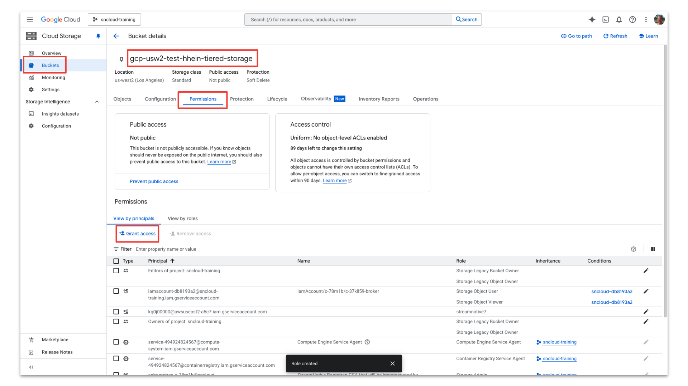
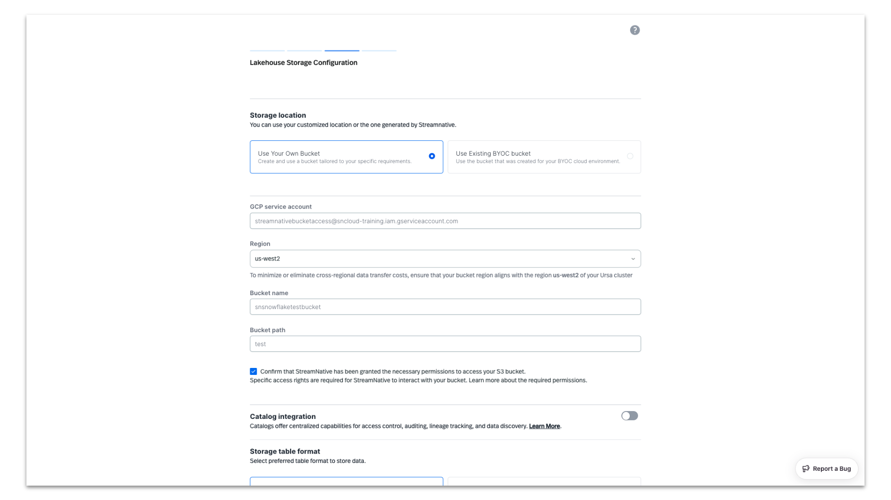

author: Dustin Nest
id: streamnative_snowflake_open_catalog_integration_gcp
summary: Use StreamNative to build a cost-effective Streaming Augmented Lakehouse, streaming Kafka messages directly to object storage in Iceberg format an connect to Snowflake Open Catalog.
categories: Getting-Started, Partner-Integrations, Devops, Architecture-Patterns, Datagovernance
environments: web
status: Published
feedback link: https://github.com/Snowflake-Labs/sfguides/issues
tags: Getting Started, Kafka, Data Streaming, Open Catalog, Iceberg

# Cost-Effective Data Streaming in Apache Iceberg&trade; Format and Snowflake Open Catalog Integration with StreamNative BYOC on GCP
<!-- ------------------------ -->
## Overview
Duration: 5

StreamNative is partnering with Snowflake to provide you with cost-effective real-time data streaming to Snowflake. This means providing you with best-in-class data ingestion methods tailored to meet your specific needs. This guide focuses on creating a **Streaming Augmented Lakehouse** using **StreamNative's Ursa Engine** with built-in support for **Apache Iceberg&trade; and Snowflake Open Catalog**. Apache Kafka&reg; messages published to the StreamNative Ursa Cluster will be stored in object storage in Iceberg format. Without copying over the data through connectors, you can directly access data from Snowflake Open Catalog and start analyzing the data. To learn more about cost savings when using the StreamNative Ursa Engine to ingest data to Snowflake, visit this [link](https://streamnative.io/blog/leaderless-architecture-and-lakehouse-native-storage-for-reducing-kafka-cost).

This guide focuses on a Bring Your Own Cloud (BYOC) StreamNative Ursa Cluster deployment on GCP. A separate Snowflake Quickstart is available for deploying the StreamNative BYOC Ursa Cluster on AWS.

StreamNative also supports ingesting data into Snowflake using **Snowpipe or Snowpipe Streaming** with **Kafka or Pulsar Connectors** that will not be discussed in this tutorial. For more information on using Connectors to ingest data into Snowflake, follow this [link](https://courses.streamnative.io/courses/streamnative-snowflake-streaming-augmented-lakehouse-and-connectors/lessons/introduction-to-uniconn-kafka-and-pulsar-io-connectors/).

### What You Will Build
- A Streaming Augmented Lakehouse powered by a Kafka-compatible StreamNative BYOC Ursa Cluster deployed on GCP integrated with Snowflake Open Catalog.

### What You Will Learn
- How to create a Snowflake Open Catalog
- How to deploy a StreamNative BYOC Ursa Cluster on GCP integrated with Snowflake Open Catalog
- How to publish Kafka messages to the StreamNative Ursa Cluster using Kafka Java Client
- How to query tables visible in Snowflake Open Catalog in Snowflake AI Data Cloud

### Prerequisites or What You Will Need
- Familiarity with Terraform and Java.
- Familiarity with GCP access controls and cloud storage.
- A StreamNative account available at [streamnative.io](https://www.streamnative.io). Your account will come with $200 in free credits, sufficient for following this tutorial. No credit card is necessary.
- GCP Account for deploying the StreamNative BYOC Ursa Cluster. BYOC clusters are deployed into your cloud provider. These resources will incur GCP charges that are not covered by StreamNative.
- Permissions to create projects, roles, and  storage buckets in GCP, as well as apply the StreamNative Terraform [vendor access module](https://docs.streamnative.io/docs/byoc-gcp-access).
- Access to [Snowflake account](https://signup.snowflake.com/) and ability to create a Snowflake Open Catalog account.
- Environment for executing Terraform modules and Java code.

Apache&reg;, Apache Iceberg&trade;, and Apache Kafka&reg; are either registered trademarks or trademarks of Apache Software Foundation in the United States and/or other countries.

## Setup Catalog and Permissions
Duration: 30

Before initiating the integration of Snowflake Open Catalog with StreamNative Cloud, please ensure the following steps are completed.

### Create a Snowflake AI Data Cloud Account

Create a Snowflake AI Data Cloud Account. The homepage will look as follows.


### Create Snowflake Open Catalog Account

To access the Snowflake Open Catalog console, a specialized Open Catalog Account must be created. This account type is specifically designed for managing Open Catalog features and functionality.

Enter **Admin → Accounts → Toggle → Create Snowflake Open Catalog Account**.


Configure the Snowflake Open Catalog Account.

* Cloud: GCP
* Region: region to place the Snowflake Open Catalog Account
* Edition: any

> aside positive
>
> IMPORTANT: The Snowflake Open Catalog Account, storage bucket, and StreamNative BYOC Ursa Cluster should be in the same region. Snowflake Open Catalog doesn’t support cross-region buckets. To avoid costs associated with cross-region traffic, we highly recommend your storage bucket and StreamNative BYOC Ursa Cluster are in the same region.


Next, input a Snowflake Open Catalog Account Name, User Name, Password, and Email. This will create a new user for use specifically with the Snowflake Open Catalog Account.


Click **Create Account**. You will see the following if account creation is successful. We highly recommend taking a screenshot of this confirmation message. This Account URL and Account Locator URL will be used in later steps.


Click the **Account URL** and sign into your Open Catalog Account with the User Name and Password you created for this account. You will enter the Snowflake Open Catalog console.


If you need the **Account URL** of your Snowflake Open Catalog Account in the future, navigate to **Admin → Accounts → … → Manage URLs** of your Snowflake Open Catalog Account. This page is available in your Snowflake AI Data Cloud Account. The Locator column, in combination with the Region, can be used to construct the Account Locator URL. The Account Locator URL will be needed when configuring the StreamNative BYOC Ursa cluster.


### Setup storage bucket with permissions for StreamNative

Next we must choose the bucket location for the backend of our StreamNative BYOC Ursa Cluster and grant access to StreamNative Cloud. You have two choices to setup a GCP storage bucket for the StreamNative Ursa Cluster backend. This is where data will be stored in Iceberg format and accessed by Snowflake Open Catalog and Snowflake AI Data Cloud.
> aside positive
>
> IMPORTANT: The Snowflake Open Catalog Account, storage bucket, and StreamNative BYOC Ursa Cluster should be in the same region. Snowflake Open Catalog doesn’t support cross-region buckets. To avoid costs associated with cross-region traffic, we highly recommend your storage bucket and StreamNative BYOC Ursa Cluster are in the same region.

**Option 1: Use your own bucket (recommended)**

If you choose this option, you need to create your own storage bucket, with the option to create a bucket path. When using your own bucket, the resulting path you will use for creation of the Snowflake Open Catalog will be as follows. The compaction folder will be created automatically by the StreamNative cluster.

```markdown
gs://<your-bucket-name>/<your-bucket-path>/compaction
```

StreamNative will require access to this storage bucket. To grant access, execute the following Terraform module.
* streamnative_org_id: StreamNative organization, directions after terraform module for finding your StreamNative organization
* project: project name in GCP where bucket is located
* cluster_projects: project name in GCP where StreamNative BYOC Ursa cluster is located
* google_service_account_name: the name of the service account that will be created in GCP, service account email needed when creating cluster
* buckets: the bucket name and path
```
module "sn_managed_cloud_access_bucket" {
  source = "github.com/streamnative/terraform-managed-cloud//modules/gcp/volume-access?ref=v3.20.0"

  streamnative_org_id = "<your-organization-id>"

  project = "<your-project-name>"

  cluster_projects = [
    "<your-pulsar-cluster-gcp-project-name>"
  ]

  google_service_account_id = "<your-google-service-account-id>"

  buckets = [
    "<your-gcs-bucket-path>",
  ]
}
```
You can find your organization name in the StreamNative console, as shown below.


The following commands are used to [authenticate using a user account](https://cloud.google.com/docs/terraform/authentication).

```markdown
gcloud init
gcloud auth application-default login
```

Run the Terraform module

```markdown
terraform init
terraform plan
terraform apply
```

**Option 2: Use StreamNative provided bucket**

This process requires you to deploy the StreamNative BYOC Cloud Connection, Cloud Environment, and beginning the process of deploying the StreamNative BYOC Ursa Cluster to obtain the cluster id before moving forward. StreamNative will automatically assign the necessary permissions to this bucket.

To proceed, you will need to first complete the steps for [granting vendor access, creating a Cloud Connection, and setting up the Cloud Environment](https://docs.streamnative.io/docs/byoc-overview). This process will grant StreamNative permissions into your cloud provider and deploy the required infrastructure before you begin the process of deploying a StreamNative BYOC Ursa Cluster. [This video](https://youtu.be/vsHjaQNKFRk?si=2pUJXE_s0LfzH3At) provides an overview of this process with detailed videos available in this [playlist](https://www.youtube.com/playlist?list=PL7-BmxsE3q4W5QnrusLyYt9_HbX4R7vEN).

Next, begin the process of deploying the StreamNative BYOC Ursa Cluster to obtain the cluster id. This process is outlined in the step **Create StreamNative BYOC Ursa Cluster** with directions on obtaining the cluster id.

When using a StreamNative-provided bucket, the resulting path you will use for creation of the Snowflake Open Catalog will be as follows. The cloud environment id will be created during the deployment of the Cloud Environment. The cluster id is assigned when starting the cluster creation process in the StreamNative Console.

```markdown
gs://<your-cloud-environment-id-tiered-storage>/<your-cluster-id>/compaction
```

### Configure GCP Account for Snowflake Open Catalog Access

Create a role for Snowflake Open Catalog bucket access.

Navigate to **IAM → Roles → Create role**.


Provide a role title and ID (e.g. streamnative_pulsar_open_catalog).


Provide the following permissions:
* storage.buckets.get
* storage.objects.creates
* storage.objects.delete
* storage.objects.get
* storage.objects.list

Click **Create**. This role will be used by Snowflake Open Catalog to access the bucket.


### Create Snowflake Open Catalog

Next we create the Snowflake Open Catalog. Click **+ Create** next to **Manage Catalogs**.


* Name: supply a catalog name (e.g. pulsar or streamnative)
* External: disabled
* Storage provider: GCS
* Default base location:

```markdown
User provided bucket:
gs://<your-bucket-name>/<your-bucket-path>/compaction

StreamNative provided bucket:
gs://<your-cloud-environment-id>/<your-cluster-id>/compaction
```
* Additional locations: not configured


Click **Create** and you will see the catalog is created.

Select the catalog and Catalog Details. Here we need to record the value of the **GCP_SERVICE_ACCOUNT**. The Snowflake Open Catalog will use this account to access our storage bucket.


In GCP, Navigate to **Cloud Storage → Buckets** and select the root of the storage bucket.

```markdown
User provided bucket:
<your-bucket-name>

StreamNative provided bucket:
<your-cloud-environment-id-tiered-storage>
```

Select **Permissions → Grant access**



* New principals: paste the **GCP_SERVICE_ACCOUNT** from the catalog
* Role: paste the name of the role created in the previous step (e.g. streamnative_pulsar_open_catalog)


Snowflake Open Catalog now has access to the GCP storage bucket.

### Provide StreamNative Access to Snowflake Open Catalog

Our StreamNative BYOC Ursa Cluster will need a connection to access the Snowflake Open Catalog. We will also reuse this connection for Snowflake AI Data Cloud to access Snowflake Open Catalog.

Click **+ Create** next to **Set Up Connections**.


* Name: streamnativeconnection
* Query Engine: not configured
* Create new principal role: enable
* Principal Role Name: streamnativeprincipal


Then click **Create**, and you will see a pane. Record the Client ID and Client Secret for this connection as **CLIENT ID:SECRET**. The StreamNative BYOC Ursa Cluster needs it to access the Snowflake Open Catalog.


We now have a Service Connection called **streamnativeconnection** linked to the Principal Role **streamnativeprincipal**.

Next we create a Snowflake Catalog Role and link this to the Principal Role.

Enter **Catalogs → Select streamnative Catalog → Roles → + Catalog Role**.

* Name: streamnativeopencatalog
* Privileges:
```markdown
NAMESPACE_CREATE
NAMESPACE_LIST
TABLE_CREATE
TABLE_LIST
TABLE_READ_DATA
TABLE_WRITE_DATA
TABLE_READ_PROPERTIES
TABLE_WRITE_PROPERTIES
NAMESPACE_READ_PROPERTIES
NAMESPACE_WRITE_PROPERTIES
```
Click **Create**.


Then click **Grant to Principal Role**.


* Catalog role to grant: streamnative_open_catalog_role
* Principal role to receive grant: streamnativeprincipal

Then click **Grant**.


The catalog role **streamnative_open_catalog_role** now has the 10 required permissions on catalog streamnative. The catalog role **streamnative_open_catalog_role** is now linked to principal **streamnativeprincipal**.

We will resuse the connection when connecting Snowflake AI Data Cloud to Snowflake Open Catalog.

<!-- ------------------------ -->
## Create StreamNative Cluster
Duration: 90

To proceed, you will need to first complete the steps for [granting vendor access, creating a Cloud Connection, and setting up the Cloud Environment](https://docs.streamnative.io/docs/byoc-overview). This process will grant StreamNative permissions into your cloud provider and deploy the required infrastructure before you begin the process of deploying a StreamNative BYOC Ursa Cluster. [This video](https://youtu.be/vsHjaQNKFRk?si=2pUJXE_s0LfzH3At) provides an overview of this process with detailed videos available in this [playlist](https://www.youtube.com/playlist?list=PL7-BmxsE3q4W5QnrusLyYt9_HbX4R7vEN).

### Create a StreamNative BYOC Ursa Cluster in StreamNative Cloud Console

In this section we create and set up a cluster in StreamNative Cloud. Login to StreamNative Cloud at [streamnative.io](https://streamnative.io) and click on **Create an instance and deploy cluster** or **+ New** in the **Select an instance** pane.


Click on **Deploy BYOC**.


Enter **Instance Name**, select your **Cloud Connection** (your Cloud Connection will be to GCP), select **URSA Engine** and click on **Cluster Location**.


Enter **Cluster Name**, select your **Cloud Environment** (you will have a GCP Cloud Environment), select **Multi AZ** and click on **Lakehouse Storage Configuration**.


To configure **Storage Location** there are two options as previously discussed.

Option 1: Select **Use Your Own Bucket** (recommended) to choose your own storage bucket by entering the following details.

* GCP service account:, use the complete email address which can be found in GCP IAM (service account was created with terraform module)
* Region
* Bucket name
* Bucket path
* Confirm that StreamNative has been granted the necessary permissions to access your GCP storage bucket. The required permissions were granted by running a Terraform module.



Option 2: Select **Use Existing BYOC Bucket** to choose the bucket created by StreamNative. The SN Bucket Location will refer to a GCP storage bucket when using a GCP Cloud Environment. This could be a user provided or StreamNative provided storage bucket.


If using the Streamnative provided bucket, the UI will present you with the SN Bucket Location in this format to be used when creating the Snowflake Open Catalog.

```markdown
gs://<your-cloud-environment-id-tiered-storage>/<your-cluster-id>/compaction
e.g.
gs://gcp-usw2-test-hhein-tiered-storage>/o-78m1b-c-9ahma2v-ursa/compaction
```
> aside positive
>
> IMPORTANT : If you are using the StreamNative provided bucket, do not close the browser while creating the catalog. This will cause StreamNative to create a new cluster id. Once a catalog is created in Snowflake Open Catalog, the base location and additional locations cannot be changed. If the cluster id changes, you would need to create a new catalog.

To integrate with Snowflake Open Catalog, Enable Catalog Integration and select Snowflake Open Catalog.

* **Warehouse:** catalog created in Snowflake Open Catalog (e.g. pulsar or streamnative)
* **URI:** Account Locator URL when creating Snowflake Open Catalog. Append ***'/polaris/api/catalog'*** to the URI. The StreamNative UI requires you use the Account Locator URL instead of the Account URL. The Account Locator URL will be in the following format.
```markdown
https://<your-account-locator>.<catalog-region>.snowflakecomputing.com/polaris/api/catalog
```
* **Select Authenticatiton Type/OAuth2:** create a new secret in StreamNative using Snowflake Open Catalog Service Connection "CLIENT ID:SECRET"


Clicking **Cluster Size** will test the connection to the storage bucket and the Snowflake Open Catalog.


Click **Continue** to begin sizing your cluster.

For this example, we deploy using the smallest cluster size. Click **Finish** to start deploying the StreamNative BYOC Ursa Cluster into your Cloud Environment.


When cluster deployment is complete, it will appear on the Organization Dashboard with a green circle.


The Lakehouse Storage configuration can be viewed by clicking on the Instance on the Organization Dashboard and selecting Configuration in the left pane. The Table Format will be Iceberg with the warehouse and URI of Snowflake Open Catalog listed. The Bucket Location will refer to the GCP bucket path without the compaction folder.


### Produce Kafka Messages to Topic with AVRO Schema

We will use the Kafka Java Client to produce Kafka messages with an AVRO schema to a topic.

To obtain Kafka Java Client code for publishing messages to the server, navigate to **Kafka Clients** page in StreamNative UI. After selecting **Java**, click **Next**.


Under Select service account, open the dropdown and select **+ Create Service Account** and follow the prompts to create a new service account.


Under Select authentication type, select **API Key** and click **+ Create API Key**.


Provide a name for the API Key. Be sure to select the Instance of our newly-created StreamNative BYOC Instance. API Keys are associated with a specific Instance.


Copy the API Key in case you need it for later use. It will be automatically populated in the producer code we obtain from the UI.


Select the **default** endpoint of our cluster and click **Next**. Most likely you will only have the default endpoint.


**Enable** schema registry and click **Next**.


Copy the dependencies for your Maven project for use in the pom.xml and click **Next**.


Select the **public** tenant and **default** namespace. Select the topic dropdown and click **+ Create topic** to create a new topic.


Provide a topic name and click **New Topic**.


The producer code is configured to use an AVRO schema, prepopulated with the API key, tenant name, namespace, topic name, and cluster endpoints for the both producing messages and registering the schema. Copy the producer code for use in your Java IDE.


In this example we created a new project in IntelliJ. We have pasted in the dependencies and repositories into the pom.xml and reloaded the project to download the dependencies.


We created a new class called SNCloudTokenProducer and pasted in the Kafka Java Client code from the StreamNative UI.
After executing the Kafka Java Client code, the terminal prints the following:

```
Send hello to kafkaschematopic4-0@0
```


### Review GCP storage bucket

Navigate to the user provided or StreamNative provided GCP storage bucket. In this example the StreamNative provided bucket is gs://gcp-usw2-test-hhein-tiered-storage/o-78m1b-c-37kll59-ursa. A storage folder and compaction folder have been created by the cluster.


We published messages to topic kafkatopic1 in the the public/default tenant/namespace. We see folders for the public tenant, default namespace, and kafkatopic1 topic inside the compaction folder. Inside each topic folder, we find partition and metadata folders.

### Verify Tables and Schema are Visible in Snowflake Open Catalog

Once the compaction folder has been created in the storage bucket, we can verify the tables and schemas are visible in Snowflake Open Catalog. We can see the resulting tables created in streamnative/public/default with a registered schema.


The data is now queryable through Snowflake Open Catalog. In the following step we will configure Snowflake AI Data Cloud to query tables from Snowflake Open Catalog.

## Query Tables with Snowflake
Duration: 30

Querying a table in Snowflake Open Catalog using Snowflake AI Data Cloud requires completing the following [from the Snowflake documentation](https://docs.snowflake.com/en/user-guide/tables-iceberg-open-catalog-query).

### Create an external volume in Snowflake

Please refer to the [Snowflake documentation here](https://docs.snowflake.com/en/user-guide/tables-iceberg-configure-external-volume-s3) for the latest code samples for creating an external volume.

The following is an example query to create the external volume.

```sql
CREATE EXTERNAL VOLUME streamnative_gcp_external_volume
   STORAGE_LOCATIONS =
      (
         (
            NAME = 'my_streamnative_gcp_external_volume'
            STORAGE_PROVIDER = 'GCS'
            STORAGE_BASE_URL = 'gcs://<base bucket>/test/compaction'
         )
      );
```

The following query was used to describe the external volume to obtain the IAM role arn used by Snowflake AI Data Cloud to query the s3 bucket.

```sql
DESC EXTERNAL VOLUME streamnative_gcp_external_volume;
```

The following query was used to verify Snowflake AI Data Cloud has access to the storage bucket.

```sql
SELECT SYSTEM$VERIFY_EXTERNAL_VOLUME('streamnative_gcp_external_volume');
```

### Create a catalog integration for Open Catalog

Please refer to the [Snowflake documentation here](https://docs.snowflake.com/en/user-guide/tables-iceberg-open-catalog-query) for the latest code samples.

The following query is used to create a catalog integration for a warehouse called streamnative where the topic is in public.default.

```sql
CREATE OR REPLACE CATALOG INTEGRATION oc_int
  CATALOG_SOURCE = POLARIS
  TABLE_FORMAT = ICEBERG
  CATALOG_NAMESPACE= 'public.default'
  REST_CONFIG = (
    CATALOG_URI = 'https://a9727308406271-trainingopencatalog.snowflakecomputing.com/polaris/api/catalog'
    WAREHOUSE = 'streamnative'
  )
  REST_AUTHENTICATION = (
    TYPE = OAUTH
    OAUTH_CLIENT_ID = '<client id>'
    OAUTH_CLIENT_SECRET = '<client secret>'
    OAUTH_ALLOWED_SCOPES = ( 'PRINCIPAL_ROLE:ALL' )
  )
 ENABLED = TRUE;
```

You will need to create a new catalog integration for each tenant.namespace.

### Create an externally managed table

Please refer to the [Snowflake documentation here](https://docs.streamnative.io/docs/integrate-with-snowflake-open-catalog) for the latest code samples.

The following query was used to create an externally managed table.

When running this command, the Snowflake AI Data Cloud catalog and schema TRAINING.PUBLIC were selected. CATALOG_TABLE_NAME refers to the topic name in Snowflake Open Catalog. CREATE ICEBERG TABLE refers to the name of the table in TRAINING.PUBLIC.

```sql
CREATE ICEBERG TABLE kafkaschematopic
CATALOG = 'oc_int'
EXTERNAL_VOLUME = 'streamnative_gcp_external_volume'
CATALOG_TABLE_NAME = 'kafkaschematopic'
AUTO_REFRESH = TRUE;
```
You will need to create a new externally managed table for each topic.

Once completing these steps, you will be able to query the Iceberg Table registered in Snowflake Open Catalog through Snowflake AI Data Cloud.

The following are example queries for viewing the data in Snowflake AI Data Cloud.

```sql
select * FROM TRAINING.PUBLIC.kafkaschematopic LIMIT 10

select COUNT(*) FROM TRAINING.PUBLIC.kafkaschematopic
```

<!-- ------------------------ -->
## Conclusion and Resources
Duration: 5

Congratulations on creating a Streaming Augmented Lakehouse powered by StreamNative's Ursa Engine with built-in support for Iceberg and Snowflake Open Catalog. [Contact StreamNative](https://streamnative.io/contact) to learn more.

### What You Learned
- How to create a Snowflake Open Catalog
- How to deploy a StreamNative BYOC Ursa Cluster on GCP integrated with Snowflake Open Catalog
- How to publish Kafka messages to the StreamNative Ursa Cluster using Kafka Java Client
- How to query tables visible in Snowflake Open Catalog in Snowflake AI Data Cloud

### Resources
- [Streamnative Snowflake Open Catalog Documentation](https://docs.streamnative.io/docs/integrate-with-snowflake-open-catalog)
- [StreamNative Developer Portal](https://streamnative.io/dev-portal)
- [StreamNative Academy YouTube Channel](https://www.youtube.com/@streamnativeacademy8484)
- [StreamNative Academy Courses](https://courses.streamnative.io/)