author: Kate Guttridge, StreamSets
id: streamsets_tx4snowflake_hol
summary: Hands on Lab for Transformer for Snowflake
categories: Getting Started
environments: web
status: Hidden 
feedback link: https://github.com/Snowflake-Labs/sfguides/issues
tags: Getting Started, Data Science, Data Engineering, StreamSets

# Transformer for Snowflake Hands on Lab
<!-- ------------------------ -->
## Overview 
Duration: 3

StreamSets Transformer for Snowflake is a hosted service embedded within the StreamSets DataOps Platform that uses the Snowpark Client Libraries to generate SnowSQL queries that are executed in Snowflake. 

  - When you build pipelines in the StreamSets canvas, StreamSets builds a DAG when that pipeline is executed.
  - StreamSets then uses the DAG and the Snowpark Client Libraries to generate SnowSQL
  - That SnowSQL is sent to Snowflake to be executed in the Warehouse of your choice. 


Transformer for Snowflake accelerates the development of data pipelines by providing features that go beyond a drag and drop interface to construct the equivalent of basic SQL. Snowpark enables StreamSets to construct the SnowSQL queries at the pipeline runtime, allowing pipeline definitions to be more flexible than SnowSQL queries written by hand. StreamSets also provides processors that combine the logic for common use cases into a single element on your canvas. 

This lab will explore how to get started using Transformer for Snowflake and some of the features that will accelerate pipeline development. [Read more about pipelines in Transformer for Snowflake.](https://docs.streamsets.com/portal/platform-txsnowflake/latest/tx-snowflake/GettingStarted/WhatIsSnowflake.html#concept_t2x_nsn_4rb)

### **Prerequisites**
- A trial [Snowflake](https://trial.snowflake.com/?owner=SPN-PID-26749) account with `ACCOUNTADMIN` privileges. 
    - It is strongly recommended to create a new trial account for this lab, using an email address that is not tied to an existing a StreamSets organization.

<!-- could add downloadable SQL script here  
- PLACEHOLDER FOR A SQL SCRIPT [here](https://github.com/streamsets/Pipeline-Examples/blob/main/SCD_Snowpark/SCD_Snowpark.sql)
-->


### **What You’ll Learn** 
In this guide, you will learn how to build pipelines using Transformer for Snowflake that are executed directly in your Snowflake Data Cloud, including:
- How to use Partner Connect to create a StreamSets Organization
- How to create pipelines that dynamically generate your SQL queries at pipeline runtime.
- How to use Fragments to share logic across multiple pipelines.
- How to create and run Jobs to control pipeline execution. 
- How to use the Slowly Changing Dimension processor

### **What You’ll Build**

- One pipeline that renames columns, joins data, performs calculations, and reshapes the data to populate multiple tables with raw data, summary data, and pivoted data.
- A pipeline to process a Slowly Changing Dimension. <!-- You can import the final product to compare against [placeholder for pipeline export(s)](https://github.com/streamsets/Pipeline-Examples/blob/main/SCD_Snowpark/Snowpark_Snowflake_Transformer.zip). !>>

<!-- ------------------------ -->

## **Getting Started with Snowflake**
Duration: 5

### **Create Snowflake Trial Account and Verify Sample Data**
1. Create a Snowflake trial Account using this [link](https://trial.snowflake.com/?owner=SPN-PID-26749). 
    - Fill out the form and click **Continue**.  
    - Choose a Snowflake edition, cloud provider, and region for that provider. For the purposes of this lab, any of the providers or editions are fine to select. 
    - After checking the box to agree to the terms, click **Get Started**.
    - Check your email inbox for a message from Snowflake that contains the link to **Activate** your trial. Click that link.
    - Specify your username and password, and be sure to save these somewhere secure.

2. You can find a detailed walkthrough of the Snowflake UI [here](https://docs.snowflake.com/en/user-guide/ui-snowsight-gs.html#getting-started-with-snowsight). This lab will use the Snowsight UI (new Snowflake UI) exclusively and all instructions for the following steps in Snowflake are for that UI. You can use the Classic UI, but the Snowflake resources will be located in different places. 

3. This lab will leverage the ``SNOWFLAKE_SAMPLE_DATABASE`` that is accessible by default as a part of your Snowflake trial. 
    - Select the **Worksheet** tab on the lefthand menu, and then click the blue ``+Worksheet`` button in the top right of the screen.

      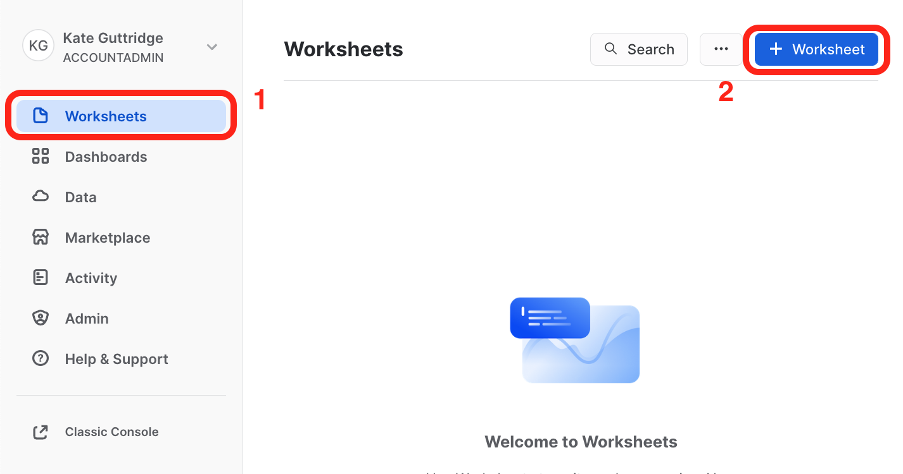 

    - With the new worksheet open:
        - Click on the **Databases** tab on the lefthand menu.
        - You should see the **SNOWFLAKE_SAMPLE_DATA** database in the list of objects.
        
          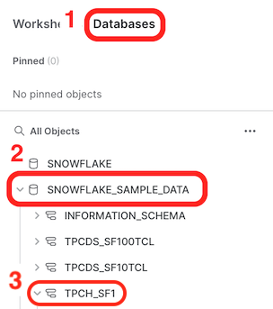


### If **SNOWFLAKE_SAMPLE_DATA** is not present: 

  - You may have removed it from your account.  Run the following command in your worksheet to restore it:
  
    ```sql
    create or replace database snowflake_sample_data from share sfc_samples.sample_data;
    ```

  - You should now see the database as one of the objects. Click on  **SNOWFLAKE_SAMPLE_DATABASE** to reveal the schemas it contains, including ``TPCH_SF1``, which will be used in this lab. You can click on **TPCH_SF1** and then **Tables** to see the included tables.  

  - In your worksheet, run the following query:
    
    ```sql
      CREATE  WAREHOUSE  IF NOT EXISTS TRIAL_WH; 
      USE WAREHOUSE TRIAL_WH;

      select *
      from snowflake_sample_data.tpch_sf1.orders
      limit 100;
    ```
    
    Snowflake requires a warehouse to execute most queries, so we need to create a warehouse, which will be size ``XSMALL`` by default. You can find out more about Snowflake warehouses in their [documentation](https://docs.snowflake.com/en/user-guide/warehouses-overview.html).

  - If the query returns results, you are ready to proceed! If not, check your query syntax to confirm it is correct.  

  - Now it's time to set up your StreamSets account!

## **Use Partner Connect to Create a StreamSets Organization**
Duration: 5

We’ll use [Snowflake Partner Connect](https://docs.snowflake.com/en/user-guide/ecosystem-partner-connect.html) to set up a StreamSets organization that will have your [Snowflake Credentials](https://docs.streamsets.com/portal/platform-txsnowflake/latest/tx-snowflake/GettingStarted/MyAccount.html#concept_d2k_yld_gsb) auto-populated in addition to your [Snowflake Pipeline Default Settings](https://docs.streamsets.com/portal/platform-txsnowflake/latest/tx-snowflake/GettingStarted/MyAccount.html#concept_ofy_mld_gsb) so you can start building pipelines right away.

Note: All steps assume you are using the SnowSight UI.

1. After logging into your Snowflake Trial instance, confirm that your active role is **ACCOUNTADMIN** in the top left corner of the UI. If it is not:
   - select the drop down next to your user name
   - click on **Switch Role**
   - select **ACCOUNTADMIN**

  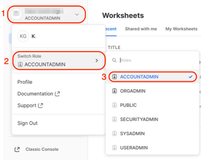

2. On the left menu, expand the Admin section and select Partner Connect.

  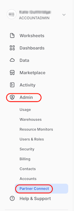

3. Enter ``StreamSets`` in the search bar and click on the StreamSets tile.
  
  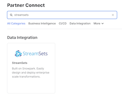

4. After selecting the StreamSets tile, this window will appear.  It contains information about the Database, Warehouse, User, Password and Role that will be created in Snowflake. Select **Connect**.

  

5. A message will appear to indicate that the StreamSets account has been created. Select **Activate**.

  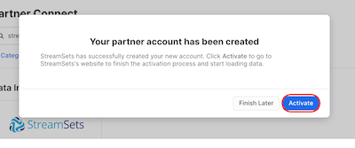

6. Now you will be taken to StreamSets to finish setting up your StreamSets Organization. You can create a password or use Single Sign On through Google or Microsoft.

  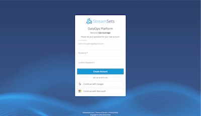

7. Finish creating your StreamSets organization by choosing the region that is closest to you and updating the name, if you prefer. The default name uses the same prefix as your Snowflake Trial instance. Check the boxes to agree to the Terms of Service and acknowledge the Privacy Policy and hit the button to **Agree & Continue**.

  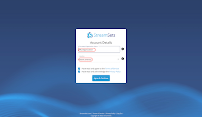

8. If the updated privacy policy message appears, go ahead and dismiss it.

9. Now the diaglog should appear asking about ingesting data into Snowflake. We do not need to do that becasue we are going to use data already loaded in the Snowflake Sample Database. Select **Create Transformer for Snowflake Pipeline** to be taken to the Pipeline Design Canvas.

  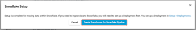

**Congratulations!** You now have your very own StreamSets Organization!

---
If you were not able to finish setting up your organization and had to navigate away, you can either:
  - Go back and select StreamSets' partner connect tile in Snowflake, and then select **Launch**.
  - Use the link that was sent to the email address for your Snowflake account. Be sure to check your Spam folder if you don’t see it.
---

<!-- 
## **Placeholder for Walkthrough of the DataOps Platform**

Duration: 5

Before we get started with building a pipeline, let's take a quick detour for an overview of the DataOps Platform interface. 

-->

## **Create and Run a Simple Transformer for Snowflake Pipeline**
Duration: 8

### **Pipeline Goals** - Move to section 1
  - create a table that combines orders with their line item information
  - create an order summary that combines all sales information from the line items for each order
  - create a table that combines order information with the summary sales data


### **Explain the pipeline to be built**

`` TO DO``

### **Start Building**

1. Using the tabs on the left, select **Build > Pipelines**. If there is already a **My First Pipeline** in the pipeline list, click on it and go ahead to the next step. 

    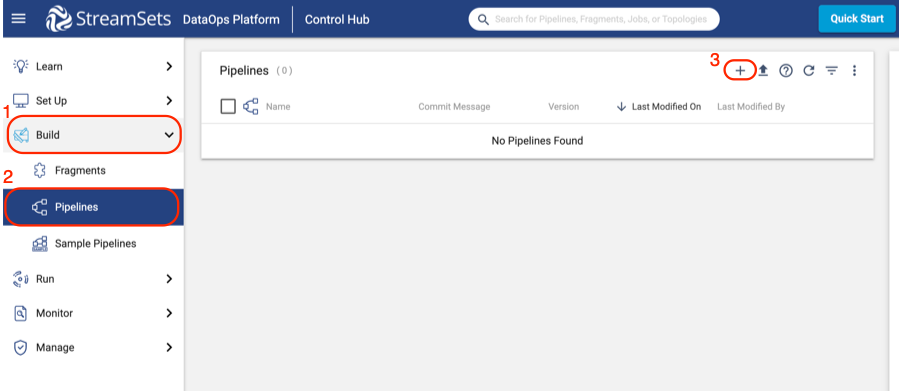

  - If there is no pipeline listed:
    
    - Click the plus (**+**) symbol to create a new pipeline.
    - On the pop-up that appears, select **Use Transformer for Snowflake**. If you were creating a pipeline that used one of our other engines, you would need to Create a Deployment to set up those engines, but since we are using Serverless Transformer for Snowflake, that is unnecessary.
    
      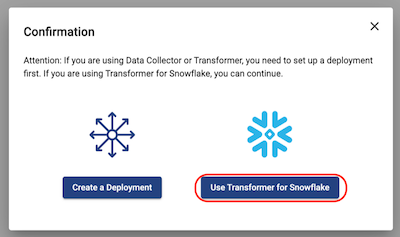

    - A new window will appear to create your pipeline. 
        
        - Give your pipeline a name and (optionally) add a description.
        - The Engine Type: Transformer for Snowflake is pre-selected for you. 
        - Select *Next*.

          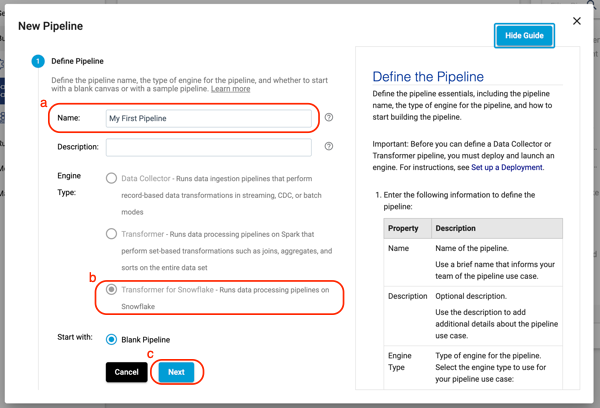
    
    - If you wanted to share your pipeline with other users or groups in your Organization, this is where you would do that. For now, select **Save & Open in Canvas**.

      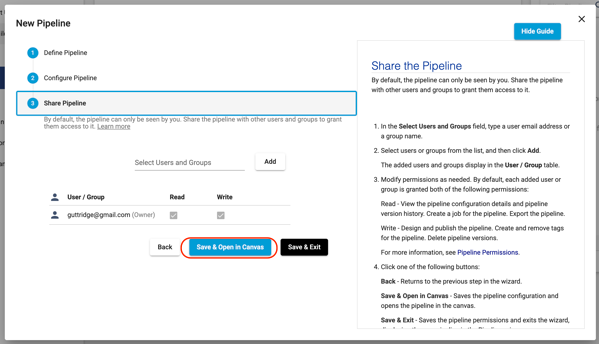

2. Now you will see the empty design canvas shown below. Key items on the canvas are explained in more detail below. Additional details about the pipeline canvas can be found [here](https://docs.streamsets.com/portal/platform-controlhub/controlhub/UserGuide/Pipelines/PipelineCanvas.html#concept_zj5_nj4_mpb) in the StreamSets documentation.

    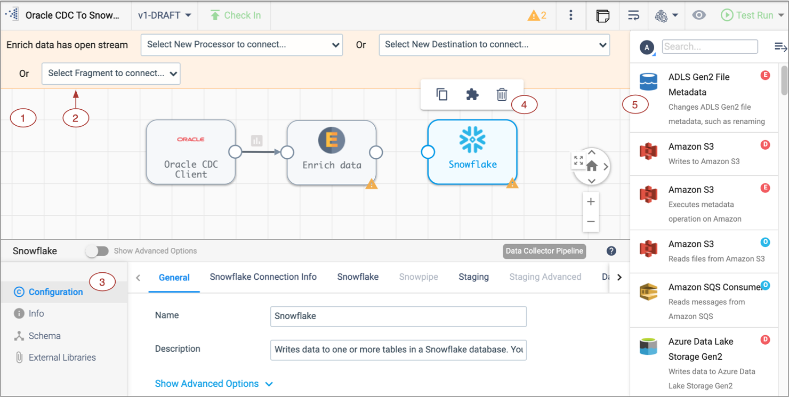
   
    - 1 - **Pipeline Canvas**: Displays the pipeline and used to configure the pipeline data flow.
    - 2 -  **Pipeline Creation Help Bar**- Offers lists of stages to help complete the pipeline and can be used to connect a stage to an open node. You can also add a stage between linked stages by clicking the link between the two.
    - 3 - **Properties Panel**: Displays the properties of the pipeline or selected stage when you configure a pipeline. Click on empty canvas   space to see the properties of the entire pipeline.
    - 4 - **Selected stage pop-up menu** - Displays the icons for commands that you can apply to the selected stages. 
    - 5 - **Stage library panel** - Used to add stages to the pipeline. You can drag a stage to a location on the canvas or click a stage to add it to the end of the pipeline.
   
3. Click on any blank space in the canvas to view the pipeline properties on the window below.
  
  - On the **General** tab, there are 5 properties that are directly related to Snowflake. These include the **Snowflake Account URL, Warehouse, Database, Schema**, and **Role**. When your pipeline is executed, these properties are sent to Snowflake to determine the resources the pipeline uses to execute. If you are using the default values as shown below: you can see that each of these is pre-populated with a StreamSets pipeline parameter. Those are written with the ``${parameter_name}`` syntax.  

    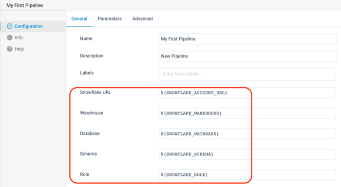

  - Now select the **Parameters** tab. This is where you can see the values that each of these parameters are given. By default, the Database, Warehouse, and Role that your pipelines point to are the ones generated by the Partner Connect Integration. By default, the pipeline also points to the default `PUBLIC` schema.  

    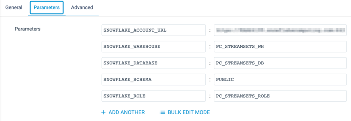

### **Create a Source**

This pipeline will use data prepopulated in the ``SNOWFLAKE_SAMPLE_DATA`` database, located in schema ``TPCH_SF1``. It will use data from the ``ORDERS`` and ``LINEITEM`` tables.

  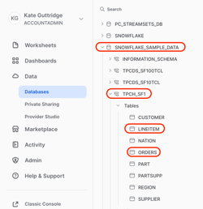

1. Using the **Pipeline Creation Help Bar**, let’s add a **Snowflake Table Origin** to the canvas. Next to Origin Missing, select Snowflake Table from the dropdown menu.  

  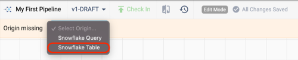

2. Click on the new Origin if it is not already selected, and let’s give it a meaningful name. Since this Origin will read the data from the ``ORDERS`` table, let’s name it ``Orders``.

  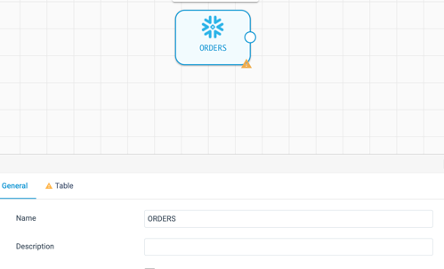

3. On the **Table** tab of the properties, we will tell the pipeline where this table is located. Since the data we are reading is in a Read-Only database, that database cannot be the pipeline’s default. In this case we need to override the database and schema, and we start by selecting the Specify Database option, which makes the options for the Database and Schema appear. Use the following values to configure this origin, see the finished configuration in the image below:

    - **Database**: ``SNOWFLAKE_SAMPLE_DATA``
    - **Schema**: ``TPCH_SF1``
    - **Table**: ``ORDERS``

  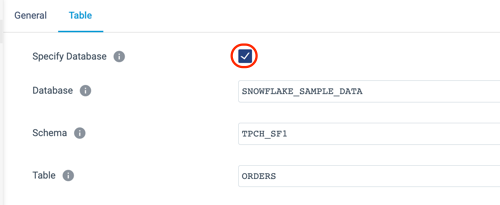
  
  - The origin is created and configured, but note that there are some additional options further down on the **Table** tab. There is an option to limit the number of columns read from the table, add a where clause to filter down to a subset of the data read from the table, and the unique StreamSets feature to add a Preview clause.  We’ll talk more about this later.
  - Now the canvas has one origin, which is showing the validation error **VALIDATION 0011 Stage has open output streams**, indicated by the yellow triangle.
      
  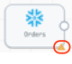
    
  4. Transformer for Snowflake pipelines need to have a final destination, so as a temporary fix, add a **Trash** Destination. 
      - What is a [Trash](https://docs.streamsets.com/portal/platform-txsnowflake/latest/tx-snowflake/OriginsDestinations/Trash.html#concept_ddd_dl1_yrb) destination? It is  a placeholder destination so you can [preview pipeline processing](https://docs.streamsets.com/portal/platform-txsnowflake/latest/tx-snowflake/Preview/DataPreview.html#concept_slb_bjb_dsb) as you develop the pipeline. No tables will be permanently written to Snowflake when this pipeline is executed or previewed.      
      - As when adding an origin, there are multiple ways to do this, but this time we are going to use the **Stage Library Panel**. 
      - If the library panel is not already expanded, click on the hamburger icon 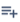 in the upper right corner of the canvas.
      - Enter ``Trash`` in the search bar, and click on the stage.
      - Now a Trash destination stage should appear on the canvas. 

6. The canvas might be a little messy now, with stages not placed very logically, so let’s Auto-Arrange it to clean it up. Above the canvas, on the right side is the **Auto-Arrange** icon. Click on it to rearrange the processors as shown below.
  
  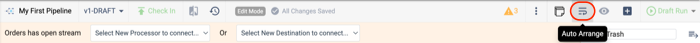

  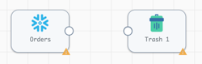

6. Now we need to connect the source and destination to complete this first iteration of the pipeline. Select the **Orders** Origin and click on the output node icon. Draw a line to the input node icon on the Trash stage as shown below.
  
  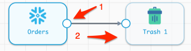

### **Preview the Pipeline**

Now preview the pipeline results for the first time. Data Preview shows the input and output of each orgin, processor, and destination. Find out more about Preview in the [documentation](https://docs.streamsets.com/portal/platform-txsnowflake/latest/tx-snowflake/Preview/DataPreview.html?hl=preview). 

1. In order to preview the pipeline results, select the Preview icon (eye) located above the canvas on the right.

  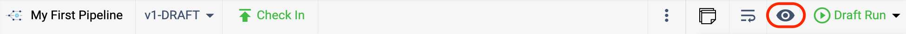

2. A pop-up will now appear to configure previews. More details about preview configuration settings can be found [here](https://docs.streamsets.com/portal/platform-txsnowflake/latest/tx-snowflake/Preview/DataPreview.html#task_szc_z5l_nsb), but the important things to note are: 
    - **Preview Batch Size**- the number of records it will show coming out of each stage
    - **Write to Destinations**- if a Snowflake table was the destination, selecting this option means that the pipeline would actually write the previewd data to the target table(s). Usually this will be left de-selected as it is by default.
  
  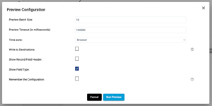

3. Click **Run Preview**.

4. TO DO? Explanation about what is happening with Tx 4 Snowflake?

5. In the properties window, there may be updates about the status of the pipeline preview like below. This is expected as the pipeline is converted to SQL and the queries are executed in Snowflake.

  

6. When the preview is ready, a screen appears that looks similar to this: 

  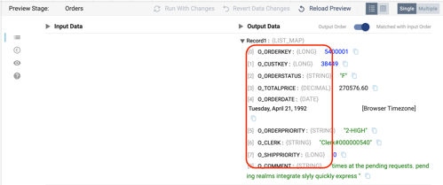

  - By default, the Orders origin stage is selected, and the properties window on the bottom shows 10 records from the ORDERS table, including the column name, data type, and value for every column in the record. 

  - To make it easier to read, switch the records to a table view by selecting the table icon above the records 

  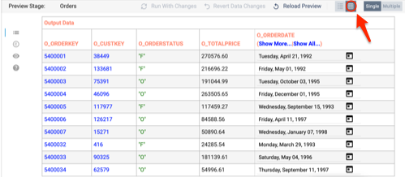

7. To close the preview and return back to the design mode, select **Close Preview** in the top right of the canvas. 
  
  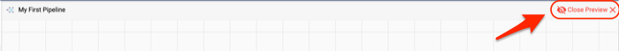


Now let's start transforming the data. The immediate goal is create a table in Snowflake that joins the Order and Line Item data.

### **Begin Data Transformation by Renaming Columns**
1. The first step is to rename the columns readfrom the ``ORDERS`` table.

2. The data preview showed that the Order column names all begin with O_. Let's clean the names up by removing that prefix.

3. Make sure the preview is closed, and click on the arrow connecting the **Orders** origin and **Trash** destination. 

    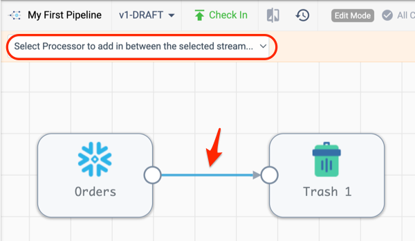

  - The **Pipeline Creation Help Bar** should appear after selecting the line connecting the two stages.
    - On the dropdown menu, choose the Field Renamer processor.
    - If the Pipeline Creation Help Bar does not appear:
      - use the **Stage Library Panel** on the right, search for ``Field Renamer``, and click on it. This should add a **Field Renamer** processor to the canvas. 
      - delete the connection between **Orders** and **Trash**
      - connect **Orders** to the **Field Renamer**
      - connect **Field Renamer** to **Trash**
  - Now the pipeline should look like this:
  
    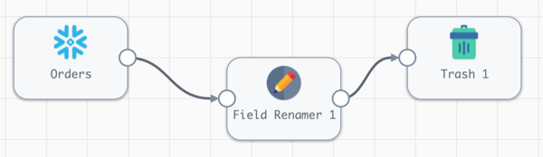

4. If the canvas becomes too disorganized at any time, use the auto-arrange button as done before or drag the processors to reposition them. Note: the more objects and connections on the canvas, it makes more sense to arrange by hand.  

5. Open the **Field Renamer** processor by clicking on it. It’s properties should appear below the canvas:

  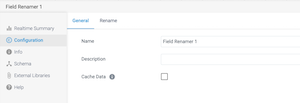

  - Name the stage ``Remove Column Name Prefixes`` on the General tab.
  - Select the **Rename** tab.
    - Select the **Rename Type** drop down menu. 
    - There are multiple options here, and since we know that we want to remove the ``O_`` prefix from all fields, select ``Remove prefix from all fields``. 
    - Leave the **Case Insensitive** setting selected, so we can remove both upper and lower cased column names, and enter _“O\_”_ for Remove String. 

  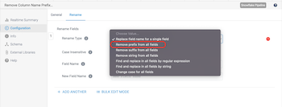
 
  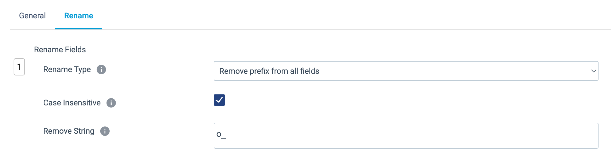

### **Write to a Snowflake Table**

Now replace the Trash stage with a real destination in Snowflake.

1. Click on the Trash stage and delete it using the trash can icon on the pop up menu.

  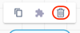

2. Select the **Field Renamer [Remove Column Name Prefixes]** processor, and the **Pipeline Creation Help Bar** should appear. Choose the ``Select New Destination to connect…`` menu and choose ``Snowflake Table``.

  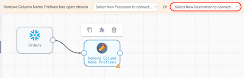

3. With the new Snowflake Table destination selected update the following settings:
    - **General** tab > **Name**: ``Order Line Items ``
    - **Table** tab > 
      - **Table**:  ``ORDER_LINE_ITEMS``
      - **Write Mode**: ``Overwrite Table``
      - **Overwrite Mode***: ``Drop Table``
      - **Create Table**: **✓**
    
      ***Note**:Table destinations have 4 different write modes which are explained [here](https://docs.streamsets.com/portal/platform-txsnowflake/latest/tx-snowflake/OriginsDestinations/SnowflakeTable-D.html#concept_wdr_fzy_prb).

4. Preview the pipeline again by clicking on the preview icon above the canvas. When the Preview Configuration Window appears, change the **Preview Batch Size** to **1**.

5. When the preview finishes processing, select the **Field Renamer [Remove Column Name Prefixes]** to see the results. All of the _“O\_”_ prefixes were removed from the column names.       

  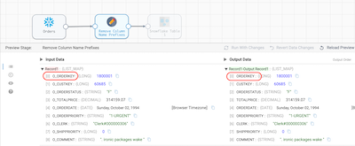 

6. Select the **Table Destination [Order Line Items]** stage to see the new column names  passed to the destination.

7. Close the preview.

### **Run the Pipeline**
1. Now that the pipeline’s behavior was verified using preview, let’s run the pipeline on the entire data set.
2. In the toolbar above the canvas, there is a **Draft Run** button on the far right. Choose **Start Pipeline** from the drop down that appears when clicking on it.

    - In StreamSets, a [Draft Run](https://docs.streamsets.com/portal/platform-txsnowflake/latest/tx-snowflake/ControlHub/Title.html#concept_snq_pkg_4tb) allows you to execute a pipeline that is still in development and not yet published. Running a _published_ version of a pipeline is considered a StreamSets [Job](https://docs.streamsets.com/portal/platform-txsnowflake/latest/tx-snowflake/ControlHub/Title.html#concept_qv1_5sn_hsb). Jobs can be scheduled, run with different parameter values, and made into templates. See the [documentation](https://docs.streamsets.com/portal/platform-txsnowflake/latest/tx-snowflake/ControlHub/Title.html#concept_qv1_5sn_hsb) for more details.

  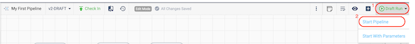

3. When the run completes, the job status in the properties panel will change to ``INACTIVE``, and the **Realtime Summary** tab will display the total number of records read and written. Click on the **Draft Run History** tab to view more details.

  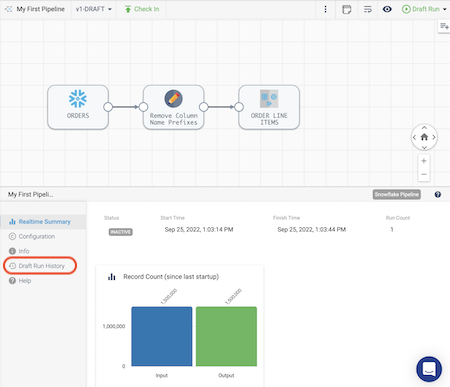

4. On the **Draft Run History** tab, you can see the history of draft runs for the pipeline. On the most recent run, click on **View Summary**.

  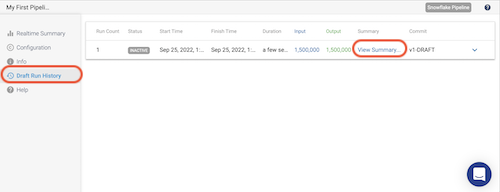

5. In the pop-up window that appears, the Job Metrics Summary appears at the top, and **Scroll Down** to view the Snowflake Queries that are generated to populate the target table(s) as well as some logging.

  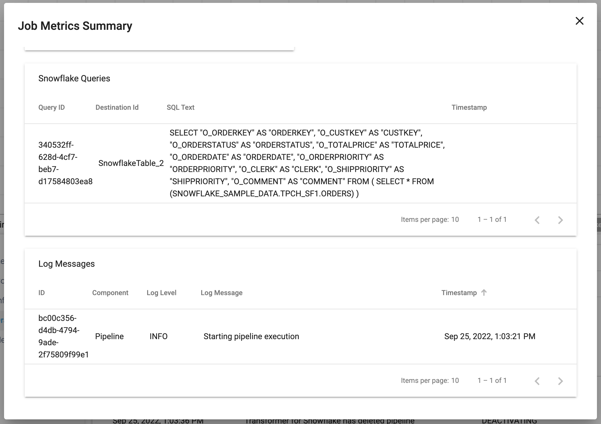

6. Now let's take a look at what is happening in Snowflake. Go back to your Snowflake Trial account, and under the **Activity** menu on the left, select **Query History**. By default, there will be a filter on your user. Since a new user was created for the Partner Connect integration, you will need to remove the User filter from the top right of the **Query History** window.  

    Now Look for the ``CREATE OR REPLACE TABLE`` statement in the query history, and you can click on the SQL text to see the query Snowpark generated to create this table in Snowflake. Since we chose the ``Overwrite Mode`` of ``Drop Table``, that is why a ``CREATE OR REPLACE TABLE`` statement is used. If we had selected the ``Truncate`` option, we would see a ``TRUNCATE`` statement followed by an ``INSERT`` statement that leverages the same query.

  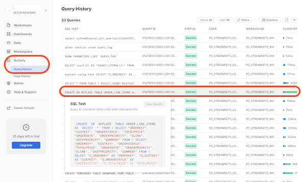

7. Lastly, go to the **Worksheets** tab in Snowflake. Click on the **plus** (**+**) icon to create a new worksheet. Use the SQL below to run a couple queries on the table that was just created to see the number of rows in the new table as well as a sample of ten rows. Notice that the new table has the updated column names with the prefix removed. 

    **Note**: If you named your tables differently than suggested, you will need to modify the query.

    ### SQL
    ```sql
    USE WAREHOUSE PC_STREAMSETS_WH;
    USE ROLE PC_STREAMSETS_ROLE;
    USE DATABASE PC_STREAMSETS_DB;
    USE SCHEMA PUBLIC;

    SELECT COUNT(*) FROM ORDER_LINE_ITEMS;
    SELECT * FROM ORDER_LINE_ITEMS LIMIT 10;
    ```

Now that we have successfully created and executed this simple pipeline, let's go back to StreamSets to make this pipeline more interesting.

## **More Advanced Transformation**
Duration: 20

### **Pipeline Publishing & Version Control**

Now we are going to use StreamSets built-in version control to [publish](https://docs.streamsets.com/portal/platform-controlhub/controlhub/UserGuide/Pipelines/Pipelines-Managing.html#task_x1v_yg2_2sb) the pipeline we just created and start a new draft of the pipeline. 

1. In StreamSets, go back to the pipeline that was just created. You will still be in edit mode, so you should see the **Check In** button above the Canvas. Click on this and the **Check In** wizard will appear.
    
    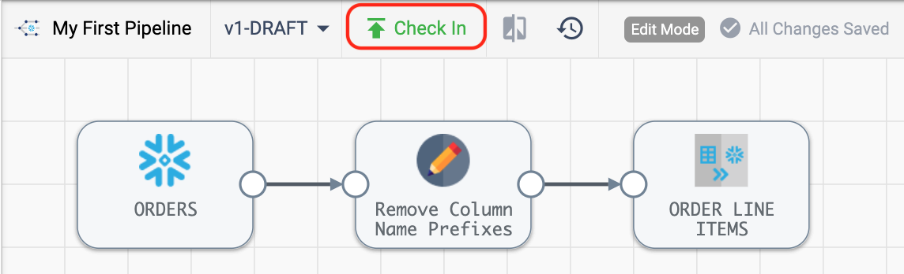

2. In the **Check In** wizard, enter a commit message and choose **Publish and Close**. 


    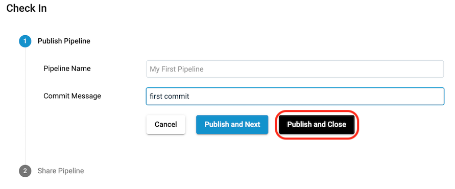

3. Back in the design canvas, you are now viewing a read-only version of the pipeline.  To create a new draft, click on **Edit** in the toolbar above the canvas. 

    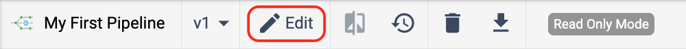

###
    ### Should I add the option to import a pipeline here??

### **Join Orders with Line Items**

Let's continue on with our pipeline development. Now let's add ``LINEITEMS`` to the pipeline so that we can finish our ```ORDER_LINE_ITEMS``` table. 

1. There are a couple ways to add a new origin , but the quickest is to simply copy the origin we already created. Select the **ORDERS** stage, and choose the **Copy** icon from the pop-up menu above. A new origin will appear on the screen, with the default name **Snowflake Table 1**.

  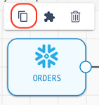

2. Update the new origin stage **Snowflake Table 1** with the following configurations:
    - On the **General** properties tab, give it the name ``LINEITEMS``
    - On the **Table** properties tab, we can see that the settings from the **Orders** origin are pre-populated. This means that all we need to do is update the Table name to  ``LINEITEM``, with this resulting configuration: 

    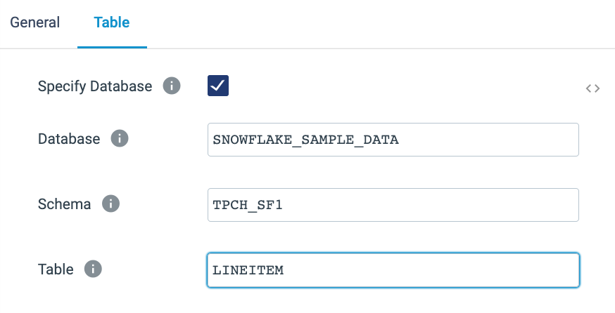

3. Let's do the same column name transformations on the Line Items data, since all of the column names in this table begin with _L\__. You can see the column names from the table in Snowflake below.

  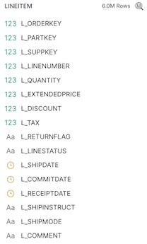

4. Add another **Field Renamer** to the canvas. Eventually, the Orders and Line Item data will be joined, so it would be good to add a meaningful prefix on the Line Item columns to indicate which table each column is from. Instead of the ``L_`` prefix, the columns will be prefixed with ``LINEITEM``. 

  - Do this by clicking on the output node of the **LINEITEM** origin and use the **Pipeline Creation Help Bar** above the canvas to select a **Field Renamer** processor[or click on the **Stage Panel Library** on the right canvas to select a **Field Renamer** and connect the **LINEITEM** output to the new processor's input]. 
    - Click on the new processor.
    - On the **General** tab, set the **Name** to ``Update Column Prefixes``
    - On the **Rename** tab, update the following properties:
      - **Rename Type**: ``Find and replace in all fields by string``
      - **Match Pattern**: ``L_``
      - **Replacement**: ``LINEITEM_``

#### **Calculate Unit Price, Discounts, and Tax**

5. Now that we have cleaned up the column names on the ``LINEITEM`` table, let's perform a few calculations that we want to see downstream in our analytics. We want to add some columns that calculate the unit base price per item, discounted price per item, total discount amount, and total sales amount.

    - We will use an [**Expression Evaluator**](https://docs.streamsets.com/portal/platform-txsnowflake/latest/tx-snowflake/Processors/Expression.html#concept_i1k_wxc_5rb) to create new columns.
      - Add an **Expression Evaluator** processor to the canvas after the **Update Column Prefixes** processor. 
      - Name the **Expression Evaluator** ``Calculate Unit and Total Amounts``.
      - Go to the **Expressions** tab.
      - Now we want to add the following columns and accompanying calcuations. Don't add this just yet! 

        | Column name | Expression |
        | --- | --- |
        | ``unit_base_price`` | ``lineitem_extendedprice/lineitem_quantity``|
        | ``discounted_unit_price`` | ``unit_base_price * (1 - lineitem_discount)`` |
        | ``total_discount_amount`` | ``-1 * lineitem_extendedprice * lineitem_discount`` |
        | ``total_tax_amount`` | ``(lineitem_extendedprice + total_discount_amount) * lineitem_tax`` |
        | ``net_total_amount`` | ``lineitem_extendedprice + total_discount_amount + total_tax_amount`` | 
      
      
      - When there is a lot of configuration that you want to copy/paste, you can often take advantage of [``Bulk Edit Mode``](https://docs.streamsets.com/portal/platform-txsnowflake/latest/tx-snowflake/Pipelines/SimpleBulkEdit.html?hl=bulk%2Cedit). This switchs the individual configurations to a json blob where you can copy/paste JSON arrays. 
      
          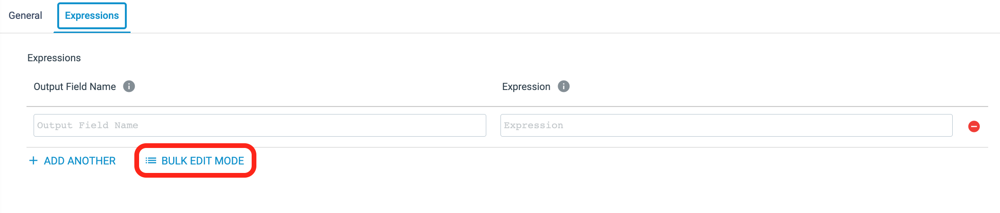

      - Copy the following ``json`` into the Bulk Edit text box - and be sure to include the brackets:

        ```json
        [
          {"fieldName": "unit_base_price", "expression": "lineitem_extendedprice/lineitem_quantity"},
          {"fieldName": "discounted_unit_price", "expression": "unit_base_price * (1 - lineitem_discount)"},
          {"fieldName": "total_discount_amount", "expression": "-1 * lineitem_extendedprice * lineitem_discount"},
          {"fieldName": "total_tax_amount", 
                "expression": "(lineitem_extendedprice + total_discount_amount) * lineitem_tax"},
          {"fieldName": "net_total_amount", "expression": "lineitem_extendedprice + total_discount_amount + total_tax_amount"}
        ]
        ```
        
      

        The pipeline should now look like this: 
           


1. Now let's join these two tables together.
    - Click on the line connecting the first **Field Renamer [Remove Column Name Prefixes]** to the **Snowflake Table [ORDER LINE ITEMS]** destination.
    - On the **Pipeline Creation Help Bar**, select **Join** from the _Select Processor to add in between the selected stream..._ dropdown.

6. Now connect the second **Field Renamer [Update Column Prefixes]** to the **Join** stage just added, so that it has two inputs. Your pipeline should now look like this:
    

7. Click on the [Join](https://docs.streamsets.com/portal/platform-txsnowflake/latest/tx-snowflake/Processors/Join.html#concept_edd_sc2_5rb) stage, and name the processor ``Order and Line Item Join``.
    - On the **Join** properties tab below the canvas, we describe the join criteria. This is a very flexible processor as described in the [documentation](https://docs.streamsets.com/portal/platform-txsnowflake/latest/tx-snowflake/Processors/Join.html#concept_edd_sc2_5rb), so there are multiple join types to choose from and join conditions can be based on matching column names or the join clause can be written out in SQL.  
    - In this case, we will do an inner join on the ``ORDERS`` and ``LINEITEM`` tables based on the ``ORDERKEY``.  
    - Make sure that the stage has the settings below:
      
        - **Join Type**: ``Inner``
        - **Join Criteria**: ``Condition``
        - **Condition**: ``ORDERKEY = LINEITEM_ORDERKEY``

8. Now preview the pipeline to see if the pipeline changes have had the desired effect. Use the preview button (eye icon) on the right side above the canvas. 
    - Looking at the previews for the **Field Renamer** stages, we can see that all of the prefixes were removed or updated accordingly.
    - The preview for the **Join** stage probably isn't showing any records. Why not?
        - When using preview, the pipeline is randomly pulling the records from each of the sources, so in this case, there is no guarantee that they will have Order Keys that will overlap. That's ok, because we can use the **Preview Where Clause** to filter the records that are used for preview.
        - In this case, we will filter on the Order Id so that we can match the lineitems to the order. 
    - Close the preview 

9. Update the Preview filters on the Snowflake Table origins.
    - Go to the **ORDERS** origin and open the **Table** properties tab. For the **Additional Preview Where Clause**, enter ``O_ORDERKEY = 1``
    - On the **LINEITEM** origin, add ``L_ORDERKEY = 1`` as the  **Additional Preview Where Clause**.

10. Preview the pipeline again, and select the **Join [Order & Line Item Join]** processor. Now the processor is showing input and output where the Order and Line Item information have a matching order key. 

    

### **Create an Order Summary Table**

12. Now we want to create a **Order Summary** table that includes some of the calculations we just added.  We want to get total gross sales amount, total discount amount, total tax amount, and total net sales amount for each order. We'll also create a column, ``ORDER_COUNT``, so that subsequent aggregations can use that to total orders.

    - To do this, add an [**Aggregate**](https://docs.streamsets.com/portal/platform-txsnowflake/latest/tx-snowflake/Processors/Aggregate.html#concept_rvw_5rc_5rb) processor to the pipeline.
    - Create a second output from the **Join [Order & Line Item Join]** processor by drawing a line from its output node to the input node of the **Aggregate** processor. 
    - Name the **Aggregate** processor ``Aggregate Line Items``. On the  **Aggregate** properties tab, add the following fields under _**Aggregations**_ (bulk edit option provided too): 
        
        | Aggregate Function | Aggregate Field | Calculation | Output Field Name |
        | --- | --- | --- | --- |
        | ``Sum`` | ``LINEITEM_EXTENDEDPRICE``||``GROSS_SALES_AMOUNT``|
        | ``Sum`` | ``TOTAL_DISCOUNT_AMOUNT`` ||``TOTAL_DISCOUNT_AMOUNT``|
        | ``Sum`` | ``TOTAL_TAX_AMOUNT`` ||``TOTAL_TAX_AMOUNT``|
        | ``Sum`` | ``NET_TOTAL_AMOUNT`` || ``NET_TOTAL_AMOUNT`` |
        | ``Count Distinct`` | ``ORDERKEY``||``ORDER_COUNT``|
          
      JSON to copy/paste in **Bulk Edit Mode**:
        
        ```json
          [
            { "aggregateTypes": "SUM",
              "aggregateField": "LINEITEM_EXTENDEDPRICE",
              "outputField": "GROSS_SALES_AMOUNT" },
            {  "aggregateTypes": "SUM",
              "aggregateField": "TOTAL_DISCOUNT_AMOUNT",
              "outputField": "TOTAL_DISCOUNT_AMOUNT" },
            {  "aggregateTypes": "SUM",
              "aggregateField": "TOTAL_TAX_AMOUNT",
              "outputField": "TOTAL_TAX_AMOUNT" },
            {  "aggregateTypes": "SUM",
              "aggregateField": "NET_TOTAL_AMOUNT",
              "outputField": "NET_TOTAL_AMOUNT" },
            { "aggregateTypes": "COUNT_DISTINCT",
              "aggregateField": "ORDERKEY",
              "outputField": "ORDER_COUNT" }
          ]
        
        ```
    - Set **Group by Fields**[1] to ``ORDERKEY``
    - The final properties should look like this: 
    
      
    
    - Now add another **Snowflake Table** destination to the canvas, feeding it the output of the **Aggregate** processor.
      - Name the destination ``Order Summary``
      - On the **Table** tab, specify the table name as ``ORDER_SUMMARY``
      - Select **Write Mode**: ``Overwrite Table``
      - Select **Overwrite Mode**: ``Drop Table``
    - The completed properties should look like this: 

      

13. Preview the Pipeline. Look at the output of the **Expression Evaluator** and **Aggregate** stages to see the calculated columns and the aggregated Order Summary record. 

    **Expression Evaluator Preview:**    
      
  
    **Aggregate Preview**
    

### **Create Final Order Summary**

14. Now we want to join the summary data to the original orders data to create a table that has both the Order level details, such as ``CUSTOMERKEY``, and the totals derived from the Line Items.

  - Start by adding another **Join** stage to the canvas using the **Stage Library Panel** on the right.
  - Connect the output from the first **Field Renamer [Remove Column Name Prefixes]** processor as the input to the new **Join**
  - Connect the output of the **Aggregate** processor to the join. 
  - Go to the processor configuration:
      - Name the join ``Order and Aggregate Join``
      - On the properties **Join** tab:
        - **Join Criteria**: ``Matching Fields``
        - **Matching Fields**[1]: ``ORDERKEY``  

          

15. Now we want to limit the columns that will be inserted into the new target table because maybe there are columns that are no longer used or not relevant to the data consumers. This can by done by using a **Field Remover** processor to specify the columns to **keep**. This processor gives you the option to specify either the columns to keep or the columns to remove. This can be done be specifying a list of columns OR using pattern matching to specify which columns to keep/remove.

    - Insert a **Field Remover** stage. 
    - Connect the output of **Join 2** to its input.
    - Name the stage ``Curate Columns``
    - On the **Fields** tab of the stage properties, update the following settings:
      - **Action**: ``Keep Listed Fields``
      - **Field Match Criteria**: ``Field Name``
      - **Fields**:  Below the first field, select [``Bulk Edit Mode``](https://docs.streamsets.com/portal/platform-txsnowflake/latest/tx-snowflake/Pipelines/SimpleBulkEdit.html?hl=bulk%2Cedit) and copy/paste the following JSON array. Be sure to include the brackets.:
          ```JSON
          [
            "ORDERKEY",
            "ORDERDATE",
            "CUSTOMERKEY",
            "STATUSCODE",
            "PRIORITYCODE",
            "CLERKNAME",
            "SHIPPRIORITY",
            "GROSS_SALES_AMOUNT",
            "TOTAL_DISCOUNT_AMOUNT",
            "TOTAL_TAX_AMOUNT",
            "NET_TOTAL_AMOUNT"
          ]
          ```

16. Now we will specify which table this data should be loaded to.
  - Insert a new **Snowflake Table** destination 
  - Connect the output of the **Field Remover** to its input.
  - On the **Table** tab in the properties, specify the table name ``ORDER_AMOUNTS``
  - At this point, the pipeline should look something like this: 
    

17. Now preview the results, looking at each of the stages. If it would be helpful to see some more data in the preview, add another ORDERKEY to the the **Preview Where Clause** by changing them to ``O_ORDERKEY IN (1,2)`` for the Orders table and ``L_ORDERKEY IN (1,2)`` for the Line Item table. 

18. Once the pipeline has been previewed do a **Draft Run** on the unpublished pipeline. Go to your worksheet and run the following queries to see the output of the pipeline.
    ```sql
    SELECT * FROM PC_STREAMSETS_DB.PUBLIC.ORDER_LINE_ITEMS LIMIT 10;
    SELECT * FROM PC_STREAMSETS_DB.PUBLIC.ORDER_SUMMARY LIMIT 10;
    SELECT * FROM PC_STREAMSETS_DB.PUBLIC.ORDER_AMOUNTS LIMIT 10;   
    ```
19. Check in this version of the pipeline and enter a commit message. Choose ``Save & Close`` from the **Check In** window.

20. A complete version of this pipeline can be found on github at [TO DO- ADD FINAL LINK](/Pipeline-Examples/tx4snowflake_hol/my_first_pipeline_step_3.zip).

## **Pipeline Fragments**
Duration: 10

In the next part of the lab, we want to create a **Pivot Table** that can be used to support some analytics. Our goal for this portion is the lab is to create a table to support the analysis of monthly net sales by clerk. The desired output has rows for _CLERKs_,  columns as _Year/Month_, and  cell values as _Net Sales Amount_ totals.

Instead of individually adding and configuring processors, we are going to use a [**pipeline fragment**](https://docs.streamsets.com/portal/platform-controlhub/controlhub/UserGuide/Pipeline_Fragments/PipelineFragments_title.html) to create a **Pivot Table** to support our analytics. 

A [**pipeline fragment**](https://docs.streamsets.com/portal/platform-controlhub/controlhub/UserGuide/Pipeline_Fragments/PipelineFragments_title.html) is a stage or set of connected stages that you can use in other pipelines. Use them to easily add the same processing logic to multiple pipelines and to ensure that the logic is used as designed.

Download the pipeline fragment from github [TO DO- ADD FINAL LINK](/Pipeline-Examples/tx4snowflake_hol/pivot_fragment_example.zip) that was created to implement this logic. This fragment has been fully parameterized, allowing you to fill in parameter values for the date, the date format to pivot on, the field you want to group by, the value to aggregate, and the table to populate. So this fragment could be used multiple times to create and populate different pivot tables by only changing the input parameters when adding it to the pipeline. 

You can find out more about Pipeline Fragments in the[ StreamSets Documentation](https://docs.streamsets.com/portal/platform-controlhub/controlhub/UserGuide/Pipeline_Fragments/PipelineFragments_title.html).

### **Import a Pipeline Fragment**

1. Instead of creating this fragment from scratch,  we will [import](https://docs.streamsets.com/portal/platform-controlhub/controlhub/UserGuide/ExportImport/Importing.html#task_dd4_d5z_rdb) it. 
    - Download the pipeline fragment from [TO DO- ADD FINAL LINK](/Pipeline-Examples/tx4snowflake_hol/pivot_fragment_example.zip) 
    - Click **Build** > **Fragments** in the Navigation panel, and then click the **Import a Pipeline Fragment** option at above the fragment list or the **Import** icon.

      

    - On the pop-up window, use the following settings:
      - **Import file type**: ``Archive File`` (default)
      - **Commit Message**: ``import``
      - **Browse File**: use the **pivot_fragment_example.zip** file that can be found at [insert github link here](/Pipeline-Examples/tx4snowflake_hol/pivot_fragment_example.zip). You will need to download this file locally first.
   
    - Click on **Import**.
    - Click on **Close**.  Upon import, note that the fragment is already in the **Published** state, which means that it can be immediately used in pipelines. Just keep in mind that all fragments must be published before they can be added to a pipeline.

    - Now you can see the **Pivot Fragment** in the Fragment list. 

2. Click on the **Pivot Fragment** to open the canvas. Let's take a closer look what it is doing.

    
  
  - The purpose of this fragment is to create a pivot table with a summary of net sales by month for each clerk. Since this pivot table could be created for a variety of time increments, metrics, and groupings, it uses parameters to allow users to enter a few column names once instead of having to add and configure the needed processors each time. The fragment versions can then be centrally managed, and when new versions are published, the updates can be pushed to the pipelines with the fragment in use.

  - In the configuration menu below the canvas, the fragment's parameters are visible. When using this fragment in a pipeline, these parameters can be changed for every instance of the fragment that is inserted. To reference a parameter in a processor configuration, use ``${parameter name}``.

  - The pipeline has 3 processors and 1 Snowflake Table destination.
      - **Parse Date Parts [_Expression Evaluator Processor_]** - This stage parses the value in the ``DATE_COLUMN`` using the date format provided in the ``DATE_FORMAT_PATTERN`` string. 
        
      - **Keep Only Columns for Pivot [_Field Remover Processor_]** - This processor limits the columns in its output using the ``Keep Listed Fields`` option, the ``TIME_PERIOD`` field created in the previous processor, and the columns specified as the ``AGGREGATE_COLUMN`` and ``GROUP_BY_COLUMN``. The column name given for ``GROUP_BY_COLUMN`` here determines which column the pivot table will group the rows by. 
        
      - **Pivot [_Pivot Processor_]** - This stage is where the magic happens! 
        
        - The **Field to Pivot** is set to be the ``TIME_PERIOD`` value created in the expression evaluator. This means that this is the value that will be turned into columns. 
        - **Autocalculate Pivot Values** - When selected, StreamSets uses the distinct values from the **Field to Pivot** as the column names. When this option is not selected, the column names need to be manually entered, which is also required when writing a SQL query to create a pivot table. So if **Autocalculate Pivot Values** is used, now there is no need to track new values appearing in the **Field to Pivot**. StreamSets will automatically take care of making sure the appropriate column names are present.
        - **Field to Aggregate** - This is the value that will be aggregated by whatever function is chosen in the below **Aggregation** setting. In this instance, we are simply doing a sum since we want to generate totals for each row in each time period.
          - To put this into context, the SQL query for this pivot is shown below, and with the passage of time, the column names will need to be updated every month. The Pivot Processor, however, does this logic for you so that you can set it and forget it. 
            ```sql
              SELECT * 
              FROM SOURCE_TABLE
                PIVOT( 
                  SUM(NET_SALES_AMOUNT) FOR TIME_PERIOD 
                    IN ('2022-01','2022-02'
                        ,'2022-03','2022-04'
                        ,'2022-05','2022-06'
                        ,'2022-07','2022-08'
                        ,'2022-09','2022-10'
                        ,'2022-11','2022-12')
                ) AS P;
            ```
      - **Snowflake Target Table [_Snowflake Table destination_]** - One thing to note about this **Snowflake Table** destination is that a parameter is being used to set the table name. This is something that can be done throughout StreamSets and makes it possible to create one pipeline that can use parameters to execute on different sources, targets, and/or using different values in the configurations.

        

2. Go back to **Build** > **Pipelines** and select the pipeline you were working on and open the canvas.

### **Use Fragment to create Pivot Table**

1. In the pipeline canvas for **My First Pipeline**, use the **Stage library panel** on the right. Click on the ``A`` in the top left of the panel produce a dropdown menu with the list of object types that can be added to the canvas. Select ``Fragments`` from the list. Now select the **Pivot Fragment**. A pop-up will appear to allow you to alter the prefix that StreamSets adds to the parameters for that fragment. Leave this unchanged and click on **Done**.

      

    - The fragment will now appear on the canvas.
    - Connect the output of **Order and Aggregate Join** to the input of the **Pivot Fragment**.
    - Click on the **Pivot Fragment**. On the **General** tab below, there is a property for the **Fragment Commit/Tag**, where the version of the fragment currently in use can be seen and changed with the dropdown menu of its versions.
      
    - The **Fragment Parameters** tab contains the parameters with the updated prefixes where the parameters have the default values assigned in the fragment.
    - Now look at the pipeline parameters by clicking on an area of blank canvas to have the general pipeline properties appear below the canvas. On the **Parameters** tab, the parameters from the fragment were automatically added to this list as well, and pre-populated with the default values. The values for the fragment parameters can be updated in either place, and the new value will automatically be populated on both tabs.

2. Start a **Draft Run** of the pipeline.  Verify the creation of the ORDER_AMOUNTS table in Snowflake with the following query (query assumes all default values were used).
    ```sql
    SELECT * FROM PC_STREAMSETS_DB.PUBLIC.PIVOT_SALES_BY_CLERK LIMIT 10;
    ```

## **Create a Job**
Duration: 10

In this next step, we will create a StreamSets [job instance](https://docs.streamsets.com/portal/platform-txsnowflake/latest/tx-snowflake/ControlHub/Title.html#concept_qv1_5sn_hsb), which is the execution of a puplished pipeline. A job instance can be created from a pipeline or a job template.

  - Check in the pipeline.
  - After entering the **Commit Message**, click on ``Publish and Next``.
  - Under **Share Pipeline**, select ``Save and Next`` .
  - The **Update Jobs** section won't have any jobs listed, so click on ``Save and Create New Job``
  - A new pop-up window appears titled **Create Job Instances**.
  - Leave the default job **Name**: ``Job for My First Pipeline``.
  - Click on ``Next``.
  - Under **Select Pipeline**, the name of the pipeline will appear, in this case ``My First Pipeline`` as well as the pipeline version. Click on ``Next``.
  - Now the **Define Runtime Parameters** section displays. This is where the default parameter values can be overwritten. For this case, the defaults will suffice. Click on ``Save & Next``.
  - Under **Review & Start**, it indicates that the job was successfully created. Click on ``Start & Monitor Job``.
    

### View Running Job
- The system will show the pipeline canvas, but this is really a view of the job, as is indicated by the job name in the top left and the green ``ACTIVE`` indicator. 
  
  

- The job will complete shortly, and below the canvas, the **Job Status** tab will show the current job status, which is now ``INACTIVE``. It also shows the parameter values used for that instance of the job.
- Click on the **History** tab below **Job Status**, and a summary of all the job runs is displayed. Click on **View Summary...**.

    

- The **Job Metrics Summary** will appear and shows:
    - The number of records read and written
    - Scroll down to reveal the queries generated for each destination. The Destination Id shown is not the name given to the destination, but the Instance Name that can be found on the **Info** tab of every pipeline component. 
    - Scroll all the way to the bottom to see the Log history.
    
      

- The full lists of job instances, job templates, draft runs, can also be found under the **Run** tab on the left. 

- There is much more that can be done with jobs, such as scheduling them or triggering job runs via the Rest API. You can find more information in the Control Hub documentation [here](https://docs.streamsets.com/portal/platform-controlhub/controlhub/UserGuide/Run/Run.html).

<!-- Add a step to show the Run -> Job Instances menu -->
<!--     - Now click on the **Pivot Fragment** to have the pop-up menu appear. Select the icon to expand the fragment to see the individual processors in the fragment. 
      
-->


## **Slowly Changing Dimension**
Duration: 20

You can see that the ``NATION`` table in the ``SNOWFLAKE_SAMPLE_DATA`` database and ``TPCH_SF1`` schema has a region assigned to each country. Overtime, the company might add or change regions as they grow. For instance, there is only an ``America`` region, but eventually it might make sense to split that into ``North America`` and ``South America``. For our reporting over time, however, we may want to preserve the historical nation to region mappings, so we want to capture this in a **Slowly Changing Dimension**. 

1. Go back to your Snowflake Worksheet and run the following ``SQL`` queries to create the tables for this portion of the lab.  When you finish, you should have two tables in the ``PC_STREAMSETS_DB`` database and ``PUBLIC`` schema: ``NATION_DIMENSION`` and ``NATION_UPDATES``.

    ```sql
    -- CREATE NATION DIMENSION FOR SCD PIPELINE
    CREATE OR REPLACE TABLE PC_STREAMSETS_DB.PUBLIC.NATION_DIMENSION AS
    SELECT
        N.N_NATIONKEY AS NATION_KEY,
        N_NAME        AS NATION_NAME,
        R.R_NAME      AS REGION_NAME,
        0             AS START_TIMESTAMP,
        NULL          AS END_TIMESTAMP,
        1             AS VERSION,
        TRUE          AS ACTIVE_FLAG
    FROM
        SNOWFLAKE_SAMPLE_DATA.TPCH_SF1.NATION N
        JOIN SNOWFLAKE_SAMPLE_DATA.TPCH_SF1.REGION R 
        ON N_REGIONKEY = R.R_REGIONKEY;

    -- CREATE A TABLE FOR CHANGE DATA
    CREATE OR REPLACE TABLE PC_STREAMSETS_DB.PUBLIC.NATION_UPDATES
      (
        NATION_KEY    INTEGER,
        NATION_NAME   VARCHAR,
        REGION_NAME   VARCHAR
        );

    INSERT INTO PC_STREAMSETS_DB.PUBLIC.NATION_UPDATES 
      VALUES 
        (2,'BRAZIL','AMERICA')
        ,(24, 'UNITED STATES','NORTH AMERICA')
        ,(25, 'AUSTRALIA','ANZ') ;
    ```

2. Create a new pipeline by going to **Build** > **Pipelines**. Use the ➕ icon to create a new Transformer for Snowflake pipeline.
  
 
3. Click on **Use Transformer for Snowflake**! Name your pipeline ``My SCD Pipeline`` and click on **Next**. At the next prompt, chooose **Save and Open in Canvas**.

4. Check on the **General** and **Parameters** tabs below the pipeline canvas to make sure that your pipeline default vaues are populated. If not, enter them. 

5. Add a **Snowflake Table** origin to the canvas. Since we are using our default database and schema, all we need to do is add the table name to read from. Name the origin ``Nation Dimension``, and go to the **Table** tab to enter the following settings: 
    - **Table**: ``NATION_DIMENSION``
    - **Additional Preview Where Clause**: ``NATION_KEY IN (2,24,25)``

6. While this origin is selected, use the **Pipeline Creation Help Bar** above the canvas to **Select New Processor to connect..** and choose ``Slowly Changing Dimension``. If the **Pipeline Creation Help Bar** does not appear, you can select the SCD Processor from the **Stage Library Panel**, drag it onto the canvas, and connect your origin output as its input.

6. Add a second **Snowflake Table** origin to the canvas. Again, this table is in the default database and schema, so you only need to enter the table name to read from. Name the origin ``Nation Updates``, and then go to the **Table** tab to enter the following setting: 
    - **Table**: ``NATION_UPDATE``

7. Connect the output of the **Nation Update** origin to the **Slowly Changing Dimension** processor. Your pipeline should now look like the image below. It is important which number each input is assigned to. **Nation Dimension** should be input ``1`` and **Nation Update** should be input ``2``. If the inputs are reversed, you can switch them by selecting the SCD processor and clicking on the button with the up and down arrows.

   

8. Now it's time to configure the processor. Make sure that the SCD processor is selected, and on the **Dimension** configuration below, enter the following settings:

    - **SCD Type**: ``Type 2``
    - **Key Fields**[1]: ``nation_key``
    - **Specify Version Field**: **✓**
      - **Version Field**: ``version``
    - **Active Flag Type**: **✓**
    - **Specify Timestamp Fields**: selected
      - **Start Timestamp Field**: ``start_timestamp``
      - **End Timestamp Field**: ``end_timestamp``
      - **Calculated Timestamp Field**: ``effective_date``
    - **Behavior for New Fields**: ``Remove from change data`` [default]

  - Let's take a closer look at some of these settings: 
    - **SCD Type**: Currently Type 1 and Type 2 dimensions are supported.
    - **Key Fields**: You can specify the fields that uniquely identify each dimension record. Columns not included as a key or in the settings below will be considered when comparing existing dimension records to new data.
    - **Specify Timestamp Fields**: 
      - **Calculated Timestamp Field**: This option allows you to use a timestamp from the changed data set as the value for the **Start Timestamp** on the new or updated record and the **End Timestamp** on the record to be expired.
    - **Behavior for New Fields** - this setting determines what will happen when a column exists in the change data but not the dimension table. 
      - **Remove from change data** - The processor will ignore additional column(s) and drop any data from the change data set in a column that does not exist in the dimension.
      - **Keep for newest records and set to null for previous records** - The processor will pass the new column from the change data to the rest of the pipeline. This means that if **Data Drift Enabled** is selected in your table destination, the new column will be created in the target table. 
9. Now we will add a **Snowflake Table Destination** to complete the pipeline. 
    - Connect the output of the **Slowly Changing Dimension** processor to a **Snowflake Table** destination (that needs to be added to the canvas). 
    - Name the destination ``Nation Dimension Destination``
    - Choose the following settings on the **Table** tab:
      - **Table**: ``NATION_DIMENSION``
      - **Write Mode**: ``Propagate updates from Slowly Changing Dimensions``
      - **Create Table**: Unchecked
      - **Data Drift Enabled**: **✓**
    - The **Table** tab should look like this:
    

    - What does it mean to ``Propagate updates from Slowly Changing Dimensions``? 
        - The **Slowly Changing Dimension** processor produces a record for every ``INSERT`` and ``UPDATE`` that is needed. So for example, when a nation's region  changes, the processor generates one output that updates the fields to expire the old record and a second output for the new version of the record. Using this option on StreamSets' **Snowflake Table** destination means that StreamSets will generate the ``MERGE`` statement needed to process all of the updates automatically. 

10. The completed pipeline should look like this: 
    

11. Now **Preview** the pipeline. On the **Preview Configuration** screen, keep the options to **Show Record/Field Header** and  **Write to Destinations** unselected. Let's step through the output of the preview:
    - On the ``Nation Dimension`` origin, we can see two records from the existing dimension, the records for ``Brazil`` and the ``United States``.
        
    - On the ``Nation Update`` origin, there are three records from the change data, the records for ``Australia``, ``Brazil``,  and the ``United States``. In this preview, the record for the ``United States`` has a new region, the ``Brazil`` record is unchanged, and there is a new record to add ``Australia``.
      
    - On the ``Slowly Changing Dimension`` processor, there are 5 input records and only 3 output records. Let's step through each one. 
      
        - **Nation_Key** ``2``: ``Brazil``
          
          There was no change to this record in the update data, so no action needs to be taken and the record is ignored
        - **Nation_Key** ``24``: ``United States``
          
          The update data contains a new region, ``North America``, versus the existing dimension record that has ``America`` as the region. The processor then generates 2 records.
            - 1 - Expires old record. The original dimension record is updated to set the ``ACTIVE FLAG`` to ``FALSE`` and set the ``END_TIMESTAMP`` to the ``EFFECTIVE_DATE`` of the updated record. The ``__SS_META_OPERATION`` and ``__SS_META_KEYS`` are columns generated by StreamSets that will NOT appear in the final data, but are metadata that the destination processor uses.
            - 2 - Generates new record. This record contains the new region value. The version of the record is incremented from the old record, the ``ACTIVE_FLAG`` is set to ``TRUE``, and the ``START_TIMESTAMP`` to the value of the ``EFFECTIVE_DATE``
            
        - **Nation_Key** ``25``: ``Australia``
          This record does not exist in the current dimension table, so a new row will be created as Version 1 of the record.

12. Close the preview. Do a **Draft Run** of the pipeline and go back to Snowflake and continue wih the previous worksheet and run the following SQL statement:

      ```sql
      SELECT *
      FROM  PC_STREAMSETS_DB.PUBLIC.NATION_DIMENSION
      WHERE NATION_KEY IN ('2','24','25')
      ORDER BY NATION_KEY, START_TIMESTAMP;
      ```

   The query results show the active and inactive dimension records for the three example nations that were processed by the pipeline as show below.

  

13. ``INSERT LINK TO DOWNLOAD FINISHED PIPELINE HERE``


  

<!-- ------------------------ -->
## To be deleted - Code Snippets, Info Boxes, and Tables
Duration: 0

Look at the [markdown source for this sfguide](https://raw.githubusercontent.com/Snowflake-Labs/sfguides/master/site/sfguides/sample.md) to see how to use markdown to generate code snippets, info boxes, and download buttons. 

### SQL
```sql
  select * 
  from x;
```

### Java
```java
for (statement 1; statement 2; statement 3) {
  // code block to be executed
}
```


### Embed an iframe


### Hyperlinking
[Youtube - Halsey Playlists](https://www.youtube.com/user/iamhalsey/playlists)

<!-- ------------------------ -->
### Images, Videos, and Surveys, and iFrames
Duration: 0

Look at the [markdown source for this guide](https://raw.githubusercontent.com/Snowflake-Labs/sfguides/master/site/sfguides/sample.md) to see how to use markdown to generate these elements. 

### Videos
Videos from youtube can be directly embedded:
<video id="KmeiFXrZucE"></video>


<!-- ------------------------ -->
## Conclusion
Duration: 0

At the end of your Snowflake Guide, always have a clear call to action (CTA). This CTA could be a link to the docs pages, links to videos on youtube, a GitHub repo link, etc. 

If you want to learn more about Snowflake Guide formatting, checkout the official documentation here: [Formatting Guide](https://github.com/googlecodelabs/tools/blob/master/FORMAT-GUIDE.md)

### What we've covered
- creating steps and setting duration
- adding code snippets
- embedding images, videos, and surveys
- importing other markdown files

---
**NOTE**

It works with almost all markdown flavours (the below blank line matters).

---