summary: A Dive into Slowly Changing Dimensions with Snowpark
id: snowflake_transformer
categories: data-engineering
environments: web
status: Published 
feedback link: https://github.com/Snowflake-Labs/sfguides/issues
tags: Getting Started, Data Engineering, Snowpark
authors: Brenna Buuck, StreamSets

# A Dive Into Slowly Changing Dimensions with Snowpark and StreamSets
<!-- ------------------------ -->
## Overview 
Duration: 1

StreamSets Transformer for Snowflake is a hosted service embedded within the StreamSets DataOps Platform that uses the Snowpark Client Libraries to generate SnowSQL queries that are executed in Snowflake. Build your pipelines in the StreamSets canvas and when you execute that pipeline, StreamSets generates a DAG. StreamSets then uses the DAG and the Snowpark Client Libraries to generate SnowSQL. That SnowSQL is sent over to Snowflake to be executed in the Warehouse of your choice. 

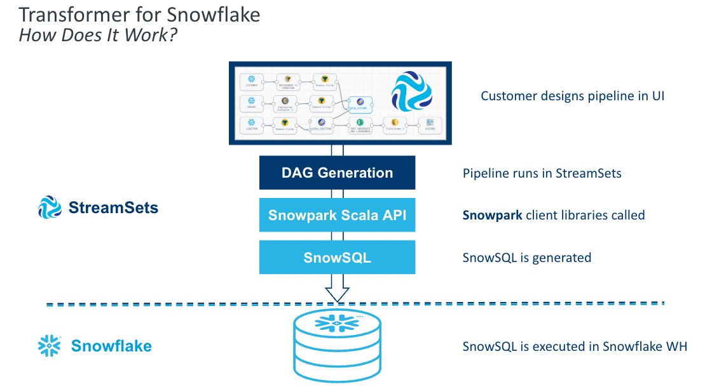

Transformer for Snowflake accelerates the development of data pipelines by providing features that go beyond a drag and drop interface to construct the equivalent of basic SQL. Snowpark enables StreamSets to construct the SnowSQL queries at the pipeline runtime, allowing pipeline definitions to be more flexible than SnowSQL queries written by hand. StreamSets also provides processors that combine the logic for common use cases into a single element on your canvas. 

Let’s explore how to get started using Transformer for Snowflake and some of the features that will accelerate pipeline development.
 
### Prerequisites
- Access to [StreamSets DataOps Platform account](https://cloud.login.streamsets.com/login)
- A [Snowflake](https://signup.snowflake.com/) account and a schema that your user has CREATE TABLE privileges on
- SQL Script located [here](https://github.com/streamsets/Pipeline-Examples/blob/main/SCD_Snowpark/SCD_Snowpark.sql)

### What You’ll Learn 
In this guide, you will learn how to build pipelines using Transformer for Snowflake that are executed directly in your Snowflake Data Cloud, including:
- How to build and preview pipelines
- How to use the Slowly Changing Dimension Processor
- How to apply transformations to multiple columns at one time
- How to create and execute a job

### What You’ll Build
- A pipeline in StreamSets using Snowpark to process a Slowly Changing Dimension. You can import the final product to compare against [here](https://github.com/streamsets/Pipeline-Examples/blob/main/SCD_Snowpark/Snowpark_Snowflake_Transformer.zip).

<!-- ------------------------ -->
## Configure your Snowflake Credentials and Connection Defaults
Duration: 2

If you have not used Transformer for Snowflake before, after signing up for the platform, you will need to add your Snowflake Credentials to your user. You can find these settings under the User Icon > My Account

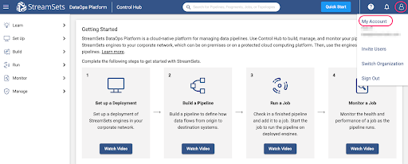

Under My Account, select the **Snowflake Settings** tab. You must enter Snowflake credentials. There are two options for authentication: Username/Password or Key Pair Authentication. You can find instructions for setting up Key Pair authentication with Snowflake [here](https://docs.snowflake.com/en/user-guide/jdbc-configure.html#label-jdbc-using-key-pair-authentication). You will want to use a key pair that is **not** encrypted

You also have the option to set pipeline defaults, which is highly recommended. This will prevent you from having to enter your Account URL, Warehouse, Database, Schema, and/or Role for every pipeline. When these values are populated, new Transformer for Snowflake pipelines are created with parameters for those settings pre-populated with the values provided here. These settings can be overwritten directly in any pipeline.

Your Snowflake account URL will change depending on the area where you’re located. Make sure you copy paste it up until the “.com".

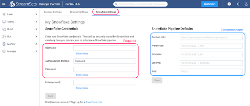

<!-- ------------------------ -->
## Create a New Pipeline
Duration: 2

Once your credentials are saved, you are ready to build your first pipeline. Using the tabs on the left hand menu, select Build > Pipelines. Use the ➕ icon to create a new pipeline.

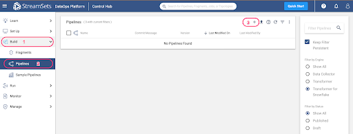

If your DataOps platform account has no deployments set up, the following pop up will appear. Select the option to “Use Transformer for Snowflake”. Otherwise, the subsequent screen will appear.

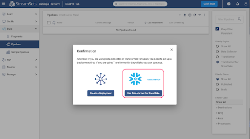

The New Pipeline window will appear, so enter a pipeline name and if desired, a description, and make sure that the Engine Type selected is **Transformer for Snowflake**. 

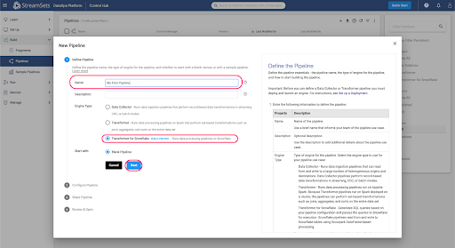

Add any users or groups for shared access to the pipeline, choose **Save & Next**, and then **Open in Canvas**.

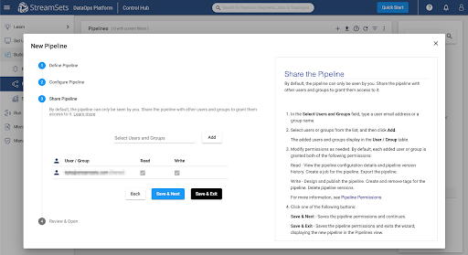

If you entered Default Pipeline Parameters in the previous step, the **Snowflake URL, Warehouse, Database, Schema**, and/or **Role** fields will be populated with StreamSets Parameters, whose values can be seen on the **Parameters** tab.

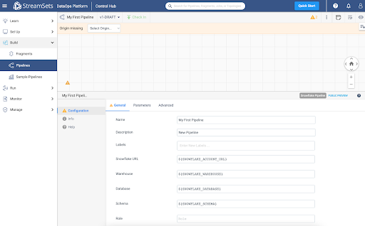

<!-- ------------------------ -->
## Code Snippets, Info Boxes, and Tables
Duration: 2

Every Transformer for Snowflake pipeline must have an origin and a destination. For this pipeline, select the Snowflake Table Origin from either the drop down menu at the top of the canvas or from the full menu of processors on the right.

Click on the Table origin, under the General tab, and name it 'Employees', and on the Table tab, enter the table name **EMPLOYEES**. This will be the Dimension table that tracks the employee data.

Add a second Snowflake Table origin to the canvas. This origin will be for a feed of updated Employee data. Under the General tab, name the origin 'Updates' and on the Table tab, enter **UPDATE_FEED**.

At this point, run the first section of SQL in the SQL Script file to create and populate the **EMPLOYEES** and **UPDATE_FEED** tables in a Snowflake Worksheet. You will need to substitute the names of your database and schema into the script if you already have your own that you want to use.

<!-- ------------------------ -->
## Add Slowly Changing Dimension
Duration: 2

Now add the **Slowly Changing Dimension** processor from the top menu (which only appears when the origin is selected on the canvas) or from the right side menu of all Processors. Make sure the Employees Table Origin is connected to the Slowly Changing Dimensions.

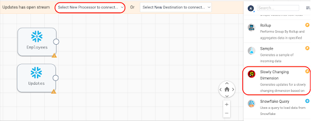

First, connect the **Employees** origin to the Slowly Changing Dimension processor. Next, connect the **Updates** origin to the Slowly Changing Dimension process. The line connecting from Employees to the SCD processor should have a 1 where it connects to the SCD, and the line connecting the Updates origin should have a 2, as shown: 

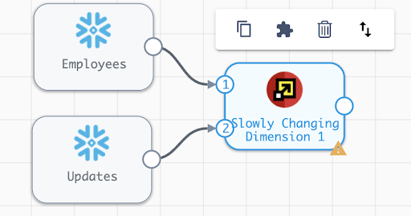

If the inputs are not numbered correctly, select the up and down arrows button from the menu that appears when the SCD processor is selected, and the order of the inputs will be swapped.

In the settings for the Slowly Changing Dimension, add the following configurations: 
- SCD Type: **Type 2**
- Key Fields: **ID**
- Specify Version Field: **Checked**
- Version Field: **VERSION**
- Specify Active Flag: **Checked**
- Active Flag Field: **ACTIVE_FLAG**
- Active Field Type: **True-False**
- Specify Timestamp Fields: **Checked**
- Start Timestamp Field: **START_TIMESTAMP**
- End Timestamp Field: **END_TIMESTAMP**
- Timestamp Expression: **CURRENT_TIMESTAMP** (Default Value)
- Behavior for New Fields: **Remove from Change Data**

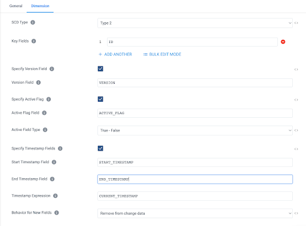

<!-- -------------------------->
## Add Snowflake Table Destination
Duration: 2

The final step to complete this pipeline is to add the Table Destination.  

Select **Snowflake Table** from the “Select New Destination to connect” menu at the top of the canvas or the menu on the right, just be sure to select the Snowflake Table Destination, indicated by the red “D”.  

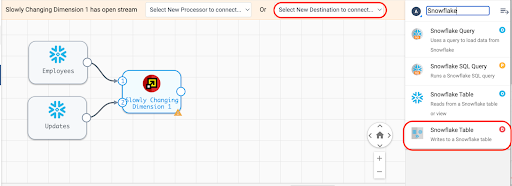

The destination can be renamed on the General tab, and on the Table tab, update the following settings:
- Table: **EMPLOYEES**
- Write Mode: **Propagate updates from Slowly-Changing Dimension processor**
- Create Table: **Unchecked**
- Data Drift Enabled: **Checked**

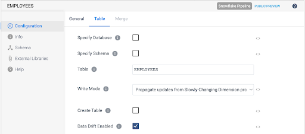

<!-- -------------------------->
## Preview Results
Duration: 2

Now that the pipeline has sources and a target, there should be no validation warnings showing, and the pipeline can be previewed. 

Activate the preview by selecting the eye icon in the top right of the canvas.

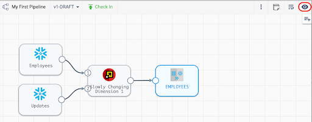

This will cause the preview settings to appear. For this example, check the box next to “Write to Destinations,” which will do exactly what it says. It will perform the merge on the EMPLOYEES table. Usually, you would leave this unchecked if you just want to see what the pipeline will produce without any side effects. Now hit the Run Preview button.

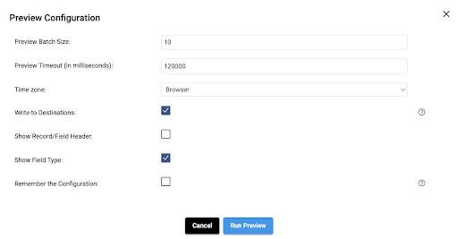

The preview will generate the SQL that represents the pipeline and it will return the results for each processor. Since there are fewer than ten total records in the two origin tables, there is no need to adjust the default **Preview Batch Record** size of 10 records.

Once the preview is loaded, clicking on any of the processors will show a sample of records from the input and output streams. Selecting the Slowly Changing Dimension processor should result in an output like this:

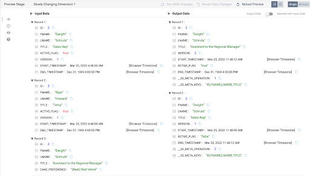

There are a few things to observe.
- The input side shows the first two records that are already loaded in the EMPLOYEES table and the third record comes from the UPDATE_FEED table.  
- There are no update records for ID 3, **Ryan Howard**, and that record does not appear in the output stream.
- The UPDATE_FEED does contain a title update for ID 2, **Dwight Schrute**, so the output stream has 2 corresponding records. One record that will serve as the update record to make the old record with the Title “**Sales Rep**” inactive, and a record that will be inserted as the new active record, with the title “**Assistant to the Regional Manager**”. 
- Note that the UPDATE_FEED record on the input has an additional column **CAKE_PREFERENCE**, but since the Behavior for New Fields setting was set to **Remove from Change Data** in step 4, this column is just ignored.  

<!-- -------------------------->
## Add a Transformation
Duration: 2

To transform the data in the pipeline, add an **Apply Functions** processor between the **Updates** origin and the **Slowly Changing Dimension** processor. Click on the line connecting the two processors, and then select the **Apply Functions** processor from the menu that appears at the top of the screen. 

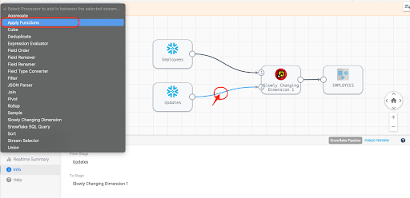

On the Functions tab of the processor, add a simple function to make all the values upper case. This can be done simply by setting **Field Expression** to the regular expression .*, which will include all columns. Set the **Function Type** to **String**, and choose the **UPPER** function from the **String Function** list. 

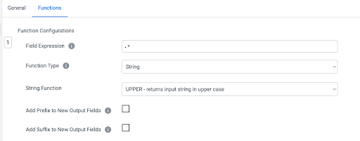

Now preview the results, and select the Apply Functions processor to see the input and output.

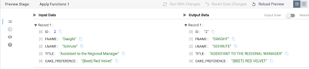

<!-- -------------------------->
## Create and Run Pipeline as a Job
Duration: 2

Before being able to run the pipeline, it needs to be published. Once the preview is closed, check the pipeline in. 

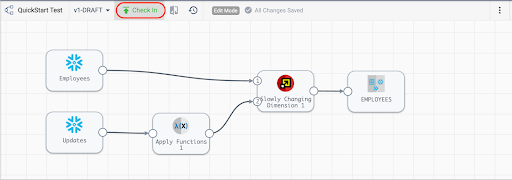

Enter a Commit Message and select **Publish and Next**.

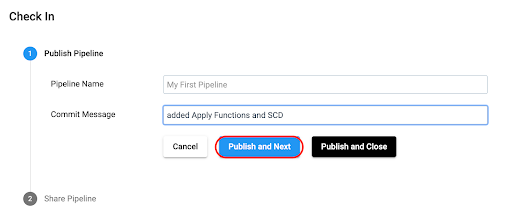

Next, choose **Save and Create New Job.**

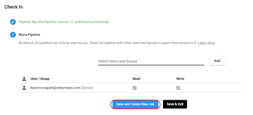

Update the Job name if desired, add a job description, and select **Next**. 
On the **Select Pipeline** option, select **Next**, and select **Save & Next** for the next two options.  

At this point, **Start & Monitor** job 

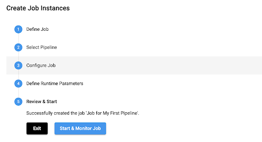

The Job page will now appear, and the job status can be seen at the top of the canvas and in the window below the canvas. 

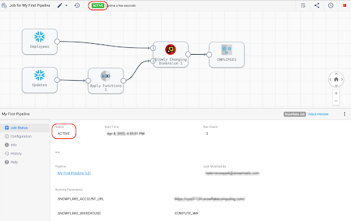

Select the **History** tab on the left menu to see more details about the job run: 

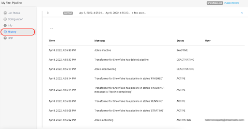

<!-- -------------------------->
## Check Results in Snowflake
Duration: 2

Run the query **SELECT * FROM DEMO.HCM.EMPLOYEES**; to see the updated results in the **EMPLOYEES** table. Here it can be seen that the record with the updated title and upper case names and title was added as a second version of the record, and the previous record was expired.

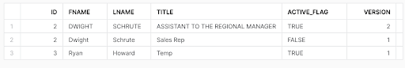

While in Snowflake, check out the Query History to see the Merge record that the StreamSets job created. 

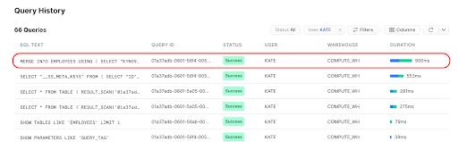

<!-- -------------------------->
## Conclusion
Duration: 2

Congratulations on completing this lab!

### What we've covered
- How to process a Slowly Changing Dimension using Snowpark in the StreamSets DataOps Platform

### Resources
- Get up and running with StreamSets in minutes - free. [Start Now](https://cloud.login.streamsets.com/signup).
- Join our conversation at the [StreamSets Community](https://community.streamsets.com/).
