author: Robert Maybin
id: sundeck_opscenter
summary: This Guide shows you how to quickly get started with Sundeck OpsCenter on Snowflake, a free Native App which providing a range of tools to better understand, manage, and alert on Snowflake activity and spend.
categories: Getting-Started
environments: web
status: Draft 
feedback link: https://github.com/Snowflake-Labs/sfguides/issues
tags: Getting Started, Cost Management, Workload Analytics, Query Monitoring

# Getting Started with Sundeck OpsCenter
<!-- ------------------------ -->
## Overview 
Duration: 1

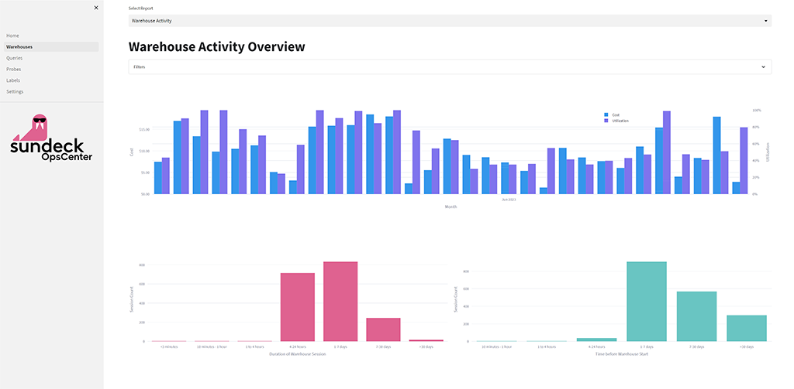

OpsCenter from Sundeck is a free Snowflake Native App which provides a suite of tools to better understand, manage, and alert on Snowflake activity and spend.  Key features of OpsCenter include:

- **Workload Analytics** - Understand and manage Snowflake workload with detailed query reporting and alerts.
- **Custom Query Labeling** - Use **Labels** to collect specific types of queries together, to extend the built-in Workload Analytics reporting for better understanding.
- **Query Monitoring** - Use **Probes** to monitor Snowflake queries based on certain parameters (runtime, cost), and send alerts or cancel queries if they exceed preset thresholds

### Prerequisites

- Access to Snowflake's Native Apps feature (may require Snowflake Support to enable for your account)
- `ACCOUNTADMIN` privileges to perform the initial setup

### What You Will Learn

- How to find, install, and set up the Sundeck OpsCenter Native App
- How to use the built-in reporting in OpsCenter to understand and manage Snowflake spend and workload
- How to create custom Labels to match query patterns and enhance understanding
- How to use the Query Monitoring feature to alert or cancel queries based on certain parameters

### What You Will Build

- A customized solution to understand and better manage your Snowflake environment

<!-- ------------------------ -->
## Get the Native App
Duration: 3

> aside positive
>
> Note that your Snowflake Account may need to be enabled for Native Apps.  If you do not see the "Apps" tab in Snowsight, please contact Snowflake Support to enable Native Apps for your account.

### Find the Sundeck Native App Listing

First, log in to Snowsight in your browser, as a user with `ACCOUNTADMIN` privileges.

Next, we'll locate the listing for the Sundeck OpsCenter Native App, by:
- Navigating to the "Apps" tab in the Snowsight UI:

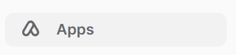

- Selecting "From a Listing" as the source, and searching for "Sundeck":

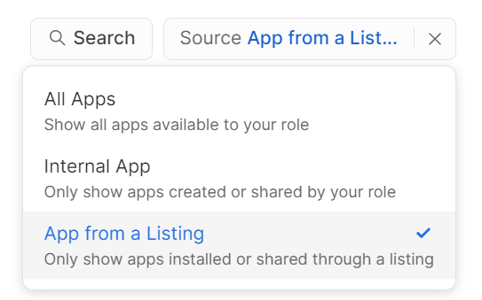

- Searching for "Sundeck":

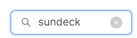

The search will return a result for "OpsCenter" from Sundeck.  Click the "Get" button on the listing.

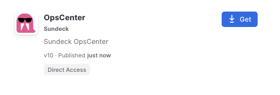

### Native App Listing

You'll be taken to the OpsCenter Native App listing page.  Here, you can learn more about the App and its features:

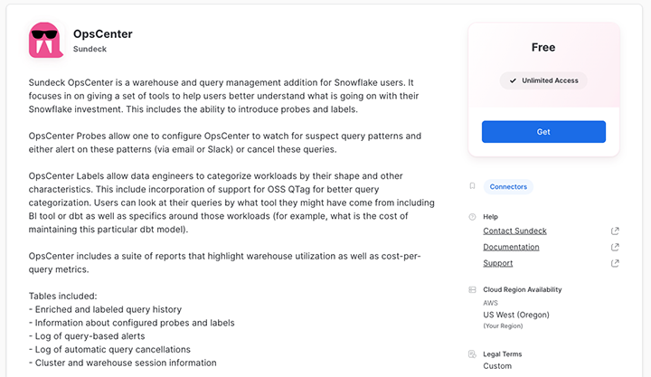

To install the App, click the "Get" button.

### Confirm the Installation

Once you click "Get" on the listing page, you will be prompted to confirm the installation.  Note that the confirmation dialog has an "Options" section, which will allow you to specify the name of the App, as well as the Warehouse which will be used for installation tasks:

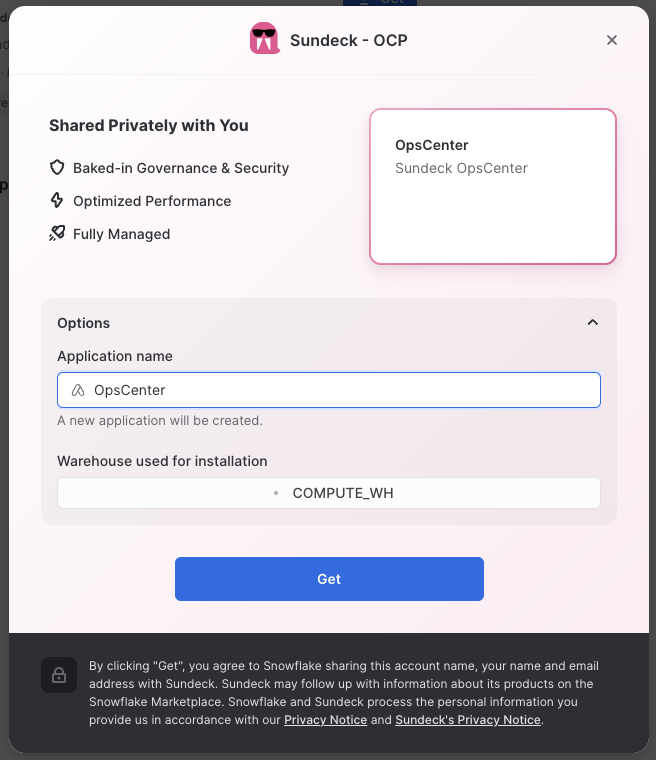

Modify any optional settings, and click "Get" to begin the installation.

> aside positive
>
> Note that the installation may take from 1 - 3 minutes.  Please don't navigate away from the page until the installation is complete.

Once installation is complete, you will see a confirmation dialog, which will offer to take you directly into OpsCenter:

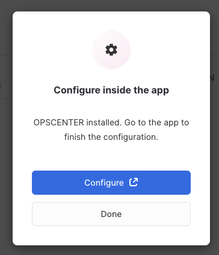

Click "Configure" to complete the local setup of OpsCenter.

> aside positive
>
> For more tips and information about the installation procedure see [OpsCenter FAQs](https://docs.sundeck.io/opscenter/faq/)

## Complete Setup
Duration: 2

Once the Native App is launched, you will be taken to the OpsCenter Home page.  Initially, a list of "Getting Started" tasks will be displayed.  These will disappear once you have completed the setup steps.

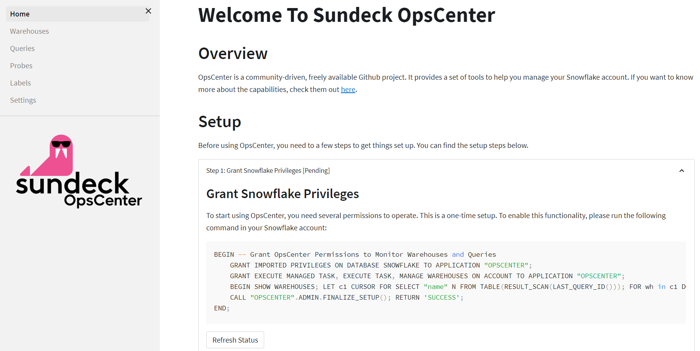

### Grant Permissions

To complete setup, we'll grant a handful of permissions to the OpsCenter application by running the provided SQL script in the "Grant Snowflake Privileges" section.  Just click the "copy to clipboard" button in the upper-right corner of the SQL code block:

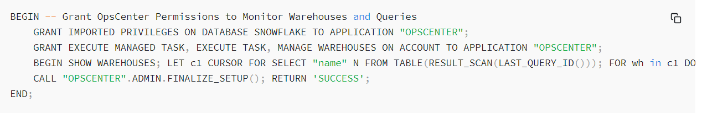

Then paste the script into a new Snowsight Worksheet.  Be sure that you are using the ACCOUNTADMIN role, and click "Run":

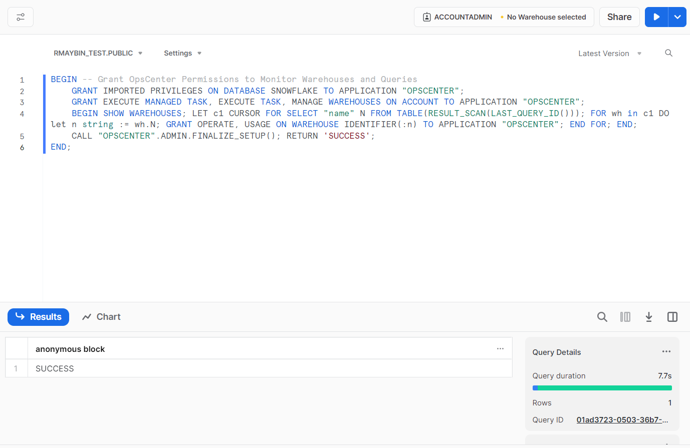

Once the grants have been applied, you can return to the OpsCenter Home page, and click the "Refresh Status" button to confirm that the grants have been applied successfully:

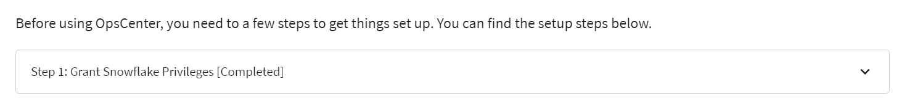

Continue to the next step to start using OpsCenter!

<!-- ------------------------ -->
## View Warehouse Utilization 
Duration: 4

Let's start by exploring one of the built-in reports in OpsCenter.  Click on the "Warehouses" link in the left-hand navigation menu:

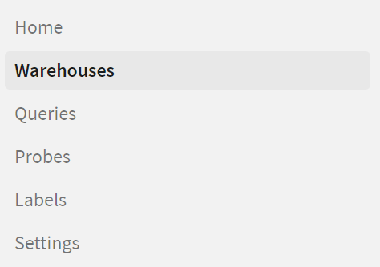

### Warehouse Activity Overview

This will bring up the main Warehouse Utilization report:

This report shows a view of combined activity for all warehouses, indicating daily total cost as well as estimated utilization (percentage of the time the warehouse was used to full capacity).

The time period covered by the chart, as well as the resolution (days, weeks, months) of each bar can be adjusted by using the date filter controls at the top of the page.  In addition, the warehouses included in the chart data can be filtered as well:

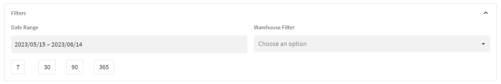

Below the cost and utilization chart are two additional analyses of warehouse activity:

- **Duration of Warehouse Session**: This shows a distribution of the number of Warehouse Sessions by duration.  A Warehouse Session is defined as the time between when a warehouse is started and stopped. 
- **Time before Warehouse Start**: This shows a distribution of the number of warehouse sessions, by how long a particular warehouse was stopped before it was started.

The combination of these metrics can be quite useful for understanding the ratio of quiesced to active time for all warehouses (or particular warehouses as selected in the Filters), and can help inform correct warehouse sizing and auto-suspend settings.

### Utilization Heatmap

In addition, an alternate Heatmap view of warehouse utilization is available, and can be accessed by selecting "Warehouse Heatmap" from the "Select Report" dropdown at the top of the page:

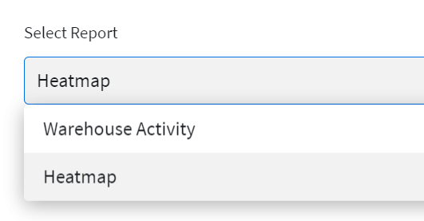

The Heatmap view shows warehouse utilization over time, broken out by day of the week.  Darker shading indicates heavier warehouse utilization, and lighter indicates a higher fraction of idle time.  This information can give immediate insight into whether your warehouses are sized appropriately, and may indicate where sizing needs to be adjusted throughout the week for maximum cost efficiency.

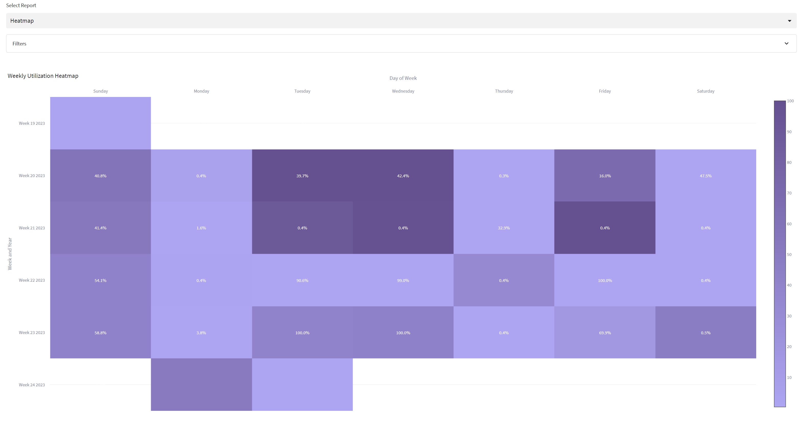

## View Query Activity
Duration: 4

Next, let's look at the query analysis reports.  Click on the "Queries" link in the left-hand navigation menu:

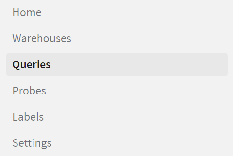

This will load the Query Activity Report by default, as well as a set of available filters for date range, warehouse, and OpsCenter labels (more on these later).  Note that any filter criteria set at the top of the page will apply to other report types available on this Query Activity page.  Filters can be accessed by clicking on the "Filters" dropdown:

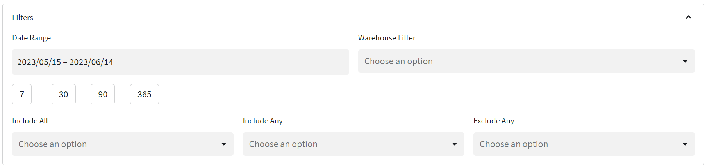

We'll cover advanced aspects of filtering ("Include All", "Include Any", "Exclude Any") in a later section.

Let's quickly step through each of the available reports.

### Query Activity Report

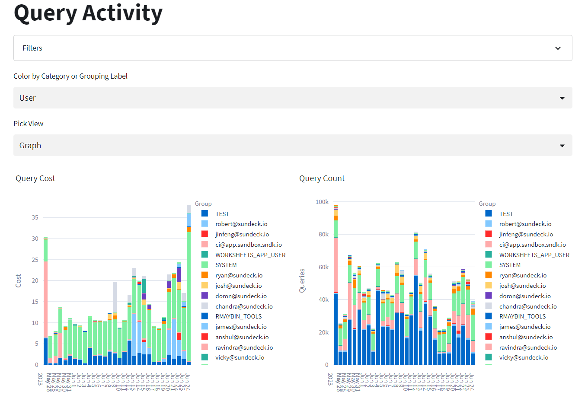

This report provides views of query cost (left graph) and query counts (right graph), along a selected dimension (User, Warehouse, Role, Query Type, and Execution Status).  Each value of the selected dimension is displayed as a different color in the stacked bar chart, and can be included or excluded from the chart by clicking on its value in the legend.

### Top Spenders Report

This report can be accessed by selecting it from the "Select Report" dropdown at the top of the page:

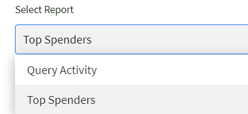

This will load the Top Spenders report:

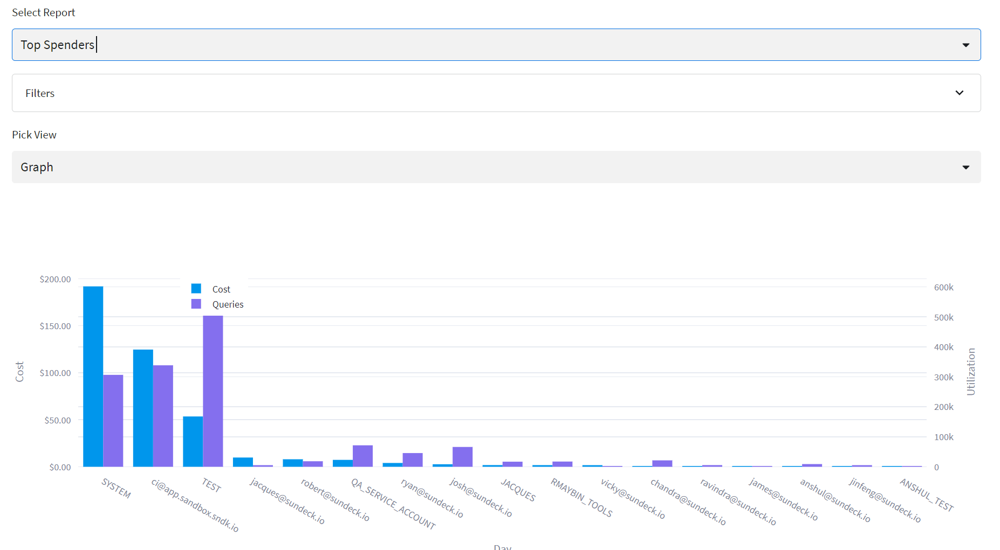

Here we can see the top users by total query cost, as well as the total number of queries for each of these users.  Query cost is an estimate (based on query runtime, warehouse size used by the query, and an estimation of resource utilization based on concurrency), and is intended for relative comparison purposes only.

## Set up Probes
Duration: 4

### Probes Overview 

OpsCenter Probes allow you to configure once-per-minute queries against recent and currently-running query history (using Snowflake's `QUERY_HISTORY( )` table function), and take action based on defined conditions.

There are 2 elements to an OpsCenter Probe:
- **What to Check For**: This is the Probe Condition, which is a valid WHERE clause that can be applied to a query of the `INFORMATION_SCHEMA.QUERY_HISTORY()` table function.
- **What to Do**: If the Probe Condition evaluates to `TRUE`, the Probe can send an alert (email), cancel the query, or both. 

> aside positive
>
>Note that to sending email notificatons requires enabling additional OpsCenter features.  Please see section 8 of this Guide (Enable Notifications) for more information.

### Create a Probe

Next, let's set up a Probe to monitor queries based on certain parameters.  We'll start by building a new Probe to check for queries which run longer than 5 minutes, and cancel them if they are found.

Click on the "Probes" link in the left-hand navigation menu:

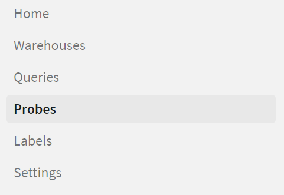

To create a new Probe, we'll click "New":

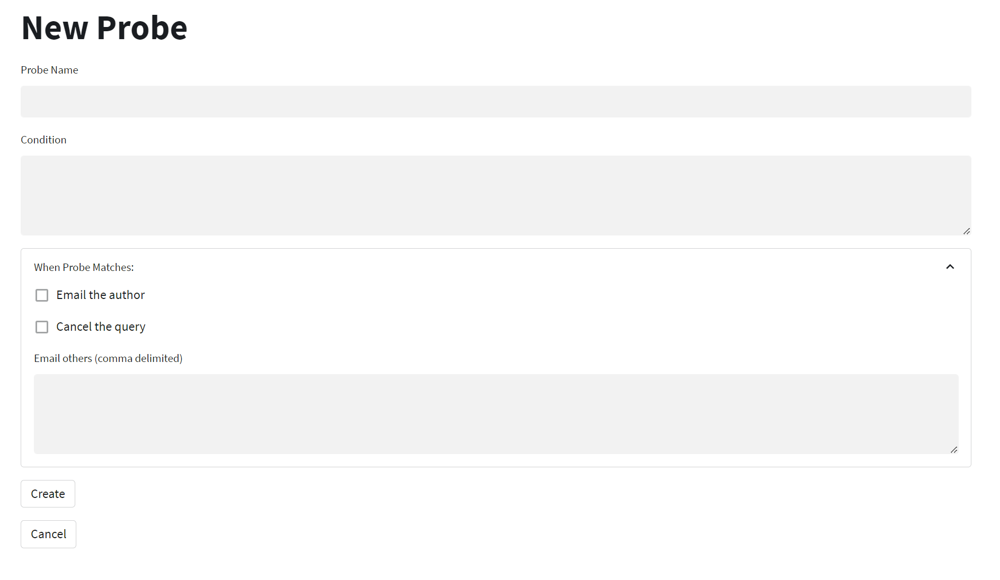

We simply choose a name for our new Probe, and then specify the conditions under which we want to be alerted.  Note that the Condition is any valid `WHERE` clause that can be applied to the [`INFORMATION_SCHEMA.QUERY_HISTORY()`](https://docs.snowflake.com/en/sql-reference/functions/query_history) table function.  

In this case, we want to monitor by runtime, so let's use the `EXECUTION_TIME` column to start.  Note this column contains execution times in milliseconds, so in order to find queries with durations longer than 5 minutes, we need to use 300,000 (5 * 60 * 1000) milliseconds.  We do this by entering `EXECUTION_TIME > 300000` in the "Condition" field.

We also need to add one more check in our condition, to ensure that our Probe does not cancel the OpsCenter app itself (which runs as a query in Snowflake).  We'll do this for now by excluding any Streamlit queries, using this clause `AND NOT (query_text ilike 'execute streamlit%')`.

> aside positive
>
>Note that when provided as a Probe Condition, the WHERE clause does not include the keyword `WHERE`.

Finally, we need to select what we want to happen when queries are found that meet our condition.  In this case, we will select "cancel".

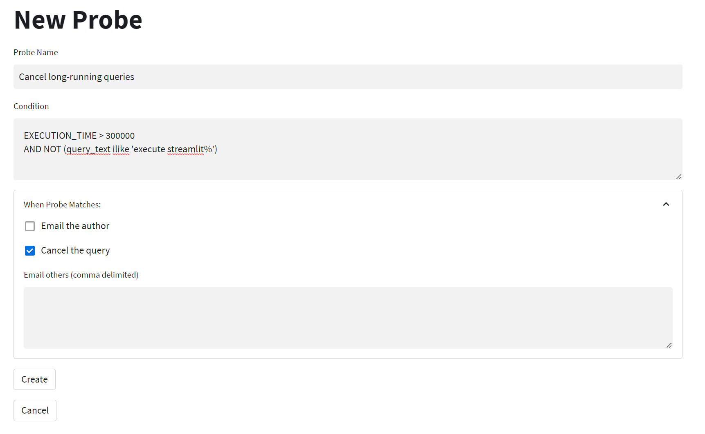

Cick "Create" to create the Probe.  After a few seconds, you'll be taken back to the list of Probes, and you'll see your new Probe listed:

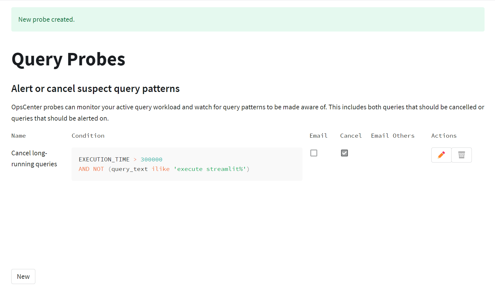

From here, you can create further Probes, or modify/delete existing Probes.

## Create Labels
Duration: 4

### Labels Overview

OpsCenter Labels allow you to tag historical queries based on conditions you specify, and then filter Query Activity reports based on these Labels.  This allows you to better understand your workload, and to drill down into specific types of queries.

A Label consists of:

- **Label Name**: A unique name for the Label.  This name will appear in filter dropdowns in the Query Activity reports.
- **Label Type**: OpsCenter labels can be either "Ungrouped" or "Grouped" labels.  Any number of Ungrouped labels can be applied to a single query, but only a single label within a given Group can be applied to one query.  You can think of "Grouped" labels as providing "binning" of queries, whereas "Ungrouped" labels act more like tags.
- **Label Condition**: This is valid WHERE clause which can be applied to Snowflake's `SNOWFLAKE.ACCOUNT_USAGE.QUERY_HISTORY` table.  In addition, [QTag functions](https://docs.sundeck.io/reference/conditions/qtag/) can be used in Label Conditions to provide more advanced matching.

### Creating Labels

Let's first navigate to the Labels page by clicking on the "Labels" link in the left-hand navigation menu:

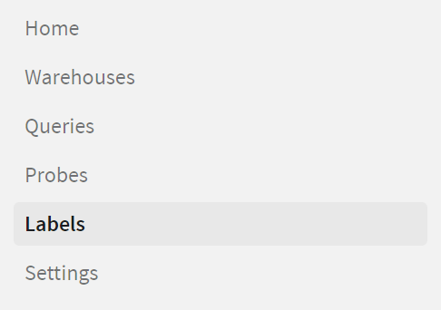

You'll see that initially, there are no Labels configured in the system.  Let's create one!

There are two buttons below the labels listing:  "New", which creates a new Ungrouped label, and "New (in group)" which creates a new Grouped label.  We'll start with the simplest case, an Ungrouped label.  Click "New":

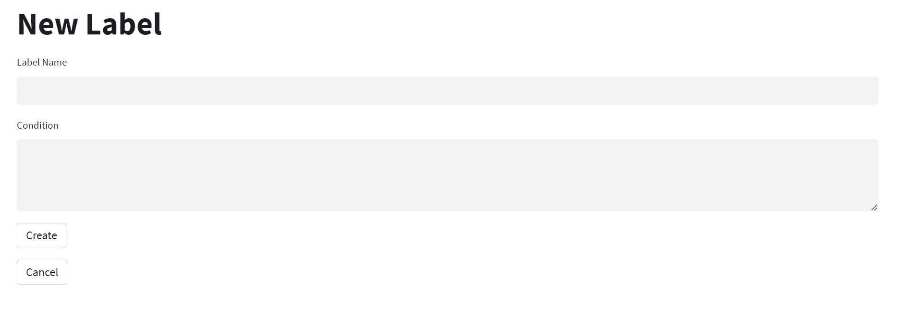

All we need to provide is the label name, and the label condition.  In this example, let's create a label which matches all queries which Snowflake had to spill to disk during processing.  We'll call the label "Spilled", and provide the condition `BYTES_SPILLED_TO_LOCAL_STORAGE > 0 OR BYTES_SPILLED_TO_REMOTE_STORAGE` (where clause on QUERY_HISTORY):

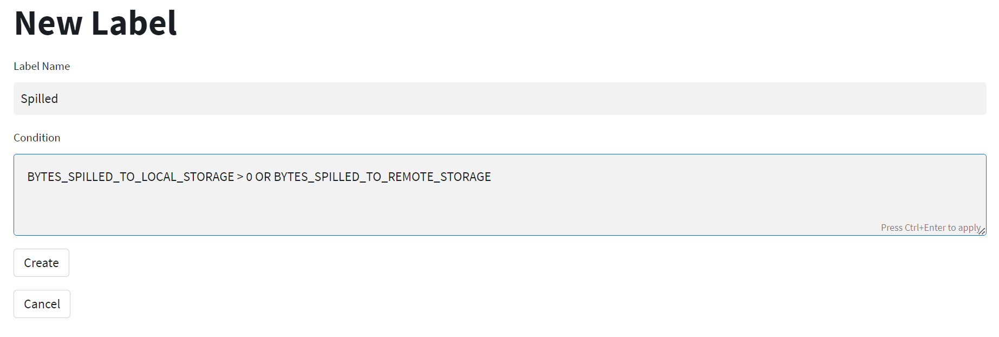

Click "Create" to save the label definition. You'll be taken back to the Labels listing page, and you'll see your new label listed:

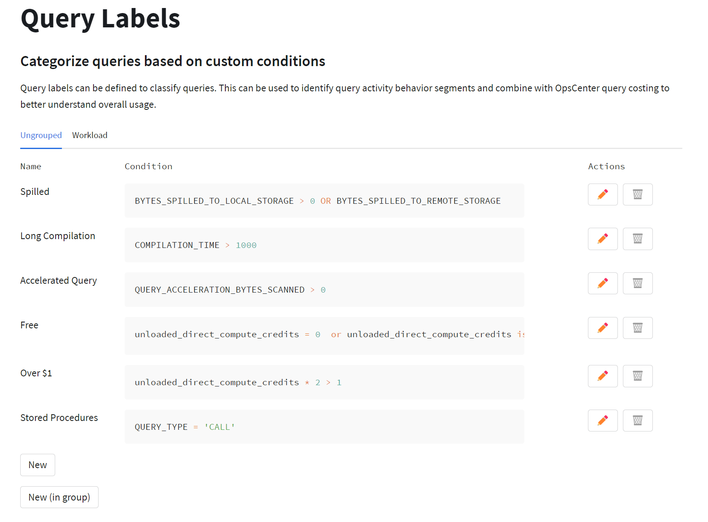

### Using Labels in Reports

Once you have created one or more OpsCenter Labels, they can be used in the advanced Filter Conditions on the Query Activity reports:

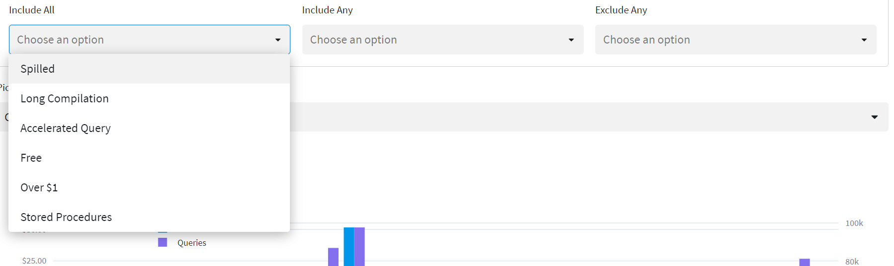

The dropdowns are fairly straightforward; each can contain muliple selections.  Multiple selections in "Include All" are `AND`ed together, meaning only queries which match all selected labels will be shown.  Multiple selections in "Include Any" are `OR`ed together, such that queries matching any of the selections are shown.  Selections in "Exclude Any" will be excluded from the results.

> aside positive
>
> Note that it is possible to select a combination of Label filter conditions which are mutually exclusive, and result in no queries being displayed on the report.  If you end up with a blank report after modifying filter conditions, go back and clear one or more of the Label filters and try again.

### Grouped Labels

Grouped Labels are similar to Ungrouped Labels, but with one key difference:  Only one Label within a given group can be applied to a single query.  This allows you to "bin" queries across the labels in a group, then filter on that group to see a breakout of the data across all labels in the group.

For example, you could create a Grouped Label called "Long Running Queries", and then create a number of Labels within that group, each with a different runtime threshold.  This would allow you to filter on "Long Running Queries" and see all queries which ran longer than a certain threshold, with a breakout by duration "bins".

To create Grouped labels, click on the "New (in group)" button, and you will notice that there are two additional fields to fill in ("Group Name" and "Rank"):

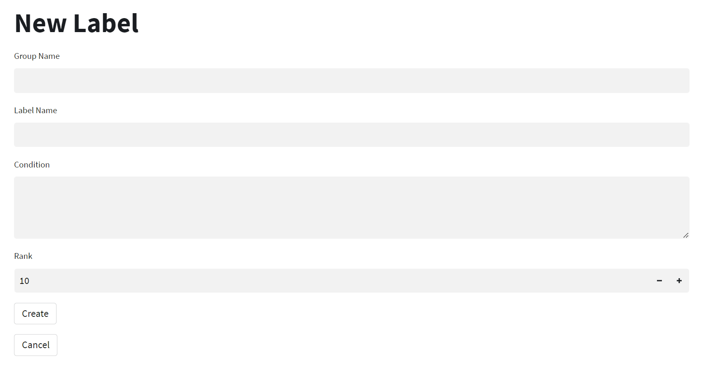

Since Group labels are effectively "binning" all queries into one of the labels within the group, the label conditions need to be tested in a specific order to provide deterministic results.  To establish the order, set the Rank value relative to the other labels within the same group.  Lower Rank numbers will be evaluated first.

## Enable Notifications (Optional)
Duration: 4

To enable OpsCenter Probes to send notifications by email, we'll create a free Sundeck account.  

From the OpsCenter Home Page, scroll down to the "Enable Notifications" section:

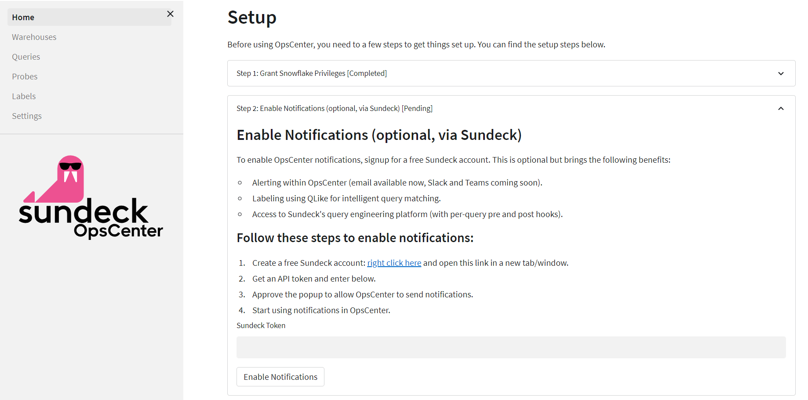

### Step 1: Right-click the link to create a free Sundeck account

Next, we'll create a free Sundeck account, by right_clicking the link in Step 1 "Create a Free Sundeck Account".

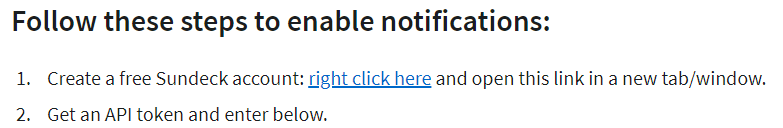

This will open the Sundeck Signup page in a new window.  We'll just need a couple of pieces of information to create the account:
- Google login, or an email address and password
- Your Snowflake Account locator and Region

First, let's sign in.  In this example, we'll use email and password:

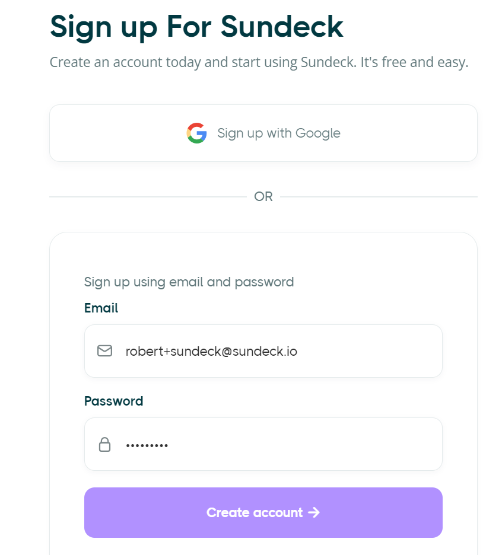

This will send a verification email to the email address provided.  We'll need to open that email to retrieve the 6-digit verification code, and paste that when requested.

Once signed in, we'll be presented with a single page to enter the remaining information:

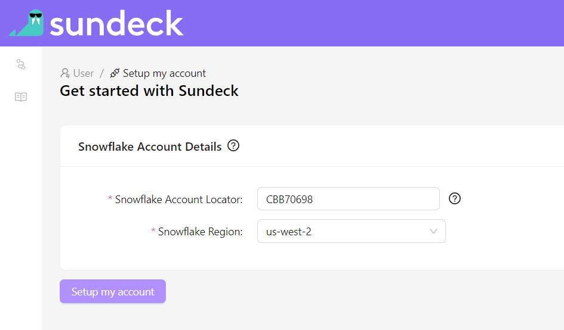

That's it!  We now have a new Sundeck account!

### Step 2: Create a Sundeck Token

To create a token for use in OpsCenter, navigate to the "Account Settings" menu by clicking your username in the upper-right corner of the Sundeck Web UI:

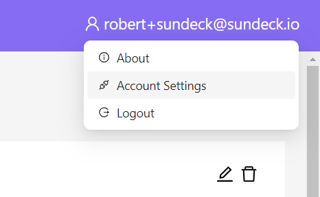

Then scroll down to the bottom of the page to the "Tokens" section, and click "Create Token"to create a new token.  In the New Token dialog that appears, give this new token a name (such as "OpsCenter"), then click "Generate Token":

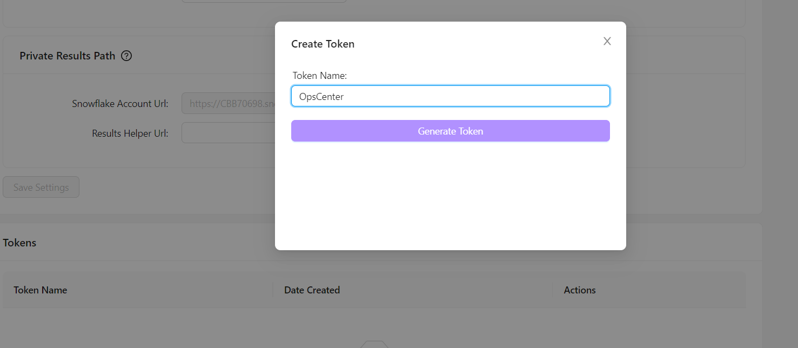

The token will be displayed, along with a "Copy to clipboard" button.  Copy the token to the clipboard.

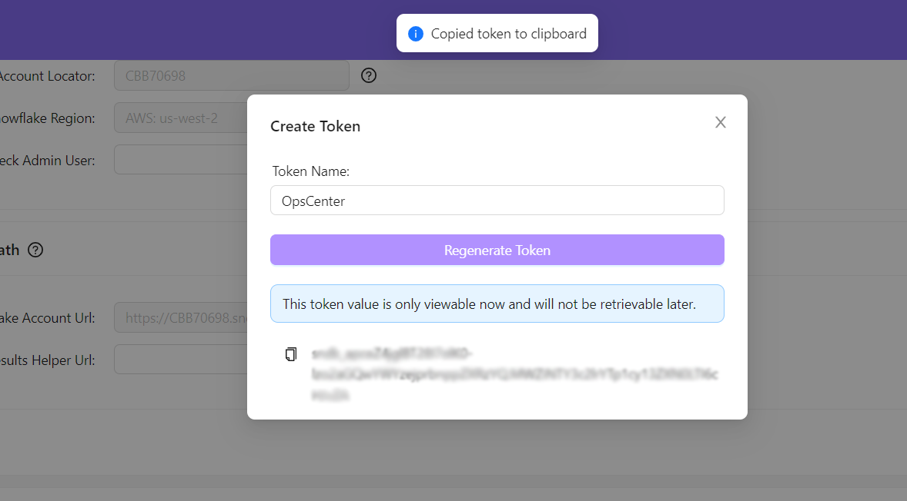

### Step 3: Provide the new token to OpsCenter

Return to OpsCenter, and paste the token into the Sundeck Token field, and click the "Enable Notifications" button:

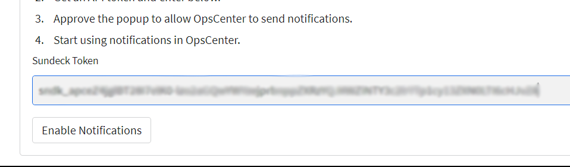

Snowflake will ask you to confirm that it's OK to create an API integration.  Click "Allow".

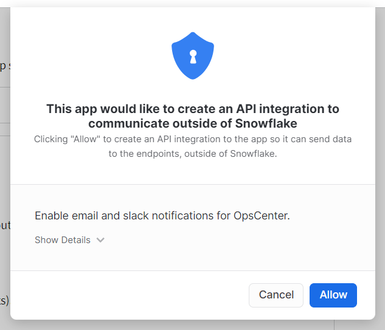

You've now connected OpsCenter to Sundeck.  Continue to the next step to learn about the advanced OpsCenter features you've just enabled!

## Advanced Features (Optional)
Duration: 1

If you have chosen to connect OpsCenter to a free Sundeck account, you can now take advantage of a number of advanced features within OpsCenter, such as Notifications and advanced query pattern matching in Labels and Probes.

### Notifications

OpsCenter Probes can send emails via the Sundeck SaaS platform.

These extended alerting and messaging features are provided to your Snowflake account (and OpsCenter) via Snowflake [External Functions](https://docs.snowflake.com/en/sql-reference/external-functions-introduction), which when called from within Snowflake will send messages through Sundeck.

### Advanced Query Pattern Matching

Once connected to Sundeck, you will be able to use the QLike( ) function within Label and Probe condition expressions.  QLike provides very powerful query generalization and matching capabilities.  

You can learn more about [QLike concepts](https://docs.sundeck.io/concepts/qlike/) and see [QLike examples](https://docs.sundeck.io/advanced/qlike-recipes/) in the [Sundeck documentation](https://docs.sundeck.io/).

<!-- ------------------------ -->
## Conclusion
Duration: 1

Now that you've installed and configured the Sundeck OpsCenter Native App, you can use the built-in reports to better understand your Snowflake usage and spend, and drill down further into usage by building your own Labels.  You can also set up Probes to regularly check for certain conditions, and alert (or cancel) queries if they exceed certain cost or time limits.

These tools run entirely within your Snowflake account, and do not require any external services or infrastructure.  If you want to act on queries in real time *before* they are submitted to Snowflake, we recommend you check out [Sundeck's SaaS offering](https://sundeck.io)!

### What We Have Covered

- Installing and configuring the Sundeck OpsCenter Native App
- Viewing and drilling into Warehouse Utilization, Queries, and Cost metrics
- Creating custom Labels to enhance understanding of workload
- Setting up Query Probes to monitor, alert, and cancel queries based on certain parameters
- Optionally connecting your Sundeck account to OpsCenter to enable additional features
