authors: Reid Lewis, Cameron Shimmin
id: supply-chain-assistant-with-snowflake-intelligence
categories: snowflake-site:taxonomy/product/ai, snowflake-site:taxonomy/solution-center/certification/certified-solution, snowflake-site:taxonomy/snowflake-feature/cortex-analyst, snowflake-site:taxonomy/snowflake-feature/cortex-search
language: en
summary: Build an intelligent supply chain assistant using Snowflake Intelligence and Cortex AI capabilities to help operations managers make data-driven inventory management decisions. 
status: Published
environments: web
feedback link: https://github.com/Snowflake-Labs/sfguides/issues
fork repo link: https://github.com/Snowflake-Labs/sfguide-supply-chain-assistant-with-snowflake-intelligence


# Supply Chain Assistant for Inventory Optimization with Snowflake Intelligence


## Overview

Modern supply chain operations face a critical challenge: efficiently managing raw material inventory across multiple manufacturing facilities. Operations managers must constantly balance inventory levels, deciding whether to transfer materials between plants with excess and shortage, or purchase new materials from suppliers. Making these decisions manually is time-consuming, error-prone, and often results in suboptimal cost outcomes.

This quickstart demonstrates how to build an intelligent supply chain assistant using Snowflake Intelligence and Cortex AI capabilities. By combining natural language querying with semantic search over both structured and unstructured data, you'll create a complete solution that helps operations managers make data-driven decisions about inventory management.

### The Problem

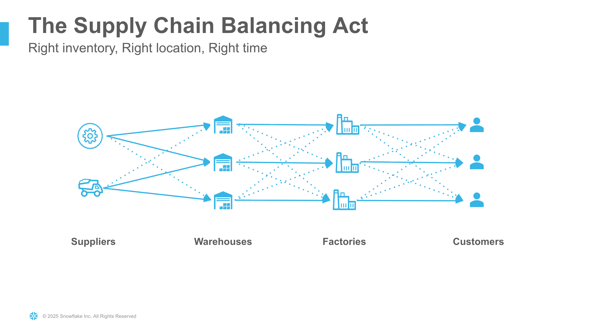

Supply chain operations managers face daily challenges managing raw material inventory across manufacturing facilities:

* **Inventory Imbalances**: Some plants have excess raw materials while others face shortages, creating inefficiency
* **Complex Decision Making**: Determining whether to transfer materials between plants or purchase from suppliers requires analyzing multiple factors including material costs, transport costs, lead times, and safety stock levels
* **Manual Analysis**: Traditional approaches require running multiple reports, spreadsheet analysis, and manual cost comparisons
* **Time Sensitivity**: Inventory decisions need to be made quickly to avoid production delays or excess carrying costs

### The Solution

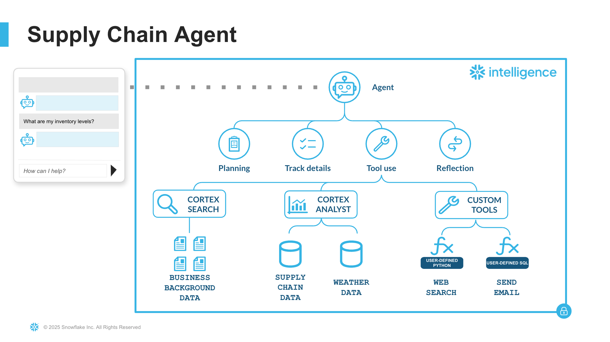

This solution leverages Snowflake Intelligence and Cortex AI capabilities to create an intelligent assistant that:

1. **Answers Ad-Hoc Questions**: Operations managers can ask natural language questions about inventory levels, orders, shipments, and supplier information - the agent automatically converts questions to SQL and executes them
2. **Provides Contextual Information**: The assistant can search and retrieve relevant information from supply chain documentation using semantic search
3. **Intelligent Routing**: Automatically determines whether to query structured data (via Cortex Analyst) or search documents (via Cortex Search) based on the nature of the question
4. **Complex Analysis**: Handles sophisticated multi-table queries like identifying plants with low inventory alongside plants with excess inventory of the same materials, and comparing costs between suppliers and inter-plant transfers
5. **No-Code Agent Creation**: Build and deploy the entire solution using Snowflake Intelligence's visual interface without writing application code

### Prerequisites

* A Snowflake account with Cortex features enabled
* A Snowflake account login with ACCOUNTADMIN role OR a role that has the ability to create databases, schemas, tables, stages, and Cortex Search services
* Cortex Analyst, Cortex Search, and Snowflake Intelligence must be available in your Snowflake region
* Familiarity with Snowflake SQL and Snowsight interface

> aside negative
> **Note:** The custom tools for web search and web scraping require external integration access, which is not available on trial accounts. You can still complete this quickstart without these tools by skipping the custom tool setup steps.

### What You'll Learn

* How to model a multi-tier supply chain in Snowflake with proper relationships
* How to create semantic models for Cortex Analyst with dimensions, measures, and verified queries
* How to set up Cortex Search services on unstructured documents
* How to build comprehensive AI agents using Snowflake Intelligence
* How to combine multiple semantic models in a single agent for cross-domain analysis
* How to integrate custom tools (functions and stored procedures) into your agent
* How to enable web search and scraping capabilities within your AI assistant
* How to write effective tool descriptions and semantic models for accurate AI responses
* How to handle complex analytics questions that span multiple data sources

### What You'll Build

* A comprehensive supply chain database with 11 tables and realistic sample data
* Two semantic models: one for supply chain data and one for weather forecasts
* A Cortex Search service indexed on supply chain documentation
* A Snowflake Intelligence agent with 7 tools:
  * 2 Cortex Analyst tools (supply chain and weather data)
  * 1 Cortex Search tool (documentation)
  * 4 Custom tools (web search, web scraping, HTML newsletter generation, email sending)
* Complex verified queries for inventory analysis, cost comparison, and rebalancing opportunities
* A production-ready AI assistant that combines structured data, unstructured data, and external web sources

<!-- ------------------------ -->

## Snowflake Cortex and Intelligence

### What is Snowflake Cortex?

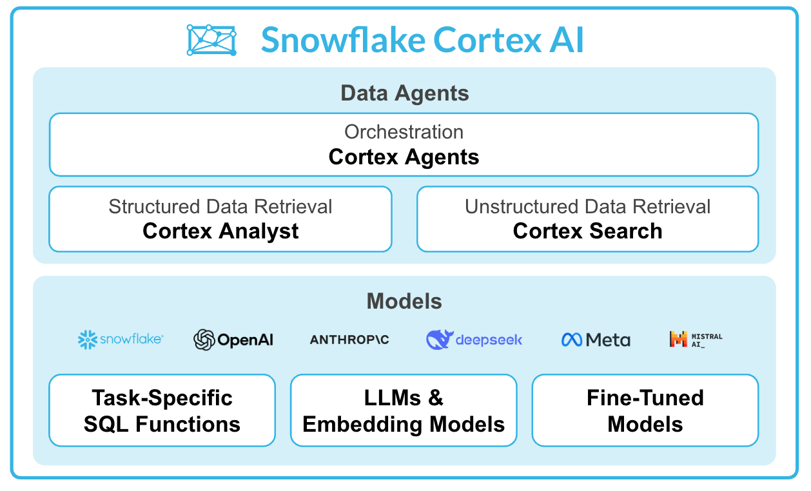

Snowflake Cortex provides fully managed Generative AI capabilities that run securely within your Snowflake environment and governance boundary. Key features include:

**Cortex Analyst** - Enables business users to ask questions about structured data in natural language. It uses a semantic model to understand your data and generates accurate SQL queries automatically.

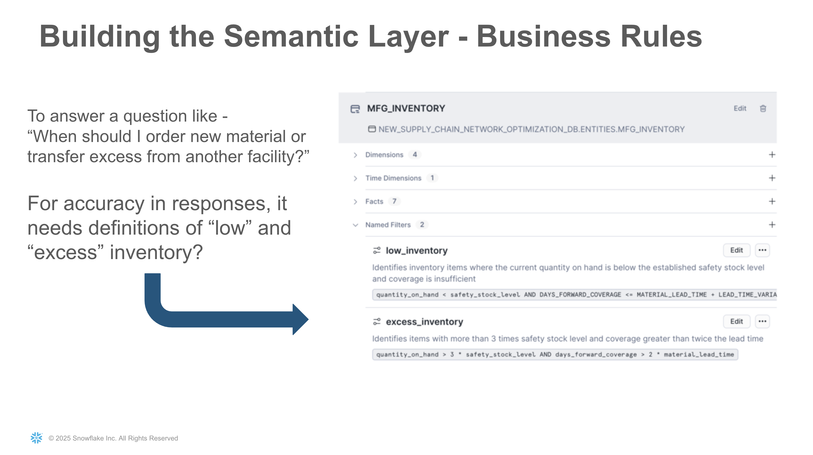

The semantic model definitions you create are automatically translated into SQL code that powers the natural language queries. For example, defining business concepts like "Low Inventory" and "Excess Inventory" in the semantic model results in precise SQL WHERE clauses:

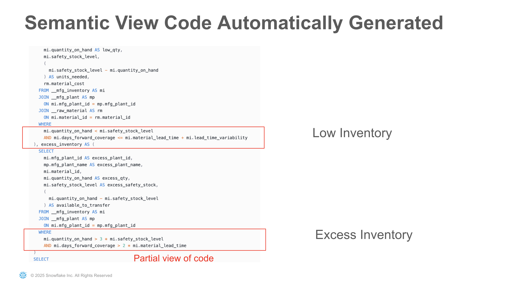

**Cortex Search** - Provides easy-to-use semantic search over unstructured data. It handles document chunking, embedding generation, and retrieval, making it simple to implement RAG (Retrieval Augmented Generation) patterns.

**Cortex Agents** - Orchestrates multiple AI capabilities (like Analyst and Search) to intelligently route user queries to the appropriate service and synthesize responses.

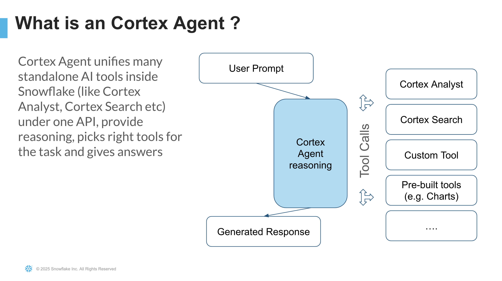

Learn more about [Snowflake Cortex](https://www.snowflake.com/en/product/features/cortex/).

### What is Snowflake Intelligence?

Snowflake Intelligence is a unified experience for building and deploying AI agents within Snowflake. It provides:

* **No-Code Agent Builder**: Create agents that combine multiple tools (Cortex Analyst, Cortex Search, Custom Tools) without writing code
* **Integrated Tools**: Easily connect your semantic models and search services as agent capabilities
* **Conversational Interface**: Interact with your agent through a chat interface within Snowsight
* **Enterprise Ready**: Built on Snowflake's security and governance foundation

Here's what Snowflake Intelligence looks like in action for supply chain operations. Users can ask natural language questions about their data, and the agent automatically generates SQL queries, executes them, and returns results:

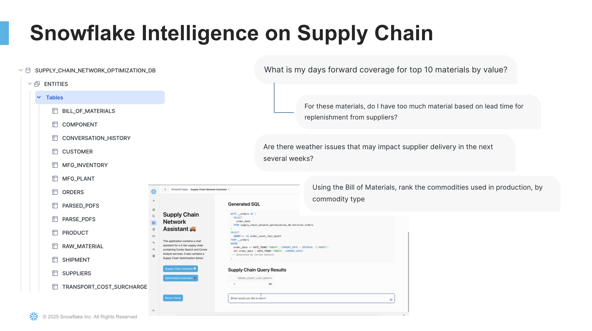

Learn more about [Snowflake Intelligence](https://docs.snowflake.com/en/user-guide/snowflake-cortex/snowflake-intelligence).

<!-- ------------------------ -->

## Setup Database and Load Data


> **Note:** All SQL scripts, semantic models, and PDF files referenced in this quickstart can be accessed by clicking the **Fork Repo** button at the top of this page. This will take you to the GitHub repository containing all necessary files for this tutorial.

In this step, you'll create the complete supply chain database infrastructure with all necessary tables, stages, and sample data.

The database will model a multi-tier supply chain network with suppliers, manufacturing plants, and customers. The demo considers key operational factors including inventory levels, demand, safety stock, lead times with variability, and costs. The intelligent assistant will help answer critical questions like "When do I order more material vs. transfer from another facility?"

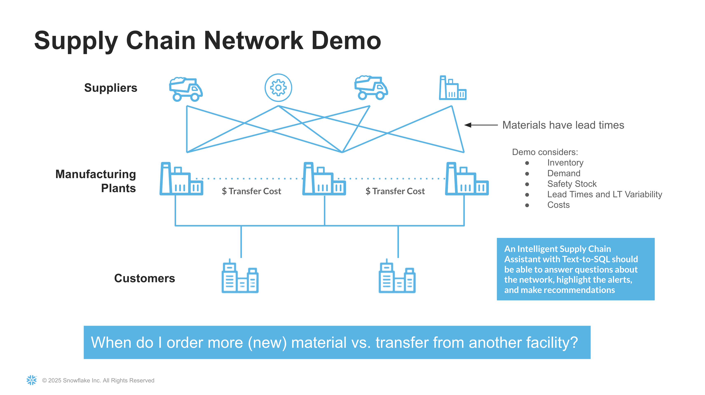

1. Navigate to [**Projects > Workspaces**](https://app.snowflake.com/_deeplink/#/workspaces/?utm_source=quickstart&utm_medium=quickstart&utm_campaign=-us-en-all&utm_content=app-supply-chain-assistant-with-snowflake-intelligence) to create a new private workspace in Snowsight
2. Add a new SQL file to your workspace
3. Import the **scripts/setup.sql** file from the quickstart repository
4. Click **Run All** to execute the entire script

This script will create:

* **Database**: `SUPPLY_CHAIN_ASSISTANT_DB` with schemas `ENTITIES` and `WEATHER`
* **Warehouse**: `SUPPLY_CHAIN_ASSISTANT_WH`
* **Supply Chain Tables**: Including suppliers, plants, inventory, customers, orders, shipments, and more
* **Internal Stages**: For storing PDFs and semantic model files
* **Sample Data**: Realistic data loaded via INSERT statements for all tables
* **Custom Functions and Procedures**: Web search, web scraping, email, and HTML newsletter generation capabilities

The database schema models a complete supply chain network with:

* Manufacturing plants located in multiple cities
* Suppliers providing raw materials
* Customers placing orders for finished goods
* Inventory tracking for both raw materials and finished goods
* Shipment records with tracking information
* Weather forecast data for plant locations

Here's the complete Entity Relationship Diagram (ERD) showing all tables and their relationships:

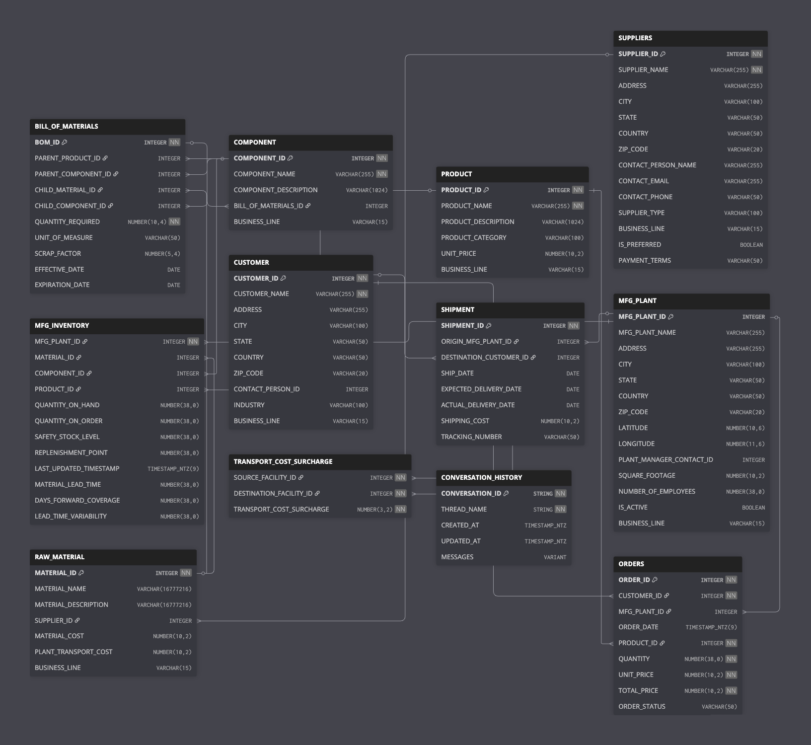

<!-- ------------------------ -->

## Upload Documents and Models

Within the first step, all objects have been created in `SUPPLY_CHAIN_ASSISTANT_DB.ENTITIES` database/schema. Now you'll upload the necessary files to the internal stages.

### Upload PDF Documents

1. Navigate to **Database Explorer** from the left side menu under **Catalog**
2. Navigate to the `SUPPLY_CHAIN_ASSISTANT_DB.ENTITIES` database/schema
3. Click on **Stages** to view available stages
4. Select the **SUPPLY_CHAIN_ASSISTANT_PDF_STAGE** stage
5. Click the **+ Files** button on the top right
6. Upload the **pdfs/Supply Chain Network Overview.pdf** file from the quickstart repository

### Upload Semantic Model Files

1. In the same Stages view, select the **SEMANTIC_MODELS_STAGE** stage
2. Click the **+ Files** button
3. Upload both semantic model files:
   * **scripts/semantic_models/SUPPLY_CHAIN_ASSISTANT_MODEL.yaml**
   * **scripts/semantic_models/WEATHER_FORECAST.yaml**

These semantic models define the structure, relationships, and verified queries that Cortex Analyst will use to answer natural language questions about your supply chain and weather data.

<!-- ------------------------ -->

## Create Cortex Search Service

You have two options to create the Cortex Search service that will enable semantic search over your supply chain documentation.

### Option A: Using SQL Script

1. In your workspace in Snowsight, add a new SQL file
2. Import the **scripts/configure_search_services.sql** file from the quickstart repository
3. Click **Run All** to execute the script

This script will:

* Parse PDFs using Cortex PARSE_DOCUMENT function
* Chunk the content into searchable segments using recursive character splitting
* Create the `PARSED_PDFS` table with presigned URLs for document access
* Create the `SUPPLY_CHAIN_INFO` Cortex Search service
* Set up a task to refresh presigned URLs daily (they expire after 7 days)

The search service will automatically index the parsed and chunked PDF content, making it available for semantic search queries.

### Option B: Manual Creation via Snowsight UI

If you prefer to create the search service manually through the UI:

#### Step 1: Prepare the Data (SQL Required)

Even with the UI approach, you'll need to run SQL to parse and prepare the documents. In your workspace, add a new SQL file and run:

```sql
USE SUPPLY_CHAIN_ASSISTANT_DB.ENTITIES;
USE WAREHOUSE SUPPLY_CHAIN_ASSISTANT_WH;

-- Scale up warehouse for PDF parsing
ALTER WAREHOUSE SUPPLY_CHAIN_ASSISTANT_WH SET WAREHOUSE_SIZE = 'X-LARGE';

-- Parse PDFs
CREATE OR REPLACE TABLE PARSE_PDFS AS 
SELECT RELATIVE_PATH, 
       SNOWFLAKE.CORTEX.PARSE_DOCUMENT(@SUPPLY_CHAIN_ASSISTANT_DB.ENTITIES.SUPPLY_CHAIN_ASSISTANT_PDF_STAGE, 
                                        RELATIVE_PATH, 
                                        {'mode':'LAYOUT'}) AS DATA
FROM DIRECTORY(@SUPPLY_CHAIN_ASSISTANT_DB.ENTITIES.SUPPLY_CHAIN_ASSISTANT_PDF_STAGE);

-- Chunk and prepare content
CREATE OR REPLACE TABLE PARSED_PDFS AS (
    WITH TMP_PARSED AS (
        SELECT RELATIVE_PATH,
               SNOWFLAKE.CORTEX.SPLIT_TEXT_RECURSIVE_CHARACTER(TO_VARIANT(DATA):content, 'MARKDOWN', 1800, 300) AS CHUNKS
        FROM PARSE_PDFS 
        WHERE TO_VARIANT(DATA):content IS NOT NULL
    )
    SELECT TO_VARCHAR(C.value) AS PAGE_CONTENT,
           REGEXP_REPLACE(RELATIVE_PATH, '\\.pdf$', '') AS TITLE,
           RELATIVE_PATH,
           GET_PRESIGNED_URL(@SUPPLY_CHAIN_ASSISTANT_DB.ENTITIES.SUPPLY_CHAIN_ASSISTANT_PDF_STAGE, RELATIVE_PATH, 604800) AS PAGE_URL
    FROM TMP_PARSED P, LATERAL FLATTEN(INPUT => P.CHUNKS) C
);

-- Scale warehouse back down
ALTER WAREHOUSE SUPPLY_CHAIN_ASSISTANT_WH SET WAREHOUSE_SIZE = 'SMALL';
```

#### Step 2: Create Search Service via UI

1. In Snowsight, navigate to [**AI & ML** > **Cortex Search**](https://app.snowflake.com/_deeplink/#/cortex/search?utm_source=quickstart&utm_medium=quickstart&utm_campaign=-us-en-all&utm_content=app-supply-chain-assistant-with-snowflake-intelligence) in the left navigation
2. Click **Create** button
3. Configure the search service:
   * **Database:** `SUPPLY_CHAIN_ASSISTANT_DB`
   * **Schema:** `ENTITIES`
   * **Name:** `SUPPLY_CHAIN_INFO`
   * **Source Table to be Indexed:** `PARSED_PDFS`
   * **Search Column:** Select `PAGE_CONTENT`
   * **Attributes**: Click **Next**
   * **Select Columns**: Select `TITLE`
   * **Target Lag:** `1 hour`
   * **Warehouse:** `SUPPLY_CHAIN_ASSISTANT_WH`
4. Click **Create Search Service**

The search service will begin indexing your parsed PDF content and will be ready to use once indexing completes.

<!-- ------------------------ -->

## Build Snowflake Intelligence Agent

Now that you have your semantic models and search service created, you can combine them into an intelligent agent using Snowflake Intelligence. The agent will intelligently route user questions to the appropriate tool based on the nature of the query.

### Create the Agent

> Ensure you are using SUPPLY_CHAIN_ASSISTANT_ROLE in Snowsight

1. Click [on **Agents**](https://app.snowflake.com/_deeplink/#/agents?utm_source=quickstart&utm_medium=quickstart&utm_campaign=-us-en-all&utm_content=app-supply-chain-assistant-with-snowflake-intelligence) within the **AI & ML** section on the left-hand navigation bar in Snowsight
2. Click **Create Agent** button
3. * **Database** `SNOWFLAKE_INTELLIEGENCE`
4. * **Schema** `AGENTS`
5. **Agent object name** **Supply_Chain_Agent**
6. **Display name** Supply Chain Agent
7. Once created, navigate to **Tools** tab

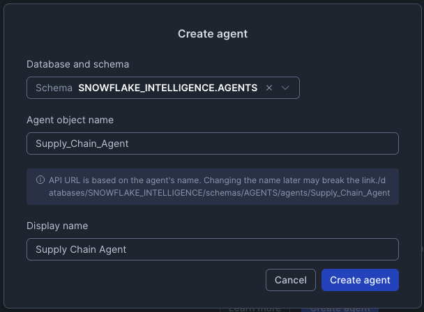

### Add First Cortex Analyst Tool - Supply Chain Data

1. Click **+ Add** next to **Cortex Analyst**
2. Configure the tool:
   * Select the **Semantic model file** radio button
   * **Database** `SUPPLY_CHAIN_ASSISTANT_DB`
   * **Schema** `ENTITIES`
   * **Stage** `SEMANTIC_MODELS_STAGE`
   * Select `SUPPLY_CHAIN_ASSISTANT_MODEL.yaml`
   * **Name:** `SUPPLY_CHAIN_ASSISTANT_MODEL`
   * **Description:** *"Tool for analyzing supply chain data."*
   * **Warehouse:** Select **Custom** radio button then choose `SUPPLY_CHAIN_ASSISTANT_WH`
3. Click **Save**

### Add Second Cortex Analyst Tool - Weather Data

1. Click **+ Add** next to **Cortex Analyst**
2. Configure the tool:
   * Select the **Semantic model file** radio button
   * **Database** `SUPPLY_CHAIN_ASSISTANT_DB`
   * **Schema** `ENTITIES`
   * **Stage** `SEMANTIC_MODELS_STAGE`
   * Select `WEATHER_FORECAST.yaml`
   * **Name:** `WEATHER_FORECAST`
   * **Description:** *"Tool for analyzing weather data."*
   * **Warehouse:** Select **Custom** radio button then choose `SUPPLY_CHAIN_ASSISTANT_WH`
3. Click **Save**

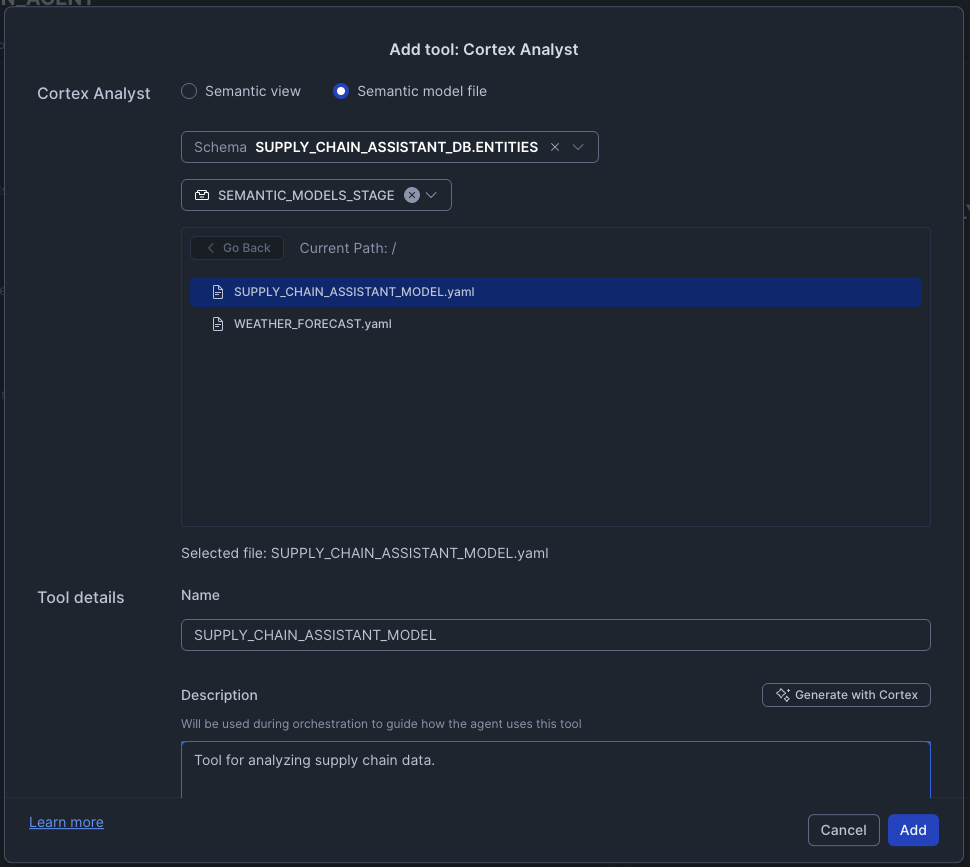

### Add Cortex Search Tool

1. Click **+ Add** next to **Cortex Search Services**
2. Configure the tool:
   * **Database** `SUPPLY_CHAIN_ASSISTANT_DB`
   * **Schema** `ENTITIES`
   * **Search Service:** Select `SUPPLY_CHAIN_ASSISTANT_DB.ENTITIES.SUPPLY_CHAIN_INFO`
   * **Name:** `SUPPLY_CHAIN_INFO`
   * **Description:** *"Tool for searching supply chain unstructured data."*
   * **ID Column:** `PAGE_URL`
   * **Title Column:** `TITLE`
3. Click **Save**

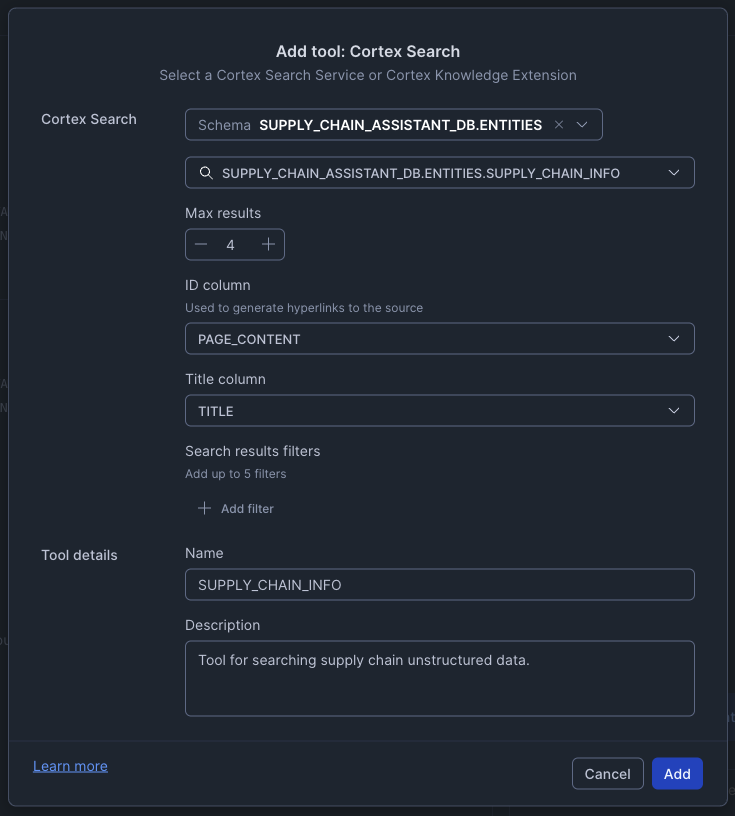

### Add Custom Tools

> aside negative
> **Note:** The WEB_SEARCH and WEB_SCRAPE custom tools require external integration access, which is not available on trial accounts. If you're using a trial account, you can skip adding these two tools and still use the other agent capabilities.

For each of the following custom tools, click **+ Add** next to **Custom Tool**, then configure:

#### 1. CREATE_HTML_NEWSLETTER

* **Type:** procedure
* **Schema:** `SUPPLY_CHAIN_ASSISTANT_DB.ENTITIES`
* **Custom tool identifier:** `CREATE_HTML_NEWSLETTER_SP`
* **Name:** `CREATE_HTML_NEWSLETTER_SP`
* **Warehouse:** `SUPPLY_CHAIN_ASSISTANT_WH`
* **Description:** *"Create HTML newsletter from responses."*

#### 2. WEB_SEARCH

* **Type:** function
* **Schema:** `SUPPLY_CHAIN_ASSISTANT_DB.ENTITIES`
* **Custom tool identifier:** `WEB_SEARCH`
* **Name:** `WEB_SEARCH`
* **Warehouse:** `SUPPLY_CHAIN_ASSISTANT_WH`
* **Description:** *"Search the web using DuckDuckGo."*

#### 3. WEB_SCRAPE

* **Type:** function
* **Schema:** `SUPPLY_CHAIN_ASSISTANT_DB.ENTITIES`
* **Custom tool identifier:** `WEB_SCRAPE`
* **Name:** `WEB_SCRAPE`
* **Warehouse:** `SUPPLY_CHAIN_ASSISTANT_WH`
* **Description:** *"Web scraping and content extraction."*

#### 4. SEND_MAIL

> aside negative
> **Note:** This tool requires a verified email address in Snowflake to function properly.

* **Type:** procedure
* **Schema:** `SUPPLY_CHAIN_ASSISTANT_DB.ENTITIES`
* **Custom tool identifier:** `SEND_MAIL`
* **Name:** `SEND_MAIL`
* **Warehouse:** `SUPPLY_CHAIN_ASSISTANT_WH`
* **Description:** *"Send emails to recipients with HTML formatted content."*

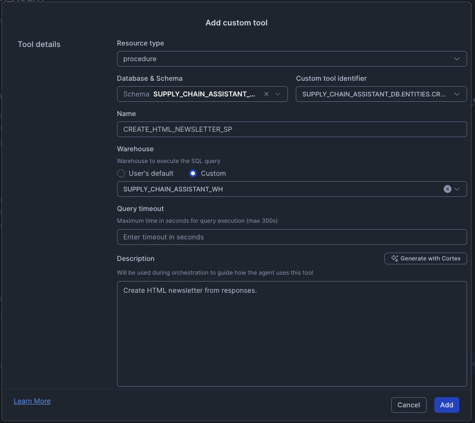

### Save and Access Your Agent

1. Click **Save** to save your agent configuration
2. You can test the agent directly in the right-hand pane
3. Alternatively, navigate to **Snowflake Intelligence** in the left navigation AI & ML menu
4. Select your **Supply_Chain_Agent** from the dropdown
5. Start asking questions!

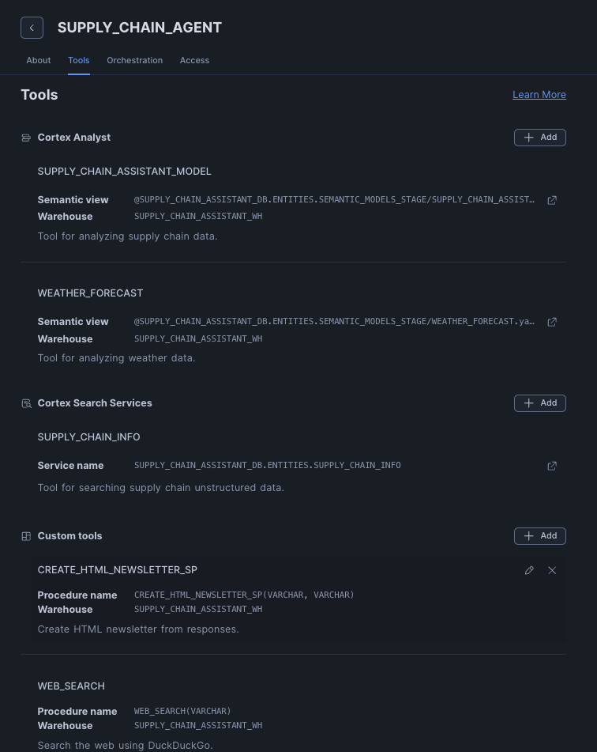
<!-- ------------------------ -->

## User Personas

We are building for three core user archetypes involved in supply chain operations.

### Maria Chen (The Operator - Supply Chain Operations Manager)

**Role**: Manages day-to-day operations and material flow. Responsible for resolving inventory issues, coordinating logistics, and keeping the supply chain moving.

**Goals**: Maximize asset availability, resolve stockouts before they impact production, and optimize for cost and speed.

**Needs**: Real-time, actionable answers. A prioritized list of critical issues. Tools to quickly compare options and take action.

**Frustrations**: Constant "fire-fighting." Waiting hours or days for an analyst to run a report. Making decisions with incomplete data (e.g., not knowing about weather disruptions).

### Victor Rodriguez (The Executive - VP of Operations)

**Role**: Oversees supply chain budget and long-term strategy. Responsible for profitability, efficiency, and risk management.

**Goals**: Ensure operational continuity, meet financial targets, and understand high-level risks and opportunities.

**Needs**: A high-level, aggregate view of supply chain health. Clear, concise summaries of critical problems, their financial impact, and the recommended solution.

**Frustrations**: Unforeseen budget overruns. Surprises from major disruptions. Reports that are too detailed and don't provide a clear recommendation.

### Leo Martinez (The Data Steward - Analytics Engineer)

**Role**: The technical and business-logic expert. Responsible for data quality and enabling the AI agent by teaching it the business's unique logic.

**Goals**: Ensure the agent's answers are accurate and trusted. Codify business definitions. Reduce his own ad-hoc reporting backlog.

**Needs**: A simple UI to define business semantics. The ability to test, validate, and "bless" queries. Tools to debug why an agent gave a specific answer.

**Frustrations**: Vague requests from users. The same simple questions being asked repeatedly. Business users misinterpreting raw data.

<!-- ------------------------ -->

## A Real-World Scenario

**As Maria (The Operator)**, I want to ask, *"Where do I have critical low inventory levels?"* and instantly see the most critical plants, so I can immediately know where to focus.

When Maria discovers the Miami plant is critically low on rare earth materials, she asks, *"For plants with low inventory of a raw material, compare the cost of replenishing from a supplier vs transferring from another plant with excess inventory."* The agent compares transfer from Austin (71% savings) vs. purchasing from a supplier, so she can make the most cost-effective decision.

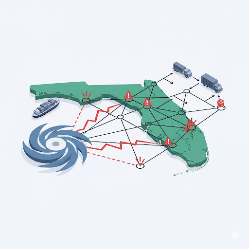

Before finalizing the transfer, Maria asks, *"What type of weather events might impact this transfer?"* The agent automatically checks the Weather Forecast tool and warns: **"A major hurricane is forecasted; transport may be impossible,"** so she doesn't make a costly logistical mistake.

**As Victor (The Executive)**, I want to receive a clear summary when Maria asks the agent to *"Draft an executive summary email with this analysis, our options, and a recommendation."* The agent generates an HTML-formatted email with Executive Summary, Financial Comparison, Key Risks, and Final Recommendation, so I can make an informed decision and reply "Approved" in minutes.

**As Leo (The Data Steward)**, I previously defined business logic like "critical low inventory" in the semantic model YAML file and added verified queries for cost comparisons, so the agent understands our business rules and Maria can trust the answers.

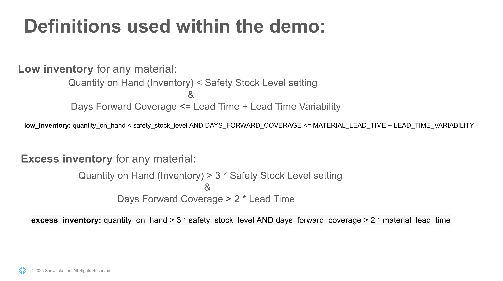

<!-- ------------------------ -->

## Test Agent with Questions

Now it's your turn to experience the Supply Chain Assistant! Follow Maria's journey by asking these questions in order, or explore on your own. Notice how the agent automatically determines which tool to use based on your question!

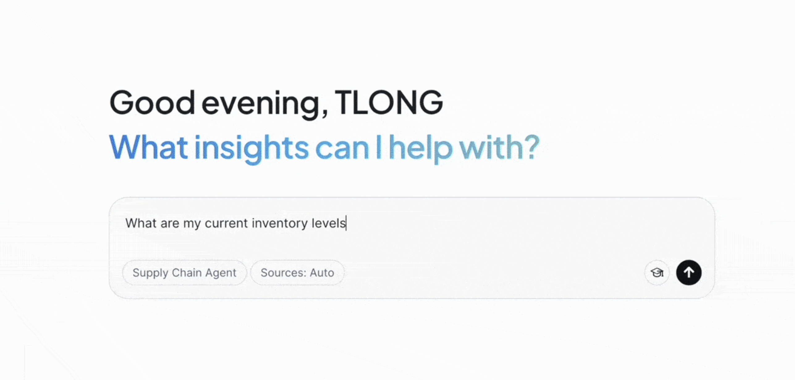

### Following Maria's Scenario

Ask these questions in sequence to replicate the scenario above:

1. *"Where do I have critical low inventory levels?"*
2. *"Where do we have low inventory of rare earth materials?"*
3. *"For plants with low inventory of a raw material, compare the cost of replenishing from a supplier vs transferring from another plant with excess inventory."*
4. *"What type of weather events might impact this transfer?"*
5. *"Draft an executive summary email with this analysis, our options, and a recommendation."*

> aside negative
> **Note:** Sending emails requires a verified email addresses. The WEB_SEARCH and WEB_SCRAPE tools require external integration access, which is not available on trial accounts.

### Additional Questions to Explore

Try these variations to explore different capabilities:

* "Compare the cost of transferring this inventory from a plant with excess inventory versus replenishing from a supplier."
* "Show me all plants with excess inventory that could support transfers."
* "What are the lead times for our primary suppliers?"
* "Search our documentation for transfer policies." (uses Cortex Search)
* "What orders are scheduled for the aerospace business line?"

<!-- ------------------------ -->

## Conclusion and Resources

Congratulations! You've built a comprehensive Supply Chain Assistant powered by Snowflake Intelligence that combines multiple AI capabilities into a single, intelligent agent.

### What You Learned

* How to set up a comprehensive supply chain database with realistic sample data
* How to create semantic models for Cortex Analyst to enable natural language queries
* How to parse and chunk PDF documents for Cortex Search
* How to build Cortex Search services for semantic search over unstructured data
* How to create a Snowflake Intelligence agent that combines multiple tools
* How to integrate Cortex Analyst, Cortex Search, and custom tools into a single agent
* How to enable web search and scraping capabilities in your AI assistant
* How the agent intelligently routes questions to appropriate tools
* How to test complex queries that span multiple data sources and tool types

### What You Built

Your Supply Chain Assistant now includes:

* **Dual Analytics:** Query both supply chain operations and weather data using natural language
* **Semantic Search:** Access unstructured supply chain documentation through intelligent retrieval
* **Web Integration:** Search and scrape external information from the internet
* **Communication:** Generate HTML newsletters and send emails (with proper integration)
* **Intelligent Routing:** Automatic determination of which tool to use based on question context
* **Complex Analysis:** Handle sophisticated multi-domain queries spanning structured and unstructured data

### Next Steps and Extensions

#### Scaling to Multi-Agent Architecture

As your organization's needs grow, you can evolve from a single agent with multiple tools to a multi-agent architecture where a primary orchestrator agent coordinates with specialized domain agents. This architecture enables better scalability, domain expertise, and independent development of agents for different business functions:

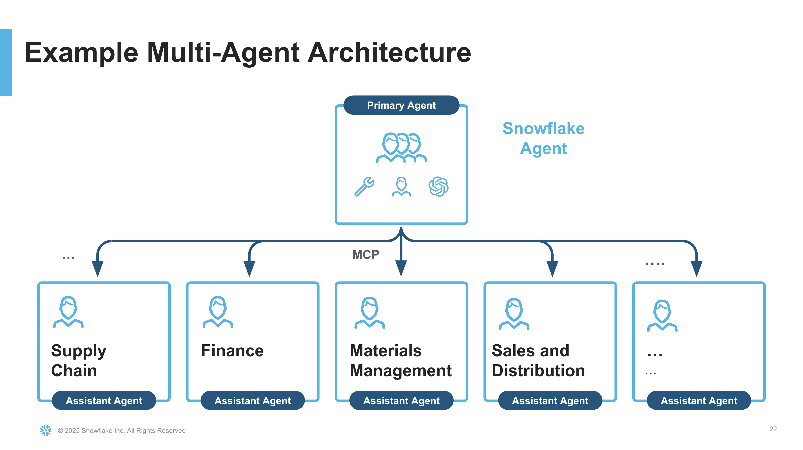

#### You can extend this solution further by:

* **Adding More Semantic Models**: Create additional semantic models for other business domains (finance, HR, sales, etc.)
* **Integrating Additional Data Sources**: Connect to external APIs or databases
* **Creating Custom Tools**: Build specific tools for your unique business processes
* **Building Streamlit Applications**: Create custom UIs that interact with your agent programmatically
* **Adding More Documents**: Index additional PDF documents, user manuals, or policy documents
* **Implementing Advanced Analytics**: Add tools for predictive analytics, optimization, or machine learning inference
* **Setting Up Email Integration**: Configure email sending capabilities for automated reporting

### Related Resources

* [Snowflake Cortex Documentation](https://docs.snowflake.com/en/user-guide/snowflake-cortex)
* [Snowflake Intelligence Documentation](https://docs.snowflake.com/en/user-guide/snowflake-cortex/snowflake-intelligence)
* [Cortex Analyst Documentation](https://docs.snowflake.com/en/user-guide/snowflake-cortex/cortex-analyst)
* [Cortex Search Documentation](https://docs.snowflake.com/en/user-guide/snowflake-cortex/cortex-search)
* [Semantic Model Guide](https://docs.snowflake.com/en/user-guide/snowflake-cortex/cortex-analyst/semantic-model-spec)
* [Snowflake Quickstarts](https://quickstarts.snowflake.com/)
* [Snowflake Community](https://community.snowflake.com/)

### GitHub Repository

Access the complete code, scripts, and files for this quickstart:

* [Supply Chain Assistant GitHub Repository](https://github.com/Snowflake-Labs/sfguide-supply-chain-assistant-with-snowflake-intelligence)
