author: Tripp Smith, Greg Sloyer, Dureti Shemsi
language: en
id: supply-chain-risk-intelligence-with-snowflake
summary: AI-driven N-tier supply chain risk intelligence using graph neural networks on Snowflake to uncover common supplier dependencies and concentration risks.
categories: snowflake-site:taxonomy/solution-center/certification/certified-solution, snowflake-site:taxonomy/industry/manufacturing, snowflake-site:taxonomy/product/ai, snowflake-site:taxonomy/product/analytics, snowflake-site:taxonomy/snowflake-feature/model-development, snowflake-site:taxonomy/snowflake-feature/applied-analytics, snowflake-site:taxonomy/snowflake-feature/snowpark, snowflake-site:taxonomy/snowflake-feature/snowpark-container-services, snowflake-site:taxonomy/snowflake-feature/cortex-analyst, snowflake-site:taxonomy/snowflake-feature/snowflake-intelligence, snowflake-site:taxonomy/snowflake-feature/marketplace-and-integrations
environments: web
status: Published
feedback_link: https://github.com/Snowflake-Labs/sfguides/issues
fork_repo_link: https://github.com/Snowflake-Labs/sfguide-supply-chain-risk-intelligence-with-snowflake

# Supply Chain Risk Intelligence for Manufacturing: Achieve N-Tier Visibility with Snowflake

## Overview

Procurement and supply chain teams believe they have diversified sourcing because their Enterprise Resource Planning (ERP) system shows multiple Tier-1 suppliers across different countries. But that data is incomplete: visibility ends at the first tier. When a disruption occurs at Tier-3, organizations are blindsided months later by sudden shortages, leaving no time to qualify alternatives.

This solution fuses internal ERP data with external trade intelligence into a heterogeneous knowledge graph, then trains a GraphSAGE model to infer common Tier-2+ supplier relationships, propagate risk scores through the network, and surface concentration risks in an interactive Streamlit dashboard. A Cortex Agent with a semantic model enables natural language risk queries through Snowflake Intelligence, all built and deployed entirely on Snowflake.

## The Business Challenge

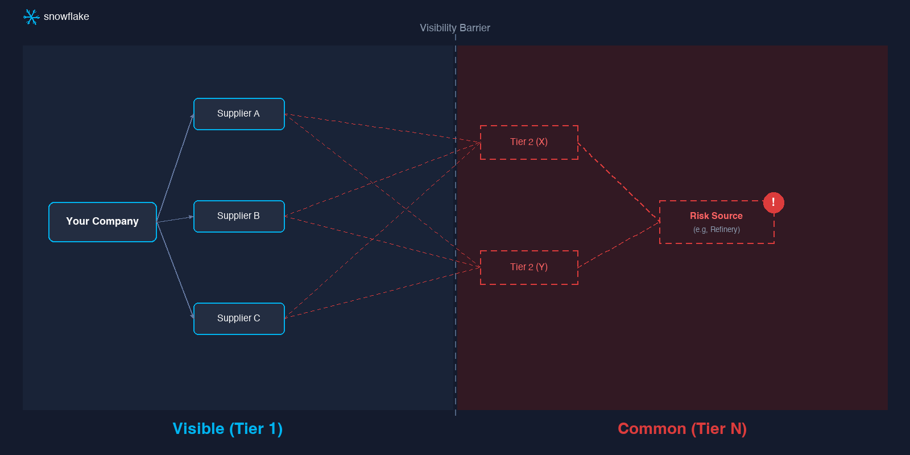

Traditional ERP visibility ends at Tier-1. Risks fester unseen in deeper layers of the supply network, creating costly blind spots for procurement teams.

- **Tier-N blindness costs time and money.** When a disruption occurs at Tier-3, organizations are blindsided months later by sudden shortages, leaving no time to qualify alternatives.

- **Single points of failure hide in plain sight.** Three Tier-1 vendors across three countries may source raw materials from the same refinery in a geologically unstable region.

- **Reactive firefighting replaces strategic planning.** Without predictive risk signals, procurement teams spend time managing crises instead of building resilient supply networks.

- **Compliance and audit gaps create exposure.** Regulations like the Uyghur Forced Labor Prevention Act (UFLPA) require traceability beyond Tier-1, but current systems cannot provide that visibility.

## The Solution

This solution transforms supply chain management from reactive response to proactive resilience by fusing internal ERP data with external trade intelligence (customs-based shipment records, trade flow data, and geopolitical risk signals) into a knowledge graph that reveals what your ERP cannot see. The demo uses synthetic data generated in Snowflake; in production, this external intelligence would come from Snowflake Marketplace providers.

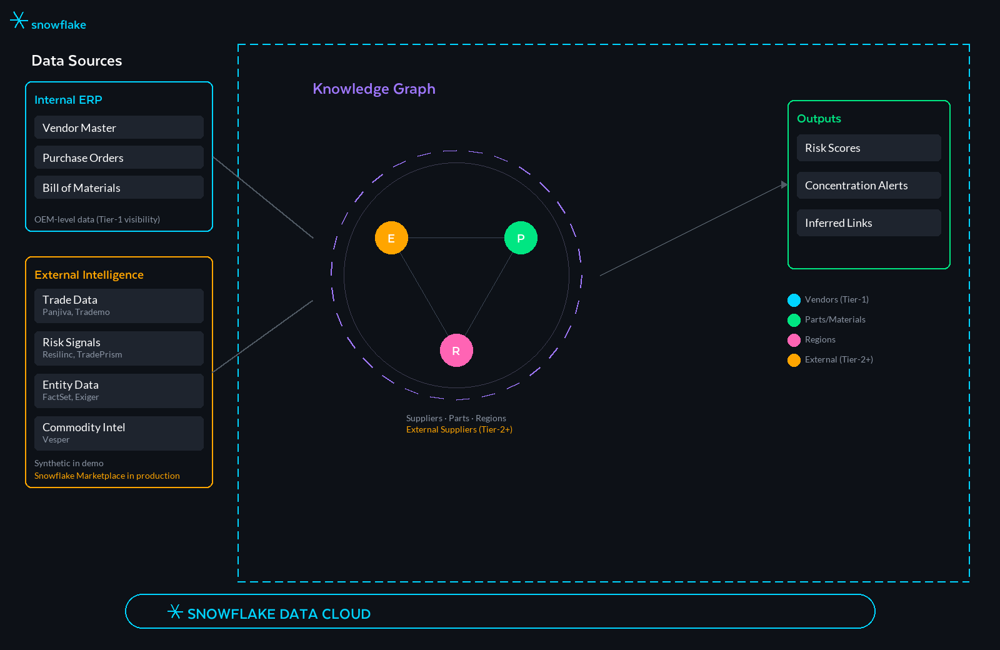

The platform constructs a heterogeneous knowledge graph with suppliers, parts, and regions as nodes and transactions and trade flows as edges. A GraphSAGE model trained on trade patterns infers likely Tier-2+ supplier relationships, then propagates risk scores through the network so that a shock at Tier-3 surfaces its impact on Tier-1 and final products.

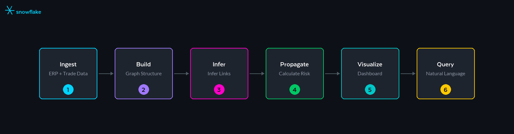

1. **Ingest.** Integrate ERP data (vendors, materials, purchase orders, Bills of Materials) and external trade intelligence into Snowflake tables. The demo generates all six tables synthetically via a stored procedure.

2. **Build the Graph.** Construct a heterogeneous knowledge graph with suppliers, parts, and regions as nodes; transactions and trade flows as edges.

3. **Infer Common Links.** Train a GraphSAGE model on trade patterns to infer likely common Tier-2+ supplier relationships with probability scores.

4. **Propagate Risk.** Calculate risk scores that flow through the network so that a shock at Tier-3 surfaces its impact on Tier-1 and final products.

5. **Visualize and Act.** Explore the supply network graph, analyze concentration points, and prioritize mitigation actions in an interactive 8-page Streamlit dashboard.

6. **Query with Natural Language.** A Cortex Agent backed by a semantic model lets users ask risk questions in plain English through Snowflake Intelligence or the in-app Command Center.

The solution provides two notebook options: a **GPU notebook** using PyTorch Geometric on container runtime for full GNN training, and a **NetworkX notebook** running on standard warehouse compute (no compute pool or External Access Integration required) for trial accounts and environments where GPU is unavailable. Both produce compatible output for the dashboard.

## Business Value

- **Predictive risk scoring.** Alerts for latent risks before they manifest. For example, identifying that a part has a high risk score because its estimated Tier-2 source is in a sanction zone.

- **Automatic concentration discovery.** Identify common bottlenecks where multiple Tier-1 suppliers converge on the same Tier-2+ source.

- **Proactive supplier qualification.** Find and qualify backup suppliers months before a crisis, not during one.

- **From reactive to prepared.** Most organizations lack multi-tier visibility entirely and are always reacting to disruptions after they hit. This solution enables proactive risk identification and alternative sourcing that, in many cases, simply was not possible before.

## The Discovery Moment

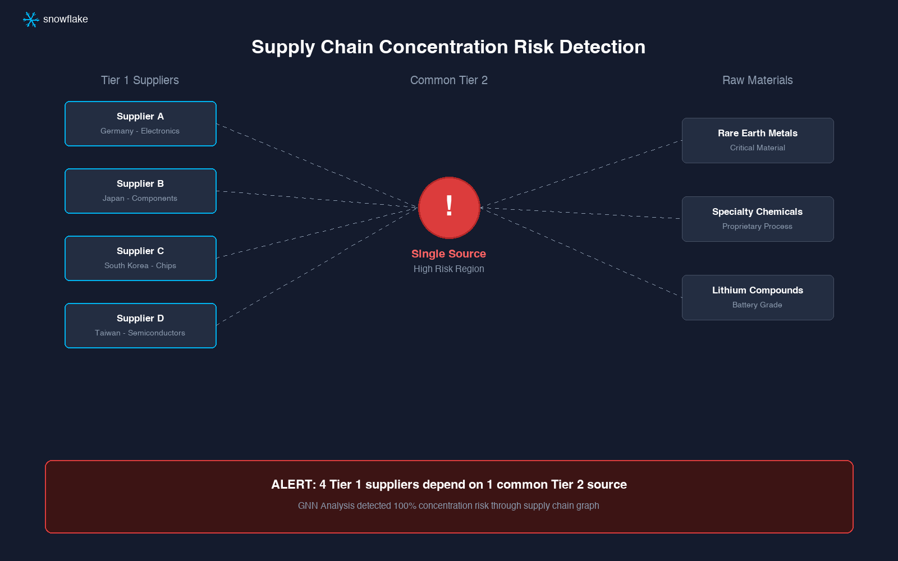

Traditional analytics show a diversified supply base. Graph intelligence reveals the convergence: multiple seemingly independent Tier-1 suppliers may all depend on the same common Tier-2 refinery.

**Before:** "We're safe. We source from three different vendors in three countries."

**After:** "All three vendors rely on one Tier-2 supplier in a high-risk region. We need to qualify alternatives now."

## Why Snowflake

**Unified Data Foundation**: Internal ERP data and external trade intelligence join seamlessly in a governed platform, with no data movement or pipeline complexity.

**Performance That Scales**: GPU-enabled notebooks train graph neural networks on millions of trade records without infrastructure friction.

**Collaboration Without Compromise**: Share risk insights with sourcing partners and internal teams while maintaining data governance and access controls.

**Built-in AI/ML and Apps**: From PyTorch Geometric models to interactive Streamlit dashboards, build and deploy intelligence closer to where decisions happen.

## The Data

The solution fuses internal ERP data with external trade intelligence into a knowledge graph that reveals what your ERP cannot see. The following data represents the demo environment and is representative of production supply chain data.

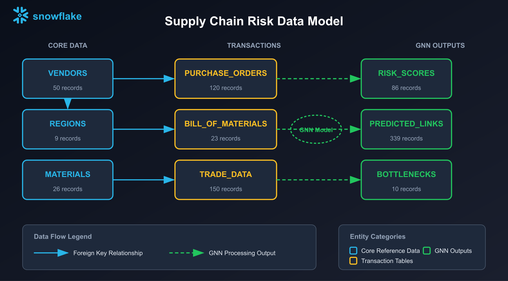

| Data Source | Type | Purpose |
|---|---|---|
| Vendor Master (ERP) | Internal | Known Tier-1 supplier nodes |
| Purchase Orders (ERP) | Internal | Supplier-to-material transaction edges |
| Bill of Materials (ERP) | Internal | OEM product assembly hierarchy (Tier-1 level) |
| Trade Data | External (synthetic in demo) | Common Tier-2+ relationship inference |
| Regional Risk | External (synthetic in demo) | Geopolitical and disaster risk factors |

- **Domains:** Vendors (Tier-1 suppliers), Materials (parts and BOMs), Regions (geographic risk factors), Trade Data (bills of lading linking shippers to consignees to infer Tier-2+ relationships). All six tables are generated by the `GENERATE_SYNTHETIC_DATA` stored procedure in the demo.
- **Freshness:** In the demo, all data is generated synthetically. In production, trade intelligence would come from Snowflake Marketplace providers (see below) with continuous refresh via zero-copy shares.
- **Trust:** All data stays within Snowflake's governance boundary with role-based access controls.

## From Demo to Production: Snowflake Marketplace

The demo uses synthetic data to demonstrate the architecture end-to-end. Moving to production requires replacing synthetic tables with high-quality external data. These Snowflake Marketplace providers deliver the trade intelligence and entity data needed to operationalize N-tier visibility, with no data pipelines to build or contracts to negotiate outside your Snowflake account.

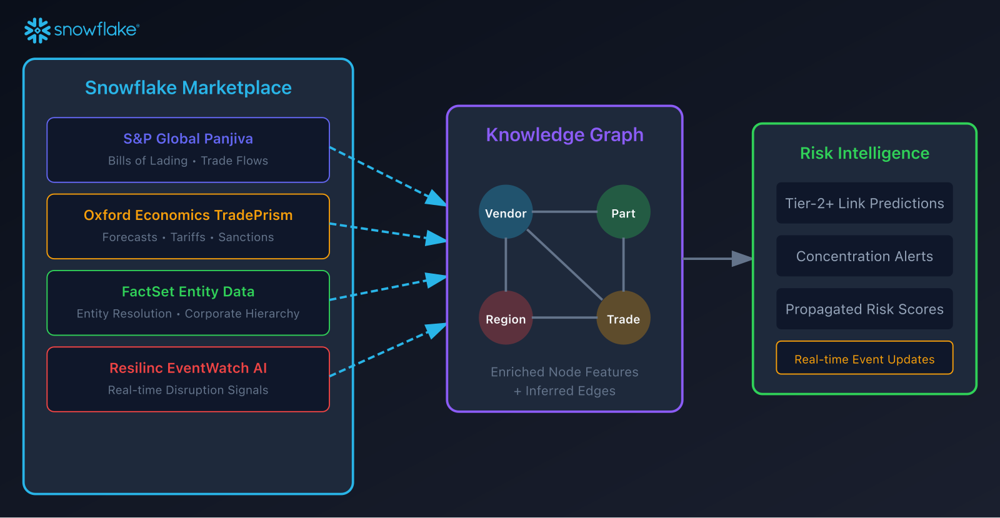

**S&P Global Market Intelligence — Panjiva Supply Chain Intelligence**: The gold standard for inferring common Tier-2+ relationships. Customs-based bill-of-lading shipment records with shipper/consignee entities, HS codes, origin/destination ports, volumes, and values. When your Tier-1 supplier appears as a consignee, Panjiva reveals who shipped to them, exposing your likely Tier-2 suppliers. [Panjiva Supply Chain Intelligence](https://app.snowflake.com/marketplace/listing/GZT0Z8P3D8D/s-p-global-market-intelligence-panjiva-supply-chain-intelligence) | [All S&P Global Listings](https://app.snowflake.com/marketplace/listings/S%26P%20Global%20Market%20Intelligence)

**Oxford Economics — TradePrism**: Forward-looking trade forecasts and scenario modeling. Global trade forecasts at HS4 level across ~170 economies, including tariff scenarios, sanction impacts, and trade rerouting projections. Combine historical shipment data with TradePrism forecasts to answer: "If sanctions expand to Region X, which of my supply chains are exposed?" [TradePrism Full Dataset](https://app.snowflake.com/marketplace/listing/GZ1M7ZCX4H2/oxford-economics-group-tradeprism-full-dataset)

**FactSet — Supply Chain Linkages & Entity Data**: Entity resolution and corporate relationship mapping. Map shipper/consignee names from trade data to actual vendor entities in your ERP and build supplier/geo exposure roll-ups at the corporate parent level. [FactSet on Snowflake Marketplace](https://app.snowflake.com/marketplace/providers/GZT0Z28ANYN/FactSet)

**Resilinc — EventWatch AI**: Real-time disruption monitoring and supplier risk signals. AI-powered monitoring of global events (natural disasters, geopolitical incidents, factory fires, labor actions) mapped to supplier locations and impact zones. [Resilinc EventWatch AI](https://app.snowflake.com/marketplace/listing/GZSTZO0V7VR/resilinc-eventwatch-ai)

**Exiger — Supply Chain Risk Management**: End-to-end supply chain risk visibility and compliance monitoring. Exiger maintains one of the largest databases for multi-tier supplier mapping, providing validated Tier-2+ relationships, sanctions screening, and regulatory compliance signals.

**Trademo — Global Trade Intelligence**: Comprehensive import/export shipment data with buyer-supplier linkages across global trade corridors. Useful for validating GNN-inferred relationships against actual trade flow evidence.

**Vesper — Commodity Intelligence**: Real-time commodity market intelligence and supply-demand analytics. Enriches risk models with upstream commodity exposure and price volatility signals.

| Marketplace Provider | Graph Node/Edge Type | Integration Point |
|---|---|---|
| **Panjiva** | Trade flow edges (shipper → consignee) | GNN link prediction training |
| **TradePrism** | Region risk attributes | Node feature enrichment |
| **FactSet** | Entity resolution, corporate hierarchy | Supplier node canonicalization |
| **Resilinc** | Real-time event signals | Dynamic risk score updates |
| **Exiger** | Validated multi-tier supplier maps | Tier-2+ relationship validation |
| **Trademo** | Import/export shipment data | Trade flow edge enrichment |
| **Vesper** | Commodity market intelligence | Upstream exposure signals |

**Why Marketplace Data Matters:**

- **Zero ETL.** Data lives in Snowflake. Join to your tables with SQL, no data movement required.
- **Always current.** Providers update their datasets; you automatically get fresh intelligence.
- **Governed access.** Marketplace shares respect your Snowflake RBAC; sensitive enrichments stay protected.
- **Rapid time-to-value.** Skip months of data licensing negotiations and pipeline engineering. Most Marketplace providers can be accessed using Snowflake credits. Check individual listing terms for pricing details.

## Personas and Value

| Persona | Key Need | How This Solution Helps |
|---------|----------|------------------------|
| **VP of Procurement** | Reduce supplier-driven production disruptions | See concentration risks before they cause shortages; make proactive qualification investments |
| **Supply Chain Manager** | Faster risk assessment for critical materials | Propagated risk scores highlight which parts need attention, without manual tracing |
| **Supplier Quality Engineer** | Identify high-risk suppliers for audit | Filter by risk category; prioritize reviews based on network position, not just financials |
| **Data Scientist** | Build and iterate on risk models | PyTorch Geometric runs in Snowflake Notebooks with GPU; experiment close to governed data |

## How It Comes Together

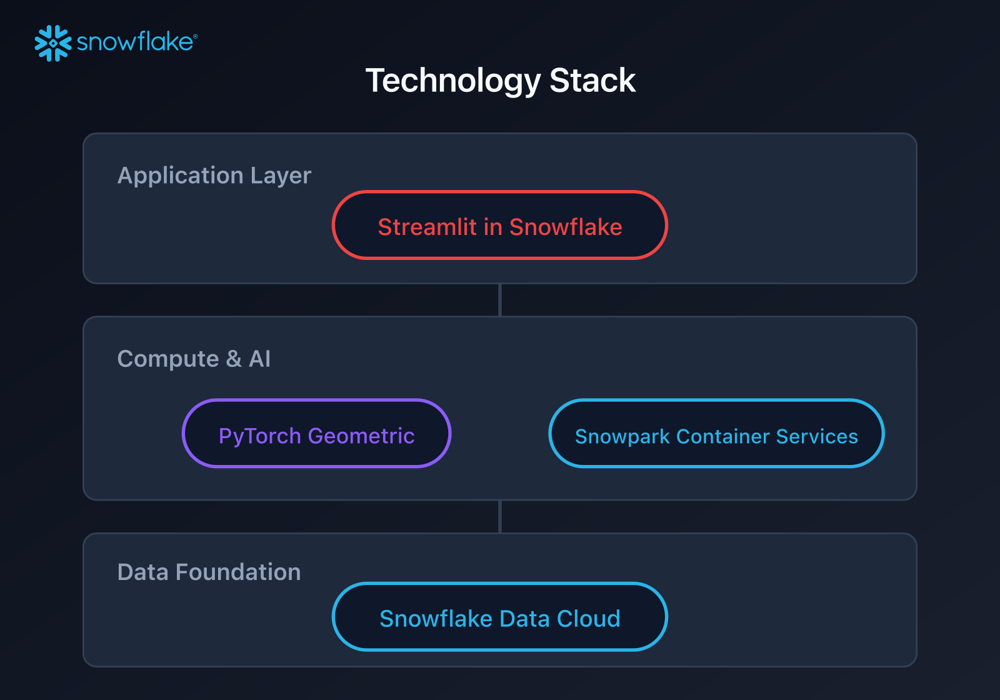

| Component | Role |
|---|---|
| **Snowflake Tables** | Store ERP data, trade intelligence, and model outputs (all synthetic in demo) |
| **Snowflake Notebooks (GPU)** | Execute GNN training with PyTorch Geometric and GPU acceleration |
| **Snowflake Notebooks (Warehouse)** | NetworkX alternative running on standard warehouse compute, no compute pool or EAI required |
| **PyTorch Geometric** | GraphSAGE model for link prediction and risk propagation |
| **Cortex Agent** | Natural language risk queries via semantic model |
| **Snowflake Intelligence** | Conversational interface for the Cortex Agent |
| **Cortex Analyst** | Semantic model for structured supply chain data queries |
| **Risk Analysis UDF** | `ANALYZE_RISK_SCENARIO` for What-If disruption simulation |
| **Streamlit in Snowflake** | 8-page interactive dashboard for exploration and action planning |

## Key Visualizations

The 8-page Streamlit application guides users from executive summary to prioritized actions.

| View | What You See |
|---|---|
| **Executive Summary** | High-level risk overview with KPIs and health score |
| **Exploratory Analysis** | Deep-dive into vendor and material risk distributions |
| **Supply Network** | Interactive graph visualization to filter, zoom, and trace dependency paths |
| **Tier-2 Analysis** | Inferred common dependencies, probability scores, and concentration impacts |
| **Scenario Simulator** | What-If analysis for regional disruptions and vendor failures |
| **Command Center** | Cortex Agent chat for natural language risk queries |
| **Risk Mitigation** | Prioritized action items ranked by impact with mitigation strategies |
| **About** | Architecture and methodology documentation |

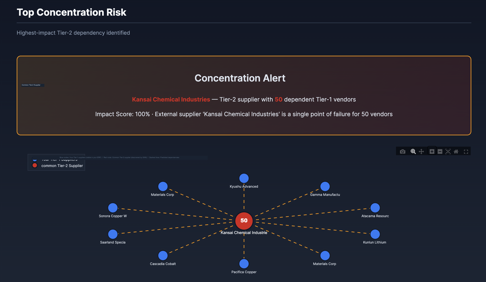

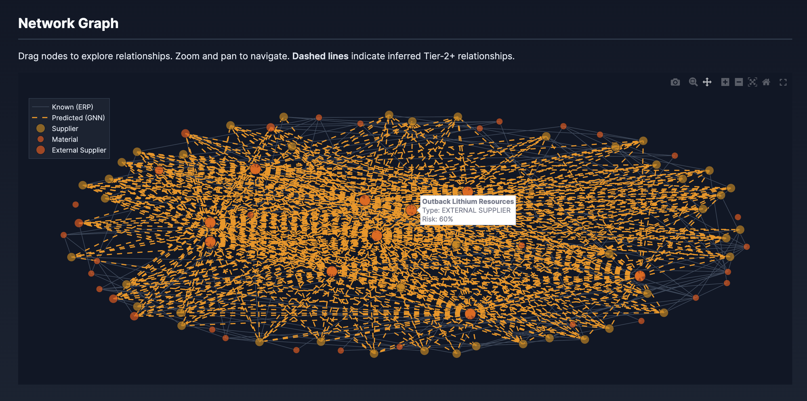

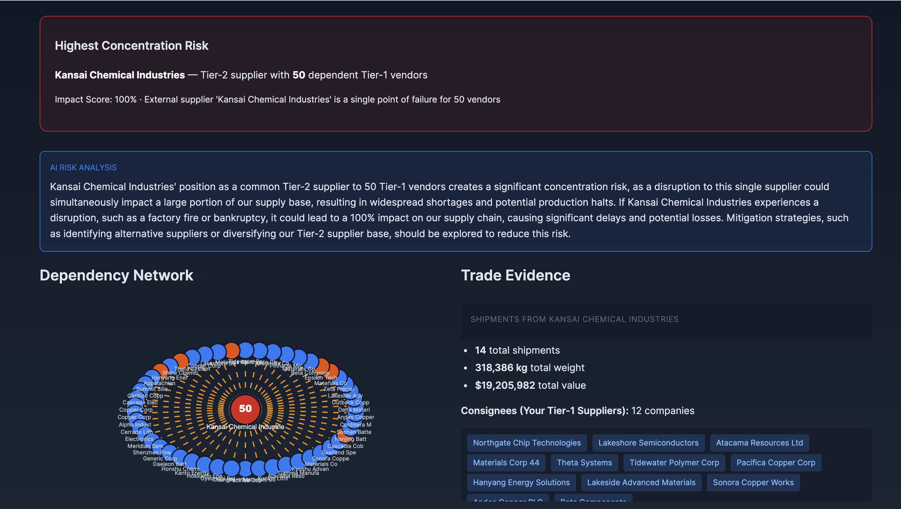

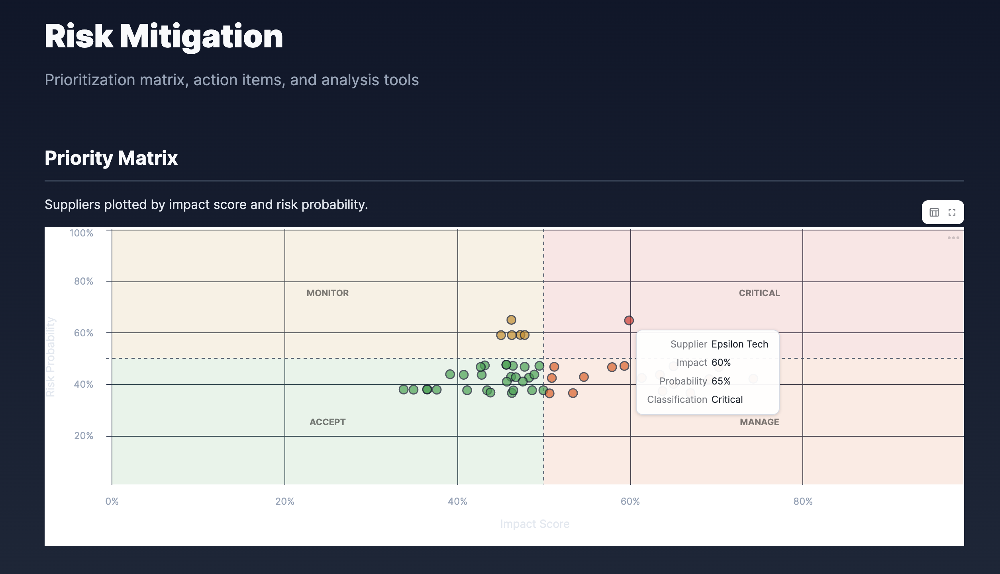

## Get Started

Ready to uncover common supplier dependencies and concentration risks in your supply chain? This guide includes everything you need to get up and running quickly.

**[GitHub Repository →](https://github.com/Snowflake-Labs/sfguide-supply-chain-risk-intelligence-with-snowflake)**

The repository contains the SQL setup script, two notebook options (GPU with PyTorch Geometric on container runtime, or warehouse-based with NetworkX), an 8-page Streamlit dashboard, a Cortex Agent with semantic model, and a teardown script for deploying the full solution.

## Resources

- [Cortex Agents Documentation](https://docs.snowflake.com/en/user-guide/snowflake-cortex/cortex-agents)
- [Cortex Analyst Documentation](https://docs.snowflake.com/en/user-guide/snowflake-cortex/cortex-analyst)
- [Snowflake Intelligence](https://docs.snowflake.com/en/user-guide/snowflake-cortex/snowflake-intelligence)
- [Notebooks on Container Runtime Documentation](https://docs.snowflake.com/en/developer-guide/snowflake-ml/notebooks-on-spcs)
- [Snowflake ML Documentation](https://docs.snowflake.com/en/developer-guide/snowflake-ml/overview)
- [Snowpark Documentation](https://docs.snowflake.com/en/developer-guide/snowpark/python/index)
- [Streamlit in Snowflake Documentation](https://docs.snowflake.com/en/developer-guide/streamlit/about-streamlit)