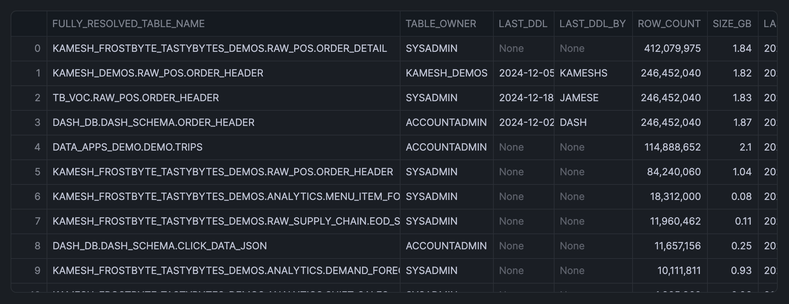
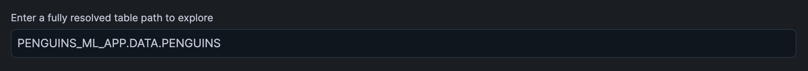
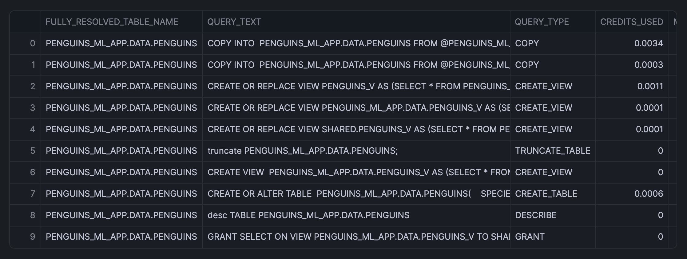
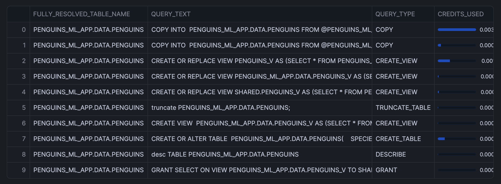
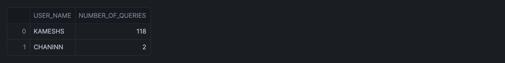
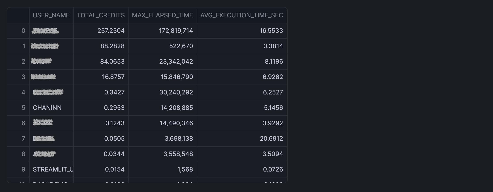

author: Chanin Nantasenamat
id: table-size-growth
categories: snowflake-site:taxonomy/solution-center/certification/quickstart, snowflake-site:taxonomy/product/platform, snowflake-site:taxonomy/snowflake-feature/storage
language: en
summary: Learn how to monitor and analyze table storage growth trends in Snowflake Notebooks. 
environments: web
status: Published
feedback link: https://github.com/Snowflake-Labs/sfguides/issues


# Monitor Table Size Growth in Snowflake Notebooks
<!-- ------------------------ -->
## Overview

In this quickstarts, you'll learn how to leverage Snowflake Notebooks with Streamlit integration to track and analyze table storage growth trends. 

This article will show you how to identify large tables, analyze query patterns, and monitor user interactions to optimize storage usage and query performance.

### What You'll Learn
- How to identify the top 100 largest tables in your Snowflake account
- How to analyze query patterns on specific tables
- How to track user interactions with tables
- How to use Streamlit widgets for interactive data exploration

### What You'll Build
An interactive notebook that helps monitor table storage growth and analyze query patterns using Snowflake's account usage views and Streamlit widgets.

### What You'll Need
- Access to a [Snowflake account](https://signup.snowflake.com/?utm_source=snowflake-devrel&utm_medium=developer-guides&utm_cta=developer-guides)
- Basic knowledge of SQL and Python
- Familiarity with Snowflake Notebooks

<!-- ------------------------ -->
## Setup

Firstly, to follow along with this quickstart, you can click on [Monitoring_Table_Size_with_Streamlit.ipynb](https://github.com/Snowflake-Labs/snowflake-demo-notebooks/blob/main/Monitoring_Table_Size_with_Streamlit/Monitoring_Table_Size_with_Streamlit.ipynb) to download the Notebook from GitHub.

Snowflake Notebooks comes pre-installed with essential Python libraries for data analysis, including Numpy, Pandas, and Streamlit. No additional package installation is required for this tutorial.

<!-- ------------------------ -->
## Identify Large Tables

### Query Top Tables
Execute the following SQL to identify the largest tables:

```sql
SELECT 
    CONCAT(TABLE_CATALOG, '.', TABLE_SCHEMA, '.', TABLE_NAME) AS FULLY_RESOLVED_TABLE_NAME,
    TABLE_OWNER,
    LAST_DDL,
    LAST_DDL_BY,
    ROW_COUNT,
    ROUND(BYTES / 1024 / 1024 / 1024, 2) AS SIZE_GB,
    LAST_ALTERED,
    CASE 
        WHEN LAST_DDL <= DATEADD(DAY, -90, CURRENT_DATE) THEN 'YES' 
        ELSE 'NO' 
    END AS LAST_ACCESSED_90DAYS
FROM SNOWFLAKE.ACCOUNT_USAGE.TABLES
WHERE DELETED IS NULL
  AND ROW_COUNT > 0
  AND LAST_ACCESSED_90DAYS = 'NO'
ORDER BY ROW_COUNT DESC
LIMIT 100;
```

Note: The above SQL cell is named `sql_top_tables`.

### Convert to Pandas DataFrame
Here, we'll easily convert the SQL output to a Pandas DataFrame like so:

```python
sql_top_tables.to_pandas()
```

Note: The above Python cell is named `sql_top_tables_pd`.

The returned output is shown below:



<!-- ------------------------ -->
## Analyze Query Patterns

### Create Interactive Table Selection
Let's now create a text box for accepting the table path.

```python
import streamlit as st

selection = st.text_input(label="Enter a fully resolved table path to explore")
```

From the first column of the above table, we'll copy the path to a table of our choice, which in this example is `PENGUINS_ML_APP.DATA.PENGUINS`, then paste it to the text box as shown below:



### Analyze Query Performance
Let's now pass that variable into a SQL query so we can grab query analytics on this table. Note that we'll name the cell to `sql_most_expensive_queries_on_table`.

```sql
SELECT 
    '{{selection}}' as FULLY_RESOLVED_TABLE_NAME,
    q.QUERY_TEXT,
    q.QUERY_TYPE,
    SUM(CREDITS_USED_CLOUD_SERVICES) as CREDITS_USED,
    MAX(TOTAL_ELAPSED_TIME) as MAX_elapsed_time,
    AVG(TOTAL_ELAPSED_TIME)/1000 as AVG_EXECUTION_TIME_SEC
FROM SNOWFLAKE.ACCOUNT_USAGE.QUERY_HISTORY q
WHERE START_TIME >= CURRENT_DATE - interval '90 days'
    AND query_text LIKE '%{{selection}}%'
GROUP BY ALL
ORDER BY AVG_EXECUTION_TIME_SEC DESC
LIMIT 10
```

This returns the following table output:



Next, we'll use the SQL cell name from above and convert it into a Pandas DataFrame using `to_pandas()`:

```python
df = sql_most_expensive_queries_on_table.to_pandas()
st.dataframe(df,
             column_config={
                "CREDITS_USED": st.column_config.ProgressColumn(
                "CREDITS_USED",
                format="%.4f",
                min_value=df.CREDITS_USED.min(),
                max_value=df.CREDITS_USED.max(),
        ),
    },)
```

After converting to a Pandas DataFrame, we'll stylize this via `st.dataframe()` (notice the progress bar visuals):



Make note that the above cell is named `py_visualization`, which we'll make reference to in this tutorial.

<!-- ------------------------ -->
## Track User Interactions

### Identify Active Users
Let's say we want to take our top most expensive query and turn it into a materialization. Who will be the users who are most likely to be impacted by our activities? 

To find out, we're going to grab the list of users who queried our table of interest in the last 90 days as well as the users who have executed the expensive query. We can then contact them when we make an update and tell them about improvements we made!

First, let's find out who has used our table in the last 90 days.  We already have a variable `selection` we can use, so we're plugging it into the below query: 

```sql
SELECT 
    USER_NAME, 
    COUNT(*) number_of_queries
FROM SNOWFLAKE.ACCOUNT_USAGE.QUERY_HISTORY q
WHERE START_TIME >= CURRENT_DATE - interval '90 days'
    AND query_text LIKE '%{{selection}}%'
GROUP BY ALL
ORDER BY number_of_queries DESC
```

This returns the following results:


Now, let's say we want to materialize a specific long running query. Grab a query from the `py_visualization` cell.

We can now plug it into the `QUERY_TEXT` value below to find out who else would benefit from materializing this pattern. And this returns the following:



```python
query_selection = st.text_input(label="Enter the query text you want to look up")
st.write("**You Entered:** `" + query_selection + "`")
```

Sweet! Now we get a list of all the users who might have run this query, along with their total credit
consumption and query execution time over the last 90 days.

```sql
SELECT 
    USER_NAME, 
    SUM(CREDITS_USED_CLOUD_SERVICES) as total_credits, 
    MAX(TOTAL_ELAPSED_TIME) as MAX_elapsed_time,
    AVG(TOTAL_ELAPSED_TIME)/1000 as AVG_EXECUTION_TIME_SEC
FROM SNOWFLAKE.ACCOUNT_USAGE.QUERY_HISTORY q
WHERE START_TIME >= CURRENT_DATE - interval '90 days'
    AND query_text LIKE '%{{query_selection}}%'
GROUP BY ALL
ORDER BY total_credits DESC
```

And the query output is shown below:



## Conclusion And Resources

Congratulations! You've successfully built an interactive notebook for monitoring table storage growth and analyzing query patterns in Snowflake. This tool will help you make data-driven decisions about storage optimization and query performance improvements.

### What You Learned
- How to identify and analyze large tables in your Snowflake account
- How to track query patterns and performance metrics
- How to monitor user interactions with specific tables
- How to integrate Streamlit widgets for interactive analysis

### Related Resources

Documentation:
- [Snowflake Documentation](https://docs.snowflake.com/)
- [Streamlit Documentation](https://docs.streamlit.io/)

Articles:
- [Account Usage Reference](https://docs.snowflake.com/en/sql-reference/account-usage)
- [Query History View](https://docs.snowflake.com/en/sql-reference/account-usage/query_history)
- [Snowflake Notebooks Guide](https://docs.snowflake.com/en/user-guide/ui-snowsight/notebooks-use-with-snowflake)

Happy coding!
