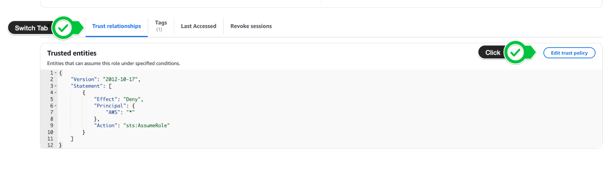

author: Jeremy Ber, Sean Falconer
id: snowflake-confluent-tableflow-iceberg
summary: Build a real-time data pipeline connecting Apache Kafka with Snowflake using Confluent Cloud and Tableflow in Iceberg format
categories: getting-started, confluent, streaming, real-time, tableflow, kafka, flink, polaris, snowflake
environments: web
status: Published
feedback link: https://github.com/Snowflake-Labs/sfguides/issues
tags: Getting Started, Confluent, Kafka, Polaris, Snowflake, Tableflow, Iceberg, Flink

# Stream Kafka Data to Snowflake via Confluent Tableflow and Iceberg

## Overview

Duration: 5

In this quickstart, you’ll build a real-time data pipeline that connects Apache Kafka with Snowflake, without writing a single custom connector or ETL job. Using Confluent Cloud, Kafka, and Tableflow, you’ll stream simulated data into Kafka topics, automatically materialize that data into Apache Iceberg tables on Amazon S3, and expose those tables directly to Snowflake’s Open Data Catalog.

Imagine you're building a modern trading platform or a customer-facing analytics dashboard. You're capturing user activity and stock trades as they happen, and you want your data teams and downstream systems to react in near real-time, whether it's for fraud detection, personalized recommendations, or operational intelligence.

Traditionally, this would require stitching together multiple systems: Kafka for ingestion, Spark or Flink for transformation, cloud storage for persistence, and finally Snowflake for analytics, plus a ton of glue code and scheduling overhead.

This quickstart shows how to streamline that entire process:

* **Kafka** ingests and transports the data in real time.  
* **Tableflow** continuously materializes that data into Iceberg tables on **Amazon S3**.  
* **Snowflake Open Catalog** connects directly to those tables, giving analysts and apps live access to fresh data using simple SQL.

This architecture supports use cases like:

* **Real-time dashboards** for trading activity or user behavior  
* **Feeding machine learning pipelines** with live, structured data  
* **Streaming feature stores** for AI/ML applications

### Technologies at a Glance

#### Apache Kafka 

Kafka is a distributed event streaming platform used to capture and route real-time data. In this lab, Kafka will act as the backbone for ingesting live event streams like user registrations and stock trades.

#### Confluent Cloud

Confluent is a fully managed data streaming platform built on Apache Kafka. It handles the heavy lifting of provisioning, scaling, and securing Kafka in the cloud so you can focus on your data flow, not the infrastructure.

#### Tableflow

Tableflow is a new Confluent-native service that simplifies getting data out of Kafka and into data lake and warehouse formats. It automatically handles schema evolution, file compaction, and catalog registration bridging the world of real-time streaming and batch analytics. Think of it as the glue between Kafka and your Iceberg or Delta Lake tables.

#### Apache Iceberg

Iceberg is an open table format designed for large-scale analytic datasets. It brings reliability and performance to data lakes with features like ACID transactions, schema evolution, and partitioning, making it easy to work with both streaming and batch data as if it were a traditional database table.

### Assumptions and Prerequisites

Before you begin, make sure you have the following:

- [**Confluent Cloud Account**](https://www.confluent.io/get-started): You’ve created (or have access to) a Confluent Cloud account where you can provision Kafka clusters and use Tableflow.  
- [**AWS Account with S3 Access**](https://docs.aws.amazon.com/AmazonS3/latest/userguide/create-bucket-overview.html): You can create or access an Amazon S3 bucket and configure IAM roles and policies.  
- [**Snowflake Account with OrgAdmin Permissions**](https://app.snowflake.com/): You have a Snowflake account with **Organization Administrator** privileges, required to create an Open Data Catalog and configure external integrations.

### What You’ll Learn in the Lab

* How to set up Apache Kafka and streaming data pipelines in Confluent Cloud.  
* How to generate synthetic data using Datagen connectors.  
* How to use Tableflow to write Kafka topics to Apache Iceberg tables stored in Amazon S3.  
* How to configure secure access between AWS, Confluent, and Snowflake using IAM roles and trust policies.  
* How to expose Iceberg tables in Snowflake’s Open Data Catalog and run live queries on continuously updated data.

### What You'll Build

By the end of this quickstart, you’ll have:

* A fully functional **Confluent Cloud** environment with Kafka topics for user and stock trading events.  
* Real-time **Datagen** connectors simulating events into Kafka.  
* A **Tableflow pipeline** writing those topics as Iceberg tables into S3.  
* A **Snowflake Open Catalog** integration that makes those Iceberg tables queryable with standard SQL.

<!-- ------------------------ -->

## Create an environment and Kafka cluster within your Confluent Cloud Account
Duration: 5

In Confluent Cloud, we need to create a Kafka cluster to run our Tableflow examples. This Kakfa cluster will be automatically sized and provisioned with a few clicks. This will allow us to stream our datasets for further work with Tableflow. 

In order to create a Kafka cluster, we need to first create an environment which will house all of the cloud resources we will create in this quickstart guide.

* Access the Environments console by clicking **Environments** left-hand side of the Confluent Cloud menu or by clicking **Environments** under **Your resource overview.**  
  

*If you already have an environment created, feel free to skip this section and use your existing environment for the remainder of the quickstart.*

* From the Environments console, you will see an option to **\+ Add cloud environment**. Click this to begin creating a new environment.  
    
  
    
* Let’s give our environment a name, **SnowflakeTableflowDemo**  
* Leave the default “Essentials” governance package selected and click **Create**. 


* You now have a Confluent environment and we can proceed to create our Kafka cluster within the environment.  
* On the next screen, you will be presented with options on which Kakfa cluster to create. Select the Basic option, and click **Begin Configuration**

****

* On the next screen, choose **AWS** as the cloud provider, and choose `us-east-1` as the region. Then click **Continue.**

****

* Give your cluster a name, **my-kafka-cluster**, leave the configurations as default and **Launch cluster.**


* You will then see a success banner “Cluster created”, and be taken to the Cluster Overview page. We are now ready to get started with Tableflow.

<!-- ------------------------ -->

## Getting Started with Tableflow

Duration: 30

Tableflow simplifies the traditionally complex process of moving data from Kafka topics to data lakes or warehouses. It allows users to materialize Kafka topics and schemas into Apache Iceberg or Delta Lake tables within a few clicks, leveraging Confluent’s Schema Registry for schema management and evolution. This eliminates manual data mappings and streamlines the data ingestion pipeline. Tableflow also continuously compacts Parquet files for improved read performance and offers integrations with popular catalog services. By unifying streaming and batch processing, Tableflow enables real-time data availability in the data lakehouse and simplifies stream processing jobs.

### Create Datagen Connectors for Users and Stock\_Trades

To demonstrate how Tableflow moves data from Kafka into Apache Iceberg tables, we’ll start by generating sample data into our Kafka topics. These data generators simulate user activity and stock trading data, generating example events that Tableflow will use to hydrate the data lake.

Here is a sample of the user data topic:

```
{
  "registertime": 1491981791331,
  "userid": "User_2",
  "regionid": "Region_8",
  "gender": "MALE"
}

```

The stock\_trades topic will look like this:

```
{
  "side": "BUY",
  "quantity": 1934,
  "symbol": "ZBZX",
  "price": 974,
  "account": "XYZ789",
  "userid": "User_9"
}
```

In this quickstart, we will write the sample data to both the users and stock\_trade topic in order to demonstrate how Tableflow works, write to Amazon S3 and reference these tables in Snowflake’s Open Data Catalog. 

Let’s get started.

---

- From the Confluent Cloud console, navigate to your environment either via the left-hand side portal or in the middle of the page under **Your resource overview.**  
- Find the environment you created and select it from the list of Environments  
    
- You should now see your **Environment Overview** screen that shows your Kafka Cluster. **Click into your Kafka cluster.**

- On the Cluster Overview screen, you will see Connectors on the left hand screen. Click on Connectors and then search for **Datagen Source** or click the datagen source, it is usually one of the first connectors on the page.


- Choose the `Users` Sample Data.   
- Click **Launch**  
- This will start a **Datagen Source** Kafka connector that writes User data to a Kafka topic called `sample_data_users`. 


- You will then see the connector you created from the Connector Screen, transitioning from Provisioning state to Running. 

- Repeat this process to create another Datagen Source using the **Stock Trades** sample dataset. Once you have a connector, you should see the option to \+ **Add Connector** at the top right. Use this button to create a new datagen connector. 


- Use the **Stock trades** dataset this time. Click **Launch.**

  ****

- Once finished, you should have two Datagen sources, **sample\_data** and **sample\_data\_1** in running state on the Connectors screen.


- Verify that the subsequent Kafka topics have been created by navigating to the **Topics** menu on the left-hand navigation bar. You should see one topic called `sample_data_users`, and another called `sample_data_stock_trades`, each with 6 partitions.


- We are now in position to start configuring our Tableflow sync process into our Data Lake. 

### Configure your Amazon S3 Bucket and Provider Integration

Once you have your Kafka topics created, you can now get started with Tableflow to sync your data from your Kafka topics into Snowflake Data Cloud.

But first, we need an Amazon S3 Bucket to write our Apache Iceberg data to. 

1. If you already have an Amazon S3 bucket, feel free to skip to the next section  
2. In a new tab, navigate to the Amazon S3 console or click [here](https://us-east-1.console.aws.amazon.com/s3/home?region=us-east-1#)  
3. Click on **Create Bucket** on the top right.  
   
4. Leave everything default and give your bucket a name. The name of the bucket must be unique so let’s name it **`tableflow-bucket-<<Account-ID>>`**, using your account ID which can be retrieved from the dropdown at the top right of the screen.


- Leave the rest of the options as default, scroll down and click **Create Bucket**. 

### Configure Storage Provider

1. Back on Confluent Cloud, navigate to the **Tableflow** page by clicking on Tableflow on the left-hand side of the menu bar within your Confluent Environment.  
2. In the center of the page, you’ll see an option to configure a Storage Connection. Click on **Go to Provider Integrations** in order to configure the connection to Amazon S3.


3. From Provider Integrations, click on  **\+ Add Integration.**   
4. You can either create or use an existing role. For the sake of this example, we will create a **new role**. Click **Continue.**  
5. On the **Create Permission Policy in AWS** page, select **Tableflow S3 Bucket** in the dropdown.  
6. You will need to copy this permissions-policy.json for use in the next step

### Create a new permissions policy on AWS

We need to create a permissions policy for Amazon S3 Access. In this section, we will create a permissions policy to be later used with an AWS Identity Access Management (IAM) Role.

1. In a new tab, open your Amazon Web Services (AWS) account and navigate to IAM Policies or [click this link](https://us-east-1.console.aws.amazon.com/iam/home?region=us-east-1#/policies).  
2. Click **Create Policy**  
   
3. From the Create Policy screen, **switch to the JSON editor**  
4. Copy the permissions-policy.json from the Confluent Provider Create Wizard into your policy editor on AWS. Ensure to replace the values for the Amazon S3 bucket we created above (**tableflow-bucket-\<\<account-number\>\>)**.

Example: 

```
{
    "Version": "2012-10-17",
    "Statement": [
        {
            "Effect": "Allow",
            "Action": [
                "s3:GetBucketLocation",
                "s3:ListBucketMultipartUploads",
                "s3:ListBucket"
            ],
            "Resource": [
                "arn:aws:s3:::tableflow-bucket-123456789101"
            ]
        },
        {
            "Effect": "Allow",
            "Action": [
                "s3:PutObject",
                "s3:PutObjectTagging",
                "s3:GetObject",
                "s3:DeleteObject",
                "s3:AbortMultipartUpload",
                "s3:ListMultipartUploadParts"
            ],
            "Resource": [
                "arn:aws:s3:::tableflow-bucket-123456789101/*"
            ]
        }
    ]
}


```


5. Click **Next**  
6. Give the policy the name `tableflow-s3-access-policy` and click **Create Policy**.

7. Once the policy has been created, you can click **Continue** on Confluent Cloud.  
8. The next page, **Create role in AWS and map to Confluent** will present a **trust-policy.json** that we will leverage for the next section of these instructions. Copy this down for later use.

### Create role in AWS and map to Confluent

1. Next, we are going to create a role in AWS that will leverage the policy we just created, plus a `trust-policy.json` to allow Confluent to assume this role.   
2. Click [here](https://us-east-1.console.aws.amazon.com/iam/home#/roles) or navigate to the **Roles** sub-menu under the IAM service on AWS


3. Once on the Roles sub-menu, on the top right of the screen, click **Create role** in order to begin creating the role for Tableflow to assume.  
   
     
4. Select **Custom Trust Policy** and paste in the **trust-policy.json** from Confluent. 


5. Scroll down and click **Next**  
6. In the next page, Add Permissions, search for the policy you created in the previous step, named `tableflow-s3-access-policy` and attach it to the role. Click `Next`.


7. Give the role a name, `quickstart-tableflow-assume-role`, scroll down and click **Create Role**  
8. Once the role is created,you should see a green banner at the top of the console stating that the role was created. Click **View Role** to see the role details.


9. Copy the AWS ARN of the role and paste it in the Mapping component on the Provider Integration wizard on Confluent Cloud  
10. Give the Provider integration the name s3-provider-integration and click **Continue**.


11. You will now copy the updated Trust Policy from Confluent which contains the Confluent External ID and role. Copy the `trust-policy.json` from Confluent to your clipboard.


12. Navigate back to your Role on AWS and switch to the **Trust Relationships** tab  
13. Click **Edit Trust Policy** 

****

14. Paste in the updated Trust Policy from Confluent Cloud and **update policy**.  
15. Navigate back to Confluent Cloud and click Continue on Confluent Cloud once the role trust policy has been updated. You have now successfully created a Provider Integration.


### Enable Tableflow on Users and Stock Trades Topics

Return to the Topics Confluent menu (Environments \> Your Environment \> Your Kafka Cluster \> Topics). We can now enable Tableflow from this menu.

- Find the `sample_data_stock_trades` topic in the list of topics.  
- On the right-hand side of the topic table, you will see the option to **Enable Tableflow** for the `sample_data_stock_trades` topic. Select **Enable Tableflow.**  
  
- You will be presented with two options: Configure Custom Storage or Use Confluent Storage. **Choose Configure custom storage.**  
- In the next menu, you will be able to choose the Provider Integration we created in the previous section. You can identify it by either the name of the provider integration or the IAM Role you created.  
- Provide the AWS S3 bucket name (`tableflow-bucket-<<account-id>>`)


- In the next screen, review the details and then click **Launch.**  
- You will now see *Tableflow sync pending* at the top of your topic information. This should transition to the *Syncing* status shortly.

- Repeat this process for the `sample_data_users` topic, navigating back to the Topics menu, clicking on Enable Tableflow, and provide the same provider integration and Amazon S3 Bucket. Finally, click **Launch.**

- Once you have done this for both topics, your Topic list should look like this:


    
<!-- ------------------------ -->

## Create an Open Catalog Account on Snowflake
Duration: 10

If you do not already have Open Catalog Account set up on Snowflake, you can create one from the Snowflake homepage:

1. Open the Snowflake main screen by visiting [https://app.snowflake.com/](https://app.snowflake.com/), which should redirect you to your organization’s Snowflake account.  
2. If you have the ORGADMIN permissions, you should see an option on the left-hand menu called `Admin`. Under the `Admin` menu, you should see an option for `Accounts`.   
3. Click on `Accounts` and look to the top-right side of the screen where you will see a blue Accounts action button. Select the arrow pointing down to expose the `Create Snowflake Open Catalog Account` option.  
   
4. Go through the create wizard to create the Open Catalog account, and log in.

### Set up Open Catalog Connection on Snowflake

1. When you first log in to the Snowflake Open Catalog account, you should see a screen that looks like this:


From here, we will create a Connection:

2. On the left-hand menu, click on Connections \> \+ Connection (on top right side of screen).  
   1. Name: `my-service-connection`  
   2. Query Engine: \< leave blank\>  
   3. Check the option to `Create new principal role`  
   4. Give the principal role a name and click `Create`


  

3. After clicking `Create`, you will see your `Client ID` and `Client Secret` presented on screen. Make sure to copy these down as they will be required later for setting up the External Catalog Integration on Confluent Cloud and Snowflake.


Once you created the connection and principal role, you are now ready to create your Open   
Data Catalog in Snowflake. 

4. Navigate to the Catalogs menu on the left hand side of the Snowflake Open Catalog menu and Click on the `+ Catalog` wizard.   
5. You will now enter the details of your new Open Data Catalog:  
   1. **Name**: `my-snowflake-catalog`  
   2. **IMPORTANT:** Check the box which says `External`  
   3. **Storage Provider**: S3  
   4. **Default Base Location:** `s3://tableflow-bucket-<<account-id>>`  
   5. **Additional Locations:** \< Leave Blank \>  
   6. **S3 Role Arn**: The ARN of the S3 Role you created earlier (`arn:aws:iam::<<account-id>>:role/quickstart-tableflow-assume-role`)  
   7. **External ID: `snowflake-external-id`**


6. Click **Create**  
7. Note down the external ID assigned to the newly created catalog.  
8. In the Catalog page, you’ll see a tab called Roles. Create a Catalog role by clicking the button  **\+ Catalog Role**. 


9. Give the role a name (`my_role`) and Select **CATALOG\_MANAGE\_CONTENT** under Privileges.  
10. Click **Create**.  
    
11. From here, we need to assign this role to a principal role. Click on the button **Grant to Principal Role** at the top right and select the catalog role you just created under **Catalog role to grant** and the principal role you created in the Connection Creation phase above for **Principal role to receive grant.** 

****

12. Click **Grant.** 

 

### Modify Role and Trust Policy for Snowflake

Now that we’ve created the Open Data Catalog, we can allow Snowflake access to the storage provider (Amazon S3) through a trust policy.

1. Find the role you provided in the previous section (**S3 Role ARN)** in the AWS Management Console by searching for IAM in the top search bar.  
2. From the IAM Dashboard, you can click on the left hand side under Access Management \> Roles to open the Roles menu.  
3. From here, we can search for the role you previously created (`quickstart-tableflow-assume-role`)  
4. Click on the role name and find the tab in the middle of the page which reads **Trust Relationships.** This is where you will add the trust policy for Snowflake.  
5. Click **Edit trust policy** and add the following to your **Statement** section within the brackets:

```
        ,{
            "Sid": "",
            "Effect": "Allow",
            "Principal": {
                "AWS": "<< Get this value from your snowflake catalog under IAM user arn >>"
            },
            "Action": "sts:AssumeRole",
            "Condition": {
                "StringEquals": {
                    "sts:ExternalId": "<< external ID from snowflake catalog >>"
                }
            }
        }

```

6. You will need to replace the values for `AWS` and `sts:ExternalId`. These can be found in your snowflake Catalog Details section.


7. Click **Update Policy** to save it.  
8. Your updated AWS Role Trust Policy should look like this:

```
{
  "Version": "2012-10-17",
  "Statement": [
    {
      "Effect": "Allow",
      "Principal": {
        // from Confluent
        "AWS": "arn:aws:iam::<<account-id>>:role/<<role-id>>"
      },
      "Action": "sts:AssumeRole",
      "Condition": {
        "StringEquals": {
          // from Confluent
          "sts:ExternalId": "<<external-id>>"
        }
      }
    },
    {
      "Effect": "Allow",
      "Principal": {
        // from Confluent
        "AWS": "arn:aws:iam::<<account-id>>:role/<<role-id>>"
      },
      "Action": "sts:TagSession"
    },
    {
            "Sid": "",
            "Effect": "Allow",
            "Principal": {
       // from Snowflake
                "AWS": "arn:aws:iam::<<account-id>>:role/<<role-id>>"

            },
            "Action": "sts:AssumeRole",
            "Condition": {
                "StringEquals": {
      // from Snowflake
                    "sts:ExternalId": "snowflake-external-id"
                }
            }
        }
  ]
}

```

You are now ready to add your External Provider to Tableflow.

<!-- ------------------------ -->

## Add Snowflake as External Provider to Tableflow
Duration: 5

- Navigate back to your Tableflow console on Confluent Cloud  
- On the bottom of the page, you will see the External Catalog Integration. Within this sub-menu, click **\+ Add Integration**. 


- On the next page, select Snowflake Open Catalog as your integration type  
- In the name column, type `my-polaris-catalog-integration`


- Click **Continue.**  
- Click **Continue** again.  
- On the launch page, we will provide the following information:  
  - **Snowflake Open Catalog URL**: `https://<locatorID>.<region>.snowflakecomputing.com`  
    - You can retrieve the locatorID from your open catalog URL bar. It will be the ID after the domain name/region like so:  
    - [https://app.snowflake.com/us-east-1/](https://app.snowflake.com/us-east-1/)\<LOCATOR ID\>/\#/  
  - **Warehouse name:** my-snowflake-catalog  
  - **Client ID:** Retrieve this from the Client Connection credentials you generated in step two of Set Up Open Catalog Connection on Snowflake   
  - **Client secret:** Retrieve this from the Client Connection credentials you generated in step two of Set Up Open Catalog Connection on Snowflake   
  - **Allowed scope:** `PRINCIPAL_ROLE:my-snowflake-principal-role`


- **Click continue** and then **click launch.**

After a few moments, you should see the External Catalog integration you have just set up transitioning from Pending to Connected.


- Navigate back to the Snowflake Open Data Catalog  
- Under the Catalogs sub-menu, click on your catalog name (`my-snowflake-catalog`)  
- You should see the Kafka cluster ID appear here  
- Under the Kafka cluster ID, you will see the tables you enabled Tableflow on successfully materialized in Snowflake.  
- You should also see the topics materialized under your cluster ID

## 

<!-- ------------------------ -->
## Query Iceberg Tables via Snowflake

Duration: 10

Now that we’ve got our Snowflake Open Catalog set up receiving data from our Kafka topics, we can now see the full end-to-end integration by referencing our Snowflake Open Catalog within our Snowflake environment.

- Start by navigating back to your Snowflake environment. You can click [this link](https://app.snowflake.com/) in order to open your Snowsight UI.  
- Create a new SQL Worksheet by clicking **\+ Create** at the top left hand corner, and select **SQL Worksheet**


- This will open up a new SQL Worksheet named the current date and time. Feel free to rename this as `Open Data Catalog Setup` by clicking the three dots ⠇to the right of the worksheet tab.


### Create an External Volume

- Ensure you have `AccountAdmin` Privileges granted to your account in order to create an external volume


- We will now create an external volume referencing our Amazon S3 bucket. Enter the following SQL statement, replacing the Amazon S3 bucket with the one you created earlier (`s3://tableflow-bucket-<<account-id>>`), the IAM role you created earlier (`arn:aws:iam::<<account-id>>:role/quickstart-tableflow-assume-role`), and leave the rest.


```
CREATE OR REPLACE EXTERNAL VOLUME iceberg_external_volume
   STORAGE_LOCATIONS =
      (
         (
            NAME = 'my-iceberg-external-volume'
            STORAGE_PROVIDER = 'S3'
            STORAGE_BASE_URL = 's3://tableflow-bucket-<<account-id>>'
            STORAGE_AWS_ROLE_ARN = 'arn:aws:iam::<<account-id>>:role/quickstart-tableflow-assume-role'
            STORAGE_AWS_EXTERNAL_ID = 'snowflake-external-id'
         )
      );
```

- Execute this statement by highlighting the text and clicking the Play button  ▶️ to the top-right.


- You will see the success message appear at the bottom of the page, showing that the external volume was successfully created.

- We need to get the `STORAGE_AWS_IAM_USER_ARN` to provide to our IAM Role trust policy. We can do so by running a describe query on the external volume we just created.

```
DESC EXTERNAL VOLUME iceberg_external_volume;
```

- Run this command like we did with the first command by highlighting the text and clicking on the Play button  ▶️to the top right.


- The output of this command will appear at the bottom of the page. Under the results for `STORAGE_LOCATIONS` there will be a `property_value`, click this value to see the results on the right hand side.  
- From the value of the `property_value` column, copy the value of `STORAGE_AWS_IAM_USER_ARN` which should look like an IAM ARN


### Update Trust Policy for Snowflake

- Let’s now navigate back to our AWS IAM Role that we created previously (**quickstart-tableflow-assume-role**) and update the trust policy again:  
  - Navigate back to your Role on AWS and switch to the **Trust Relationships** tab  
  - Click **Edit Trust Policy** 

****

- We will again be adding another entry to our trust policy under the Statement block that will look like this:

```
    {
      "Sid": "",
      "Effect": "Allow",
      "Principal": {
        "AWS": "<<STORAGE_AWS_IAM_USER_ARN>>"
      },
      "Action": "sts:AssumeRole",
      "Condition": {
        "StringEquals": {
          "sts:ExternalId": "snowflake-external-id"
        }
      }

```

- Under the AWS key, paste your `STORAGE_AWS_IAM_USER_ARN`  
- Keep the external ID as `snowflake-external-id` as that’s the external ID we created in the external volume

- Once you add the extra trust policy, your full trust policy should look like this:

```
        
{
  "Version": "2012-10-17",
  "Statement": [
    {
      "Effect": "Allow",
      "Principal": {
        // from Confluent
        "AWS": "arn:aws:iam::<<account-id>>:role/<<role-id>>"
      },
      "Action": "sts:AssumeRole",
      "Condition": {
        "StringEquals": {
          // from Confluent
          "sts:ExternalId": "<<external-id>>"
        }
      }
    },
    {
      "Effect": "Allow",
      "Principal": {
        // from Confluent
        "AWS": "arn:aws:iam::<<account-id>>:role/<<role-id>>"
      },
      "Action": "sts:TagSession"
    },
    {
            "Sid": "",
            "Effect": "Allow",
            "Principal": {
       // from Snowflake Open Catalog
                "AWS": "arn:aws:iam::<<account-id>>:role/<<role-id>>"

            },
            "Action": "sts:AssumeRole",
            "Condition": {
                "StringEquals": {
       // from Snowflake Open Catalog
                    "sts:ExternalId": "snowflake-external-id"
                }
            }
        },
{
            "Sid": "",
            "Effect": "Allow",
            "Principal": {
       // from Snowflake 
                "AWS": "arn:aws:iam::<<account-id>>:role/<<role-id>>"
            },
            "Action": "sts:AssumeRole",
            "Condition": {
                "StringEquals": {
       // from Snowflake
                    "sts:ExternalId": "snowflake-external-id"
                }
            }
        }
  ]
}

```

- The next step is verifying that we can actually access the external volume via Snowflake. Execute this command:

```
SELECT SYSTEM$VERIFY_EXTERNAL_VOLUME('iceberg_external_volume');
```

- When this runs, you should see the keywords “success”:”true” and “PASSED” in the results set. This means the trust policy update took effect.

### Create Catalog Integration

- We can now create our catalog integration, to link Snowflake to our Snowflake Open Data Catalog. For this SQL statement you will need to retrieve some information in the placeholders. Start by pasting in this placeholder create statement into your SQL worksheet.

```
CREATE OR REPLACE CATALOG INTEGRATION my_snowflake_open_catalog_int
  CATALOG_SOURCE = POLARIS
  TABLE_FORMAT = ICEBERG
    CATALOG_NAMESPACE='<< KAFKA CLUSTER ID>>'
  REST_CONFIG = (
     CATALOG_URI ='https://<<organization-name>>-<<open-data-catalog-account-name>>.snowflakecomputing.com/polaris/api/catalog'
     WAREHOUSE = 'my-snowflake-catalog'
  )
  REST_AUTHENTICATION = (
     TYPE=OAUTH
    OAUTH_CLIENT_ID='<<client-id>>'
    OAUTH_CLIENT_SECRET='<<client-secret>>'
     OAUTH_ALLOWED_SCOPES=('PRINCIPAL_ROLE:my-snowflake-principal-role')
  )
  REFRESH_INTERVAL_SECONDS = 60
  ENABLED=true;


```

- The first placeholder, `CATALOG_NAMESPACE` should be your Kafka cluster ID. This can be found by navigating to your Confluent Cloud Kafka cluster and checking the cluster details on the right hand menu. **Copy this value and paste it in the value for CATALOG\_NAMESPACE.**

****

- The next placeholder, `CATALOG_URI` will require your Snowflake Organization name and your open data catalog **account name**. The Snowflake Organization name can be found in your Snowflake homepage by clicking on your profile at the bottom left of the screen, hovering over your account and clicking on account details.


- Copy the value of your **Organization Name** as the first part of your `CATALOG_URI`.   
- The second part of your `CATALOG_URI` is the **account name** for your open data catalog account. This can be found under the same profile menu when you switch accounts. Just copy the account name and put it into the second part of your catalog URI for the placeholders.  
- The final result should look like:  
  - `CATALOG_URI=`’`https://organizationname-opendatacatalogaccountname.snowflakecomputing.com/polaris/api/catalog’`

- For the OATH client id and client secret, these were the values you copied down when creating your open data catalog connection. Copy and paste these values as appropriate.

- You are now ready to create your catalog integration. Highlight the command and click the Play ▶️button just as before. 


- After running the command, you should see that the catalog integration was successfully created.

### Creating the Iceberg Table and Querying

- Once we have the catalog integration set up, you can now create an Iceberg table to query your snowflake open data catalog data.  
- Execute the following command, ensuring that all variables match exactly. If you named your external volume, catalog or kafka topic something different, this query will not work:

```
CREATE OR REPLACE ICEBERG TABLE snowflake_stock_trades
    EXTERNAL_VOLUME = 'iceberg_external_volume'
    CATALOG = 'my_snowflake_open_catalog_int'
    CATALOG_TABLE_NAME = sample_data_stock_trades
```


- Finally we are ready to query the table. Here are some queries you can try and evaluate the results.

```
-- count the number of records
SELECT COUNT(*) from snowflake_stock_trades;

-- see one record in the table
select * from snowflake_stock_trades limit 1;

-- see all records in the table
SELECT * FROM snowflake_stock_trades;

```

These query results should update periodically when run again, showcasing that we are continuously writing data to our Iceberg tables. You should expect to see updated results every 15 minutes or so depending on data volume and refresh frequency.


<!-- ------------------------ -->

## Optional: Automatic Anomaly Detection with Apache Flink
Duration: 10

While your data is flowing from Kafka to Snowflake via Tableflow, you may want to enrich or flag certain records *before* they land in the data lake. This is where **Apache Flink** comes in.

In this optional step, you'll use Flink SQL in Confluent Cloud to detect basic anomalies in the stock trading stream. This can be useful for spotting potential fraud, pricing glitches, or unusually large trades as they happen.

We'll create a lightweight streaming job using Flink SQL that watches for simple anomalies based on rules:

* Trades with **unusually large quantities**  
* Trades with a **negative price**  
* Trades that exceed a configurable threshold

These flagged records will be tagged with an `anomaly_flag` field and written to a new Kafka topic called `flagged_stock_trades`. You could later route this to a separate Iceberg table, alerting system, or ML pipeline.

### Create the Anomaly Detection Flink Job

#### 1\. Open Flink SQL in Confluent Cloud

* In your Confluent Cloud console, navigate to your cloud environment.  
* In the left-hand menu, click **Flink**.


* Click **\+ Add compute pool**  
* On the next screen, choose **AWS** as the cloud provider, and choose `us-east-1` as the region. Then click **Continue.**  
* Finally, click **Create**.  
* Once the compute pool is created, click **Open SQL workspace**.

2\. Define a Cleaned and Flagged Version of `stock_trades`

Paste the following SQL into the editor. This will read from the `sample_data_stock_trades` topic, apply simple anomaly rules, and write the results to a new topic.

```sql
CREATE TABLE flagged_stock_trades
AS SELECT
  side,
  quantity,
  symbol,
  price,
  account,
  userid,
  CASE
    WHEN price < 0 THEN 'NEGATIVE_PRICE'
    WHEN quantity > 4000 THEN 'LARGE_TRADE'
    WHEN price > 900 THEN 'UNUSUAL_PRICE'
    ELSE 'NORMAL'
  END AS anomaly_flag
FROM sample_data_stock_trades;
```


3\. Launch the Flink Job

* Click **Run** to execute the job.  
* Once deployed, it will continuously process new `stock_trades` events and write flagged records to `flagged_stock_trades`.

#### 4\. Inspect the Flagged Trade Messages

Once your Flink job is running, you can verify that it’s working by looking at the `flagged_stock_trades` topic and checking for the `anomaly_flag` field in the messages or by creating and running another Flink job with the SQL below.

```sql
SELECT * FROM flagged_stock_trades;
```

You should see live messages coming through that look something like this:


**Tip: Filter by Anomaly**

To narrow in on only anomalous records, you can modify the Flink SQL to exclude `"NORMAL"` entries, or filter them later downstream when querying from Iceberg or Snowflake.

#### 5\. (Optional) Enable Tableflow on `flagged_stock_trades`

You can repeat the same Tableflow steps you followed earlier to sync `flagged_stock_trades` into your Iceberg tables and expose it to Snowflake.

### Why This Matters

By adding a lightweight Flink layer, you can inspect, clean, or augment your data *in motion*, before it ever hits storage or analytics layers. This pattern is useful for:

* **Pre-processing for machine learning**  
* **Real-time monitoring and alerting**  
* **Reducing noise or garbage in your data lake**

While this was a simple rule-based example, Flink also supports more sophisticated anomaly detection techniques such as applying ML models or calculating dynamic thresholds using moving averages over time windows. All of this can be expressed declaratively in Flink SQL.

This optional step shows how real-time intelligence fits naturally into a streaming lakehouse architecture with no batch jobs, no glue code, and no waiting.

<!-- ------------------------ -->
## Conclusion and Resources
Duration: 1

You’ve now built a complete real-time data pipeline, from ingestion to insight, using Confluent Cloud, Tableflow, Apache Flink, and Snowflake.

Along the way, you:

* Set up a Kafka-based streaming architecture with simulated user and stock trade data.  
* Materialized Kafka topics directly into Iceberg tables using Tableflow.  
* Queried fresh, continuously updated data from Snowflake’s Open Data Catalog.  
* (Optionally) Enriched and flagged anomalies in-flight using Flink SQL.

This architecture is modular, cloud-native, and scalable giving you a flexible foundation for powering analytics, AI, and operational decision-making in real time.

### Related Resources

* [Tableflow in Confluent Cloud](https://docs.confluent.io/cloud/current/topics/tableflow/overview.html)  
* [Stream Processing with Confluent Cloud for Apache Flink](https://docs.confluent.io/cloud/current/flink/overview.html)  
* [Build AI with Flink SQL and Confluent Cloud for Apache Flink](https://docs.confluent.io/cloud/current/ai/overview.html)  
* [Apache Iceberg tables](https://docs.snowflake.com/en/user-guide/tables-iceberg)

## Cleanup
Duration: 5

Once you’ve completed the lab (or if you’re done experimenting), it’s a good idea to clean up the cloud resources to avoid incurring unnecessary costs and to keep your environment tidy.

### Snowflake Cleanup

1. **Remove the Iceberg Table(s)**   
   In your Snowflake SQL Worksheet, drop any Iceberg tables you created:

```
DROP TABLE IF EXISTS snowflake_stock_trades;
DROP TABLE IF EXISTS flagged_stock_trades;
```

1. **Remove the Catalog Integration**  
   Remove the integration between Snowflake and the Open Data Catalog:

```
DROP CATALOG INTEGRATION IF EXISTS my_snowflake_open_catalog_int;
```

2. **Remove External Volume**  
   Delete the external volume referencing your S3 bucket:

```
DROP EXTERNAL VOLUME IF EXISTS iceberg_external_volume;
```

3. **Delete Catalog Roles and Catalog**  
   In the Snowflake Open Data Catalog interface:  
   * Go to **Catalogs \> your catalog \> Roles** and delete any catalog roles you created.  
   * Return to the **Catalogs** tab and delete the entire catalog (e.g., `my-snowflake-catalog`).  
4. **Delete Connection and Principal Role**  
   In the **Connections** tab:  
   * Delete the connection (`my-service-connection`).  
   * Delete the associated principal role.

### Confluent Cloud Cleanup

1. **Delete Tableflow Syncs**  
   Go to the **Topics** section, select each topic with Tableflow enabled, and disable or delete the Tableflow sync.

2. **Delete Kafka Topics**  
   Delete the `sample_data_users`, `sample_data_stock_trades`, and `flagged_stock_trades` topics.

3. **Delete Connectors**  
   Go to the **Connectors** tab and delete both Datagen connectors you created.

4. **Delete Flink SQL Statements**  
   Navigate to the **Flink SQL** section and delete the statement that was used for anomaly detection.

5. **Delete the Kafka Cluster and Environment** (optional)  
   If you don’t plan to reuse the cluster or environment:  
   * Go to the **Cluster Settings** and delete your Kafka cluster.  
   * Navigate back to **Environments** and delete the environment you created.

### AWS Cleanup

1. **Delete the S3 Bucket**  
   * Go to the **Amazon S3 Console**, find the bucket you created (`tableflow-bucket-<<account-id>>`), and delete it. Be sure to empty the bucket first if required.

2. **Remove IAM Role and Policy**  
   * Navigate to the **IAM Console**, locate the `quickstart-tableflow-assume-role`, and delete it.  
   * Also delete the custom IAM policy (`tableflow-s3-access-policy`) if it was created for this demo.

