author: Akash Bhatt
id: talk-to-your-data-with-mistral-and-snowflake-mcp
language: en
summary: Learn how to integrate Mistral Vibe Chat with Snowflake MCP Server to talk to your data using natural language.
categories: snowflake-site:taxonomy/solution-center/certification/quickstart,snowflake-site:taxonomy/product/ai,snowflake-site:taxonomy/snowflake-feature/cortex-analyst,snowflake-site:taxonomy/snowflake-feature/cortex-search,snowflake-site:taxonomy/snowflake-feature/connectors,snowflake-site:taxonomy/snowflake-feature/ingestion/conversational-assistants
environments: web
status: Published
feedback link: https://github.com/Snowflake-Labs/sfguides/issues

# Talk to Your Data with Mistral and Snowflake MCP
<!-- ------------------------ -->
## Overview

The Model Context Protocol (MCP) provides a standardized way for AI applications to connect to external data sources. Snowflake's MCP Server exposes your data through tools like Cortex Analyst (structured queries), Cortex Search (unstructured retrieval), and Cortex Agent (hybrid reasoning) — all accessible to any MCP-compatible client.

Mistral's Vibe Chat is an AI-powered conversational interface that supports MCP connectors, enabling direct natural language interaction with external data sources. By connecting Vibe Chat to your Snowflake MCP Server, you can ask business questions and get answers grounded in your actual data — without writing SQL.

In this quickstart, you will connect Mistral Vibe Chat to a Snowflake MCP Server and ask questions across structured and unstructured data.

### Prerequisites
- A Snowflake account with ACCOUNTADMIN privileges (or a role with access to MCP Server objects)
- A Programmatic Access Token (PAT) created for a user/role that has access to the MCP Server, its underlying Semantic Views, Cortex Search Services, and Cortex Agents
- A Snowflake MCP Server already created and operational (with Analyst, Search, and/or Agent tools configured)
- A Mistral account with admin-level access to create connectors in the Mistral console
- Basic familiarity with Snowflake and SQL

> **New to Snowflake MCP?** If you haven't set up a Snowflake MCP Server yet, follow [Getting Started with Snowflake MCP Server](https://www.snowflake.com/en/developers/guides/getting-started-with-snowflake-mcp-server/) to create one with Cortex Analyst and Search tools. For guidance on building Cortex Agents, see [Best Practices to Building Cortex Agents](https://www.snowflake.com/en/developers/guides/best-practices-to-building-cortex-agents/).

### What You'll Learn
- How to retrieve your Snowflake MCP Server connection details
- How to verify network connectivity between Mistral and Snowflake
- How to configure a Mistral MCP Connector pointing to Snowflake
- How to query structured, unstructured, and hybrid data through natural language

### What You'll Need
- A Snowflake account (with MCP Server already deployed)
- A Programmatic Access Token (PAT) for authentication
- A Mistral account with Vibe Chat and connector admin access
- A modern web browser

### What You'll Build
- An end-to-end integration between Mistral Vibe Chat and Snowflake MCP, enabling natural language queries against your structured and unstructured data

<!-- ------------------------ -->
## Snowflake Prerequisites

Before proceeding, confirm the following are already in place in your Snowflake account.

> **Want to build this from scratch?** If you don't have the demo environment set up yet, use the scripts below in order:
> 1. **[setup_ddl.sql](assets/setup_ddl.sql)** — Creates the database, schema, and all tables
> 2. **[load_sample_data.sql](assets/load_sample_data.sql)** — Loads sample data (uses CSV files from the same assets folder)
> 3. **[cortex_setup.sql](assets/cortex_setup.sql)** — Creates Cortex Search, Semantic View, Agent, and MCP Server

### MCP Server

You should have a Snowflake MCP Server created and running. For this quickstart, the example MCP Server is:

```
LOGISTICS_C.SHIPPING_MARTS.SHIPPING_MCP_SERVER
```

This MCP Server is configured with the following tools:
- **Cortex Analyst** — for structured data queries via a Semantic View
- **Cortex Search** — for unstructured data retrieval from documents
- **Cortex Agent** — for hybrid reasoning across both structured and unstructured sources

> **Note:** Replace the MCP Server name above with your own throughout this guide.

### Role & Permissions

The user connecting via MCP needs a role with access to the MCP Server and all underlying objects (Semantic View, Cortex Search Service, Cortex Agent, and source tables).

If you haven't set this up yet, download and run the role setup script:
- **[setup_role_and_permissions.sql](assets/setup_role_and_permissions.sql)** — Creates a dedicated `MCP_USER_ROLE` with minimum required grants

This script grants:
- `USAGE` on the database, schema, warehouse, MCP Server, Agent, and Search Service
- `SELECT` on the Semantic View and all source tables
- The role to your user

### Programmatic Access Token (PAT)

You should have a PAT generated for a user whose active role has the necessary privileges listed above.

If you haven't created a PAT yet, download and run:
- **[create_pat.sql](assets/create_pat.sql)** — Creates a PAT scoped to the MCP access role

> **Important:** The PAT value is shown only once at creation time. Copy and store it securely — you will need it when configuring the Mistral connector.

### Verify Your Setup

Run the following to confirm your MCP Server exists and is accessible:

```sql
SHOW MCP SERVERS IN SCHEMA LOGISTICS_C.SHIPPING_MARTS;
```

You should see your MCP Server listed with a `status` of `ACTIVE`.

<!-- ------------------------ -->
## Data Overview

Before diving into the integration, here is a brief look at the data landscape that powers this MCP Server. Understanding the schema helps contextualize the questions you can ask.

### Database Structure

The data lives in `LOGISTICS_C.SHIPPING_MARTS` and consists of:

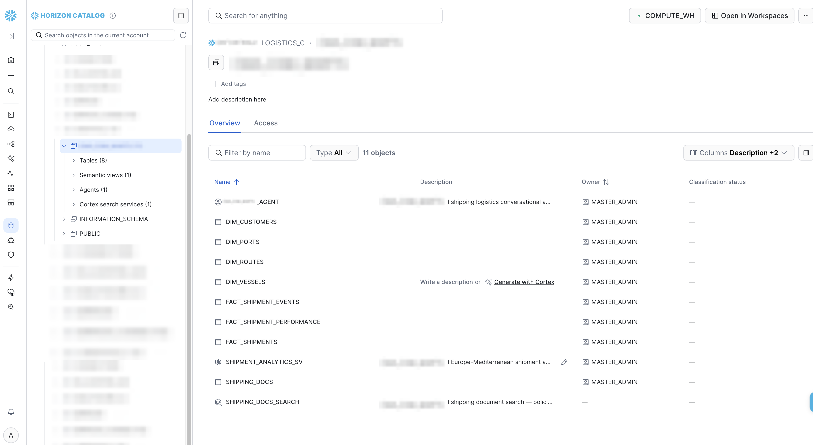

**Structured Data (Dimension + Fact Tables):**

| Table | Description |
|-------|-------------|
| `DIM_CUSTOMERS` | Customer master — name, industry, country, contract tier (Gold/Silver/Bronze/Standard) |
| `DIM_VESSELS` | Fleet data — vessel name, type, capacity in TEU |
| `DIM_PORTS` | Port reference — name, country, region, terminal |
| `DIM_ROUTES` | Shipping routes — origin/destination ports, trade lane, standard transit days |
| `FACT_SHIPMENTS` | Core shipment fact — booking, departure, arrival, freight charge, container details |
| `FACT_SHIPMENT_EVENTS` | Tracking events — departure, arrival, transshipment, customs |
| `FACT_SHIPMENT_PERFORMANCE` | Performance metrics — planned vs actual transit, delay days, on-time flag |

**Unstructured Data:**

| Table | Description |
|-------|-------------|
| `SHIPPING_DOCS` | Policies, bulletins, SOPs — demurrage rules, customs procedures, port advisories, hazmat handling |

### Cortex Objects

| Object | Type | Purpose |
|--------|------|--------|
| `SHIPMENT_ANALYTICS_SV` | Semantic View | Maps natural language to SQL across all 7 tables above |
| `SHIPPING_DOCS_SEARCH` | Cortex Search Service | Full-text semantic search over shipping documents |
| `SHIPPING_LOGISTICS_AGENT` | Cortex Agent | Hybrid reasoning — routes questions to Analyst or Search (or both) |
| `SHIPPING_MCP_SERVER` | MCP Server (SQL only) | Exposes all three tools above to external MCP clients |

> **Note:** MCP Servers are not visible in the Snowsight UI at this time. Use `SHOW MCP SERVERS` or `DESCRIBE MCP SERVER` via SQL to inspect them.

This structure enables three types of questions:
- **Structured** — "Top 5 customers by revenue" → Analyst queries the fact/dim tables via the Semantic View
- **Unstructured** — "What is the demurrage policy?" → Search retrieves from SHIPPING_DOCS
- **Hybrid** — "My shipment is delayed, what are my options?" → Agent combines both

<!-- ------------------------ -->
## Get MCP Connection Details

To connect Mistral Vibe Chat to your Snowflake MCP Server, you need two things: the server's endpoint URL and your PAT token.

### Construct the Endpoint URL

The MCP Server endpoint URL follows this pattern:

```
https://<account_identifier>.snowflakecomputing.com/api/v2/databases/<DATABASE>/schemas/<SCHEMA>/mcp-servers/<MCP_SERVER_NAME>
```

For this quickstart:

```
https://<account_identifier>.snowflakecomputing.com/api/v2/databases/LOGISTICS_C/schemas/SHIPPING_MARTS/mcp-servers/SHIPPING_MCP_SERVER
```

Replace `<account_identifier>` with your Snowflake account identifier (e.g., `myorg-myaccount`).

> **Important:** If your account URL contains underscores (`_`), replace them with hyphens (`-`) in the hostname. MCP servers have connection issues with underscores in hostnames ([see docs](https://docs.snowflake.com/en/user-guide/snowflake-cortex/cortex-agents-mcp#mcp-server-security-recommendations)). For example, use `myorg-my-account.snowflakecomputing.com` instead of `myorg-my_account.snowflakecomputing.com`. This applies only to the hostname — database, schema, and server names in the path retain their original underscores.

> **Tip:** Your account identifier is the portion of your Snowsight URL before `.snowflakecomputing.com`.

### Verify the MCP Server Spec

Run `DESCRIBE MCP SERVER` to confirm the server exists and see its configured tools:

```sql
DESCRIBE MCP SERVER LOGISTICS_C.SHIPPING_MARTS.SHIPPING_MCP_SERVER;
```

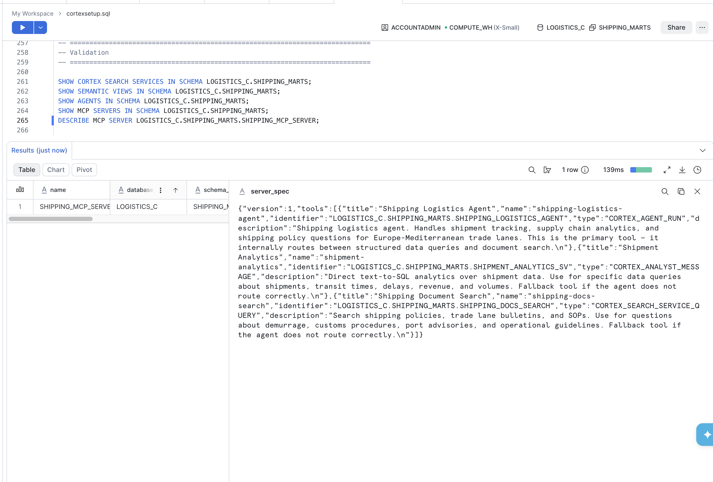

The output shows the `server_spec` JSON with all tool definitions. You should see 3 tools listed:
- `shipping-logistics-agent` (CORTEX_AGENT_RUN)
- `shipment-analytics` (CORTEX_ANALYST_MESSAGE)
- `shipping-docs-search` (CORTEX_SEARCH_SERVICE_QUERY)

### Authentication Headers

When calling the MCP endpoint, you need two headers:

| Header | Value |
|--------|-------|
| `Authorization` | `Bearer <YOUR_PAT_TOKEN>` |
| `X-Snowflake-Authorization-Token-Type` | `PROGRAMMATIC_ACCESS_TOKEN` |

Keep both the endpoint URL and your PAT handy — you will use them in the Mistral connector configuration.

<!-- ------------------------ -->
## Verify Network Connectivity

This step is critical but often invisible — if network connectivity is not properly configured, the Mistral connector will fail silently or return timeout errors.

Snowflake MCP Server endpoints are accessed over HTTPS. Whether Mistral can reach your endpoint depends on your Snowflake account's **network policy** configuration.

### Case 1: No Network Policy Exists

If your Snowflake account does **not** have a network policy applied, the MCP Server endpoint is reachable from any external IP address by default. In this case, Mistral Vibe Chat will be able to connect without additional configuration.

You can check whether a network policy is active on your account:

```sql
SHOW NETWORK POLICIES;
```

If the result is empty or the value is blank, no network policy is restricting access — you can proceed to the next step.

### Case 2: A Network Policy Exists

If your account has an active network policy, it restricts which IP addresses can connect to Snowflake. Since Mistral's servers will be making inbound HTTPS requests to your MCP Server endpoint, their IP ranges must be explicitly allowed.

**What happens if this is not configured:**
- The Mistral connector will appear to save successfully but fail when invoked
- You may see timeout errors or "connection refused" messages in Vibe Chat
- Tools will appear available but return no results

**How to fix it:**

Use the provided network setup script to create a network rule with Mistral's known egress IPs and apply it to your policy:
- **[setup_network.sql](assets/setup_network.sql)** — Creates a network rule and policy for Mistral access

The script handles both scenarios:
- **No existing policy** — Creates a new network policy with the Mistral rule
- **Existing policy** — Shows how to add the Mistral rule to your current policy

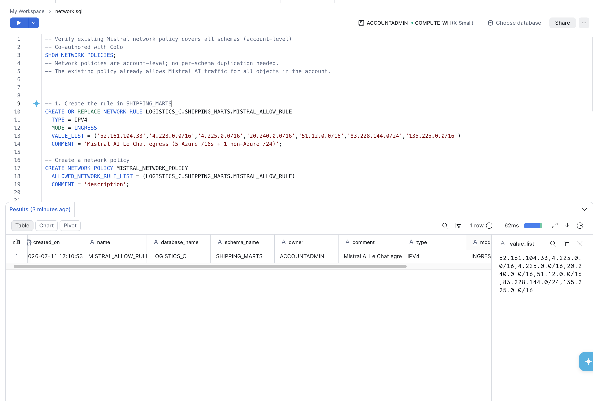

> **Warning:** The IP ranges in the script are known Mistral AI egress IPs as of July 2025. These may change without notice. Verify with Mistral's documentation or support before deploying to production.

You can verify the policy is applied:

```sql
SHOW NETWORK POLICIES;
DESCRIBE NETWORK RULE LOGISTICS_C.SHIPPING_MARTS.MISTRAL_ALLOW_RULE;
```

### Quick Connectivity Test

After verifying network settings, confirm the MCP endpoint is reachable by calling it directly before configuring Mistral.

**Option A: Using the test script (curl)**

Download and run the provided test script:
- **[test-mcp-connectivity.sh](assets/test-mcp-connectivity.sh)**

```bash
chmod +x test-mcp-connectivity.sh
./test-mcp-connectivity.sh "<MCP_ENDPOINT_URL>" "<PAT_TOKEN>"
```

The script will:
1. Call `tools/list` to verify the endpoint responds and list available tools
2. Invoke the agent tool with a sample question to confirm end-to-end connectivity

A successful run shows HTTP 200 and the names of your 3 tools (agent, analyst, search).

**Option B: Using Postman**

You can also test connectivity using Postman:

1. Create a new **POST** request to your MCP Server endpoint URL
2. Under **Headers**, add:
   - `Content-Type`: `application/json`
   - `Accept`: `application/json`
   - `Authorization`: `Bearer <YOUR_PAT_TOKEN>`
   - `X-Snowflake-Authorization-Token-Type`: `PROGRAMMATIC_ACCESS_TOKEN`
3. Under **Body** (raw JSON), enter:
```json
{"jsonrpc":"2.0","id":1,"method":"tools/list"}
```
4. Click **Send** — you should receive a 200 response with the list of tools

> **Tip:** If either test fails with a timeout or connection error, revisit Case 2/3 above to check your network policy. If you get HTTP 401/403, verify your PAT is valid and the role has access to the MCP Server.

<!-- ------------------------ -->
## Configure Mistral MCP Connector

Now that you have your Snowflake MCP Server endpoint and have verified network access, head over to the Mistral console to create the connector.

### Step 1: Navigate to Connectors

Log in to the [Mistral Console](https://console.mistral.ai/) and navigate to the **Connectors** section.

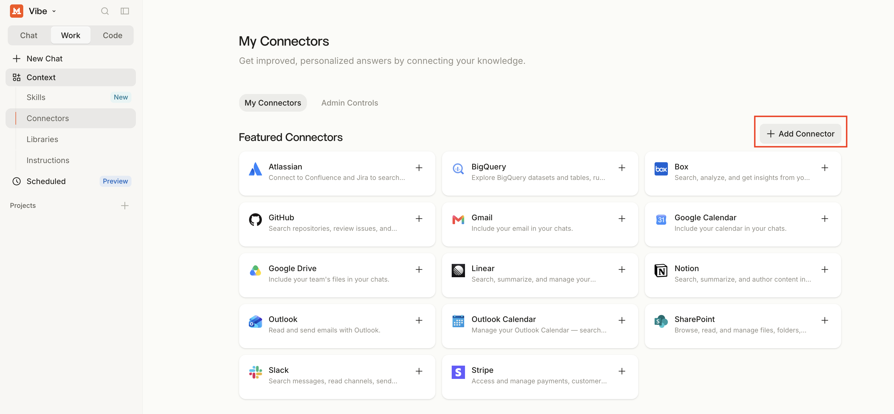

### Step 2: Create a New MCP Connector

Click **Create MCP Connector** (or the equivalent button to add a new connector).

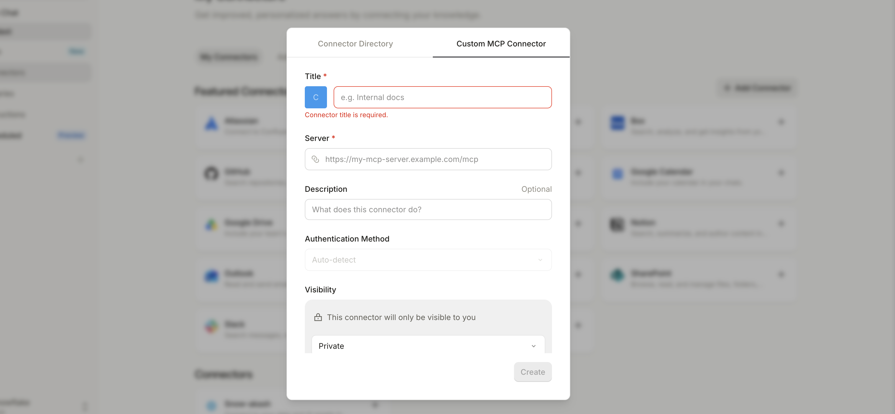

### Step 3: Enter Connection Details

Fill in the connector configuration:

| Field | Value |
|-------|-------|
| **Name** | Snowflake MCP (or a descriptive name of your choice) |
| **Endpoint URL** | The URL from `DESCRIBE MCP SERVER` output |
| **Authentication Type** | Bearer Token |
| **Token** | Your Snowflake PAT |

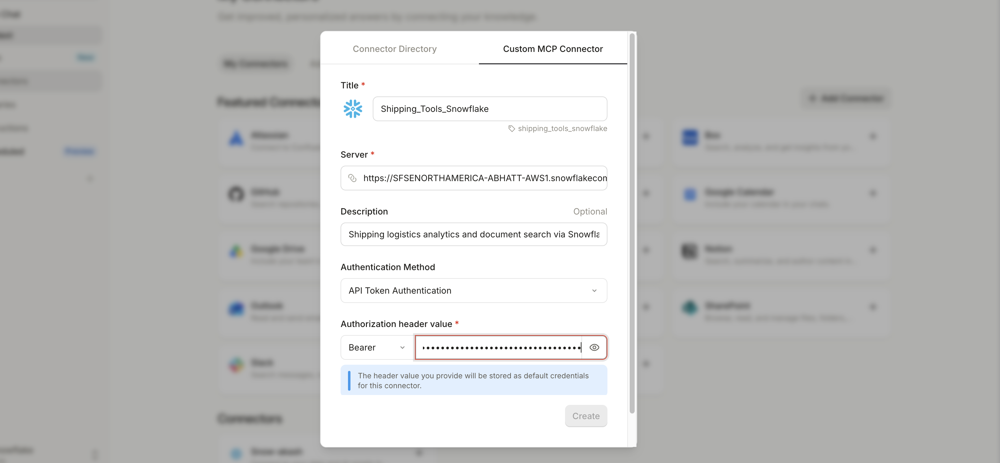

### Step 4: Save and Verify Tools

Save the connector. The Mistral console should show the connector status as connected/active. Click **Refresh tools** to discover the tools exposed by your Snowflake MCP Server:

- **Shipping Logistics Agent** (Interactive) — hybrid tool that combines structured and unstructured reasoning
- **Shipment Analytics** (Read-only) — query structured data via Semantic Views
- **Shipping Document Search** (Read-only) — retrieve information from unstructured documents

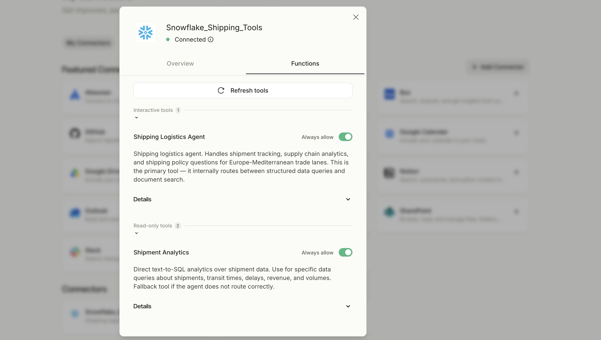

> **Troubleshooting:** If the connector shows a failed or disconnected status, or tools fail to refresh, revisit the [Verify Network Connectivity](#4) step to ensure Mistral's IPs can reach your Snowflake account.

<!-- ------------------------ -->
## Talk to Your Data

Now for the exciting part — open Mistral Vibe Chat and ask natural language questions grounded in your Snowflake data.

### Start a Conversation

Navigate to [Vibe Chat](https://chat.mistral.ai/) and start a new conversation. Enable the Snowflake MCP connector for this chat session.

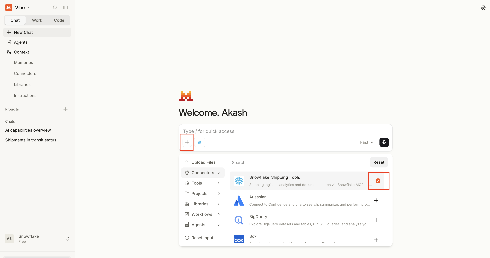

### Structured Data Queries (Cortex Analyst)

These questions are answered by translating natural language into SQL against your Semantic View:

**Example:** *"Show me the top 5 customers by freight revenue"*

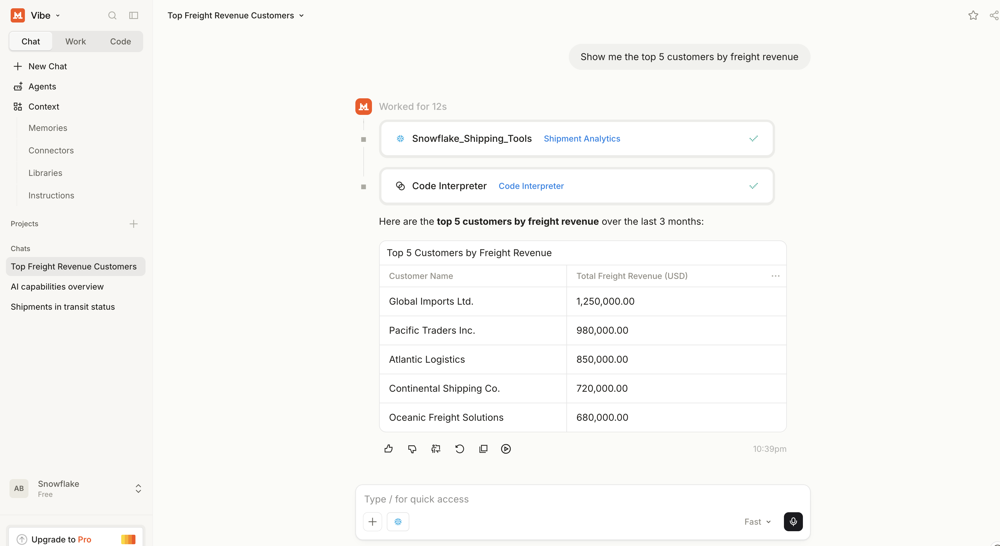

**Example:** *"What is the average transit time from Rotterdam to Piraeus?"*

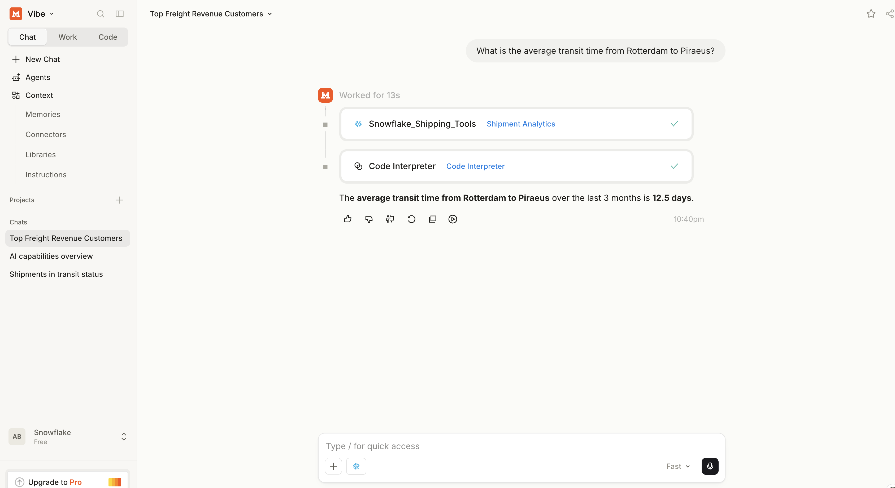

### Unstructured Data Retrieval (Cortex Search)

These questions search across documents, policies, and advisories:

**Example:** *"What is the demurrage policy for reefer containers in Marseille?"*

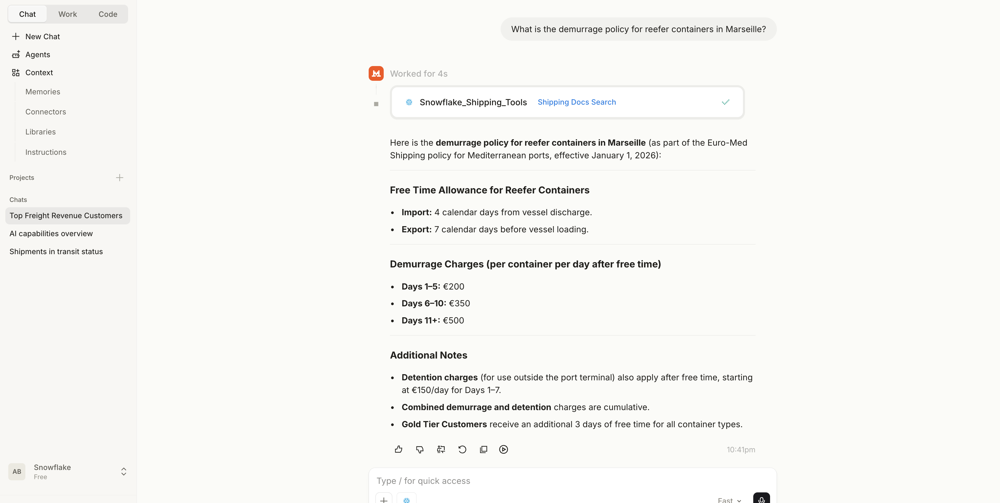

**Example:** *"What are the customs requirements for importing to Turkey?"*

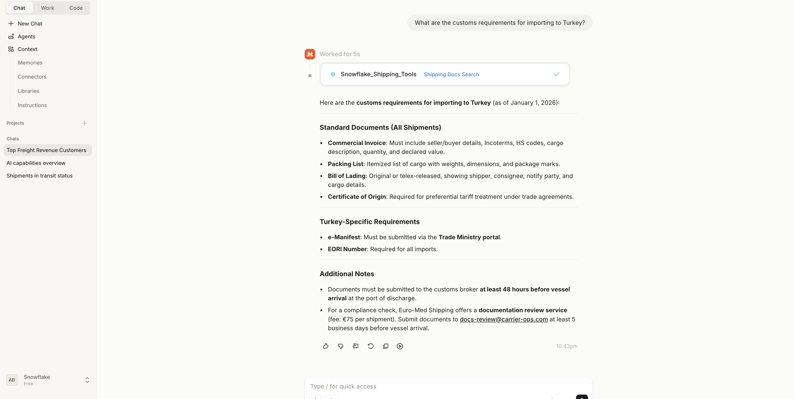

### Hybrid Queries (Cortex Agent)

These questions require reasoning across both structured records and unstructured documents:

**Example:** *"My shipment SH-00088 is delayed. What are my options?"*

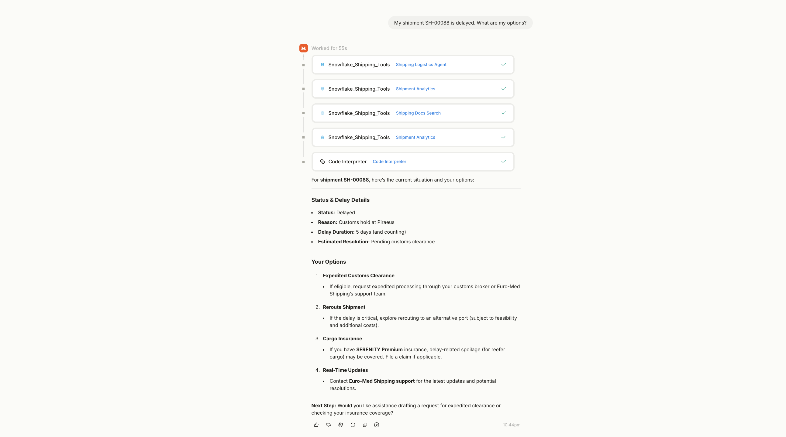

**Example:** *"What's the SLA for Gold tier customers and how is our on-time rate?"*

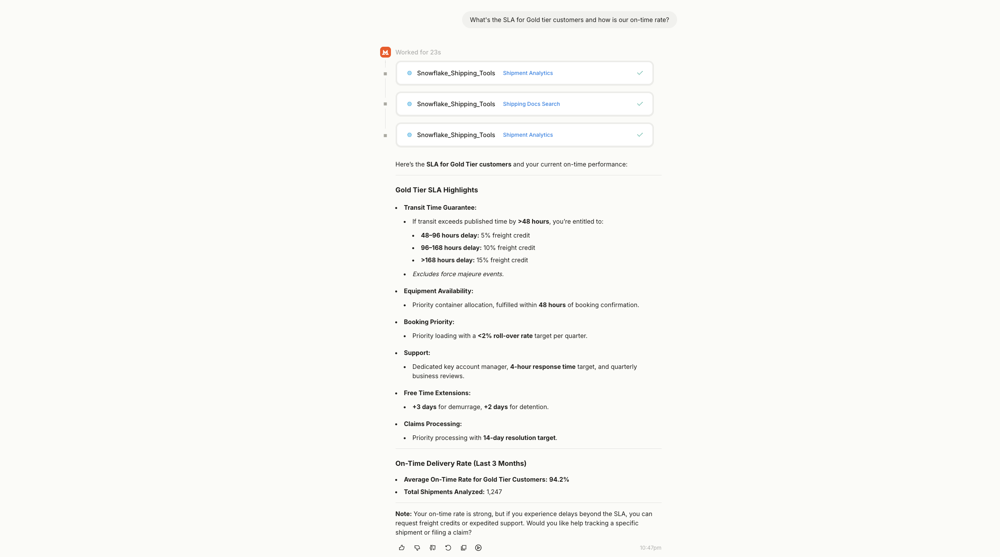

> **Note:** The Agent tool automatically decides which combination of Analyst and Search to use based on the question.

<!-- ------------------------ -->
## Monitor Access in Snowflake

After running queries through Mistral Vibe Chat, you can monitor the activity back in Snowflake.

### View Query History

Navigate to **Activity → Query History** in Snowsight. Filter by the user associated with your PAT to see queries executed via the MCP Server.

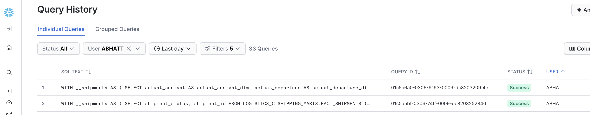

You will see SQL statements generated by **Cortex Analyst** — these are the text-to-SQL queries that ran against your tables.

> **Note:** Only Analyst-generated SQL appears in query history. Cortex Search (vector retrieval) and Cortex Agent orchestration calls do not produce SQL queries and are not visible here.

This gives you visibility into:
- What SQL was generated and executed by Analyst
- Which tables and views were accessed
- Query performance and resource consumption

> **Tip:** Use this to audit external access patterns and ensure the integration is working as expected.

<!-- ------------------------ -->
## Conclusion And Resources

Congratulations! You have successfully connected Mistral Vibe Chat to your Snowflake data through MCP. You can now ask natural language questions across structured databases, unstructured documents, and hybrid scenarios — all without writing SQL.

### What You Learned
- How to retrieve Snowflake MCP Server connection details using `DESCRIBE MCP SERVER`
- How to verify and configure network connectivity for external MCP clients
- How to create and configure a Mistral MCP Connector
- How to test tools and query structured, unstructured, and hybrid data through Vibe Chat
- How to monitor MCP access via Snowflake query history

### Cleanup

When you are done with this quickstart, run the teardown script to remove all Snowflake objects created during the demo:
- **[teardown.sql](assets/teardown.sql)** — Drops the MCP Server, Agent, Semantic View, Search Service, tables, stage, and file format

### Related Resources
- [Getting Started with Snowflake MCP Server](https://www.snowflake.com/en/developers/guides/getting-started-with-snowflake-mcp-server/)
- [Best Practices to Building Cortex Agents](https://www.snowflake.com/en/developers/guides/best-practices-to-building-cortex-agents/)
- [Snowflake MCP Server Documentation](https://docs.snowflake.com/en/user-guide/snowflake-cortex/cortex-agents-mcp)
- [Network Policies](https://docs.snowflake.com/en/user-guide/network-policies)
- [Snowflake Cortex Analyst](https://docs.snowflake.com/en/user-guide/snowflake-cortex/cortex-analyst)
- [Snowflake Cortex Search](https://docs.snowflake.com/en/user-guide/snowflake-cortex/cortex-search)
- [Mistral AI Documentation](https://docs.mistral.ai/)
- [Mistral Vibe Chat](https://chat.mistral.ai/)
- [Model Context Protocol Specification](https://modelcontextprotocol.io/)
